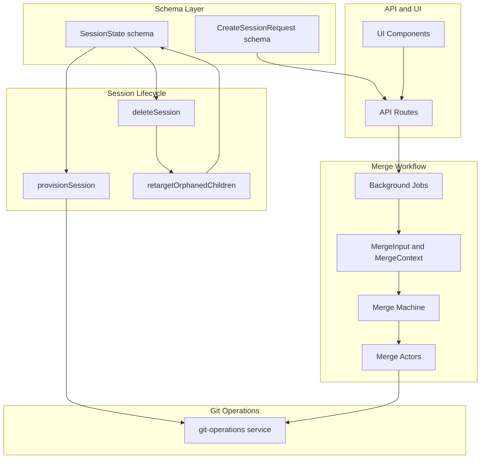
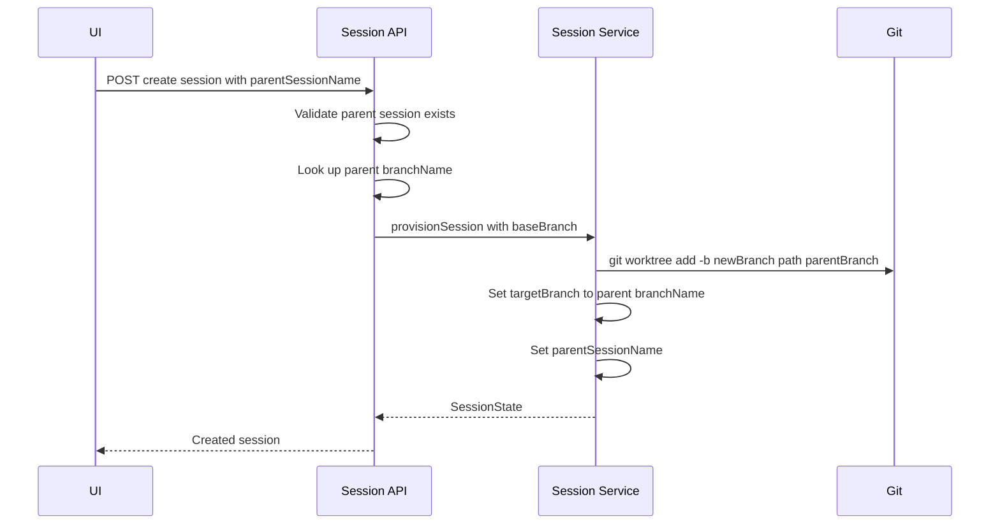
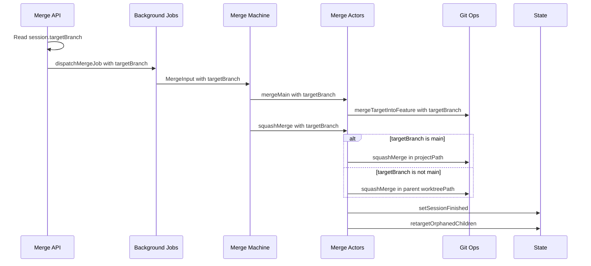
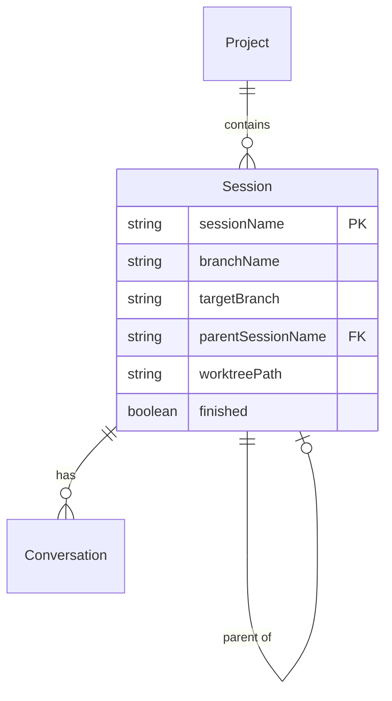

# Technical Design: Session Branching

## Overview
**Purpose**: This feature enables hierarchical session workflows in Command Center by allowing sessions to branch from any existing session's branch (not just `main`), tracking parent-child relationships, and directing merge workflows to the correct target branch.

**Users**: Developers using CC for multi-session parallel development will create child sessions to subdivide work within a parent session's scope, then merge child work into the parent branch before the parent merges into main.

**Impact**: Changes session creation, git operations, merge workflows, and UI components to replace hardcoded `"main"` references with a configurable `targetBranch` per session.

### Goals
- Enable creating sessions from any existing session's branch
- Track parent-child session relationships for UI navigation and merge targeting
- Direct all git operations (diffs, logs, merges) to the session's `targetBranch`
- Automatically retarget orphaned child sessions when a parent is merged or deleted
- Maintain full backward compatibility with existing sessions (no migration)

### Non-Goals
- Multi-level cascade retargeting (grandchild → parent instead of → main)
- UI for visualizing full session hierarchy trees
- Cross-project session branching
- Branch protection rules or merge policies per target branch

## Architecture

### Existing Architecture Analysis
The current system creates all sessions as worktrees from `main` and merges back into `main`. This assumption is embedded in:
- `provisionSession()` — hardcodes `main` as the base branch for `git worktree add`
- `git-operations.ts` — six functions hardcode `"main"` as comparison/merge target
- Merge workflow types (`MergeInput`, `MergeContext`, actor inputs) — no `targetBranch` field
- `squashMerge()` — runs in project root (implicitly on main)
- UI components and API routes — hardcoded `"main"` strings in 12+ locations

### Architecture Pattern & Boundary Map



**Architecture Integration**:
- Selected pattern: Extend existing components — add `targetBranch` parameter throughout the call chain
- Domain boundaries: No new modules; changes are additive to existing schema, session, git, merge, and UI layers
- Existing patterns preserved: Zod schema-first, DI service factories, XState actor inputs, background job dispatch
- New components: `retargetOrphanedChildren()` utility function — single new addition

### Technology Stack

| Layer | Choice / Version | Role in Feature | Notes |
|-------|------------------|-----------------|-------|
| Data / Storage | Zod v4 schemas + JSON state file | Session state with new `targetBranch` and `parentSessionName` fields | `.default()` for backward compat |
| Backend / Services | git-operations service, sessions service | Parameterized target branch in all git commands | Rename `mergeMainIntoFeature` → `mergeTargetIntoFeature` |
| Workflow | XState merge machine | Thread `targetBranch` through input → context → actors | No structural machine changes |
| Frontend | React components | Dynamic branch name display | String interpolation updates |

## System Flows

### Child Session Creation Flow



### Merge with Target Branch Flow



## Requirements Traceability

| Requirement | Summary | Components | Interfaces | Flows |
|-------------|---------|------------|------------|-------|
| 1.1, 1.2, 1.3 | Session state schema with targetBranch and parentSessionName | SessionState schema | sessionStateSchema | — |
| 1.4 | targetBranch as git source of truth | git-operations, merge workflow | All git operation functions | Merge flow |
| 2.1, 2.2, 2.3 | Create session request with parentSessionName validation | CreateSessionRequest schema, API route | createSessionRequestSchema, session creation API | Creation flow |
| 3.1, 3.2, 3.3, 3.4 | Child session provisioning from parent branch | provisionSession | provisionSession opts | Creation flow |
| 4.1, 4.2, 4.3, 4.4, 4.5 | Git operations with configurable target branch | git-operations service, merge-detection service | 6 function signatures | Merge flow |
| 5.1, 5.2, 5.3, 5.4, 5.5, 5.6 | Merge workflow threading targetBranch | MergeInput, MergeContext, actors, background-jobs, notification builder | Merge type interfaces | Merge flow |
| 6.1, 6.2, 6.3, 6.4 | Orphan retargeting on parent merge/delete/external detection | retargetOrphanedChildren, squashMergeActor, deleteSession, merge-detection | retargetOrphanedChildren | Merge flow |
| 7.1, 7.2, 7.3, 7.4, 7.5, 7.6 | Dynamic branch name display in UI and routes | SmartMergeDialog, MergeToast, SessionDetailPage, DiffPanel, SessionDiffViewer, commit routes | Component props, notification messages | — |

## Components and Interfaces

| Component | Domain/Layer | Intent | Req Coverage | Key Dependencies | Contracts |
|-----------|-------------|--------|--------------|------------------|-----------|
| sessionStateSchema | Schema | Track target branch and parent session | 1.1–1.4 | Zod v4 (P0) | State |
| createSessionRequestSchema | Schema | Accept parent session in creation | 2.1–2.3 | Zod v4 (P0) | State |
| provisionSession | Session Lifecycle | Create worktree from any base branch | 3.1–3.4 | git, state (P0) | Service |
| git-operations service | Git | Parameterized target branch operations | 4.1–4.5 | git CLI (P0) | Service |
| merge-detection service | Git | Use targetBranch in external merge detection | 4.4, 6.4 | git-operations (P0) | Service |
| Merge workflow types | Merge | Thread targetBranch through workflow | 5.1–5.2 | XState (P0) | State |
| Merge actors | Merge | Use targetBranch in git operations | 5.3–5.5 | git-operations (P0) | Service |
| Background jobs / notifications | Merge | Include targetBranch in job dispatch and notification messages | 5.4–5.6, 7.4 | background-jobs (P0) | Service |
| retargetOrphanedChildren | Session Lifecycle | Retarget children on parent merge/delete/external detection | 6.1–6.4 | state (P0) | Service |
| Commit routes | API | Pass targetBranch to git operation calls | 7.6 | git-operations (P0) | — |
| UI components | Frontend | Dynamic branch name display | 7.1–7.3, 7.5 | Session state (P0) | — |

### Schema Layer

#### sessionStateSchema Extension

| Field | Detail |
|-------|--------|
| Intent | Add targetBranch and parentSessionName fields to session state |
| Requirements | 1.1, 1.2, 1.3, 1.4 |

**Responsibilities & Constraints**
- Define `targetBranch` and `parentSessionName` as schema fields with backward-compatible defaults
- `targetBranch` is the authoritative reference for all git operations on this session
- `parentSessionName` is a convenience reference for UI; may become stale if parent is renamed (sessions cannot be renamed currently)

**Contracts**: State [x]

##### State Management
```typescript
// Additions to sessionStateSchema in src/lib/sessions/schemas.ts
{
  targetBranch: z.string().default("main"),
  parentSessionName: z.string().nullable().default(null),
}
```
- Persistence: JSON state file with atomic writes
- Backward compatibility: Zod `.default()` — existing sessions parse with `targetBranch: "main"` and `parentSessionName: null`

#### createSessionRequestSchema Extension

| Field | Detail |
|-------|--------|
| Intent | Accept optional parentSessionName in session creation requests |
| Requirements | 2.1, 2.2, 2.3 |

**Contracts**: State [x]

##### State Management
```typescript
// Addition to each variant of createSessionRequestSchema
{
  parentSessionName: z.string().trim().min(1).optional(),
}
```
- Validation: When provided, API route validates parent session exists in the same project and has an active (non-finished, non-archived) branch

### Session Lifecycle

#### provisionSession Extension

| Field | Detail |
|-------|--------|
| Intent | Create worktrees from any base branch, set target branch and parent session |
| Requirements | 3.1, 3.2, 3.3, 3.4 |

**Responsibilities & Constraints**
- Accept optional `baseBranch` parameter (defaults to `"main"`)
- When `baseBranch` is provided, use it in `git worktree add -b <newBranch> <path> <baseBranch>`
- Set `targetBranch` and `parentSessionName` on the created session state

**Dependencies**
- Outbound: git CLI — worktree creation (P0)
- Outbound: state.ts — persist session (P0)

**Contracts**: Service [x]

##### Service Interface
```typescript
// Extended opts parameter for provisionSession
interface ProvisionSessionOpts {
  mode: SessionCreationMode;
  objective: string | null;
  tddEnabled?: boolean;
  baseBranch?: string;          // defaults to "main"
  targetBranch?: string;        // defaults to "main"; set to parent's branchName for child sessions
  parentSessionName?: string;   // set to parent's sessionName for child sessions
}
```
- Preconditions: `baseBranch` must be a valid ref in the repository
- Postconditions: Worktree created from `baseBranch`; session state includes `targetBranch` and `parentSessionName`

**Implementation Notes**
- The session creation API route validates `parentSessionName` and resolves the parent's `branchName`. It then passes `baseBranch`, `targetBranch`, and `parentSessionName` as part of the options to the existing creation functions.
- The three creation functions (`createSessionFast`, `createSessionFocus`, `createSessionOptimistic`) accept the new optional fields in their options parameter and thread them through to `provisionSession()`, which performs the actual `git worktree add` with the resolved base branch.

#### retargetOrphanedChildren

| Field | Detail |
|-------|--------|
| Intent | Retarget child sessions to main when parent is merged or deleted |
| Requirements | 6.1, 6.2, 6.3 |

**Responsibilities & Constraints**
- Find all sessions in the same project where `parentSessionName` matches the given session name
- Set their `targetBranch` to `"main"` and `parentSessionName` to `null`
- Only retargets direct children (not transitive descendants)

**Dependencies**
- Outbound: state.ts — mutateState (P0)

**Contracts**: Service [x]

##### Service Interface
```typescript
function retargetOrphanedChildren(
  projectPath: string,
  parentSessionName: string,
): Promise<void>;
```
- Preconditions: Called before parent session is removed from state (for delete) or after parent is marked finished (for merge)
- Postconditions: All direct children have `targetBranch: "main"` and `parentSessionName: null`

**Implementation Notes**
- Called from `squashMergeActor` after `setSessionFinished()` and from `deleteSession()` before removing the session from state
- Uses `mutateState()` for atomic update of all affected children

### Git Operations

#### git-operations Service Extension

| Field | Detail |
|-------|--------|
| Intent | Accept targetBranch parameter in all functions that currently hardcode main |
| Requirements | 4.1, 4.2, 4.3, 4.4, 4.5 |

**Responsibilities & Constraints**
- Add `targetBranch` parameter (default `"main"`) to all affected functions
- Replace all hardcoded `"main"` string literals with the parameter
- Rename `mergeMainIntoFeature` → `mergeTargetIntoFeature` to reflect generalized behavior
- Rename `isBranchAncestorOfMain` → `isBranchAncestorOfTarget` and `isBranchMentionedInMainLog` → `isBranchMentionedInTargetLog`

**Contracts**: Service [x]

##### Service Interface
```typescript
// Updated function signatures (default "main" when parameter not provided)

function getCommitLog(
  worktreePath: string,
  targetBranch?: string,        // default "main"
): Promise<CommitLogEntry[]>;

function getCommitDiff(
  worktreePath: string,
  commitHash: string,
  targetBranch?: string,        // default "main"
): Promise<SessionDiff>;

function mergeTargetIntoFeature(
  worktreePath: string,
  targetBranch?: string,        // default "main"
): Promise<MergeMainResult>;

function isBranchAncestorOfTarget(
  projectPath: string,
  branchName: string,
  targetBranch?: string,        // default "main"
): Promise<boolean>;

function isBranchMentionedInTargetLog(
  projectPath: string,
  branchName: string,
  targetBranch?: string,        // default "main"
): Promise<boolean>;

function squashMerge(
  mergePath: string,            // projectPath for main; parent worktreePath for non-main
  branchName: string,
  message: string,
  targetBranch?: string,        // default "main"
): Promise<{ mergeHash: string }>;
```
- The `squashMerge` function's first parameter changes semantically: for `targetBranch === "main"` it receives `projectPath` (current behavior); for non-main targets it receives the parent session's `worktreePath`
- All callers of renamed functions (`mergeMainIntoFeature` → `mergeTargetIntoFeature`, `isBranchAncestorOfMain` → `isBranchAncestorOfTarget`, `isBranchMentionedInMainLog` → `isBranchMentionedInTargetLog`) must be updated at the call site — no backward-compat re-exports

### Merge Workflow

#### Merge Types Extension

| Field | Detail |
|-------|--------|
| Intent | Add targetBranch to MergeInput and MergeContext |
| Requirements | 5.1, 5.2 |

**Contracts**: State [x]

##### State Management
```typescript
// Addition to MergeInput in types.ts
interface MergeInput {
  // ... existing fields ...
  targetBranch?: string;         // default "main"
  targetWorktreePath?: string;   // parent worktree path for non-main squash merges
}

// Addition to MergeContext in types.ts
interface MergeContext extends BaseWorkflowContext {
  // ... existing fields ...
  targetBranch: string;          // resolved from input, default "main"
  targetWorktreePath: string | null;  // null when targeting main
}
```

#### Merge Actors Extension

| Field | Detail |
|-------|--------|
| Intent | Thread targetBranch to git operation calls |
| Requirements | 5.3, 5.4, 5.5 |

**Contracts**: Service [x]

##### Service Interface
```typescript
// Updated actor input types
interface MergeMainInput {
  worktreePath: string;
  targetBranch: string;          // new
}

interface SquashMergeInput {
  projectPath: string;
  branchName: string;
  message: string;
  targetBranch: string;          // new
  targetWorktreePath: string | null;  // new — parent worktree for non-main
}
```

**Implementation Notes**
- `mergeMain` actor: calls `mergeTargetIntoFeature(input.worktreePath, input.targetBranch)`
- `squashMergeActor`: when `targetBranch !== "main"`, passes `targetWorktreePath` as the merge path to `squashMerge()` instead of `projectPath`. Lock acquisition continues to use `projectPath` as the key (project-level lock is correct since all squash merges mutate the same repository metadata).
- `resolveConflictsActor`: no changes to actor logic needed — conflict resolution operates on the in-progress merge state in the worktree regardless of target branch. However, the resolve-conflicts dispatch path includes `targetBranch` in `MergeInput` so the machine context is correctly initialized.
- Machine context initializer: maps `input.targetBranch ?? "main"` to `context.targetBranch`

#### Background Jobs Extension

| Field | Detail |
|-------|--------|
| Intent | Include targetBranch in merge and resolve-conflicts dispatch |
| Requirements | 5.4, 5.5 |

**Implementation Notes**
- `dispatchMergeJob()` and `dispatchResolveConflictsJob()` accept `targetBranch` and `targetWorktreePath` and include them in the `MergeInput`
- API routes read `session.targetBranch` from state and resolve the parent worktree path when `targetBranch !== "main"`

#### Notification and Toast Data Path

| Field | Detail |
|-------|--------|
| Intent | Thread targetBranch through background job and notification models so toast UI can display the correct branch |
| Requirements | 5.6, 7.2, 7.4 |

**Implementation Notes**
- The merge commit message string (constructed in merge/resolve-conflicts routes) already uses `targetBranch` — this message is passed through `dispatchMergeJob()` into the merge workflow
- The notification message builder (`buildNotificationMessage` in `background-jobs.ts`) constructs user-facing text from the `BackgroundJob`. Add `targetBranch` to the `BackgroundJob` type so the notification message can reference it (e.g., "Branch X merged into Y" instead of just "Branch X merged successfully")
- The `MergeToast` component receives notification data via the notification store. The notification's `message` field will contain the pre-formatted text including the target branch name — no additional prop plumbing needed on the toast component itself
- Approach: Use pre-formatted notification messages that include the target branch, rather than adding `targetBranch` as a separate field on `Notification`, `JobStatusEvent`, and `JobDispatchResponse` types

### Merge Detection

#### merge-detection Service Extension

| Field | Detail |
|-------|--------|
| Intent | Use targetBranch in external merge detection and trigger orphan retargeting |
| Requirements | 4.4, 6.1, 6.4 |

**Responsibilities & Constraints**
- The merge detection system (`merge-detection.ts`) checks whether a session's branch has been merged externally (outside the smart-merge workflow)
- Its DI deps reference `isBranchAncestorOfMain` and `isBranchMentionedInMainLog` — both must be updated to the renamed variants and accept `targetBranch`
- When external merge is detected and the session is marked finished, `retargetOrphanedChildren()` must also be called

**Implementation Notes**
- Update the DI deps interface to reference `isBranchAncestorOfTarget` and `isBranchMentionedInTargetLog`
- Pass `session.targetBranch` (defaulting to `"main"`) to both detection calls
- After marking a session as finished via external merge detection, call `retargetOrphanedChildren()` to handle any child sessions
- Centralize `retargetOrphanedChildren()` calls: it should be invoked from all session-finish paths (squash merge actor, external merge detection, and session deletion)

### API Routes

#### Session Creation Route

**Implementation Notes**
- When `parentSessionName` is provided: validate parent exists, extract `branchName`, pass `baseBranch`, `targetBranch`, and `parentSessionName` to the creation function
- Error 400 if parent session not found, finished, or archived

#### Commit Log and Commit Diff Routes

**Implementation Notes**
- The commit log route (`/api/projects/[name]/sessions/[session]/commits`) must pass `session.targetBranch` to `getCommitLog()`
- The commit diff route (`/api/projects/[name]/sessions/[session]/commits/[hash]/diff`) must pass `session.targetBranch` to `getCommitDiff()`
- Both routes already have access to the session state; this is a one-line change per route

#### Merge Route and Resolve-Conflicts Route

**Implementation Notes**
- Read `session.targetBranch` from state (defaults to `"main"`)
- When `targetBranch !== "main"`, resolve the parent session's worktree path
- Include `targetBranch` and `targetWorktreePath` in merge message and dispatch call
- Merge message: `` `Merge ${session.branchName} into ${session.targetBranch}` ``

### Frontend

#### BranchSelector — Parent Session Selector

| Field | Detail |
|-------|--------|
| Intent | Allow users to select a parent session when creating a new session |
| Requirements | 2.1, 3.1 |

**Responsibilities & Constraints**
- Displays a radio-list of branch options: `main` (default) plus one entry per active (non-finished, non-archived) session in the project
- Each session entry shows the session's `branchName` as primary text, with session name as secondary
- Selection sets the parent session context for the creation form
- When a parent is selected, the form hint updates to show the merge target (e.g., "Merges into: csm/implement-auth")

**Component Interface**
```typescript
interface BranchSelectorProps {
  sessions: Array<{ sessionName: string; branchName: string }>;
  selectedParent: string | null;       // null = main (default)
  onSelect: (sessionName: string | null) => void;
  disabled?: boolean;
}
```

**Visual Design**
- Placed between the mode toggle and the session name/objective input in CreateSessionModal
- Uses `.form-label` ("BRANCH FROM") with a radio-list below
- Each option: mono font, 0.78rem, with radio indicator, branch name, and session name subtitle
- `main` option always first, rendered with `--text-secondary` label
- Selected option: cyan radio indicator, `--text-primary` text
- Scrollable when more than 5 sessions (max-height with overflow-y: auto)
- On mobile (≤768px): full-width, 44px min-height touch targets per option

#### SessionsTable — Target Column and Branch Action

| Field | Detail |
|-------|--------|
| Intent | Show merge target per session and provide a quick-action to create child sessions |
| Requirements | 7.1 |

**Changes**
- Add a "Target" column after "Branch": shows `session.targetBranch`, mono font 0.72rem
  - `main` targets rendered in `--text-tertiary` (de-emphasized, it's the default)
  - Non-main targets rendered in `--cyan` to highlight non-default merge targets
  - Truncated with ellipsis, full name in tooltip
- Add a "Branch" button in the actions column for non-finished sessions
  - Standard `btn btn-sm` style
  - Opens CreateSessionModal with the parent pre-filled
  - Hidden for finished sessions (can't branch from a merged session)

#### UI Components — Dynamic Branch References

All UI components replace hardcoded `"main"` with the session's `targetBranch` from state or API response.

| Component | Change | Requirements |
|-----------|--------|--------------|
| SmartMergeDialog | Replace `main` in description and progress text with `targetBranch`; add "Target" row to `.merge-info` section | 7.1 |
| MergeToast | Add `targetBranch` prop (default `"main"`); success/conflicts detail text reference actual target | 7.2 |
| SessionDetailPage | Replace `main` in finished banner and tooltip with `targetBranch` | 7.3 |
| ConversationList | Replace `main` in tooltip and finished banner with `targetBranch` | 7.3 |
| MergeDialog | Replace `main` in title and description with `targetBranch` | 7.1 |
| MobileActionMenu | Add `targetBranch` prop; replace `main` in button text | 7.1 |
| CreateSessionModal | Integrate BranchSelector; update form hint to show merge target when parent selected | 7.1, 2.1 |
| OptimisticDialog | Adjust merge hint when parent session is provided | 7.1 |
| DiffPanel | Add `targetBranch` prop; replace "Diff vs main" with "Diff vs `<targetBranch>`" | 7.5 |
| SessionDiffViewer | Replace hardcoded "Diff vs main" label with "Diff vs `<targetBranch>`" | 7.5 |

**Implementation Notes**: The `targetBranch` value is available on the `SessionState` type. Components that already receive the session object or branch name prop need the additional `targetBranch` prop. For `MergeToast`, a `targetBranch` prop is added directly to support Storybook stories showing non-main targets.

## Data Models

### Domain Model



**Business Rules & Invariants**:
- `targetBranch` defaults to `"main"` and is always a valid branch reference
- `parentSessionName` is nullable; when set, must reference an existing session in the same project at creation time
- When a parent session is merged or deleted, all direct children are retargeted to `targetBranch: "main"` with `parentSessionName: null`
- A session cannot be its own parent

### Logical Data Model

**New Fields on SessionState**:

| Field | Type | Default | Constraint |
|-------|------|---------|------------|
| `targetBranch` | `string` | `"main"` | Valid git branch name; source of truth for all git operations |
| `parentSessionName` | `string \| null` | `null` | References existing session name in same project, or null |

**New Optional Field on CreateSessionRequest** (all mode variants):

| Field | Type | Constraint |
|-------|------|------------|
| `parentSessionName` | `string \| undefined` | Trimmed, min length 1 when provided |

**Consistency**: Atomic JSON state file writes ensure `targetBranch` and `parentSessionName` are always consistent. Orphan retargeting uses `mutateState()` for transactional updates of all affected children.

## Error Handling

### Error Categories and Responses

**User Errors (4xx)**:
- Invalid `parentSessionName` in creation request → 400 with "Parent session not found" or "Parent session is finished/archived"
- Parent session has no valid branch → 400 with "Parent session branch does not exist"

**System Errors (5xx)**:
- `git worktree add` fails with invalid base branch → 500 with git error details
- Squash merge into non-main target fails because parent worktree was removed externally → 500 with "Target worktree not found"
- Project-level merge lock acquisition timeout → 500 with "Another merge is in progress"

**Orphan Edge Cases**:
- If orphan retargeting fails mid-way (unlikely with atomic state writes), some children may not be retargeted — subsequent merge attempts will fail with a clear git error, and manual retargeting is possible

## Testing Strategy

### Unit Tests
- `sessionStateSchema` parsing with and without new fields (backward compat)
- `createSessionRequestSchema` validation with/without `parentSessionName`
- `retargetOrphanedChildren()` with various child configurations
- Git operation functions with explicit `targetBranch` parameter
- Merge machine with `targetBranch` in input — verify context propagation

### Integration Tests
- Child session creation end-to-end: validate worktree created from parent branch, state fields set correctly
- Merge workflow with non-main target: verify squash merge runs in parent worktree
- Orphan retargeting on parent merge: verify children retargeted before completion
- Orphan retargeting on parent delete: verify children retargeted before state removal
- External merge detection with non-main targets: verify detection checks against `targetBranch` and triggers orphan retargeting
- Notification message includes target branch name for non-main merge jobs

### UI Tests
- SmartMergeDialog displays correct target branch name for child sessions
- MergeToast shows correct branch in success message
- SessionDetailPage finished banner shows correct target branch
