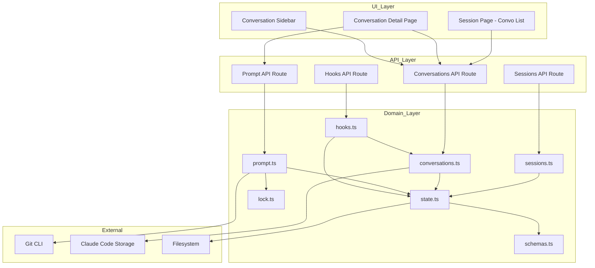
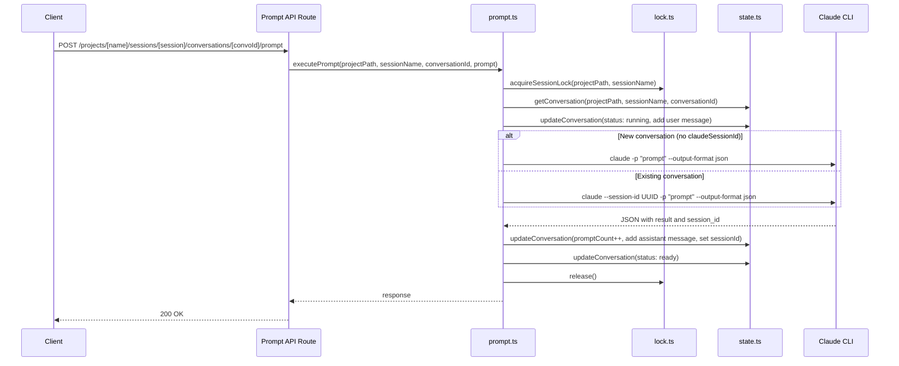
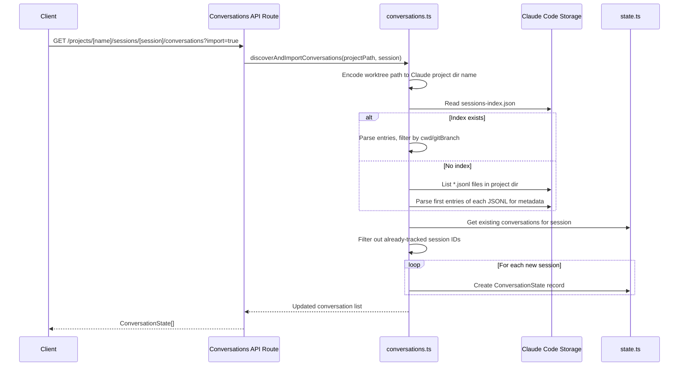
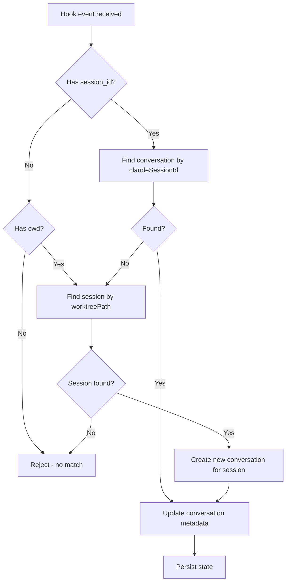
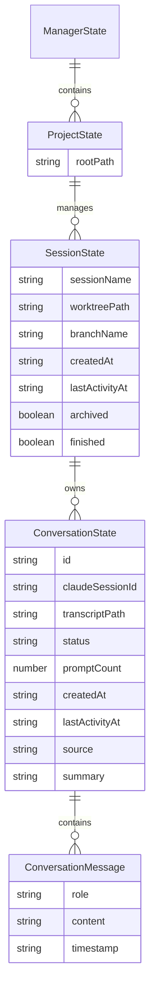

# Technical Design: Session Lifecycle — Conversation Model

> **UPDATED (2026-02-22) — SDK Migration:** Several components described below have been removed or simplified:
>
> - **`hooks.ts (updated)`** and Requirement 16 (Hook Event Routing): Entire hook system removed. The "Hook Event Routing" flow diagram is obsolete.
> - **Auto-Import Discovery**: `discoverAndImportConversations()`, `encodeProjectPath()`, `readSessionsIndex()`, and `~/.claude/projects/` filesystem scanning have been removed from `conversations.ts`. CSM no longer imports conversations from Claude Code's filesystem.
> - **`?import=true` query param**: Removed from the conversations API route.
> - **`-c` flag / `--session-id`**: Prompt continuation now uses SDK `resume: conversationId` option instead.
> - **Components still valid**: `conversationStateSchema`, `sessionStateSchema`, CRUD operations in `conversations.ts`, `deriveSessionStatus/PromptCount/LastActivity`, conversation API routes (GET/POST), prompt API route, UI components.

## Overview

**Purpose**: This feature expands CSM sessions from a one-to-one relationship with Claude Code sessions to a one-to-many relationship by introducing a **Conversation** entity. Each Conversation maps to a single Claude Code session and carries its own status, messages, and metadata. This enables seamless switching between CSM UI and terminal-based Claude Code usage within the same session.

**Users**: Developers who work with Claude Code through both CSM and the CLI will use this to track all their interactions in one place, switch between conversations, and start new ones from either interface.

**Impact**: Changes the core `SessionState` data model by extracting per-conversation fields (`claudeSessionId`, `transcriptPath`, `status`, `messages`, `promptCount`) into a new `ConversationState` entity. Introduces a new `conversations.ts` module, new API routes, and updated UI views.

### Goals

- Model conversations as first-class entities within sessions (one-to-many)
- Derive session-level status, activity, and prompt count from conversations
- Auto-import Claude Code sessions created via CLI in the session's worktree
- Provide UI for listing, creating, and switching between conversations
- Maintain backward compatibility with existing state files via read-time migration

### Non-Goals

- Conversation forking (future consideration per PROMPT.md)
- Editing previously sent user messages (future consideration)
- Real-time sync with Claude Code (polling-based, not live)
- Multi-user concurrent access

## Architecture

### Existing Architecture Analysis

The session lifecycle is fully implemented across core modules (see previous design). Key patterns preserved:

- Flat `src/lib/` module structure
- Schema-first modeling via Zod v4
- Git CLI via `execFile`, filesystem-backed state with atomic writes
- Single-flight locking per session (worktree-level)

Changes required:

- **`src/lib/schemas.ts`** — New `conversationStateSchema`; updated `sessionStateSchema` replacing per-session fields with `conversations` array
- **`src/lib/prompt.ts`** — Target specific conversation; use `--session-id` instead of `-c`
- **`src/lib/hooks.ts`** — Route events to conversations by `session_id`; auto-create conversations for unknown sessions
- **`src/lib/state.ts`** — New conversation-level query/update functions
- **New `src/lib/conversations.ts`** — Conversation CRUD, auto-import discovery
- **New API routes** — Conversation endpoints under session routes
- **New UI routes** — Session page becomes conversation list; conversation detail as sub-route

### Architecture Pattern & Boundary Map



**Architecture Integration**:

- Selected pattern: Layered architecture with new `conversations.ts` module (see `research.md` for alternatives)
- Domain boundaries: `sessions.ts` owns session lifecycle; `conversations.ts` owns conversation CRUD and auto-import; `prompt.ts` owns execution
- Existing patterns preserved: Schema-first modeling, atomic state writes, flat lib structure, `execFile` for CLI
- New components rationale: `conversations.ts` encapsulates a distinct domain concept with substantial logic (discovery, import, CRUD)
- Steering compliance: Flat lib modules, Zod v4, TypeScript strict, no external dependencies

### Technology Stack

| Layer | Choice / Version | Role in Feature | Notes |
|-------|------------------|-----------------|-------|
| Backend | Next.js 15 App Router | API routes for conversation endpoints | New dynamic route segment `[conversationId]` |
| Language | TypeScript 5.7 (strict) | All conversation logic and types | `noUncheckedIndexedAccess` |
| Validation | Zod v4 | `conversationStateSchema`, updated `sessionStateSchema` | `.default([])` for migration |
| Process | Node.js `child_process` | Claude CLI with `--session-id` flag | Replaces `-c` continuation |
| Storage | JSON filesystem | Conversations stored within session state | Atomic writes preserved |
| Discovery | Node.js `fs` | Read `~/.claude/projects/` for auto-import | `sessions-index.json` + JSONL fallback |

## System Flows

### Prompt Execution (Conversation-Scoped)



### Auto-Import Discovery



### Hook Event Routing



## Requirements Traceability

| Requirement | Summary | Components | Interfaces | Flows |
|-------------|---------|------------|------------|-------|
| 1.1–1.5 | Session name validation | validateSessionName | — | Creation |
| 2.1–2.5 | Branch name sanitization | sanitizeBranchName | — | Creation |
| 3.1–3.4 | Worktree creation | createSession | Git CLI | Creation |
| 4.1–4.2 | Session uniqueness | createSession | State | Creation |
| 5.1–5.6 | Init script execution | createSession | execFile | Creation |
| 6.1–6.5 | Rollback on failure | createSession | Git CLI, FS | Creation Rollback |
| 7.1–7.4 | Session state persistence | createSession | State | Creation |
| 8.1–8.7 | Session deletion | deleteSession | Git CLI, State | Deletion |
| 9.1–9.4 | Conversation entity | conversationStateSchema, createConversation | State | — |
| 10.1–10.5 | Session-conversation relationship | sessionStateSchema, deriveSessionStatus | State | — |
| 11.1–11.5 | Conversation list view | ConversationList, ConversationCard | Conversations API | — |
| 12.1–12.6 | Conversation detail view | ConversationDetailPage, ConversationSidebar | Prompt API | Prompt Execution |
| 13.1–13.4 | Conversation creation from CSM | createConversation, executePrompt | Conversations API, CLI | Prompt Execution |
| 14.1–14.7 | Auto-import of Claude Code sessions | discoverConversations, importConversations | Claude Code Storage | Auto-Import |
| 15.1–15.6 | Prompt execution per conversation | executePrompt | Prompt API, CLI, Lock | Prompt Execution |
| 16.1–16.4 | Hook event routing | processHookEvent | Hooks API, State | Hook Routing |

## Components and Interfaces

| Component | Domain/Layer | Intent | Req Coverage | Key Dependencies | Contracts |
|-----------|-------------|--------|-------------|-----------------|-----------|
| conversationStateSchema | Domain / schemas.ts | Define Conversation data shape | 9.1–9.4 | None | State |
| sessionStateSchema (updated) | Domain / schemas.ts | Add conversations array, derive status | 10.1–10.5 | conversationStateSchema (P0) | State |
| conversations.ts | Domain / lib | Conversation CRUD and auto-import | 9, 13, 14 | state.ts (P0), Claude Code Storage (P1) | Service, State |
| prompt.ts (updated) | Domain / lib | Conversation-scoped prompt execution | 13, 15 | lock.ts (P0), state.ts (P0), Claude CLI (P0) | Service |
| hooks.ts (updated) | Domain / lib | Route hook events to conversations | 16.1–16.4 | state.ts (P0), conversations.ts (P1) | Service |
| Conversations API Route | API / route.ts | HTTP endpoints for conversation CRUD | 9, 11, 13, 14 | conversations.ts (P0) | API |
| Prompt API Route (updated) | API / route.ts | Conversation-scoped prompt endpoint | 15 | prompt.ts (P0) | API |
| ConversationList | UI / page component | Session page showing conversation cards | 11.1–11.5 | Conversations API (P0) | — |
| ConversationDetailPage | UI / page component | Conversation messages and prompt input | 12.1–12.6 | Prompt API (P0), Conversations API (P0) | — |
| ConversationSidebar | UI / component | Quick-switch sidebar in detail view | 12.2–12.3 | Conversations API (P0) | — |

### Domain Layer

#### conversationStateSchema

| Field | Detail |
|-------|--------|
| Intent | Define the Conversation data entity as a Zod schema |
| Requirements | 9.1, 9.2, 9.3, 9.4 |

**Responsibilities & Constraints**

- Defines all conversation-level properties: ID, Claude Code session ID, transcript path, status, messages, prompt count, timestamps
- Generates unique IDs via `crypto.randomUUID()` at creation time
- Status is one of `idle`, `ready`, `running`

**Contracts**: State [x]

##### State Management

```typescript
const conversationStateSchema = z.object({
  id: z.string(),
  claudeSessionId: z.string().nullable(),
  transcriptPath: z.string().nullable(),
  status: sessionStatusSchema,
  messages: z.array(conversationMessageSchema).default([]),
  promptCount: z.number(),
  createdAt: z.string(),
  lastActivityAt: z.string(),
  source: z.enum(["csm", "imported"]).default("csm"),
  summary: z.string().nullable().default(null),
});
type ConversationState = z.infer<typeof conversationStateSchema>;
```

#### sessionStateSchema (updated)

| Field | Detail |
|-------|--------|
| Intent | Update session schema to hold conversations array instead of per-session conversation fields |
| Requirements | 10.1, 10.2, 10.3, 10.4, 10.5, 7.2 |

**Responsibilities & Constraints**

- Removes `claudeSessionId`, `transcriptPath`, `status`, `messages`, `promptCount` from session level
- Adds `conversations` array (default empty)
- Legacy fields kept as `.optional()` for read-time migration compatibility
- Derived properties (`status`, `lastActivityAt`, `promptCount`) computed by helper functions, not stored

**Contracts**: State [x]

##### State Management

```typescript
// Updated schema — conversations array replaces per-session fields
const sessionStateSchema = z.object({
  sessionName: z.string(),
  worktreePath: z.string(),
  branchName: z.string(),
  createdAt: z.string(),
  lastActivityAt: z.string(),
  archived: z.boolean(),
  finished: z.boolean().default(false),
  conversations: z.array(conversationStateSchema).default([]),
  // Legacy fields kept optional for backward compatibility during migration
  claudeSessionId: z.string().nullable().optional(),
  transcriptPath: z.string().nullable().optional(),
  status: sessionStatusSchema.optional(),
  messages: z.array(conversationMessageSchema).optional(),
  promptCount: z.number().optional(),
});
```

**Derived property helpers** (pure functions in `conversations.ts`):

```typescript
function deriveSessionStatus(session: SessionState): SessionStatus;
function deriveSessionPromptCount(session: SessionState): number;
function deriveSessionLastActivity(session: SessionState): string;
```

**Implementation Notes**

- Read-time migration: when `conversations` is empty but legacy `claudeSessionId` or `messages` exist, `migrateSessionState()` wraps them into a single Conversation
- Migration runs once per state read; migrated state is persisted on next write

#### conversations.ts

| Field | Detail |
|-------|--------|
| Intent | Conversation CRUD operations and Claude Code session auto-import |
| Requirements | 9.1–9.4, 13.1, 14.1–14.7, 10.3–10.5 |

**Responsibilities & Constraints**

- Creates new Conversation records within a session
- Discovers Claude Code sessions by scanning `~/.claude/projects/<encoded-path>/`
- Imports untracked sessions as new Conversation records
- Provides derived status/activity/promptCount helpers
- Does NOT own session-level state mutations (delegated to `state.ts`)

**Dependencies**

- Outbound: `state.ts` — read/write session and conversation state (P0)
- External: `~/.claude/projects/` — Claude Code session files (P1)
- Outbound: `schemas.ts` — `conversationStateSchema` (P0)

**Contracts**: Service [x] / State [x]

##### Service Interface

```typescript
// Create a new empty conversation in a session
function createConversation(
  projectPath: string,
  sessionName: string,
): Promise<ConversationState>;

// Get a specific conversation by ID
function getConversation(
  projectPath: string,
  sessionName: string,
  conversationId: string,
): Promise<ConversationState | null>;

// Get all conversations for a session
function getSessionConversations(
  projectPath: string,
  sessionName: string,
): Promise<ConversationState[]>;

// Discover and import Claude Code sessions from filesystem
function discoverAndImportConversations(
  projectPath: string,
  session: SessionState,
): Promise<ConversationState[]>;

// Derive session-level status from conversations
function deriveSessionStatus(session: SessionState): SessionStatus;
function deriveSessionPromptCount(session: SessionState): number;
function deriveSessionLastActivity(session: SessionState): string;

// Migrate legacy session state (inline conversation fields) to conversations array
function migrateSessionState(session: SessionState): SessionState;
```

- Preconditions: `projectPath` and `sessionName` must exist in state for mutation operations
- Postconditions: New conversations persisted atomically; imported conversations deduplicated by Claude Code session ID
- Invariants: Conversation IDs are unique within a session; no duplicate Claude Code session IDs across conversations

##### State Management

- Discovery reads `~/.claude/projects/<encoded-path>/sessions-index.json` when available
- Fallback: parses first entry of each `.jsonl` file for `sessionId`, `cwd`, `gitBranch`, `timestamp`
- Encoding: worktree path `/home/user/project/.worktrees/name` → `-home-user-project--worktrees-name` (slashes to dashes, leading dash)
- Deduplication: compares discovered `sessionId` against existing `conversation.claudeSessionId` values

**Implementation Notes**

- Discovery is triggered on session page load (GET with `?import=true`) and when opening conversation list
- JSONL fallback reads only the first 5 lines of each file (sufficient for metadata extraction)
- Filter criteria: `cwd` matches `session.worktreePath` OR `gitBranch` matches `session.branchName`

#### prompt.ts (updated)

| Field | Detail |
|-------|--------|
| Intent | Execute prompts scoped to a specific conversation |
| Requirements | 13.2, 13.3, 13.4, 15.1–15.6 |

**Responsibilities & Constraints**

- Accepts `conversationId` parameter to target a specific conversation
- Uses `--session-id <uuid>` for existing conversations (replaces `-c` flag)
- Omits `--session-id` for new conversations (first prompt)
- Stores messages on the conversation, not the session
- Lock remains at session level (worktree-level)

**Dependencies**

- Outbound: `state.ts` — read/update conversation within session (P0)
- Outbound: `lock.ts` — session-level single-flight lock (P0)
- External: Claude CLI — `--session-id` flag for continuation (P0)

**Contracts**: Service [x]

##### Service Interface

```typescript
function executePrompt(
  projectPath: string,
  sessionName: string,
  conversationId: string,
  promptText: string,
): Promise<{ output: string; claudeResponse: string }>;
```

- Preconditions: Conversation must exist within session; session must not be locked
- Postconditions: Conversation status transitions `ready → running → ready`; messages stored on conversation; `claudeSessionId` set from CLI response
- Error envelope: Throws `Error` for missing conversation, busy session, or CLI failure

**Implementation Notes**

- CLI args change: `session.promptCount > 0 ? ["-c"] : []` becomes `conversation.claudeSessionId ? ["--session-id", conversation.claudeSessionId] : []`
- The `mutateSession` helper becomes `mutateConversation` that targets a specific conversation within the session's array
- Lock key unchanged: `${projectPath}::${sessionName}` (worktree-level, not conversation-level)

#### hooks.ts (updated)

| Field | Detail |
|-------|--------|
| Intent | Route hook events to the correct conversation, creating new conversations for untracked CLI sessions |
| Requirements | 16.1, 16.2, 16.3, 16.4 |

**Responsibilities & Constraints**

- Match by `session_id` first (find conversation with matching `claudeSessionId`)
- If no match by `session_id`, fall back to `cwd` match (find session by `worktreePath`)
- Auto-create conversation when `cwd` matches but no conversation tracks the `session_id`
- Deduplicate: do not create if `session_id` already tracked

**Dependencies**

- Outbound: `state.ts` — read/write state (P0)
- Outbound: `conversations.ts` — `createConversation` for auto-creation (P1)

**Contracts**: Service [x]

##### Service Interface

```typescript
function processHookEvent(data: HookEventData): Promise<boolean>;
```

- Preconditions: `data.cwd` or `data.session_id` must be present for matching
- Postconditions: Matched or newly created conversation updated with `session_id`, `transcript_path`, `lastActivityAt`
- Invariants: No duplicate conversations created for the same `session_id`

### API Layer

#### Conversations API Route

| Field | Detail |
|-------|--------|
| Intent | HTTP endpoints for conversation listing, creation, and auto-import |
| Requirements | 9, 11, 13, 14 |

**Contracts**: API [x]

##### API Contract

| Method | Endpoint | Request | Response | Errors |
|--------|----------|---------|----------|--------|
| GET | /api/projects/[name]/sessions/[session]/conversations | Query: `?import=true` (optional) | `ConversationState[]` (200) | 404 (project/session) |
| POST | /api/projects/[name]/sessions/[session]/conversations | `{}` (empty body) | `ConversationState` (201) | 404 (project/session) |

- GET with `?import=true` triggers auto-discovery before returning the list
- GET without `?import=true` returns existing conversations only
- POST creates a new empty conversation with status `ready`

#### Prompt API Route (updated)

| Field | Detail |
|-------|--------|
| Intent | Conversation-scoped prompt execution endpoint |
| Requirements | 15 |

**Contracts**: API [x]

##### API Contract

| Method | Endpoint | Request | Response | Errors |
|--------|----------|---------|----------|--------|
| POST | /api/projects/[name]/sessions/[session]/conversations/[conversationId]/prompt | `{ prompt: string }` | `RunPromptResponse` (200) | 400 (validation), 404 (not found), 409 (busy) |

- Replaces existing prompt route at `/api/projects/[name]/sessions/[session]/prompt`
- The old route can be kept temporarily as a redirect for backward compatibility

### UI Layer

UI components are presentational and follow the existing design system. Detailed visual design is documented separately (see UI design proposal). Summary:

#### ConversationList

| Field | Detail |
|-------|--------|
| Intent | Display conversation cards on the session page |
| Requirements | 11.1–11.5 |

- Route: `/projects/[name]/[session]` (replaces current session detail at this route)
- Conversations ordered by most recently active first
- Each card shows: status dot, summary/first prompt, prompt count, timestamps, imported badge
- "New Conversation" button creates empty conversation via POST
- Click navigates to `/projects/[name]/[session]/[conversationId]`

#### ConversationDetailPage

| Field | Detail |
|-------|--------|
| Intent | Full conversation view with message history, prompt input, and sidebar |
| Requirements | 12.1–12.6, 15 |

- Route: `/projects/[name]/[session]/[conversationId]`
- Adapted from current `SessionDetailPage`, now scoped to a single conversation
- Includes `ConversationSidebar` for quick switching
- Retains existing layout modes (`conversation`, `default`, `split`, `diff`)
- Diff panel remains session-level (all worktree changes)

#### ConversationSidebar

| Field | Detail |
|-------|--------|
| Intent | Collapsible sidebar listing conversations for quick switching |
| Requirements | 12.2, 12.3 |

- 240px fixed width, collapsible to 0px
- Active conversation highlighted with cyan accent
- Compact entries: status dot, truncated summary, metadata
- "New" button at bottom
- Collapse state persisted to localStorage

## Data Models

### Domain Model



**Aggregates**: `SessionState` is the aggregate root for its Conversations. Conversations are always accessed and modified through their parent session.

**Invariants**:

- Conversation IDs are unique within a session
- No two conversations in the same session share a `claudeSessionId` (enforced during import)
- Session status is always derived, never stored
- `source` is `"csm"` for CSM-created conversations, `"imported"` for auto-imported ones

### Logical Data Model

**Structure**: Conversations stored as array within session object in JSON state file.

```json
{
  "projects": {
    "<projectPath>": {
      "rootPath": "<projectPath>",
      "sessions": {
        "<sessionName>": {
          "sessionName": "...",
          "worktreePath": "...",
          "branchName": "...",
          "createdAt": "...",
          "lastActivityAt": "...",
          "archived": false,
          "finished": false,
          "conversations": [
            {
              "id": "uuid-v4",
              "claudeSessionId": "claude-uuid-or-null",
              "transcriptPath": "/path/to/transcript.jsonl",
              "status": "ready",
              "messages": [],
              "promptCount": 0,
              "createdAt": "ISO-8601",
              "lastActivityAt": "ISO-8601",
              "source": "csm",
              "summary": null
            }
          ]
        }
      }
    }
  }
}
```

**Consistency**: Same atomic write pattern (temp + rename). Conversations are embedded within the session — no separate storage.

### Data Contracts

**Conversation creation request** (empty body — server generates ID and defaults):

```typescript
// POST /api/projects/[name]/sessions/[session]/conversations
// Request body: {} (empty)
// Response: ConversationState
```

**Prompt execution request**:

```typescript
const runPromptRequestSchema = z.object({
  prompt: z.string().trim().min(1),
});
// POST /api/.../conversations/[conversationId]/prompt
```

**Auto-import query**:

```
GET /api/projects/[name]/sessions/[session]/conversations?import=true
```

## Error Handling

### Error Categories and Responses

**User Errors (400)**:

- Empty prompt text → existing validation
- Invalid conversation ID format → `"Invalid conversation ID"`

**Not Found (404)**:

- Conversation not found → `"Conversation not found"`
- Session not found → `"Session not found"` (existing)
- Project not found → `"Project not found"` (existing)

**Conflict (409)**:

- Session busy (prompt already running) → `"Session is busy — a prompt is already running"` (existing, now applies across all conversations in a session)

**System Errors (500)**:

- Claude CLI failure → existing error propagation
- State file corruption → existing recovery to empty state
- Auto-import filesystem errors → logged and skipped (graceful degradation)

### Monitoring

- Auto-import logs: discovery attempts, matches found, imports created, errors encountered
- Hook routing logs: match type (by session_id, by cwd, new conversation created)
- Existing prompt execution logging extended with `conversationId`

## Testing Strategy

### Unit Tests

- `conversationStateSchema` validation: required fields, defaults, status enum
- `deriveSessionStatus`: running > ready > idle priority, empty conversations = idle
- `deriveSessionPromptCount`: sum across conversations
- `migrateSessionState`: legacy session with inline fields → single conversation
- `discoverConversations`: mock filesystem with index file, without index file, empty directory

### Integration Tests

- `createConversation`: creates record with correct defaults, persists to state
- `executePrompt` (conversation-scoped): first prompt (no session ID), subsequent (with session ID), lock enforcement
- `processHookEvent`: route by session_id, route by cwd with auto-create, deduplication
- `discoverAndImportConversations`: end-to-end with mock Claude Code directory, dedup against existing

### API Tests

- GET conversations: empty session, session with conversations, with `?import=true`
- POST conversation: success, session not found
- POST prompt: valid prompt, conversation not found, session busy (409)
- Backward compatibility: old prompt route behavior during transition

### UI Tests

- Conversation list renders cards with correct status indicators
- Click navigation from list to detail view
- Sidebar highlights active conversation and allows switching
- New Conversation button creates and navigates

## Migration Strategy

**Approach**: Read-time migration, no offline migration step.

1. Updated `sessionStateSchema` accepts both old (inline fields) and new (conversations array) formats via `.optional()` on legacy fields and `.default([])` on `conversations`
2. `migrateSessionState()` checks: if `conversations` is empty AND legacy `claudeSessionId` or `messages` exist, creates a single Conversation from the legacy fields
3. Migration runs in `readState()` (or a wrapper) on each session during deserialization
4. Migrated state is persisted on next `writeState()` call, completing the migration transparently
5. After all sessions are migrated, legacy `.optional()` fields can be removed in a future cleanup

**Rollback**: Since the JSON state file is the only storage, keeping a backup before the first migrated write provides rollback safety. The migration is non-destructive — it only adds a `conversations` array.
