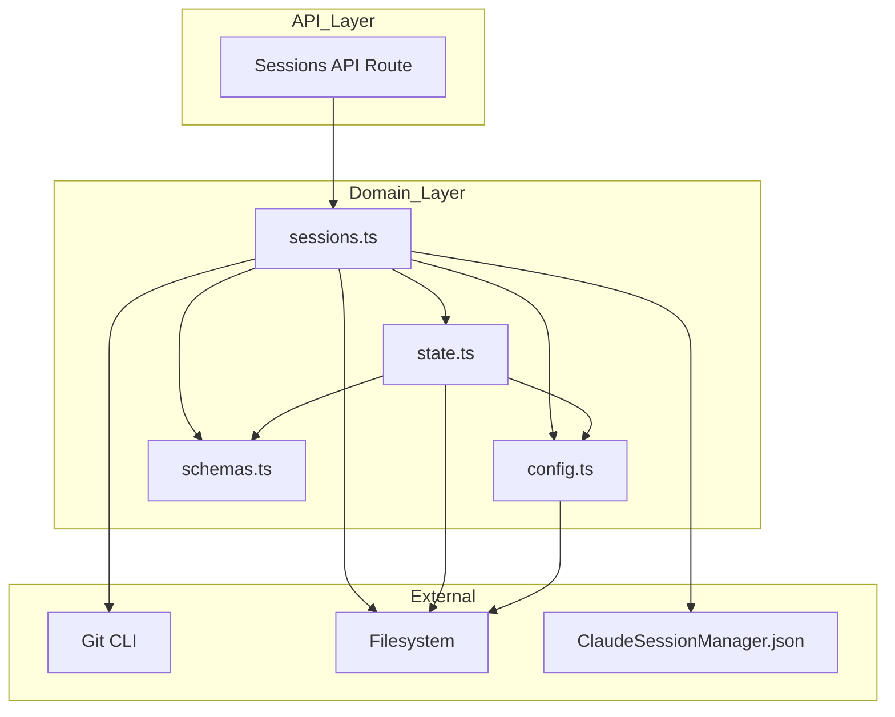
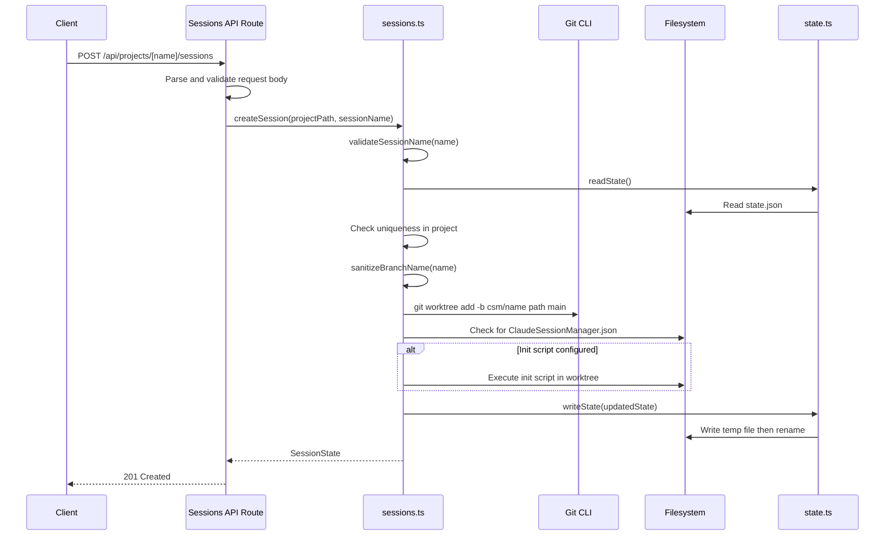
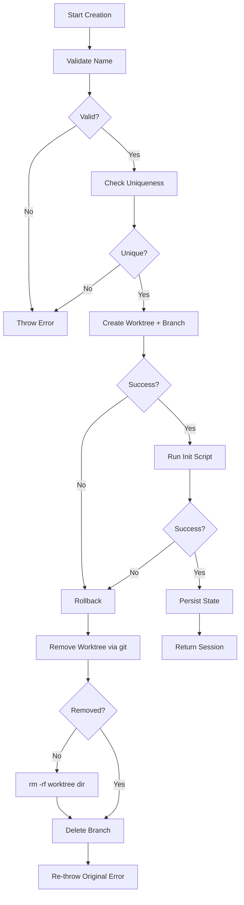
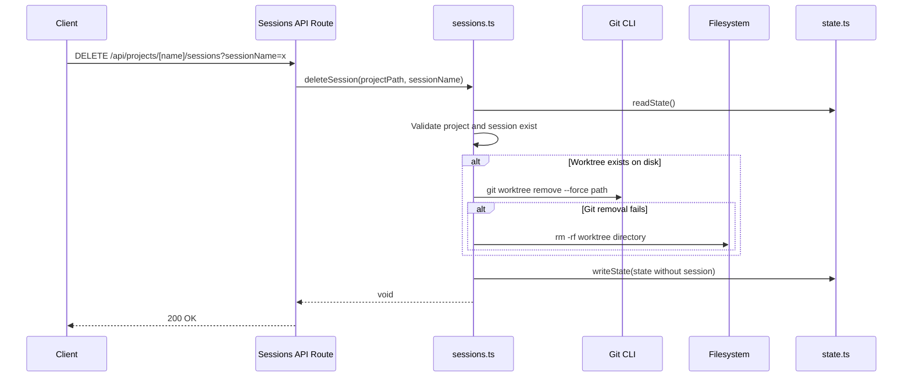
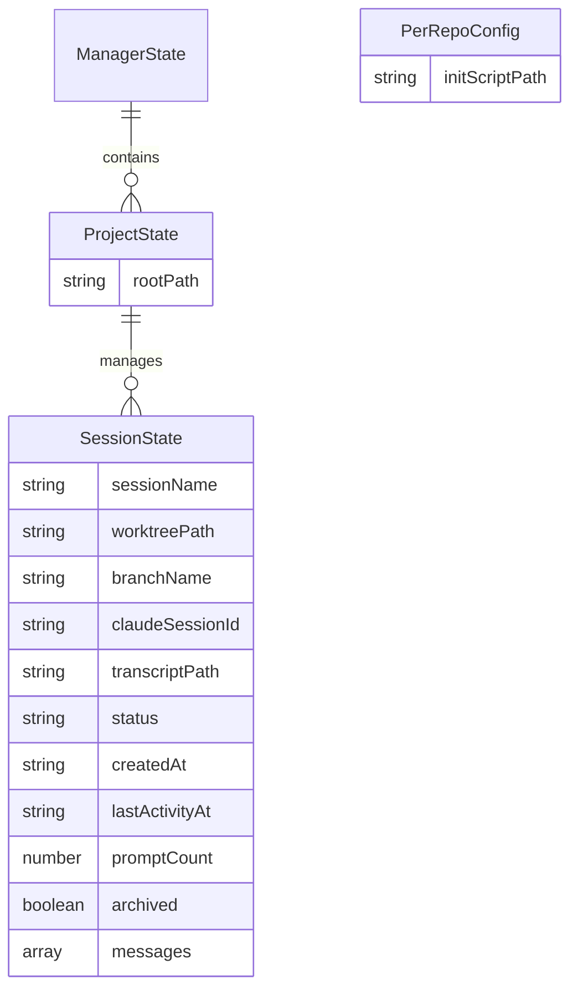

# Technical Design: Session Lifecycle

## Overview

**Purpose**: The Session Lifecycle feature delivers isolated coding session management to developers using the Claude Session Manager (CSM). Each session is backed by a git worktree and a dedicated branch, enabling parallel Claude Code instances to work within the same repository without interference.

**Users**: Developers managing multiple Claude Code sessions across git repositories will use this for creating, monitoring, and deleting isolated coding environments.

**Impact**: This is the foundational feature that all other CSM capabilities (prompt execution, transcripts, diffs, hooks) depend on. It manages the worktree/branch lifecycle and the session state that other features query.

### Goals

- Provide complete session create/delete lifecycle with git worktree isolation
- Validate session names and generate predictable, git-safe branch names
- Support optional per-repository initialization scripts for project-specific setup
- Ensure full rollback on creation failure with no orphaned resources
- Persist session state atomically for crash safety

### Non-Goals

- Session archival/restore workflow (future consideration)
- Multi-user concurrent access to the same CSM instance
- Branch merge or conflict resolution between sessions
- Remote worktree management (sessions are local only)

## Architecture

### Existing Architecture Analysis

The session lifecycle is fully implemented across three core modules:

- **`src/lib/sessions.ts`** — Contains `createSession()` and `deleteSession()` functions with inline validation, git operations, init script execution, rollback logic, and state persistence
- **`src/lib/state.ts`** — Provides atomic read/write operations for the JSON state file using write-to-temp-then-rename pattern
- **`src/app/api/projects/[name]/sessions/route.ts`** — REST API layer exposing GET/POST/DELETE endpoints that delegate to the session functions

Key patterns preserved:

- Flat `src/lib/` module structure (no subdirectories)
- Schema-first data modeling via Zod v4 in `src/lib/schemas.ts`
- Git CLI invoked via `execFile` (no git library dependency)
- Filesystem-backed state with atomic writes

### Architecture Pattern & Boundary Map



**Architecture Integration**:

- Selected pattern: Layered architecture with flat domain modules
- Domain/feature boundaries: API route handles HTTP concerns; `sessions.ts` owns all session logic; `state.ts` owns persistence
- Existing patterns preserved: Schema-first modeling, atomic state writes, `execFile` for git operations
- Steering compliance: Flat lib structure, Zod v4 conventions, TypeScript strict mode

### Technology Stack

| Layer      | Choice / Version        | Role in Feature                                            | Notes                                          |
| ---------- | ----------------------- | ---------------------------------------------------------- | ---------------------------------------------- |
| Backend    | Next.js 15 App Router   | API route handlers (GET/POST/DELETE)                       | `force-dynamic` for session routes             |
| Language   | TypeScript 5.7 (strict) | All session logic and types                                | `noUncheckedIndexedAccess` enabled             |
| Validation | Zod v4                  | Schema definitions for session state, config, API requests | `z.record(z.string(), valueSchema)` convention |
| Process    | Node.js `child_process` | Git CLI and init script execution via `execFile`           | Promisified for async/await                    |
| Storage    | JSON filesystem         | State persistence via atomic write-to-temp-then-rename     | No database                                    |

## System Flows

### Session Creation Flow



### Session Creation Rollback Flow



### Session Deletion Flow



## Requirements Traceability

| Requirement | Summary                          | Components             | Interfaces | Flows             |
| ----------- | -------------------------------- | ---------------------- | ---------- | ----------------- |
| 1.1         | Non-empty, max 100 chars         | validateSessionName    | —          | Creation          |
| 1.2         | Character set validation         | validateSessionName    | —          | Creation          |
| 1.3         | Empty name error message         | validateSessionName    | —          | Creation          |
| 1.4         | Length error message             | validateSessionName    | —          | Creation          |
| 1.5         | Invalid chars error message      | validateSessionName    | —          | Creation          |
| 2.1         | Lowercase conversion             | sanitizeBranchName     | —          | Creation          |
| 2.2         | Non-alphanumeric to hyphens      | sanitizeBranchName     | —          | Creation          |
| 2.3         | Collapse consecutive hyphens     | sanitizeBranchName     | —          | Creation          |
| 2.4         | Strip leading/trailing hyphens   | sanitizeBranchName     | —          | Creation          |
| 2.5         | csm/ prefix                      | sanitizeBranchName     | —          | Creation          |
| 3.1         | Worktree at .worktrees/name      | createSession          | Git CLI    | Creation          |
| 3.2         | Branch from main                 | createSession          | Git CLI    | Creation          |
| 3.3         | Worktree path conflict error     | createSession          | —          | Creation          |
| 3.4         | Propagate error after rollback   | createSession          | —          | Creation Rollback |
| 4.1         | Check existing sessions          | createSession          | State      | Creation          |
| 4.2         | Duplicate name error             | createSession          | —          | Creation          |
| 5.1         | Check ClaudeSessionManager.json  | readRepoConfig         | Filesystem | Creation          |
| 5.2         | Resolve and execute init script  | createSession          | execFile   | Creation          |
| 5.3         | Provide environment variables    | createSession          | execFile   | Creation          |
| 5.4         | 60-second timeout                | createSession          | execFile   | Creation          |
| 5.5         | Script not found error           | createSession          | —          | Creation          |
| 5.6         | Script failure triggers rollback | createSession          | —          | Creation Rollback |
| 6.1         | Remove worktree via git          | createSession rollback | Git CLI    | Creation Rollback |
| 6.2         | Filesystem fallback removal      | createSession rollback | Filesystem | Creation Rollback |
| 6.3         | Delete branch via git            | createSession rollback | Git CLI    | Creation Rollback |
| 6.4         | Suppress cleanup errors          | createSession rollback | —          | Creation Rollback |
| 6.5         | No partial state on failure      | createSession          | State      | Creation Rollback |
| 7.1         | Persist session to JSON state    | createSession          | State      | Creation          |
| 7.2         | Store all session properties     | createSession          | State      | Creation          |
| 7.3         | Auto-create project entry        | createSession          | State      | Creation          |
| 7.4         | ISO 8601 timestamps              | createSession          | —          | Creation          |
| 8.1         | Remove worktree via git          | deleteSession          | Git CLI    | Deletion          |
| 8.2         | Filesystem fallback removal      | deleteSession          | Filesystem | Deletion          |
| 8.3         | Remove session from state        | deleteSession          | State      | Deletion          |
| 8.4         | Preserve branch and transcripts  | deleteSession          | —          | Deletion          |
| 8.5         | Project not found error          | deleteSession          | —          | Deletion          |
| 8.6         | Session not found error          | deleteSession          | —          | Deletion          |
| 8.7         | Handle missing worktree dir      | deleteSession          | —          | Deletion          |

## Components and Interfaces

| Component           | Domain/Layer         | Intent                                          | Req Coverage  | Key Dependencies                          | Contracts           |
| ------------------- | -------------------- | ----------------------------------------------- | ------------- | ----------------------------------------- | ------------------- |
| validateSessionName | Domain / sessions.ts | Validate session name format and length         | 1.1–1.5       | None                                      | Service             |
| sanitizeBranchName  | Domain / sessions.ts | Convert session name to git-safe branch suffix  | 2.1–2.5       | None                                      | Service             |
| readRepoConfig      | Domain / sessions.ts | Read optional per-repo config                   | 5.1           | Filesystem (P1)                           | Service             |
| createSession       | Domain / sessions.ts | Orchestrate full session creation with rollback | 1–7           | Git CLI (P0), State (P0), Filesystem (P1) | Service, API, State |
| deleteSession       | Domain / sessions.ts | Remove session worktree and state               | 8.1–8.7       | Git CLI (P0), State (P0), Filesystem (P1) | Service, API, State |
| Sessions API Route  | API / route.ts       | HTTP endpoints for session CRUD                 | All           | sessions.ts (P0), project-resolver (P0)   | API                 |
| state.ts            | Domain / state.ts    | Atomic JSON state persistence                   | 7.1, 7.3, 8.3 | Filesystem (P0), Config (P0)              | State               |

### Domain Layer

#### validateSessionName

| Field        | Detail                                                          |
| ------------ | --------------------------------------------------------------- |
| Intent       | Validate session name format, length, and character constraints |
| Requirements | 1.1, 1.2, 1.3, 1.4, 1.5                                         |

**Responsibilities & Constraints**

- Validates non-empty, max 100 characters
- Enforces regex pattern: starts with alphanumeric, allows letters/numbers/spaces/hyphens/underscores
- Returns `string | null` — error message or null for valid names

##### Service Interface

```typescript
function validateSessionName(name: string): string | null;
```

- Preconditions: None
- Postconditions: Returns null if valid; descriptive error string if invalid
- Invariants: Pure function, no side effects

#### sanitizeBranchName

| Field        | Detail                                               |
| ------------ | ---------------------------------------------------- |
| Intent       | Transform session name into a git-safe branch suffix |
| Requirements | 2.1, 2.2, 2.3, 2.4, 2.5                              |

**Responsibilities & Constraints**

- Lowercase, replace non-alphanumeric with hyphens, collapse consecutive hyphens, strip leading/trailing hyphens
- Does NOT add the `csm/` prefix (caller adds it)

##### Service Interface

```typescript
function sanitizeBranchName(sessionName: string): string;
```

- Preconditions: Non-empty string (validated upstream)
- Postconditions: Returns lowercase hyphen-separated string with no leading/trailing hyphens
- Invariants: Pure function, deterministic

#### readRepoConfig

| Field        | Detail                                                              |
| ------------ | ------------------------------------------------------------------- |
| Intent       | Read optional per-repo configuration from ClaudeSessionManager.json |
| Requirements | 5.1                                                                 |

**Responsibilities & Constraints**

- Checks for `ClaudeSessionManager.json` in project root
- Parses with Zod `perRepoConfigSchema`
- Returns null if config file does not exist

##### Service Interface

```typescript
function readRepoConfig(repoRoot: string): Promise<PerRepoConfig | null>;
```

- Preconditions: `repoRoot` is a valid directory path
- Postconditions: Returns parsed config or null
- Invariants: Does not modify filesystem

#### createSession

| Field        | Detail                                                                                                                   |
| ------------ | ------------------------------------------------------------------------------------------------------------------------ |
| Intent       | Orchestrate full session creation: validate, create worktree/branch, run init script, persist state, rollback on failure |
| Requirements | 1.1–7.4                                                                                                                  |

**Responsibilities & Constraints**

- Validates name, checks uniqueness, sanitizes branch name
- Creates git worktree + branch from main
- Runs optional init script with environment variables and timeout
- Persists session state only on success
- Full rollback on any failure: worktree removal (git then fs), branch deletion

**Dependencies**

- Outbound: `state.ts` — read/write state (P0)
- Outbound: `schemas.ts` — `perRepoConfigSchema` for config parsing (P1)
- External: Git CLI — worktree and branch operations (P0)
- External: Filesystem — init script execution, worktree existence checks (P1)

##### Service Interface

```typescript
function createSession(
  projectPath: string,
  sessionName: string,
): Promise<SessionState>;
```

- Preconditions: `projectPath` is a valid git repository root
- Postconditions: Returns `SessionState` with status "ready"; state file updated atomically
- Invariants: On failure, no worktree, branch, or state remains (full rollback)
- Error envelope: Throws `Error` with descriptive message for validation, uniqueness, git, or init script failures

##### API Contract

| Method | Endpoint                      | Request                   | Response             | Errors                                              |
| ------ | ----------------------------- | ------------------------- | -------------------- | --------------------------------------------------- |
| POST   | /api/projects/[name]/sessions | `{ sessionName: string }` | `SessionState` (201) | 400 (validation/duplicate), 404 (project not found) |

##### State Management

- State model: `SessionState` within `ProjectState.sessions` record, keyed by session name
- Persistence: Atomic write via `writeState()` (temp file + rename)
- Concurrency: No locking — acceptable for local single-user tool

#### deleteSession

| Field        | Detail                                                                        |
| ------------ | ----------------------------------------------------------------------------- |
| Intent       | Remove session worktree and clean up state, preserving branch and transcripts |
| Requirements | 8.1, 8.2, 8.3, 8.4, 8.5, 8.6, 8.7                                             |

**Responsibilities & Constraints**

- Validates project and session existence in state
- Removes worktree via git, with filesystem fallback
- Removes session from state
- Does NOT delete the git branch or transcript files

**Dependencies**

- Outbound: `state.ts` — read/write state (P0)
- External: Git CLI — worktree removal (P0)
- External: Filesystem — fallback removal (P1)

##### Service Interface

```typescript
function deleteSession(projectPath: string, sessionName: string): Promise<void>;
```

- Preconditions: `projectPath` and `sessionName` must exist in state
- Postconditions: Session removed from state; worktree removed from filesystem (if existed)
- Error envelope: Throws `Error` for missing project or session

##### API Contract

| Method | Endpoint                                    | Request                    | Response                  | Errors                                                     |
| ------ | ------------------------------------------- | -------------------------- | ------------------------- | ---------------------------------------------------------- |
| DELETE | /api/projects/[name]/sessions?sessionName=x | Query param: `sessionName` | `{ success: true }` (200) | 400 (missing param/session error), 404 (project not found) |

### API Layer

#### Sessions API Route

| Field        | Detail                                     |
| ------------ | ------------------------------------------ |
| Intent       | HTTP interface for session CRUD operations |
| Requirements | All (HTTP exposure)                        |

**Responsibilities & Constraints**

- Resolves project path from URL parameter via `project-resolver.ts`
- Parses request bodies with Zod `createSessionRequestSchema`
- Maps domain errors to appropriate HTTP status codes
- Uses `force-dynamic` for non-cacheable responses

**Dependencies**

- Inbound: HTTP clients (UI, external tools) (P0)
- Outbound: `sessions.ts` — `createSession`, `deleteSession` (P0)
- Outbound: `state.ts` — `getProjectSessions` (P0)
- Outbound: `project-resolver.ts` — path resolution (P0)

##### API Contract

| Method | Endpoint                                    | Request                   | Response                  | Errors                  |
| ------ | ------------------------------------------- | ------------------------- | ------------------------- | ----------------------- |
| GET    | /api/projects/[name]/sessions               | —                         | `SessionState[]` (200)    | 404 (project not found) |
| POST   | /api/projects/[name]/sessions               | `{ sessionName: string }` | `SessionState` (201)      | 400, 404                |
| DELETE | /api/projects/[name]/sessions?sessionName=x | Query param               | `{ success: true }` (200) | 400, 404                |

## Data Models

### Domain Model



**Aggregates**: `ManagerState` is the root aggregate containing all `ProjectState` entries. Each `ProjectState` owns its `SessionState` records keyed by session name.

**Invariants**:

- Session names are unique within a project
- `status` is one of `"idle" | "ready" | "running"`
- `worktreePath` and `branchName` are derived deterministically from `sessionName`
- `messages` is an array of `ConversationMessage` objects (defaults to empty on creation; populated by prompt execution)

### Logical Data Model

**Structure**: JSON state file at OS-appropriate config directory (e.g., `~/.config/csm/state.json`).

```
{
  "projects": {
    "<projectPath>": {
      "rootPath": "<projectPath>",
      "sessions": {
        "<sessionName>": { ...SessionState }
      }
    }
  }
}
```

**Consistency**: Single-file atomic writes ensure no partial state. No foreign key constraints — session validity depends on worktree existence on disk.

### Data Contracts

**API Request Schema** (Zod v4):

```typescript
const createSessionRequestSchema = z.object({
  sessionName: z.string().min(1),
});
```

**Per-Repo Config Schema**:

```typescript
const perRepoConfigSchema = z.object({
  initScriptPath: z.string().nullable(),
});
```

## Error Handling

### Error Categories and Responses

**User Errors (400)**:

- Empty/invalid session name → descriptive validation message
- Duplicate session name → `"Session '<name>' already exists in this project"`
- Missing `sessionName` param → `"sessionName is required"` / `"sessionName query parameter is required"`

**System Errors (400 mapped)**:

- Worktree path conflict → `"Worktree directory already exists: <path>"`
- Init script not found → `"Init script not found: <path>"`
- Git CLI failure → original git error message
- Init script timeout → process timeout error

**Not Found Errors (404)**:

- Project not found (API layer) → `"Project not found"`
- Project not in state → `"Project not found: <path>"`
- Session not in state → `"Session '<name>' not found in project"`

### Monitoring

- Errors propagated as thrown exceptions in domain layer
- API routes catch and map to HTTP responses with `{ error: string }` body
- No structured logging or metrics (minimal stack — console output only)

## Testing Strategy

### Unit Tests

- `validateSessionName`: Edge cases (empty, whitespace, >100 chars, invalid chars, valid names)
- `sanitizeBranchName`: Conversion rules (lowercase, special chars, consecutive hyphens, leading/trailing hyphens)
- State file read/write: Atomic write behavior, missing file handling, corrupt file recovery

### Integration Tests

- `createSession`: Full flow with mocked git CLI — validation, worktree creation, state persistence
- `createSession` rollback: Simulated failures at each step to verify cleanup
- `deleteSession`: Successful deletion, missing worktree handling, error cases
- Init script execution: With and without config, script success/failure

### API Tests

- POST session creation: Valid request, validation errors, duplicate names
- DELETE session: Success, missing session, missing project
- GET sessions list: Empty project, multiple sessions

## Security Considerations

- **Init script execution**: Arbitrary code execution risk mitigated by requiring explicit `ClaudeSessionManager.json` configuration and 60-second timeout
- **Path traversal**: `worktreePath` is computed deterministically from project root + sanitized name — no user-controlled path components
- **Environment variable exposure**: Init script receives `PROJECT_ROOT`, `WORKTREE_PATH`, `SESSION_NAME`, `BRANCH_NAME` plus inherited process env — acceptable for local-first tool
