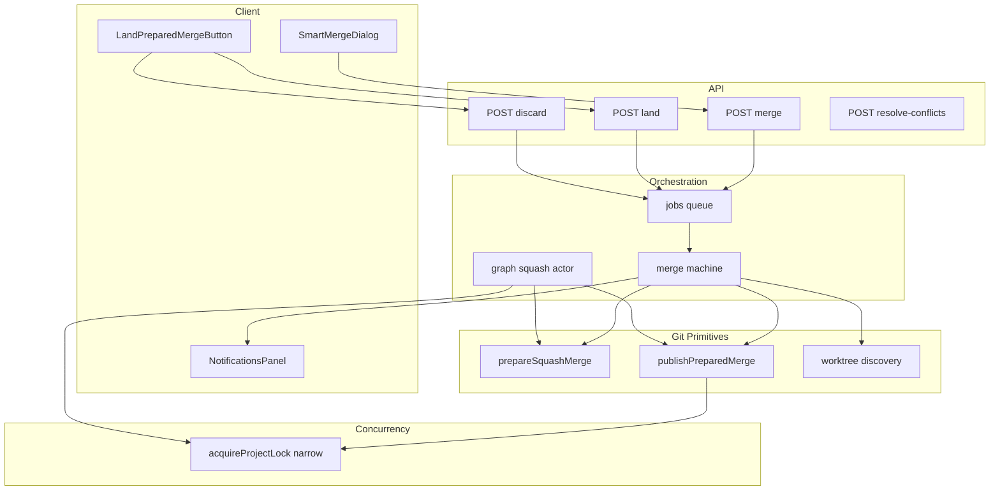
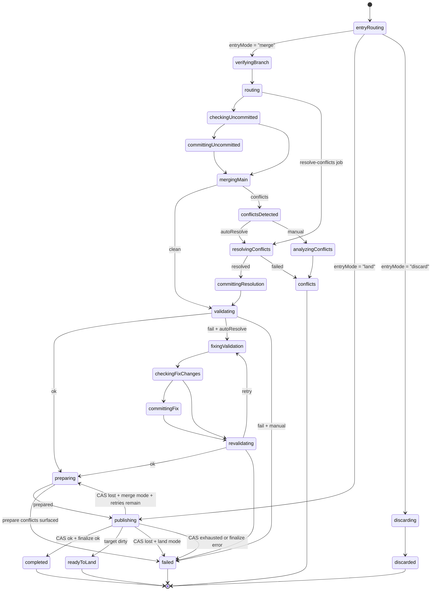
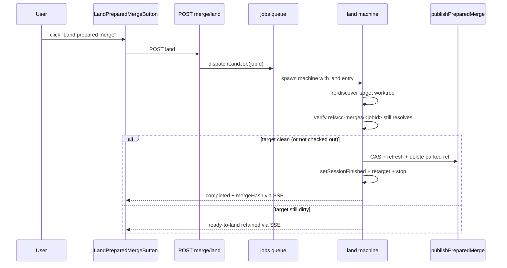
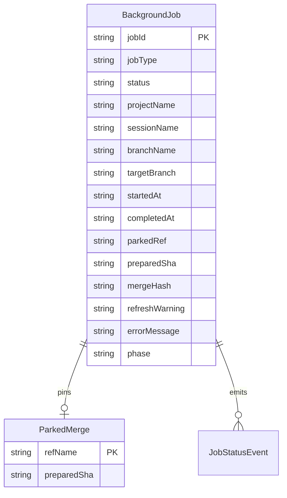
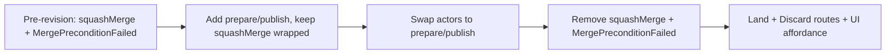

# Design Document: Smart Merge

## Overview

**Purpose**: Smart Merge is a revision of CC's merge-into-main workflow that splits the squash merge into a **prepare** phase (off the target worktree) and a **publish** phase (an atomic compare-and-swap on the target branch ref). It deletes the legacy hard-fail on a dirty target worktree, replacing it with a new terminal outcome — `ready-to-land` — that parks the prepared commit until the user lands it. The end-to-end async/background, conflict-resolution, validation-recovery, and notification surfaces from the prior iteration remain in place; this revision changes how the merge itself is produced and committed to the branch ref.

**Users**: Developers running CC against repos where main may be checked out in another worktree with in-flight work. They will see merges run to completion without being blocked by a dirty target, and they get a deterministic, user-initiated path to land prepared merges later.

**Impact**: Removes `squashMerge()` and `MergePreconditionFailed` from the git layer. Replaces them with `prepareSquashMerge()` and `publishPreparedMerge()`. Splits the `squashMerging` machine state into `preparing` and `publishing` and adds a `ready-to-land` terminal state. Narrows the project lock from the full job window to the publish + finalization critical section. Adds a `parkedRef` field and `ready-to-land` / `discarded` statuses to the job and SSE schemas, and a new API route + UI affordance to invoke the Land action.

### Goals
- Guarantee that long-running prepare and validation work never writes to the target (main) worktree.
- Make branch-ref correctness a CAS guarantee (`git update-ref` with expected-old), not a lock guarantee.
- Turn the legacy "main is dirty, fail" path into a `ready-to-land` outcome with a recoverable Land action.
- Preserve every other behavior of the existing pipeline (conflict resolution UX, validation auto-recovery, notifications, dialog, conflicts page).

### Non-Goals
- WIP-commit cleanup on the feature branch (deferred — Requirements §Out of Scope).
- Cross-process / filesystem-level lockfile for the project lock — CAS already protects branch-ref integrity across processes.
- Behavior changes to the `analyzingConflicts` / `resolvingConflicts` state-machine surface, the MergeConflictsPage, or the conflict-analysis prompt — preserved unchanged by Requirements 14 and 15.

## Architecture

### Existing Architecture Analysis

Today the merge flow is dispatched by `dispatchMergeJob` in `src/lib/jobs/queue.ts`, which spawns the Smart Merge XState machine (`src/lib/workflows/merge/machine.ts`). The machine drives a linear pipeline: `verifyingBranch → routing → checkingUncommitted → committingUncommitted → mergingMain → (conflict path) → validating → squashMerging → completed`. The `squashMerging` state invokes `squashMergeActor` (`src/lib/workflows/merge/actors.ts`) which:

1. Acquires `acquireProjectLock(projectPath)` with a 30-second retry loop (`src/lib/prompt/single-flight.ts`).
2. Calls `squashMerge(mergePath, branchName, message, targetBranch)` from `src/lib/git/worktree.ts`.
3. Inside `squashMerge`: reads `git status --porcelain` on the target worktree; throws `MergePreconditionFailed` (defined in `src/lib/workflow-graph/errors.ts`) if any tracked file is dirty; otherwise runs `git merge --squash <branch>` followed by `git commit --no-verify -m <message>` inside the target worktree; returns the new commit hash.
4. Calls `setSessionFinished`, `stopAllForSession`, and `retargetOrphanedChildren`; releases the project lock.

The graph-workflow fan-in variant (`src/lib/workflow-graph/graph-context-squash-merge-actor.ts`) is a parallel implementation: same lock-with-retry shell, same `squashMerge` call, no session-lifecycle side effects.

Constraints inherited from the existing system that this revision must respect:
- The session lock and the conversation lock semantics in `src/lib/prompt/single-flight.ts` are unchanged.
- The job registry and SSE broadcast contract live in `src/lib/jobs/queue.ts` and `src/lib/jobs/schemas.ts`.
- The conflict-resolution and validation-fix actors and their UX surface (`MergeConflictsPage`, conflict-analysis prompt) are out of scope per Requirement 14.5 and 15.9.
- The machine's terminal-state convention (`createTerminalStates` from `src/lib/workflows/utils.ts`) emits a standard `completed` / `failed` shape; new terminal states must follow the same convention.

### Architecture Pattern & Boundary Map

Selected pattern: **Prepare/Publish split inside the existing XState orchestration**. The XState machine keeps owning the pipeline; the git layer is rewritten around two pure functions that the machine invokes via two new actors.



**Architecture Integration**:
- Selected pattern: prepare/publish split realized as two new git primitives + two new machine states.
- Domain boundaries: `src/lib/git/worktree.ts` owns the git plumbing (no orchestration); `src/lib/workflows/merge/{actors,machine}.ts` owns orchestration (lock, retry, finalization); `src/lib/workflow-graph/graph-context-squash-merge-actor.ts` mirrors the same orchestration for graph fan-in but without session-lifecycle side effects.
- Existing patterns preserved: XState `.provide()` for dependency injection, schema-first Zod contracts, `globalThis` singleton for the lock manager, SSE broadcast keyed on `event.type`.
- New surfaces: `Land prepared merge` API route + UI affordance (Requirement 6), `Discard prepared merge` action (Requirement 6.6), `ready-to-land` and `discarded` job statuses.
- Steering compliance (`.kiro/steering/engineering-principles.md`): the change is additive composition over existing primitives (XState machine + lock manager + jobs queue), not a structural rewrite. The two new git functions are pure (`stdout, stderr` only), pushing all orchestration to the edges per the agent-offloading principle.

### Technology Stack

| Layer | Choice / Version | Role in Feature | Notes |
|-------|------------------|-----------------|-------|
| Git plumbing | Git ≥ 2.38 (plumbing path) or any Git (fallback path) | `merge-tree --write-tree`, `commit-tree`, `update-ref`, `worktree list --porcelain` | Plumbing path is the default; fallback uses `worktree add --detach` + `merge --squash` |
| Backend / Orchestration | XState v5 (existing) | Smart Merge machine states + actors | New `preparing`, `publishing`, `ready-to-land` states; new `prepareSquashMerge`, `publishPreparedMerge` actors |
| Backend / API | Next.js App Router (existing) | `POST /merge`, `POST /merge/land`, `POST /merge/discard` | Land + Discard are new routes under `/api/projects/[name]/sessions/[session]/merge/` |
| Concurrency | `acquireProjectLock` from `src/lib/prompt/single-flight.ts` (existing surface) | Finalization-side-effect serializer (scope narrowed) | No code change to the lock manager itself; only the call site narrows |
| Schemas / Events | Zod v4 (existing) | `BackgroundJob`, `JobStatusEvent` schema additions | New status enum values `ready-to-land`, `discarded`; new optional `parkedRef` field |
| Frontend | React 19 + Next.js App Router (existing) | Land affordance in `NotificationsPanel` and conflict-free job toast | Reuses existing `MergeToast`, `NotificationsPanel` |

## System Flows

### Prepare/publish merge pipeline

```mermaid
sequenceDiagram
    participant Machine
    participant Prep as prepareSquashMerge
    participant Park as refs/cc-merges/<jobId>
    participant Lock as acquireProjectLock
    participant Disc as worktree discovery
    participant Pub as publishPreparedMerge
    participant Fin as finalization

    Machine->>Prep: featureSha, targetSha, message
    alt Git >= 2.38
        Prep->>Prep: merge-tree --write-tree
        Prep->>Prep: commit-tree -> preparedSha
    else fallback
        Prep->>Prep: worktree add --detach
        Prep->>Prep: merge --squash; commit --no-verify
        Prep->>Prep: rev-parse HEAD; worktree remove -f
    end
    Prep->>Park: update-ref refs/cc-merges/<jobId> preparedSha
    Prep-->>Machine: preparedSha, expectedTargetSha, parkedRef

    Machine->>Disc: git worktree list --porcelain
    alt target not checked out
        Machine->>Lock: acquire
        Machine->>Pub: update-ref refs/heads/<target> preparedSha expectedTargetSha
        alt CAS ok
            Pub->>Park: update-ref -d refs/cc-merges/<jobId>
            Pub-->>Machine: mergeHash = preparedSha
            Machine->>Fin: setSessionFinished + retarget + stop
            Machine->>Lock: release
        else CAS lost & retries left
            Machine->>Lock: release
            Machine->>Prep: re-prepare against new tip
        else CAS exhausted
            Machine->>Lock: release
            Machine-->>Machine: transition to failed
        end
    else target checked out clean
        Machine->>Lock: acquire
        Machine->>Pub: CAS as above
        Pub->>Pub: git -C <target> reset --hard preparedSha
        Pub->>Park: update-ref -d refs/cc-merges/<jobId>
        Machine->>Fin: setSessionFinished + retarget + stop
        Machine->>Lock: release
    else target checked out dirty
        Machine-->>Machine: transition to ready-to-land
        Note over Park: parked ref retained
    end
```

Key decisions captured in the diagram:
- The project lock is acquired only at the start of publish and released after finalization (Requirement 8).
- Worktree discovery happens **before** lock acquisition; only the publish + finalization side-effects need serialization.
- On lost CAS, the machine reruns prepare against the new tip with bounded retry (default 3 attempts including the original try, per Requirement 4.2).
- A dirty target never triggers the lock, never advances the ref, and never deletes the parked ref.

### Merge machine state graph (revised)



Key decisions:
- `squashMerging` is replaced by the explicit pair `preparing` → `publishing`.
- `readyToLand` is a new terminal state distinct from `failed` and `completed`; its terminal output carries `parkedRef` and `preparedSha`.
- The CAS-loss → re-prepare loop is encoded as a `publishing → preparing` edge guarded by **both** `entryMode === "merge"` and a remaining-retry counter held in machine context. The Land entry path cannot re-prepare (Requirement 6.2); CAS loss in Land mode takes the explicit `publishing → failed` edge with a directive to re-invoke the merge.
- `entryRouting` is a transient initial state that uses `always` transitions to dispatch to the right entry point based on `entryMode` set from `MergeInput`.

### Land prepared merge flow



The Land entry path is a thin re-entry to the same `publishing` state with `expectedTargetSha` re-read at entry; it does **not** re-run prepare or validation (Requirement 6.2).

## Requirements Traceability

| Requirement | Summary | Components | Interfaces | Flows |
|-------------|---------|------------|------------|-------|
| 1.1 | Merge target into feature first | merge actors: `mergeMain` (existing) | Service | merge state graph |
| 1.2 | Proceed to prepare on clean merge | merge machine: `mergingMain → validating` | Service | merge state graph |
| 1.3 | Halt on conflicts without touching target | merge actors: `mergeMain` (existing) | Service | merge state graph |
| 1.4 | Leave worktree in conflict state | git plumbing: existing `mergeTargetIntoFeature` | Service | — |
| 1.5 | Report merge commit hash on publish | merge machine: `publishing → completed` | Event | prepare/publish pipeline |
| 2.1 | Prepare + publish split | git plumbing: `prepareSquashMerge`, `publishPreparedMerge` | Service | prepare/publish pipeline |
| 2.2 | Prepare must not write target worktree | git plumbing: `prepareSquashMerge` (plumbing or detached fallback) | Service | prepare/publish pipeline |
| 2.3 | Validation must not write target worktree | merge machine: `validating` runs in session worktree | Service | merge state graph |
| 2.4 | Prepare produces preparedSha + expectedTargetSha | git plumbing: `prepareSquashMerge` return shape | Service | prepare/publish pipeline |
| 2.5 | Park prepared commit at `refs/cc-merges/<jobId>` | git plumbing: `prepareSquashMerge` final step | Service | prepare/publish pipeline |
| 2.6 | Delete `MergePreconditionFailed` | git layer surface change | Service | — |
| 3.1 | Plumbing prepare path on Git ≥ 2.38 | git plumbing: `prepareSquashMerge` plumbing branch | Service | prepare/publish pipeline |
| 3.2 | Plumbing conflict reporting | git plumbing: `prepareSquashMerge` conflict surface | Service | — |
| 3.3 | Detached-worktree fallback | git plumbing: `prepareSquashMerge` fallback branch | Service | prepare/publish pipeline |
| 3.4 | Same artifact shape from both paths | git plumbing: `PrepareResult` | Service | — |
| 3.5 | Match `commit --no-verify` metadata posture | git plumbing: `prepareSquashMerge` plumbing branch | Service | — |
| 3.6 | Fallback temp worktree cleanup | git plumbing: `prepareSquashMerge` fallback `finally` | Service | — |
| 4.1 | CAS via `update-ref` with expected-old | git plumbing: `publishPreparedMerge` | Service | prepare/publish pipeline |
| 4.2 | Bounded re-prepare on CAS loss | merge machine: `publishing → preparing` edge | Service | prepare/publish pipeline |
| 4.3 | Failed on retry exhaustion | merge machine: `publishing → failed` edge | Event | prepare/publish pipeline |
| 4.4 | CAS is the correctness primitive | git plumbing + machine docs | Service | — |
| 4.5 | Broadcast new commit SHA on success | jobs queue: `merge-completed` SSE | Event | prepare/publish pipeline |
| 5.1 | Discover checked-out target via `worktree list --porcelain` | git plumbing: `discoverTargetCheckout` | Service | prepare/publish pipeline |
| 5.2 | Transition to `ready-to-land` on dirty target | merge machine: `publishing → readyToLand` | Service | prepare/publish pipeline |
| 5.3 | SSE event includes `parkedRef` and `preparedSha` | jobs schemas: `JobStatusEvent.parkedRef` | Event | — |
| 5.4 | Notify user with Land affordance | notifications: NotificationsPanel + MergeToast | Event | — |
| 5.5 | `ready-to-land` is a distinct terminal state | merge machine + jobs schemas | State | merge state graph |
| 5.6 | Parked ref retained until land or discard | git plumbing: `publishPreparedMerge` (skip delete on dirty), land/discard actors | Service | — |
| 6.1 | Expose Land action on `ready-to-land` jobs | UI: LandPreparedMergeButton, NotificationsPanel | — | Land flow |
| 6.2 | Land re-runs only publish-phase checks | merge machine: land entry (no prepare/validate) | Service | Land flow |
| 6.3 | Land advances ref via same CAS protocol | git plumbing: `publishPreparedMerge` reused | Service | Land flow |
| 6.4 | Land while still dirty keeps `ready-to-land` | merge machine: land entry → readyToLand | Service | Land flow |
| 6.5 | Land success transitions to `completed`, broadcasts SSE, deletes parked ref | merge machine + git plumbing | Event | Land flow |
| 6.6 | Discard action deletes parked ref and transitions to `discarded` | API + merge machine: discard entry | Service | — |
| 7.1 | Refresh checked-out target after clean publish | git plumbing: `publishPreparedMerge` refresh step | Service | prepare/publish pipeline |
| 7.2 | Skip refresh when target not checked out | git plumbing: `publishPreparedMerge` skip branch | Service | prepare/publish pipeline |
| 7.3 | Never refresh a dirty target | machine routes dirty target to `readyToLand` before publish | Service | prepare/publish pipeline |
| 7.4 | Refresh failure is non-fatal warning | git plumbing: `publishPreparedMerge` refresh-error path | Event | — |
| 8.1 | Lock held only inside publish + finalization | merge actor: lock scope narrowed | Service | prepare/publish pipeline |
| 8.2 | Lock not held during prepare / validate / conflict / fix | merge actor surface | Service | — |
| 8.3 | Operations performed under the lock | merge actor: discovery + CAS + refresh + finalize | Service | — |
| 8.4 | Lock is finalization serializer, CAS is correctness | merge actor + git plumbing | Service | — |
| 8.5 | Session + conversation locks unchanged | `src/lib/prompt/single-flight.ts` untouched | Service | — |
| 9.1 | `setSessionFinished` on success | merge actor: finalization step | Service | prepare/publish pipeline |
| 9.2 | `retargetOrphanedChildren` on success | merge actor: finalization step | Service | prepare/publish pipeline |
| 9.3 | `stopAllForSession` on success | merge actor: finalization step | Service | prepare/publish pipeline |
| 9.4 | Delete parked ref on success | git plumbing: `publishPreparedMerge` cleanup | Service | prepare/publish pipeline |
| 9.5 | Terminal `job-status` SSE event with new SHA | jobs queue | Event | prepare/publish pipeline |
| 9.6 | Finalization runs under the narrowed lock | merge actor surface | Service | prepare/publish pipeline |
| 10.1–10.8 | Async merge UX (unchanged) | dispatchMergeJob, SmartMergeDialog, MergeToast | API + Event | — |
| 11.1–11.5 | Async commit UX (unchanged) | dispatchCommitJob | API + Event | — |
| 12.1 | In-memory job registry | jobs queue (existing) | State | — |
| 12.2 | Extended lifecycle states | jobs schemas: `preparing`, `publishing`, `ready-to-land`, `discarded`, `conflicts` | State | — |
| 12.3 | Broadcast job-status SSE on transitions | jobs queue + jobs schemas | Event | — |
| 12.4 | Prevent concurrent jobs per session | session lock (unchanged) | Service | — |
| 12.5 | Lock release on terminal state | jobs queue try/finally (existing) | Service | — |
| 12.6 | Stale job timeout recovery | jobs queue (existing) | Service | — |
| 12.7 | Concurrent publishers serialized by lock; correctness by CAS | merge actor + git plumbing | Service | prepare/publish pipeline |
| 13.1–13.5 | Auto-resolve toggle (unchanged) | SmartMergeDialog, merge machine | — | merge state graph |
| 14.1–14.5 | Conflict analysis with Claude (unchanged) | conflict-resolution actor | Service | — |
| 15.1–15.9 | Manual conflict review (unchanged) | MergeConflictsPage | — | — |
| 16.1–16.7 | Notifications panel (extended for `ready-to-land`) | NotificationsPanel, notification.store | Event | Land flow |
| 17.1–17.8 | Pre-merge validation auto-recovery (unchanged) | validation-fix actor | Service | merge state graph |
| 18.1–18.10 | Phase-aware job status | jobs schemas: new `phase` strings | Event | — |
| 19.1–19.5 | Error details in Activities panel (unchanged) | NotificationsPanel | — | — |
| 20.1–20.7 | Smart Merge dialog (unchanged; precondition warning removed) | SmartMergeDialog | — | — |

## Components and Interfaces

| Component | Domain/Layer | Intent | Req Coverage | Key Dependencies (P0/P1) | Contracts |
|-----------|--------------|--------|--------------|--------------------------|-----------|
| `prepareSquashMerge` (new) | Git plumbing (`src/lib/git/worktree.ts`) | Produce a parked single-parent squash commit OID without touching the target worktree | 2.1, 2.2, 2.4, 2.5, 3.1–3.6 | Git client (P0) | Service |
| `publishPreparedMerge` (new) | Git plumbing (`src/lib/git/worktree.ts`) | Advance the target ref via CAS, optionally refresh a clean target worktree, delete the parked ref on success | 1.5, 4.1, 4.5, 5.6, 7.1–7.4, 9.4 | Git client (P0) | Service |
| `discoverTargetCheckout` (new) | Git plumbing (`src/lib/git/worktree.ts`) | Read `git worktree list --porcelain` and `git status --porcelain` to classify the target worktree as not-checked-out / clean / dirty | 5.1, 7.2 | Git client (P0) | Service |
| Removed: `squashMerge`, `MergePreconditionFailed` | Git plumbing (`src/lib/git/worktree.ts`, `src/lib/workflow-graph/errors.ts`) | Deleted; supplanted by prepare/publish split | 2.6 | — | — |
| `prepareActor` (new) | Merge orchestration (`src/lib/workflows/merge/actors.ts`) | XState wrapper that invokes `prepareSquashMerge` and threads job context | 2.1, 2.4, 2.5 | `prepareSquashMerge` (P0) | Service |
| `publishActor` (new) | Merge orchestration (`src/lib/workflows/merge/actors.ts`) | XState wrapper that runs target discovery, acquires the project lock, invokes `publishPreparedMerge`, runs finalization, releases the lock | 4.1–4.5, 5.1, 5.2, 5.6, 7.1–7.4, 8.1–8.4, 9.1–9.6, 12.7 | `discoverTargetCheckout` (P0), `publishPreparedMerge` (P0), `acquireProjectLock` (P0), session/state services (P0) | Service |
| Removed: `squashMergeActor` | Merge orchestration (`src/lib/workflows/merge/actors.ts`) | Replaced by `prepareActor` + `publishActor` | — | — | — |
| `mergeMachine` (extended) | Merge orchestration (`src/lib/workflows/merge/machine.ts`) | Adds `preparing`, `publishing`, `readyToLand` states; routes CAS-loss to re-prepare; routes dirty target to `readyToLand` | 4.2, 4.3, 5.2, 5.5, 6.2, 6.3, 6.4, 6.5, 6.6, 12.2 | `prepareActor` (P0), `publishActor` (P0) | State |
| `graphContextSquashMergeActor` (rewritten) | Graph orchestration (`src/lib/workflow-graph/graph-context-squash-merge-actor.ts`) | Same prepare/publish split for graph fan-in; no session-lifecycle side effects | 2.1, 4.1, 4.2, 5.2, 7.1–7.4, 8.1–8.4 | `prepareSquashMerge` (P0), `publishPreparedMerge` (P0), `acquireProjectLock` (P0) | Service |
| `acquireProjectLock` (call-site change only) | Concurrency (`src/lib/prompt/single-flight.ts`) | Lock surface unchanged; only the call sites narrow its scope to publish + finalization | 8.1, 8.2, 8.3 | — | Service |
| Jobs schemas (extended) | Schemas (`src/lib/jobs/schemas.ts`) | Add `ready-to-land`, `discarded` status values; add `parkedRef`, new `phase` strings | 5.3, 5.5, 6.6, 10.4, 12.2, 18.1–18.10 | — | Event + State |
| Merge route handlers (extended) | API (`src/app/api/projects/[name]/sessions/[session]/merge/route.ts`) | Removes any precondition warning based on the target worktree | 20.7 | — | API |
| Land route (new) | API (`src/app/api/projects/[name]/sessions/[session]/merge/land/route.ts`) | Accepts a Land action against a `ready-to-land` job, dispatches the Land entry path | 6.1, 6.3 | jobs queue (P0) | API |
| Discard route (new) | API (`src/app/api/projects/[name]/sessions/[session]/merge/discard/route.ts`) | Accepts an explicit discard, deletes the parked ref, transitions the job to `discarded` | 6.6 | jobs queue (P0) | API |
| Notification surface (extended) | UI (`NotificationsPanel`, `MergeToast`) | Renders `ready-to-land` notifications with the Land affordance; preserves all other existing job rendering | 5.4, 6.1, 16.3, 16.5, 16.6 | jobs schemas (P0) | — |
| `LandPreparedMergeButton` (new) | UI component (cross-feature: `src/components/`) | Per-job button shown in NotificationsPanel and on the conflicts/job detail surface for jobs in `ready-to-land`; submits Land or Discard | 5.4, 6.1, 6.6 | Land + Discard routes (P0) | — |

### Git plumbing

#### `prepareSquashMerge`

| Field | Detail |
|-------|--------|
| Intent | Produce a single-parent squash commit OID with the target branch as parent, without writing to the target worktree |
| Requirements | 2.1, 2.2, 2.4, 2.5, 3.1, 3.2, 3.3, 3.4, 3.5, 3.6 |

**Responsibilities & Constraints**
- Owns the choice between plumbing and detached-worktree fallback paths.
- Records the target SHA observed at the start of prepare as `expectedTargetSha`.
- Parks the resulting commit at `refs/cc-merges/<jobId>` via `git update-ref refs/cc-merges/<jobId> <preparedSha>`.
- Never invokes `git merge`, `git commit`, `git reset`, `git checkout`, `git read-tree`, or any other write against the target worktree.
- On any failure of the fallback path, removes `.worktrees/__merge_<jobId>` before returning.
- On success of either path, produces the same `PrepareResult` shape so the caller can ignore the path taken.

**Dependencies**
- Outbound: Git CLI (`merge-tree`, `commit-tree`, `update-ref`, `worktree add`/`remove`, `merge --squash`, `commit --no-verify`, `rev-parse`) — Inbound to `prepareActor` and `graphContextSquashMergeActor` (P0).
- External: Git ≥ 2.38 for the plumbing branch; any Git for the fallback branch.

**Contracts**: Service [x]

##### Service Interface
```typescript
interface PrepareSquashMergeInput {
  projectPath: string;
  featureBranch: string;
  featureSha: string;
  targetBranch: string;
  targetSha: string;        // expected-old captured at the start of prepare
  message: string;
  jobId: string;            // used to build refs/cc-merges/<jobId>
}

type PrepareResult =
  | { kind: "prepared"; preparedSha: string; expectedTargetSha: string; parkedRef: string }
  | { kind: "conflicts"; expectedTargetSha: string; conflictFiles: string[] };

function prepareSquashMerge(input: PrepareSquashMergeInput): Promise<PrepareResult>;
```

- Preconditions: `projectPath` is a valid git repo; `featureSha` is reachable; `targetSha` matches `git rev-parse refs/heads/<targetBranch>` at the call site (the caller is responsible for capturing it just before invocation).
- Postconditions:
  - `kind: "prepared"`: `refs/cc-merges/<jobId>` resolves to `preparedSha`; no worktree was written to; if the fallback path was used, `.worktrees/__merge_<jobId>` no longer exists.
  - `kind: "conflicts"`: no commit and no parked ref were created; the worktree state is unchanged; `conflictFiles` lists the conflicted paths.
- Invariants: the function never advances `refs/heads/<targetBranch>`; the function never reads or writes the target worktree.

**Implementation Notes**
- Plumbing branch:
  - `git merge-tree --write-tree -z <targetSha> <featureSha>` produces the merged tree OID on stdout (exit 0) or a conflicted tree OID plus the conflict-info section (exit 1).
  - On exit 0, `git commit-tree <tree> -p <targetSha> -m <message>` produces `preparedSha`. Author/committer identity, message handling, and signing posture all derive from the same `GIT_AUTHOR_*`/`GIT_COMMITTER_*` env and user config that `git commit --no-verify` reads today; `commit-tree` skips pre-commit hooks (matching `--no-verify`).
  - On exit 1, the function does not call `commit-tree`; it parses the conflicted-files section and returns `kind: "conflicts"`.
- Fallback branch:
  - Provision `.worktrees/__merge_<jobId>` via `git worktree add --detach <path> <targetSha>`.
  - Inside that worktree: `git merge --squash <featureBranch>` then `git commit --no-verify -m <message>`. Capture the new commit SHA via `git rev-parse HEAD`.
  - Remove the temp worktree with `git worktree remove -f <path>` in a `finally` block so cleanup happens whether the merge succeeded, conflicted, or threw.
  - Conflict detection in the fallback branch reuses today's stderr/diff-filter inspection.
- Plumbing-vs-fallback gating:
  - Cache `git --version` once per process; compare against `2.38.0`.
  - A documented parity-gap matrix (initially empty) can force the fallback path for specific repo configurations; the function reads this matrix from `repoConfig.preMergePreparePath` (`"auto" | "plumbing" | "fallback"`).
- Parking step:
  - Always `git update-ref refs/cc-merges/<jobId> <preparedSha>` immediately after the commit is produced; if parking fails, surface the error.

---

#### `publishPreparedMerge`

| Field | Detail |
|-------|--------|
| Intent | Atomically advance the target branch ref to `preparedSha`, refresh a clean target worktree, delete the parked ref on success, and surface a non-fatal warning on refresh failure |
| Requirements | 1.5, 4.1, 4.5, 5.6, 7.1, 7.2, 7.3, 7.4, 9.4 |

**Responsibilities & Constraints**
- Performs `git update-ref refs/heads/<targetBranch> <preparedSha> <expectedTargetSha>`.
- On CAS failure, returns a typed result so the caller can decide whether to re-prepare.
- On CAS success and a clean target worktree, runs `git -C <targetWorktreePath> reset --hard <preparedSha>`.
- On CAS success and no target worktree, skips the refresh step.
- On CAS success, deletes the parked ref via `git update-ref -d <parkedRef>`.
- Returns refresh failure as a non-fatal warning; the caller surfaces it without rolling back the ref.

**Dependencies**
- Outbound: Git CLI (`update-ref`, `reset --hard`) (P0).
- Inbound: `publishActor` (P0), `graphContextSquashMergeActor` (P0).

**Contracts**: Service [x]

##### Service Interface
```typescript
interface PublishPreparedMergeInput {
  projectPath: string;
  targetBranch: string;
  preparedSha: string;
  expectedTargetSha: string;
  parkedRef: string;
  cleanTargetWorktreePath: string | null;  // null when target is not checked out
}

type PublishResult =
  | { kind: "published"; mergeHash: string; refreshWarning?: string }
  | { kind: "cas-lost"; actualTargetSha: string };

function publishPreparedMerge(input: PublishPreparedMergeInput): Promise<PublishResult>;
```

- Preconditions:
  - `parkedRef` resolves to `preparedSha`.
  - The caller has already classified the target worktree; this function does not re-discover the worktree. (Discovery is a separate concern handled by `discoverTargetCheckout` so the caller can route dirty-target jobs to `readyToLand` without ever invoking publish.)
- Postconditions:
  - `kind: "published"`: `refs/heads/<targetBranch>` resolves to `preparedSha`; the parked ref is deleted; if `cleanTargetWorktreePath` was non-null, the worktree has been reset to `preparedSha` (or `refreshWarning` carries the failure reason).
  - `kind: "cas-lost"`: no ref was advanced; the parked ref is retained for the caller's retry decision.
- Invariants: the function does not advance the ref unless `git update-ref` returned success; the function never deletes the parked ref unless the ref advance succeeded.

**Implementation Notes**
- CAS detection: parse `git update-ref` exit code; on failure, run `git rev-parse refs/heads/<targetBranch>` to obtain `actualTargetSha` for the `cas-lost` result.
- Refresh: `git -C <cleanTargetWorktreePath> reset --hard <preparedSha>`. On error, capture the stderr message into `refreshWarning` and continue; do not throw.
- Parked-ref deletion uses `git update-ref -d <parkedRef> <preparedSha>` (with expected-old to defend against concurrent rewrite of the parked ref).

---

#### `discoverTargetCheckout`

| Field | Detail |
|-------|--------|
| Intent | Classify the target branch's worktree state as one of `{ notCheckedOut, clean(path), dirty(path) }` |
| Requirements | 5.1, 7.2 |

**Contracts**: Service [x]

##### Service Interface
```typescript
type TargetCheckoutState =
  | { kind: "not-checked-out" }
  | { kind: "clean"; worktreePath: string }
  | { kind: "dirty"; worktreePath: string; trackedDirtyPaths: DirtyPath[] };

function discoverTargetCheckout(
  projectPath: string,
  targetBranch: string,
): Promise<TargetCheckoutState>;
```

- Preconditions: `projectPath` is a valid git repo.
- Postconditions: returns the classification based on the current snapshot; the result may be stale by the time the publish CAS runs (the CAS is what makes the change safe).
- Invariants: read-only — does not modify any worktree, index, or ref.

**Implementation Notes**
- Parse `git -C <projectPath> worktree list --porcelain` to find the worktree (if any) whose `branch refs/heads/<targetBranch>` matches.
- For a matching worktree, run `git -C <worktreePath> status --porcelain` and reuse `parseDirtyPaths` (existing helper in `src/lib/git/worktree.ts`); filter on `tracked === true` per Requirement 5.2.
- Untracked files do not constitute "dirty" for this purpose.

---

#### Removed: `squashMerge`, `MergePreconditionFailed`

Deleted from `src/lib/git/worktree.ts` and `src/lib/workflow-graph/errors.ts` respectively. No re-export shim is retained — direct importers (`actors.ts`, `graph-context-squash-merge-actor.ts`) are updated in the same change. Tests for the removed functions are deleted or rewritten against `prepareSquashMerge` / `publishPreparedMerge`.

### Merge orchestration

#### `prepareActor`

| Field | Detail |
|-------|--------|
| Intent | XState wrapper that captures `expectedTargetSha`, invokes `prepareSquashMerge`, returns the structured result to the machine |
| Requirements | 2.1, 2.4, 2.5 |

**Contracts**: Service [x]

##### Service Interface
```typescript
interface PrepareActorInput {
  projectPath: string;
  featureBranch: string;
  worktreePath: string;
  targetBranch: string;
  message: string;
  jobId: string;
}

type PrepareActorOutput =
  | { status: "prepared"; preparedSha: string; expectedTargetSha: string; parkedRef: string }
  | { status: "conflicts"; expectedTargetSha: string; conflictFiles: string[] };
```

- Preconditions: the machine has already verified the feature branch (`verifyingBranch`), committed any WIP, and either had a clean target merge or completed conflict resolution / validation.
- Postconditions: on `prepared`, the parked ref exists; on `conflicts`, neither commit nor parked ref exists.
- Invariants: this actor does not acquire any lock; the project lock is acquired only in `publishActor`.

**Implementation Notes**
- The actor reads `featureSha` via `git -C <worktreePath> rev-parse HEAD` and `targetSha` via `git -C <projectPath> rev-parse refs/heads/<targetBranch>` immediately before invoking `prepareSquashMerge`, then forwards both to the function.
- The structured result is mapped into machine context so the `publishing` state can use `preparedSha`, `expectedTargetSha`, and `parkedRef` without redoing the read.

---

#### `publishActor`

| Field | Detail |
|-------|--------|
| Intent | Discover the target worktree, acquire the project lock, invoke `publishPreparedMerge`, run finalization, release the lock, and route the outcome back to the machine |
| Requirements | 4.1, 4.2, 4.3, 4.5, 5.1, 5.2, 5.6, 7.1, 7.2, 7.3, 7.4, 8.1, 8.2, 8.3, 8.4, 9.1, 9.2, 9.3, 9.4, 9.5, 9.6, 12.7 |

**Contracts**: Service [x]

##### Service Interface
```typescript
interface PublishActorInput {
  projectPath: string;
  sessionName: string;
  targetBranch: string;
  preparedSha: string;
  expectedTargetSha: string;
  parkedRef: string;
  jobId: string;
  finalizeSession: boolean;          // false for graphContextSquashMergeActor
  maxLockWaitMs?: number;            // default 30_000
}

type PublishActorOutput =
  | { status: "completed"; mergeHash: string; refreshWarning?: string }
  | { status: "ready-to-land"; parkedRef: string; preparedSha: string; targetWorktreePath: string }
  | { status: "cas-lost"; actualTargetSha: string }
  | { status: "failed"; error: string };
```

- Preconditions: `parkedRef` resolves to `preparedSha`; `expectedTargetSha` reflects the target tip observed at the prior prepare step.
- Postconditions:
  - `completed`: ref advanced, parked ref deleted, finalization side effects run (if `finalizeSession === true`).
  - `ready-to-land`: ref not advanced; parked ref retained.
  - `cas-lost`: ref not advanced; parked ref retained; the machine reruns prepare against the new tip.
  - `failed`: the project lock could not be acquired within the bound, or a finalization side effect threw — in both cases the ref state is unchanged (or the merge is already durable but a side effect failed, which the actor surfaces as failure with the merge hash captured in the error message).
- Invariants: the project lock is the only synchronization primitive this actor holds, and it is released in `finally`.

**Implementation Notes**
- Discovery step (no lock): `discoverTargetCheckout(projectPath, targetBranch)`.
  - If `kind === "dirty"`: return `ready-to-land` without acquiring the lock.
- Acquire `acquireProjectLock(projectPath)` with the existing 30-second / 100 ms retry loop (factored out to be shared with `graphContextSquashMergeActor`).
- Invoke `publishPreparedMerge`:
  - `cleanTargetWorktreePath` = `worktreePath` if `kind === "clean"`, else `null`.
- Map the result:
  - `published`: run finalization (`setSessionFinished`, `retargetOrphanedChildren`, `stopAllForSession`) only if `finalizeSession === true`; return `completed`.
  - `cas-lost`: return without finalizing.
- Release the project lock in `finally`.

---

#### `mergeMachine` (extended)

| Field | Detail |
|-------|--------|
| Intent | Replace `squashMerging` with `preparing` + `publishing`; add `readyToLand` terminal state; encode CAS-loss → re-prepare loop with bounded retry; encode dirty-target → `readyToLand` short-circuit; add a `landing` entry path for Land actions |
| Requirements | 4.2, 4.3, 5.2, 5.5, 6.2, 6.3, 6.4, 6.5, 6.6, 12.2 |

**Contracts**: State [x]

**State additions**
- `preparing`: invokes `prepareActor`. `entry` assigns `phase: "preparing"`. On `prepared`, transitions to `publishing` with `preparedSha`, `expectedTargetSha`, `parkedRef` written into context. On `conflicts`, transitions to `failed` (a prepare-time conflict that escapes earlier conflict resolution indicates a stale merge result; surfaced as failure with `conflictFiles`).
- `publishing`: invokes `publishActor`. `entry` assigns `phase: "publishing"`. Branches on output:
  - `completed`: transitions to `completed` with `mergeHash` (and `refreshWarning` captured in `error` if present, surfaced as a non-fatal note).
  - `ready-to-land`: transitions to `readyToLand`.
  - `cas-lost` (merge mode): guarded transition back to `preparing` if `casAttempt < maxCasAttempts` (default 3); otherwise transitions to `failed` with `"CAS contention exhausted on target branch"`.
  - `cas-lost` (land mode): does **not** re-enter `preparing`. Transitions directly to `failed` with `"Target branch advanced since prepare; re-run merge to refresh the prepared commit."` This preserves Requirement 6.2 ("re-run only the publish-phase checks") — the Land entry path never re-prepares. The guard on the `publishing → preparing` edge is `context.entryMode === "merge" && context.casAttempt < context.maxCasAttempts`; all other `cas-lost` paths take the explicit `publishing → failed` edge so the user gets a clear next action (re-invoke the merge to refresh the prepared commit against the new tip).
  - `failed`: transitions to `failed` with the carried error.
- `readyToLand`: terminal state. `entry` assigns `phase: "awaiting-land"`, `finalStatus: "ready-to-land"`, persists `parkedRef` and `preparedSha` in the output, and fires `onTerminal`.
- `landing` (entry path for Land action): re-uses `publishing` directly. The Land entry path is a separate machine input flag (`entryMode: "land"`) so the machine spawns directly into `publishing` with `preparedSha`, `expectedTargetSha`, and `parkedRef` taken from the existing job record. The Land entry path never visits `verifyingBranch`, `checkingUncommitted`, `mergingMain`, `validating`, `preparing`, or any conflict state (Requirement 6.2).

**Context additions**
- `preparedSha: string | null`
- `expectedTargetSha: string | null`
- `parkedRef: string | null`
- `casAttempt: number` (initial 1)
- `maxCasAttempts: number` (default 3)
- `entryMode: "merge" | "land" | "discard"` (default `"merge"`)
- `refreshWarning: string | null`

**Output additions**
- `status` extends to `"ready-to-land" | "discarded"` in addition to `"completed" | "failed" | "conflicts"`.
- `parkedRef`, `preparedSha`, `refreshWarning` are added to `MergeOutput`.

**Implementation Notes**
- The `cas-lost` → `preparing` transition assigns `casAttempt: ({ context }) => context.casAttempt + 1` and clears the prepared-merge fields so the next prepare starts fresh.
- **Initial-state branching for `entryMode`.** XState v5's `initial` field is static, so the machine cannot select its starting state directly from input/context. The wiring is: the machine's `initial` is a transient routing state `entryRouting`, which has no `invoke` and three `always` transitions guarded on `context.entryMode`:
  - `{ guard: ({ context }) => context.entryMode === "merge", target: "verifyingBranch" }`
  - `{ guard: ({ context }) => context.entryMode === "land", target: "publishing" }`
  - `{ guard: ({ context }) => context.entryMode === "discard", target: "discarding" }`

  `entryMode` is set from `MergeInput` at machine creation (the input-to-context mapping runs before `entryRouting` evaluates its `always` transitions). This keeps a single machine surface and avoids three parallel top-level machines.
- The `discard` entry path goes straight to a new transient `discarding` state that deletes the parked ref via a thin actor (`git update-ref -d <parkedRef>`) and transitions to a `discarded` terminal state.

---

#### `graphContextSquashMergeActor` (rewritten)

| Field | Detail |
|-------|--------|
| Intent | Same prepare/publish split for graph fan-in, without session-lifecycle side effects |
| Requirements | 2.1, 4.1, 4.2, 5.2, 7.1–7.4, 8.1–8.4 |

**Contracts**: Service [x]

**Implementation Notes**
- The current single function (`runGraphContextSquashMerge`) is rewritten to:
  1. Capture `targetSha` and `featureSha`.
  2. Invoke `prepareSquashMerge` (no lock).
  3. Invoke `discoverTargetCheckout`.
  4. Acquire the project lock (existing 30 s / 100 ms retry loop, factored into a shared helper).
  5. Invoke `publishPreparedMerge`.
  6. On `cas-lost`, release the lock, re-run from step 1 up to `maxCasAttempts`.
  7. On `ready-to-land`, return a `ready-to-land` shape — the graph runner surfaces this to the user without finalizing the session.
- The actor's output shape extends to `kind: "completed" | "ready-to-land" | "cas-lost" | "failed"` so the graph runner can distinguish outcomes.
- Session-lifecycle side effects (`setSessionFinished`, `retargetOrphanedChildren`, `stopAllForSession`) remain absent from this actor per its existing contract.

---

#### `acquireProjectLock` (call-site change only)

The lock surface in `src/lib/prompt/single-flight.ts` is unchanged. The two existing call sites (`squashMergeActor` in `src/lib/workflows/merge/actors.ts` and `runGraphContextSquashMerge` in `src/lib/workflow-graph/graph-context-squash-merge-actor.ts`) are rewritten so the acquire/release brackets wrap only:

1. The CAS (with bounded retry).
2. The clean-checkout refresh (when applicable).
3. The finalization side effects (`setSessionFinished`, `retargetOrphanedChildren`, `stopAllForSession`, parked-ref deletion).
4. The terminal SSE broadcast.

The `prepareSquashMerge`, `discoverTargetCheckout`, conflict resolution, validation, and validation-fix calls are all outside the lock window.

### Schemas (extension)

#### `src/lib/jobs/schemas.ts`

```typescript
// jobStatusSchema gains two values
const jobStatusSchema = z.enum([
  "running",
  "completed",
  "failed",
  "conflicts",
  "ready-to-land",
  "discarded",
]);

// backgroundJobSchema gains parkedRef and preparedSha
const backgroundJobSchema = z.object({
  // ...existing fields...
  parkedRef: z.string().optional(),
  preparedSha: z.string().optional(),
  refreshWarning: z.string().optional(),
});

// jobStatusEventSchema gains the same optional fields
const jobStatusEventSchema = z.object({
  // ...existing fields...
  parkedRef: z.string().optional(),
  preparedSha: z.string().optional(),
  refreshWarning: z.string().optional(),
});

// Phase enum (held as z.string() today) gains the new values
//   "preparing", "publishing", "awaiting-land"
// in addition to existing "committing-uncommitted", "merging-main",
// "analyzing-conflicts", "resolving-conflicts", "validating",
// "fixing-validation", "re-validating".
```

- The schema additions are additive; consumers parsing legacy events continue to parse successfully because the new fields are optional and the new enum values do not affect existing parsing.
- Per Requirement 5.5, the UI rendering for `ready-to-land` is distinct from both `failed` and `completed` (a success-pending-action badge, not an error badge).
- **Phase clearing on terminal states (Requirement 18.10).** The terminal-state entry actions in `mergeMachine` set `phase` in machine context (and therefore in the terminal `job-status` SSE event) as follows:
  - `completed`, `failed`, `conflicts`, `discarded`: `phase` is cleared (assigned `null` in context and omitted from the SSE event payload — the schema's `phase` field is optional).
  - `readyToLand`: `phase` is set to `"awaiting-land"` on entry and retained in the in-memory job record until the user invokes Land or Discard (at which point the next job's terminal transition applies the rule above).
  - This ensures the Activities panel never displays stale phase labels (e.g., "Publishing...") for a finished job, while still surfacing "Awaiting clean target..." for parked merges.

### API

#### `POST /api/projects/[name]/sessions/[session]/merge/land` (new)

| Field | Detail |
|-------|--------|
| Intent | Dispatch a Land action against an existing `ready-to-land` job |
| Requirements | 6.1, 6.3 |

##### API Contract
| Method | Endpoint | Request | Response | Errors |
|--------|----------|---------|----------|--------|
| POST | `/api/projects/[name]/sessions/[session]/merge/land` | `{ jobId: string }` | 202 `{ jobId }` | 400, 404, 409 |

**Implementation Notes**
- Validates that the job exists and is in `ready-to-land` and that `refs/cc-merges/<jobId>` still resolves.
- Dispatches a new job via the existing jobs queue with `entryMode: "land"`. The session lock is acquired/released per the same contract as a new merge.
- The Land machine spawn re-enters `publishing` directly (skips prepare and validation per Requirement 6.2). A re-discovery of the target worktree still happens inside `publishActor`.

---

#### `POST /api/projects/[name]/sessions/[session]/merge/discard` (new)

| Field | Detail |
|-------|--------|
| Intent | Dispatch an explicit discard against an existing `ready-to-land` job |
| Requirements | 6.6 |

##### API Contract
| Method | Endpoint | Request | Response | Errors |
|--------|----------|---------|----------|--------|
| POST | `/api/projects/[name]/sessions/[session]/merge/discard` | `{ jobId: string }` | 202 `{ jobId }` | 400, 404, 409 |

**Implementation Notes**
- Validates the job is in `ready-to-land`.
- Spawns the machine with `entryMode: "discard"`, which transits to the `discarding` state, deletes `refs/cc-merges/<jobId>` (with expected-old to guard against ref rewrites), and terminates in `discarded`.
- No CAS, no refresh, no finalization.

---

#### `POST /api/projects/[name]/sessions/[session]/merge` (extension)

Behavior preserved except for one change required by Requirement 20.7: the route handler no longer presents a precondition warning, error, or block based on the target worktree state. The merge dialog and the route handler accept the merge regardless of target dirtiness; the publish phase decides whether to advance the ref or transition to `ready-to-land`.

### UI

#### `LandPreparedMergeButton` (new)

Cross-feature component placed at `src/components/LandPreparedMergeButton.tsx`. Props:

```typescript
interface LandPreparedMergeButtonProps {
  job: BackgroundJob;  // must be in ready-to-land
}
```

- Renders two actions: **Land** (calls `POST .../merge/land`) and **Discard** (calls `POST .../merge/discard`).
- Disables both buttons while a Land or Discard request is in flight.
- Reads `parkedRef` and `preparedSha` from the job record purely for display (truncated SHA, branch name).
- Used by `NotificationsPanel` (per-job row) and by the active `MergeToast` (when toast type is `ready-to-land`).

#### `NotificationsPanel` (extended)

- Renders `ready-to-land` jobs with a distinct visual badge (per Requirement 5.5, success-pending-action — not failure).
- Embeds `LandPreparedMergeButton` for each such job.
- Click-to-navigate target for `ready-to-land` is the session page (where the Land button is also available); panel does not redirect away from the panel surface itself.

#### `MergeToast` (extended)

- Adds a `ready-to-land` toast variant whose body shows the branch name, a short "Awaiting clean target" subtitle, and the Land affordance.

#### `SmartMergeDialog` (small change)

Removes any UI affordance that warns about, blocks, or asks about the target worktree state (per Requirement 20.7). The dialog UI continues to show the auto-resolve toggle, the message field, the uncommitted-changes warning (which is about the session worktree, not the target), and the submitted confirmation state.

## Data Models

### Domain Model

This revision touches one aggregate (`BackgroundJob`) and introduces a single new domain concept:

**ParkedMerge** — A prepared squash commit reachable via `refs/cc-merges/<jobId>`. Lifecycle:
- Created at the end of `prepareSquashMerge` (`prepared` outcome).
- Read at the start of every `publishing` entry to verify the parked commit still resolves.
- Deleted at the end of a successful publish, or at the end of an explicit discard.
- Retained indefinitely while a job sits in `ready-to-land`.

`ParkedMerge` is not a separate persisted entity — its identity is the git ref itself. The `BackgroundJob` aggregate carries the ref name and the SHA so the UI can render and the machine can verify.

### Logical Data Model



- `BackgroundJob` remains in the in-memory registry as today (Requirement 12.1).
- `ParkedMerge` is materialized as a git ref and survives server restarts; the in-memory job pointer to it may be lost on restart, but the prepared commit is recoverable via `git for-each-ref refs/cc-merges/`.

## Error Handling

### Error Strategy

Errors are categorized by recovery path and by whether they break the safety guarantee (target worktree untouched + branch ref correctness) or only the convenience guarantee (refresh, finalization).

### Error Categories and Responses

**Safety-breaking** (must abort, must not advance the ref):
- `prepareSquashMerge` produces a conflicted result (Requirement 3.2) → surfaced through the existing conflict-resolution pipeline (this should already have been caught in `mergingMain`; a prepare-time conflict indicates the feature branch and target diverged between conflict resolution and prepare, which is unusual but handled).
- `prepareSquashMerge` fallback path fails to create or clean up `.worktrees/__merge_<jobId>` → job transitions to `failed`; cleanup runs in the `finally` regardless.
- `git update-ref` CAS lost → not an error; routes back to `preparing` with bounded retry.
- `git update-ref` CAS lost after exhausted retries → job transitions to `failed` with `"CAS contention exhausted on target branch <name>"`.

**Convenience-breaking** (must surface as warning, must not roll back the ref):
- Clean-checkout refresh failure (Requirement 7.4) → publish returns `refreshWarning`; job transitions to `completed`; warning is included in the terminal SSE event.
- `stopAllForSession` failure → already best-effort today; preserved.

**Recoverable terminal outcomes** (not errors):
- Target worktree dirty at publish time → `ready-to-land`.

**User actions**:
- Land on still-dirty target → publish returns `ready-to-land`; job remains in `ready-to-land`.
- Land succeeds → `completed` with the merge hash; parked ref deleted.
- Discard → `discarded` with the parked ref deleted.

### Monitoring

All state transitions emit `job-status` SSE events with the new `phase` strings (`preparing`, `publishing`, `awaiting-land`). Logs use the project's structured logging (`createLogger("git-worktree")` for git plumbing, `createLogger("merge.actor.publish")` and `createLogger("merge.actor.prepare")` for the actors). Per-event fields include `casAttempt`, `expectedTargetSha`, `actualTargetSha` (on CAS loss), and `parkedRef` so the prepare/publish pipeline is debuggable from logs alone.

## Testing Strategy

### Unit Tests (`*.test.ts` colocated next to the source files)

- `worktree.test.ts`:
  - `prepareSquashMerge` plumbing-path success path (`merge-tree` clean, `commit-tree` produces a commit, parked ref exists, target ref unchanged).
  - `prepareSquashMerge` plumbing-path conflicts path (returns `kind: "conflicts"` with `conflictFiles`; no commit, no parked ref).
  - `prepareSquashMerge` fallback-path success path (`.worktrees/__merge_<jobId>` created, `merge --squash` + `commit --no-verify` runs, temp worktree removed).
  - `prepareSquashMerge` fallback-path cleans up `.worktrees/__merge_<jobId>` on failure.
  - `publishPreparedMerge` CAS success with clean refresh.
  - `publishPreparedMerge` CAS success with no target worktree.
  - `publishPreparedMerge` CAS success but refresh fails → returns `published` with `refreshWarning`, parked ref still deleted.
  - `publishPreparedMerge` CAS loss → returns `cas-lost` with `actualTargetSha`, parked ref retained.
  - `discoverTargetCheckout` distinguishes `not-checked-out`, `clean`, and `dirty` correctly (untracked-only is clean).

- `actors.test.ts` (or via `machine.test.ts`):
  - `prepareActor` captures `targetSha` immediately before invoking `prepareSquashMerge`.
  - `publishActor` short-circuits to `ready-to-land` when discovery returns `dirty` — does not acquire the lock.
  - `publishActor` returns `cas-lost` without finalizing.
  - `publishActor` finalization is gated on `finalizeSession`.

- `machine.test.ts`:
  - `preparing` → `publishing` happy path.
  - `publishing` → `readyToLand` short-circuit.
  - `publishing` → `preparing` on CAS loss when retries remain; `casAttempt` increments.
  - `publishing` → `failed` when CAS attempts exhausted; error message names CAS contention.
  - Land entry path skips `preparing` and the entire conflict/validation chain.
  - Discard entry path transitions to `discarded` with parked ref deleted.

- `graph-context-squash-merge-actor.test.ts`:
  - Same prepare/publish split surfaces `ready-to-land`, `cas-lost`, and `completed` outcomes without finalization.

- `jobs/schemas.test.ts`:
  - Round-trips `ready-to-land` and `discarded` status values and the new optional fields.

### Integration Tests

- End-to-end merge against a clean target with no checkout (default repo): prepare → publish → completed; ref advanced; parked ref absent.
- End-to-end merge against a target checked out clean: prepare → publish → reset --hard on the target worktree → completed.
- End-to-end merge against a target checked out dirty: prepare → discovery dirty → `ready-to-land`; parked ref present; ref untouched; target worktree untouched.
- Land after `ready-to-land` when target becomes clean: re-publish → completed; parked ref deleted.
- Discard `ready-to-land`: parked ref deleted; status `discarded`.
- CAS contention: simulate `git update-ref` failures and verify bounded re-prepare; verify failure after the cap.
- Concurrent publishers (two sessions, same target): the project lock serializes the publish window; the CAS guarantees only one advances per round.

### E2E/UI Tests

- `SmartMergeDialog` no longer surfaces a target-dirty precondition warning.
- `NotificationsPanel` renders the Land affordance for a `ready-to-land` job; clicking Land triggers the Land flow; the panel updates to `completed` on success.
- `MergeToast` `ready-to-land` variant appears with the Land action and persists until the user lands or discards.

## Migration Strategy

No data migration is required; the change is code-only.



- Phase B compiles both paths so the test suite can validate the new path before either path is removed.
- Phase C cuts over the two call sites (`actors.ts`, `graph-context-squash-merge-actor.ts`) atomically; rollback is `git revert`.
- Phase D removes `squashMerge` and `MergePreconditionFailed` from the surface; no shim is retained per the steering rule against backwards-compat re-exports.
- Phase E completes the user-facing surface for `ready-to-land`.

Each phase is a single landable change; the feature flag for the prepare/publish split (if any) is the choice between phase B and phase C, not a runtime flag.
