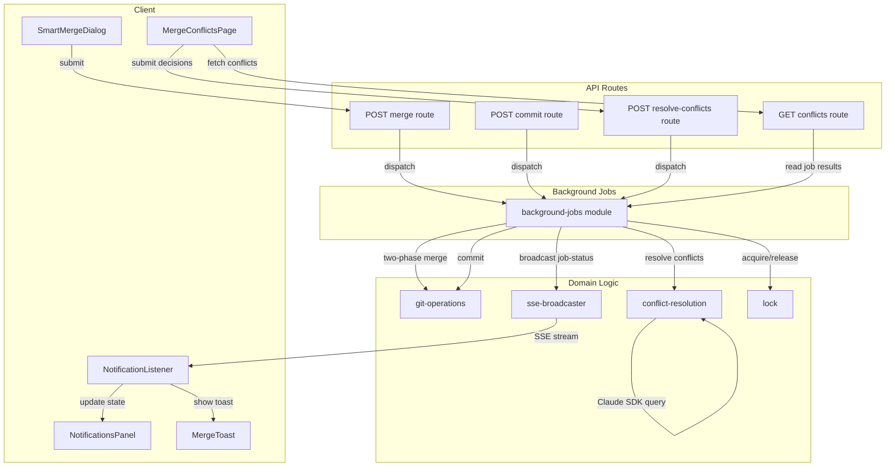
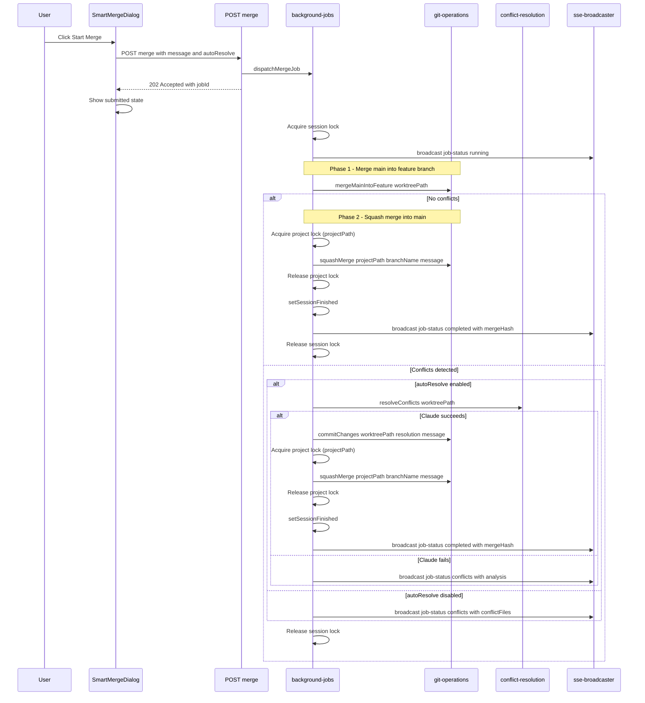
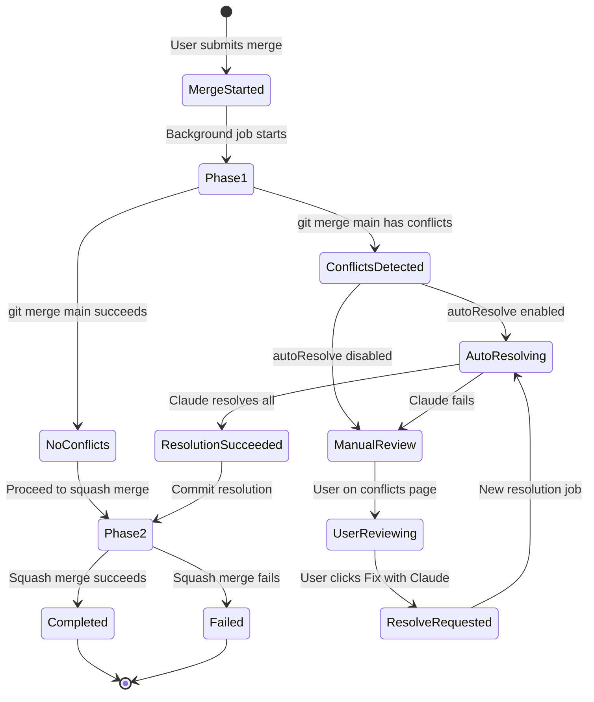
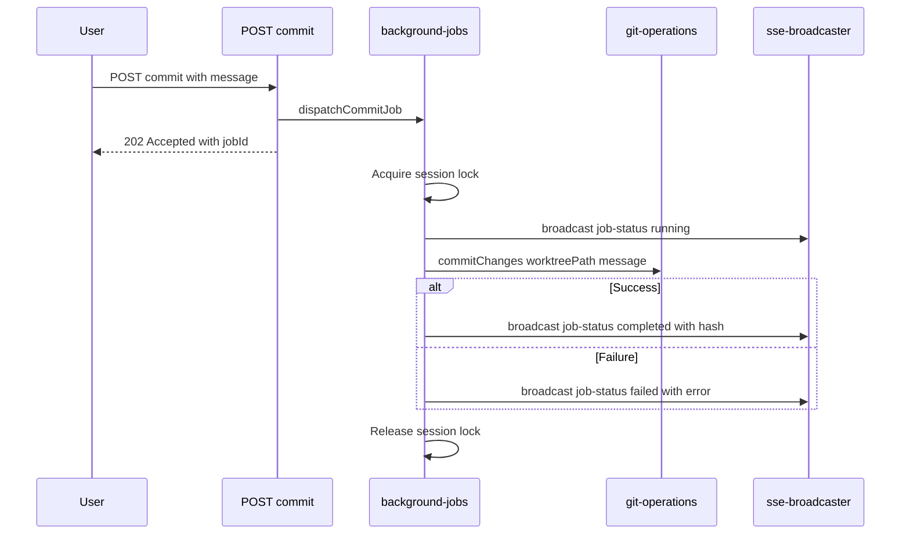
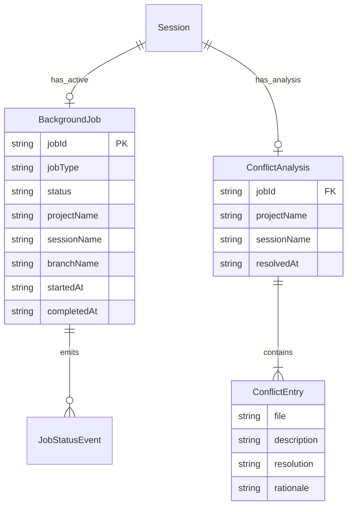

# Design Document: Smart Merge

## Overview

**Purpose**: Smart Merge delivers a safer, non-blocking, AI-assisted merge workflow for CC sessions. It protects the main branch from conflicts by resolving them on the feature branch first, frees users from waiting on long-running git operations by running them as background jobs, and provides automated conflict resolution powered by Claude Code with structured per-conflict review controls.

**Users**: Developers using CC to manage parallel Claude Code sessions will use this for merging completed session work into main without blocking their workflow or risking a dirty main branch.

**Impact**: Replaces the current synchronous merge dialog and flow with an async two-phase pipeline. Replaces the UnifiedPanel with a NotificationsPanel that surfaces both conversation activity and background job results.

### Goals
- Eliminate the risk of leaving main in a conflicted state by resolving conflicts on the feature branch first
- Remove blocking UI during commit and merge operations by running them as background jobs with SSE-delivered results
- Provide AI-powered conflict resolution with structured per-conflict output and a manual review page
- Unify conversation and job activity monitoring in a single notifications panel

### Non-Goals
- Job persistence across server restarts (in-memory only; recovery via worktree state detection)
- Job cancellation (background git operations are not safely cancellable mid-execution)
- Conflict resolution for binary files (directed to manual resolution)
- Changes to the existing prompt execution pipeline (only commit and merge become async)

## Architecture

### Existing Architecture Analysis

The current merge flow is synchronous and direct: `MergeDialog` → `useMergeMutation` → `POST /merge` route → `squashMerge()` → response → navigate away. Conflicts abort the merge immediately and clean up the main branch. The session lock (`lock.ts`) prevents concurrent operations but is scoped to the HTTP request lifecycle. SSE broadcasting (`sse-broadcaster.ts`) delivers `conversation-status` and `ask-question` events to `NotificationListener.tsx`. All patterns use `globalThis` singletons for HMR safety.

Key constraints:
- `squashMerge()` operates on `projectPath` (main branch), not the session worktree
- The session lock's `release()` closure is portable — callable from any async context
- SSE broadcast uses `event.type` for dynamic routing — adding event types requires no broadcaster changes

### Architecture Pattern & Boundary Map



**Architecture Integration**:
- Selected pattern: Hybrid — new `background-jobs.ts` module for job lifecycle, extending existing SSE/lock infrastructure
- Domain boundaries: Route handlers validate and dispatch; `background-jobs` owns execution, state, and notifications; `conflict-resolution` owns Claude SDK interaction; `git-operations` owns all git primitives
- Existing patterns preserved: `globalThis` singleton storage, `acquireSessionLock`, `broadcast(SSEEvent)`, Zod schema-first data modeling
- New components rationale: `background-jobs.ts` (new lifecycle concept), `conflict-resolution.ts` (new Claude SDK use case), `resolve-conflicts` route (new API surface)
- Steering compliance: filesystem-backed state for job results (via worktree state), no external dependencies, single-flight locking

### Technology Stack

| Layer | Choice / Version | Role in Feature | Notes |
|-------|------------------|-----------------|-------|
| Frontend | React 19 + Next.js 15 App Router | SmartMergeDialog, MergeConflictsPage, NotificationsPanel, MergeToast | Existing stack; UI prototypes already built |
| Backend | Next.js API routes + Node.js | Merge/commit/conflict API endpoints, background job dispatch | Existing stack |
| AI | `@anthropic-ai/claude-agent-sdk` `query()` | Conflict analysis and resolution | Existing dependency; new use case |
| Messaging | SSE via `sse-broadcaster.ts` | `job-status` event delivery to all clients | Extended with one new event type |
| State | In-memory `globalThis` Map | Background job registry and results | Follows existing `sse-broadcaster` pattern |

## System Flows

### Two-Phase Merge Pipeline



### Conflict Resolution Flow



### Background Commit Flow



## Requirements Traceability

| Requirement | Summary | Components | Interfaces | Flows |
|-------------|---------|------------|------------|-------|
| 1.1 | Merge main into feature branch first | git-operations: `mergeMainIntoFeature` | Service | Two-Phase Merge Pipeline |
| 1.2 | Proceed to squash merge after phase 1 success | background-jobs: merge pipeline | Service | Two-Phase Merge Pipeline |
| 1.3 | Halt on conflicts, report files, do not modify main | background-jobs: merge pipeline, git-operations | Service, Event | Two-Phase Merge Pipeline |
| 1.4 | Leave worktree in conflict state | git-operations: `mergeMainIntoFeature` | Service | Two-Phase Merge Pipeline |
| 1.5 | Report merge commit hash | background-jobs: merge pipeline | Event | Two-Phase Merge Pipeline |
| 2.1 | Fire-and-forget merge API | merge route, background-jobs | API | Two-Phase Merge Pipeline |
| 2.2 | Hold session lock during merge job | background-jobs | Service | Two-Phase Merge Pipeline |
| 2.3 | Broadcast merge result via SSE | background-jobs, sse-broadcaster | Event | Two-Phase Merge Pipeline |
| 2.4 | Allow navigation during merge | SmartMergeDialog | — | — |
| 2.5 | Toast on merge success | MergeToast, NotificationListener | Event | — |
| 2.6 | Toast on merge conflicts | MergeToast, NotificationListener | Event | — |
| 2.7 | Toast on merge error | MergeToast, NotificationListener | Event | — |
| 3.1 | Fire-and-forget commit API | commit route, background-jobs | API | Background Commit Flow |
| 3.2 | Hold session lock during commit job | background-jobs | Service | Background Commit Flow |
| 3.3 | Broadcast commit result via SSE | background-jobs, sse-broadcaster | Event | Background Commit Flow |
| 3.4 | Notification on commit success | NotificationListener, MergeToast | Event | Background Commit Flow |
| 3.5 | Notification on commit error | NotificationListener, MergeToast | Event | Background Commit Flow |
| 4.1 | In-memory job registry keyed by session | background-jobs | State | — |
| 4.2 | Job lifecycle states | background-jobs | State | — |
| 4.3 | Broadcast job-status SSE event on transitions | background-jobs, sse-broadcaster | Event | — |
| 4.4 | Prevent concurrent jobs per session | background-jobs, lock | Service | — |
| 4.5 | Guaranteed lock release (try/finally) | background-jobs | Service | — |
| 4.6 | Stale job timeout recovery | background-jobs | Service | — |
| 4.7 | Project-level lock for squash merge serialization | background-jobs, lock | Service | Two-Phase Merge Pipeline |
| 4.8 | Project lock timeout with error | background-jobs, lock | Service | Two-Phase Merge Pipeline |
| 5.1 | Auto-resolve toggle in merge dialog | SmartMergeDialog | — | — |
| 5.2 | Auto-invoke Claude on conflicts | background-jobs, conflict-resolution | Service | Conflict Resolution Flow |
| 5.3 | Notify user on manual review mode | background-jobs | Event | Conflict Resolution Flow |
| 5.4 | Commit resolution and continue merge | background-jobs, git-operations | Service | Conflict Resolution Flow |
| 5.5 | Fallback to manual on Claude failure | background-jobs | Service | Conflict Resolution Flow |
| 6.1 | Invoke Claude SDK query for conflict analysis | conflict-resolution | Service | Conflict Resolution Flow |
| 6.2 | Structured output per conflict | conflict-resolution | Service | Conflict Resolution Flow |
| 6.3 | Store results via conflicts API | background-jobs, conflicts route | API, State | — |
| 6.4 | Resolve conflict markers in working tree | conflict-resolution | Service | Conflict Resolution Flow |
| 7.1 | Expandable conflict review cards | MergeConflictsPage | — | — |
| 7.2 | Per-conflict approve/reject | MergeConflictsPage | — | — |
| 7.3 | Auto-collapse on approve | MergeConflictsPage | — | — |
| 7.4 | Feedback textarea on reject | MergeConflictsPage | — | — |
| 7.5 | Summary banner | MergeConflictsPage | — | — |
| 7.6 | Accept All and Fix action | MergeConflictsPage, resolve-conflicts route | API | — |
| 7.7 | Fix with Claude action | MergeConflictsPage, resolve-conflicts route | API | — |
| 7.8 | Navigate away without losing progress | conflicts route, background-jobs | State | — |
| 8.1 | Slide-in notifications panel in topbar | NotificationsPanel, Topbar | — | — |
| 8.2 | Conversations and Jobs sections | NotificationsPanel | — | — |
| 8.3 | Conversation and job notification types | NotificationsPanel | — | — |
| 8.4 | Notification item metadata | NotificationsPanel | — | — |
| 8.5 | Click-to-navigate | NotificationsPanel | — | — |
| 8.6 | Topbar badge with active count | Topbar, NotificationsPanel | — | — |
| 8.7 | Real-time SSE updates | NotificationListener, NotificationsPanel | Event | — |
| 9.1 | Merge dialog with branch info and toggle | SmartMergeDialog | — | — |
| 9.2 | Uncommitted changes warning | SmartMergeDialog | — | — |
| 9.3 | Submitted confirmation state | SmartMergeDialog | — | — |
| 9.4 | Contextual messaging by auto-resolve setting | SmartMergeDialog | — | — |
| 9.5 | Dismissible at any time | SmartMergeDialog | — | — |
| 9.6 | Cmd/Ctrl+Enter submit | SmartMergeDialog | — | — |

## Components and Interfaces

| Component | Domain/Layer | Intent | Req Coverage | Key Dependencies | Contracts |
|-----------|-------------|--------|-------------|-----------------|-----------|
| background-jobs | Backend/Infrastructure | Manage job lifecycle, dispatch, state tracking, SSE broadcast | 2.1-2.3, 3.1-3.3, 4.1-4.8, 5.2-5.5 | lock (P0), git-operations (P0), conflict-resolution (P0), sse-broadcaster (P0) | Service, Event, State |
| lock (extension) | Backend/Infrastructure | Project-level lock to serialize squash merges across sessions | 1.2, 2.2 | — | Service |
| git-operations (extension) | Backend/Domain | Two-phase merge, conflict detection | 1.1-1.5 | — | Service |
| conflict-resolution | Backend/Domain | Claude SDK conflict analysis and resolution | 6.1-6.4 | claude-agent-sdk (P0), git-operations (P1) | Service |
| merge route (extension) | Backend/API | Async merge dispatch | 2.1, 9.3 | background-jobs (P0) | API |
| commit route (extension) | Backend/API | Async commit dispatch | 3.1 | background-jobs (P0) | API |
| conflicts route (new) | Backend/API | Conflict data retrieval | 6.3, 7.8 | background-jobs (P0) | API |
| resolve-conflicts route (new) | Backend/API | Conflict resolution dispatch | 7.6, 7.7 | background-jobs (P0) | API |
| SmartMergeDialog (wiring) | Frontend/UI | Submit merge as background job | 9.1-9.6 | merge route (P0) | — |
| MergeConflictsPage (wiring) | Frontend/UI | Review and act on conflict analysis | 7.1-7.8 | conflicts route (P0), resolve-conflicts route (P0) | — |
| NotificationListener (extension) | Frontend/Infrastructure | Handle job-status SSE events | 8.7 | sse-broadcaster (P0), notification.store (P0) | Event |
| notification.store (new) | Frontend/State | Zustand store for job notifications and toast queue | 8.2, 8.3, 8.7 | — | State |
| NotificationsPanel (wiring) | Frontend/UI | Display conversations and jobs | 8.1-8.6 | notification.store (P0) | — |
| MergeToast (wiring) | Frontend/UI | Ephemeral job result notifications | 2.5-2.7, 3.4-3.5 | notification.store (P0) | — |
| Topbar (extension) | Frontend/UI | NotificationsPanel toggle, badge | 8.1, 8.6 | NotificationsPanel (P0) | — |
| SessionDetailPage (extension) | Frontend/UI | Swap MergeDialog for SmartMergeDialog | 9.1 | SmartMergeDialog (P0) | — |
| conflicts page route (new) | Frontend/Route | Next.js page wrapping MergeConflictsPage | 7.1 | MergeConflictsPage (P0), conflicts route (P0) | — |

### Backend / Infrastructure

#### background-jobs

| Field | Detail |
|-------|--------|
| Intent | Manage lifecycle of background commit and merge jobs: dispatch, execute, track state, broadcast results |
| Requirements | 2.1-2.3, 3.1-3.3, 4.1-4.8, 5.2-5.5 |

**Responsibilities & Constraints**
- Owns the in-memory job registry (Map of active/completed jobs per session)
- Orchestrates the two-phase merge pipeline (phase 1 → conflict check → auto-resolve or manual → phase 2)
- Acquires and releases the session lock around job execution
- Broadcasts `job-status` SSE events on every state transition
- Stores conflict analysis results for retrieval by the conflicts API
- Prevents concurrent jobs per session (rejects new jobs if one is active)

**Dependencies**
- Inbound: merge route, commit route, resolve-conflicts route — dispatch jobs (P0)
- Outbound: git-operations — `mergeMainIntoFeature`, `squashMerge`, `commitChanges` (P0)
- Outbound: conflict-resolution — `resolveConflicts` (P0)
- Outbound: sse-broadcaster — `broadcast` (P0)
- Outbound: lock — `acquireSessionLock`, `acquireProjectLock` (P0)
- Outbound: state — `setSessionFinished` (P0)

**Contracts**: Service [x] / Event [x] / State [x]

##### Service Interface

```typescript
interface BackgroundJobsService {
  dispatchMergeJob(params: {
    projectPath: string;
    sessionName: string;
    worktreePath: string;
    branchName: string;
    message: string;
    autoResolve: boolean;
  }): Result<{ jobId: string }, JobDispatchError>;

  dispatchCommitJob(params: {
    projectPath: string;
    sessionName: string;
    worktreePath: string;
    message: string;
  }): Result<{ jobId: string }, JobDispatchError>;

  dispatchResolveConflictsJob(params: {
    projectPath: string;
    sessionName: string;
    worktreePath: string;
    branchName: string;
    mergeMessage: string;
    decisions?: ConflictDecisionInput[];
  }): Result<{ jobId: string }, JobDispatchError>;

  getJob(projectPath: string, sessionName: string): BackgroundJob | undefined;

  getConflictAnalysis(projectPath: string, sessionName: string): ConflictAnalysis | undefined;
}

type JobDispatchError = "SESSION_BUSY" | "JOB_ALREADY_RUNNING";
```

- Preconditions: Session must exist, not be finished, and not have an active job
- Postconditions: Job is registered, session lock is acquired, SSE `running` event is broadcast
- Invariants: At most one active job per session at any time

##### Event Contract

Published events:
```typescript
// JobStatusEvent — broadcast on every state transition
{
  type: "job-status";
  jobType: "commit" | "merge" | "resolve-conflicts";
  status: "running" | "completed" | "failed" | "conflicts";
  projectName: string;
  sessionName: string;
  jobId: string;
  // Result fields (present based on status)
  mergeHash?: string;      // completed merge
  commitHash?: string;     // completed commit
  conflictCount?: number;  // conflicts status
  conflictFiles?: string[];// conflicts status
  errorMessage?: string;   // failed status
  branchName: string;
}
```

Ordering / delivery guarantees: Events are broadcast to all connected SSE clients. No ordering guarantees beyond SSE stream ordering. Clients that reconnect may miss events (acceptable for ephemeral job status).

##### State Management

```typescript
interface BackgroundJob {
  jobId: string;
  jobType: "commit" | "merge" | "resolve-conflicts";
  status: "running" | "completed" | "failed" | "conflicts";
  projectName: string;
  sessionName: string;
  branchName: string;
  startedAt: string;       // ISO timestamp
  completedAt?: string;    // ISO timestamp
  // Result data
  mergeHash?: string;
  commitHash?: string;
  conflictCount?: number;
  conflictFiles?: string[];
  errorMessage?: string;
}

interface ConflictAnalysis {
  jobId: string;
  projectName: string;
  sessionName: string;
  conflicts: ConflictEntry[];
  resolvedAt?: string;     // set after successful resolution
}

interface ConflictEntry {
  file: string;
  description: string;
  resolution: string;
  rationale: string;
}
```

- Persistence: `globalThis.__cc_background_jobs` Map keyed by `"${projectPath}::${sessionName}"`
- Consistency: Single-writer (only the background job's async execution writes to its own entry)
- Concurrency: Dispatch functions check for existing active job before accepting; session lock prevents concurrent git operations

**Implementation Notes**
- The job registry uses the same `globalThis` singleton pattern as `sse-broadcaster.ts` to survive HMR
- Job dispatch is synchronous: validates, acquires lock, registers job, spawns un-awaited Promise, returns jobId
- The Promise's execution acquires no additional locks — the session lock from dispatch is passed via closure
- **Lock safety**: The background job Promise MUST wrap its entire execution in `try/finally` to guarantee the session lock is released even on unhandled exceptions, OOM, or Claude SDK stream errors. The `finally` block releases the lock and transitions the job to `failed` if it hasn't already reached a terminal state.
- **Stale lock recovery**: A `JOB_TIMEOUT_MS` constant (default: 10 minutes) acts as a safety net. When `dispatchMergeJob` / `dispatchCommitJob` rejects with `JOB_ALREADY_RUNNING`, the caller checks `startedAt` — if the running job exceeds `JOB_TIMEOUT_MS`, it is force-transitioned to `failed`, its lock is released, and the new job is accepted. This handles edge cases where `try/finally` is insufficient (e.g., process-level crashes between restarts are already handled since in-memory locks are cleared on restart).
- On completion, the job entry remains in the registry for the conflicts API to read. Entries are overwritten on the next job dispatch for the same session.
- Conflict analysis results are stored in a separate `globalThis.__cc_conflict_analysis` Map so they persist across job completions

---

#### lock (extension)

| Field | Detail |
|-------|--------|
| Intent | Add project-level lock to serialize squash merge operations across sessions |
| Requirements | 1.2, 2.2 |

**Contracts**: Service [x]

##### Service Interface

```typescript
// New function added to lock.ts
function acquireProjectLock(projectPath: string): () => void;
```

- Preconditions: No other project-level lock is held for `projectPath`
- Postconditions: Lock is held; returned closure releases it
- Throws: If a project lock is already held for `projectPath`

**Implementation Notes**
- Uses the same `globalThis` singleton pattern as session locks: `globalThis.__cc_project_locks` Map keyed by `projectPath`
- Scoped narrowly: acquired only around the `squashMerge()` call in the merge pipeline (not the entire job). This ensures that two sessions' Phase 1 (merge main into feature branch) can run concurrently, but Phase 2 (squash merge into main) is serialized.
- The background-jobs merge pipeline acquires the project lock, calls `squashMerge()`, then releases it in a `try/finally` block — independent of the session lock lifecycle.
- If the project lock is held when a job reaches Phase 2, the job waits with a simple retry-with-backoff loop (100ms intervals, up to 30s timeout). On timeout, the job transitions to `failed` with an explanatory error message.

---

#### git-operations (extension)

| Field | Detail |
|-------|--------|
| Intent | Add two-phase merge capability: merge main into feature branch with conflict detection |
| Requirements | 1.1-1.5 |

**Contracts**: Service [x]

##### Service Interface

```typescript
// New function added to git-operations.ts
async function mergeMainIntoFeature(
  worktreePath: string
): Promise<MergeMainResult>;

type MergeMainResult =
  | { status: "clean" }
  | { status: "conflicts"; conflictFiles: string[] };
```

- Preconditions: `worktreePath` is a valid git worktree with a branch diverged from `main`
- Postconditions:
  - `clean`: main is merged into the feature branch; worktree is in a clean merge state
  - `conflicts`: worktree is left in a conflicted merge state (conflict markers present in files); `conflictFiles` lists all unmerged paths
- Invariants: The main branch (projectPath) is never modified by this function

**Implementation Notes**
- Runs `git merge main` in the session worktree (not projectPath)
- On success: returns `{ status: "clean" }`
- On error: inspects stderr for `CONFLICT` / `merge conflict`. If conflict detected: runs `git diff --name-only --diff-filter=U` to list conflicted files. Does NOT abort the merge — leaves the worktree in conflict state per requirement 1.4. Returns `{ status: "conflicts", conflictFiles }`
- On non-conflict error: rethrows

---

#### conflict-resolution

| Field | Detail |
|-------|--------|
| Intent | Invoke Claude Agent SDK to analyze and resolve merge conflicts in a session worktree |
| Requirements | 6.1-6.4 |

**Responsibilities & Constraints**
- Constructs the conflict resolution prompt adapted from the `fix-merge-conflicts` skill
- Invokes `query()` with full tool access in the session worktree
- Extracts structured `ConflictEntry[]` from Claude's assistant text output
- Claude both resolves conflict markers in files AND produces the structured analysis

**Dependencies**
- Outbound: `@anthropic-ai/claude-agent-sdk` `query()` — AI execution (P0)
- Inbound: background-jobs — called during merge pipeline (P0)

**Contracts**: Service [x]

##### Service Interface

```typescript
async function resolveConflicts(params: {
  worktreePath: string;
  decisions?: ConflictDecisionInput[];
}): Promise<ConflictResolutionResult>;

interface ConflictDecisionInput {
  file: string;
  decision: "approved" | "rejected" | "pending";
  feedback?: string;  // user guidance when rejected
}

type ConflictResolutionResult =
  | { status: "resolved"; conflicts: ConflictEntry[] }
  | { status: "failed"; error: string; partialConflicts?: ConflictEntry[] };
```

- Preconditions: Worktree is in a merge conflict state (conflict markers present)
- Postconditions:
  - `resolved`: All conflict markers are removed from files. Files are staged with `git add`. `conflicts` contains the structured analysis.
  - `failed`: Some or all conflicts remain. `partialConflicts` may contain analysis for conflicts that were resolved before failure.
- Invariants: The function does not commit — the caller (background-jobs) handles committing the resolution

**Implementation Notes**
- System prompt instructs Claude to: (1) run `git diff --name-only --diff-filter=U` to find conflicts, (2) read and analyze each conflicted file, (3) edit files to resolve conflict markers, (4) stage resolved files with `git add`, (5) output a JSON code fence with `ConflictEntry[]` schema
- When `decisions` are provided (manual review re-submission): the prompt includes per-file instructions — approved files are resolved freely, rejected files incorporate the user's feedback guidance, pending files are resolved with extra care
- Uses `query()` with: `permissionMode: "bypassPermissions"`, `allowDangerouslySkipPermissions: true`, `systemPrompt` with preset `claude_code` and appended conflict resolution instructions, `maxTurns` unlimited (Claude may need multiple tool calls), `persistSession: false` (no need to resume)
- JSON extraction: after the stream completes, scan all assistant text blocks for the last ````json` code fence, parse with `conflictEntryArraySchema.safeParse()`. On parse failure: return `{ status: "failed", error: "Could not extract structured analysis" }`
- Abort timeout: uses the existing `claudeTimeoutMs` from global config

---

### Backend / API

#### POST /api/projects/[name]/sessions/[session]/merge (extension)

| Field | Detail |
|-------|--------|
| Intent | Accept merge request, dispatch as background job, return 202 immediately |
| Requirements | 2.1 |

##### API Contract

| Method | Endpoint | Request | Response | Errors |
|--------|----------|---------|----------|--------|
| POST | /api/projects/[name]/sessions/[session]/merge | `SmartMergeRequest` | 202 `{ jobId }` | 400, 404, 409 |

```typescript
// Extended request schema
interface SmartMergeRequest {
  message: string;       // merge commit message
  autoResolve: boolean;  // whether to auto-invoke Claude on conflicts
}
```

**Implementation Notes**
- Retains existing validation (project exists, session exists, not finished, message non-empty)
- Removes the synchronous `squashMerge()` call
- Calls `dispatchMergeJob()` from background-jobs — returns 202 with `{ jobId }` on success
- Returns 409 with `code: "SESSION_BUSY"` if a job is already running (from `dispatchMergeJob` rejection)
- No longer checks for uncommitted changes or commit count — the background job handles the full pipeline (including auto-committing uncommitted changes if needed per requirement 9.2)

---

#### POST /api/projects/[name]/sessions/[session]/commit (extension)

| Field | Detail |
|-------|--------|
| Intent | Accept commit request, dispatch as background job, return 202 immediately |
| Requirements | 3.1 |

##### API Contract

| Method | Endpoint | Request | Response | Errors |
|--------|----------|---------|----------|--------|
| POST | /api/projects/[name]/sessions/[session]/commit | `CommitRequest` | 202 `{ jobId }` | 400, 404, 409 |

**Implementation Notes**
- Retains existing validation (project exists, session exists, not finished, message non-empty)
- Calls `dispatchCommitJob()` from background-jobs
- Returns 202 with `{ jobId }` on success

---

#### GET /api/projects/[name]/sessions/[session]/conflicts (new)

| Field | Detail |
|-------|--------|
| Intent | Retrieve stored conflict analysis results for a session |
| Requirements | 6.3, 7.8 |

##### API Contract

| Method | Endpoint | Request | Response | Errors |
|--------|----------|---------|----------|--------|
| GET | /api/projects/[name]/sessions/[session]/conflicts | — | `{ conflicts, jobId, resolvedAt? }` | 404 |

**Implementation Notes**
- Reads from `getConflictAnalysis()` on background-jobs module
- Returns 404 if no conflict analysis exists for this session
- Results persist in memory across page navigations (requirement 7.8)

---

#### POST /api/projects/[name]/sessions/[session]/resolve-conflicts (new)

| Field | Detail |
|-------|--------|
| Intent | Accept conflict resolution decisions and dispatch a resolve-conflicts background job |
| Requirements | 7.6, 7.7 |

##### API Contract

| Method | Endpoint | Request | Response | Errors |
|--------|----------|---------|----------|--------|
| POST | /api/projects/[name]/sessions/[session]/resolve-conflicts | `ResolveConflictsRequest` | 202 `{ jobId }` | 400, 404, 409 |

```typescript
interface ResolveConflictsRequest {
  mergeMessage: string;   // original merge commit message
  decisions?: ConflictDecisionInput[];  // per-conflict decisions from review page
}
```

**Implementation Notes**
- Validates session exists and is in conflict state
- Calls `dispatchResolveConflictsJob()` from background-jobs
- If resolution succeeds, the background job automatically proceeds to squash merge

---

### Backend / Domain

#### schemas.ts (extension)

New Zod schemas added:

```typescript
// Job status SSE event
const jobStatusEventSchema = z.object({
  type: z.literal("job-status"),
  jobType: z.enum(["commit", "merge", "resolve-conflicts"]),
  status: z.enum(["running", "completed", "failed", "conflicts"]),
  projectName: z.string(),
  sessionName: z.string(),
  jobId: z.string(),
  branchName: z.string(),
  mergeHash: z.string().optional(),
  commitHash: z.string().optional(),
  conflictCount: z.number().optional(),
  conflictFiles: z.array(z.string()).optional(),
  errorMessage: z.string().optional(),
});

// Extended SSE event union
type SSEEvent = ConversationStatusEvent | AskQuestionEvent | JobStatusEvent;

// Smart merge request
const smartMergeRequestSchema = z.object({
  message: z.string().trim().min(1),
  autoResolve: z.boolean(),
});

// Conflict analysis
const conflictEntrySchema = z.object({
  file: z.string(),
  description: z.string(),
  resolution: z.string(),
  rationale: z.string(),
});

// Resolve conflicts request
const resolveConflictsRequestSchema = z.object({
  mergeMessage: z.string().trim().min(1),
  decisions: z.array(z.object({
    file: z.string(),
    decision: z.enum(["approved", "rejected", "pending"]),
    feedback: z.string().optional(),
  })).optional(),
});
```

---

### Frontend / Infrastructure

#### NotificationListener (extension)

| Field | Detail |
|-------|--------|
| Intent | Extend SSE listener to handle `job-status` events, feed data to NotificationsPanel and trigger toasts |
| Requirements | 8.7, 2.5-2.7, 3.4-3.5 |

**Implementation Notes**
- Add `es.addEventListener("job-status", handler)` alongside existing listeners
- Parse event data with `jobStatusEventSchema.safeParse()`
- On `completed` merge: show success MergeToast, invalidate session queries
- On `conflicts`: show conflicts MergeToast, store conflict data in client-side state
- On `failed`: show error MergeToast
- On `completed` commit: show success toast, invalidate diff and commits queries
- Feed job events into the `useNotificationStore` Zustand store (see below) consumed by NotificationsPanel and MergeToast

---

### Frontend / UI

UI components are already prototyped. The following describes the wiring work needed.

#### SmartMergeDialog (wiring)

| Field | Detail |
|-------|--------|
| Intent | Wire handleSubmit to POST merge API, pass autoResolve |
| Requirements | 9.1-9.6 |

**Implementation Notes**
- Replace stub `handleSubmit` with: `fetch(POST /api/.../merge, { message, autoResolve })` → on 202: set `submitted = true` → on 409: show error
- Add to SessionDetailPage in place of current MergeDialog
- The `hasUncommittedChanges` prop is already available from SessionDetailPage

#### MergeConflictsPage (wiring)

| Field | Detail |
|-------|--------|
| Intent | Wire to conflicts API for data, resolve-conflicts API for actions |
| Requirements | 7.1-7.8 |

**Implementation Notes**
- Fetch conflict data from `GET /api/.../conflicts` on mount
- Wire `onAcceptAll` to `POST /api/.../resolve-conflicts` with all decisions set to `approved`
- Wire `onFixApproved` to `POST /api/.../resolve-conflicts` with per-conflict decisions
- Create `src/app/projects/[name]/[session]/conflicts/page.tsx` route that renders the component with fetched data

#### notification.store.ts (new)

| Field | Detail |
|-------|--------|
| Intent | Zustand store for background job notifications, consumed by NotificationsPanel and MergeToast |
| Requirements | 8.2, 8.3, 8.7 |

**Store Shape**

```typescript
// src/stores/notification.store.ts
interface NotificationStore {
  // State
  jobs: Map<string, BackgroundJob>;        // keyed by jobId
  toastQueue: JobStatusEvent[];            // FIFO queue for MergeToast

  // Actions
  addOrUpdateJob(event: JobStatusEvent): void;  // upsert from SSE event
  dismissToast(): void;                          // pop from toast queue
  getActiveJobs(): BackgroundJob[];              // running or actionable (conflicts)
  getJobsBySession(projectName: string, sessionName: string): BackgroundJob[];
}
```

- Uses `immer` middleware consistent with existing Zustand stores (`unified-panel.store.ts`)
- `addOrUpdateJob`: called by NotificationListener on each `job-status` SSE event. Upserts into `jobs` Map. If the event represents a terminal state (`completed`, `failed`, `conflicts`), also pushes to `toastQueue`.
- `toastQueue`: consumed by MergeToast — displays one at a time, auto-dismissed after 8 seconds or manually by user.
- `getActiveJobs`: returns jobs with `status === "running"` or `status === "conflicts"` (actionable).

#### NotificationsPanel (wiring)

| Field | Detail |
|-------|--------|
| Intent | Replace UnifiedPanel, connect to Zustand notification store |
| Requirements | 8.1-8.6 |

**Implementation Notes**
- Reads job data from `useNotificationStore` (selectors: `getActiveJobs`, `jobs`)
- Conversations section: populated from existing `useActiveConversationsQuery` data
- Jobs section: populated from `useNotificationStore().jobs` values, sorted by `startedAt` descending
- Replace UnifiedPanel toggle in Topbar with NotificationsPanel toggle
- Badge count: `activeConversations.length + useNotificationStore.getState().getActiveJobs().length`

#### MergeToast (wiring)

| Field | Detail |
|-------|--------|
| Intent | Render ephemeral toasts triggered by job-status SSE events |
| Requirements | 2.5-2.7, 3.4-3.5 |

**Implementation Notes**
- Reads from `useNotificationStore().toastQueue` — displays the first item, calls `dismissToast()` on dismiss or auto-timeout
- Toast queue: only one toast at a time; auto-dismiss after 8 seconds
- Action button navigates to: session page (merge success), conflicts page (conflicts), session page (commit success)
- Rendered in `layout.tsx` as a portal-mounted component

## Data Models

### Domain Model

The feature introduces two new domain concepts that exist in-memory only:

**BackgroundJob** — Represents a running or completed background git operation. Lifecycle: `running → completed | failed | conflicts`. Keyed by `projectPath::sessionName` (at most one active per session). Aggregate root for job state transitions.

**ConflictAnalysis** — Represents the structured result of Claude's conflict analysis for a session. Contains `ConflictEntry[]` with per-file analysis. Stored separately from the job to persist after the job completes. Overwritten on each new conflict analysis invocation.

### Logical Data Model



- In-memory storage: `globalThis.__cc_background_jobs` (Map), `globalThis.__cc_conflict_analysis` (Map)
- Same key structure as existing singletons: `"${projectPath}::${sessionName}"`
- No persistence to state.json — jobs are ephemeral; conflict state is detectable from the worktree's git status

## Error Handling

### Error Strategy

Errors are categorized by recovery path. All job errors are broadcast via SSE `job-status` events with `status: "failed"` and an `errorMessage` field.

### Error Categories and Responses

**User Errors (4xx)**:
- Invalid merge message → 400 with field validation error (existing pattern)
- Session finished → 409 `SESSION_FINISHED` (existing pattern)
- Session busy (concurrent job) → 409 `SESSION_BUSY` — user waits for current job to complete

**System Errors (5xx)**:
- Git command failure during merge → job transitions to `failed`, error broadcast via SSE, session lock released
- Claude SDK failure during conflict resolution → job transitions to `conflicts` (falls back to manual review), error broadcast includes available conflict file list
- Pre-commit hook failure during commit → job transitions to `failed`, error includes hook output (`gitOutput` property)
- Project lock timeout during squash merge → job transitions to `failed` with message "Another merge is in progress for this project. Please retry.", session lock released

**Business Logic Errors (conflict state)**:
- Merge conflicts detected → not an error; job transitions to `conflicts` status with `conflictFiles` list
- Claude partial resolution failure → treated as `conflicts` with partial analysis available for manual review

### Monitoring

All job state transitions are logged via the existing `withTracing` pattern. SSE events provide real-time visibility. No additional monitoring infrastructure needed.

## Testing Strategy

### Unit Tests
- `background-jobs.ts`: dispatch validation, state transitions, concurrent job rejection, lock acquire/release lifecycle, try/finally lock release on unhandled error, stale job timeout recovery
- `lock.ts`: `acquireProjectLock` acquire/release, concurrent acquire rejection, independence from session locks
- `git-operations.ts`: `mergeMainIntoFeature` with clean merge, with conflicts, with non-conflict error
- `conflict-resolution.ts`: JSON extraction from mock Claude responses, Zod parse failures, timeout handling
- `schemas.ts`: `jobStatusEventSchema`, `smartMergeRequestSchema`, `conflictEntrySchema` validation

### Integration Tests
- Merge pipeline end-to-end: dispatch → phase 1 → project lock → phase 2 → SSE broadcast (mock git commands)
- Conflict pipeline: dispatch → phase 1 conflict → auto-resolve → commit resolution → project lock → phase 2 (mock Claude SDK)
- Commit pipeline: dispatch → commit → SSE broadcast (mock git commands)
- Concurrent merge serialization: two sessions' merge jobs reach phase 2 — verify project lock serializes squash merges
- API routes: merge, commit, conflicts, resolve-conflicts request/response validation

### E2E/UI Tests
- SmartMergeDialog: submit → shows submitted state → toast appears on completion
- MergeConflictsPage: load conflicts → approve/reject → Fix with Claude → toast on completion
- NotificationsPanel: open panel → shows active jobs → click navigates to correct page
