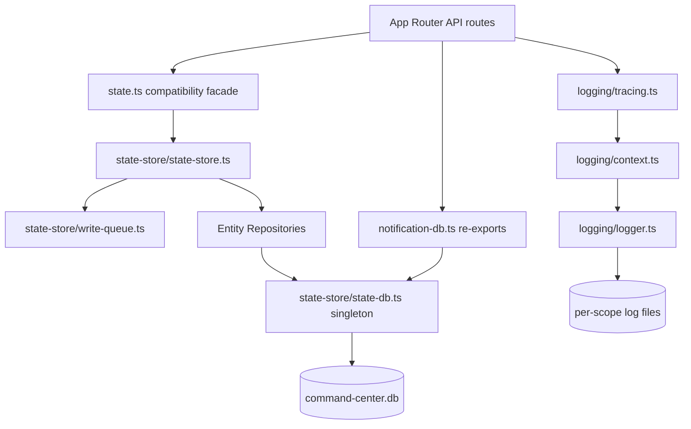
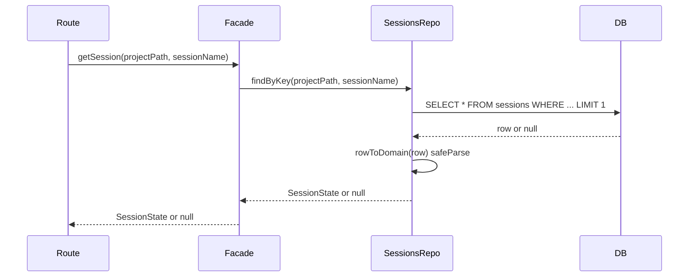
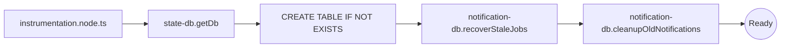
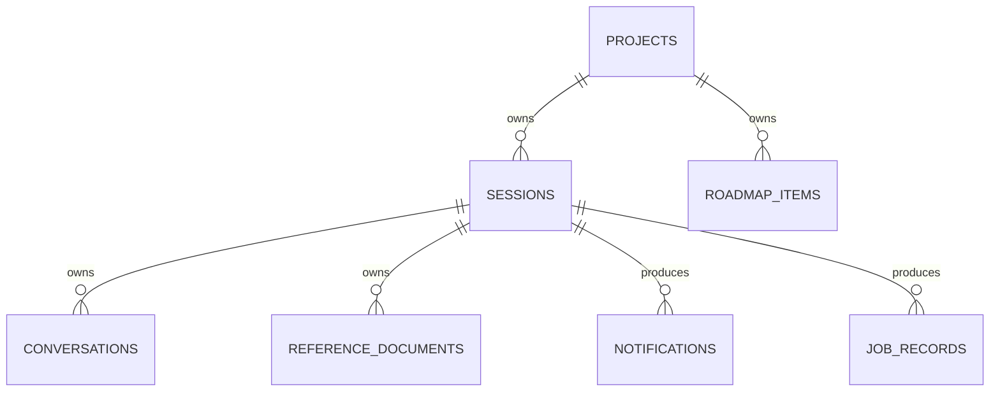
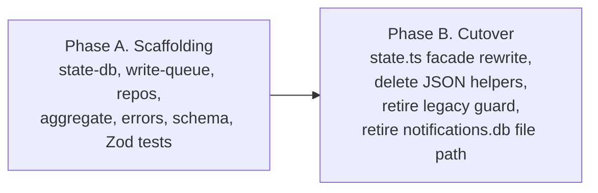

# Technical Design — state-persistence-optimization

## Overview

**Purpose**: Replace the single 17 MB `state.json` persistence layer with a SQLite-backed structured-state store so that page-load latency on the local Command Center web app meets the < 50 ms p95 target (Requirement 1) under the 5–6 parallel-request fan-out characteristic of session views.

**Users**: The single local developer running Command Center. The change is invisible at the API boundary — the existing `readState`, `mutateState`, `mutateSession`, `mutateConversation` exports keep their signatures — but every navigation click becomes near-instant.

**Impact**: All structured application state moves from one JSON file to a single `command-center.db` SQLite file (consolidating the existing `notifications.db`). Transcripts remain on disk as JSONL files (Requirement 7.4). The cutover ships in **one** PR: the SQLite-backed facade replaces the JSON facade, the JSON read/write helpers are deleted, and the new store starts empty per the fresh-start policy (R8.3). There is no JSON→SQLite import, no dual-storage window, and no per-phase gate. Phase 1 measurements already justify the move; a post-cutover re-measurement is recorded for observability but does not gate anything.

### Goals

- Per-request `state.read.timing.totalMs` < 50 ms p95 at parallel x6 against the production-equivalent fixture (Req 1.1).
- Zero hand-edited duplicate types: every persisted row decodes to `z.infer<typeof entitySchema>` (Req 4).
- Drop-in API surface: 0 source changes required at the ~344 existing call sites of `readState`/`mutate*` (Req 5.1).
- Single persistent artifact, consolidated with notifications/job history (Req 6.1, 6.2).
- Per-session and per-conversation log files routed by trace context, with a global fallback (Req 7).
- No `state.json` reads, writes, or imports in the post-cutover codebase (Req 8). The cutover is single-shot; there is no dual-storage window.

### Non-Goals

- Migrating Claude Code transcripts into SQLite. Transcripts remain JSONL files.
- Cross-machine replication, multi-user safety, or any concurrency model beyond single-process single-user.
- Redesign of the React Query / SSE layers. Performance work upstream of `state.read` is out of scope.
- Backward compatibility with the existing `state.json` format. No migration code, no dual-write window, no JSON→SQLite import. Per the fresh-start policy, the local `state.json` contents can be discarded; the new SQLite store boots empty.
- Notification history preservation across the cutover. The existing `notifications.db` contents are discardable per the fresh-start policy.

## Requirements Traceability

| Requirement | Summary | Components | Interfaces | Flows |
|-------------|---------|------------|------------|-------|
| 1.1 | < 50 ms p95 read at parallel x6 | `state-db`, entity repos | `getSession`, `getProjectSessions`, `getConversation`, `getRoadmapItems` | Read path (focused) |
| 1.2 | No off-entity reads for scoped requests | Entity repos | per-entity SELECT statements | Read path (focused) |
| 1.3 | Zod cost bounded to returned entities | Entity repos | `rowToDomain` per entity | Read path (focused) |
| 1.4 | No monotonic per-call I/O growth under load | `state-db` (WAL) | `Database` connection | Read path (focused) |
| 2.1 | Durable on commit | `write-queue`, `state-db` | `withWriteQueue`, `BEGIN IMMEDIATE` | Write path |
| 2.2 | Restart recovery to last commit | `state-db` (WAL recovery) | SQLite recovery | Boot |
| 2.3 | No partial entity writes visible | `write-queue`, `state-db` | Synchronous transaction | Write path |
| 2.4 | Read-after-write consistency in-process | `state-db` single connection | Connection-level visibility | Read path |
| 3.1 | Same-entity arrival-order serialization | `write-queue` | FIFO queue keyed on label | Write path |
| 3.2 | No long-lived app-level read lock | Entity repos (no mutex) | direct SELECT | Read path (focused) |
| 3.3 | Parallel reads not behind a global lock | Entity repos | direct SELECT | Read path (focused) |
| 3.4 | Write-serialization parity | `write-queue` | replaces `withStateLock` | Write path |
| 4.1 | Zod parse on read | Entity repos | `rowToDomain` validates | Read path |
| 4.2 | Zod parse before commit | Entity repos | `domainToRow` validates | Write path |
| 4.3 | Typed errors on validation failure | `errors.ts` | `PersistenceError` discriminated union | All flows |
| 4.4 | `z.infer` types only | Entity repos | derived types from `schemas.ts` | All flows |
| 5.1 | Public signatures preserved | `state-store-facade` | re-exports `readState`/`mutate*` | All flows |
| 5.2 | Focused accessors | Entity repos | `getX(byKey)` | Read path |
| 5.3 | DI factory | `createStateStore(deps)` | injectable `Database` and config | Tests |
| 5.4 | No call-site transaction management | Facade + repos | repos open/commit transactions | Write path |
| 6.1 | Single artifact under config dir | `state-db` | `<config-dir>/command-center.db` | Boot |
| 6.2 | Consolidate with notifications | `state-db` | hosts notification tables | Boot |
| 6.3 | CLI dump | `scripts/dump-state.ts` | reads via SQL views | Inspection |
| 6.4 | Structured timing logs | All repos | `createLogger("state-store.<entity>")` | All flows |
| 7.1 | Per-session log file | `logger.ts` extension | path policy resolves dest | All flows |
| 7.2 | Per-conversation log file | `logger.ts` extension + `TraceContext` | `conversationId` in context | All flows |
| 7.3 | Global fallback | `logger.ts` extension | default path when no scope | All flows |
| 7.4 | Transcripts stay JSONL | `transcript.ts` (unchanged) | — | — |
| 8.1 | No JSON→DB import code | (negative) | — | Cutover gate |
| 8.2 | No dual-read/dual-write at end | (negative) | facade is single-source post-cutover | Cutover gate |
| 8.3 | Empty-store init on first boot | `state-db` | schema CREATE IF NOT EXISTS | Boot |
| 8.4 | No `state.json` references post-cutover | (negative) | grep gate in CI | Cutover gate |
| 9.1 | Post-cutover re-measurement record (observability) | `memory-bank/cutover-results.md` | parallel x6 harness; not used as a gate | Post-cutover |

## Architecture

### Existing Architecture Analysis

- `src/lib/state.ts` already follows the `createStateManager(deps)` factory + DI pattern; tests construct isolated managers against temp dirs without `vi.mock()`. The new store reuses the same shape.
- `src/lib/notification-db.ts` is the canonical in-tree SQLite pattern: `getGlobalSingleton` for HMR safety, WAL pragma, `CREATE TABLE IF NOT EXISTS`, explicit row-mappers, `db.transaction()` for multi-statement integrity. The new store is an extension of this pattern.
- `src/lib/state-mutex.ts` provides the FIFO async write mutex (`withStateLock(label, fn)`). The new store replaces it with a topologically equivalent `withWriteQueue(label, fn)` that is decoupled from the JSON file path.
- `src/lib/logging/{context,logger,tracing}.ts` already enriches logs with trace fields via AsyncLocalStorage. The new design extends `TraceContext` with `conversationId` and adds path-resolution logic at write time.
- Hot endpoints (`/diff`, `/conversations`, `/messages`) currently call `getSession()` which routes through `readState()`. After cutover, those calls hit the SQLite-backed `getSession()` only.

### Architecture Pattern & Boundary Map



**Architecture Integration**:
- **Selected pattern**: Repository + Facade. Per-entity repositories (`projects-repo`, `sessions-repo`, `conversations-repo`, `roadmap-items-repo`, `reference-documents-repo`, `archived-pinned-repo`) own row mapping, validation, and SQL. The facade re-exports the public API names, dispatching to repos.
- **Domain/feature boundaries**: Persistence (state-store) is one boundary; logging routing (logger.ts) is a separate boundary. They share `TraceContext` as the only coupling.
- **Existing patterns preserved**: `createStateManager(deps)` shape, `getGlobalSingleton` HMR safety, `createLogger` module-scoped logger, `withTracing` HOF.
- **New components rationale**: `state-db` (consolidated singleton), `write-queue` (replaces JSON-file mutex), entity repos (focused accessors), inspection script (Req 6.3).
- **Steering compliance**: Schema-first (Req 4 guarantees `z.infer` only); DI over `vi.mock()` (`createStateStore(deps)` accepts an injected `Database`); structured logging (`createLogger("state-store.<entity>")`).

### Storage Ownership

All structured state is SQLite-canonical post-cutover. Pre-cutover, all of it lives in `state.json`. The cutover is single-shot — there is no intermediate state where the two are partitioned across canonical entities, so no runtime ownership classifier and no mixed-slice guard exist. The table below is the entity → storage map that holds across the codebase from cutover onward; it exists for orientation, not for runtime dispatch.

| Canonical Entity | Storage Location | Read Path | Write Path |
|---|---|---|---|
| `project_row` (`root_path`, `mcp_overrides`, `created_at`, `updated_at`) | SQLite (`projects` table) | `projects-repo` focused accessors via composition root | `projects-repo.upsert` inside focused write transaction |
| Archived projection (`state.archivedProjects: string[]`) | Derived from `projects.archived = 1` | `projects-repo.listArchived()` | `projects-repo.setArchived(rootPath, value)` |
| Pinned projection (`state.pinnedProjects: string[]`) | Derived from `projects.pinned = 1` ordered by `projects.pin_order` | `projects-repo.listPinned()` | `projects-repo.setPinned(rootPath, value)` / `projects-repo.reorderPinned(orderedRootPaths)` |
| `session_row` (all `sessionStateSchema` fields including JSON sub-trees stored as text columns) | SQLite (`sessions` table) | `sessions-repo` focused accessors via composition root | `sessions-repo.upsert` inside focused write transaction |
| `conversation_row` (all `conversationStateSchema` fields; transcript bodies stay JSONL per R7.4) | SQLite (`conversations` table) | `conversations-repo` focused accessors via composition root | `conversations-repo.upsert` inside focused write transaction |
| `reference_document_row` | SQLite (`reference_documents` table) | `reference-documents-repo` focused accessors via composition root | `reference-documents-repo.upsert` inside focused write transaction |
| `roadmap_item` | SQLite (`roadmap_items` table) | `roadmap-items-repo` focused accessors via composition root | `roadmap-items-repo.upsert` / `delete` inside focused write transaction |
| `notification_row` / `background_job_row` | SQLite (existing `notification-db` tables, now consolidated onto same `state-db` connection per R6.2) | `notification-db` accessors | `notification-db` writers |

### Technology Stack

| Layer | Choice / Version | Role in Feature | Notes |
|-------|------------------|-----------------|-------|
| Backend / Services | Next.js 16 App Router (existing) | Hosts API routes that call the facade | No change |
| Data / Storage | `better-sqlite3` (existing in-tree dep) WAL mode | Single-process structured store | Same library backing `notification-db.ts`; one connection per process |
| Validation | Zod v4 (existing) | Row encode/decode at the persistence boundary | `safeParse` on read, `parse` on write (input is internal) |
| Concurrency | In-process FIFO promise queue (`write-queue.ts`) | Async write serialization | Replaces `state-mutex.ts` |
| Observability | `createLogger`/AsyncLocalStorage (existing) extended with destination-path resolution | Per-entity timing + scoped log routing | Adds `conversationId` to `TraceContext` |
| Tooling | `bun scripts/dump-state.ts` (new) | Human-readable DB inspection | Required by Req 6.3 |

## System Flows

### Read path (focused accessor — fast)



Key decisions: no read-time mutex; one indexed query per accessor; Zod validation only on the entity actually returned (Req 1.3).

### Write path

```mermaid
sequenceDiagram
    participant Route
    participant Facade
    participant Queue as write-queue
    participant Repo as SessionsRepo
    participant DB
    Route->>Facade: mutateSession(p, s, label, cb)
    Facade->>Queue: withWriteQueue(label, run)
    Note over Queue: FIFO serialization across all writes
    Queue->>Repo: load(p, s)
    Repo->>DB: SELECT row
    Repo-->>Queue: SessionState
    Queue->>Queue: await cb(session, project)
    Queue->>Repo: save(p, s, mutated)
    Repo->>Repo: domainToRow + Zod parse
    Repo->>DB: BEGIN IMMEDIATE; UPDATE sessions ...; COMMIT
    DB-->>Repo: ok
    Repo-->>Queue: result
    Queue-->>Facade: result
    Facade-->>Route: result
```

Key decisions: callback runs **outside** the SQLite transaction so it can be async (per `mutateConversation`'s domain logic which awaits inside the callback); the transaction itself is synchronous and minimal (`BEGIN IMMEDIATE` → one or more UPDATEs → `COMMIT`). FIFO arrival order across the JS write-queue gives Req 3.1.

### `mutateState` full-diff path

```mermaid
sequenceDiagram
    participant Route
    participant Facade
    participant Queue as write-queue
    participant Aggregate as state-aggregate
    participant DB
    Route->>Facade: mutateState(label, cb)
    Facade->>Queue: withWriteQueue(label, run)
    Queue->>Aggregate: loadAll()
    Aggregate->>DB: SELECT * FROM each entity table
    DB-->>Aggregate: rows
    Aggregate-->>Queue: ManagerState (snapshot)
    Queue->>Queue: await cb(state)
    Queue->>Aggregate: diffAndCommit(snapshot, mutated)
    Aggregate->>Aggregate: per-entity canonical-row equality check
    Aggregate->>DB: BEGIN IMMEDIATE; UPSERT/DELETE changed rows; COMMIT
    DB-->>Aggregate: ok
    Aggregate-->>Queue: result
```

Key decisions: cost is one full-state load + one full-state structural diff per `mutateState` call. Logged as `state.mutate_state.full_diff.timing` so write-side cost is visible. Encourages migration of hot mutation paths to focused `mutateSession`/`mutateConversation` over time without forcing it (Req 5.1 preserved).

### Boot



The empty-store init (R8.3) happens via `CREATE TABLE IF NOT EXISTS`. There is no JSON→SQLite seed step: the cutover policy is fresh-start, so the new store opens empty on first boot and accumulates state through normal mutations from then on. Notification recovery uses the same singleton DB connection.

## Components and Interfaces

| Component | Domain/Layer | Intent | Req Coverage | Key Dependencies (P0/P1) | Contracts |
|-----------|--------------|--------|--------------|--------------------------|-----------|
| `state-store/state-db.ts` | Data | Singleton DB connection + schema init | 6.1, 6.2, 8.3 | `better-sqlite3` (P0), `getGlobalSingleton` (P0) | Service, State |
| `state-store/write-queue.ts` | Data | FIFO async write serialization | 2.1, 2.3, 3.1, 3.4 | none (P0) | Service |
| `state-store/projects-repo.ts` | Data | Project rows + archived/pinned sets | 1.2, 4.1, 4.2, 5.2 | `state-db` (P0), `schemas.ts` (P0) | Service |
| `state-store/sessions-repo.ts` | Data | Session rows + JSON sub-trees | 1.1, 1.2, 4.1, 4.2, 5.2 | `state-db` (P0), `schemas.ts` (P0) | Service |
| `state-store/conversations-repo.ts` | Data | Conversation rows; messages stay in JSONL | 1.2, 4.1, 4.2, 5.2, 7.4 | `state-db` (P0), `schemas.ts` (P0) | Service |
| `state-store/roadmap-items-repo.ts` | Data | Roadmap item CRUD per project | 4.1, 4.2, 5.2 | `state-db` (P0) | Service |
| `state-store/reference-documents-repo.ts` | Data | Reference document CRUD per session | 4.1, 4.2, 5.2 | `state-db` (P0) | Service |
| `state-store/state-aggregate.ts` | Data | Reconstructs `ManagerState`; backs `readState` and `mutateState` | 5.1 | all repos (P0) | Service |
| `state-store/state-store.ts` | Data | Composition root: `createStateStore(deps)` | 5.1, 5.3, 5.4 | all repos (P0), `write-queue` (P0) | Service |
| `state.ts` (rewrite) | Data | Public-API compatibility facade | 5.1, 8.4 | `state-store` (P0) | Service |
| `notification-db.ts` (refactor) | Data | Re-exports same names; consumes shared singleton | 6.2 | `state-db` (P0) | Service |
| `logging/context.ts` (extend) | Observability | Adds `conversationId` to `TraceContext` | 7.2 | none | State |
| `logging/tracing.ts` (extend) | Observability | Extracts `conversationId` route param | 7.2 | `context.ts` (P0) | Service |
| `logging/logger.ts` (extend) | Observability | Routes log writes to per-scope file | 7.1, 7.2, 7.3 | `context.ts` (P0) | Service |
| `scripts/dump-state.ts` (new) | Tooling | CLI human-readable state dump | 6.3 | `state-db` (P0) | Batch |
| `errors.ts` extension (new types) | Data | `PersistenceError` discriminated union | 4.3 | none | Service |

### Data / Persistence

#### `state-store/state-db.ts`

| Field | Detail |
|-------|--------|
| Intent | Owns the `better-sqlite3` `Database` singleton, applies pragmas, runs schema and migrations |
| Requirements | 6.1, 6.2, 8.3 |

**Responsibilities & Constraints**
- Single DB file at `<config-dir>/command-center.db`.
- WAL mode + `foreign_keys = ON` + `synchronous = FULL`. The `FULL` setting overrides the `NORMAL` value used by today's `notification-db.ts`. Required by Requirement 2.1's "durable on disk before returning" — under `NORMAL`, a power-loss event between commit and the next checkpoint can roll the WAL back, which would silently violate durability of an acknowledged mutation. The added per-commit cost (one extra `fsync`) is dominated by the JS write-queue tick at this app's mutation rate.
- Schema initialized on first use via `CREATE TABLE IF NOT EXISTS`; migrations tracked in `schema_migrations` table.
- Schema-migration conflict policy: forward-only. On startup, if `schema_migrations` already records a `version` greater than the highest version known to the running build, `state-db` refuses to open the connection and surfaces a structured `state-store.fatal` log. Older builds therefore cannot silently downgrade a newer database.
- HMR-safe via `getGlobalSingleton(GLOBAL_KEY, factory)`.

**Dependencies**
- Outbound: `better-sqlite3` — DB engine (P0).
- Outbound: `global-singleton.ts` — HMR-safe singleton (P0).
- Outbound: `config.ts:getConfigDirPath` — path resolution (P0).

**Contracts**: Service [x] / State [x].

##### Service Interface
```typescript
type Db = InstanceType<typeof Database>;

export function getDb(): Db;
export function _resetForTesting(): void;
export function _createTestDb(opts?: { inMemory?: boolean }): Db;
export interface SchemaMigration {
  readonly version: number;
  readonly description: string;
  apply(db: Db): void;
}
```

(`Database` is the value imported from `better-sqlite3`; `InstanceType<typeof Database>` is the canonical way to name its instance type in the codebase, matching the convention used in `notification-db.ts`.)

- Preconditions: config dir is resolvable.
- Postconditions: returned `Database` has WAL + FK enabled and full schema present.
- Invariants: exactly one open `Database` instance per process at a time.

**Implementation Notes**
- Integration: imported by every repository and by `notification-db.ts`.
- Validation: schema initialization is idempotent; migrations are append-only.
- Risks: forgetting to add a migration row when adding a new table — mitigated by a startup self-check that asserts every CREATE TABLE in the source matches a recorded migration.

#### `state-store/write-queue.ts`

| Field | Detail |
|-------|--------|
| Intent | FIFO async serialization for all write operations across the structured store |
| Requirements | 2.1, 2.3, 3.1, 3.4 |

**Responsibilities & Constraints**
- Single shared queue per process (mirrors current `withStateLock` semantics).
- Holds neither a Database lock nor any shared resource between `await`s; only enforces ordering across queued callbacks.
- Failed callbacks reject downstream callers' promises with the original error and unblock the queue.

**Dependencies**
- Outbound: none.

**Contracts**: Service [x].

##### Service Interface
```typescript
export interface WriteQueue {
  withWriteQueue<T>(label: string, fn: () => Promise<T>): Promise<T>;
  _resetForTesting(): void;
}
export function createWriteQueue(): WriteQueue;
```

- Preconditions: none.
- Postconditions: callbacks run in arrival order; rejection propagates without blocking.
- Invariants: at most one callback in flight at a time.

**Implementation Notes**
- Integration: replaces `withStateLock`. Existing callers in `state.ts` are routed through the facade.
- Validation: covered by direct unit tests including concurrency and rejection cases.
- Risks: callers who held `withStateLock` for long-running work (e.g. workflow saves) will block the whole queue — same risk as today; flagged in steering for the workflows team.

#### Entity Repositories (shape shared)

| Field | Detail |
|-------|--------|
| Intent | Per-entity row CRUD with Zod validation at boundary |
| Requirements | 1.2, 1.3, 4.1, 4.2, 5.2 |

**Responsibilities & Constraints**
- Each repository owns: SQL statements, `rowToDomain` (Zod safeParse), `domainToRow` (Zod parse), and indexed accessors.
- No cross-repo references in SQL; aggregations live in `state-aggregate.ts`.
- Statements prepared via `db.prepare(...)` inside the `createXRepo(db)` factory and cached on the returned repo instance. The repo never imports `state-db.ts:getDb` directly — the `Database` is injected by the composition root, which is the only module that calls `state-db.getDb()`. This keeps the repos independently testable against an injected in-memory DB and prevents singleton coupling.
- Each public method emits a `state-store.<entity>.<op>.timing` log on completion.

**Dependencies**
- Outbound: injected `Database` (P0) — `better-sqlite3` instance passed to the factory; the repo never imports `state-db.ts:getDb`.
- Outbound: `schemas.ts` (P0) — canonical Zod schemas.
- Outbound: `errors.ts:PersistenceError` (P1) — typed error envelope.

**Contracts**: Service [x] / State [x].

##### Service Interface (`sessions-repo.ts` exemplar)
```typescript
export interface SessionsRepo {
  findByKey(projectPath: string, sessionName: string): SessionState | null;
  findByProject(projectPath: string): SessionState[];
  findAll(): { projectPath: string; session: SessionState }[];
  upsert(projectPath: string, session: SessionState): void;
  delete(projectPath: string, sessionName: string): void;
}
export function createSessionsRepo(db: InstanceType<typeof Database>): SessionsRepo;
```

- Preconditions: `db` has `sessions` table at the expected schema version.
- Postconditions: returned values pass `sessionStateSchema.safeParse`; `upsert` validates the input before SQL.
- Invariants: composite uniqueness `(project_path, session_name)`; `last_activity_at` auto-updated by `mutateConversation` only — the conversation row UPSERT and the parent session row UPDATE for `last_activity_at` are issued inside a single `BEGIN IMMEDIATE` transaction so observers can never see one updated without the other.

##### State Management
- State model: rows in `sessions` table; opaque sub-trees stored as JSON text columns.
- Persistence & consistency: parent rows with cascading child FKs (`projects`, `sessions`) MUST use `INSERT ... ON CONFLICT(<pk-cols>) DO UPDATE SET ...` (SQLite ≥ 3.24). `INSERT OR REPLACE` is forbidden on these tables because OR REPLACE deletes the conflicting parent row before re-inserting, which cascades through `ON DELETE CASCADE` and silently destroys all child rows belonging to the affected parent. Leaf tables without cascading dependents (`roadmap_items`, `reference_documents`, `notifications`, `job_records`) may use OR REPLACE since there are no children to lose. The UPSERT runs inside the synchronous transaction wrapping a write callback. Every repo whose table has cascading children pins this constraint with a unit test that creates the parent + its children, calls `repo.upsert(parent)` with a mutated parent payload, and asserts the child row count is unchanged after the upsert.
- Concurrency strategy: writes serialized by the write-queue; reads not synchronized in JS (one query each).

**Implementation Notes**
- Integration: consumed by the `state-store-facade` and by `state-aggregate.ts`.
- Validation: Zod safeParse on read; mismatch logs `state-store.<entity>.schema_validation_failure` and surfaces a `PersistenceError`.
- Risks: silent JSON-column drift between Zod schema and stored data — mitigated by the same safeParse boundary.

#### `state-store/state-aggregate.ts`

| Field | Detail |
|-------|--------|
| Intent | Compose all repos into a `ManagerState` value for `readState`; perform diff-and-commit for `mutateState` |
| Requirements | 5.1 |

**Responsibilities & Constraints**
- `readAll()` queries every entity table and assembles a `ManagerState` in one pass; total cost should match or beat the current JSON-backed `readState` (~80 ms warm) since the underlying data volume is identical and indexed queries are cheap. The merged value is validated through `managerStateSchema.safeParse` before being returned; a top-level parse failure logs `state-store.aggregate.merge_failure` with `{ side: "schema", issues }` and surfaces a `PersistenceFailure { kind: "validation" }`.
- `diffAndCommit(snapshot, mutated)` performs a per-entity equality comparison via **canonical row comparison**: each affected entity is run through its repository's `domainToRow(entity)` (the same function used at write time), the resulting `Record<string, sqlite-primitive>` is canonicalized via stable-stringification (sorted keys, `JSON.stringify` of each value with sorted-key replacer for nested JSON columns), and the canonical strings of the snapshot and mutated rows are compared. This deliberately **does not** rely on Zod schema introspection or the runtime shape of `_def`/`_zod` internals — those are not stable across Zod releases. The contract is: two entities are equal iff they serialize to identical rows. UPSERT/DELETE statements are then emitted inside one transaction.
- The per-repository `canonicalRow(domain)` helper is colocated with `domainToRow` and shares the same code path. A unit test pins `canonicalRow(x) === canonicalRow(y) ⇔ deep-equal post-Zod-parse` over fixture pairs.
- **Diff-cost calibration logging.** `diffAndCommit` emits `state-store.aggregate.diff.timing` with `durationMs` plus per-entity count fields: `projectRowCount`, `sessionCount`, `conversationCount`, `referenceDocumentCount`, `roadmapItemCount`, `archivedProjectionMemberCount`, `pinnedProjectionMemberCount`, plus a top-level `dirtyEntityCount`. The metric exists so post-cutover R1 monitoring can observe diff cost as the corpus grows; if the per-call diff time grows non-linearly with any one count field, the diff representation is revisited.

**Dependencies**
- Outbound: every entity repo (P0).
- Outbound: `write-queue.ts` (P0) — must run inside an outer queue tick.

**Contracts**: Service [x].

##### Service Interface
```typescript
export interface StateAggregate {
  readAll(): ManagerState;
  diffAndCommit(snapshot: ManagerState, mutated: ManagerState): void;
}
export function createStateAggregate(repos: AllRepos): StateAggregate;
```

**Implementation Notes**
- Integration: used by the facade's `readState()` and `mutateState()` only.
- Validation: per-entity Zod parse on the mutated side before commit.
- Risks: diff cost grows with state size — observable via the per-call `state-store.aggregate.diff.timing` event after cutover.

#### `state-store/state-store.ts` (composition root)

| Field | Detail |
|-------|--------|
| Intent | Wire repos, write-queue, and aggregate into the public-facing object that `state.ts` re-exports from |
| Requirements | 5.1, 5.3, 5.4 |

**Responsibilities & Constraints**
- Mirrors the surface of the current `createStateManager(deps)` factory.
- Accepts injectable `db` and `writeQueue` for tests.
- Exposes the same names as today's `state.ts`: `readState`, `writeState` (deprecated, no-op or removed at cutover), `mutateState`, `mutateSession`, `mutateConversation`, plus all read accessors.
- **Sole caller of `state-db.getDb()`.** The composition root is the only module in the codebase that calls `state-db.getDb()` (or accepts a `db` override via `StateStoreDeps`); it injects the resulting `Database` into every repo and aggregate factory. Repos and the aggregate never import `state-db` — they receive the connection as a constructor argument. This rule keeps repos independently testable against an in-memory DB and prevents accidental singleton coupling. Any new module that needs DB access enters through the composition root, not through a direct `getDb()` import.
- **Sole DI surface for tests.** `StateStoreDeps` is the only mechanism by which tests inject substitutes for the persistence stack. `vi.mock()` on `state-aggregate.ts`, any entity repo module, `write-queue.ts`, or `state-db.ts` is forbidden — these are internal modules and the project standard (`.kiro/steering/engineering-principles.md`) requires DI over `vi.mock()`. Tests that need an aggregate spy or a partial repo override pass them via `StateStoreDeps.aggregate` or `StateStoreDeps.repos`; the focused-read regression test guarding R1.2/R1.3 (described in the Service Interface section below) is the worked example of this pattern.
- **Unified `state.read.timing` payload schema (cross-path).** The R6.4 `state.read.timing` event is emitted on **every** read path so post-cutover R1 monitoring can use one event name across both the aggregate `readState` call and per-entity focused accessors. The payload schema is a single discriminator-by-`accessor` union with two required fields (`totalMs`, `accessor`) and per-path optional fields:

  | Field | Required? | Aggregate path (`accessor: "readState"`) | Focused-read path (`accessor: "getSession" \| "getProjectSessions" \| "getConversation" \| "getSessionConversations" \| "getReferenceDocuments" \| …`) |
  |---|---|---|---|
  | `totalMs` | required | wall-clock for the whole read | wall-clock for the whole accessor call |
  | `accessor` | required | `"readState"` | the public method name on the facade |
  | `projectPath` | optional | omitted | set when the accessor is project- or session-scoped |
  | `sessionName` | optional | omitted | set when the accessor is session- or conversation-scoped |
  | `conversationId` | optional | omitted | set when the accessor is conversation-scoped |
  | `dirtyEntityCount` | optional | omitted on read; emitted only on `state-store.aggregate.diff.timing` | omitted |

  Both events fire on the focused-read path: `state.read.timing` at the facade boundary, and the inner-layer repo timing `state-store.<entity>.<op>.timing` (SQL execution + Zod parse only) at the repository boundary. The repository event provides finer-grained inner timing for spike queries; the facade event remains the cross-path histogram.

**Dependencies**
- Outbound: all repos, `write-queue`, `state-aggregate` (P0).
- Outbound: `state-db.getDb` (P0) — invoked only here, never from repos or the aggregate.

**Contracts**: Service [x].

##### Service Interface
```typescript
export interface AllRepos {
  projects: ProjectsRepo;
  sessions: SessionsRepo;
  conversations: ConversationsRepo;
  roadmapItems: RoadmapItemsRepo;
  referenceDocuments: ReferenceDocumentsRepo;
}

export interface StateStoreDeps {
  db?: InstanceType<typeof Database>;
  writeQueue?: WriteQueue;
  readConfig?: typeof readConfig;
  aggregate?: StateAggregate;
  repos?: Partial<AllRepos>;
}
export function createStateStore(deps?: StateStoreDeps): StateStore;
export type StateStore = ReturnType<typeof createStateStore>;
```

- Preconditions: schema initialized (handled automatically by `state-db.getDb`).
- Postconditions: every method preserves its current public contract by routing to repos through the composition root.
- Invariants: no exposed connection or transaction handle; callers stay declarative (Req 5.4).

**Implementation Notes**
- Integration: imported by `src/lib/state.ts`. Existing `defaultManager` becomes `defaultStore = createStateStore()`; existing exports are re-exported from there.
- Validation: contract tests cover signature parity with the current `state.ts`.
- Risks: existing `_resetDepsForTesting` patterns elsewhere in the codebase rely on `setStateDeps` shapes — none today, but flagged for review.

### Data / Persistence — Notification Consolidation

#### `notification-db.ts` (refactor only)

| Field | Detail |
|-------|--------|
| Intent | Continue exporting the same names; switch internal `getDb()` to consume the shared `state-db.ts` singleton |
| Requirements | 6.2 |

**Responsibilities & Constraints**
- Public exports unchanged: `createNotification`, `getNotifications`, `markAsRead`, `markAllAsRead`, `recoverStaleJobs`, etc.
- The local `getDb()` and `GLOBAL_KEY` are removed; the module imports `getDb` from `state-store/state-db.ts`.
- Schema initialization for the `notifications` and `job_records` tables moves into the consolidated schema in `state-db.ts`.
- **Zod boundary validation is added in the same scaffolding task that performs the consolidation.** Today's `notification-db.ts` casts row fields rather than running `notificationSchema.safeParse`/`backgroundJobSchema.safeParse`. Once the notifications and job_records tables live in `command-center.db` they fall inside the state-store's persistence boundary, so Req 4.1/4.2 apply. The consolidation task therefore (a) moves the schema, (b) replaces row-cast helpers with Zod safeParse on read and parse on write, and (c) adds validation-failure log events using the same `state-store.<entity>.schema_validation_failure` shape as the new repos.
- **Schema audit, addition of `backgroundJobSchema`, and grep gate.** The scaffolding task adds canonical Zod schemas to `src/lib/schemas.ts` for every row type stored in `command-center.db` that does not yet have one. As of today, this includes `backgroundJobSchema` — the existing `BackgroundJob` interface in `src/types/index.ts` becomes `z.infer<typeof backgroundJobSchema>` and the hand-written interface is deleted. Notification rows already have `notificationSchema`; verify all current row mappers map cleanly onto it. R4.4 prohibits hand-written duplicates of persisted-entity types, so this audit is mandatory rather than opportunistic. Acceptance gate: `rg "interface BackgroundJob" src/` returns zero matches before scaffolding is closed.

**Dependencies**
- Outbound: `state-db.ts:getDb` (P0).
- Outbound: `schemas.ts` (P0) — `notificationSchema`, `backgroundJobSchema` for boundary validation.

**Implementation Notes**
- Integration: zero changes at the API-route layer; the only callers of `notification-db.ts` import functions, not the singleton.
- Validation: existing notification tests (`notification-db.test.ts`) keep passing; one new integration test covers boot order; one new test asserts that a row with an invalid `kind` triggers `schema_validation_failure` and surfaces a `PersistenceFailure`.
- Risks: stale `notifications.db` file lingers after cutover — addressed by a one-line note in CLAUDE.md telling local devs they may delete it (no code action; per fresh-start policy).

### Public API / Facade

#### `src/lib/state.ts` (rewrite as facade)

| Field | Detail |
|-------|--------|
| Intent | Preserve every existing export name and signature; delegate to `state-store` |
| Requirements | 5.1, 8.4 |

**Responsibilities & Constraints**
- Module file replaced. All current named exports (~25) re-exported from `defaultStore`.
- The deprecated `writeState` and `updateSession` exports become thin shims that call into the facade; they emit a `state.deprecated_export.used` warning at first call per process.
- **Single-cutover semantics.** All structured entities are SQLite-canonical post-cutover: project identity rows, sessions, conversations, reference_documents, roadmap_items, plus the archived/pinned projections (which are derived from `projects.archived` / `projects.pinned` / `projects.pin_order` columns). There is no JSON read or write path post-cutover — `state.json` is referenced only by the deleted helpers in the cutover commit, and R8.4's grep gate enforces that no runtime references to `state.json` remain.
- **Reads.** Every public accessor (`getSession`, `getProjectSessions`, `getConversation`, `getSessionConversations`, reference-document accessors, project-list accessors, archive/pin queries) hits SQLite directly via the appropriate repo. `readState` calls `state-aggregate.readAll()` once and returns the assembled `ManagerState`.
- **Writes.** `mutateSession` and `mutateConversation` route through `withWriteQueue` and run a focused `BEGIN IMMEDIATE` transaction per call. `mutateState` runs the callback against a `readAll()` snapshot, then commits the diff via `state-aggregate.diffAndCommit` inside one transaction. The existing `setProjectArchived` / `setProjectPinned` helpers are rewritten in the cutover commit to UPDATE `projects.archived` / `projects.pinned` / `projects.pin_order` directly via `projects-repo`.
- **`mutateSession` sibling-session rejection.** `mutateSession`'s callback receives `(session: SessionState, project: ProjectState) => T | Promise<T>` (R5.1 — public signature unchanged); the `project` argument exposes sibling sessions (`project.sessions[other]`). Mutating a sibling session through this callback would silently extend the focused-write transaction to a multi-session transaction, undermining the per-session isolation that motivates the focused mutator. The composition root therefore rejects post-callback diffs that show sibling-session rows dirty with `PersistenceFailure { kind: "constraint", constraint: "mutateSession_sibling_session_out_of_scope" }` before any UPSERT/DELETE is issued. Callers with multi-session intent use `mutateState` or two sequential `mutateSession` calls — both preserve R3.1 (no lost updates via `withWriteQueue` ordering) and R5.1 (signatures unchanged — the rejection is a runtime constraint).
- **No JSON→SQLite import; no dual-storage window.** The cutover follows R8.3's fresh-start policy: on first boot of the new code, `state-db` runs `CREATE TABLE IF NOT EXISTS` and the store opens empty. There is no migration code that reads `state.json` and writes SQLite; existing local `state.json` contents are discarded. R8.1 and R8.2 are satisfied trivially because no such code exists in the first place.

**Dependencies**
- Outbound: `state-store/state-store.ts` (P0).

**Contracts**: Service [x].

##### Service Interface (selected)
```typescript
export const readState: () => Promise<ManagerState>;
export const mutateState: <T>(label: string, mutate: (state: ManagerState) => T | Promise<T>) => Promise<T>;
export const mutateSession: <T>(projectPath: string, sessionName: string, label: string, mutate: (session: SessionState, project: ProjectState) => T | Promise<T>) => Promise<T>;
export const mutateConversation: <T>(projectPath: string, sessionName: string, conversationId: string, label: string, mutate: (conversation: ConversationState) => T | Promise<T>) => Promise<T>;
export const getSession: (projectPath: string, sessionName: string) => Promise<SessionState | null>;
export const getConversation: (projectPath: string, sessionName: string, conversationId: string) => Promise<ConversationState | null>;
export const getSessionConversations: (projectPath: string, sessionName: string) => Promise<ConversationState[]>;
// ...all other existing exports preserved verbatim
```

`getConversation` and `getSessionConversations` are new focused accessors required by R5.2. Today, `src/lib/conversations.ts` (`getConversation` and `getSessionConversations`) calls `readState()` for every single-conversation request, which violates R1.2 and R1.3 once the SQLite layer is in place — the whole aggregate would still be loaded and re-validated to answer a single-conversation question. The cutover commit rewires `src/lib/conversations.ts` to use these facade accessors; the underlying repo call resolves the conversation from `conversations` via its `(project_path, session_name, id)` index without touching session, project, or sibling conversation rows.

A focused-read regression test guards this rewire by **dependency injection**, not `vi.mock()` of an internal module: the test constructs `createStateStore({ db: createTestDb(), aggregate: spyAggregate })` where `spyAggregate.readAll` and `spyAggregate.diffAndCommit` are spies that fail the test if invoked. The test then drives a single-conversation HTTP request through the API route handler against the stubbed store and asserts that `getConversation` was the only accessor reached. This pins R1.2/R1.3 at the API boundary without coupling the test to internal module shapes; a future refactor that accidentally re-routes `getConversation` through `readState` fails the spy.

- Preconditions: `state-store` initialized (lazy on first call).
- Postconditions: identical observable behavior to the current `state.ts` for read paths and mutation outcomes (Req 5.1).
- Invariants: never imports `state.json` paths post-cutover (R8.4).

**Implementation Notes**
- Integration: the ~344 call sites compile unchanged.
- Validation: a contract test imports both this module and a frozen snapshot of the current public API and asserts type equivalence.
- Risks: rewriting a 686-line module is high-blast-radius — mitigated by keeping the module a thin re-export layer (no domain logic). The complexity moves into the per-repo files where it belongs.

### Observability — Scoped Logging

#### `logging/context.ts` (extend)

```typescript
export interface TraceContext {
  traceId: string;
  action?: string;
  projectName?: string;
  sessionName?: string;
  conversationId?: string;
}
```

#### `logging/tracing.ts` (extend)

`withTracing` resolves `conversationId` from route params keyed `conversationId` (the existing convention in `src/app/api/projects/[name]/sessions/[session]/conversations/[conversationId]/...`). Adds it to `TraceContext`. No call-site changes anywhere else.

#### `logging/logger.ts` (extend)

| Field | Detail |
|-------|--------|
| Intent | Route entries to per-conversation, per-session, or global file based on active trace context |
| Requirements | 7.1, 7.2, 7.3 |

**Responsibilities & Constraints**
- Path policy (conversation log file is namespaced under its owning session for filesystem locality and to avoid cross-session collisions):
  - `<config-dir>/logs/global.log` (default + fallback)
  - `<config-dir>/logs/sessions/<projectSlug>__<sessionName>/session.log`
  - `<config-dir>/logs/sessions/<projectSlug>__<sessionName>/conversations/<conversationId>.log`
- **Path-component sanitization.** Every dynamic path component (`projectSlug`, `sessionName`, `conversationId`) is run through a single `sanitizePathComponent(value)` helper before composition:
  - Replace any character outside `[A-Za-z0-9._-]` with `_`.
  - Collapse leading dots so a value cannot resolve to a hidden file or escape via `..`.
  - Truncate to 80 characters; if truncation occurs, append a short content hash to preserve uniqueness.
  - Reject empty strings (fall back to global log; emit a `logger.path.sanitize_failure` event).
- The same `sanitizePathComponent` runs on every component on every call — never derived once and cached — because conversation IDs and session names are user-influenced inputs.
- Resolution priority: `conversationId` (with both `projectName` and `sessionName` available) > `(projectName, sessionName)` > global. If `conversationId` is set but the session is unknown, the entry routes to the global log with a `logger.path.unscoped_conversation` event so the case is observable.
- Each entry routes to exactly one file per the destination priority above. **Documented exception:** `request.start` and `request.complete` events emitted by `withTracing` are written to BOTH the scoped destination and the global log (a single one-line summary in each), so operators retain a chronological cross-session timeline. This is the only documented dual-destination case; module logs (`createLogger("...")`) follow the priority rule without exception.
- `CC_LOG_SCOPED=0` env-var disables routing entirely (single-file mode).

**Dependencies**
- Outbound: `logging/context.ts:getTraceContext` (P0).

**Contracts**: Service [x].

##### Service Interface
Existing `Logger` interface is unchanged (`debug/info/warn/error`). The change is internal to `writeEntry`.

**Implementation Notes**
- Integration: zero call-site changes; existing `createLogger("module")` usages route correctly.
- Validation: integration test asserts that a log call inside a `runWithTrace({ conversationId, ... })` block lands in the per-conversation file and not the global log.
- Risks: many small files for short-lived conversations — accepted; cleanup is out of scope (local app, manual `rm` is acceptable).

### Tooling

#### `scripts/dump-state.ts`

| Field | Detail |
|-------|--------|
| Intent | Print a human-readable summary of the current persistent state |
| Requirements | 6.3 |

**Responsibilities & Constraints**
- Default output: project list with session counts, recent activity timestamps, in-flight job summary, plus a **Schema migrations** section listing every `schema_migrations.version`, `description`, and `applied_at`. The migrations section is shown by default because schema state is load-bearing for diagnosing boot issues.
- Flags: `--project <path>`, `--session <name>`, `--conversation <id>`, `--json` (raw row dump).
- Read-only; opens the same DB through `state-db.getDb`.

**Contracts**: Batch [x].

##### Batch Contract
- Trigger: `bun scripts/dump-state.ts [...flags]`.
- Input / validation: argparse via `node:util.parseArgs`.
- Output / destination: stdout.
- Idempotency & recovery: pure read; no DB modifications; safe to run during app operation (WAL allows concurrent readers).

## Data Models

### Domain Model

The persisted entities are unchanged from today's `src/lib/schemas.ts`. The aggregate roots are:

- `ProjectState` — keyed by `rootPath`. Owns its sessions, roadmap items, archived/pinned membership, MCP overrides.
- `SessionState` — keyed by `(projectPath, sessionName)`. Owns conversations, reference documents, workflow execution/history, lanes, MCP overrides, archived/finished/tdd flags.
- `ConversationState` — keyed by `id`, scoped to a session. Owns transcript metadata (path, message count, last activity); message bodies stay in JSONL.
- `RoadmapItem` — keyed by `id`, scoped to a project.
- `ReferenceDocument` — keyed by `id`, scoped to a session.
- `Notification` / `BackgroundJob` (existing) — keyed by `id`/`jobId`, project/session-scoped.

Business rules preserved:
- `mutateConversation` updates `lastActivityAt` on both conversation and session.
- `setSessionFinished` flips `finished=true` and `archived=true` atomically.
- `getOrCreateProject` is idempotent.

### Logical Data Model



- Primary keys: every entity has a synthetic or natural primary key column matching today's identifier.
- Cascading: `ON DELETE CASCADE` from `projects` → child tables; explicit `delete*` repository methods today perform the same cascade in code.
- Temporal: `created_at`, `updated_at`, `last_activity_at` retained where the schema requires them; SQLite `datetime('now')` defaults match current ISO-string convention.

### ManagerState ↔ Rows Mapping

The current `managerStateSchema` shape is:

```typescript
{
  projects: Record<string, ProjectState>,
  archivedProjects: string[],
  pinnedProjects: string[],
}
```

There are no dedicated `archivedProjects` or `pinnedProjects` tables. These two arrays are **derived projections** of boolean columns on the `projects` table, and the aggregate is responsible for round-tripping them transparently:

| `ManagerState` field | Storage source | Read reconstruction | Write decomposition |
|----------------------|----------------|---------------------|---------------------|
| `projects[rootPath]` | `projects` row + child rows | `projects-repo.findAll()` joins child entities into `ProjectState` per row | `projects-repo.upsert(rootPath, project)` updates `projects` row and dispatches to child repos for diff-and-commit |
| `archivedProjects` | `projects.archived = 1` | `projects-repo.findArchivedRootPaths()` returns `string[]` ordered by `created_at` (matches today's array order) | When `mutateState` callback adds/removes a `rootPath` in this array, the diff layer sets `projects.archived` accordingly on that row only |
| `pinnedProjects` | `projects.pinned = 1` (with `pin_order INTEGER`) | `projects-repo.findPinnedRootPaths()` returns `string[]` ordered by `pin_order` ascending; preserves the user-controlled order today's array provides | `pinnedProjects` array order is encoded into `pin_order`; reordering rewrites `pin_order` for the affected rows |

`pinnedProjects` is the only field where array order is user-meaningful (it drives sidebar display order); `archivedProjects` is unordered today and is reconstructed in `created_at` order to keep snapshots deterministic.

The aggregate's `readAll()` builds `ManagerState` by querying `projects` once, then dispatching child loads. Round-trip equivalence is asserted by a single contract test: `assert(managerStateSchema.parse(loaded) === managerStateSchema.parse(writeThenRead(loaded)))` over the production fixture.

### Per-Entity Schema-to-Storage Mapping

Every field of every persisted entity has a defined storage location. Fields that are queried across rows or used in projections become first-class typed columns; fields that are opaque sub-trees become named JSON-text columns whose contents are validated through the corresponding Zod schema at the row boundary. The `repo.rowToDomain(row)` and `repo.domainToRow(domain)` functions are total — every schema field appears in the table below.

#### `projectStateSchema` → `projects` table

| Schema field | Type | Storage | Notes |
|---|---|---|---|
| `rootPath` | `z.string()` | column `root_path TEXT PRIMARY KEY` | natural key |
| `sessions` | `z.record(z.string(), sessionStateSchema)` | child rows in `sessions` table | reconstructed via `sessions-repo.findByProject(root_path)` |
| `roadmapItems` | `z.array(roadmapItemSchema)` | child rows in `roadmap_items` table | reconstructed via `roadmap-items-repo.findByProject(root_path)` |
| `mcpOverrides` | `mcpOverridesSchema.optional()` | column `mcp_overrides TEXT` (JSON, nullable) | validated via `mcpOverridesSchema.safeParse` on read |
| (derived) `archived` | — | column `archived INTEGER NOT NULL DEFAULT 0` | drives `managerState.archivedProjects` projection |
| (derived) `pinned` | — | column `pinned INTEGER NOT NULL DEFAULT 0`, `pin_order INTEGER` | drives ordered `managerState.pinnedProjects` projection |

#### `sessionStateSchema` → `sessions` table

| Schema field | Type | Storage | Notes |
|---|---|---|---|
| `sessionName` | `z.string()` | column `session_name TEXT NOT NULL` | composite PK component |
| (parent) `projectPath` | — | column `project_path TEXT NOT NULL` | composite PK component, FK to `projects.root_path` |
| `worktreePath` | `z.string()` | column `worktree_path TEXT NOT NULL` | |
| `branchName` | `z.string()` | column `branch_name TEXT NOT NULL` | |
| `createdAt` | `z.string()` | column `created_at TEXT NOT NULL` | ISO 8601 string preserved |
| `lastActivityAt` | `z.string()` | column `last_activity_at TEXT NOT NULL` | indexed |
| `archived` | `z.boolean()` | column `archived INTEGER NOT NULL DEFAULT 0` | indexed |
| `finished` | `z.boolean()` | column `finished INTEGER NOT NULL DEFAULT 0` | |
| `conversations` | `z.array(conversationStateSchema)` | child rows in `conversations` table | reconstructed via `conversations-repo.findBySession(project_path, session_name)` |
| `source` | `sessionSourceSchema` | column `source TEXT NOT NULL DEFAULT 'cc'` | |
| `objective` | `z.string().nullable()` | column `objective TEXT` (nullable) | |
| `creationMode` | `sessionCreationModeSchema` | column `creation_mode TEXT NOT NULL DEFAULT 'fast'` | |
| `tddEnabled` | `z.boolean()` | column `tdd_enabled INTEGER NOT NULL DEFAULT 1` | |
| `targetBranch` | `z.string()` | column `target_branch TEXT NOT NULL DEFAULT 'main'` | |
| `parentSessionName` | `z.string().nullable()` | column `parent_session_name TEXT` (nullable) | |
| `graphWorkflowExecution` | `graphWorkflowExecutionSchema.nullable()` | column `graph_workflow_execution TEXT` (JSON, nullable) | validated via canonical schema |
| `graphWorkflowExecutionHistory` | `z.array(graphWorkflowExecutionSchema)` | column `graph_workflow_execution_history TEXT` (JSON) | stored as JSON array; default `[]` |
| `referenceDocuments` | `z.array(referenceDocumentSchema)` | child rows in `reference_documents` table | reconstructed via `reference-documents-repo.findBySession` |
| `workflowEnvelopes` | `z.record(z.string(), z.unknown()).optional()` | column `workflow_envelopes TEXT` (JSON, nullable) | opaque to state-store; validated by `WorkflowEnvelopeStore` boundary as today |
| `workflowLanes` | `z.record(z.string(), z.unknown()).optional()` | column `workflow_lanes TEXT` (JSON, nullable) | opaque; validated by `LaneStore` boundary |
| `mcpOverrides` | `mcpOverridesSchema.optional()` | column `mcp_overrides TEXT` (JSON, nullable) | |

#### `conversationStateSchema` → `conversations` table

| Schema field | Type | Storage | Notes |
|---|---|---|---|
| `id` | `z.string()` | column `id TEXT PRIMARY KEY` | |
| (parent) `projectPath` | — | column `project_path TEXT NOT NULL` | composite FK to `sessions` |
| (parent) `sessionName` | — | column `session_name TEXT NOT NULL` | composite FK to `sessions` |
| `name` | `z.string().nullable()` | column `name TEXT` (nullable) | |
| `transcriptPath` | `z.string().nullable()` | column `transcript_path TEXT` (nullable) | path to JSONL file; transcript content stays on disk per Req 7.4 |
| `status` | `conversationStatusSchema` | column `status TEXT NOT NULL` | |
| `promptCount` | `z.number()` | column `prompt_count INTEGER NOT NULL DEFAULT 0` | |
| `createdAt` | `z.string()` | column `created_at TEXT NOT NULL` | |
| `lastActivityAt` | `z.string()` | column `last_activity_at TEXT NOT NULL` | indexed |
| `source` | `z.enum(["cc","imported"])` | column `source TEXT NOT NULL DEFAULT 'cc'` | |
| `summary` | `z.string().nullable()` | column `summary TEXT` (nullable) | |
| `archived` | `z.boolean()` | column `archived INTEGER NOT NULL DEFAULT 0` | |
| `totalCostUsd` | `z.number().nullable()` | column `total_cost_usd REAL` (nullable) | |
| `totalDurationMs` | `z.number().nullable()` | column `total_duration_ms INTEGER` (nullable) | |
| `totalTurns` | `z.number().nullable()` | column `total_turns INTEGER` (nullable) | |
| `pendingQuestionId` | `z.string().nullable()` | column `pending_question_id TEXT` (nullable) | |
| `pendingQuestions` | `z.array(askQuestionItemSchema).nullable()` | column `pending_questions TEXT` (JSON, nullable) | validated via `askQuestionItemSchema` array on read |
| `forkedFrom` | `forkedFromSchema` | column `forked_from TEXT` (JSON, nullable) | small structured object; JSON encoding cheaper than separate columns |
| `role` | `conversationRoleSchema` | column `role TEXT` (nullable per requirements review) | |
| `contextTokens` | `z.number().nullable()` | column `context_tokens INTEGER` (nullable) | |
| `contextWindowMax` | `z.number().nullable()` | column `context_window_max INTEGER` (nullable) | |
| `debugMode` | `debugModeStateSchema.nullable()` | column `debug_mode TEXT` (JSON, nullable) | |
| `machineSnapshot` | `z.unknown().nullable()` | column `machine_snapshot TEXT` (JSON, nullable) | XState snapshot; opaque to state-store |
| `agentBackend` | `agentBackendSchema` | column `agent_backend TEXT NOT NULL DEFAULT 'claude'` | |
| `backendRef` | `agentSessionRefSchema.nullable()` | column `backend_ref TEXT` (JSON, nullable) | |
| `mcpOverrides` | `mcpOverridesSchema.optional()` | column `mcp_overrides TEXT` (JSON, nullable) | |
| `mcpRuntime` | `mcpRuntimeApplicationStateSchema.optional()` | column `mcp_runtime TEXT` (JSON, nullable) | |

#### `roadmapItemSchema` → `roadmap_items` table

| Schema field | Type | Storage |
|---|---|---|
| `id` | `z.string()` | column `id TEXT PRIMARY KEY` |
| (parent) `projectPath` | — | column `project_path TEXT NOT NULL`, FK to `projects.root_path` |
| `title` | `z.string()` | column `title TEXT NOT NULL` |
| `description` | `z.string().nullable()` | column `description TEXT` (nullable) |
| `type` | `roadmapItemTypeSchema` | column `type TEXT NOT NULL` |
| `status` | `roadmapItemStatusSchema` | column `status TEXT NOT NULL` |
| `archived` | `z.boolean()` | column `archived INTEGER NOT NULL DEFAULT 0` |
| `createdAt` | `z.string()` | column `created_at TEXT NOT NULL` |
| `updatedAt` | `z.string()` | column `updated_at TEXT NOT NULL` |
| (storage-only) `sort_order` | — | column `sort_order INTEGER NOT NULL DEFAULT 0` — preserves user-controlled array order from `projectState.roadmapItems` |

#### `referenceDocumentSchema` → `reference_documents` table

| Schema field | Type | Storage |
|---|---|---|
| `id` | `z.string()` | column `id TEXT PRIMARY KEY` |
| (parent) `projectPath` | — | column `project_path TEXT NOT NULL` |
| (parent) `sessionName` | — | column `session_name TEXT NOT NULL` |
| `filePath` | `z.string()` | column `file_path TEXT NOT NULL` (UNIQUE per session) |
| `description` | `z.string()` | column `description TEXT NOT NULL` |
| `createdAt` | `z.string()` | column `created_at TEXT NOT NULL` |

#### Round-trip contract test

Each repo gets a `<entity>-repo.contract.test.ts` that:
1. Constructs a fixture entity covering every schema field (including all nullable and optional permutations).
2. Calls `repo.upsert(...)` then `repo.findByKey(...)`.
3. Asserts the returned object is deep-equal to the fixture under `<entitySchema>.parse(...)` on both sides — i.e., the test exercises both `domainToRow` and `rowToDomain` and pins their composition to identity.

A higher-level `state-aggregate.contract.test.ts` repeats the round-trip at the `ManagerState` level using a fixture sourced from a snapshot of the production `state.json`. This is the test referenced under R5.1 traceability.

### Physical Data Model — Schema (selected tables)

```sql
CREATE TABLE IF NOT EXISTS schema_migrations (
  version     INTEGER PRIMARY KEY,
  description TEXT NOT NULL,
  applied_at  TEXT NOT NULL DEFAULT (datetime('now'))
);

CREATE TABLE IF NOT EXISTS projects (
  root_path     TEXT PRIMARY KEY,
  archived      INTEGER NOT NULL DEFAULT 0,
  pinned        INTEGER NOT NULL DEFAULT 0,
  pin_order     INTEGER,               -- preserves managerState.pinnedProjects order
  mcp_overrides TEXT,                  -- JSON, validated by mcpOverridesSchema
  created_at    TEXT NOT NULL DEFAULT (datetime('now')),
  updated_at    TEXT NOT NULL DEFAULT (datetime('now'))
);

CREATE INDEX IF NOT EXISTS idx_projects_archived ON projects(archived);
CREATE INDEX IF NOT EXISTS idx_projects_pinned ON projects(pinned, pin_order);

CREATE TABLE IF NOT EXISTS sessions (
  project_path                       TEXT NOT NULL,
  session_name                       TEXT NOT NULL,
  worktree_path                      TEXT NOT NULL,
  branch_name                        TEXT NOT NULL,
  created_at                         TEXT NOT NULL,
  last_activity_at                   TEXT NOT NULL,
  archived                           INTEGER NOT NULL DEFAULT 0,
  finished                           INTEGER NOT NULL DEFAULT 0,
  source                             TEXT NOT NULL DEFAULT 'cc',
  objective                          TEXT,
  creation_mode                      TEXT NOT NULL DEFAULT 'fast',
  tdd_enabled                        INTEGER NOT NULL DEFAULT 1,
  target_branch                      TEXT NOT NULL DEFAULT 'main',
  parent_session_name                TEXT,
  graph_workflow_execution           TEXT,                              -- JSON, graphWorkflowExecutionSchema
  graph_workflow_execution_history   TEXT NOT NULL DEFAULT '[]',        -- JSON array
  workflow_envelopes                 TEXT,                              -- JSON record
  workflow_lanes                     TEXT,                              -- JSON record
  mcp_overrides                      TEXT,                              -- JSON
  PRIMARY KEY (project_path, session_name),
  FOREIGN KEY (project_path) REFERENCES projects(root_path) ON DELETE CASCADE
);

CREATE INDEX IF NOT EXISTS idx_sessions_project ON sessions(project_path);
CREATE INDEX IF NOT EXISTS idx_sessions_archived ON sessions(archived);
CREATE INDEX IF NOT EXISTS idx_sessions_last_activity ON sessions(last_activity_at);

CREATE TABLE IF NOT EXISTS conversations (
  id                    TEXT PRIMARY KEY,
  project_path          TEXT NOT NULL,
  session_name          TEXT NOT NULL,
  name                  TEXT,
  transcript_path       TEXT,                              -- path to JSONL on disk; transcript content stays in files (Req 7.4)
  status                TEXT NOT NULL,
  prompt_count          INTEGER NOT NULL DEFAULT 0,
  created_at            TEXT NOT NULL,
  last_activity_at      TEXT NOT NULL,
  source                TEXT NOT NULL DEFAULT 'cc',
  summary               TEXT,
  archived              INTEGER NOT NULL DEFAULT 0,
  total_cost_usd        REAL,
  total_duration_ms     INTEGER,
  total_turns           INTEGER,
  pending_question_id   TEXT,
  pending_questions     TEXT,                              -- JSON array, askQuestionItemSchema
  forked_from           TEXT,                              -- JSON, forkedFromSchema
  role                  TEXT,                              -- nullable, conversationRoleSchema
  context_tokens        INTEGER,
  context_window_max    INTEGER,
  debug_mode            TEXT,                              -- JSON, debugModeStateSchema
  machine_snapshot      TEXT,                              -- JSON, opaque XState snapshot
  agent_backend         TEXT NOT NULL DEFAULT 'claude',
  backend_ref           TEXT,                              -- JSON, agentSessionRefSchema
  mcp_overrides         TEXT,                              -- JSON
  mcp_runtime           TEXT,                              -- JSON
  FOREIGN KEY (project_path, session_name)
    REFERENCES sessions(project_path, session_name) ON DELETE CASCADE
);

CREATE INDEX IF NOT EXISTS idx_conversations_session
  ON conversations(project_path, session_name);
CREATE INDEX IF NOT EXISTS idx_conversations_last_activity
  ON conversations(last_activity_at);

CREATE TABLE IF NOT EXISTS roadmap_items (
  id            TEXT PRIMARY KEY,
  project_path  TEXT NOT NULL,
  title         TEXT NOT NULL,
  description   TEXT,
  type          TEXT NOT NULL,
  status        TEXT NOT NULL,
  archived      INTEGER NOT NULL DEFAULT 0,
  sort_order    INTEGER NOT NULL DEFAULT 0,
  created_at    TEXT NOT NULL,
  updated_at    TEXT NOT NULL,
  FOREIGN KEY (project_path) REFERENCES projects(root_path) ON DELETE CASCADE
);

CREATE INDEX IF NOT EXISTS idx_roadmap_items_project ON roadmap_items(project_path);

CREATE TABLE IF NOT EXISTS reference_documents (
  id            TEXT PRIMARY KEY,
  project_path  TEXT NOT NULL,
  session_name  TEXT NOT NULL,
  file_path     TEXT NOT NULL,
  description   TEXT NOT NULL,
  created_at    TEXT NOT NULL,
  FOREIGN KEY (project_path, session_name)
    REFERENCES sessions(project_path, session_name) ON DELETE CASCADE,
  UNIQUE (project_path, session_name, file_path)
);

-- notifications and job_records tables remain as in notification-db.ts,
-- now hosted in command-center.db.
```

Storage decisions:
- **Single connection** in WAL mode (no read/write split). Justified in `research.md`.
- **JSON columns** for `graph_workflow`, `workflow_lanes`, `workflow_envelope`, `mcp_overrides` — opaque to SQL, validated via canonical Zod schemas at the row boundary.
- **Indexes** on `(project_path)`, `(project_path, session_name)`, `last_activity_at`, and `archived` to support the common access patterns identified in the gap analysis.

### Data Contracts & Integration

- API contracts at the `route.ts` layer are unchanged; the facade preserves the same return shapes.
- `domainToRow` and `rowToDomain` are private to each repo; their input/output types are derived from `schemas.ts` via `z.infer`.
- No cross-service synchronization concerns (single process, single DB file).

## Error Handling

### Error Strategy

Validation, I/O, and constraint violations surface as a discriminated union:

```typescript
export type PersistenceError =
  | { kind: "validation"; entity: string; identifier: string; issues: ZodIssue[] }
  | { kind: "not_found"; entity: string; identifier: string }
  | { kind: "constraint"; entity: string; identifier: string; constraint: string }
  | { kind: "io"; cause: unknown };

export class PersistenceFailure extends Error {
  constructor(public readonly detail: PersistenceError) { /* ... */ }
}
```

### Error Categories and Responses

- **User Errors** (4xx at the API boundary): `not_found` from focused accessors → 404 (existing route handlers already do this).
- **System Errors** (5xx): `io` failures → 500 with logged stack; SQLite `SQLITE_CORRUPT` triggers a structured `state-store.fatal` log and process abort (matches today's `state.read_failure` behavior).
- **Business Logic Errors** (422): `constraint` (e.g., `mutateSession` called for a non-existent session) → preserved as today's thrown `Error` for compat; the wrapped `PersistenceFailure` provides additional structure for new call sites.

### Monitoring

- Every repo method emits a `state-store.<entity>.<op>.timing` log with `durationMs` and identifier.
- Validation failures emit `state-store.<entity>.schema_validation_failure` with `issues`.
- Boot emits `state-store.initialized` with `dbPath`, schema version, and table counts.

## Testing Strategy

### Unit Tests
- `write-queue` arrival-order and rejection propagation.
- `sessions-repo` round-trip: insert via `upsert`, read via `findByKey`, observe identical `SessionState` post-Zod-parse.
- `state-aggregate.diffAndCommit` — happy path (one entity changed), no-op (snapshot equals mutated), multi-entity change.
- `logger.ts` destination resolution against synthesized `TraceContext`.
- `errors.ts` `PersistenceFailure` discriminator preserves type information.

### Integration Tests
- `state-store.test.ts`: full `createStateStore()` lifecycle against an in-memory DB; covers `readState`, `mutateSession`, `mutateConversation`, `getOrCreateProject`.
- `notification-db.integration.test.ts`: confirms notification CRUD + recovery still works after consolidation.
- `tracing.test.ts` (extended): asserts `conversationId` propagation through `withTracing`.
- Boot test: empty config dir → `createStateStore()` initializes schema and notification recovery in correct order.

### Performance Tests
- Re-run the Phase 1 harness (HTTP parallel x6 against `/diff` over the production fixture) after the cutover lands. Recorded in `memory-bank/cutover-results.md` for observability; the migration is not gated on the comparison.
- A standalone bench script `scripts/bench-state-read.ts` mirrors `scripts/profile-state-read.ts` but exercises the new `getSession` accessor.
- A `mutateState` write-cost bench documents diff-and-commit overhead.

## Performance & Scalability

- **Read latency target**: < 50 ms p95 per request at parallel x6 against the production fixture. SQLite indexed-row reads complete in single-digit ms; even at 6× event-loop queuing, total time stays well under budget.
- **Write latency**: target ≤ current `mutateSession` latency (~10 ms warm). `mutateState` diff path is allowed to be slower; logged and reviewed via the per-call `state-store.aggregate.diff.timing` event after cutover.
- **DB size**: the current 17 MB JSON state corresponds to roughly 5–10 MB SQLite (post-WAL) — comfortable for local laptop disks.
- **WAL checkpoints**: default automatic checkpoint policy is fine; no custom tuning.
- **Cleanup**: notification retention (7 days) preserved as in `cleanupOldNotifications`. No retention policy added for entity tables (current JSON has none).

## Migration Strategy



- **Phase A — Scaffolding (TDD-only; no production wiring of the new path).**
  1. `state-store/state-db.ts` (singleton + pragmas + consolidated schema), `state-store/write-queue.ts`, `state-store/state-aggregate.ts`, the per-entity repos (`projects-repo`, `sessions-repo`, `conversations-repo`, `roadmap-items-repo`, `reference-documents-repo`), the composition root (`state-store/state-store.ts`), and `errors.ts:PersistenceError`.
  2. **Notification consolidation with Zod boundary validation.** `notification-db.ts` switches to the shared `state-db` singleton; row casts are replaced with `notificationSchema.safeParse` / `backgroundJobSchema.safeParse` and `schema_validation_failure` events. `backgroundJobSchema` is added to `src/lib/schemas.ts` and the hand-written `BackgroundJob` interface in `src/types/index.ts` is replaced by `z.infer<typeof backgroundJobSchema>`. Acceptance gate: `rg "interface BackgroundJob" src/` returns zero matches.
  3. Per-repo Zod-boundary tests (read safeParse, write parse, schema_validation_failure) and aggregate diff/commit unit tests against an in-memory DB.
- **Phase B — Cutover (one PR).**
  1. `src/lib/state.ts` is rewritten as a facade that re-exports `defaultStore = createStateStore()` accessors. All ~344 call sites compile unchanged because the public function signatures are preserved (R5.1).
  2. The deleted code in the same PR: `readState`'s JSON `readFile`/`JSON.parse`/`safeParse` body, `writeState`'s atomic-rename body, `withStateLock`'s state-mutex implementation (or its callers are repointed to `withWriteQueue`), `checkRawStateForLegacyWorkflowPayloads`, and any helper that touched `stateFilePath`.
  3. Cutover grep gates (must all pass before merge):
     - `rg "state\.json" src/ scripts/` returns zero runtime matches (R8.4). Documentation references in `*.md` are exempt.
     - `rg "checkRawStateForLegacyWorkflowPayloads" src/` returns zero matches.
     - `rg "interface BackgroundJob" src/` returns zero matches.
  4. The post-cutover SQLite store opens empty on first boot per R8.3 (`CREATE TABLE IF NOT EXISTS`); existing `state.json` content on local machines is discarded per the fresh-start policy.

Schema-migration conflict policy is defined in the `state-db.ts` component spec under **Responsibilities & Constraints** (forward-only; older builds refuse to start against a newer DB and surface a `state-store.fatal` log). Future schema changes ship as numbered `schema_migrations` entries; rollback for a bad cutover is via PR revert plus a fresh config dir, not via in-place schema regression.

#### Legacy guard retirement (`checkRawStateForLegacyWorkflowPayloads`)

The current `state.ts` runs `checkRawStateForLegacyWorkflowPayloads(rawState)` on every `readState` to detect a workflow-payload format that pre-dates the current schema. The cutover deletes:
1. The `checkRawStateForLegacyWorkflowPayloads` function in `src/lib/state.ts`.
2. Any helper or test that calls it.
3. Any `state.json`-reading CLI path (`scripts/profile-state-read.ts`, debug fallbacks, etc.). The cutover's grep gate (`rg "state\.json" src/ scripts/`) returns zero runtime hits to satisfy R8.4.

The guard does not move into any repo or aggregate path. Rows persisted to SQLite go through `sessionStateSchema.safeParse` / `conversationStateSchema.safeParse` / etc. at the persistence boundary, which is the canonical defense; the legacy guard's purpose was specifically to detect a stale on-disk JSON shape, which no longer exists post-cutover.

Rollback triggers:
- Boot failure on a fresh config dir after the cutover PR lands → revert the cutover PR; investigate schema-init ordering.
- Correctness regression surfacing post-merge (validation drift, contract-test failure, request-path regression) → standard PR-revert against the cutover commit.

Validation checkpoints:
- During Phase A: schema initializes cleanly on first run; existing notification tests pass against the consolidated DB; per-repo Zod-boundary tests pass.
- After Phase B (cutover): `rg "state\.json" src/ scripts/` returns no runtime hits; `rg "checkRawStateForLegacyWorkflowPayloads" src/` returns no matches; the parallel-x6 read harness is run against the production fixture and recorded in `memory-bank/cutover-results.md` for observability.
