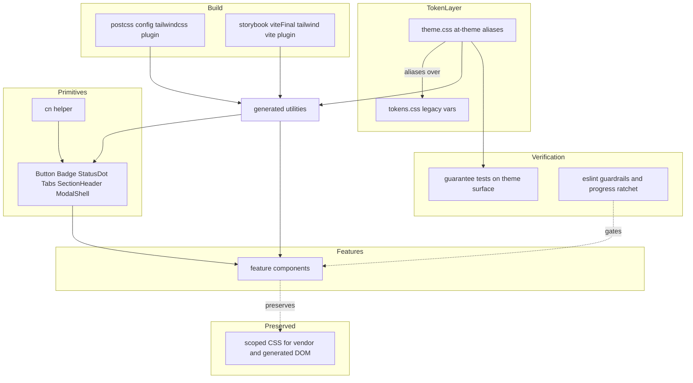
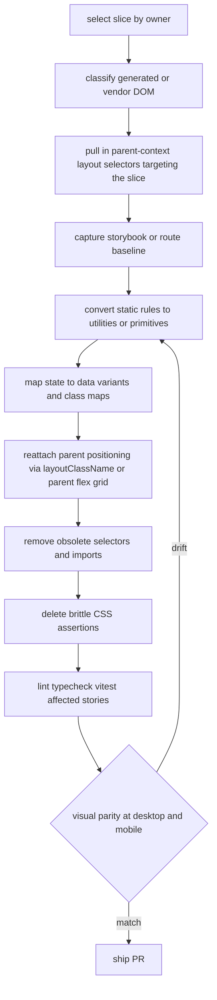

# Design Document

## Overview

**Purpose**: Make Tailwind CSS v4 the authoring mechanism for Command Center's existing console UI, replacing hand-written CSS incrementally without any visual change. **Users**: CC maintainers, who will author new and migrated UI with Tailwind utilities + a thin set of React primitives backed by the current design tokens. **Impact**: Introduces a Tailwind toolchain and a `@theme` token surface that coexists with the existing CSS-variable system; converts surfaces wave by wave behind unchanged visuals; ends with a single Tailwind-backed token source of truth.

The migration is tractable because CC's design system is already CSS custom properties and Tailwind v4's `@theme` is also CSS custom properties — so the token layer is *bridged*, not rewritten. The app stays shippable after every PR.

### Goals
- Tailwind v4 builds and serves utilities in Next and Storybook with zero visual drift (Preflight disabled initially).
- Every CC token is exposed as a utility-generating `@theme` token; legacy `var(--…)` keeps resolving during the transition.
- Migrate primitives → pilot → feature waves with full-component ownership and no mixed legacy/utility styling on one element.
- Delete brittle CSS-structure tests; preserve accessibility/legibility guarantees on the theme surface.
- End state: single token source of truth, Preflight adopted, documentation updated.

### Non-Goals
- No visual redesign, layout change, or component restructuring beyond parity.
- No component library (shadcn), no `class-variance-authority`, no `tailwind-merge` until conflicting overrides exist.
- No Chromatic as a required gate during this effort (dependency stays installed, unused).
- No conversion of DOM CC does not author (React Flow, Tiptap, markdown/Mermaid) to utilities.
- No big-bang rewrite.

## Boundary Commitments

### This Spec Owns
- The Tailwind v4 build integration for Next (`postcss.config.mjs`) and Storybook (`viteFinal`).
- The `@theme` token surface and its alias bridge over the existing `tokens.css` variables.
- A thin shared UI-primitive layer (`cn()` + `Button`/`Badge`/`StatusDot`/`Tabs`/`SectionHeader`/`ModalShell`) and the class-map + `data-*` authoring convention.
- The per-slice migration protocol (full-component conversion, dead-CSS deletion, parity verification).
- The design-system *guarantee* tests (WCAG contrast, font-floor, theme-namespace) re-homed onto the theme surface, and deletion of brittle CSS-structure/className assertions.
- Migration guardrails and the owner-level CSS progress ratchet.
- The end-state cleanup (alias removal, Preflight adoption, design-system doc update).

### Out of Boundary
- Visual/UX redesign or information-architecture changes.
- Styling of generated/vendor DOM (React Flow vendor DOM, Tiptap `.ProseMirror`, markdown/syntax-highlighter/Mermaid output) — remains scoped CSS.
- Body atmospherics, scrollbars, keyframes, reduced-motion, portal positioning, dense pseudo-element effects — remain scoped CSS.
- Adopting Chromatic; introducing a component library or layout-primitive system.
- Behavioral changes to any feature being restyled.

### Allowed Dependencies
- `tailwindcss@4`, `@tailwindcss/postcss`, `@tailwindcss/vite`, `clsx` (new).
- Post-pilot only: `eslint-plugin-tailwindcss` (or `eslint-plugin-better-tailwindcss`) + `prettier-plugin-tailwindcss`.
- Existing: `@storybook/nextjs-vite` (+ `addon-vitest`, `addon-a11y`), the Vitest multi-project setup, the ESLint flat config, `bun` scripts.
- Dependency direction (enforced): `@theme` tokens → `cn()` → primitives → feature components. Build-layer config (PostCSS/Vite) and CI scripts depend on none of the app layers.

### Revalidation Triggers
- Removal/renaming of legacy token variables (cleanup phase) — forces any consumer reading those names to update.
- Change to the `cn()`/primitive contract (variant, `data-*`, or the `layoutClassName` layout-only allowlist).
- Enabling Tailwind Preflight (base-reset behavior change) — forces a full visual re-check.
- Change to the set of "preserved CSS" surfaces (decision 4 scope).
- Change to the per-PR verification gates.

## Architecture

### Existing Architecture Analysis
- CSS-variable design system in `src/features/_root/styles/tokens.css`; consumed via `globals.css → _root/styles/index.css → 16 partials` + 11 feature/component CSS files (the wave map). State via `[data-*]`; appearance via kebab-case BEM + `.cc-*`.
- No Tailwind/PostCSS/class-helper today (clean slate). Storybook (`@storybook/nextjs-vite`) imports `globals.css` in `preview.tsx` and runs stories as Vitest tests (`addon-vitest`).
- Generated/vendor DOM: `@xyflow/react`, `@tiptap/*`, `mermaid`, react-markdown — styled by CSS that targets DOM not authored in CC's JSX.
- Existing patterns preserved: `[data-*]` state convention (→ Tailwind `data-*` variants), the token taxonomy, colocation of component CSS, the Vitest/Storybook harness.

### Architecture Pattern and Boundary Map



**Key decisions**:
- **Coexistence via cascade layers**: import Tailwind's `theme` + `utilities` layers (omit `preflight`) so legacy unlayered CSS keeps winning where both touch an element — the backstop for "never mix ownership," confirmed by a Phase 0 cascade fixture.
- **Token bridge over rewrite (two lanes)**: most categories *alias* existing `tokens.css` vars 1:1; z-index, breakpoints, and animations don't exist as tokens today and are *extracted/centralized* into new `@theme` tokens (Phase 0/1 reconciliation, resolved values preserved). Text colors map to `--color-text-*` (Tailwind reads `--text-*` as font-size).
- **Thin primitives, not a framework**: `cn()` + static class maps + `data-*` variants. No CVA, no layout-primitive system (YAGNI).

### Technology Stack

| Layer | Choice / Version | Role in Feature | Notes |
|-------|------------------|-----------------|-------|
| Build (Next) | `tailwindcss@^4`, `@tailwindcss/postcss`, `postcss` | Generate utilities in `next build`/dev | `postcss.config.mjs`; Turbopack-compatible. Confirm in Phase 0 spike. |
| Build (Storybook) | `@tailwindcss/vite` | Generate utilities in Storybook | Added in `.storybook/main.ts` `viteFinal` via dynamic import; PostCSS-of-globals fallback. |
| Styling tokens | Tailwind v4 `@theme` / `@theme inline` | Single token surface over legacy vars | `inline` where alias indirection blocks utility generation. |
| Class composition | `clsx` | `cn()` helper | `tailwind-merge` deferred until conflicting overrides appear. |
| Lint/format (post-pilot) | `eslint-plugin-tailwindcss` (or better-tailwindcss) + `prettier-plugin-tailwindcss` | Class sorting + dynamic-class guard | Added after pilot proves patterns (req 7.5). |
| Verification | `@storybook/addon-vitest`, `@storybook/addon-a11y`, Playwright/Next-Chrome MCP | Parity + a11y + computed-style guarantees | Chromatic deferred. |

## File Structure Plan

### New Files
```
postcss.config.mjs                              # Tailwind v4 PostCSS plugin (Next)
src/features/_root/styles/theme.css             # @theme block: namespaced token aliases over tokens.css
src/lib/ui/cn.ts                                # cn() = clsx wrapper
src/components/ui/Button.tsx                     # primitive + static variant/size maps + data-* state
src/components/ui/Badge.tsx                      # primitive (cc-badge variants)
src/components/ui/StatusDot.tsx                  # leaf control, data-status variants
src/components/ui/Tabs.tsx                        # cc-tabs primitive
src/components/ui/SectionHeader.tsx              # cc-section-* primitive
src/components/ui/ModalShell.tsx                 # modal/dialog shell
src/components/ui/*.stories.tsx                  # story per primitive (parity harness)
src/lib/shared/design-system-guarantees.test.ts # re-homed WCAG contrast + font-floor + theme-namespace asserts
scripts/css-migration-progress.ts                # owner-level remaining-CSS report + ratchet (bun)
docs/tailwind-conventions.md                     # class rules (no dynamic classes, explicit maps, no mixed ownership, primitive `layoutClassName` = layout-only allowlist, desktop-first `max-*` breakpoint variants) + per-slice migration protocol/checklist (fixed desktop/mobile viewport dims + per-slice visual-evidence location; pass/fail = human review + drift=incomplete, no pixel-threshold gate since Chromatic is deferred) + preserved-CSS do-not-convert catalog
```

### Modified Files
- `src/app/globals.css` — add Tailwind layered imports (`theme`, `utilities`; **no** `preflight`) + import `theme.css`; shrinks across waves.
- `src/features/_root/styles/tokens.css` — retains legacy vars as the alias-bridge source until cleanup (then removed per 9.1).
- `.storybook/main.ts` — add `@tailwindcss/vite` to `viteFinal`.
- `package.json` — new deps + `css:progress` script; post-pilot lint/format plugins.
- `eslint.config.mjs` — (post-pilot) Tailwind plugin + guard rules (8.3).
- `src/lib/shared/design-system-compliance.test.ts` — delete class-existence blocks (Tasks 4.1/5.1/6.1); contrast/floor migrate to `design-system-guarantees.test.ts`.
- `McpConfigPopover.styles.test.ts`, `cockpit-design-system.test.ts`, `spawn-card-design-system.test.ts`, `ModelSelector.test.tsx`, `InspectorConfigBlock.test.tsx`, `WorkflowDefinitionsSidebar.test.tsx` — delete CSS/className assertions (5.1).
- Per-wave: feature components migrated to primitives/utilities; their feature CSS deleted (4.2). Pattern repeats per the CSS ownership map; graph/builder + Tiptap surfaces last and may stay bespoke (6.x, 7.4).
- `.claude/skills/cc-design-system/SKILL.md` + references — updated at cleanup (9.4).

## System Flows

### Per-slice migration protocol (the operational contract behind R3/R4/R7)


**Same-slice parent rule (closes the descendant-selector ownership gap):** when a slice migrates a primitive that a container positions via a descendant selector (`.parent .btn { margin/grid/order/touch-size }`), that container's positioning rules are pulled into the *same* slice and reattached as `layoutClassName` on the child (or as flex/grid utilities on the now-migrated parent). A slice may not leave a migrated primitive as the live target of a surviving legacy descendant selector. The "classify" step inventories these via the parent-context selectors enumerated in the UI-primitive risks; the `css-migration-progress` ratchet attributes those deleted rules to the parent owner.

### Migration phase sequence

Phase 0 gates everything (1.x); lint/sort enforcement is added only after P3 (7.5, 8.4); graph/builder migrate in P4's tail (7.4).

## Requirements Traceability

| Requirement | Summary | Components | Flows |
|-------------|---------|------------|-------|
| 1.1–1.5 | Toolchain coexistence, Preflight off | Toolchain Integration | Phase sequence |
| 2.1–2.5 | Token bridge, namespaces, theme-surface test | Token Bridge; Guarantee Tests | — |
| 3.1–3.4 | Visual parity at breakpoints | Migration Protocol; primitives/feature components | Per-slice protocol |
| 4.1–4.5 | Shippable, full-component, primitives + data-* | UI Primitive Layer; Migration Protocol | Per-slice protocol |
| 5.1–5.5 | Delete brittle tests, re-home guarantees, gates | Guarantee Tests; Toolchain Integration | Per-slice protocol |
| 6.1–6.4 | Preserve generated/vendor + atmospheric CSS | Preserved CSS Boundary | — |
| 7.1–7.5 | Sequencing; tooling after pilot | Migration Protocol; Guardrails | Phase sequence |
| 8.1–8.4 | Progress ratchet + guardrails | Guardrails and Progress Ratchet | — |
| 9.1–9.5 | Cleanup, Preflight, docs, remove aliases | End-State Cleanup; Token Bridge | Phase sequence |

## Components and Interfaces

| Component | Layer | Intent | Req Coverage | Key Dependencies | Contracts |
|-----------|-------|--------|--------------|------------------|-----------|
| Toolchain Integration | Build | Tailwind v4 in Next + Storybook, Preflight off | 1, 5.2–5.5 | PostCSS, Vite plugin (P0) | State (build) |
| Token Bridge | Styling | `@theme` tokens aliased over legacy vars | 2, 9.1 | tokens.css (P0) | State |
| UI Primitive Layer | UI | `cn()` + canonical primitives | 4 | cn, @theme utilities (P0) | Service (props) |
| Guarantee Tests | Verification | Re-home contrast/floor + theme-namespace | 2.4–2.5, 5 | @theme surface (P0) | Service (test) |
| Preserved CSS Boundary | Styling | Catalog of scoped-CSS-forever surfaces | 6 | vendor DOM (P1) | — |
| Migration Protocol | Process | Per-slice conversion + parity | 3, 4, 7 | primitives (P0) | — |
| Guardrails + Progress Ratchet | CI | Ratchet + dynamic-class/hardcoded-color/global-CSS guards | 7.5, 8 | eslint config (P1) | Batch (script) |
| End-State Cleanup | Process | Remove aliases, adopt Preflight, docs | 9 | Token Bridge (P0) | — |

### UI Layer

#### UI Primitive Layer
| Field | Detail |
|-------|--------|
| Intent | Canonical patterns as React primitives so call sites stop owning recipes |
| Requirements | 4.2, 4.4, 4.5 |

**Responsibilities & Constraints**
- Provide `cn()` and a small primitive set; encode variants as static (analyzable) class maps; encode state with `data-*` variants.
- No dynamically-constructed class strings; no CVA; `@layer components`/`@apply` only for generated/vendor DOM or canonical recipes reused across unrelated call sites.

**Dependencies**: Outbound: `@theme` utilities (P0). Inbound: feature components (P1). External: `clsx` (P0).

**Contracts**: Service [x] / State [x]

##### Service Interface
```typescript
type ClassValue = string | number | null | undefined | false | ClassValue[];
function cn(...inputs: ClassValue[]): string;

type ButtonVariant = "primary" | "danger" | "success" | "ghost";
type ButtonSize = "sm" | "md";
// Omit `className`/`style` so a call site cannot inject a legacy class or an appearance
// utility (color, typography, background, border, radius — anything the primitive owns)
// onto a migrated element. Expose ONE sanctioned escape hatch instead: `layoutClassName`,
// restricted by contract + lint to *external-geometry* utilities only (margin, grid/flex
// placement, order, align-/justify-self, width/flex-basis). This is the "real override
// case" decision 5 reserved for — CC positions buttons from their container today
// (`.cc-page-actions .cc-ibtn`, `.approval-gate-actions .btn`, mobile touch-enlarge rules),
// so a parent MUST be able to place a migrated child without a wrapper <div> (which would
// be DOM restructuring, violating 3.4). tailwind-merge stays deferred — `layoutClassName`
// appends, it never overrides the primitive's own appearance utilities.
type PrimitiveProps = Omit<
  React.ButtonHTMLAttributes<HTMLButtonElement>,
  "className" | "style"
> & {
  /** Layout/positioning utilities applied by the parent. Appearance utilities are rejected by lint (8.3). */
  layoutClassName?: string;
};
interface ButtonProps extends PrimitiveProps {
  variant?: ButtonVariant;
  size?: ButtonSize;
}
// Badge, StatusDot, Tabs, SectionHeader, ModalShell follow the same map-driven shape,
// each omitting className/style and exposing the same layout-only `layoutClassName` slot.
// Internally: cn(variantMap[variant], sizeMap[size], layoutClassName) — appearance first,
// caller-supplied layout last and additive.
```
- Preconditions: variant/size keys exist in the static map; `layoutClassName` (if present) contains only allowlisted layout utilities.
- Postconditions: rendered appearance `className` is parity-equivalent to the legacy class it replaces; any parent-context layout the legacy descendant selector applied is reattached via `layoutClassName`.
- Invariants:
  - **Appearance ownership is exclusive.** No element carries both a legacy `.cc-*`/BEM appearance class and appearance utilities — enforced at the type level by omitting `className`/`style`. `layoutClassName` is additive external geometry only, never appearance, so it does not breach this.
  - **No legacy descendant selector targets a migrated primitive.** A migrated `<Button>` must not remain the target of a surviving `.parent .btn`-style rule (an *invisible* mixed-ownership channel the element-level "carries a `.cc-*` class?" check misses). Guaranteed by the migration-ordering rule below: a primitive and the parent that positions it migrate in the same slice, the parent reattaching placement through `layoutClassName` (or its own flex/grid utilities).

**Implementation Notes**
- Scope: build the full set (`Button`, `Badge`, `StatusDot`, `Tabs`, `SectionHeader`, `ModalShell`) up front in Phase 2 (decision, Alex 2026-06-15), each story-covered; later waves consume them rather than introducing new primitives ad hoc.
- Integration: each primitive ships with a `*.stories.tsx`; replaces its legacy CSS in the same PR.
- Validation: story renders for every variant × `data-*` state; a11y addon clean; a story exercises `layoutClassName` placement to lock its parity behavior.
- Risks: utility/legacy specificity — mitigated by cascade-layer order + full-component migration. **Parent-context layout selectors** (`.cc-page-actions .cc-ibtn`, `.approval-gate-actions .btn`, `.project-actions-secondary .btn`, `.ds-row .btn-sm`, mobile touch-enlarge rules) style buttons from their container; covered by the same-slice parent-migration rule (see Per-slice protocol) + the `layoutClassName` slot, so no migrated primitive is left styled by a surviving descendant selector.

### Styling Layer

#### Token Bridge
| Field | Detail |
|-------|--------|
| Intent | One token surface; utilities for every token; legacy CSS unaffected |
| Requirements | 2.1–2.5, 9.1 |

**Responsibilities & Constraints**
- Define `@theme` tokens for colors, backgrounds, borders, spacing, radii, fonts, sizing floors, z-index tiers, breakpoints, animations — partitioned into **two lanes** (see the Token Namespace Matrix below):
  - **Alias lane** — categories that already exist as `tokens.css` custom properties (colors, backgrounds, borders, spacing, radii, fonts): aliased 1:1 under their Tailwind namespace.
  - **Extract lane** — categories that do **not** exist as tokens today and live as scattered literals: **z-index tiers** (~22 distinct ad-hoc values across 14 files), **breakpoints** (one dominant `768px`/`769px` spine + a tail of one-offs; CC is desktop-first `max-width` vs Tailwind's mobile-first `min-width`), and **animations** (45 `@keyframes` across 7 files with duplicate definitions and the same keyframe invoked at many durations/easings). These are *extracted and centralized* into new `@theme` tokens, preserving resolved values. This is a Phase 0/1 reconciliation pass, not a mechanical alias.
- Map text colors to `--color-text-*`; use `@theme inline` where aliasing to `var(--legacy)` would block utility generation.
- **Sizing floors** exist (`--font-size-floor: 0.7rem`, `--icon-size-min`, `--icon-btn-min`, `--touch-target-min`) but are minimums, not a Tailwind font-size *scale* — assign them a deliberate namespace (not `--text-*`) and assert them as the legibility-floor guarantee, not as font-size utilities.
- Keep legacy var names resolving (alias bridge) until cleanup removes them.

**Contracts**: State [x] — the token surface is the contract consumed by utilities, primitives, and guarantee tests.

**Implementation Notes**
- Integration: `theme.css` imported by `globals.css` alongside Tailwind layer imports.
- Validation: theme-surface test (below) asserts namespace correctness for **all ten** families (incl. the extract-lane ones); build asserts utilities resolve.
- Risks: `@theme inline` semantics — resolved in Phase 0 spike (research.md item 3).

**Token Namespace Matrix** (the Phase 1 deliverable; the theme-surface test asserts every row)

| CC category | Lane | Legacy source | `@theme` variable | Utility family | Assertion |
|---|---|---|---|---|---|
| Backgrounds | alias | `--bg-*` | `--color-bg-*` | `bg-*` | under `--color-*` |
| Borders | alias | `--border-*` | `--color-border-*` | `border-*` | under `--color-*` |
| Accents | alias | `--cyan`, `--amber`, … | `--color-*` | `bg/text/border/ring-*` | under `--color-*` |
| Text colors | alias | `--text-primary/secondary/tertiary/inverse` | `--color-text-*` (not `--text-*`) | `text-*` (color) | under color ns, not font-size |
| Spacing | alias | `--space-*` | `--spacing-*` | `p-*`/`m-*`/`gap-*` | under `--spacing-*` |
| Radii | alias | `--radius-*` | `--radius-*` | `rounded-*` | under `--radius-*` |
| Font families | alias | `--font-display/body/mono` | `--font-*` | `font-*` | under `--font-*` |
| Sizing floors | alias (ns TBD) | `--font-size-floor`, `--icon-*-min`, `--touch-target-min` | deliberate ns (not `--text-*`) | n/a / custom | legibility-floor guarantee |
| z-index tiers | **extract** | literal `z-index:` | `--z-*` (new) | `z-*` | enumerated + ordered |
| Breakpoints | **extract** | literal `@media (max-width:)` | `--breakpoint-*` (new) | desktop-first `max-*` `@custom-variant`s | enumerated (frozen Phase 1) |
| Animations | **extract** | `@keyframes` | `--animate-*` (new) | `animate-*` | enumerated |

**Extract-lane reconciliation** (preserve resolved behavior; no visual change):
- **z-index** — collapse the ~22 ad-hoc values (off-by-one adjacency like 89/90/91 and 199/200/201, plus high clusters 1000/1100/1110 and 9998/9999) into a small **named tier scale** (e.g. base → raised → dropdown → popover → tooltip → toast → modal). Preserve relative order, not exact integers. Re-home the ordering *guarantee* the `ModelSelector` test asserts (dropdown above panels, below tooltips) onto the tier tokens; delete the brittle `globals.css`-regex z-index test (R5).
- **breakpoints** — **Direction is decided globally, not per-slice (Issue-2 resolution, Alex 2026-06-15): keep CC's desktop-first `max-width` model via custom Tailwind v4 `@custom-variant max-* (@media (max-width: …))` variants — do NOT invert to mobile-first `min-width`.** Inverting would require re-deriving every responsive rule and re-verifying it slice by slice (the highest-drift path); custom `max-*` variants preserve the existing `768px`/`769px` spine and one-off thresholds 1:1, so a migrated rule is a mechanical transcription with no logic change. This is a **Phase 1 token-bridge deliverable**, not a slice decision — the variant set is defined once and frozen before feature waves open. Adopt `768px` (+ its `769px` `min-width` companion for the few mobile-first rules that already exist) as the canonical token; tokenize each recurring one-off (`640/800/900/960/1080/1100/1180`) as a named `--breakpoint-*` and keep genuinely single-use thresholds component-local. The theme-surface test enumerates the frozen breakpoint token set.
- **animations** — dedupe the duplicate keyframes (`bulk-float-in` and `pulse-dot` are each defined twice) and pick canonical durations where one keyframe is invoked at many (`pulse-dot` spans 1.2–2.5s). Token only the **shared, JSX-authored** animations; leave graph/atmospheric/vendor keyframes (workflow-graph pulses, `rainbow-shift`, `mermaid-overlay-fadein`, voice/debug pulses) scoped per decision 4 — the matrix's animation rows must mark which keyframes stay bespoke.

### Verification Layer

#### Guarantee Tests (re-homed)
| Field | Detail |
|-------|--------|
| Intent | Preserve a11y/legibility guarantees; drop brittle CSS-structure asserts |
| Requirements | 2.4, 2.5, 5.1, 5.2, 5.3 |

**Responsibilities & Constraints**
- Assert WCAG text-contrast thresholds and the minimum font-size floor against the **`@theme` token surface** (and/or computed styles in the Storybook/Vitest browser project) — not raw CSS text.
- Assert each token is registered under the correct Tailwind namespace; fail on missing/mis-namespaced tokens.
- Delete tests asserting CSS class names / rule structure; do not re-add CSS-structure assertions.

**Contracts**: Service [x] (Vitest).

**Implementation Notes**
- Integration: new `design-system-guarantees.test.ts`; gut `design-system-compliance.test.ts`; delete the 6 className/structure tests.
- Validation: runs in the unit project; computed-style variants run in the Storybook browser project.
- Risks: choosing token-surface vs computed-style home — decided in Phase 0 (research.md item 5).

#### Guardrails + Progress Ratchet
| Field | Detail |
|-------|--------|
| Intent | Prevent stall and new debt |
| Requirements | 7.5, 8.1–8.4 |

**Responsibilities & Constraints**
- `scripts/css-migration-progress.ts`: report remaining CSS **by owner** (the CSS ownership map) using **selector count per owner** as the unit (decision, Alex 2026-06-15 — more honest about partial migration than file or line count) and fail if any owner's count increases (ratchet).
  - **"Migrated" predicate**: an owner's tracked count is the number of style rules it still owns *excluding* its allowlisted preserved selectors; a fully-migrated owner reaches its residual floor (often 0), a partial owner (e.g. `conversation.css`) drops to the floor formed by its retained vendor/atmospheric rules.
  - **Preserved-owner allowlist + residual floor**: each owner declares an expected non-zero floor for the scoped CSS it keeps forever (`workflow-graph.css`, `conversation.css`'s `.ProseMirror`, body atmospherics, scrollbars/keyframes per decision 4 / R6). The ratchet enforces `count ≥ floor` and monotonic decrease toward it, so "decrease" is measured against a known target rather than zero.
- ESLint (post-pilot): flag dynamically-constructed Tailwind classes, hard-coded colors in migrated code, new global CSS outside approved foundation/vendor areas, and **appearance utilities passed to a primitive's `layoutClassName`** — the slot accepts only an allowlisted external-geometry set (margin, grid/flex placement, `order-*`, `self-*`/`justify-self-*`, width/`basis-*`); color/typography/background/border/radius utilities there fail lint, keeping appearance ownership exclusive.

**Contracts**: Batch [x] (CI script).

**Implementation Notes**
- Integration: `css:progress` script wired into CI for larger waves; lint rules added after pilot.
- Risks: false positives on preserved/vendor areas — allowlist those owners.

### Operational Components (summary only)
- **Toolchain Integration** — `postcss.config.mjs` + `viteFinal`; import theme+utilities layers, omit preflight (1.1–1.5).
- **Preserved CSS Boundary** — catalog of scoped-CSS-forever surfaces; the "DOM we don't author in JSX" rule (6.1–6.4).
- **Migration Protocol** — the per-slice flow + pilot + waves; graph/builder last (3, 4, 7).
- **End-State Cleanup** — remove aliases, adopt Preflight, update design-system docs (9.1–9.5).

## Error Handling
- **Build failure with Tailwind integrated (1.1)** → fail the PR; Phase 0 spike isolates Turbopack/PostCSS wiring before any migration.
- **Visual drift on a migrated slice (3.3)** → slice is not done; revert to convert step. No partial-parity merges.
- **Guarantee test failure (2.5, 5.x)** → block merge until the token surface or test is corrected (never delete a guarantee to pass).
- **Progress regression (8.2)** → ratchet fails CI; the change must not increase owner CSS counts.
- **Mixed-ownership detected (4.3)** → reject; element must be fully migrated. Includes the *descendant-selector* case — a migrated primitive left as the target of a surviving `.parent .child` legacy rule — caught by the per-slice classify step and the same-slice parent rule, not just by direct `.cc-*` class presence.

## Testing Strategy

### Unit
- Theme-surface namespace assertions: every token under correct `--color-*`/`--spacing-*`/`--radius-*`/`--font-*`/`--animate-*` (2.4, 2.5).
- Re-homed WCAG contrast on text tokens + 0.7rem font-floor against the theme surface (5.2).
- `cn()` composition (conditional/array/falsey handling) (4.x).
- Primitive variant × `data-*` rendering parity for `Button`/`Badge`/`StatusDot` (4.4).

### Integration / Build
- `next build` succeeds with Tailwind integrated (1.1).
- `storybook build` succeeds; utilities render in stories (1.2, 5.5).
- `css-migration-progress` enforces monotonic decrease on a seeded fixture (8.2).
- Cascade-order fixture: legacy unlayered rule vs utility on one element behaves as specified (4.3 backstop).

### E2E / UI (Storybook + Playwright/Next-Chrome MCP, desktop + mobile)
- Pilot: `ProjectCard` + leaf control parity vs baseline (3.1, 7.3).
- Per-wave: affected stories/routes parity; a11y addon clean (3.1).
- Post-migration high-traffic flow (conversation/session) parity spot-check (3.1, 6.1).

## Migration Strategy
Phases P0→P6 as in the phase-sequence flow. Rollback is per-PR (each slice is independently revertible). Validation checkpoints: Phase 0 spike sign-off (toolchain), pilot sign-off (pattern), and the cleanup gate (alias removal + Preflight adoption re-checked against full visual parity, 9.1–9.3).

## Open Questions / Risks
- Tailwind v4 ↔ Next 16 **Turbopack** PostCSS wiring (research.md item 1) — resolved in Phase 0.
- Storybook PostCSS-vs-`@tailwindcss/vite` (item 2) and `@theme inline` semantics (item 3) — resolved in Phase 0.
- Preflight adoption (9.3) is the highest-drift cleanup step — gated behind full visual re-check. **Approach sketch** (before P6): layer Preflight *below* CC's `reset.css` so CC's reset wins on import, then incrementally retire redundant CC reset rules rule-by-rule (each retirement its own revertible slice with a visual re-check), rather than a single diff-and-swap.
