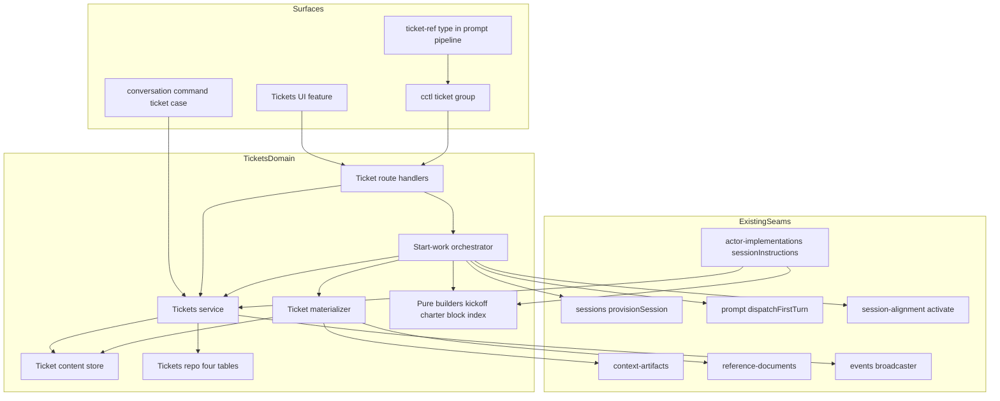
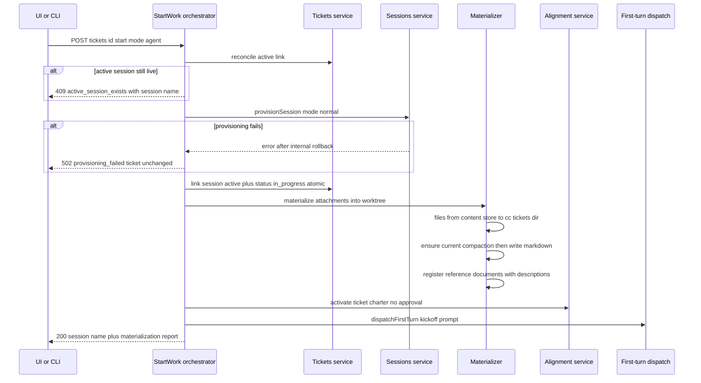
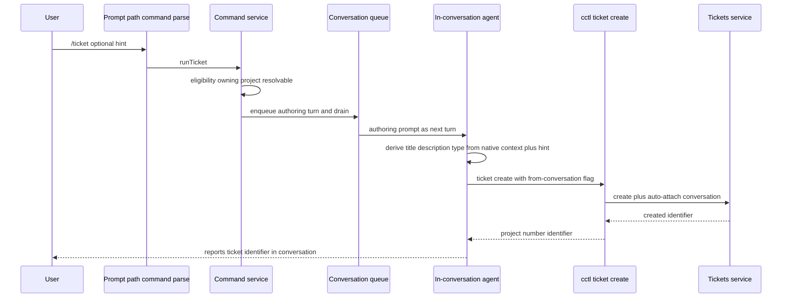

# Technical Design — Ticket System

## Overview

**Purpose**: The Ticket System gives Command Center a durable, agent-oriented backlog. A ticket is a context bundle: core fields plus described attachments that accumulate until work starts, at which point the system materializes everything into a purpose-built session. Its differentiator is progressive disclosure — every attachment is an indexed, described pointer whose full content agents retrieve on demand, and tickets link to other tickets, forming a navigable context graph reachable from any conversation.

**Users**: Command Center users capture and plan work across projects (UI list/board/detail, `/ticket` slash command); agents operate tickets with full parity through `cctl` and consume ticket context through kickoff prompts, charters, a per-turn live ticket block, and pasted ticket references.

**Impact**: Adds a new `tickets` domain (four SQLite tables, service, routes, CLI group, UI feature) and extends six existing subsystems at their designed extension points: conversation-commands (new `/ticket` case), the reference subsystem (new `<ticket-ref>` type), system-prompt assembly (new per-turn block), session-alignment (one additive programmatic-activation function), context-artifacts (one `ensureCurrent` seam), and SSE (one new event family). No existing schema or contract changes shape.

### Goals
- Cheap capture: create a ticket from UI, CLI, or any conversation via `/ticket` in seconds.
- Context accumulation: five attachment types, each carrying a description, editable in any status.
- One-action start: provision a session with materialized context, auto-approved charter, and a per-turn live ticket view; agent-immediate or prepared mode.
- Full agent parity: everything the UI can do, `cctl ticket` can do, from any conversation including graph-workflow lanes.
- Truthful board: exactly one automatic status transition (start → In Progress).

### Non-Goals
- Priority, labels, blocked-reason, comment/activity timelines.
- Starting a ticket as a graph workflow.
- First-class URL/git-ref/code-location attachment types (plain text inside descriptions/notes).
- In-repo ticket storage or export; multi-user assignment or permissions.
- Automatic status changes on merge, session finish, or session deletion.

## Boundary Commitments

### This Spec Owns
- The tickets domain: `tickets`, `ticket_counters`, `ticket_attachments`, `ticket_sessions` tables; Zod schemas; repo; service; route handlers; query/mutation/key factories.
- Per-project ticket numbering (monotonic, never reused).
- The ticket content store under `configDir/tickets/` (durable attachment snapshots) and its lifecycle.
- Start-work orchestration: validation, session provisioning invocation, ticket↔session linking, the single automatic status transition, materialization, charter content derivation, kickoff prompt, first-turn dispatch invocation.
- Ticket↔session link state and session history (stored ticket-side only; sessions schema untouched).
- The live ticket instruction block (content and per-turn data access).
- The `<ticket-ref>` reference type (schema, XML builder, chip nodes, serializer case, copy button).
- The `/ticket` conversation-command case and its authoring prompt.
- The `cctl ticket` command group and its help entries.
- The `/tickets` UI feature (list, board, detail, start dialog, attachment manager) and ticket indicators on session surfaces.
- The `ticket-changed` SSE event family and its client invalidation mapping.

### Out of Boundary
- Session lifecycle: worktree/branch creation mechanics, finishing, merging, deletion (owned by `sessions`; tickets only call `provisionSession` and observe session state read-only for link reconciliation).
- Charter rendering, injection mechanics, and the draft/approval workflow (owned by `session-alignment`; this spec adds exactly one additive activation function there).
- Compaction artifact generation internals (owned by `context-artifacts`; this spec adds an `ensureCurrentCompaction` orchestration seam in the tickets domain, not inside context-artifacts).
- Prompt execution pipeline, queueing, backend management (owned by `prompt`/`workflows`; this spec extends the `sessionInstructions` assembly with one block via the existing deps seam).
- Reference-document rendering into the system prompt (owned by reference-documents; tickets only register documents).
- The conversation-reference and message-reference types (unchanged; ticket-ref is additive).
- Graph-workflow execution (lanes interact only through `cctl ticket`).

### Allowed Dependencies
- `src/lib/state-store/` infrastructure: write queue, aggregate wiring, `timed()` logging, contract-test helpers.
- `src/lib/sessions/service.ts` `provisionSession()` (mode `"normal"`) and read-only session accessors.
- `src/lib/prompt/first-turn-dispatch.ts` `dispatchFirstTurn()`.
- `src/lib/session-alignment/service.ts` — via the new additive `activateTicketCharter`-style function only; no reuse of draft internals.
- `src/lib/context-artifacts/` repo/service for compaction artifacts.
- Reference-documents creation seam (as used by `ActorImplementationDeps.createReferenceDocument`).
- `src/lib/conversation-commands/` parse/schemas/service extension points; `enqueueConversationMessage` + ensure-actor-and-drain.
- `src/lib/conversations/` ref-parser/ref-segments/schemas extension points; `src/lib/prompt-editor/` paste extension + serializer.
- `src/lib/events/` broadcaster + envelope helpers; `src/lib/api/sse-events.ts`.
- `src/cli/` help registry, parse/dispatch core, token auth, exit codes.
- UI primitives in `src/components/ui/`; `@dnd-kit/core` (new dependency).
- Dependency direction (violations are errors): `schemas → state-store repo → tickets service/orchestrators → route-handlers · CLI · conversation-commands case → UI`. Runtime (actor-implementations) depends on the tickets service via its deps interface; the tickets domain never imports from `workflows/`, `features/`, or `cli/`.

### Revalidation Triggers
- Any change to the `<ticket-ref>` attribute set or embedded command shape (agents and the paste pipeline both consume it).
- Any change to `cctl ticket get/list` output contracts (live ticket block, kickoff prompt, and ticket-ref resolution all reference these commands).
- Change of ticket↔session link storage from ticket-side to session-side (would move data ownership).
- `provisionSession`, `dispatchFirstTurn`, charter activation, or reference-document registration signature changes (start-work orchestration composes all four).
- `ticket-changed` SSE payload shape changes (client invalidation map).
- Ticket content store layout changes under `configDir/tickets/` (CLI content retrieval and materializer both read it).

## Architecture

### Existing Architecture Analysis
The design composes proven primitives end-to-end; discovery confirmed each seam (see `research.md` for the full asset map):
- **State store**: `reference-documents-repo.ts` is the end-to-end template (row codec, prepared statements, aggregate wiring, `assertRoundTripDurability` contract test). Projects are keyed by `project_path` (`projects.root_path`); IDs use `crypto.randomUUID()`.
- **Conversation commands**: whole-message parse (`COMMANDS`), discriminated-union schema, service dispatch. `/align` establishes the enqueue-an-authoring-turn pattern in which the conversation's own agent — with its full native context window — performs the work; `/commit`-style detached generation turns do **not** see the transcript.
- **References**: self-closing XML tags with hyphenated attributes and embedded `read-command`s; `segmentTextByRefs()` and the Tiptap paste/serialize pipeline are explicitly extensible per type; refs reach the agent verbatim.
- **Start seams**: `provisionSession()` rolls back on failure; `dispatchFirstTurn()` is exactly-once and readiness-gated; `copyActiveCharter()` proves zero-gate programmatic charter activation (direct insert of an active version 1); `sessionInstructions` is a per-turn assembled block array with a per-turn charter fetch precedent.
- **Snapshots**: `workflow-graph/shared-document-store.ts` proves the configDir content-store pattern (capture/read keyed by owner id + relative path).
- **SSE**: broadcaster with replay buffer; envelope stamp/strip (`_sentAt` must stay out of event schemas); client invalidation-map pattern in `NotificationListener`.

### Architecture Pattern & Boundary Map



**Architecture Integration**:
- Selected pattern: new self-contained domain (`src/lib/tickets/`) composing existing primitives at their designed extension points — Option B from `research.md`, phased as Option C.
- Domain boundaries: tickets own all ticket state and orchestration; every touched subsystem receives only an additive case/function/block, never a structural change.
- Existing patterns preserved: schema-first Zod domains, serialized single-writer SQLite, per-turn instruction assembly, SSE invalidation, help-registry SSOT, route-shell → feature-dir UI.
- New components rationale: each exists because a requirement demands state (repo, content store), orchestration (start-work, materializer), or a rendering contract (index/kickoff/charter/block builders) that no existing component owns.
- Steering compliance: composable primitives over feature silos; agent-offloading (deterministic materialization/validation in code, judgment in agent turns); PERFORMANCE.md focused accessors; responsiveness contract on every mutation.

### Technology Stack

| Layer | Choice / Version | Role in Feature | Notes |
|-------|------------------|-----------------|-------|
| Frontend | Next.js 16 / React 19 / Tailwind v4 + `src/components/ui/` primitives | `/tickets` route, board/list/detail, dialogs, chips | Existing stack; no new UI framework pieces |
| Drag & drop | `@dnd-kit/core` (new dependency, latest 6.x) | Kanban column drag → status change | Adopted over pragmatic-drag-and-drop: community standard, React 19 compatible, built-in keyboard sensor; board scale is small. Cross-column drag only — no sortable preset needed |
| Backend | Next.js route handlers + tickets service | REST resource API under `/api/tickets` | Mirrors resources per structure.md |
| Data | better-sqlite3 (`command-center.db`, WAL) via state-store write queue | Four new tables; additive DDL floor only | No Umzug migration, no `KNOWN_SCHEMA_VERSION` bump (purely additive; older builds ignore new tables) |
| File snapshots | Node `fs` under `configDir/tickets/<ticketId>/` | Durable attachment content | Sibling of `workflow-docs/`; never inside any worktree |
| Messaging | Existing SSE broadcaster | `ticket-changed` event family | Thin payload; client invalidation map |
| CLI | `cctl` registry + token-gated API fetch | `cctl ticket` group | Read `.kiro/steering/cli.md` before implementation |
| Agent prompts | Claude Agent SDK via existing prompt pipeline | Kickoff turn, authoring turn, live block | No new SDK surface |

## File Structure Plan

### Directory Structure (new files)
```
src/lib/tickets/
├── schemas.ts               # Zod: ticket, status/type enums, attachment union, session link, filters, API payloads
├── identity.ts              # Pure: parse/format TicketIdentifier (uuid | bare number | project#n), display id
├── service.ts               # CRUD + attachment ops + link reconciliation + SSE emission (single write path)
├── start-work.ts            # Start orchestration composing provision/link/materialize/charter/dispatch
├── materializer.ts          # Writes attachment payloads into worktree .cc/tickets/, registers reference docs
├── content-store.ts         # configDir/tickets/<ticketId>/ snapshot store: capture/read/delete
├── compaction.ts            # ensureCurrentCompaction(conversationId, opts) wrapping context-artifacts
├── attachment-index.ts      # Pure: render attachment index (shared by block/kickoff/CLI/ref resolution)
├── instruction-block.ts     # Pure: build live ticket block from ticket detail
├── kickoff.ts               # Pure: build agent-immediate kickoff prompt
├── charter.ts               # Pure: build charter markdown from ticket fields
├── authoring.ts             # Pure: build /ticket authoring-turn prompt
├── route-handlers.ts        # GET/POST/PATCH/DELETE handlers for all ticket endpoints
├── queries.ts / mutations.ts / query-keys.ts   # React Query factories
└── *.test.ts                # Colocated unit tests for every module above

src/lib/state-store/
├── tickets-repo.ts                  # Four-table repo (tickets, counters, attachments, session links)
└── tickets-repo.contract.test.ts    # assertRoundTripDurability for every persisted shape

src/lib/conversations/ticket-ref.ts  # buildTicketRefXml + attrs helpers
src/lib/prompt-editor/ticket-mention-node.ts   # Tiptap node + attrs converter for ticket chips

src/features/tickets/
├── TicketsPage.tsx          # View switch (list|board), URL-driven filters, detail panel host
├── components/
│   ├── TicketListView.tsx / TicketListRow.tsx
│   ├── TicketBoardView.tsx / BoardColumn.tsx / TicketCard.tsx   # dnd-kit context lives in BoardView
│   ├── TicketDetailPanel.tsx        # Field editing, attachments, session history, start, copy-ref, delete
│   ├── StartWorkDialog.tsx          # Mode choice + session name; pending/failure states
│   ├── AttachmentSection.tsx / AddAttachmentDialog.tsx   # Per-kind add forms + index list
│   ├── TicketTypeBadge.tsx / TicketStatusSelect.tsx
│   └── CopyTicketRefButton.tsx
└── hooks/use-ticket-filters.ts      # URL query-param filter/sort/selection state

src/features/session/conversation/TicketMentionChip.tsx    # Prompt-editor chip
src/features/session/conversation/TicketRefLinkChip.tsx    # Transcript read-side chip

src/cli/commands/ticket.ts / ticket.help.ts    # Command group + help entries

src/app/tickets/page.tsx                        # Thin shell → features/tickets/TicketsPage
src/app/api/tickets/route.ts                    # GET list / POST create
src/app/api/tickets/[ticketId]/route.ts         # GET / PATCH / DELETE
src/app/api/tickets/[ticketId]/start/route.ts   # POST start work
src/app/api/tickets/[ticketId]/attachments/route.ts                    # POST add
src/app/api/tickets/[ticketId]/attachments/[attachmentId]/route.ts     # PATCH / DELETE
src/app/api/tickets/[ticketId]/attachments/[attachmentId]/content/route.ts  # GET full content
```

### Modified Files
- `src/lib/state-store/state-db.ts` — DDL floor: four `CREATE TABLE IF NOT EXISTS` + indexes (incl. partial index on active links).
- `src/lib/state-store/state-aggregate.ts`, `setters.ts`, `index.ts` — repo wiring + focused accessors/setters (`findActiveTicketLinkBySession`, `listTicketLinksByProject`, …).
- `src/lib/api/sse-events.ts` — `ticketChangedEventSchema` + union membership (no `_sentAt` in schema).
- `src/components/NotificationListener.tsx` — `ticket-changed` → ticket query-key invalidations.
- `src/lib/conversation-commands/parse.ts`, `schemas.ts`, `service.ts` — add `"ticket"` command + `runTicket()` (enqueue authoring turn; mirrors `runAlign` shape without draft storage).
- `src/features/session/conversation/PromptEditorSlashCommandPopup.tsx` — `/ticket` autocomplete entry.
- `src/lib/conversations/schemas.ts`, `ref-parser.ts`, `ref-segments.ts` — `ticketRefAttrsSchema`, `findTicketRefs`, `RefSegment` union arm + validation branch.
- `src/lib/prompt-editor/ref-paste-extension.ts`, `serializer.ts` (+ editor extension registration) — paste detection, node insertion, `renderTicketRefXml` case.
- `src/features/session/conversation/MessageTextWithRefs.tsx` — render `ticket-ref` segments via `TicketRefLinkChip`.
- `src/lib/workflows/conversation/actor-implementations.ts` — `ActorImplementationDeps.getTicketInstructionBlock(projectPath, sessionName)` (method syntax) + one entry in the `sessionInstructions` array.
- `src/lib/session-alignment/service.ts` — one additive function activating a provided charter content directly (mirrors `copyActiveCharter` internals: insert version 1 active, publish activation, no-op if an active charter exists).
- `src/features/project-detail/components/SessionRow.tsx` + session page header component — ticket indicator badge (data from a per-project ticket-links query).
- Project page cockpit/header — "Tickets" entry linking to `/tickets?project=<name>`.
- `src/components/Topbar.tsx` — breadcrumb entry for `/tickets`.
- `src/cli/help-registry.ts` (entry aggregation) + CLI dispatch registration per `docs.ts` pattern.
- `package.json` — add `@dnd-kit/core`.

## System Flows

### Start Work (agent-immediate mode)



Flow decisions: the link + status write precedes materialization and first turn so the per-turn live block sees the ticket from turn one; provisioning failure aborts before any ticket mutation (4.7); post-provision step failures degrade — they are collected into the materialization report, logged, surfaced in the start dialog, and appended to the kickoff prompt as a degradation notice rather than stranding a provisioned session (the live block + `cctl ticket` give the agent recovery paths). Prepared mode is identical minus the `dispatchFirstTurn` call (4.6).

### /ticket Slash Command



Flow decisions: `/ticket` adopts the `/align` enqueue-an-authoring-turn shape because the conversation's own agent already holds the full context window — strictly richer than any transcript re-embedding — while `/commit`-style detached generation turns cannot see the transcript at all (discovery finding). Unlike `/align` there is no draft or approval step (7.1): the authoring turn creates the ticket immediately via `cctl ticket create` and reports the identifier (7.4). Creation is deterministic and validated in the service; the LLM only authors fields. `--from-conversation` performs the server-side auto-attach (7.3). If the agent cannot create the ticket, the turn reports the reason and nothing is persisted (7.5); command-level rejections (no resolvable project) append a notice via the existing rejection path. Eligibility: session and project-level conversations; graph-workflow lanes are served by `cctl ticket` directly rather than the slash command.

## Requirements Traceability

| Requirement | Summary | Components | Interfaces / Flows |
|---|---|---|---|
| 1.1 | Persist ticket with core fields + one project | Tickets service, tickets-repo | `createTicket`, POST `/api/tickets` |
| 1.2 | Type enum | `schemas.ts` `ticketTypeSchema` | Zod boundary validation |
| 1.3 | Status enum | `schemas.ts` `ticketStatusSchema` | Zod boundary validation |
| 1.4 | Default status Not Started | Tickets service | `createTicket` postcondition |
| 1.5 | Per-project sequential number | Counters table + repo | `allocateNextNumber` inside write queue |
| 1.6 | Numbers never reused | Counters row is monotonic; delete never decrements | Contract + unit tests |
| 1.7 | Display `project#n` | `identity.ts` `formatTicketDisplayId` | Used by UI, CLI, refs, block |
| 1.8 | UI delete confirmation | TicketDetailPanel / list row + AlertDialog | Delete mutation gated on confirm |
| 1.9 | Delete removes from views | Service delete + SSE + optimistic removal | `ticket-changed` invalidation |
| 2.1 | Free status transitions | Tickets service `updateTicket` (no transition guard) | PATCH `/api/tickets/[id]` |
| 2.2 | Start sets In Progress | Start-work orchestrator | Atomic link+status mutation |
| 2.3 | Merge/finish/delete leave status unchanged | Link reconciliation demotes links only, never status | Invariant + tests |
| 2.4 | No other automation | Only start-work writes status implicitly | Invariant + tests |
| 3.1 | Five attachment kinds | `ticketAttachmentSchema` discriminated union | Add/update/remove ops |
| 3.2 | Description recorded | Required field on every attachment | Zod + UI/CLI forms |
| 3.3 | File content survives source deletion | Content store capture at attach time | `content-store.ts` capture |
| 3.4 | Attachment CRUD in any status | Service applies ops without status guard | PATCH/POST/DELETE attachment routes |
| 3.5 | Index + on-demand retrieval | `attachment-index.ts` + content endpoint/CLI | GET content route, `cctl ticket attachment get` |
| 3.6 | Navigate related tickets | Index embeds qualified `cctl ticket get`; UI links `?t=` | Ticket attachment kind |
| 4.1 | Two start modes | StartWorkDialog, `StartWorkInput.mode` | POST start |
| 4.2 | Session created in owning project + linked active | Start-work → `provisionSession` + link write | Start flow |
| 4.3 | Reject when active session exists | Reconcile-then-check | 409 `active_session_exists` |
| 4.4 | Restart after finish/delete; history kept | Lazy link reconciliation + `ticket_sessions` history | Start flow, detail view |
| 4.5 | Agent mode kickoff from ticket | `kickoff.ts` + `dispatchFirstTurn` | Start flow |
| 4.6 | Prepared mode runs no turn | Start-work skips dispatch | Start flow |
| 4.7 | Provisioning failure leaves ticket unchanged | Orchestration order (mutate only after provision) | Start flow alt branch |
| 5.1 | Files into worktree + reference docs | Materializer + reference-documents seam | Materialize step |
| 5.2 | Current compaction ensured + materialized | `compaction.ts` + materializer | Materialize step |
| 5.3 | Auto-approved charter | `charter.ts` + additive alignment activation fn | Start flow |
| 5.4 | Ticket view every turn | `instruction-block.ts` + actor deps block | Per-turn assembly |
| 5.5 | Post-start changes flow in | Block rebuilt per turn from live store | Per-turn assembly |
| 5.6 | On-demand content incl. conversations | Content endpoint/CLI; conversation content from artifact/snapshot | GET content, CLI |
| 6.1 | Copy ticket reference | CopyTicketRefButton + `buildTicketRefXml` | Clipboard `text/plain` XML |
| 6.2 | Paste renders chip | ref-paste-extension + ticket-mention-node | Prompt editor |
| 6.3 | Chip removal excludes ref | Serializer emits only present nodes | Prompt editor |
| 6.4 | Agent resolves ref anywhere | Qualified `read-command`; global uuid endpoints | `cctl ticket get project#n` |
| 7.1 | Immediate creation, no approval | `runTicket` enqueue → authoring turn → `cctl ticket create` | /ticket flow |
| 7.2 | Derive fields from context + hint | Authoring turn with native conversation context | `authoring.ts` prompt |
| 7.3 | Auto-attach originating conversation | `--from-conversation` server-side attach | Create path |
| 7.4 | Report identifier in conversation | Agent reports; CLI output includes display id | /ticket flow |
| 7.5 | Failure reported, nothing created | Deterministic validation; rejection notices | /ticket flow |
| 8.1 | Full-parity command group | `cli/commands/ticket.ts` | Command surface table |
| 8.2 | Bare number in project scope | `identity.ts` + `CC_PROJECT` env resolution | CLI identity resolution |
| 8.3 | Works from any conversation incl. lanes | Token+env already present in every lane | Existing CLI transport |
| 8.4 | List/get include attachment index | CLI output contract embeds index with descriptions | `cctl ticket get/list` |
| 8.5 | Unknown ticket errors identify it | 404 `ticket_not_found` → CLI error + exit code | Error envelope |
| 9.1 | Global tickets view | `/tickets` route + TicketsPage | Route shell |
| 9.2 | List filters + sorting | TicketListView + `use-ticket-filters` | URL query params |
| 9.3 | Kanban with status columns | TicketBoardView (5 fixed columns) | Board layout |
| 9.4 | Drag to change status | dnd-kit onDragEnd → optimistic status mutation | Board flow |
| 9.5 | Per-project pre-filtered entry | Project page link → `/tickets?project=` | URL param |
| 9.6 | Detail edit/attachments/start/history | TicketDetailPanel | Detail panel |
| 9.7 | Optimistic or pending feedback | All mutations per responsiveness contract | Mutations design |
| 9.8 | Live updates without refresh | `ticket-changed` SSE → invalidation | SSE contract |
| 10.1 | Ticket indicator on session surfaces | SessionRow + session header badge | Per-project links query |
| 10.2 | Indicator navigates to ticket | Badge → `/tickets?project=…&t=<id>` | URL navigation |

## Components and Interfaces

| Component | Domain/Layer | Intent | Req Coverage | Key Dependencies | Contracts |
|-----------|--------------|--------|--------------|------------------|-----------|
| Tickets repo | state-store | Durable rows for 4 tables + focused accessors | 1.1–1.6, 4.4 | write queue (P0) | State |
| Ticket content store | tickets/fs | Durable attachment snapshots under configDir | 3.3, 5.6 | node fs (P0) | Service |
| Tickets service | tickets | CRUD, attachments, identity, reconciliation, SSE | 1–3, 8.5, 9.8 | repo (P0), store (P0), broadcaster (P1) | Service, API, Event |
| Start-work orchestrator | tickets | One-action session start with materialized context | 2.2, 4.x, 5.1–5.3 | sessions (P0), materializer (P0), alignment (P1), first-turn (P1) | Service |
| Materializer | tickets | Write attachments into worktree; register ref docs | 5.1, 5.2 | content store (P0), compaction (P1), ref-docs (P0) | Service |
| Compaction seam | tickets | Ensure a current compaction artifact exists | 5.2, 7.3 | context-artifacts (P0) | Service |
| Pure builders | tickets | index / kickoff / charter / live block / authoring prompts | 4.5, 5.3–5.5, 7.2 | none | Service |
| /ticket command case | conversation-commands | Enqueue authoring turn that creates the ticket | 7.1–7.5 | enqueue+drain (P0), authoring builder (P0) | Service |
| ticket-ref type | conversations/prompt-editor | Copy/paste/serialize/resolve ticket references | 6.1–6.4 | ref pipeline (P0) | Service |
| cctl ticket group | cli | Full agent parity | 8.1–8.5 | help registry (P0), API (P0) | API |
| Ticket routes | api | REST resource surface | 1, 3, 4, 8, 9 | service (P0) | API |
| Tickets UI feature | features | List/board/detail/start/attachments | 1.7–1.9, 9.x | queries/mutations (P0), dnd-kit (P1) | State |
| Session indicators | features | Badge linking session ↔ ticket | 10.1, 10.2 | links query (P0) | State |
| SSE event family | events | `ticket-changed` → invalidation | 9.8 | broadcaster (P0) | Event |
| Live block deps entry | workflows/conversation | Per-turn ticket view injection | 5.4, 5.5 | tickets service (P0) | Service |

Detailed blocks follow for components introducing new boundaries; presentational UI components rely on the summary row.

### Data Layer

#### Tickets Repo (`src/lib/state-store/tickets-repo.ts`)

| Field | Detail |
|-------|--------|
| Intent | Persist tickets, counters, attachments, session links; expose focused accessors |
| Requirements | 1.1, 1.5, 1.6, 3.1, 4.2, 4.4 |

**Responsibilities & Constraints**
- Owns the four tables below; all writes run inside the serialized write queue; every operation wrapped in `timed()`.
- Number allocation and ticket insert execute in the same write-queue operation (transactional pairing) so numbers are gapless-per-allocation and never reused (counter only increments; delete never touches it).
- Follows the reference-documents template: Zod row codec, prepared statements at factory creation, `rowToDomain`/`domainToBind` converters.

**Dependencies**: Inbound — tickets service (P0). Outbound — better-sqlite3 db handle (P0).

**Contracts**: State [x]

##### Service Interface
```typescript
interface TicketsRepo {
  insertTicket(row: TicketRow): void;                       // caller pre-allocates number
  allocateNextNumber(projectPath: string): number;          // UPSERT counter, returns then increments
  findTicketById(id: string): TicketRow | null;
  findTicketByNumber(projectPath: string, number: number): TicketRow | null;
  listTickets(filter: TicketRowFilter): TicketRow[];        // project/status/type, sort by created|updated
  updateTicket(id: string, patch: TicketRowPatch): void;
  deleteTicket(id: string): void;                           // service also deletes children + snapshots

  insertAttachment(row: TicketAttachmentRow): void;
  updateAttachment(id: string, patch: TicketAttachmentRowPatch): void;
  deleteAttachment(id: string): void;
  findAttachmentsByTicket(ticketId: string): TicketAttachmentRow[];
  findAttachmentById(id: string): TicketAttachmentRow | null;

  insertSessionLink(row: TicketSessionRow): void;           // active: endedAt null
  endSessionLink(id: string, endedAt: string, reason: TicketSessionEndReason): void;
  findLinksByTicket(ticketId: string): TicketSessionRow[];
  findActiveLinkByTicket(ticketId: string): TicketSessionRow | null;
  findActiveLinkBySession(projectPath: string, sessionName: string): TicketSessionRow | null; // per-turn hot path
  listActiveLinksByProject(projectPath: string): TicketSessionRow[];  // session-list badges
}
```
- Preconditions: callers hold the write queue for mutations.
- Postconditions: `allocateNextNumber(p)` returns strictly increasing values per `p` across the DB lifetime.
- Invariants: at most one link per ticket with `ended_at IS NULL` (enforced by service order + partial unique index).

**Implementation Notes**
- Integration: wire into `state-aggregate.ts` + focused setters in `setters.ts` + exports in `state-store/index.ts`.
- Validation: `tickets-repo.contract.test.ts` round-trips maximal fixtures for all four shapes via `assertRoundTripDurability`; counter monotonicity test (create → delete → create ⇒ number increments).
- Risks: additive DDL only; use existing race-tolerant helpers if any column is later added (documented ALTER race).

#### Ticket Content Store (`src/lib/tickets/content-store.ts`)

| Field | Detail |
|-------|--------|
| Intent | Durable, worktree-independent snapshots of attachment content |
| Requirements | 3.3, 5.6 |

**Responsibilities & Constraints**
- Layout: `configDir/tickets/<ticketId>/<attachmentId>` (single flat file per snapshot; original file name kept in the attachment row, not the store key).
- `capture(input: { ticketId; attachmentId; content: string | Buffer })`, `captureFromPath(input: { ticketId; attachmentId; absolutePath })`, `read(ticketId, attachmentId): Promise<string | null>`, `deleteTicketDir(ticketId)`.
- Build-vs-adopt decision: a small sibling of `workflow-graph/shared-document-store.ts` rather than a shared generalization — coupling tickets to the workflow-graph domain would entangle lifecycles/GC and reverse dependency direction; the fs glue is ~40 lines. Interfaces stay parallel so later consolidation is mechanical.

**Dependencies**: Inbound — tickets service, materializer, CLI content retrieval (P0). Outbound — node fs, configDir resolution (P0).

**Contracts**: Service [x]

**Implementation Notes**
- Integration: deletion of a ticket removes rows first (write queue), then best-effort `deleteTicketDir` with logged failure.
- Risks: binary files — v1 stores text content (attachment add validates UTF-8 readable, size-capped ~1 MB with a clear 422 otherwise); binaries are out of scope for snapshot content and remain describable via notes.

### Domain Layer

#### Tickets Service (`src/lib/tickets/service.ts`)

| Field | Detail |
|-------|--------|
| Intent | Single write path for ticket state; identity resolution; link reconciliation; SSE emission |
| Requirements | 1.1–1.9, 2.1–2.4, 3.1–3.6, 8.5 |

**Responsibilities & Constraints**
- All mutations validate with Zod (`safeParse` at API/CLI boundaries, `parse` internally), execute repo ops inside the write queue, then `broadcast({ type: "ticket-changed", … })`.
- Identity resolution: accepts `TicketIdentifier` = uuid | `{ projectPath, number }`; qualified `project#n` parsing lives in `identity.ts` and resolves project name → path via the projects domain.
- Link reconciliation (`reconcileActiveLink(ticketId)`): if the active link's session is missing or finished, demote it (`endSessionLink` with reason `deleted` | `finished`) — a write-path operation invoked by start-work and ticket detail reads via service, never by session lifecycle code (dependency direction: tickets → sessions read-only). Status is never modified by reconciliation (2.3, 2.4).
- Attachment ops apply in any ticket status (3.4). Attachment add for kind `file` snapshots content immediately (3.3); kind `conversation` ensures an artifact exists (create-if-missing, no forced refresh) and snapshots its markdown for durability; kinds `session`/`ticket` store pointers; kind `note` stores content inline.
- `getAttachmentContent`: file → snapshot; conversation → current artifact if the source conversation is alive, else stored snapshot; session → live session metadata summary; ticket → referenced ticket detail (index included); note → content.
- Delete ticket: confirmation is a UI concern (1.8); service deletes children + snapshots and broadcasts (1.9).

**Dependencies**: Inbound — routes, CLI (via routes), start-work, conversation-commands case, actor deps (P0). Outbound — repo (P0), content store (P0), compaction seam (P1), sessions read accessors (P1), projects lookup (P1), broadcaster (P1).

**Contracts**: Service [x] / API [x] / Event [x]

##### Service Interface
```typescript
interface TicketsService {
  createTicket(input: CreateTicketInput): Promise<Ticket>;            // 1.1–1.5; optional autoAttachConversationId (7.3)
  listTickets(filter: TicketListFilter): Promise<TicketListItem[]>;   // enriched with projectName + active link
  getTicket(ref: TicketIdentifier): Promise<TicketDetail>;            // ticket + attachment index + session history
  updateTicket(ref: TicketIdentifier, patch: UpdateTicketPatch): Promise<Ticket>;  // free transitions (2.1)
  deleteTicket(ref: TicketIdentifier): Promise<void>;
  addAttachment(ref: TicketIdentifier, input: AddAttachmentInput): Promise<TicketAttachment>;
  updateAttachment(ref: TicketIdentifier, attachmentId: string, patch: UpdateAttachmentPatch): Promise<TicketAttachment>;
  removeAttachment(ref: TicketIdentifier, attachmentId: string): Promise<void>;
  getAttachmentContent(ref: TicketIdentifier, attachmentId: string): Promise<AttachmentContent>;
  reconcileActiveLink(ticketId: string): Promise<TicketSessionLink | null>;  // returns effective active link
}
```
- Error envelope: discriminated `TicketServiceError` codes — `ticket_not_found`, `project_not_found`, `attachment_not_found`, `invalid_input`, `attachment_source_missing`, `active_session_exists`, `provisioning_failed`.
- Invariants: exactly one active link per ticket; number immutable; owning project immutable.

##### API Contract
| Method | Endpoint | Request | Response | Errors |
|--------|----------|---------|----------|--------|
| GET | `/api/tickets` | query: `project?`, `status?`, `type?`, `number?`, `sort?` | `{ tickets: TicketListItem[] }` | 400 |
| POST | `/api/tickets` | `CreateTicketRequest` | `TicketDetail` | 400, 404 (project) |
| GET | `/api/tickets/[ticketId]` | — | `TicketDetail` | 404 |
| PATCH | `/api/tickets/[ticketId]` | `UpdateTicketPatch` | `Ticket` | 400, 404 |
| DELETE | `/api/tickets/[ticketId]` | — | `{ ok: true }` | 404 |
| POST | `/api/tickets/[ticketId]/attachments` | `AddAttachmentRequest` | `TicketAttachment` | 400, 404, 422 |
| PATCH | `/api/tickets/[ticketId]/attachments/[attachmentId]` | `UpdateAttachmentPatch` | `TicketAttachment` | 400, 404 |
| DELETE | `/api/tickets/[ticketId]/attachments/[attachmentId]` | — | `{ ok: true }` | 404 |
| GET | `/api/tickets/[ticketId]/attachments/[attachmentId]/content` | — | `AttachmentContent` | 404, 410 (source gone, no snapshot) |
| POST | `/api/tickets/[ticketId]/start` | `StartWorkRequest` | `StartWorkResult` | 404, 409, 502 |

Path ids are uuids; number/qualified resolution goes through `GET /api/tickets?project=&number=` (single-item list) — used by CLI identity resolution. All routes follow the existing token-accessible route-handler convention.

##### Event Contract
- Published: `ticket-changed` — `{ type: "ticket-changed", ticketId, projectPath, projectName, change: "created" | "updated" | "deleted" | "attachments" | "session" }`. Schema excludes `_sentAt` (envelope stamps/strips it — known `.strict()` gotcha).
- Delivery: fire-and-forget broadcast after each committed mutation; replay buffer covers reconnects; clients treat it purely as an invalidation signal (thin payload, refetch for truth).

#### Start-Work Orchestrator (`src/lib/tickets/start-work.ts`)

| Field | Detail |
|-------|--------|
| Intent | Compose provisioning, linking, materialization, charter, and first turn into one action |
| Requirements | 2.2, 4.1–4.7, 5.1–5.3 |

**Responsibilities & Constraints**
- Input: `{ ref: TicketIdentifier; mode: "agent" | "prepared"; sessionName?: string }`. Default session name `ticket-<n>-<slug>` (collision surfaces the sessions-service error).
- Order (see sequence diagram): reconcile → reject-if-active (4.3) → `provisionSession(mode: "normal")` (4.7 atomicity via sessions-service rollback) → atomic `{ link active + status in_progress }` mutation (2.2, 4.2) → materialize (5.1, 5.2) → activate charter (5.3) → agent mode: `dispatchFirstTurn(kickoff)` (4.5); prepared mode: none (4.6).
- Charter content is derived deterministically (`charter.ts` template from title/type/description/attachment index — agent-offloading: no LLM in the start path); activation uses the additive alignment function (insert active version 1, no draft, no approval; no-op if an active charter already exists).
- Post-provision failures accumulate into `StartWorkResult.report` (`{ materialized, registered, charterActivated, degraded: [{step, attachmentId?, reason}] }`); agent-mode kickoff appends a degradation notice so the agent self-recovers via `cctl ticket`.
- Result: `{ sessionName, conversationId, report }`.

**Dependencies**: Inbound — start route, CLI (P0). Outbound — tickets service (P0), sessions `provisionSession` (P0), materializer (P0), alignment activation (P1), `dispatchFirstTurn` (P1).

**Contracts**: Service [x]

**Implementation Notes**
- Integration: ticket sessions are ordinary normal-mode sessions — no session-schema changes; the UI indicator and live block derive linkage from `ticket_sessions` only.
- Validation: integration tests with the persistence fixture cover 4.3, 4.4, 4.7 and the atomic link+status write; a DI fake for sessions service simulates provisioning failure.
- Risks: alignment requires normal-mode sessions (discovery) — satisfied by construction; charter no-op if one exists keeps restart idempotent.

#### Materializer (`src/lib/tickets/materializer.ts`) and Compaction Seam (`compaction.ts`)

| Field | Detail |
|-------|--------|
| Intent | Write attachment payloads into the session worktree and register them as described reference documents |
| Requirements | 5.1, 5.2 |

**Responsibilities & Constraints**
- Files: snapshot content → `<worktree>/.cc/tickets/<n>/files/<fileName>`; register each as a reference document carrying the attachment description (5.1). `.cc/` is already provisioning-excluded from git, keeping ticket payloads out of land-time `git add -A`.
- Conversations: `ensureCurrentCompaction(conversationId, { refreshIfStale: true })` — refresh when the source conversation is alive and has activity newer than the artifact; else reuse artifact; else fall back to the attach-time snapshot. Write markdown → `<worktree>/.cc/tickets/<n>/conversations/<conversationId>.md`; register as reference document (5.2). Re-snapshot refreshed content to the ticket store.
- Pointer kinds (session/ticket) and notes are not materialized as files — they live in the index (block/kickoff) with retrieval commands; notes render inline in the kickoff when short.
- Every step independently try/caught into the degradation report; comprehensive structured logging (`tickets.materialize`).

**Dependencies**: Inbound — start-work (P0). Outbound — content store (P0), context-artifacts (P1), reference-documents creation seam (P0), node fs (P0).

**Contracts**: Service [x]

#### Pure Builders (`attachment-index.ts`, `instruction-block.ts`, `kickoff.ts`, `charter.ts`, `authoring.ts`)

| Field | Detail |
|-------|--------|
| Intent | Single source of truth for how tickets present to agents |
| Requirements | 4.5, 5.3, 5.4, 5.5, 7.2 |

**Responsibilities & Constraints**
- `renderAttachmentIndex(detail, opts)` produces the typed, described index with per-entry retrieval commands (`cctl ticket attachment get '<project>#<n>' <attachmentId>`; related tickets embed `cctl ticket get '<project>#<m>'`) — consumed by the live block, kickoff, CLI `get/list`, and ticket-ref resolution guidance (3.5, 3.6, 8.4).
- `buildTicketInstructionBlock(detail)` renders the per-turn block wrapped in `<live-ticket-context>` markers: identifier, title, type, status, attachment index, and a one-line cctl usage hint. Size discipline: descriptions truncated (~200 chars), entry cap with an overflow line pointing at `cctl ticket get` — index only, never content (5.4).
- `buildKickoffPrompt(detail, report)` embeds title, description, index summaries, degradation notices, and instructs the agent to retrieve context on demand (4.5).
- `buildTicketCharterMarkdown(ticket)` maps fields → charter sections (mission from title/type, intent from description, pointer to the ticket id) (5.3).
- `buildTicketAuthoringPrompt({ hint, conversationId, projectName })` instructs the in-conversation agent to derive fields, write the description to a `.cc/temp` scratch file, run `cctl ticket create --project <name> --from-conversation <id> …`, and report the identifier (7.2).

**Contracts**: Service [x] (pure functions; unit-tested exhaustively)

### Conversation Integration

#### /ticket Command Case (`src/lib/conversation-commands/*` + `src/lib/tickets/authoring.ts`)

| Field | Detail |
|-------|--------|
| Intent | Effortless capture from any conversation at the moment context exists |
| Requirements | 7.1–7.5 |

**Responsibilities & Constraints**
- `parse.ts`: add `"ticket"` to `COMMANDS`; `schemas.ts`: add `{ command: "ticket", hint }` union arm; `service.ts`: `runTicket()` mirrors `runAlign`'s enqueue path (eligibility → build authoring prompt → `enqueueConversationMessage` + ensure-actor-and-drain) with **no draft record** — there is no approval step (7.1).
- Eligibility: an owning project must be resolvable (session conversations → session's project; project-level conversations → that project); otherwise the existing rejection-notice path reports the reason (7.5).
- The queue-drain command interception already handles `/ticket` typed mid-turn (delivered on next idle).
- Outcome type: `{ status: "ticket_authoring_started" }` added to `RunCommandOutcome`.

**Dependencies**: Inbound — prompt path + queue drain (P0). Outbound — authoring builder (P0), enqueue seam (P0).

**Contracts**: Service [x]

#### ticket-ref Type (`src/lib/conversations/*`, `src/lib/prompt-editor/*`, chips)

| Field | Detail |
|-------|--------|
| Intent | Hand any agent a ticket by reference in any conversation |
| Requirements | 6.1–6.4 |

**Responsibilities & Constraints**
- Wire format (consistent with existing refs — self-closing, hyphenated attrs, embedded command):
```xml
<ticket-ref
  project-name="command-center"
  ticket-id="9f2c…uuid"
  ticket-number="12"
  title="Improve queue draining"
  type="feature"
  status="not_started"
  read-command="cctl ticket get 'command-center#12' --json" />
```
- `ticketRefAttrsSchema`: required `project-name`, `ticket-id`, `ticket-number`, `read-command`; optional `title`, `type`, `status` (display snapshot only; live truth via `read-command`). Attribute values XML-escaped like existing builders.
- Touch points (all additive, from discovery): `RefSegment` union arm + `findTicketRefs` + validation branch; paste-extension detection + `ticketMention` node insertion; serializer `renderTicketRefXml` case; `TicketMentionChip` (editor) and `TicketRefLinkChip` (transcript read-side, navigates to `/tickets?project=…&t=…`); `CopyTicketRefButton` writes the XML via `navigator.clipboard.writeText` (6.1). Chip deletion simply omits the node at serialization (6.3).
- Resolution is agent-side by design (matches existing refs): the embedded qualified `read-command` works from any project or session because `cctl ticket get` resolves `project#n` globally (6.4); no server-side ref validation at send time.

**Contracts**: Service [x]

### CLI

#### cctl ticket Group (`src/cli/commands/ticket.ts` + `ticket.help.ts`)

| Field | Detail |
|-------|--------|
| Intent | Full UI parity for agents from any conversation |
| Requirements | 8.1–8.5, 3.5, 3.6, 4.1 |

**Responsibilities & Constraints** — command surface (help-registry SSOT; three-tier output per `.kiro/steering/cli.md`, read before implementing):

| Command | Purpose | Notes |
|---|---|---|
| `cctl ticket create --title … --type … [--description|--description-file …] [--project …] [--from-conversation <id>]` | 1.1, 7.3 | project defaults from `CC_PROJECT`; `--from-conversation` auto-attaches (ensure artifact + snapshot) |
| `cctl ticket list [--project …] [--status …] [--type …] [--json]` | 8.4, 9.2 parity | includes attachment counts + index in `--json` |
| `cctl ticket get <ref> [--json]` | 3.5, 8.4 | `<ref>` = bare `n` (project scope, 8.2) \| `project#n` \| uuid; output embeds the attachment index with descriptions + retrieval commands |
| `cctl ticket update <ref> [--title …] [--description(-file) …] [--type …] [--status …]` | 2.1, 8.1 | free transitions |
| `cctl ticket attach <ref> --kind file\|conversation\|session\|ticket\|note --description … [--path …\|--conversation <id>\|--session <name> [--project …]\|--ticket <ref>\|--content(-file) …]` | 3.1–3.4 | kind-specific flags validated per union |
| `cctl ticket detach <ref> <attachmentId>` | 3.4 | |
| `cctl ticket attachment get <ref> <attachmentId>` | 3.5, 5.6 | full content retrieval |
| `cctl ticket start <ref> --mode agent\|prepared [--session-name …]` | 4.1, 8.1 | surfaces 409 with active session name |
| `cctl ticket delete <ref>` | 8.1 | no interactive confirm in CLI (agent context); UI owns 1.8 |

- Identity: `resolveToken` + `CC_PROJECT`/`CC_SESSION` env (present in every conversation including graph-workflow lanes → 8.3). Unknown ticket → `EXIT_OPERATION_FAILED` with `code: "ticket_not_found"` naming the ref (8.5).
- Transport: token-gated `apiFetch` against the ticket routes; `--json` envelope per CLI conventions.

**Contracts**: API [x]

### UI

#### Tickets Feature (`src/features/tickets/`) — summary-level (presentational; no new server boundaries)

- **TicketsPage**: URL-driven state via `use-ticket-filters` — `?view=list|board`, `?project=`, `?type=`, `?status=`, `?sort=`, selection `?t=<ticketId>` (mirrors the `/conversations` `?c=` shallow-selection precedent). Global view spans projects (9.1); project page links pre-filtered (9.5).
- **TicketListView**: rows (display id, title, type badge, status, updated); filters project/type/status; sort by created/updated (9.2).
- **TicketBoardView**: five fixed status columns (9.3); `@dnd-kit/core` `DndContext` with columns as droppables, cards as draggables; `onDragEnd` fires the optimistic status mutation (9.4). Keyboard/a11y path: dnd-kit keyboard sensor plus an explicit per-card status control (DropdownMenu "Move to …"), so drag is never the only path. Status→style mapping uses explicit `cn()` class maps — never `data-[status=…]` attribute variants (documented underscore-rewrite trap).
- **TicketDetailPanel**: inline title edit, markdown description editor (textarea + existing markdown preview components), type/status selects, AttachmentSection, session history (from `ticket_sessions`, incl. ended links), StartWorkDialog trigger, CopyTicketRefButton, delete behind AlertDialog confirmation (1.8, 9.6). Related-ticket attachments navigate via `?t=` (3.6).
- **AddAttachmentDialog**: kind picker + per-kind form (file path, conversation picker, session picker, ticket picker, note editor) + required description (3.2).
- **Session indicators**: `SessionRow` and the session page header render a ticket badge (`#12`) when `listActiveLinksByProject` (exposed via a `ticketKeys.linksByProject(projectName)` query) maps the session; click navigates to the ticket detail (10.1, 10.2).
- **Responsiveness contract** (9.7): status drag + field edits + attachment remove are optimistic with rollback; create/start/attach-with-snapshot show pending indicators (`mutation.isPending`); `ticket-changed` SSE invalidates `ticketKeys.all` scoped keys (9.8).
- Query keys: `ticketKeys = { all, lists(), list(filter), detail(id), linksByProject(projectName) }`; mutations in `src/lib/tickets/mutations.ts` implement optimistic cache updates per the data-fetching steering.

## Data Models

### Domain Model
- **Aggregate root**: `Ticket`. Child collections: `TicketAttachment[]` (identity-bearing value objects), `TicketSessionLink[]` (history; at most one active). `TicketCounter` is an internal allocation record, not exposed.
- Invariants: owning project and number immutable; exactly one active link; status changes are free-form except the single start-work automation; attachments editable in any status.
- Domain events (SSE-mirrored): created, updated, deleted, attachments-changed, session-link-changed.

### Physical Data Model (SQLite — additive DDL floor in `state-db.ts`)
```sql
CREATE TABLE IF NOT EXISTS tickets (
  id TEXT PRIMARY KEY,               -- crypto.randomUUID()
  project_path TEXT NOT NULL,        -- projects.root_path convention
  number INTEGER NOT NULL,
  title TEXT NOT NULL,
  description TEXT NOT NULL DEFAULT '',
  type TEXT NOT NULL,                -- feature|bug|research|tech_debt|performance (Zod-validated)
  status TEXT NOT NULL,              -- not_started|in_progress|done|blocked|closed (Zod-validated)
  created_at TEXT NOT NULL,
  updated_at TEXT NOT NULL,
  UNIQUE (project_path, number)
);
CREATE INDEX IF NOT EXISTS idx_tickets_project ON tickets(project_path, status);

CREATE TABLE IF NOT EXISTS ticket_counters (
  project_path TEXT PRIMARY KEY,
  next_number INTEGER NOT NULL
);

CREATE TABLE IF NOT EXISTS ticket_attachments (
  id TEXT PRIMARY KEY,
  ticket_id TEXT NOT NULL,
  kind TEXT NOT NULL,                -- file|conversation|session|ticket|note
  description TEXT NOT NULL,
  payload TEXT NOT NULL,             -- JSON, kind-discriminated (Zod union)
  created_at TEXT NOT NULL,
  updated_at TEXT NOT NULL
);
CREATE INDEX IF NOT EXISTS idx_ticket_attachments_ticket ON ticket_attachments(ticket_id);

CREATE TABLE IF NOT EXISTS ticket_sessions (
  id TEXT PRIMARY KEY,
  ticket_id TEXT NOT NULL,
  project_path TEXT NOT NULL,
  session_name TEXT NOT NULL,
  started_at TEXT NOT NULL,
  ended_at TEXT,                     -- NULL = active
  end_reason TEXT                    -- finished|deleted
);
CREATE UNIQUE INDEX IF NOT EXISTS idx_ticket_sessions_one_active
  ON ticket_sessions(ticket_id) WHERE ended_at IS NULL;
CREATE INDEX IF NOT EXISTS idx_ticket_sessions_by_session
  ON ticket_sessions(project_path, session_name) WHERE ended_at IS NULL;
```
- No FK to `sessions`: history must survive session deletion (4.4); liveness is derived by read-time reconciliation. No SQLite CHECKs: Zod at boundaries matches existing DDL style. Cascades are app-level inside the write queue.

### Attachment Payloads & Capture Policy (Zod union in `schemas.ts`)

| Kind | Payload | Capture at attach | Content retrieval |
|---|---|---|---|
| `file` | `{ sourcePath, fileName, byteSize }` | Snapshot into content store (3.3) | Snapshot |
| `conversation` | `{ conversationId, projectName, sessionName?, conversationName? }` | Ensure artifact exists (create-if-missing, no forced refresh) + snapshot markdown | Live artifact if source alive (refreshed at start-work), else snapshot |
| `session` | `{ projectName, sessionName }` | Pointer only | Live session metadata summary |
| `ticket` | `{ ticketId }` | Pointer only | Referenced ticket detail + index (3.6) |
| `note` | `{ content }` | Inline in row | Inline |

Rationale: snapshot kinds guarantee durability (worktrees and conversations are deletable); pointer kinds are live by definition; compaction refresh cost (an LLM call) is bounded — once at attach if absent, refresh-if-stale at start-work only.

### Data Contracts & Integration
- API request/response schemas live in `schemas.ts` (`z.infer` types; `safeParse` at route/CLI boundaries).
- `ticket-changed` SSE schema in `sse-events.ts`; versioning by additive optional fields only.
- Live ticket block contract: `<live-ticket-context>…</live-ticket-context>` wrapping markdown — identifier, title, type, status, attachment index; rebuilt every turn from `findActiveLinkBySession` + `getTicket` (5.4, 5.5).

## Error Handling

### Error Strategy
Discriminated error codes at the service layer; HTTP mapping in route handlers; CLI maps envelope codes to exit codes and actionable messages; UI mutations roll back optimistic state and surface toasts/inline errors.

### Error Categories and Responses
- **User errors (4xx)**: `invalid_input` 400 (field-level Zod issues); `ticket_not_found` / `project_not_found` / `attachment_not_found` 404 identifying the ref (8.5); `attachment_source_missing` 422 (file unreadable/too large, conversation unknown); content of a dead source with no snapshot → 410 with guidance.
- **Business conflicts (409)**: `active_session_exists` includes the active session name so the UI/CLI can direct the user to it (4.3).
- **System errors (5xx)**: `provisioning_failed` 502 — sessions service already rolled back; ticket state guaranteed unchanged (4.7). Materialization/charter degradations are **not** errors: they return in `report.degraded` (start succeeded; agent has recovery paths).
- **/ticket failures**: eligibility rejections append conversation notices (existing path); authoring-turn creation failures are reported by the agent in-conversation; nothing is persisted on failure (7.5).

### Monitoring
`createLogger` modules per logs.md: `tickets.service`, `tickets.repo` (via `timed()`), `tickets.start`, `tickets.materialize`, `tickets.content-store`, `cli.ticket`, plus the conversation-commands ticket path. Key events: `ticket.created`, `ticket.status_changed`, `ticket.attachment_added`, `ticket.start.requested|provisioned|linked|materialized|charter_activated|dispatched|degraded|rejected`, `ticket.ref_resolved` (CLI get). Every start-work step logs duration + outcome for post-hoc `debug-logs` tracing.

## Testing Strategy

### Unit Tests (pure logic, no mocks needed)
- `identity.ts`: parse/format matrix — uuid, bare number, `project#n`, invalid forms.
- Number allocation semantics via repo tests: create → delete → create yields a strictly higher number (1.5, 1.6).
- `attachment-index.ts` / `instruction-block.ts`: index rendering, description truncation, entry cap + overflow line, retrieval-command formatting (3.5, 5.4).
- `kickoff.ts` / `charter.ts` / `authoring.ts`: field mapping, degradation notices, hint embedding (4.5, 5.3, 7.2).
- Ref pipeline: `findTicketRefs` + segmentation + serializer round-trip (paste XML → chip attrs → XML), fenced-code exemption (6.2, 6.3).
- `/ticket` parse + schema union arm (7.1).

### Integration Tests (DI + `createPersistenceFixture`, real `:memory:` repos)
- `tickets-repo.contract.test.ts`: `assertRoundTripDurability` for ticket, attachment, session-link, counter shapes.
- Service CRUD round-trips asserting on **reloaded** state; SSE emission per mutation (spy broadcaster via DI).
- Start-work: happy path (link + `in_progress` atomic, materialization report), active-link 409 (4.3), restart-after-finish demotes link and preserves history (4.4), provisioning failure leaves ticket untouched (4.7) with a failing fake sessions service.
- Materializer with a temp worktree dir: files written under `.cc/tickets/`, reference documents registered with descriptions, conversation artifact ensured/refreshed via a fake compaction seam (5.1, 5.2).
- Reconciliation never mutates status (2.3, 2.4).
- Charter activation function: creates active version 1; no-op when active charter exists (5.3).

### E2E/UI Tests (Storybook stories + Playwright live checks per `cc-live-feature-test`)
- Create → attach (file + note + conversation) → detail shows index → start (agent mode) → session appears with kickoff visible and ticket badge on the session row (4.2, 5.4, 10.1).
- Board drag card across columns → status persists and survives reload; keyboard "Move to…" path (9.3, 9.4).
- `/ticket` in a live conversation → ticket created, conversation auto-attached, identifier reported (7.1–7.4).
- Copy ticket reference → paste into another project's conversation → chip renders → agent resolves via embedded command (6.1, 6.2, 6.4).
- List filters/sort + per-project pre-filtered entry (9.2, 9.5); SSE-driven update of an open view from a CLI mutation (9.8).

## Security Considerations
- All routes follow the existing single-user, token-gated local-instance model; no new auth surface. `cctl ticket attach --path` reads server-local files exactly as the existing docs-register flow does (same trust model).
- Snapshot size cap (~1 MB) and UTF-8 validation prevent accidental DB/config-dir bloat and binary ingestion.
- Ticket content store lives under configDir — never inside a worktree — so snapshots can't leak into commits; materialized copies live only under the git-excluded `.cc/` namespace.

## Performance & Scalability
- Per-turn hot path (`getTicketInstructionBlock`) is one indexed point lookup (`idx_ticket_sessions_by_session` partial index) + one ticket fetch + child reads — focused accessors, never `readState` (PERFORMANCE.md).
- List/board queries are filtered SQL reads; session-list badges use one per-project links query, not per-row lookups.
- Board drag mutations are optimistic; SSE payloads are thin invalidation signals (no fat payload broadcasting).
- Compaction refreshes (LLM cost) are bounded: attach-if-missing, refresh-if-stale at start only.

## Migration Strategy
Purely additive: four `CREATE TABLE IF NOT EXISTS` + indexes in the synchronous DDL floor; no Umzug migration, no data movement, no `KNOWN_SCHEMA_VERSION` bump. Older builds on the shared DB ignore the new tables entirely (documented shared-DB constraint respected; no new columns on existing hot tables, avoiding the check-then-ALTER race).

## Supporting References
- `research.md` — gap analysis, requirement-to-asset map, option evaluation (Option B structure, Option C phasing), and carry-forward questions this design resolves: /ticket context mechanism (enqueue authoring turn), charter seam (mirror `copyActiveCharter`), link storage (ticket-side only), content store (sibling, not generalized), per-project numbering (counter table in write queue), `<ticket-ref>` shape, live-block freshness (per-turn rebuild), compaction timing (ensure-at-attach + refresh-at-start), DnD adoption (`@dnd-kit/core`; sources: PkgPulse 2026 DnD comparison, Puck top-5 React DnD 2026).
- Phasing recommendation for task generation: (1) domain + CRUD + CLI + list/detail UI → (2) start-work + materialization + charter + live block + indicators → (3) ticket refs + /ticket + board DnD polish.
