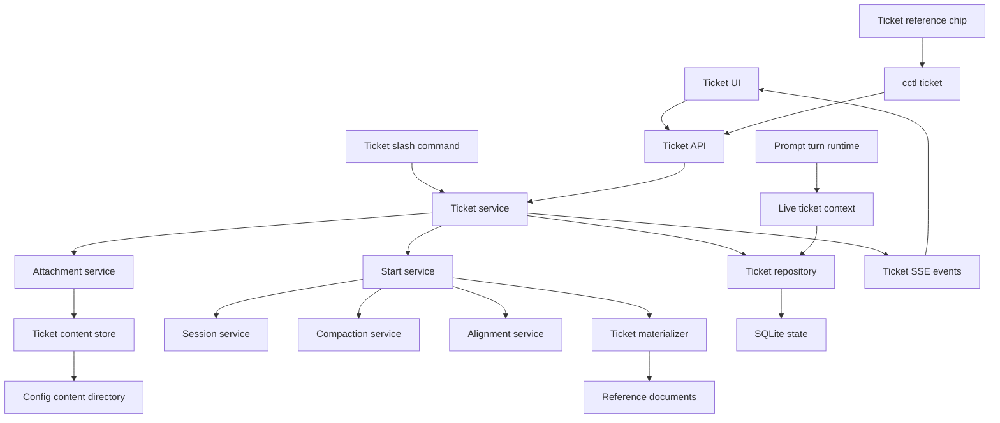
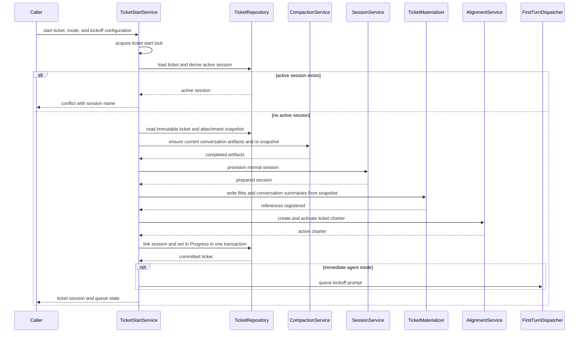
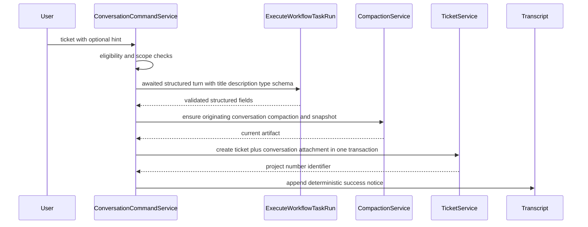
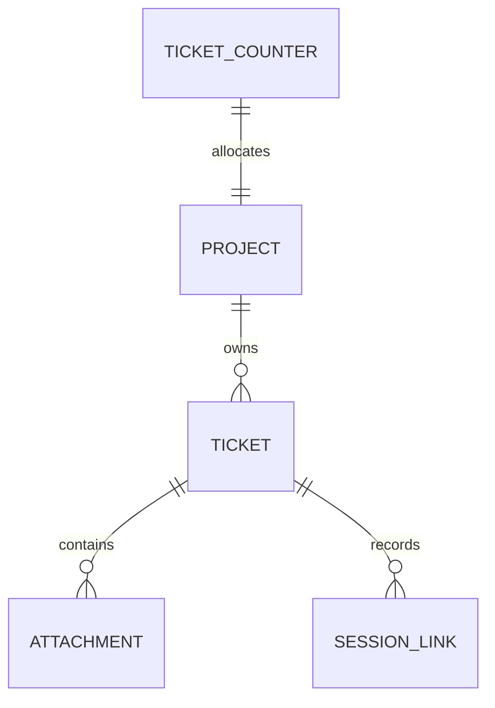

# Technical Design — Ticket System

> Canonical design, produced by a two-agent collaboration (Claude `design.agent_one.md`, Codex `design.agent_two.md` — both retained as inputs; this document supersedes them). Negotiation ledger: `memory-bank/collaboration/24cc5b2a-8427-4564-806e-b095adb20819/round-1/agent_one/resolution_decision/main.md`.
> **Visual specification**: the Claude Design prototype bundle at `memory-bank/prototypes/ticket-system-prototype/` (screens `00`–`06` + `project/handoff-notes.md`) is the authoritative UI/interaction spec, incorporated into "UI and Interaction" below.

## Overview

The Ticket System gives Command Center users and agents a durable, project-owned context bundle for work that is not ready to start. A ticket combines a small lifecycle model with described attachments, stable cross-conversation references, and a start-work operation that provisions a normal session with its initial context materialized and its current state visible to the agent on every turn. The differentiator is progressive disclosure: every attachment is an indexed, described pointer whose full content agents retrieve on demand, and tickets link to other tickets, forming a navigable context graph reachable from any conversation.

The design adds a tickets domain without moving ownership from existing subsystems. Ticket persistence, attachment snapshots, session-link history, ticket references, and orchestration belong to the new domain. Worktree provisioning, conversation compaction, Alignment charters, reference-document registration, prompt execution, and session lifecycle remain owned by their existing modules and are invoked through narrow contracts.

Implementation is phased by boundary: ticket aggregate and API first; attachments and agent CLI second; session start and live context third; references, slash command, and UI integration last. Each phase is independently testable while preserving one final domain model.

### Goals
- Persist project-scoped tickets with monotonic, never-reused display numbers.
- Make five described attachment types available as a progressive-disclosure index with durable capture where sources are ephemeral.
- Provision a ready normal session in either immediate-agent or prepared mode, all-or-nothing.
- Materialize creation-time file and conversation context while exposing current ticket state on every later turn.
- Make tickets resolvable from any conversation through XML references and cctl.
- Provide UI, CLI, slash-command, SSE, and session-indicator surfaces over one authoritative service.

### Non-Goals
- Priority, labels, assignees, blocked-reason fields, comments, or an activity timeline.
- Graph-workflow launch from a ticket.
- First-class URL, git-ref, or code-location attachment variants (plain text inside descriptions/notes).
- Repository-backed ticket files, export, or synchronization with external ticket systems.
- Automatic status changes on merge, finish, delete, or any event other than successful start-work linking.
- Changes to session merge, finish, delete, worktree, compaction, Alignment, or reference-document ownership.

## Boundary Commitments

### This Spec Owns
- The Ticket aggregate: identity, project ownership, fields, status, timestamps, per-project counter, attachments, and linked-session history.
- The authoritative SQLite tables and focused repository used by ticket operations.
- Durable central snapshots for file attachments and conversation compactions, and cleanup of those snapshots.
- Ticket start orchestration: active-session gating, context preparation, compensation, ticket linking, and the sole automatic status transition.
- The current per-turn ticket block for ticket-linked sessions.
- The ticket XML reference contract and its prompt-editor chip representation.
- Ticket REST endpoints, `cctl ticket` commands, slash-command creation, SSE change events, and ticket UI.
- Ticket-to-session indicator lookup. Session persistence itself is not extended with ticket fields.

### Out of Boundary
- Session provisioning internals, branch naming rules, worktree initialization, and session deletion behavior.
- Conversation transcript ownership and compaction generation.
- Alignment version storage and general approval behavior; this spec adds only a trusted programmatic activation entrypoint for ticket-created sessions.
- Reference-document storage and content endpoints.
- Agent backend selection, runtime lifecycle, and first-turn execution semantics.
- Session lifecycle automation: ticket status never follows merge, finish, or deletion.
- External authorization, multi-user assignment, or permission policy.

### Allowed Dependencies
- Ticket schemas depend only on Zod and cross-domain shared primitives.
- Ticket repositories depend on better-sqlite3, the shared state DB, the global write queue, parsing helpers, and structured logging.
- Ticket services depend on ticket repositories plus existing project resolution, session provisioning, compaction, Alignment, reference-document, conversation-read, prompt-dispatch, config-directory, and SSE contracts.
- Route handlers and cctl depend on ticket services and the existing agent-auth, tracing, fetch, error-envelope, and help-registry conventions.
- UI depends on ticket query hooks, existing ui primitives, Tiptap extension points, and `@dnd-kit/core`.
- Existing session and conversation core persistence must not import the ticket domain. Presentation surfaces may consume ticket-owned link queries.
- **Dependency direction** (violations are errors): schemas → persistence/content storage → domain services → route, command, runtime, and event adapters → UI and CLI. Imports only move rightward; existing services are outbound ports of the start service and never import ticket modules.

### Revalidation Triggers
- Any change to Ticket, TicketAttachment, TicketSessionLink, ticket-ref, or ticket SSE schemas.
- Any move of ticket/session-link authority into SessionState or another domain.
- Changes to session-provisioning rollback guarantees, compaction completion contracts, Alignment activation, reference-document registration, or first-turn dispatch.
- A multi-process server deployment that invalidates the in-process keyed ticket-operation lock.
- Changes to project identity or display-name resolution affecting `project#number` references.
- Changes to prompt runtime construction that prevent per-turn transient effective-prompt injection.
- Ticket list filters growing beyond field-equality + created/updated ordering (invalidates the shared SSE/optimistic reducer contract).
- Replacement or major-version upgrades of dnd-kit, Tiptap, TanStack Query, Zod, SQLite, or Next.js.

## Architecture

### Existing Architecture Analysis
- Durable state lives in `command-center.db`; structural table floors are created synchronously in `src/lib/state-store/state-db.ts`; focused repositories validate rows at the persistence boundary.
- Session provisioning is centralized in `src/lib/sessions/service.ts` and already compensates state, worktree, and branch failures.
- Conversation compaction exposes a coalescing trigger with awaitable completion and a current-coverage check; artifacts are deleted with their session scope, so durable ticket use requires snapshots.
- Alignment owns active-charter versioning and injection; `copyActiveCharter` proves zero-gate programmatic activation.
- Prompt runtimes bake session instructions at runtime creation (persistent QuerySessions survive across turns), so fresh per-turn ticket state must ride the transient effective-prompt path, not `sessionInstructions`.
- `executeWorkflowTaskRun` (`src/lib/workflows/conversation/execute-workflow-task-run.ts`) routes a single `task_run` turn through the conversation actor, serializes per conversation, awaits finalization, accepts `json_schema` output, and **resumes the conversation `backendRef`** (`actor-implementations.ts:2472`) — task runs have native conversation context; `/commit` already uses this path.
- Reference parsing, paste conversion, Tiptap atom nodes, serialization, transcript rendering, and embedded cctl commands are extensible by reference type.
- The global SSE bus carries small typed change notifications; steering prescribes delta-carrying events + `setQueryData` when thin events would force large-list invalidation.
- `projects` rows are retained for missing/undiscovered paths (`missing: true`); only the explicit, documented-destructive `deleteProject` removes the aggregate; sessions and conversations already FK `projects(root_path) ON DELETE CASCADE` (`state-db.ts:155,237`).
- cctl command metadata, flags, help, related edges, and parsing derive from the typed help registry.

### Architecture Pattern and Boundary Map

The selected pattern is a new domain aggregate with orchestration adapters. It preserves current domain ownership and adds no ticket fields to SessionState or ManagerState.



**Key decisions** (negotiated; ledger cited in header)
- Build a sibling ticket content store instead of generalizing the workflow shared-document store: retention keys and cleanup lifecycles differ, and a shared abstraction would have one implementation with incompatible ownership.
- Keep session links ticket-side with no FK to `sessions`: a deleted session must remain in ticket history. Active state is derived by joining current sessions, guarded for name reuse (below).
- Keep `tickets.project_path → projects(root_path) ON DELETE CASCADE`: it matches the established aggregate convention (sessions/conversations use the same FK), discovery retains missing projects, and only explicit `deleteProject` (documented "every trace") removes rows. `ticket_counters` deliberately has no FK so numbers are never reused across delete/re-add. Project deletion additionally invokes best-effort ticket-content blob cleanup, since the SQL cascade cannot reach the filesystem.
- Snapshot-durable attachments: file bytes at attach; conversation compaction markdown at attach (ensure-if-missing), refreshed and re-snapshotted at start when the source is alive; session and related-ticket entries stay live pointers; notes are inline.
- Serialize start and delete per ticket with a keyed in-process operation lock; field/attachment CRUD stays lock-free through the write queue (start works from an immutable snapshot taken at lock entry).
- `/ticket` is server-owned: an awaited `executeWorkflowTaskRun` supplies structured judgment with native conversation context (resumed `backendRef`; bounded transcript rendering as fallback when null), then server code compacts, creates, attaches, and reports deterministically.
- SSE carries a lean `TicketListItem` delta consumed by a pure, idempotent list reducer that shares one client-safe filter/order module with the optimistic mutation paths; exact invalidation covers only data absent from the event.
- Adopt `@dnd-kit/core` only (pointer, touch, keyboard sensors + a small cross-column keyboard coordinate getter). No `@dnd-kit/sortable` in v1 (no intra-column ordering); needing it later is a design amendment.

### Technology Stack

| Layer | Choice / Version | Role in Feature | Notes |
|---|---|---|---|
| Frontend | Next.js 16, React 19, Tiptap 3 | Ticket routes, prompt reference chips, session indicators | Thin app shells; feature UI in `src/features` |
| Client data | TanStack Query 5 | Lists, details, mutations, optimistic cache updates | SSE delta reducer + exact invalidation |
| Board interaction | `@dnd-kit/core` 6.3.x | Pointer, touch, and keyboard Kanban movement | New runtime dependency (core only) |
| Backend | TypeScript strict, Zod 4 | Contracts, validation, discriminated unions | No `any`; types via `z.infer` |
| Data | better-sqlite3, WAL SQLite | Tickets, counters, attachments, links | Four additive tables in `command-center.db` |
| Content | Node fs under the CC config directory | Durable attachment snapshots | Atomic temp-write + rename; containment checks |
| Messaging | Existing typed global SSE bus | Lightweight ticket change deltas | No ticket-specific EventSource |
| Agent runtime | Existing session, compaction, Alignment, reference-doc, task-run, and first-turn services | Start-work composition, /ticket generation, live context | No new orchestrator |

## File Structure Plan

### New Files
```text
src/
├── lib/
│   ├── state-store/
│   │   ├── tickets-repo.ts                  # Codecs + atomic focused SQL across counters, tickets, attachments, links
│   │   └── tickets-repo.contract.test.ts    # assertRoundTripDurability for every persisted shape
│   └── tickets/
│       ├── schemas.ts               # Sole source of domain, request, response, event, and reference types
│       ├── service.ts               # CRUD, identity formatting, filters, status semantics, SSE publication
│       ├── service-factory.ts       # DI factory wiring repos/stores/ports
│       ├── attachment-service.ts    # Typed attachment validation, edit/remove/resolve, snapshot compensation
│       ├── content-store.ts         # Safe central paths, atomic capture, reads, best-effort cleanup
│       ├── start-service.ts         # Start-work state machine and compensation
│       ├── operation-lock.ts        # Keyed start/delete single-flight (single-process runtime)
│       ├── materializer.ts          # Creation-time worktree writes + reference-document registration
│       ├── live-context.ts          # Focused session→ticket lookup + per-turn block rendering
│       ├── attachment-index.ts      # Shared typed index renderer (live block, kickoff, CLI, resolution)
│       ├── references.ts            # Canonical ticket-ref XML build/validate
│       ├── slash-command.ts         # /ticket generation prompt, schema, server-side create+attach+notice
│       ├── route-handlers.ts        # List/create/detail/update/delete handlers
│       ├── attachment-route-handlers.ts
│       ├── start-route-handlers.ts
│       ├── session-link-route-handlers.ts
│       ├── query-keys.ts / queries.ts / mutations.ts
│       ├── sse-reducer.ts           # Pure idempotent list reducer shared with optimistic paths
│       └── *.test.ts                # Colocated unit tests
├── app/
│   ├── tickets/
│   │   ├── page.tsx
│   │   └── [projectName]/[number]/page.tsx
│   └── api/
│       ├── tickets/route.ts                          # Global filtered list
│       └── projects/[name]/tickets/
│           ├── route.ts                              # Project list / create
│           ├── session-links/route.ts                # Session indicator map
│           └── [number]/
│               ├── route.ts                          # Detail / update / delete
│               ├── start/route.ts
│               └── attachments/
│                   ├── route.ts
│                   └── [attachmentId]/route.ts
├── features/
│   └── tickets/
│       ├── TicketsPage.tsx
│       ├── TicketDetailPage.tsx
│       ├── components/
│       │   ├── TicketFilters.tsx / TicketList.tsx / TicketBoard.tsx / TicketCard.tsx
│       │   ├── TicketEditor.tsx / AttachmentIndex.tsx / AttachmentDialog.tsx
│       │   ├── StartTicketDialog.tsx / CreateTicketDialog.tsx / CopyTicketReferenceButton.tsx
│       └── stories/
│           ├── TicketBoard.stories.tsx
│           ├── TicketDetailPage.stories.tsx
│           └── CreateTicketDialog.stories.tsx
├── cli/commands/
│   ├── ticket.ts / ticket.help.ts / ticket.test.ts
└── lib/prompt-editor/
    └── ticket-mention-node.ts

src/features/session/conversation/
├── TicketMentionChip.tsx            # Prompt-editor chip
├── TicketMentionChip.stories.tsx
└── TicketRefLinkChip.tsx            # Transcript read-side chip
```

### Modified Files
- `package.json`, `bun.lock` — add pinned `@dnd-kit/core`.
- `src/lib/state-store/state-db.ts` — four ticket tables + indexes in the synchronous schema floor.
- `src/lib/api/sse-events.ts` — `TicketChangedEvent` in the `SSEEvent` union (no `_sentAt` in schema; envelope stamps/strips).
- `src/components/NotificationListener.tsx` — validate ticket events; apply the reducer; exact invalidations for absent data.
- `src/lib/session-alignment/schemas.ts` — add `ticket` to `AlignmentVersionSource`.
- `src/lib/session-alignment/service.ts` (+ factory) — trusted `createAndActivateTicketCharter`, used only after ticket session provisioning.
- `src/lib/workflows/conversation/actor-implementations.ts` — request and prepend the live ticket block into each session turn's transient effective prompt.
- `src/lib/conversations/ref-parser.ts`, `ref-segments.ts`, `schemas.ts` — recognize and validate `ticket-ref`.
- `src/lib/prompt-editor/ref-paste-extension.ts`, `serializer.ts`, `index.ts` — paste, render, remove, serialize ticket mention atoms.
- `src/features/session/prompt/PromptEditor.tsx` — register `TicketMentionNode`.
- `src/features/session/conversation/MessageTextWithRefs.tsx` — render sent ticket refs as navigable chips.
- `src/lib/conversation-commands/parse.ts`, `schemas.ts`, `service.ts` (+ generation/dispatch as needed) — recognize `/ticket`, run the awaited structured task run, then server-side compact + create + attach + notice.
- `src/features/session/prompt/PromptEditorSlashCommandPopup.tsx` — advertise `/ticket` at session and project scope.
- `src/cli/core.ts`, `src/cli/help-registry.ts` — register `cctl ticket` + help graph.
- `plugins/command-center/command-center/skills/cc-cli/SKILL.md` — document the ticket command group and disclosure edges.
- `src/components/Topbar.tsx` — global Tickets destination.
- `src/features/project-detail/ProjectDetailView.tsx` — project-prefiltered Tickets entry.
- `src/features/project-detail/components/SessionRow.tsx` — ticket indicator from the link query.
- `src/features/session/conversation/SessionInfoStrip.tsx` — linked ticket identifier + detail navigation.
- `src/lib/sessions/service.ts` (or its delete path) — invoke ticket-content blob cleanup during `deleteProject`.
- `src/components/ui/Badge.tsx` — extend the `tier="type"` `typeAppearance` map with `research` (violet), `tech_debt` (amber), `performance` (green); the shipped map only knows `feature|bug|idea`.
- `src/features/_root/styles/theme.css` — add `tk-card-land` and `tk-sse-in` keyframes as theme animation tokens (drag-commit wash, SSE-enter fade); no new global stylesheet.

No new stylesheet. New UI uses Tailwind v4 utilities, static variant maps (never `data-[status=…]` with underscores), `cn`, and existing Button, IconButton, Badge, Tabs, Select, Dialog, AlertDialog, RadioGroup, FormField, and EmptyState primitives.

## System Flows

### Start Work



Flow decisions:
- Compaction precedes provisioning so a compaction failure cannot orphan a session; artifacts are reusable, so nothing is wasted on abort.
- The ticket is untouched until the final link-and-status transaction (2.2, 4.2). Any failure after provisioning but before that transaction invokes exact-incarnation compensation once. Compensation verifies the session's captured creation time, worktree path, and branch before removing its worktree, state, and provisioned branch; ordinary user-driven session deletion continues to preserve branches. A cleanup failure is reported and leaves the incarnation occupied so a retry cannot target its artifacts. The ticket's status and links are unchanged (4.7 and stricter).
- The lock covers start and delete only. Field/attachment CRUD proceeds lock-free; the start operation materializes strictly from its entry snapshot, and later edits are legitimate post-start drift visible in the per-turn block (3.4, 5.5). Attachment removal defers physical blob reclamation while a start may hold the blob (lock-aware cleanup).
- Concurrent start of the same ticket receives `start_in_progress`; concurrent start against a stale active link on a reused session name reconciles the conflicting link (demote with `replaced`/`deleted`) and retries the insert once — if the conflicting session is genuinely live, the standard active-conflict error names it.
- Session names preserve the ticket title: the first name is `Ticket: <title>`, while later starts append a readable ordinal such as ` (2)`. The title is truncated only when needed to stay within the 100-character session-name limit. Start scans forward from the history-derived ordinal to the first unoccupied name, so a finished/replaced incarnation or failed compensation cannot poison every retry.
- Immediate mode carries the user's selected backend, model, and supported reasoning effort into the existing first-turn dispatcher after the link transaction commits, so the first turn already sees the live ticket block and runs with the requested configuration; prepared mode calls no prompt function (4.5, 4.6). A first-turn dispatch failure leaves a linked, usable prepared session and is surfaced, never rolled back.

### Slash-Command Creation



Flow decisions:
- The structured turn runs through `executeWorkflowTaskRun` in the originating conversation: per-conversation serialization gives sane mid-turn behavior, and the resumed `backendRef` supplies native accumulated context (7.2). When `backendRef` is null (fresh conversation, lost ref), the service supplies the existing bounded transcript/compaction rendering as generation context — a named implementation task, not an afterthought.
- The model is used for judgment only. Server code validates the structured result, ensures + snapshots the compaction, creates the ticket and the auto-attached originating conversation in one write-queue transaction (7.1, 7.3), and appends the deterministic success notice with the identifier (7.4).
- Any generation, validation, compaction, or transaction failure appends a reason notice and persists nothing (7.5). Ineligible scope uses the existing rejection-notice path. Graph-workflow lanes do not expose `/ticket`; lane agents use `cctl ticket` directly (8.3).

### Live Ticket Context

For every session turn, the actor requests a focused ticket lookup by project path and session name. A linked ticket produces a transient `<active-ticket>` block containing identifier, title, status, the **complete** typed attachment index, and exact retrieval commands. The block is prepended to that turn's effective prompt and is never baked into the backend runtime, so attachment changes appear on the next turn without runtime recreation (5.4, 5.5). Per-entry description text is truncated to a fixed budget with an explicit ellipsis; attachment bodies are never inlined; entry count and rendered size are logged without content. Entries are never omitted — any product-level attachment-count limit would be a requirements change, not a silent prompt cap.

```text
<active-ticket>
identifier: command-center#12
title: Add durable ticket context
status: In Progress
attachments:
- att-1 file — API contract — cctl ticket attachment get command-center#12 att-1
- att-2 conversation — Original design discussion — cctl ticket attachment get command-center#12 att-2
refresh: cctl ticket get command-center#12
</active-ticket>
```

## Requirements Traceability

| Req | Summary | Components | Interfaces / Flows |
|---|---|---|---|
| 1.1 | Persist ticket with core fields + one project | TicketService, TicketRepository, CreateTicketDialog | `create`, POST project tickets route |
| 1.2 | Work-type enum | schemas | Zod boundary validation + DDL CHECK |
| 1.3 | Status enum | schemas | Zod boundary validation + DDL CHECK |
| 1.4 | Default status Not Started | TicketService | `create` postcondition |
| 1.5 | Per-project sequential number | TicketRepository | Counter + insert in one transaction |
| 1.6 | Numbers never reused | ticket_counters (monotonic, no FK) | Contract + delete/create tests |
| 1.7 | Display `project#n` | TicketService identity formatting | UI, CLI, refs, live block |
| 1.8 | UI delete confirmation | TicketDetailPage | AlertDialog before DELETE |
| 1.9 | Delete removes from views | TicketService + SSE reducer | deleted delta removes from cached lists |
| 2.1 | Free status transitions | TicketService.update | PATCH detail route |
| 2.2 | Start sets In Progress | TicketStartService | Final link+status transaction |
| 2.3 | Lifecycle leaves status unchanged | Link reconciliation demotes links only | Invariant + tests |
| 2.4 | No other automation | Only start-work writes status implicitly | Invariant + tests |
| 3.1 | Five attachment kinds | payload discriminated union | attachment routes/CLI |
| 3.2 | Description recorded | Required non-empty field | Zod + UI/CLI forms |
| 3.3 | File content survives source deletion | TicketContentStore capture at attach | Snapshot-first add with compensation |
| 3.4 | Attachment CRUD in any status | TicketAttachmentService (no status guard; lock-free during start) | attachment routes |
| 3.5 | Index + on-demand retrieval | attachment-index renderer + resolve | GET attachment route, `cctl ticket attachment get` |
| 3.6 | Navigate related tickets | related_ticket resolve + UI links + embedded commands | detail route, index commands |
| 4.1 | Two start modes | StartTicketDialog, `StartTicketInput.mode` | POST start |
| 4.2 | Session in owning project + active link | TicketStartService → SessionService | Start flow |
| 4.3 | Reject when active session exists | Reconcile-then-check + lock | 409 naming session; `start_in_progress` |
| 4.4 | Restart after finish/delete; history kept | ended_at history + ordinal names + instance guard | Start flow, detail history |
| 4.5 | Agent-mode kickoff from ticket | kickoff prompt via shared index + FirstTurnDispatcher | Post-commit dispatch |
| 4.6 | Prepared mode runs no turn | Mode branch | Start flow |
| 4.7 | Provisioning failure leaves ticket unchanged | Compensation; final-transaction ordering | Start flow alt branch |
| 5.1 | Files into worktree + reference docs | TicketMaterializer | `.cc/tickets/` writes + registration |
| 5.2 | Current compaction ensured + materialized | Preflight ensure/refresh + snapshot + materializer | Start flow |
| 5.3 | Auto-approved charter | createAndActivateTicketCharter (mandatory step, source=ticket) | Start flow |
| 5.4 | Ticket view every turn | LiveTicketContext, complete index | Per-turn effective-prompt prepend |
| 5.5 | Post-start changes flow in | Per-turn rebuild from live rows | Live context flow |
| 5.6 | Full content on demand incl. conversations | resolve: snapshot + live transcript read commands | attachment get route/CLI |
| 6.1 | Copy ticket reference | CopyTicketReferenceButton + references.ts | Clipboard XML |
| 6.2 | Paste renders chip | ref-paste extension + TicketMentionNode | Prompt editor |
| 6.3 | Chip removal excludes ref | Serializer emits only present atoms | Prompt editor |
| 6.4 | Agent resolves ref anywhere | `read-command` with `project#n`; global resolution | `cctl ticket get` |
| 6.5 | Ticket autocomplete | `!` suggestion extension + global ticket query | TicketMentionNode insertion |
| 7.1 | Immediate creation, no approval | slash-command adapter, one transaction | /ticket flow |
| 7.2 | Derive fields from context + hint | Awaited task run with resumed backendRef (+ bounded fallback) | /ticket flow |
| 7.3 | Auto-attach originating conversation | Same-transaction conversation attachment + snapshot | /ticket flow |
| 7.4 | Report identifier in conversation | Deterministic success notice | /ticket flow |
| 7.5 | Failure reported, nothing created | All-or-nothing transaction + failure notice | /ticket flow |
| 8.1 | Full-parity command group | cctl ticket (create/list/get/update/attach/detach/attachment get/start/delete) | CLI contract |
| 8.2 | Bare number in project scope | CC_PROJECT identity resolution | CLI parsing |
| 8.3 | Works from any conversation incl. lanes | Token + env identity everywhere; no /ticket in lanes | CLI transport |
| 8.4 | List/get include attachment index | Shared renderer, bounded-entry mode, text AND `--json` | CLI output contract |
| 8.5 | Unknown ticket errors identify it | `ticket_not_found` exit 1 naming the ref | Error envelope |
| 9.1 | Global tickets view | `/tickets` route + TicketsPage | Route shell |
| 9.2 | List filters + sorting | TicketFilters + queries (project/type/status; created/updated) | URL-driven state |
| 9.3 | Kanban with five status columns | TicketBoard | Board layout |
| 9.4 | Drag to change status | dnd-kit onDragEnd → optimistic status mutation | Board flow + reducer reconcile |
| 9.5 | Per-project pre-filtered entry | ProjectDetailView link | URL filter |
| 9.6 | Detail edit/attachments/start/history | TicketDetailPage | Detail route |
| 9.7 | Optimistic or pending feedback | Mutations per responsiveness contract | onMutate/rollback/pending states |
| 9.8 | Live updates without refresh | ticket-changed delta + reducer + exact invalidation | SSE contract |
| 10.1 | Ticket indicator on session surfaces | SessionTicketIndicator (active + historical links) | session-links query |
| 10.2 | Indicator navigates to ticket | Badge → detail route | Navigation |

## Components and Interfaces

| Component | Domain / Layer | Intent | Requirements | Key dependencies | Contracts |
|---|---|---|---|---|---|
| TicketRepository | Data | Persist and query the ticket aggregate atomically | 1.1–1.6, 2.1–2.4, 3.1–3.6, 4.2–4.4 | SQLite P0, write queue P0 | Service, State |
| TicketService | Domain | CRUD, identity, filters, lifecycle rules, events | 1.1–2.4, 8.5, 9.1–9.8 | Repository P0, events P1 | Service, API, Event |
| TicketAttachmentService | Domain | Capture, mutate, resolve, remove attachments | 3.1–3.6, 5.1, 5.2, 5.6 | Repository P0, content store P0, compaction P1 | Service, API |
| TicketContentStore | Infrastructure | Preserve bytes/compaction markdown outside worktrees | 3.3, 5.1, 5.2 | Config dir P0, fs P0 | Service |
| TicketStartService | Orchestration | All-or-nothing ticket session start | 2.2–2.4, 4.1–5.3 | Session, compaction, Alignment, materializer P0 | Service, API |
| TicketMaterializer | Integration | Creation-time worktree artifacts + reference docs | 5.1, 5.2 | Content P0, reference docs P0 | Service |
| LiveTicketContext | Runtime | Complete current ticket block every turn | 5.4–5.6 | Repository P0, prompt actor P0 | Service |
| TicketReferenceAdapter | Conversation UI | Round-trip ticket-ref as text and chips | 6.1–6.4 | Tiptap P0, cctl P1 | State |
| TicketCommandAdapter | Conversation command | Server-owned creation from accumulated context | 7.1–7.5 | executeWorkflowTaskRun P0, compaction P0, TicketService P0 | Service |
| TicketApi | HTTP | Typed UI and agent operations | 1.1–10.2 | Ticket services P0, agent auth P0 | API |
| TicketClientData | Client data | Queries, optimistic mutations, SSE reducer | 9.1–9.8, 10.1 | TanStack Query P0, SSE P0 | State, Event |
| TicketUi | Feature UI | List, board, detail, attachments, start | 1.7–1.9, 3.4–4.1, 6.1, 9.1–9.8 | UI primitives P0, dnd-kit P1 | State |
| SessionTicketIndicator | Presentation | Ticket identity on linked sessions | 10.1, 10.2 | session-links query P0 | State |

### Ticket Repository

**Responsibilities and constraints**
- Allocate a number and insert its ticket in one immediate SQLite transaction inside the write queue; never decrement or delete `ticket_counters`.
- Store attachments as validated discriminated payload JSON.
- Preserve ticket-session links after session rows disappear; persist the linked session's exact `created_at` as `ticket_sessions.session_created_at` and join current sessions only when `session.created_at = link.session_created_at`. Legacy links whose incarnation is unknowable keep a NULL token and are conservatively historical.
- Expose focused reads for the per-turn live context and session-indicator maps (never `readState` hydration).

```typescript
interface TicketRepository {
  create(input: PersistTicketInput): Promise<Ticket>;
  createWithConversationAttachment(
    input: PersistTicketInput,
    attachment: PersistAttachmentInput,
  ): Promise<TicketDetail>;
  list(query: TicketListQuery): Promise<TicketListItem[]>;
  find(projectPath: string, number: number): Promise<TicketDetail | null>;
  update(input: UpdateTicketInput): Promise<TicketDetail | null>;
  delete(projectPath: string, number: number): Promise<DeletedTicket | null>;
  addAttachment(input: PersistAttachmentInput): Promise<TicketAttachment>;
  updateAttachment(input: UpdateAttachmentInput): Promise<TicketAttachment | null>;
  deleteAttachment(input: AttachmentIdentity): Promise<TicketAttachment | null>;
  findLinkedTicket(projectPath: string, sessionName: string): Promise<TicketDetail | null>;
  listSessionLinks(projectPath: string): Promise<Record<string, TicketLinkSummary>>;
  linkStartedSession(input: LinkStartedSessionInput): Promise<TicketDetail>;
  endSessionLink(input: EndSessionLinkInput): Promise<void>;
}
```

Public repository methods enter the global write queue; multi-row writes use one synchronous immediate transaction after the queue is acquired.

### Ticket Service

- Resolves project names to canonical paths at API boundaries; formats identifiers from the current project display name plus number.
- Permits every explicit status transition (2.1); publishes one schema-validated `TicketChangedEvent` only after a successful mutation; event failure never rolls back state.

```typescript
type TicketError =
  | { code: "ticket_not_found"; identifier: string }
  | { code: "validation_failed"; issues: ValidationIssue[] }
  | { code: "active_session"; sessionName: string }
  | { code: "start_in_progress"; identifier: string }
  | { code: "content_unavailable"; attachmentId: string; reason: string }
  | { code: "context_preparation_failed"; reason: string }
  | { code: "session_provision_failed"; reason: string };

type TicketResult<T> = { ok: true; value: T } | { ok: false; error: TicketError };

interface TicketService {
  create(input: CreateTicketInput): Promise<TicketResult<TicketDetail>>;
  list(input: TicketListQuery): Promise<TicketResult<TicketListItem[]>>;
  get(identity: TicketIdentity): Promise<TicketResult<TicketDetail>>;
  update(input: UpdateTicketInput): Promise<TicketResult<TicketDetail>>;
  delete(identity: TicketIdentity): Promise<TicketResult<DeletedTicket>>;
}
```

### Attachment Service and Content Store

File creation accepts multipart form data (Zod-validated metadata part + streamed file part); other kinds use JSON. The content store writes to a temporary path beneath the config directory and atomically renames into:

```text
ticket-content/<ticket-uuid>/<attachment-uuid>/<sanitized-file-name>
```

Only generated UUID segments plus a sanitized basename; a resolved-path containment check runs before every read, write, materialize, or delete. Oversized uploads receive 413.

```typescript
interface TicketContentStore {
  capture(input: CaptureTicketFileInput): Promise<FileSnapshot>;
  captureText(input: CaptureTicketTextInput): Promise<FileSnapshot>;   // compaction markdown snapshots
  read(snapshotKey: string): Promise<Uint8Array>;
  materialize(snapshotKey: string, destination: string): Promise<void>;
  delete(snapshotKey: string): Promise<void>;
  deleteTicket(ticketId: string): Promise<void>;
  deleteProject(projectPath: string): Promise<void>;                   // invoked from deleteProject flow
}

interface TicketAttachmentService {
  add(input: AddTicketAttachmentInput): Promise<TicketResult<TicketAttachment>>;
  update(input: UpdateTicketAttachmentInput): Promise<TicketResult<TicketAttachment>>;
  remove(input: AttachmentIdentity): Promise<TicketResult<DeletedAttachment>>;
  resolve(input: ResolveAttachmentInput): Promise<TicketResult<ResolvedAttachment>>;
}
```

Capture policy per kind:

| Kind | At attach | Resolution |
|---|---|---|
| file | Snapshot bytes into content store (3.3) | Metadata + UTF-8 text or base64 bytes |
| conversation | Ensure compaction exists (create-if-missing, no forced refresh); snapshot rendered markdown + source coordinates | Live artifact preferred while source exists, plus mechanical transcript read commands (outline/message/range delegated to conversation-read); durable snapshot after deletion, explicitly labeled a retained compaction — never presented as the full transcript (5.6) |
| session | Pointer | Session metadata, conversation index, read commands |
| related_ticket | Pointer | Current ticket detail + attachment index, or typed unavailable result if deleted (3.6) |
| note | Inline markdown | Full markdown |

For file add, snapshot precedes the DB insert; a failed insert removes the snapshot. Delete commits DB removal first with best-effort content cleanup (worst case: unreachable orphan, never a broken DB reference); blob reclamation is deferred and lock-aware while a start may hold the blob. Ticket deletion captures snapshot keys before the cascading transaction and cleans afterward.

### Ticket Start Service

Covered by the Start Work flow above. Contract:

```typescript
type TicketStartMode = "agent" | "prepared";

interface StartTicketInput {
  identity: TicketIdentity;
  mode: TicketStartMode;
  backend?: "claude" | "codex";
  model?: string;
  reasoningEffort?: EffortLevel;
}

interface StartTicketOutput {
  ticket: TicketDetail;
  sessionName: string;
  conversationId: string;
  initialPromptQueued: boolean;
}

interface TicketStartService {
  start(input: StartTicketInput): Promise<TicketResult<StartTicketOutput>>;
}
```

The kickoff prompt contains identifier, title, description, the full attachment summary index, and the same retrieval commands used by the live block (shared renderer). Creates only normal-mode sessions.

### Materializer and Alignment Contract

Creation-time materialized paths are stable and git-ignored:

```text
.cc/tickets/<project-number>/
├── files/<attachment-id>-<file-name>
└── conversations/<attachment-id>-<conversation-id>.md
```

Every materialized file is registered as a reference document carrying the attachment description (5.1). Conversation markdown renders from the current compaction envelope and includes source-transcript read commands (5.2). Materialized files remain creation-time snapshots; the live block and cctl are authoritative afterward.

```typescript
interface SessionAlignmentService {
  createAndActivateTicketCharter(input: {
    projectPath: string;
    sessionName: string;
    ticketIdentifier: string;
    title: string;
    description: string;
  }): Promise<AlignmentVersion>;
}
```

Validates a normal session, creates a `source: "ticket"` version, activates through the existing activation path (mirror + broadcast), and exposes no HTTP bypass of the human `/align` approval flow (5.3).

### Live Ticket Context

```typescript
interface LiveTicketContextProvider {
  getForSession(projectPath: string, sessionName: string): Promise<string | null>;
}
```

Deterministic, read-only, complete-index rendering per the Live Ticket Context flow. Structured logging records identifier, attachment count, rendered character count, and lookup duration — never descriptions or content.

### Ticket Reference Contract

```xml
<ticket-ref project-name="command-center" ticket-number="12" identifier="command-center#12" title="Add durable ticket context" read-command="cctl ticket get command-center#12" />
```

The parser ignores fenced code, validates required attributes, and leaves malformed tags as plain text (6.2). The Tiptap atom stores validated attributes, displays identifier plus truncated title, serializes back in canonical attribute order, and disappears from the outgoing prompt when deleted (6.3). Resolution is agent-side via the embedded globally-valid `read-command` (6.4). Refs carry display identity and commands — never project paths, snapshot keys, notes, or content.

Typing `!` at a word boundary opens the ticket autocomplete above the prompt input. It reuses the shared autocomplete shell and keyboard contract, searches title, `project#number`, and project name across the global ticket list, and ranks the current project's tickets first. Rows show identifier and title over compact type, status, context-count, active-session, and project metadata. Selection inserts the same `TicketMentionNode` used by pasted references, so serialization and removal stay canonical (6.5).

### HTTP API

| Method | Endpoint | Purpose | Success | Errors |
|---|---|---|---|---|
| GET | `/api/tickets` | Global filtered/sorted list | TicketListItem[] | 400 |
| GET, POST | `/api/projects/:name/tickets` | Project list or create | List or TicketDetail | 400, 404 |
| GET, PATCH, DELETE | `/api/projects/:name/tickets/:number` | Detail, update, delete | TicketDetail or deleted identity | 400, 404, 409 |
| GET, POST | `/api/projects/:name/tickets/:number/attachments` | Index or add | Attachments or attachment | 400, 404, 413 |
| GET, PATCH, DELETE | `/api/projects/:name/tickets/:number/attachments/:id` | Resolve, edit, remove | Resolved/changed attachment | 400, 404, 409, 410 |
| POST | `/api/projects/:name/tickets/:number/start` | Start in agent or prepared mode | StartTicketOutput | 404, 409, 422, 500 |
| GET | `/api/projects/:name/tickets/session-links` | Session indicator map | Record by session name | 404 |

Mutation routes are traced, Zod-`safeParse`d, token-gated for cctl, and use the existing ApiError shape with stable codes and structured issues.

### Event Contract

```typescript
interface TicketChangedEvent {
  type: "ticket-changed";
  change: "created" | "updated" | "deleted" | "attachments" | "session";
  projectName: string;
  ticketNumber: number;
  listItem: TicketListItem | null;      // lean; null for deleted
  attachmentIndexChanged: boolean;
  linkedSessionName?: string;
}
```

Frames stay under the 1–2 KB target; the schema excludes `_sentAt` (envelope stamps/strips). A pure, idempotent reducer (`sse-reducer.ts`) removes the ticket identity from each cached ticket list, then re-inserts and re-sorts the lean `listItem` only where the query's typed filters match. The same client-safe filter and ordering definitions are shared by the optimistic mutation paths and reducer tests — one module, no drift. Data absent from the event uses exact invalidation only: the one detail key on every surviving change with no pending optimistic overlay (Req 9.8 — open detail views reflect changes from any source; the lean item carries only list fields), the one project session-link key when `linkedSessionName` is present. The server remains authoritative; `onSettled` hygiene invalidation stays.

### CLI Contract

`cctl ticket` group: `create`, `list`, `get`, `update`, `delete`; `attach file|conversation|session|ticket|note`; `attachment get|update|remove`; `start --mode agent|prepared`.

- In project scope a bare number resolves through `CC_PROJECT` (8.2); the public cross-scope form is `project#number`. Unknown tickets exit 1 with `ticket_not_found` naming the ref (8.5); usage errors exit 2 before any network call; connection/auth failures exit 3.
- `list` and `get` always include the typed attachment index with descriptions and exact retrieval/follow commands — in **both** text and `--json` output (8.4). List uses the shared renderer's bounded-entry mode (truncated descriptions, no bodies); `get` renders full descriptions.
- JSON output retains error, code, issues, reminders, and hint fields per the three-tier CLI contract; read `.kiro/steering/cli.md` before implementing.

### UI and Interaction (visual spec: Claude Design handoff)

**The authoritative visual specification is the Claude Design prototype bundle at `memory-bank/prototypes/ticket-system-prototype/` — screens `01`–`06` (+ index `00`) with `project/handoff-notes.md` as the distilled contract.** Implementers recreate the prototypes' visual output with Tailwind utilities + `src/components/ui/` primitives (never copying prototype markup); the handoff notes' component mapping is aligned 1:1 with this File Structure Plan. What follows summarizes the binding decisions; the bundle carries the per-surface states (default, empty, pending, failure, drag-in-progress, SSE-enter, mobile).

**Status & type visual language** (tokens only; static variant maps, never `data-[status=…]`):
- Status = dot + uppercase mono label: Not Started `text-secondary`/tertiary dot; In Progress `cyan` + glow + `pulse-dot`; Done `green` + glow; Blocked `red` + glow; Closed `text-tertiary`. List rows carry a 3px status rail (SessionRow's rail language); board columns use matching header dots + count pills.
- Work type = rounded-full mono badge: feature `cyan`, bug `red`, research `violet`, tech debt `amber`, performance `green` (each `*-glow` bg / color text) — implemented by **extending `Badge tier="type"`'s `typeAppearance` map** with `research`/`tech_debt`/`performance`, not hand-rolling.
- Attachment-kind icon tiles (26px, rounded-sm, 1.2-stroke 16-grid icons): file `cyan`, conversation `green`, session `violet`, related ticket `cyan-a08`, note `amber`.

**Surfaces**:
- **TicketsPage** (9.1, 9.2): Topbar destination; `SegmentedControl` List ⇄ Board with URL state; `Select` ×4 (project/type/status/sort) + "Clear filters" ghost button with `n of m shown` count; page-header recipe from ProjectDetailView.
- **TicketList**: dense rows on the grid `3px 160px 1fr 118px 128px 64px 220px 92px 44px` (rail · id · title · type · status · CTX · session · updated · kebab); the "CTX" column renders `attachmentCount` as paperclip + count, tertiary when 0 (signals an un-enriched ticket); kebab `DropdownMenu` = Open / Copy reference / Delete….
- **TicketBoard** (9.3, 9.4): five `bg-base` column wells over the `bg-void` shell; `bg-surface` cards (mono id, 2-line clamped title, type badge, attachment count, active-session dot); card kebab carries a `DropdownMenuRadioGroup` "Move to" — the guaranteed non-drag status path.
- **TicketDetailPage** (`/tickets/[projectName]/[number]`; 1.8, 9.6): header (identity + status pill + type badge + actions: Copy reference, Start work, Delete behind `AlertDialog`) over a **main + 340px rail** grid — the attachment index keeps ~72ch width as the hero; the rail carries Fields + Session history. `TicketEditor`: click-to-edit title (Enter/Esc, "saving…" spinner tail), description textarea + Save/Cancel rendered via `MarkdownContent`. `AttachmentIndex` entries lead with the **description** (body font, primary), then kind chip + mono metadata + View/Edit/Remove text actions, with expand-in-place preview on `bg-void`. `AttachmentDialog`: `SegmentedControl` kind picker + per-kind form + required description (submit disabled while empty).
- **StartTicketDialog** (4.1, 4.3, 4.8, 9.7): `RadioGroup` agent/prepared; agent mode exposes backend, model, and supported reasoning-effort selectors while prepared mode hides them; pending confirm "Provisioning…" with `Spinner` (Cancel stays enabled until the link transaction commits); the active-session conflict surfaces **pre-dialog** as an `AlertDialog` naming the session — not a disabled button — so the reason is discoverable.
- **CreateTicketDialog** (1.1; screen `06`): Project + Work type `Select`s side by side (project pre-filled from a project-page entry; type defaults to Feature), required Title, optional markdown description; validation on submit (`FormError`); pending locks inputs but keeps Cancel enabled; failure persists nothing (the counter increments only on commit) and preserves input; success reports the identifier and nudges "Add context" on the new dossier.
- **Chips** (6.1–6.3): `TicketMentionChip`/`TicketRefLinkChip` are a byte-level copy of the ConversationMentionChip recipe (`bg-raised`, `border-default`, `rounded-md`, mono 0.78rem, × with red hover) with a ticket glyph replacing the `#` sigil; the read-side chip drops × and gains a cyan hover ring + navigation. `CopyTicketReferenceButton`: ghost mono button, "Copied ✓" for 1.6s.
- **Session indicators** (10.1, 10.2): `SessionRow` pill after the session name and a `SessionInfoStrip` chip in the identity cluster — active = `border-cyan-dim` + `--cc-cyan-a08` bg + cyan text; ended = `border-subtle` + `bg-raised` + tertiary — for active **and** historical links; the join requires exact equality between `sessions.created_at` and `ticket_sessions.session_created_at`; click navigates to the detail route. `/ticket` appears in the slash popup as one more `AutocompleteOption` with a `command` badge.

**Interaction specs**:
- Optimistic contract (9.7): status changes apply instantly, and on failure roll back with a 1.5s red ring + toast naming the ticket and failed target + Retry; title edits show the saving spinner and restore on failure with inline retry; file attach shows an in-entry progress bar and leaves **no phantom entry** on failure (red panel with Retry/Discard); start-work pending per StartTicketDialog, success closes the dialog with status → In Progress and the session card active.
- Board drag is status-only: pickup lifts the card (rotate 2.5°, scale 1.03, deep shadow + cyan ring) leaving a dashed cyan ghost slot; the target column shows `border-cyan-dim` + `--cc-cyan-a04` fill + `n → n+1` count preview + a 3px drop bar. The keyboard protocol is Space/Enter pickup · ←/→ status column · Space/Enter commit · Esc cancel; ↑/↓ do nothing because v1 persists no intra-column order. The live region announces pickup, target status, commit, and cancel without claiming a position within the column. This status-only rule supersedes prototype annotations that describe intra-column keyboard positions. Commit lands with a 0.9s `tk-card-land` cyan wash; cancel returns without one.
- Live updates (9.8): SSE deltas reduce into caches; new rows/cards enter with a one-shot ~1.2s `tk-sse-in` cyan fade, removals collapse height in 150ms; the reducer is idempotent and never fights an in-flight optimistic move. New keyframes (`tk-card-land`, `tk-sse-in`) are added as theme animation tokens in `theme.css` — no new global stylesheet.
- Mobile ≤768: board becomes a horizontal status pager (44px pills) + single-column card stack with the "Move to" select always visible; the detail dossier keeps all header actions (Start full-width, 44px icon buttons); StartTicketDialog uses `DialogContent mobileSheet`.
- Focus/a11y: cards focusable with the canonical cyan outline (2px, offset 2); dialogs/menus inherit Radix focus management; destructive AlertDialogs focus Cancel; the board is fully operable without drag.
- Token surfaces: shell `--bg-void`; wells + attachment entries `--bg-base`; cards `--bg-surface`; chips/pills `--bg-raised`; hovers `--bg-hover`; hairline ladder `--border-dim/subtle/default/strong`; identity + metadata `--font-mono`, headings `--font-display`, prose `--font-body`.
- Prototype-only affordance, **do not ship**: the "end link" button on the active-session card exists solely to demo the 4.4 restart flow; real link demotion is reconciliation-driven.

## Data Models

### Domain Model



**Ticket invariants**: exactly one canonical project path and positive project-local number; type ∈ {Feature, Bug, Research, Tech debt, Performance}; status ∈ {Not Started, In Progress, Done, Blocked, Closed}; default Not Started; explicit updates permit every status pair; only start-work writes In Progress automatically.

**Attachment invariants**: every attachment has a non-empty authored description; payload kind is exactly one of file, conversation, session, related_ticket, note; a file payload references an existing central snapshot when inserted; a conversation payload references its compaction snapshot + source coordinates; replacing file bytes is remove + add.

**Session-link invariants**: at most one active (`ended_at IS NULL`) link per ticket AND per (project, session name); a ticket may have many historical links; every new link persists the exact session incarnation in `session_created_at`, and an active join additionally requires `session.created_at = link.session_created_at`; a legacy NULL token never matches and is conservatively historical; session deletion never deletes the history row; reconciliation demotes with reason `finished` | `deleted` | `replaced` and never changes ticket status.

### Logical Data Model

```typescript
const ticketAttachmentPayloadSchema = z.discriminatedUnion("kind", [
  z.object({
    kind: z.literal("file"),
    fileName: z.string(),
    snapshotKey: z.string(),
    mediaType: z.string().nullable(),
    sizeBytes: z.number().int().nonnegative(),
    sha256: z.string(),
  }),
  z.object({
    kind: z.literal("conversation"),
    projectPath: z.string(),
    sessionName: z.string().nullable(),
    conversationId: z.string(),
    snapshotKey: z.string(),          // durable compaction markdown snapshot
    snapshotCapturedAt: z.string(),
  }),
  z.object({
    kind: z.literal("session"),
    projectPath: z.string(),
    sessionName: z.string(),
  }),
  z.object({
    kind: z.literal("related_ticket"),
    ticketId: z.string(),
    identifierSnapshot: z.string(),
  }),
  z.object({
    kind: z.literal("note"),
    markdown: z.string(),
  }),
]);
```

Types derive with `z.infer`. `TicketDetail` includes attachments and session history; `TicketListItem` excludes bodies and carries `attachmentCount` plus `activeSessionName`.

### Physical Data Model

```sql
CREATE TABLE IF NOT EXISTS ticket_counters (
  project_path TEXT PRIMARY KEY,
  last_number INTEGER NOT NULL CHECK (last_number >= 0)
);

CREATE TABLE IF NOT EXISTS tickets (
  id TEXT PRIMARY KEY,
  project_path TEXT NOT NULL,
  ticket_number INTEGER NOT NULL CHECK (ticket_number > 0),
  title TEXT NOT NULL,
  description TEXT NOT NULL,
  work_type TEXT NOT NULL CHECK (work_type IN (
    'feature', 'bug', 'research', 'tech_debt', 'performance'
  )),
  status TEXT NOT NULL CHECK (status IN (
    'not_started', 'in_progress', 'done', 'blocked', 'closed'
  )),
  created_at TEXT NOT NULL,
  updated_at TEXT NOT NULL,
  UNIQUE (project_path, ticket_number),
  UNIQUE (id, project_path),
  FOREIGN KEY (project_path) REFERENCES projects(root_path) ON DELETE CASCADE
);

CREATE TABLE IF NOT EXISTS ticket_attachments (
  id TEXT PRIMARY KEY,
  ticket_id TEXT NOT NULL,
  description TEXT NOT NULL,
  payload_json TEXT NOT NULL,
  created_at TEXT NOT NULL,
  updated_at TEXT NOT NULL,
  FOREIGN KEY (ticket_id) REFERENCES tickets(id) ON DELETE CASCADE
);

CREATE TABLE IF NOT EXISTS ticket_sessions (
  id TEXT PRIMARY KEY,
  ticket_id TEXT NOT NULL,
  project_path TEXT NOT NULL,
  session_name TEXT NOT NULL,
  session_created_at TEXT,
  start_mode TEXT NOT NULL CHECK (start_mode IN ('agent', 'prepared')),
  linked_at TEXT NOT NULL,
  ended_at TEXT,
  end_reason TEXT CHECK (end_reason IN ('finished', 'deleted', 'replaced')),
  FOREIGN KEY (ticket_id, project_path)
    REFERENCES tickets(id, project_path) ON DELETE CASCADE
);

CREATE UNIQUE INDEX IF NOT EXISTS uq_ticket_sessions_active_ticket
  ON ticket_sessions(ticket_id) WHERE ended_at IS NULL;
CREATE UNIQUE INDEX IF NOT EXISTS uq_ticket_sessions_active_session
  ON ticket_sessions(project_path, session_name) WHERE ended_at IS NULL;
```

Additional indexes: tickets by `(project_path, updated_at DESC)`, `(status, updated_at DESC)`, `(project_path, status, work_type, updated_at DESC)`; attachments by `(ticket_id, created_at)`; links by `(ticket_id, linked_at)` and `(project_path, session_name)`.

Notes: `ticket_counters` has **no** project FK so a deleted-then-rediscovered project path cannot reuse numbers; ticket deletion never changes the counter. The projects FK matches the sessions/conversations convention (`state-db.ts:155,237`) — discovery retains missing projects; only explicit `deleteProject` cascades — and project deletion additionally triggers best-effort `ticket-content/` blob cleanup, since SQL cascades cannot reach the filesystem.

## Error Handling

| Category | Condition | Response | State guarantee |
|---|---|---|---|
| Validation | Invalid enum, body, identifier, payload | 400 with issues; CLI exit 2 | No write |
| Not found | Project, ticket, attachment, conversation, session missing | 404 stable code; CLI exit 1 for unknown ticket | No write |
| Conflict | Active ticket session, or start already in progress | 409 naming the session or ticket | No provisioning |
| Content | Snapshot missing, unsafe path, compaction failed, oversized upload | 422/413/410 with actionable reason | Ticket unchanged during start |
| Provisioning | Worktree or init failure | 500 with session error | Sessions service rolls back |
| Preparation | Materialization or charter failure after provision | 500 after exact-incarnation compensation | Ticket and links unchanged; failed cleanup leaves the occupied incarnation visible and retry advances |
| Start race | Insert hits stale active link on a reused name | Reconcile conflicting link, retry once; live conflict → 409 | Single active link invariant holds |
| Dispatch | Immediate first turn cannot begin | Result/notice identifies failure | Linked prepared session remains usable |
| Event | SSE schema or transport failure | Structured warning only | Committed mutation stands |
| Cleanup | Snapshot or compensation cleanup failure | Structured error with orphan path key | DB never references missing new content |

All new server modules use `createLogger` under the `tickets` namespace (`tickets.service`, `tickets.repo`, `tickets.start`, `tickets.materialize`, `tickets.content-store`, `tickets.live-context`, `cli.ticket`). Logs include operation, project identity, ticket number, attachment kind/count, session name, duration, and typed outcome — never file bytes, note markdown, descriptions, conversation content, or kickoff prompts.

## Testing Strategy

### Unit Tests
- Schemas: enum acceptance, Not Started default, mixed-payload rejection, `safeParse` at boundaries.
- Counter: 1, 2, 3 across create → delete → create; monotonic under concurrent queued creates.
- Active derivation: unfinished rows with an exact `sessions.created_at = ticket_sessions.session_created_at` match are active; finished, missing, mismatched, and legacy-NULL rows are historical; reconciliation never touches status.
- LiveTicketContext: null for unlinked sessions; complete index with truncated descriptions and retrieval commands; rebuild reflects attachment mutations; no content inlining.
- References: parser/segmenter/node/paste/serializer/deletion round-trip; fenced-code exemption.
- Slash command: schema-valid structured fields only; generation/compaction/transaction failure ⇒ no create; deterministic notices.
- SSE reducer: created/updated/deleted/attachments/session deltas applied idempotently against filtered, sorted caches; shared filter/order module property tests.

### Repository and Integration Tests (DI + real `:memory:` fixtures; no internal `vi.mock`)
- `tickets-repo.contract.test.ts`: `assertRoundTripDurability` across every Ticket, Attachment payload, and SessionLink field.
- Fresh DB has all four tables/indexes; repeated floor initialization idempotent; no Umzug required.
- File capture readable after source deletion; unsafe names cannot escape the content root; failed insert removes the snapshot.
- Conversation snapshots: attach ensures + snapshots; start refreshes stale artifacts and re-snapshots; resolution falls back to the labeled snapshot after source deletion; transcript read commands present while source exists.
- Start (agent mode): ensures compactions, provisions once, materializes from the entry snapshot, registers descriptions, activates a `source=ticket` charter, links once, sets In Progress, queues kickoff post-commit. Prepared mode: same minus dispatcher.
- Failure paths: active-session conflict provisions nothing; provision/materialization/charter failures leave status and links unchanged with exact-incarnation compensation; retries advance past occupied names; two concurrent starts yield one success + one `start_in_progress`; stale-link name-reuse insert conflict reconciles and retries once.
- Restart: finished/deleted linked session stays in history and permits a new start; merge/finish never change status.
- Post-start attachment mutation appears in the next effective prompt while creation-time materialization stays unchanged.
- cctl contract tests: bare numbers in project scope, `project#number` cross-scope, all operations, lane env identity, JSON envelopes, help edges, unknown-ticket exits, index present in text and JSON list output.

### Storybook and UI Tests
- TicketBoard stories: five columns, empty columns, long titles, active sessions, keyboard pickup/status-move/cancel announcements, mobile layout.
- TicketDetailPage stories: each attachment kind, failed resolution, historical sessions, active-session conflict, delete confirmation, both start modes.
- CreateTicketDialog stories: default (project pre-filled), validation error, pending, failure-preserves-input, success notice.
- Visual parity: implemented surfaces are reviewed against the prototype bundle screens (`memory-bank/prototypes/ticket-system-prototype/`) at desktop and mobile breakpoints.
- Component tests: filters/sorting, optimistic edits with rollback, board movement, visible pending states, SSE reconciliation.
- Prompt-editor tests: paste ticket XML among text, remove chip, outgoing prompt excludes it.
- SessionRow/SessionInfoStrip: indicators for active and historical links; navigation to the exact detail route.
- Axe + real keyboard passes: board movement, status-select fallback, dialogs, attachment controls, chips, focus restoration.

### End-to-End Paths
- Create globally → edit → filter/sort → drag across board → delete only after confirmation.
- Add each attachment kind → delete source file → retrieve durable snapshot → follow related ticket → edit/remove attachments while In Progress.
- Prepared start: no turn runs; materialized references + active charter verified; first prompt sent; post-start attachment appears in next-turn live index.
- Agent start: kickoff begins; second start blocked; finish; restart; inspect both history entries.
- Copy reference → paste + remove chip → paste + send → resolve from a conversation in another project.
- `/ticket` from session and project conversations: derived fields, compaction + auto-attachment, success notice, all-or-nothing failure.
- Full CLI lifecycle from a graph-workflow lane.

### Performance and Load
- Global list queries over representative multi-project counts; verify indexes with `EXPLAIN QUERY PLAN`.
- Per-turn linked-ticket lookup + rendering stays a focused query set (never ManagerState hydration).
- Mutation bursts emit small events with no broad invalidation or polling.
- Concurrent start stress (one success) and concurrent create stress (unique sequential numbers).
- Snapshot capture/materialization duration + byte counts logged without content; large transfers never hold the SQLite write queue.

## Security Considerations
- Every external JSON/multipart boundary uses Zod `safeParse`; repository rows revalidate on decode.
- Snapshot and materialization paths use generated identifiers, sanitized basenames, `path.resolve` containment checks, and atomic writes.
- File bytes live only under the OS-aware CC config directory — never in a worktree until explicit start; materialized copies stay under git-excluded `.cc/`.
- Ticket XML carries display identity and commands only — no paths, snapshot keys, notes, or content.
- Agent mutations use the existing token gateway and cctl identity; no new authorization model.
- Markdown renders through the existing safe path without raw HTML; traversal returns typed unavailable results, never arbitrary client-supplied paths.

## Performance and Scalability
- `TicketListItem` is lean (no bodies, no payloads, no history); events target 1–2 KB and never carry `TicketDetail`.
- Query keys include every filter/sort input; the reducer patches matching list caches; exact invalidation covers only absent data.
- Live context is one focused link lookup + one ticket/attachment read per turn.
- File I/O and compaction run outside the SQLite write queue; only metadata transactions enter it.
- No polling; the global EventSource remains the only lifecycle channel.

## Migration Strategy

Additive only: `state-db.ts` creates four tables + indexes on fresh and existing databases; no backfill, no ordered cleanup, no `KNOWN_SCHEMA_VERSION` bump (older builds ignore the new tables; the added `AlignmentVersionSource` value `ticket` is quarantine-safe on older readers).

Rollout order:
1. Schemas, table floor, repository contract tests, ticket CRUD.
2. Attachment snapshots, API, cctl.
3. Start orchestration, materialization, Alignment entrypoint, live context.
4. Ticket references, slash command, SSE reducer integration, UI, session indicators.

Validation checkpoints: repository durability, targeted tests, typecheck, lint, build, Storybook build, axe/keyboard passes, desktop 1440×900 + mobile 390×844 review. Rollback removes application use of the additive tables; snapshot cleanup is a later explicit maintenance operation, not destructive downgrade logic.

## Design Review Gate

- All 56 requirement IDs (1.1–10.2) appear individually in Requirements Traceability with concrete components and flows.
- Boundary sections (owns / out / allowed dependencies / revalidation triggers) are populated and concrete.
- The File Structure Plan names concrete new and modified paths; every component maps to named files; ticket state never enters SessionState.
- Persistence, content, orchestration, runtime, API, CLI, and UI responsibilities have distinct owners; long-running work never holds the SQLite write queue; start-work failure boundaries and compensation are explicit; the per-turn context path satisfies freshness without runtime recreation; the single new dependency is limited to board behavior existing primitives cannot provide.
- Result: **Pass.** This document awaits Alex's design approval before task generation (`/kiro-spec-tasks ticket-system`).
