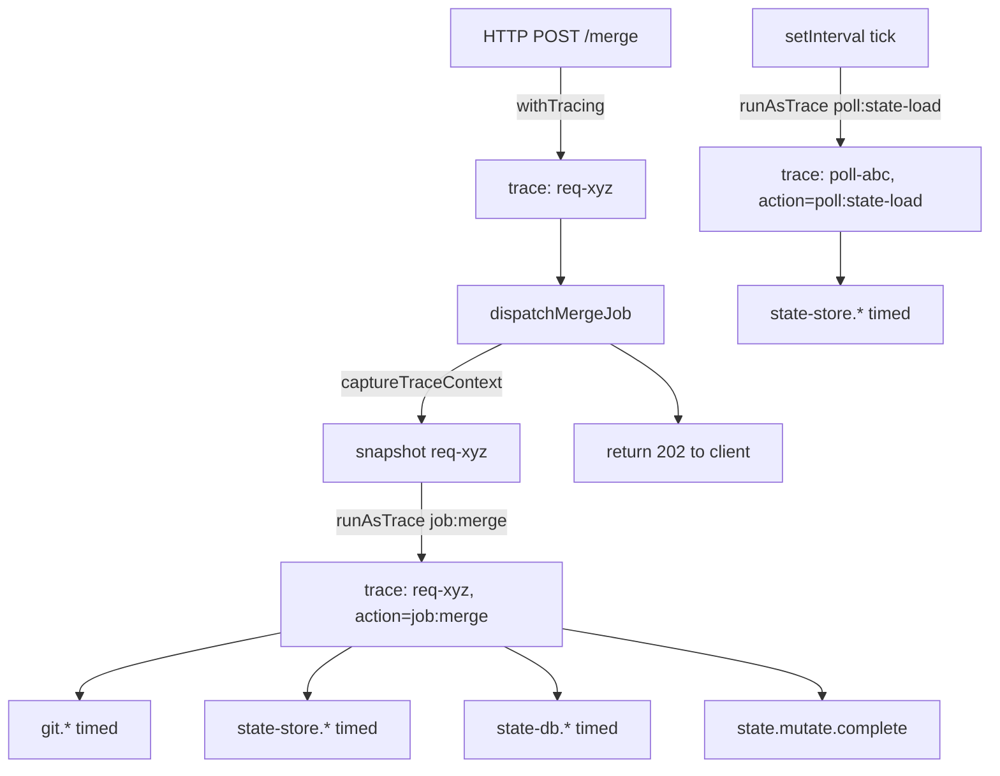

# Design Document: Trace ID Propagation for Performance Aggregation

## Overview

**Purpose**: Make Speedscope's Left Heavy / Sandwich views show real call-stack hotspots by ensuring every `timed()` log entry carries a meaningful `traceId` that links it to its logical unit of work. Today only ~14% of timed entries (sampled) carry a traceId, and those that do are exclusively `request.complete` — so the speedscope export has no parent/child relationships to render.

**Users**: Engineers investigating CC performance (LCP/INP, slow background jobs, polling overhead). The output is the same `timed()` NDJSON stream consumed by `scripts/speedscope-export.ts`.

**Impact**: No behavior change. Adds a single helper (`runAsTrace`) and one-line wrapping at each background entrypoint. No new logging fields, no schema migration, no perf cost beyond an AsyncLocalStorage frame per work unit.

### Goals

1. Every `timed()` entry emitted during a logical unit of work shares the same `traceId` as the operation that initiated it.
2. Background work — periodic polling, dispatched jobs, workflow execution, SDK callbacks, SSE handlers — is grouped under synthetic root traces with a descriptive `action`.
3. Async work dispatched by an HTTP request (e.g. fire-and-forget jobs) inherits that request's `traceId` so all related work folds into one group in Speedscope.
4. Trace coverage is measurable: a CI/manual check that flags any `timed()` entry with `traceId: null`.

### Non-Goals

- Distributed tracing across processes (no OpenTelemetry / W3C trace context export).
- Spans, span IDs, or explicit parent/child wiring. The speedscope exporter infers nesting from time containment within a traceId group — that stays the source of truth.
- Replacing `getTraceContext()` consumers with a different API surface.
- Per-line-of-code instrumentation. Wrapping happens at entrypoint boundaries only.

## Current State

`src/lib/logging/context.ts:20` defines a single `AsyncLocalStorage<TraceContext>`. `createLogger()` reads from it on every `log()` call (`src/lib/logging/logger.ts:249`), so any entry made inside a `runWithTrace()` scope auto-enriches with `traceId`/`action`/etc.

`withTracing()` (`src/lib/logging/tracing.ts:64`) wraps API route handlers, so HTTP-request-initiated work is fully covered. **Nothing else is wrapped.**

Concretely, these entrypoints run **outside** any trace scope and so log `traceId: null`:

| Entrypoint | File | Initiates |
|---|---|---|
| Background job dispatch (merge / commit / resolve-conflicts) | `src/lib/background-jobs.ts:469,552,623` | XState actor execution; downstream git, state-store, notification-db calls |
| SSE GET route | `src/app/api/events/route.ts:12` | Per-connection heartbeat loop + broadcast handling |
| Workflow execution orchestration | `src/lib/workflow-graph/execution-events.ts:32` | Iterations, validators, agent turns |
| Dev-server liveness polling | (search `setInterval` in `src/lib/dev-server-*`) | Periodic exec/probe |
| Periodic state-store loaders | (any `setInterval` calling `state-store.*`) | The `state-store.sessions.findAll`, `conversations.findAll` etc. that dominate the current trace |
| Claude Agent SDK callbacks | `src/lib/prompt.ts` (and queue-message paths) | Tool use, transcript writes, message handlers during streaming |

The local `timed()` in state-store repos (`src/lib/state-store/sessions-repo.ts:496` and siblings) is **correctly wired** — it uses `createLogger().info()` which reads from ALS. It logs `traceId: null` only because nothing has set up a trace scope for the call site. No change needed at the leaf.

## Architecture

### Design Principles

1. **One trace = one logical unit of work.** A unit is "the thing whose total cost you'd want to measure." HTTP request, dispatched job, polling tick, workflow execution, SDK turn — each is a unit.
2. **Inherit when the work is causally linked to a parent unit; synthesize a root otherwise.** A merge job dispatched from `POST /api/.../merge` inherits the request's traceId. A periodic poll tick gets a fresh traceId. A workflow execution gets a fresh traceId tied to its `executionId`.
3. **Wrap at the boundary, not at the leaf.** Every entrypoint gets one wrapping line. No changes to `timed()` call sites or to lib modules.
4. **Action names are flat namespaces.** `request:POST /api/foo`, `job:merge`, `poll:state-load`, `workflow:<id>`, `sdk:turn`. These show up as the root frame name in Speedscope, so they need to be self-describing.

### Mechanics

Two new helpers in `src/lib/logging/context.ts` (extending the existing module):

```typescript
// Capture the current context for later replay across an async boundary.
// Returns the current TraceContext or null if none is active.
export function captureTraceContext(): TraceContext | null;

// Run fn() inside a trace scope. If `inherit` is provided, uses that
// context's traceId/projectName/sessionName/conversationId (replacing action).
// Otherwise mints a fresh traceId. Always sets the supplied `action`.
export function runAsTrace<T>(
  action: string,
  fn: () => T,
  inherit?: TraceContext | null,
): T;
```

`runAsTrace` is the only API new code needs. `runWithTrace` stays as the low-level primitive (used by `withTracing`).

### Wrapping Plan by Entrypoint

#### A. HTTP-dispatched background jobs (inherit)

`dispatchMergeJob` / `dispatchCommitJob` / `dispatchResolveConflictsJob` in `src/lib/background-jobs.ts` are called from within `withTracing()` scopes. They return immediately (202) while the actor runs async. Fix:

```typescript
// At dispatch site, inside the HTTP handler:
const parent = captureTraceContext();
const actor = createActor(machine);
actor.start();
actor.subscribe({
  next: (snapshot) => runAsTrace("job:merge", () => onUpdate(snapshot), parent),
  // ...
});
```

Result: the merge job's `git.*`, `state-store.*`, `state-db.*`, `state.mutate.*` logs all carry the originating request's traceId. In Speedscope, the whole request→job sequence collapses into one stack.

If a job is dispatched outside an HTTP request (startup recovery), `captureTraceContext()` returns null and `runAsTrace` mints a fresh traceId — still grouped, just with no parent linkage.

#### B. Periodic pollers (fresh trace per tick)

Anywhere we have `setInterval(fn, ms)` or a recursive `setTimeout` driving repeated work:

```typescript
setInterval(() => {
  runAsTrace("poll:state-load", () => loadState());
}, intervalMs);
```

Each tick becomes its own trace. Speedscope aggregates across ticks via the frame name (e.g. `state-store.sessions.findAll.timing`), so Sandwich/Left Heavy show the right rollup; the root frame `poll:state-load` shows total polling cost.

Targets (concrete files to identify during implementation):
- Dev-server liveness loop (`src/lib/dev-server-liveness.ts` or similar)
- Any state-store refresh loop (the source of the dominant `state-store.sessions.findAll` / `conversations.findAll` calls in the current logs)
- Stale-job recovery (`recoverStaleJobs` interval if one exists)

#### C. SSE GET handler (per connection lifetime)

`src/app/api/events/route.ts` is currently un-wrapped. Two options, and we should pick (1):

1. **Per-broadcast trace** — wrap the broadcast dispatcher so each `publishSessionStatus()` call runs in a fresh trace (`action: "sse:broadcast:<eventType>"`). This makes each broadcast a discrete unit, which matches how Speedscope wants to aggregate them. The GET handler itself runs in `withTracing` for the initial open and any auth check, then transitions to "listener mode" outside a trace.
2. ~~Per-connection trace — wrap the whole SSE handler in one trace for the connection's lifetime. Bad: connections last hours; one trace would span the whole session and skew aggregation.~~

#### D. Workflow execution (trace per execution)

In `src/lib/workflow-graph/` (graph executor), the top-level `executeWorkflow(definition)` (or equivalent) wraps in `runAsTrace("workflow:" + executionId, ...)`. All actor invocations, validators, prompts, and state writes inherit. Long executions stay as one trace — that's fine: Speedscope serializes traces end-to-end, so a multi-minute workflow becomes one stack and the costly steps surface in Left Heavy.

If executions are too long (>~1 hour of cumulative timed work), revisit and shard per iteration: `action: "workflow:" + executionId + ":iter-" + n`.

#### E. SDK callbacks (trace per conversation turn)

`prompt.ts` calls `query()` from the Claude Agent SDK; the SDK streams messages back via async iteration. Wrap the entire turn:

```typescript
await runAsTrace(`sdk:turn:${conversationId}`, async () => {
  for await (const message of query(...)) {
    await handleMessage(message);  // already async, inherits
  }
}, parent);
```

This is usually already inside an HTTP `withTracing()` scope, so `parent` carries the user's request traceId. If invoked from a job (e.g. autonomous workflow), `parent` carries the job's traceId. Either way: one stack.

#### F. Notification-DB and dev-server-registry helpers

These don't need wrapping at the leaf — they already use `createLogger()` and inherit. They start logging `traceId` correctly as soon as their callers (A–E above) are wrapped.

### Data Flow (after fix)



All five `state-store.*` calls in the job branch share `traceId=req-xyz`; the speedscope exporter groups them, builds a forest by time containment, and Speedscope renders the call stack.

### Coverage Verification

Add a script `scripts/check-trace-coverage.ts`:

```bash
bun scripts/check-trace-coverage.ts                       # report only
bun scripts/check-trace-coverage.ts --since <iso> --fail  # exit 1 if uncovered entries found
```

Output: per-`module`+`message` counts of `traceId === null`. Helps spot any entrypoint we missed. Cheap to run, optional in CI.

## Migration Order

Sequence by impact-per-line-changed:

1. **Add `captureTraceContext` + `runAsTrace` to `src/lib/logging/context.ts`** (≤ 20 lines, no behavior change). Cover with unit tests.
2. **Wrap the dominant pollers** — whatever fires `state-store.sessions.findAll` / `conversations.findAll` on a loop. This alone removes the bulk of `traceId: null` noise from the export.
3. **Wrap background job dispatch** — merge/commit/resolve-conflicts. Removes the second-biggest gap and unlocks real flamegraphs for those flows (which is the actual common debugging case).
4. **Wrap workflow execution** at the executor entrypoint.
5. **Wrap SDK turns** in `prompt.ts`.
6. **Per-broadcast wrap** on SSE publish paths.
7. **Add coverage script** and confirm `traceId: null` counts drop to ~0 (some startup/shutdown code may remain uncovered; that's fine).

Each step is independently shippable and independently improves the speedscope export.

## Validation

After implementation, re-run the speedscope export and confirm:

- `jq -r '.traceEvents | map(select(.ph=="X")) | length' trace.json` matches prior run (no entries lost).
- A POST that dispatches a job now produces ONE group containing `request.complete`, `merge.start`, all `git.*`, all `state-store.*`, `state.mutate.*`, `merge.complete`.
- In Speedscope Left Heavy, root frames are dominated by `request:*`, `job:*`, `poll:*`, `workflow:*`, `sdk:*` — not by the leaf `state-store.*` operations that dominate today.
- Sandwich view's `Total` column for `state-store.sessions.findAll.timing` shows the full app cost (sum across all polls + all request-driven calls), and `Self` matches `Total` (since it has no children of its own). The frames *above* it (its callers in the stack) become visible — that's the diagnostic value we don't have today.

## Tradeoffs & Open Questions

- **Granularity of "trace = unit of work" for long-lived units.** A workflow execution may run for hours and accumulate enormous timed activity. Speedscope's serialized timeline gets long; navigation slows. Mitigation: shard at the iteration boundary if it bites. **Decision deferred** until we hit it in practice.
- **Per-broadcast SSE traces** make every SSE message its own root frame. If broadcast volume is large, this generates many tiny groups — accurate but noisy. **Open**: should we sample, or bucket broadcasts by event type?
- **Should we add a `parentTraceId` field** for jobs that inherit? Today, an inherited job uses the parent's traceId verbatim, so origin is implicit. Adding `parentTraceId` separately would make the relationship explicit at the cost of one more field. **Lean: no, until forensics need it.**
- **Coverage script as test vs. tool.** Could be wired into the existing `test:ai` pipeline by snapshotting a known-good log and asserting `traceId !== null` for known event names. **Lean: tool-only** until the propagation is stable; then optionally promote.
