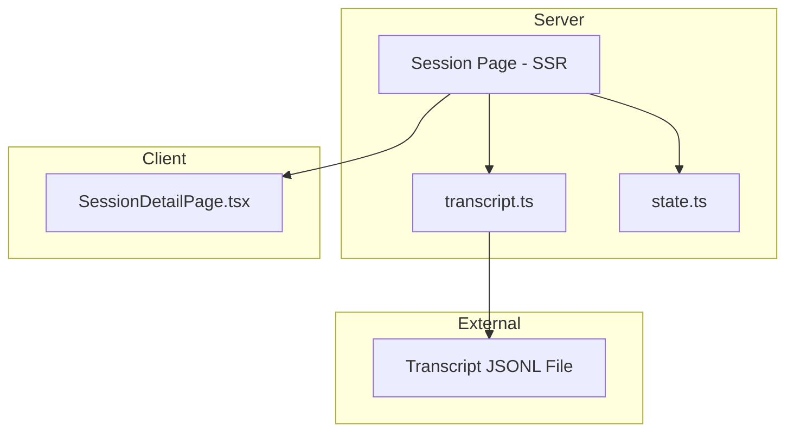
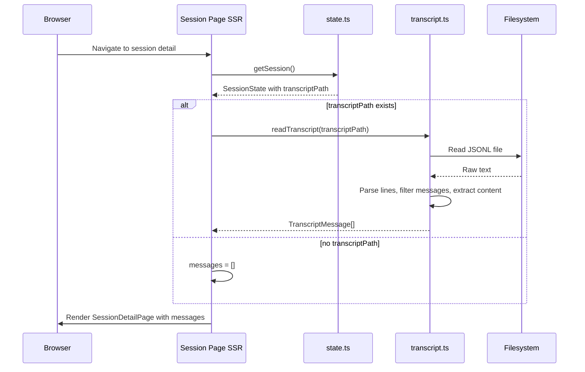

# Technical Design: Transcript Viewer

## Overview

**Purpose**: The Transcript Viewer feature provides conversation observability by parsing Claude Code JSONL transcript files and rendering user/assistant messages within the session detail page.

**Users**: Developers monitoring Claude Code sessions will use this to review conversation history and understand what Claude has been doing.

**Impact**: This is a read-only observability feature that depends on session lifecycle (for session state) and hook integration (for transcript path discovery). It is rendered within the session detail page alongside the diff viewer.

### Goals

- Parse JSONL transcript files into structured user/assistant messages
- Handle both string and content-block array message formats
- Skip malformed lines and non-message events gracefully
- Render conversation with navigation controls and auto-scroll
- Present an empty state when no messages are available

### Non-Goals

- Real-time transcript streaming (page refresh required)
- Transcript pagination or virtual scrolling (entire file loaded)
- Editing or annotating transcript messages
- Searching within transcript content

## Architecture

### Existing Architecture Analysis

The transcript viewer is fully implemented across two layers:

- **`src/lib/transcript.ts`** — Contains `readTranscript()` for JSONL parsing and `extractContent()` for content extraction
- **`src/app/projects/[name]/[session]/page.tsx`** — Server Component that reads transcript and passes messages as props
- **`src/app/projects/[name]/[session]/SessionDetailPage.tsx`** — Client Component rendering conversation with navigation

Key patterns preserved:

- Server-side data loading in page components (SSR)
- Zod `safeParse` for external data validation
- Flat `src/lib/` module structure
- Feature-colocated UI components

### Architecture Pattern & Boundary Map



### Technology Stack

| Layer      | Choice / Version            | Role in Feature                        | Notes                            |
| ---------- | --------------------------- | -------------------------------------- | -------------------------------- |
| Backend    | Next.js 15 Server Component | Reads transcript file during SSR       | `force-dynamic`                  |
| Validation | Zod v4                      | `safeParse` for JSONL entry validation | `transcriptEntrySchema`          |
| Frontend   | React 19 Client Component   | Conversation rendering with navigation | `useRef`, `useEffect` for scroll |
| Storage    | Filesystem                  | JSONL transcript file reading          | UTF-8, line-by-line              |

## System Flows

### Transcript Loading Flow



## Requirements Traceability

| Requirement | Summary                                 | Components        | Interfaces | Flows     |
| ----------- | --------------------------------------- | ----------------- | ---------- | --------- |
| 1.1         | Read file as UTF-8                      | readTranscript    | Filesystem | Loading   |
| 1.2         | Split lines, filter empty               | readTranscript    | —          | Loading   |
| 1.3         | Return empty for non-existent file      | readTranscript    | —          | Loading   |
| 1.4         | Return empty for empty file             | readTranscript    | —          | Loading   |
| 2.1         | Parse JSON, validate with safeParse     | readTranscript    | Zod        | Loading   |
| 2.2         | Skip malformed JSON                     | readTranscript    | —          | Loading   |
| 2.3         | Skip failed Zod validation              | readTranscript    | —          | Loading   |
| 3.1         | Process user/assistant type entries     | readTranscript    | —          | Loading   |
| 3.2         | Fallback to message.role                | readTranscript    | —          | Loading   |
| 3.3         | Skip non-message entries                | readTranscript    | —          | Loading   |
| 4.1         | Trim string content                     | extractContent    | —          | Loading   |
| 4.2         | Extract text blocks, join with newlines | extractContent    | —          | Loading   |
| 4.3         | Skip non-text content blocks            | extractContent    | —          | Loading   |
| 4.4         | Skip empty content messages             | extractContent    | —          | Loading   |
| 4.5         | Preserve timestamp or null              | readTranscript    | —          | Loading   |
| 5.1         | Return in file order                    | readTranscript    | —          | Loading   |
| 6.1         | Render messages with role and content   | SessionDetailPage | React      | Rendering |
| 6.2         | Empty state with guidance               | SessionDetailPage | React      | Rendering |
| 6.3         | Navigation with position counter        | SessionDetailPage | React      | Rendering |
| 6.4         | Previous/next navigation                | SessionDetailPage | React      | Rendering |
| 6.5         | Disable buttons at boundaries           | SessionDetailPage | React      | Rendering |
| 6.6         | Auto-scroll on new messages             | SessionDetailPage | React      | Rendering |

## Components and Interfaces

| Component         | Domain/Layer           | Intent                              | Req Coverage | Key Dependencies                  | Contracts |
| ----------------- | ---------------------- | ----------------------------------- | ------------ | --------------------------------- | --------- |
| readTranscript    | Domain / transcript.ts | Parse JSONL file into messages      | 1.1–5.1      | Filesystem (P0), Schemas (P1)     | Service   |
| extractContent    | Domain / transcript.ts | Extract text from message content   | 4.1–4.4      | None                              | Service   |
| Session Page      | SSR / page.tsx         | Load transcript data for rendering  | 1.1          | transcript.ts (P0), state.ts (P0) | —         |
| SessionDetailPage | UI / client component  | Render conversation with navigation | 6.1–6.6      | None (props-driven)               | —         |

### Domain Layer

#### readTranscript

| Field        | Detail                                                         |
| ------------ | -------------------------------------------------------------- |
| Intent       | Read JSONL transcript file and extract user/assistant messages |
| Requirements | 1.1, 1.2, 1.3, 1.4, 2.1, 2.2, 2.3, 3.1, 3.2, 3.3, 4.5, 5.1     |

##### Service Interface

```typescript
function readTranscript(transcriptPath: string): Promise<TranscriptMessage[]>;
```

- Preconditions: None (handles missing files gracefully)
- Postconditions: Returns messages in file order; empty array if no valid messages
- Error handling: Malformed lines and invalid entries silently skipped

#### extractContent

| Field        | Detail                                                 |
| ------------ | ------------------------------------------------------ |
| Intent       | Extract text from string or content-block array format |
| Requirements | 4.1, 4.2, 4.3, 4.4                                     |

##### Service Interface

```typescript
function extractContent(
  content: string | readonly ContentBlock[] | undefined,
): string | null;
```

- Preconditions: None
- Postconditions: Returns trimmed text or null if empty/missing
- Invariants: Pure function, no side effects

## Data Models

### Domain Model

**TranscriptMessage** (output):

```typescript
interface TranscriptMessage {
  role: "user" | "assistant";
  content: string;
  timestamp: string | null;
}
```

**TranscriptEntry** (input schema):

```typescript
const transcriptEntrySchema = z.object({
  type: z.string().optional(),
  message: z
    .object({
      role: z.string().optional(),
      content: z.union([z.string(), z.array(contentBlockSchema)]).optional(),
    })
    .optional(),
  timestamp: z.string().optional(),
});
```

**ContentBlock** (input schema):

```typescript
const contentBlockSchema = z.object({
  type: z.string(),
  text: z.string().optional(),
});
```

## Error Handling

### Error Strategy

- **Defensive parsing**: `safeParse` + try/catch for each line prevents cascade failures
- **Graceful degradation**: Missing files or empty files return empty arrays, never throw
- **Silent skip**: Malformed lines, non-message events, and empty content are silently skipped

## Testing Strategy

### Unit Tests (existing — `transcript.test.ts`)

- Non-existent file returns empty array
- String content parsing (user and assistant messages)
- Content block array parsing (text blocks only)
- Non-message entry filtering (tool_use, permission)
- Malformed JSON line skipping
- Empty/whitespace content skipping
- Missing timestamp handling
- Empty file handling

### Coverage Assessment

Tests cover all 7 major scenarios for `readTranscript`. UI rendering tests (Requirement 6) are not present but are lower priority given the feature-colocated component pattern.
