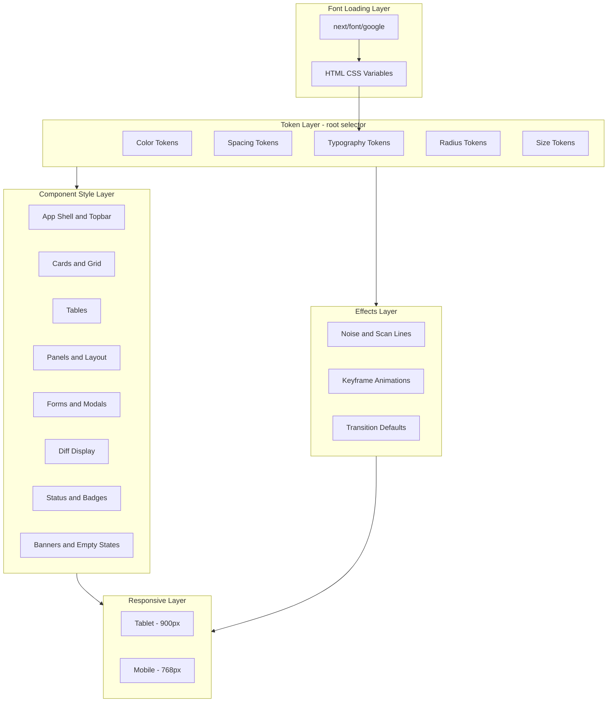

# Design Document — UI Design System

## Overview

**Purpose**: The UI Design System formalizes the existing CC visual language — design tokens, component patterns, typography rules, color semantics, layout architecture, responsive behaviors, and atmospheric effects — into a spec-driven single source of truth that replaces the legacy `memory-bank/design-system.md`.

**Users**: Developers implementing or extending CC UI features reference this spec to ensure visual consistency across all views.

**Impact**: Replaces the existing design system document (which had drifted from the CSS implementation) with a validated, requirements-traced specification. No code changes to `globals.css` are required — the design system is already fully implemented.

### Goals

- Formalize the existing design system as a testable specification
- Provide a complete component and token reference for all CC UI development
- Ensure the spec accurately reflects the current CSS implementation
- Replace `memory-bank/design-system.md` with the spec as the canonical reference

### Non-Goals

- Migrating from plain CSS to CSS Modules, Tailwind, or styled-components
- Splitting `globals.css` into multiple files
- Adding new design tokens or components not already implemented
- Building a component library or Storybook

## Design Language Reference

This section captures the design intent, usage contracts, and decision rules that CSS cannot express. It replaces `memory-bank/design-system.md` as the canonical reference for the CC visual identity.

### Vision: "Ground Control"

The aesthetic is **mission control for code** — a dark, high-density interface that feels like monitoring a fleet of autonomous coding agents from a command center. It is utilitarian but not cold; the electric cyan accents and subtle atmospheric effects (noise grain, scan lines) give it character without sacrificing information density.

Key qualities:

- **Data-dense**: mono-spaced metadata, compact strips, no wasted whitespace
- **Dark-first**: deep blue-black base, never pure black (#06090f, not #000000)
- **Glowing accents**: cyan as the dominant accent with colored glow halos — not flat color
- **Atmospheric texture**: subtle SVG noise overlay + CSS scan-line effect on `body` pseudo-elements; these should be barely perceptible
- **Restrained motion**: staggered reveals on page load, smooth transitions on interactions, pulsing status dots — never gratuitous animation

### Design Principles

1. **Vertical space is sacred.** The session detail view must maximize content area. Every pixel of chrome must earn its place. Controls live in the topbar or inline panel headers — never in standalone toolbars that consume full rows.

2. **Context-aware topbar.** The topbar right side swaps content based on the current page (controlled by `data-page` attribute on `.app`). Non-detail pages show global status; detail pages show session-specific controls (layout switcher, refresh, delete). The topbar is always the sole persistent navigation surface — never add secondary navigation bars, tab strips, or view switchers below it.

3. **Information hierarchy through typography.** Three fonts, three roles, no exceptions:
   - **Display** (`Anybody`): page titles, logo, modal titles, empty-state titles only
   - **Mono** (`Geist Mono`): everything else — buttons, labels, nav, metadata, code, tables, badges, inputs, diffs, breadcrumbs, status indicators, timestamps, counters
   - **Body** (`Manrope`): conversation message prose content only
   - Violating these assignments breaks the visual identity.

4. **Progressive density.** Information density increases as the user drills deeper:
   - **Projects list** — spacious: cards with breathing room, generous padding, grid layout
   - **Sessions list** — moderate: table rows, compact headers, inline actions
   - **Session detail** — maximum density: ultra-compact info strip (~28px), full-bleed panels, minimal chrome

5. **No redundant information.** If the breadcrumb shows the session name, no heading repeats it. If status is visible in the topbar, it does not also appear in the panel. Each datum appears once.

6. **Semantic color, not decorative color.** Color conveys meaning:
   - **Cyan** = active, primary, running, interactive focus
   - **Green** = ready, success, diff additions
   - **Amber** = warning, user-authored content
   - **Red** = danger, error, diff deletions
   - These meanings are consistent everywhere. Using a color outside its semantic role is a design violation.

7. **Responsive, not stripped down.** Mobile is a first-class experience, not a degraded desktop view. Every feature is accessible on every screen size; nothing is hidden or removed. Desktop uses density and side-by-side panels; mobile uses vertical stacking and panel switching with full-width controls.

### Elevation Model

The five background levels form a visual depth stack. Use the correct level for each context:

| Level | Token | When to use |
|-------|-------|-------------|
| Void | `--bg-void` | Page background — the deepest layer, only on `body` |
| Base | `--bg-base` | Inset/recessed areas — input backgrounds, prompt input area, code block backgrounds |
| Surface | `--bg-surface` | Default component surfaces — cards, panels, topbar (with alpha), modals |
| Raised | `--bg-raised` | Elevated elements — tooltips, file headers, branch chips, hover states on base |
| Hover | `--bg-hover` | Hover states on surface-level elements — card hover, button hover, row hover |

Depth increases from void → hover. Never skip levels (e.g., don't use raised for a card that should be surface).

### Border Intensity Guide

| Level | Token | When to use |
|-------|-------|-------------|
| Subtle | `--border-subtle` | Default borders on panels, cards, file sections, info strip separators |
| Default | `--border-default` | Input borders, table header borders, button borders, topbar divider |
| Strong | `--border-strong` | Hover/focused borders — appears on interaction, never at rest |

### Glow Effect Semantics

Glow effects (using `box-shadow`, `background` tint, or `text-shadow`) are not decorative — they reinforce semantic color meaning:

- **Cyan glow** (`--cyan-glow`, `--cyan-glow-strong`): Primary action hover/focus, active states, logo text-shadow, running status dot halos
- **Green glow** (`--green-glow`): Ready/success state dot halos
- **Amber glow** (`--amber-glow`): Warning banner backgrounds
- **Red glow** (`--red-glow`): Danger button hover backgrounds

Apply as `box-shadow` on dots/buttons, `background` tint on banners/badges, and `text-shadow` on the logo.

### Typography Patterns Quick Reference

These recipes are the canonical typographic treatments. Use them consistently:

| Pattern | Font | Weight | Size | Extras |
|---------|------|--------|------|--------|
| Page title | Display | 800 | 2.4rem | -0.03em tracking, 1.1 line-height |
| Logo | Display | 800 | 1.1rem | Cyan color, text-shadow glow |
| Modal title | Display | 700 | 1.2rem | — |
| Empty-state title | Display | 700 | 1.1rem | Secondary color |
| Section/panel label | Mono | 600 | 0.72rem | Uppercase, 0.08em tracking |
| Metadata label (tiny) | Mono | 600 | 0.58–0.65rem | Uppercase, 0.06–0.1em tracking |
| Button text | Mono | 500 | 0.78rem / 0.72rem (sm) | — |
| Data values | Mono | 400–600 | varies | — |
| Conversation prose | Body | 400 | 0.9rem | 1.65 line-height |
| Inline code | Mono | — | 0.82rem | Raised bg, cyan color, 2px 6px padding |
| Code blocks | Mono | — | 0.8rem | 1.55 line-height, base bg |
| Diff content | Mono | — | 0.75rem | 1.7 line-height |

### Navigation Philosophy

The breadcrumb in the topbar is the sole navigation mechanism. No other navigation bars, tab strips, or view switchers exist in the application (the mobile panel tab switcher is a content switcher within a view, not navigation).

Breadcrumb format by depth:
- Projects: `projects`
- Sessions: `projects / {project-name}`
- Detail: `projects / {project-name} / {session-name}`

Each segment is a clickable link. Separator characters (`/`) are in tertiary color. The deepest segment (session name) is visually emphasized (brighter, bolder via `.bc-session`). On mobile, intermediate segments are hidden — only a back-arrow + current segment name is shown.

### Responsive Philosophy

Three tiers, each with a clear role:

- **Desktop (>900px)**: Full experience — side-by-side panels, table layouts, compact controls, hover interactions, tooltip labels, `30px` icon buttons
- **Tablet (768–900px)**: Transitional — split layouts stack vertically, grids collapse, spacing tightens, but controls remain desktop-sized
- **Mobile (≤768px)**: Transformed — single panel with tab switcher, bottom action bar, bottom-sheet modals, `44px` touch targets on all interactive elements, prompt input pinned to viewport bottom, session info strip collapses to expandable summary

The mobile experience does not remove features — it repositions and resizes them. Every control, action, and information display available on desktop is also available on mobile through adapted UI patterns.

### Implementation Rules

These rules cannot be expressed in CSS and must be enforced through code review:

1. **Token-only values**: Never hard-code hex colors, pixel sizes, or font-family names in component styles. Always reference `--bg-*`, `--border-*`, `--text-*`, `--space-*`, `--radius-*`, `--font-*` tokens.
2. **Font variable indirection**: Components reference semantic aliases (`--font-display`, `--font-body`, `--font-mono`). Never reference raw `--font-anybody`, `--font-manrope`, `--font-geist-mono` variables directly.
3. **Class naming**: All CSS classes use kebab-case BEM-style names (e.g., `project-card-header`, `topbar-breadcrumb`, `diff-file-stat`).
4. **No secondary navigation**: The topbar + breadcrumb is the only navigation surface. Do not add nav bars, tab strips, or sidebar navigation.
5. **Layout state via data attributes**: Use `data-page`, `data-layout`, `data-mobile-panel` attributes on parent elements for CSS-driven state switching. Do not use inline styles or conditional class concatenation for layout mode changes.
6. **Diff collapse state**: Scoped per-session. When file/change navigation buttons target a collapsed section, auto-expand it before scrolling.
7. **Layout persistence**: Layout switcher selection persists per-session (localStorage or URL param).
8. **No hover-only controls**: All interactive controls (buttons, actions, toggles) must be visible at all times. Never hide controls behind hover states using `opacity: 0`, `visibility: hidden`, or `display: none` with hover-triggered reveal. Hover-gated controls are inaccessible on touch devices, undiscoverable for new users, and fail keyboard-only navigation. Hover effects should be limited to visual feedback (background color change, border highlight) on already-visible elements.

## Architecture

### Existing Architecture Analysis

The design system is already fully implemented across three files:

| File                  | Role                                                        | Lines  |
| --------------------- | ----------------------------------------------------------- | ------ |
| `src/app/globals.css` | All tokens, component styles, responsive rules, animations  | ~1859  |
| `src/app/layout.tsx`  | Font loading via `next/font/google`, CSS variable injection | ~44    |
| `src/types/index.ts`  | TypeScript type for `LayoutMode` union                      | 1 line |

Existing patterns to preserve:

- **Single CSS file** with section-header organization (no CSS modules)
- **CSS custom properties** on `:root` for all design tokens
- **Two-tier font variables**: `next/font` sets `--font-anybody` etc. on `<html>`; `globals.css` maps to semantic aliases `--font-display`, `--font-body`, `--font-mono`
- **Data attribute selectors** for state-driven styling (`data-page`, `data-layout`, `data-mobile-panel`)
- **Plain CSS class names** in kebab-case BEM-style (no utility classes, no scoped modules)
- **No external CSS dependencies** (aligned with steering's minimal dependency principle)

### Architecture Pattern & Boundary Map



**Architecture Integration**:

- **Selected pattern**: Single-file CSS with layered internal organization (see `research.md` for alternatives evaluated)
- **Domain boundaries**: Token layer provides all values; component layer consumes tokens; responsive layer overrides component layer
- **Existing patterns preserved**: All current CSS patterns maintained without modification
- **Steering compliance**: Minimal dependencies, no external CSS frameworks

### Technology Stack

| Layer    | Choice / Version                              | Role in Feature                                 | Notes                                  |
| -------- | --------------------------------------------- | ----------------------------------------------- | -------------------------------------- |
| Frontend | Next.js 15 / React 19                         | App Router, `next/font/google` for font loading | Existing                               |
| Styling  | Plain CSS custom properties                   | Design tokens and component styles              | Single file: `globals.css`             |
| Types    | TypeScript (strict)                           | `LayoutMode` type, component props              | Existing types in `src/types/index.ts` |
| Fonts    | Anybody, Manrope, Geist Mono via Google Fonts | Display, body, mono roles                       | Loaded in `layout.tsx`                 |

## Requirements Traceability

| Requirement | Summary                    | Component                | File                                                            |
| ----------- | -------------------------- | ------------------------ | --------------------------------------------------------------- |
| 1.1–1.7     | Token architecture         | DesignTokens             | `globals.css` `:root` block                                     |
| 2.1–2.5     | Semantic color system      | DesignTokens             | `globals.css` `:root` block                                     |
| 3.1–3.7     | Typography contract        | DesignTokens, FontLoader | `globals.css` `:root`, `layout.tsx`                             |
| 4.1–4.8     | Button variants            | ButtonStyles             | `globals.css` `.btn` section                                    |
| 5.1–5.6     | Status indicators          | StatusStyles             | `globals.css` `.status-indicator`, `.session-status` sections   |
| 6.1–6.6     | Card component             | CardStyles               | `globals.css` `.project-card` section                           |
| 7.1–7.2     | Badge/pill                 | BadgeStyles              | `globals.css` `.project-badge` section                          |
| 8.1–8.5     | Modal/overlay              | ModalStyles              | `globals.css` `.modal` section                                  |
| 9.1–9.5     | Form elements              | FormStyles               | `globals.css` `.form-*` section                                 |
| 10.1–10.4   | Atmospheric effects        | AtmosphericEffects       | `globals.css` `body::before`, `body::after`, scrollbar          |
| 11.1–11.5   | Animation library          | AnimationLibrary         | `globals.css` `@keyframes`, `.stagger-in`                       |
| 12.1–12.8   | App shell/navigation       | AppShell                 | `globals.css` `.app`, `.topbar`, `.main` sections               |
| 13.1–13.5   | Responsive breakpoints     | ResponsiveRules          | `globals.css` `@media` blocks                                   |
| 14.1–14.7   | Panel/layout system        | PanelLayout              | `globals.css` `.session-detail-layout`, `.session-content-area` |
| 15.1–15.4   | Session info strip         | InfoStripStyles          | `globals.css` `.session-info-strip` section                     |
| 16.1–16.8   | Conversation panel         | ConversationStyles       | `globals.css` `.prompt-panel`, `.message`, `.prompt-input-area` |
| 17.1–17.6   | Layout switcher            | LayoutSwitcherStyles     | `globals.css` `.layout-switcher`, `LayoutSwitcher.tsx`          |
| 18.1–18.6   | Mobile bottom bar          | MobileBottomBar          | `globals.css` `.mobile-bottom-bar` section                      |
| 19.1–19.6   | Table component            | TableStyles              | `globals.css` `.sessions-table` section                         |
| 20.1–20.6   | Diff display               | DiffStyles               | `globals.css` `.diff-*` sections                                |
| 21.1–21.3   | Banner components          | BannerStyles             | `globals.css` `.hooks-banner`, `.running-indicator`             |
| 22.1–22.2   | Empty state                | EmptyStateStyles         | `globals.css` `.empty-state` section                            |
| 23.1–23.6   | Implementation constraints | Cross-cutting            | `layout.tsx`, `globals.css`, steering docs                      |

## Components and Interfaces

All components in this design system are CSS-only — they define visual contracts through class names, CSS custom properties, and data attribute selectors. There are no service interfaces, API contracts, or event contracts.

| Component            | Domain        | Intent                                                | Req Coverage | Key Dependencies                         | Contracts |
| -------------------- | ------------- | ----------------------------------------------------- | ------------ | ---------------------------------------- | --------- |
| DesignTokens         | Token Layer   | Define all visual primitives as CSS custom properties | 1, 2, 3      | FontLoader (P0)                          | State     |
| FontLoader           | Token Layer   | Load Google Fonts and inject CSS variables            | 3.1, 3.2     | next/font/google (P0)                    | State     |
| AppShell             | Structural    | Define app frame: topbar, main, data-page switching   | 12           | DesignTokens (P0)                        | State     |
| ButtonStyles         | Component     | Define all button variants and interactions           | 4            | DesignTokens (P0)                        | —         |
| StatusStyles         | Component     | Define status indicator dots and labels               | 5            | DesignTokens (P0), AnimationLibrary (P1) | —         |
| CardStyles           | Component     | Define project card and grid layout                   | 6, 7         | DesignTokens (P0)                        | —         |
| ModalStyles          | Component     | Define modal overlay, card, confirm dialog            | 8, 9         | DesignTokens (P0), AnimationLibrary (P1) | —         |
| AtmosphericEffects   | Effects       | Define noise, scan lines, frosted glass, scrollbar    | 10           | DesignTokens (P0)                        | —         |
| AnimationLibrary     | Effects       | Define keyframe animations and transition defaults    | 11           | DesignTokens (P0)                        | —         |
| PanelLayout          | Structural    | Define session detail grid and layout modes           | 14, 15       | DesignTokens (P0), AppShell (P0)         | State     |
| ConversationStyles   | Component     | Define message display, prompt input, navigation      | 16           | DesignTokens (P0), AnimationLibrary (P1) | —         |
| LayoutSwitcherStyles | Component     | Define layout mode button bar                         | 17           | DesignTokens (P0)                        | —         |
| MobileBottomBar      | Structural    | Define mobile-only bottom action bar                  | 18           | DesignTokens (P0), ResponsiveRules (P0)  | —         |
| TableStyles          | Component     | Define session table and row patterns                 | 19           | DesignTokens (P0)                        | —         |
| DiffStyles           | Component     | Define diff lines, file headers, toolbar              | 20           | DesignTokens (P0)                        | —         |
| BannerStyles         | Component     | Define hooks banner and running indicator             | 21           | DesignTokens (P0), AnimationLibrary (P1) | —         |
| EmptyStateStyles     | Component     | Define empty state centered layout                    | 22           | DesignTokens (P0)                        | —         |
| ResponsiveRules      | Cross-cutting | Define breakpoint overrides for all components        | 13           | All component styles (P0)                | —         |

### Token Layer

#### DesignTokens

| Field        | Detail                                                               |
| ------------ | -------------------------------------------------------------------- |
| Intent       | Define all visual primitives as CSS custom properties on `:root`     |
| Requirements | 1.1, 1.2, 1.3, 1.4, 1.5, 1.6, 1.7, 2.1, 2.2, 2.3, 2.4, 2.5, 3.3, 3.7 |

**Responsibilities & Constraints**

- Single source of truth for all visual values (colors, spacing, radii, typography, sizing)
- All tokens defined on `:root` selector — no per-component token scoping
- Components must reference tokens exclusively; no hard-coded values

**Dependencies**

- Inbound: FontLoader — provides raw font CSS variables (P0)
- Outbound: All component styles consume tokens

**Contracts**: State [x]

##### State Management

The token layer maintains state through CSS custom properties:

```
:root {
  /* Background elevation scale (5 levels) */
  --bg-void, --bg-base, --bg-surface, --bg-raised, --bg-hover

  /* Border intensity scale (3 levels) */
  --border-subtle, --border-default, --border-strong

  /* Accent families (4 × base/dim/glow) */
  --cyan, --cyan-dim, --cyan-glow, --cyan-glow-strong, --cyan-glow-text
  --amber, --amber-dim, --amber-glow
  --green, --green-dim, --green-glow
  --red, --red-dim, --red-glow

  /* Text hierarchy (4 levels) */
  --text-primary, --text-secondary, --text-tertiary, --text-inverse

  /* Typography (semantic aliases) */
  --font-display: var(--font-anybody)
  --font-body: var(--font-manrope)
  --font-mono: var(--font-geist-mono)

  /* Spacing scale (7 steps) */
  --space-xs through --space-3xl

  /* Radii (3 sizes) */
  --radius-sm, --radius-md, --radius-lg

  /* Layout constants */
  --topbar-height: 56px
}
```

**Implementation Notes**

- The two-tier font variable indirection (raw → semantic) is intentional: `next/font` sets raw variables on `<html>`, `:root` maps them to semantic names
- Exact hex/rgba values are specified in requirements 1.2, 1.3, 2.1, 2.3 and must match precisely

#### FontLoader

| Field        | Detail                                                                 |
| ------------ | ---------------------------------------------------------------------- |
| Intent       | Load three Google Fonts and inject CSS variables onto the HTML element |
| Requirements | 3.1, 3.2, 23.1                                                         |

**Responsibilities & Constraints**

- Load Anybody (400, 600, 800), Manrope (300–800), Geist Mono (300–700) via `next/font/google`
- Set CSS variables `--font-anybody`, `--font-manrope`, `--font-geist-mono` on `<html>` className
- Use `display: "swap"` for all fonts

**Dependencies**

- External: `next/font/google` — font loading and optimization (P0)

**Implementation Notes**

- Located in `src/app/layout.tsx` — already correctly implemented
- No changes needed; this component documents the existing pattern

### Structural Layer

#### AppShell

| Field        | Detail                                                                                   |
| ------------ | ---------------------------------------------------------------------------------------- |
| Intent       | Define the application frame with topbar, main content, and page-level context switching |
| Requirements | 12.1, 12.2, 12.3, 12.4, 12.5, 12.6, 12.7, 12.8                                           |

**Responsibilities & Constraints**

- `.app` flex column with `min-height: 100vh`
- `data-page` attribute drives topbar content visibility (CSS selectors toggle `.topbar-status-default` vs `.topbar-status-session`)
- Topbar is sticky at `top: 0`, `z-index: 100`, with frosted-glass effect
- Breadcrumb is the sole navigation mechanism — no secondary nav bars
- `.main` fills remaining viewport with appropriate padding per page type

**Dependencies**

- Inbound: DesignTokens — all visual values (P0)

**Contracts**: State [x]

##### State Management

State driven by `data-page` attribute on `.app`:

| `data-page`  | Topbar Right Side                           | Main Padding            |
| ------------ | ------------------------------------------- | ----------------------- |
| `"projects"` | Global status (`.topbar-status-default`)    | `--space-lg`            |
| `"sessions"` | Global status (`.topbar-status-default`)    | `--space-lg`            |
| `"detail"`   | Session controls (`.topbar-status-session`) | `--space-md --space-lg` |

#### PanelLayout

| Field        | Detail                                                                     |
| ------------ | -------------------------------------------------------------------------- |
| Intent       | Define the session detail grid and four layout modes for panel arrangement |
| Requirements | 14.1, 14.2, 14.3, 14.4, 14.5, 14.6, 14.7, 15.1, 15.2, 15.3, 15.4           |

**Responsibilities & Constraints**

- `.session-detail-layout`: two-row grid (auto + remaining viewport)
- `.session-content-area`: grid with `data-layout` attribute controlling column arrangement
- Panel visibility toggled via `display: none` on hidden panels
- Layout mode persisted per-session

**Dependencies**

- Inbound: DesignTokens (P0), AppShell (P0)

**Contracts**: State [x]

##### State Management

State driven by `data-layout` attribute on `.session-content-area`:

| `data-layout`    | Grid Columns | Panel Visibility    |
| ---------------- | ------------ | ------------------- |
| `"default"`      | `1fr 420px`  | Both visible        |
| `"split"`        | `1fr 1fr`    | Both visible        |
| `"conversation"` | `1fr`        | Diff hidden         |
| `"diff"`         | `1fr`        | Conversation hidden |

Mobile override: `data-mobile-panel` on `.app` controls panel switching at ≤768px:

| `data-mobile-panel` | Visible Panel     |
| ------------------- | ----------------- |
| `"chat"`            | Conversation only |
| `"diff"`            | Diff only         |

TypeScript type for layout mode (existing):

```typescript
type LayoutMode = "conversation" | "default" | "split" | "diff";
```

#### MobileBottomBar

| Field        | Detail                                                                  |
| ------------ | ----------------------------------------------------------------------- |
| Intent       | Provide a fixed bottom action bar on mobile for session-detail controls |
| Requirements | 18.1, 18.2, 18.3, 18.4, 18.5, 18.6                                      |

**Responsibilities & Constraints**

- Fixed at `bottom: 0`, `56px` height, frosted-glass background
- Visible only at ≤768px (`display: none` on desktop)
- Contains mobile panel tabs (Chat/Diff) and action buttons
- Respects `safe-area-inset-bottom` for notched devices
- Detail page adds bottom padding to `.main` to prevent content obscurement

**Dependencies**

- Inbound: DesignTokens (P0), ResponsiveRules (P0)

### Component Layer

Components in this layer are presentational CSS — they define visual contracts through class names and pseudo-elements. Each follows the same pattern: base styles at desktop, overrides at tablet/mobile breakpoints.

#### ButtonStyles

| Field        | Detail                                                         |
| ------------ | -------------------------------------------------------------- |
| Intent       | Define all button variants, sizes, and hover/tooltip behaviors |
| Requirements | 4.1, 4.2, 4.3, 4.4, 4.5, 4.6, 4.7, 4.8                         |

**Implementation Notes**

- Base `.btn`: mono font, `--border-default`, `--bg-surface`, `150ms ease` transition
- Variants: `.btn-primary` (cyan fill), `.btn-danger` (red outline), default (surface)
- Sizes: default (`10px 18px`), `.btn-sm` (`6px 12px`, mobile: `44px` min-height)
- `.btn-icon-only`: `30px` desktop, `44px` mobile; tooltip via `::after` pseudo-element with `data-tooltip`

#### StatusStyles

| Field        | Detail                                                                  |
| ------------ | ----------------------------------------------------------------------- |
| Intent       | Define status indicator dots, labels, and session-table status variants |
| Requirements | 5.1, 5.2, 5.3, 5.4, 5.5, 5.6                                            |

**Implementation Notes**

- Topbar `.status-dot`: `7px`, `pulse-dot` at `2.5s`
- Session table `.session-status .dot`: `6px`, running pulse at `1.5s`
- Mobile: labels hidden via `font-size: 0`, dots enlarged to `8px`

#### CardStyles

| Field        | Detail                                                                         |
| ------------ | ------------------------------------------------------------------------------ |
| Intent       | Define project card surface, hover effects, grid layout, and content structure |
| Requirements | 6.1, 6.2, 6.3, 6.4, 6.5, 6.6                                                   |

**Implementation Notes**

- Card: `--bg-surface`, `--border-subtle`, `--radius-lg`, hover lifts and reveals cyan gradient `::before`
- Grid: `auto-fill`, `minmax(340px, 1fr)`, single-column at ≤900px
- Contents: `.project-name`, `.project-badge`, `.project-path`, `.project-stats`

#### BadgeStyles

| Field        | Detail                                                     |
| ------------ | ---------------------------------------------------------- |
| Intent       | Define pill-shaped badges with active/idle semantic states |
| Requirements | 7.1, 7.2                                                   |

**Implementation Notes**

- `border-radius: 100px`, mono `0.68rem`, 600 weight
- `.active`: cyan glow background + text; `.idle`: neutral gray

#### ModalStyles

| Field        | Detail                                                        |
| ------------ | ------------------------------------------------------------- |
| Intent       | Define modal overlay, card, confirm dialog, and form elements |
| Requirements | 8.1, 8.2, 8.3, 8.4, 8.5, 9.1, 9.2, 9.3, 9.4, 9.5              |

**Implementation Notes**

- Overlay: `rgba(6,9,15,0.8)`, `backdrop-filter: blur(8px)`, `fadeIn` 0.15s
- Card: `480px` max-width, `slideUp` 0.2s; confirm: `400px` max-width
- Mobile: bottom sheet with `slideUpSheet` 0.25s, `safe-area-inset-bottom`
- Form inputs: `--bg-base`, cyan focus ring, mono font

#### ConversationStyles

| Field        | Detail                                                                         |
| ------------ | ------------------------------------------------------------------------------ |
| Intent       | Define message display, code blocks, message navigation, and prompt input area |
| Requirements | 16.1, 16.2, 16.3, 16.4, 16.5, 16.6, 16.7, 16.8                                 |

**Implementation Notes**

- Messages: user role in amber, assistant in cyan, assistant content has `2px` left border
- Code: inline (`--cyan`, `--bg-raised`), blocks (`--bg-base`, `--border-subtle`)
- Nav: `20px` buttons flanking counter (mobile: `44px`)
- Prompt: textarea + `48px` send button; busy state: `pulse-border`; mobile: `position: sticky; bottom: 0`

#### LayoutSwitcherStyles

| Field        | Detail                                           |
| ------------ | ------------------------------------------------ |
| Intent       | Define the layout mode button bar with SVG icons |
| Requirements | 17.1, 17.2, 17.3, 17.4, 17.5, 17.6               |

**Implementation Notes**

- Container: `3px` padding, `--bg-surface`, `--border-subtle`
- Buttons: `32×26px`, active: `--cyan` bg; tooltips via `::after`
- Mobile: hidden from topbar; replaced by `.mobile-panel-tabs` in bottom bar
- TypeScript component exists at `src/app/projects/[name]/[session]/LayoutSwitcher.tsx`

#### TableStyles

| Field        | Detail                                                               |
| ------------ | -------------------------------------------------------------------- |
| Intent       | Define session table headers, rows, cells, and column content styles |
| Requirements | 19.1, 19.2, 19.3, 19.4, 19.5, 19.6                                   |

**Implementation Notes**

- Full-width, `border-collapse: collapse`
- Headers: tiny uppercase mono, `--text-tertiary`; rows: clickable, hover to `--bg-surface`
- Session name: mono 600; branch: chip with `--bg-raised`; time: `0.78rem` mono
- Mobile: hide columns 4–5, reduce padding

#### DiffStyles

| Field        | Detail                                                          |
| ------------ | --------------------------------------------------------------- |
| Intent       | Define diff lines, file headers, toolbar, and collapse behavior |
| Requirements | 20.1, 20.2, 20.3, 20.4, 20.5, 20.6                              |

**Implementation Notes**

- Lines: `3px` left border; `.add` green, `.remove` red, `.context` dim, `.hunk-header` cyan
- File headers: sticky, clickable collapse, chevron rotation
- Toolbar: `22px` nav buttons (mobile: `44px`), groups separated by `1px` lines
- Mobile: toolbar wraps, buttons enlarged

#### BannerStyles

| Field        | Detail                                            |
| ------------ | ------------------------------------------------- |
| Intent       | Define hooks warning banner and running indicator |
| Requirements | 21.1, 21.2, 21.3                                  |

**Implementation Notes**

- Hooks banner: amber-glow bg, amber text, icon/text/action structure
- Running indicator: cyan-glow bg, spinner (`14px`, `spin` 0.8s)

#### EmptyStateStyles

| Field        | Detail                                                        |
| ------------ | ------------------------------------------------------------- |
| Intent       | Define centered empty state with icon, title, and description |
| Requirements | 22.1, 22.2                                                    |

**Implementation Notes**

- Flex column, centered, `--space-3xl --space-xl` padding
- Icon: `2.5rem`, 30% opacity; title: display font; desc: mono, `320px` max-width

### Cross-cutting Layer

#### ResponsiveRules

| Field        | Detail                                                                    |
| ------------ | ------------------------------------------------------------------------- |
| Intent       | Define breakpoint overrides for all components at tablet and mobile tiers |
| Requirements | 13.1, 13.2, 13.3, 13.4, 13.5                                              |

**Responsibilities & Constraints**

- Tablet (≤900px): collapse splits, single-column grids, wrap info strip
- Mobile (≤768px): 44px touch targets, bottom sheets, bottom bar, sticky prompt input, panel switching
- All responsive overrides live in `@media` blocks at the end of `globals.css`
- Mobile overrides must not remove features — only reposition or resize

**Implementation Notes**

- `@media (max-width: 900px)` for tablet
- `@media (max-width: 768px)` for mobile
- Mobile panel switching via `data-mobile-panel` attribute
- Touch target minimum: `44×44px` for all interactive elements on mobile

#### AtmosphericEffects

| Field        | Detail                                                                   |
| ------------ | ------------------------------------------------------------------------ |
| Intent       | Define decorative overlays (noise, scan lines) and frosted glass effects |
| Requirements | 10.1, 10.2, 10.3, 10.4                                                   |

**Implementation Notes**

- `body::before` (noise): `z-index: 9999`, `opacity: 0.025`, SVG `feTurbulence`
- `body::after` (scan lines): `z-index: 9998`, `repeating-linear-gradient`
- Both: `pointer-events: none`, `position: fixed`
- Frosted glass: `backdrop-filter: blur(16px) saturate(140%)`

#### AnimationLibrary

| Field        | Detail                                                 |
| ------------ | ------------------------------------------------------ |
| Intent       | Define all keyframe animations and transition defaults |
| Requirements | 11.1, 11.2, 11.3, 11.4, 11.5                           |

**Implementation Notes**

- 7 keyframe animations (see requirements 11.1 for full list)
- `.stagger-in`: applies staggered reveal to up to 8 children
- Interaction transitions: `0.15s ease`; layout transitions: `0.25s ease`
- `.main` entry: `fadeIn 0.2s ease`

## Testing Strategy

### Validation Tests

- **Token completeness**: Verify all tokens from requirements 1–2 exist in `globals.css` `:root` with correct values
- **Typography contract**: Verify each component references the correct font family per requirement 3.4–3.6
- **Color semantics**: Verify each accent color is used only within its defined semantic role (requirement 2.2)

### Visual Regression Tests

- **Component rendering**: Verify each component class produces the expected visual output at desktop, tablet, and mobile breakpoints
- **Hover/focus states**: Verify buttons, cards, and inputs display correct hover and focus effects
- **Animation playback**: Verify each `@keyframes` animation plays correctly

### Responsive Tests

- **Breakpoint behavior**: Verify component adaptations at 901px (desktop), 900px (tablet), 769px (tablet), and 768px (mobile)
- **Touch targets**: Verify all interactive elements meet 44×44px minimum at ≤768px
- **Mobile panel switching**: Verify `data-mobile-panel` attribute correctly toggles panel visibility
- **Bottom sheet modals**: Verify modal presentation changes at ≤768px

### Implementation Constraint Tests

- **No hard-coded values**: Grep for hex color values, pixel values, and font-family declarations outside `:root` to detect token violations (requirement 1.7)
- **Font variable indirection**: Verify components reference `--font-display`, `--font-body`, `--font-mono` — never `--font-anybody`, `--font-manrope`, `--font-geist-mono` directly
- **Class naming**: Verify all CSS class names follow kebab-case BEM-style convention (requirement 23.6)
