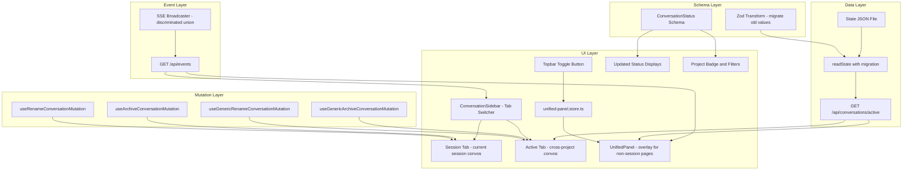
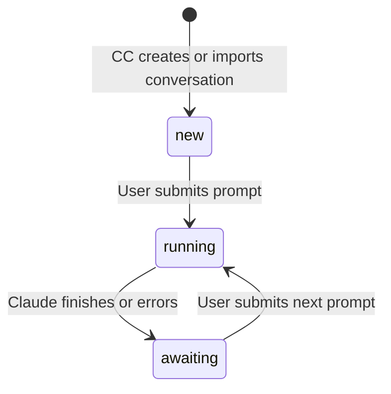
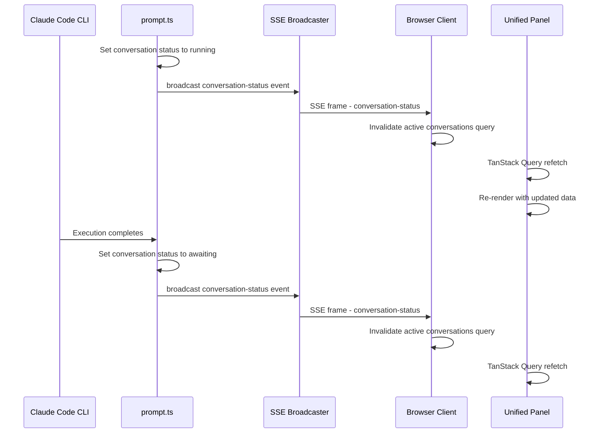

# Design Document — Unified Conversations Panel

> **UPDATED (2026-02-22) — SDK Migration:** References to `session-ready` events triggered from the hooks route are obsolete. The hook system was removed entirely. The `session-ready` SSE event type and `SessionReadyEvent` schema have been superseded by `conversation-status` events broadcast directly from `prompt.ts`. The `NotificationListener` now only listens for `conversation-status` events. The `SSEEvent` discriminated union is now just `ConversationStatusEvent` (no `SessionReadyEvent`). All other aspects of this spec (status schema migration, unified panel, sidebar tabs, active conversations API, filters) remain valid.

## Overview

**Purpose**: This feature delivers cross-project conversation awareness and a clearer status system to CC users. It replaces confusing status labels (`idle`/`ready`/`running`) with intuitive ones (`new`/`awaiting`/`running`), fixes inconsistent project-level badges, and introduces a global side panel that surfaces all active conversations across every project.

**Users**: Developers managing multiple concurrent Claude Code sessions across repositories will use the unified panel to monitor conversation status without navigating away from their current context.

**Impact**: Changes the conversation status schema (with backward-compatible migration), extends the SSE event system, adds a new API endpoint and UI component, and reworks project-level badge/filter logic.

### Goals

- Replace `idle`/`ready`/`running` with `new`/`awaiting`/`running` across the entire stack
- Provide a toggleable global panel showing all `running` and `awaiting` conversations
- Fix project card badges to say "running" instead of "active"
- Add a 4-option filter system to the projects page: All / Active / Running / Idle

### Non-Goals

- In-app notification history with read/unread tracking (explicitly descoped)
- Changing session-level `idle` status (retained for "no active conversations")
- Adding new conversation lifecycle states beyond `new`/`awaiting`/`running`

> **Note (Phase 2 update):** The original non-goal "Replacing or modifying the existing ConversationSidebar" was revisited. The sidebar was extended with tabs to consolidate the unified panel into the sidebar on session detail pages. The standalone UnifiedPanel overlay is retained for non-session-detail pages.

## Architecture

> See `research.md` for detailed investigation notes and alternative approaches evaluated.

### Existing Architecture Analysis

The current architecture follows a simple pattern: Zod schema defines status values → derivation functions compute session/project status → UI components display status text and CSS classes → SSE broadcasts status changes for real-time updates.

Key constraints to respect:
- **Schema-first**: All data shapes defined as Zod schemas in `src/lib/schemas.ts`
- **Filesystem-backed state**: Single JSON file with atomic writes
- **SSE for real-time**: Single `EventSource` connection per client via `/api/events`
- **TanStack Query**: Cache invalidation drives UI updates on SSE events

### Architecture Pattern & Boundary Map



**Architecture Integration**:
- **Selected pattern**: Extension of existing SSE + TanStack Query invalidation pattern
- **Domain boundaries**: Status schema change is foundational; UI panel/sidebar are additive
- **Existing patterns preserved**: Zod-first schemas, derived status functions, SSE broadcasts, Zustand stores
- **New components (Phase 1)**: UnifiedPanel (UI), unified-panel store (state), active conversations API endpoint (data), extended SSE event types (events)
- **New components (Phase 2 — Consolidation)**: Sidebar tab switcher, Active tab in ConversationSidebar, generic mutation hooks (`useGenericArchiveConversationMutation`, `useGenericRenameConversationMutation`)
- **Steering compliance**: Filesystem-backed state, no new external dependencies, schema-first modeling

### Technology Stack

| Layer | Choice / Version | Role in Feature | Notes |
|-------|------------------|-----------------|-------|
| Frontend | React 19 + TanStack Query | Panel component, query hooks, cache invalidation | Existing stack |
| State | Zustand with Immer | Panel open/close state | Follows existing store pattern |
| Backend | Next.js API Routes | New `/api/conversations/active` endpoint | Existing pattern |
| Events | SSE via ReadableStream | Real-time status change broadcast | Extends existing broadcaster |
| Data | Zod v4 + JSON state file | Schema migration via transform | Existing pattern |

## System Flows

### Conversation Status Lifecycle



### Unified Panel Real-Time Update Flow



Key decisions: The panel does not maintain its own WebSocket or polling loop. It relies on TanStack Query's cache invalidation triggered by SSE events — the same mechanism the existing `NotificationListener` uses. This ensures a single data-fetching pattern throughout the application.

## Requirements Traceability

| Requirement | Summary | Components | Interfaces | Flows |
|-------------|---------|------------|------------|-------|
| 1.1 | Three status values: new, running, awaiting | ConversationStatus schema | Status schema | — |
| 1.2 | CC-created conversations start as new | createConversation | — | Status lifecycle |
| 1.3 | Imported conversations start as new | discoverAndImportConversations | — | Status lifecycle |
| 1.4 | Prompt submission sets running | executePromptStream | — | Status lifecycle |
| 1.5 | Claude finish sets awaiting | executePromptStream, processHookEvent | — | Status lifecycle |
| 1.6 | Remove idle/ready from schema | ConversationStatus schema | — | — |
| 1.7 | Migrate persisted old values on read | Zod transform in schema | — | — |
| 2.1-2.3 | Session derivation with new values | deriveSessionStatus | — | — |
| 2.4 | Merged visual indicator preserved | StatusBadge components | — | — |
| 3.1 | Running badge on project card | ProjectCard | — | — |
| 3.2 | Session count badge when not running | ProjectCard | — | — |
| 3.3 | Idle badge when no sessions | ProjectCard | — | — |
| 3.4-3.7 | Four filter options | ProjectsGrid, projects.store | — | — |
| 4.1-4.3 | Consistent display across views | All status display components | — | — |
| 5.1 | Toggle button in topbar | Topbar | — | — |
| 5.2 | Accessible from every page | UnifiedPanel in root layout | — | — |
| 5.3-5.4 | Show running/awaiting across projects | UnifiedPanel, ActiveConversations API | GET /api/conversations/active | — |
| 5.5 | Sort by most recent activity | ActiveConversations API | — | — |
| 5.6 | Display project, session, conversation, status, time | UnifiedPanel | — | — |
| 5.7 | Click navigates to detail page | UnifiedPanel | — | — |
| 5.8 | Real-time updates | NotificationListener, SSE | conversation-status event | Real-time update flow |
| 5.9 | Empty state message | UnifiedPanel | — | — |
| 6.1-6.2 | SSE events on status transitions | SSE Broadcaster | ConversationStatusEvent | Real-time update flow |
| 6.3 | Reuse existing SSE infrastructure | SSE Broadcaster, Events route | — | — |
| 7.1-7.4 | Sidebar tab switcher with Session/Active tabs | ConversationSidebar | — | — |
| 7.5-7.7 | Active conversation item with meta chips | ConversationSidebar (Active tab) | ActiveConversation | — |
| 7.8-7.10 | Rename/archive from active tab | ConversationSidebar, Generic mutation hooks | Rename/Archive API | — |
| 7.11 | Active tab empty state | ConversationSidebar | — | — |
| 8.1-8.4 | Consistent button icons and tooltips | ConversationSidebar, ConversationList | — | — |

## Components and Interfaces

| Component | Domain/Layer | Intent | Req Coverage | Key Dependencies | Contracts |
|-----------|--------------|--------|--------------|------------------|-----------|
| ConversationStatus Schema | Schema | Define new status enum with migration | 1.1-1.7 | Zod (P0) | State |
| deriveSessionStatus | Derivation | Compute session status from conversations | 2.1-2.4 | ConversationStatus (P0) | Service |
| ActiveConversations API | Backend | Aggregate running/awaiting conversations | 5.3-5.5, 6.3 | readState (P0) | API |
| SSE Broadcaster Extension | Events | Broadcast conversation status changes | 6.1-6.3 | sse-broadcaster (P0) | Event |
| NotificationListener Extension | Client | Handle new SSE event types | 5.8, 6.1-6.2 | EventSource (P0) | Event |
| UnifiedPanel | UI | Toggleable global overlay panel (non-session pages) | 5.1-5.9 | ActiveConversations API (P0), unified-panel store (P0) | State |
| unified-panel.store | State | Panel open/close state | 5.1-5.2 | Zustand (P0) | State |
| ConversationSidebar Tabs | UI | Tab switcher consolidating session + active conversations | 7.1-7.11, 8.1-8.4 | ActiveConversations API (P0), generic mutations (P0) | State |
| Generic Mutation Hooks | Mutation | Archive/rename conversations from any project/session | 7.8-7.10 | TanStack Query (P0) | API |
| ProjectCard Badge Update | UI | Fix badge text and styling | 3.1-3.3, 4.1-4.3 | DiscoveredProject (P0) | — |
| ProjectsGrid Filter Update | UI | Four-option filter system | 3.4-3.7 | projects.store (P0) | State |
| Status Display Updates | UI | Rename status text across all views | 4.1-4.3 | ConversationStatus (P0) | — |

### Schema Layer

#### ConversationStatus Schema Update

| Field | Detail |
|-------|--------|
| Intent | Replace idle/ready/running enum with new/awaiting/running, with backward-compatible migration |
| Requirements | 1.1, 1.6, 1.7 |

**Responsibilities & Constraints**
- Single source of truth for conversation status values
- Must accept old values (`idle`, `ready`) during parse and transform to new values (`new`, `awaiting`)
- All downstream types derived via `z.infer`

**Contracts**: State [x]

##### State Management

```typescript
// New status enum (replaces sessionStatusSchema)
const conversationStatusSchema = z
  .enum(["new", "awaiting", "running"])
  .or(z.enum(["idle", "ready"]).transform((v) =>
    v === "idle" ? "new" as const : "awaiting" as const
  ));

type ConversationStatus = "new" | "awaiting" | "running";
```

- **Persistence**: Status values are stored as strings in the JSON state file
- **Consistency**: Old values transparently converted on read; new values always written
- **Migration**: The `or` + `transform` branch handles legacy data without a separate migration step

**Implementation Notes**
- The schema name changes from `sessionStatusSchema` to `conversationStatusSchema` to better reflect its purpose (it describes conversation status, not session status)
- Session-level status remains a derived value from `deriveSessionStatus()`, not stored
- The `SessionStatus` type export should be renamed to `ConversationStatus`
- All files importing `SessionStatus` or `sessionStatusSchema` need updating

### Derivation Layer

#### deriveSessionStatus Update

| Field | Detail |
|-------|--------|
| Intent | Compute session status using new conversation status values |
| Requirements | 2.1, 2.2, 2.3, 2.4 |

**Responsibilities & Constraints**
- Pure function, no side effects, safe for client-side use
- Return type: `"running" | "awaiting" | "idle"` (session-level `idle` retained)
- `merged` display is handled separately by checking `session.finished` flag

**Contracts**: Service [x]

##### Service Interface

```typescript
type DerivedSessionStatus = "running" | "awaiting" | "idle";

function deriveSessionStatus(session: SessionState): DerivedSessionStatus;
```

- Preconditions: `session` is a valid `SessionState`
- Postconditions: Returns `"running"` if any conversation is `"running"`, `"awaiting"` if any is `"awaiting"`, `"idle"` otherwise
- Invariants: Priority order is running > awaiting > idle

**Implementation Notes**
- The return type is a separate union from `ConversationStatus` since session-level uses `idle` while conversation-level uses `new`
- The `"ready"` check becomes `"awaiting"`, `"idle"` check becomes `"new"`

### Backend Layer

#### ActiveConversations API

| Field | Detail |
|-------|--------|
| Intent | Return all running and awaiting conversations across all projects in a flat list |
| Requirements | 5.3, 5.4, 5.5 |

**Responsibilities & Constraints**
- Reads full state, filters for non-archived conversations with status `running` or `awaiting`
- Enriches each conversation with project name and session name for display
- Sorts by `lastActivityAt` descending (most recent first)
- Excludes conversations in archived sessions or archived projects

**Dependencies**
- Inbound: UnifiedPanel component — fetches data (P0)
- Outbound: readState — reads full manager state (P0)

**Contracts**: API [x]

##### API Contract

| Method | Endpoint | Request | Response | Errors |
|--------|----------|---------|----------|--------|
| GET | /api/conversations/active | — | `ActiveConversationsResponse` | 500 |

```typescript
interface ActiveConversation {
  id: string;
  name: string | null;
  status: "running" | "awaiting";
  lastActivityAt: string;
  projectName: string;
  projectPath: string;
  sessionName: string;
}

interface ActiveConversationsResponse {
  conversations: ActiveConversation[];
}
```

- Preconditions: State file readable
- Postconditions: Returns only conversations with status `running` or `awaiting`, sorted by `lastActivityAt` DESC
- No pagination needed — the number of active conversations is bounded in practice

### Event Layer

#### SSE Broadcaster Extension

| Field | Detail |
|-------|--------|
| Intent | Extend broadcaster to emit conversation status change events alongside existing session-ready events |
| Requirements | 6.1, 6.2, 6.3 |

**Responsibilities & Constraints**
- Backward-compatible: existing `session-ready` event continues to work
- New `conversation-status` event carries project/session/conversation context plus new status
- Single SSE connection per client (no new endpoints)

**Contracts**: Event [x]

##### Event Contract

```typescript
interface ConversationStatusEvent {
  type: "conversation-status";
  projectName: string;
  sessionName: string;
  conversationId: string;
  status: "running" | "awaiting";
}

// Discriminated union of all SSE event types
type SSEEvent = SessionReadyEvent | ConversationStatusEvent;
```

- Published events: `conversation-status` (new), `session-ready` (existing)
- Delivery guarantees: Best-effort, no ordering guarantee (failed clients silently removed)
- The `broadcast()` function signature generalizes from `SessionReadyEvent` to `SSEEvent`

**Implementation Notes**
- The SSE event name in the frame changes based on event type: `event: session-ready` or `event: conversation-status`
- `NotificationListener` listens for both event types and invalidates queries accordingly
- The existing `session-ready` broadcast in hooks route and the new `conversation-status` broadcasts in `prompt.ts` are complementary — `session-ready` triggers browser notifications, `conversation-status` refreshes the unified panel

#### NotificationListener Extension

| Field | Detail |
|-------|--------|
| Intent | Listen for conversation-status SSE events and invalidate active conversations query |
| Requirements | 5.8 |

**Responsibilities & Constraints**
- Adds `conversation-status` event listener alongside existing `session-ready` listener
- On `conversation-status` event: invalidates the active conversations query key
- Existing behavior (browser notifications on `session-ready`) is unchanged

**Contracts**: Event [x]

##### Event Contract

- Subscribed events: `session-ready` (existing), `conversation-status` (new)
- On `conversation-status`: `queryClient.invalidateQueries({ queryKey: conversationKeys.active })`
- On `session-ready`: existing behavior (browser notification + session query invalidation)

### State Layer

#### unified-panel.store

| Field | Detail |
|-------|--------|
| Intent | Manage unified panel open/close state |
| Requirements | 5.1, 5.2 |

**Responsibilities & Constraints**
- Minimal Zustand store following existing patterns (e.g., `projects.store.ts`)
- Panel state is ephemeral (not persisted to localStorage)

**Contracts**: State [x]

##### State Management

```typescript
interface UnifiedPanelState {
  isOpen: boolean;
}

interface UnifiedPanelActions {
  toggle: () => void;
  close: () => void;
}
```

- Persistence: None (panel starts closed on page load)
- Consistency: Single source of truth for panel visibility across all pages

### UI Layer

#### UnifiedPanel Component (Overlay — Non-Session Pages)

| Field | Detail |
|-------|--------|
| Intent | Toggleable right-side overlay panel showing active conversations (used on non-session pages) |
| Requirements | 5.1, 5.2, 5.3, 5.4, 5.5, 5.6, 5.7, 5.8, 5.9 |

**Responsibilities & Constraints**
- Client component (`"use client"`)
- Renders as a fixed-position right-side overlay (z-index above page content, below modals)
- Fetches data via TanStack Query hook calling `GET /api/conversations/active`
- Each item shows: status dot, conversation name (or fallback), session name, project name, relative time
- Clicking an item navigates to `/projects/{projectName}/{sessionName}/{conversationId}`
- Empty state when no active conversations
- **Note**: On session detail pages, the Active tab in the ConversationSidebar provides the same functionality inline

**Dependencies**
- Inbound: Root layout — renders globally (P0)
- Outbound: ActiveConversations API — data source (P0)
- Outbound: unified-panel.store — open/close state (P0)
- Outbound: Next.js router — navigation on click (P1)

**Contracts**: State [x]

##### State Management

- Reads `isOpen` from unified-panel.store
- Uses TanStack Query with `conversationKeys.active` query key
- Polling interval: none (relies on SSE-triggered invalidation for real-time updates)
- Refetch on window focus: yes (TanStack Query default)

**Implementation Notes**
- Panel positioned as `position: fixed; right: 0; top: var(--topbar-height); bottom: 0; width: 360px` with a slide-in transition
- Backdrop overlay (semi-transparent) behind panel, click-to-close
- Follows design system: `--bg-surface` background, `--border-subtle` left border, mono font for all metadata
- Status dot colors: cyan for `running` (animated pulse), green for `awaiting`
- Relative time display (e.g., "2m ago") using `lastActivityAt`
- Flat list with project/session shown per item
- Mobile: panel takes full width with backdrop

#### ConversationSidebar Tab Extension (Consolidated Active View)

| Field | Detail |
|-------|--------|
| Intent | Add Session/Active tab switcher to the existing conversation sidebar, consolidating the unified panel's functionality inline on session detail pages |
| Requirements | 7.1-7.11, 8.1-8.4 |

**Responsibilities & Constraints**
- Extends the existing `ConversationSidebar` component (not a separate component)
- Two tabs: "Session" (existing behavior) and "Active" (cross-project active conversations)
- Active tab fetches data via `useActiveConversationsQuery()` — same data as the overlay panel
- Active tab supports rename and archive via generic mutation hooks
- Meta chips (project name, session name) are clickable and navigate to the respective pages
- Must handle the nested `<Link>` problem: meta chips use `<span onClick>` with `e.preventDefault()` + `e.stopPropagation()` + `router.push()` instead of nested `<Link>` elements

**Dependencies**
- Inbound: SessionDetailPage — renders sidebar (P0)
- Outbound: ActiveConversations API — data source for active tab (P0)
- Outbound: Generic mutation hooks — rename/archive for active tab (P0)
- Outbound: Session-scoped mutation hooks — rename/archive for session tab (P0)
- Outbound: Next.js router — navigation for meta chips (P1)

**Contracts**: State [x]

##### State Management

- Tab selection: local `useState<"session" | "active">` (not persisted)
- Session tab: reuses existing sidebar state (conversations prop, showArchived, editingId)
- Active tab: separate rename state (`activeEditingId`, `activeEditValue`, `activeEditConvoRef`) to avoid conflicts with session tab rename
- `activeEditConvoRef` stores the full `ActiveConversation` object for the currently-editing conversation (needed to retrieve `projectName`/`sessionName` for the generic mutation)

##### Active Tab Item Layout

Each active conversation item renders:
1. Status dot (`.sidebar-dot` with status class)
2. Name row (`.convo-sidebar-item-name-row`): conversation name + relative time
3. Meta row (`.convo-sidebar-active-meta`): project chip `/` session chip (clickable)
4. Action buttons: rename (pencil `&#9998;`) and archive (downward arrow `\u2913`)

When editing (rename mode), the name row shows an inline `<input>` and the meta row is hidden.

#### Generic Mutation Hooks

| Field | Detail |
|-------|--------|
| Intent | Provide archive and rename mutations that accept project/session as variables (not hook params) |
| Requirements | 7.8, 7.9, 7.10 |

**Responsibilities & Constraints**
- `useGenericArchiveConversationMutation()`: Accepts `{ projectName, sessionName, conversationId, archived }` as mutation variables
- `useGenericRenameConversationMutation()`: Accepts `{ projectName, sessionName, conversationId, name }` as mutation variables
- Both invalidate `conversationKeys.list(projectName, sessionName)` and `conversationKeys.active` on success
- Necessary because active tab conversations span multiple projects/sessions, so session-scoped mutation hooks can't be used

**Contracts**: API [x]

##### API Contract

Reuses existing conversation archive and rename API endpoints:
- `PATCH /api/projects/{projectName}/sessions/{sessionName}/conversations/{conversationId}/archive`
- `PATCH /api/projects/{projectName}/sessions/{sessionName}/conversations/{conversationId}/rename`

#### Topbar Toggle Button

| Field | Detail |
|-------|--------|
| Intent | Provide a persistent button in the topbar to toggle the unified panel |
| Requirements | 5.1 |

**Implementation Notes**
- Added to the topbar right side, visible on all pages
- Icon-only button (e.g., a list/activity icon) with optional badge showing count of active conversations
- Uses `unified-panel.store.toggle()` on click
- Visually distinct when panel is open (e.g., highlighted/active state)
- Positioned before any page-specific topbar controls

#### ProjectCard Badge Update

| Field | Detail |
|-------|--------|
| Intent | Fix badge text from "active" to "running" and adjust styling |
| Requirements | 3.1, 3.2, 3.3 |

**Implementation Notes**
- When `hasRunningSession` is true: badge text changes from `"active"` to `"running"`, CSS class remains `project-badge active` (cyan styling is correct)
- When `activeSessions > 0` but not running: unchanged (shows session count with green styling)
- When `activeSessions === 0`: unchanged (shows "idle" with gray styling)
- Single-line text change in `ProjectCard.tsx`

#### ProjectsGrid Filter Update

| Field | Detail |
|-------|--------|
| Intent | Replace 3-option filter with 4-option filter system |
| Requirements | 3.4, 3.5, 3.6, 3.7 |

**Implementation Notes**
- Filter pills change from `["all", "active", "idle"]` to `["all", "active", "running", "idle"]`
- Store type changes: `statusFilter: "all" | "active" | "running" | "idle"`
- Filter logic:
  - `all`: no filtering
  - `active`: `activeSessions > 0`
  - `running`: `hasRunningSession === true`
  - `idle`: `activeSessions === 0`
- Count computation updates to include `running` count

#### Status Display Updates (Summary-only)

All components displaying status text update their string comparisons and CSS classes:

- **ConversationList.tsx**: `ConversationStatusDot` maps `"new"` → `"new"` class, `"awaiting"` → `"awaiting"` class, `"running"` → `"running"` class
- **ConversationSidebar.tsx**: `statusDot()` function uses same mapping
- **SessionsList.tsx**: `StatusBadge` updates `deriveSessionStatus` references
- **SessionDetailPage.tsx**: `displayStatus` computation uses new status values
- **CSS**: Add `.session-status.new` and `.session-status.awaiting` classes; `.session-status.new` mirrors current `.idle` styling, `.session-status.awaiting` mirrors current `.ready` styling. Add `.sidebar-dot.new` and `.sidebar-dot.awaiting`.

## Data Models

### Domain Model

**ConversationStatus** (value object):
- Values: `"new"` | `"awaiting"` | `"running"`
- Transition rules: `new → running → awaiting → running → ...`
- Invariant: A conversation can only be `running` while a Claude Code process is actively executing

**DerivedSessionStatus** (derived value):
- Values: `"running"` | `"awaiting"` | `"idle"`
- Derivation: max(conversation statuses) with priority running > awaiting > idle
- Note: Uses `idle` (not `new`) at the session level since "session never invoked" is not meaningful

**ActiveConversation** (read model):
- Enriched view of a conversation with project and session context
- Filtered to `running` or `awaiting` only
- Sorted by `lastActivityAt` descending

### Data Contracts & Integration

**SSE Event Schema**:

```typescript
// Existing event (unchanged)
interface SessionReadyEvent {
  type: "session-ready";
  projectName: string;
  sessionName: string;
  conversationId: string;
}

// New event
interface ConversationStatusEvent {
  type: "conversation-status";
  projectName: string;
  sessionName: string;
  conversationId: string;
  status: "running" | "awaiting";
}
```

**Query Key Addition**:

```typescript
const conversationKeys = {
  // ... existing keys
  active: ["conversations", "active"] as const,
};
```

## Error Handling

### Error Strategy

- **State file read failure**: ActiveConversations API returns 500; panel shows error state
- **SSE connection failure**: TanStack Query falls back to refetchOnWindowFocus; panel may be stale until reconnection
- **Invalid status in persisted state**: Zod transform handles `idle`/`ready` gracefully; truly invalid values cause parse error logged server-side, conversation excluded from results

### Monitoring

- Server logs on state read/write failures (existing pattern)
- SSE broadcaster logs client connection/disconnection counts (existing)
- No new monitoring infrastructure needed

## Testing Strategy

### Unit Tests
- `conversationStatusSchema` parse: accepts `new`, `awaiting`, `running`; transforms `idle` → `new`, `ready` → `awaiting`; rejects invalid values
- `deriveSessionStatus`: returns correct status for all conversation status combinations
- `ActiveConversations` filtering: returns only running/awaiting, sorted by recency, excludes archived
- Project filter logic: all four filters return correct subsets

### Integration Tests
- SSE broadcaster emits `conversation-status` events with correct payload
- `NotificationListener` invalidates `conversationKeys.active` on `conversation-status` event
- Full prompt lifecycle: status transitions from `new` → `running` → `awaiting` with SSE events at each step

### E2E/UI Tests
- Toggle unified panel via topbar button
- Panel shows running conversation, updates when conversation completes
- Click conversation in panel navigates to correct detail page
- Empty state displays when no active conversations
- Project page filters work correctly with new 4-option system

## Migration Strategy

No multi-phase migration is needed. The Zod transform handles backward compatibility transparently:

1. Schema update deploys with `or` + `transform` branch
2. Existing state file is read successfully — old values converted on parse
3. Any state write persists new values (`new`, `awaiting`, `running`)
4. After all conversations have been touched at least once, all persisted values are new format
5. The transform branch can optionally be removed in a future cleanup pass (no urgency)
