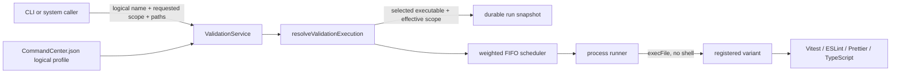

# Technical Design: validation-command-scopes

## Overview

**Purpose**: Make validation scope a uniform Command Center contract while preserving one logical command identity for policy, cost, timeout, scheduling, and workflow configuration.

**Users**: Agents call `cctl validate run`; automated workflow and merge gates call `ValidationService`; project maintainers register safe executable variants in `CommandCenter.json`; operators inspect scope capability and effective execution through discovery, status, logs, and the durable ledger.

**Impact**: The project command schema changes from one flat executable to a required full executable plus an optional changed executable. The service resolves requested scope to an immutable execution profile before admission. CLI/API/system callers gain scope, path narrowing is renamed and constrained to native changed variants, the ledger gains requested/effective scope, and this repository collapses `test` plus `test-full-suite` into one logical `test` registration.

### Goals

- One logical command name maps to a full executable and optionally a changed executable.
- Every submission defaults to changed; unsupported changed execution safely resolves to full.
- Explicit paths remain a safe inner-loop narrowing without becoming arbitrary option passthrough.
- Scope resolution is centralized, observable, and immutable for a run.
- The repository's changed test variant continues to use Vitest's native affected-file functionality.

### Non-Goals

- Per-scope cost, timeout, description, or policy.
- Arbitrary shell strings or arbitrary runner arguments.
- Inferring scope from executable names, wrapper output, or historical ledger rows.
- Teaching wrappers to parse the Command Center `scope` value.
- Reporting tool-internal widening, such as a changed wrapper choosing full coverage because no merge base exists, through a new wrapper-to-server protocol.

## Boundary Commitments

### This Spec Owns

- Project registration schema and scope/path vocabulary.
- Scope resolution and fallback inside the validation domain.
- CLI/API/system submission contracts and discovery/status projections.
- New durable scope fields and their additive migration.
- This repository's configuration and wrapper set.
- Project setup guidance, generated CLI reference, architecture documentation, and tests.

### Out of Boundary

- Scheduler algorithm, capacity arithmetic, leases, cancellation, timeout, recovery policy, and process supervision.
- Workflow validation policy shape: policies continue to list logical names.
- New UI controls for choosing scope.
- Historical reports, whose old `scoped` terminology describes the system at the time of those reports.

### Revalidation Triggers

- Addition of a third scope value.
- A requirement for scope-specific cost or timeout.
- A requirement to prove a wrapper's actual runtime coverage rather than the executable variant selected by Command Center.
- A new forwarded-argument category beyond validated repository-relative paths.

## Design Decisions

### D1: Nest executable variants under singular `command`

Selected registration:

```json
{
  "validation": {
    "commands": {
      "test": {
        "command": {
          "full": "scripts/validate/test-full-suite.sh",
          "changed": "scripts/validate/test.sh"
        },
        "cost": 8,
        "timeoutMs": 3600000,
        "description": "Run unit tests with eight workers",
        "pathArgs": "paths"
      },
      "typecheck": {
        "command": {
          "full": "scripts/validate/typecheck.sh"
        },
        "cost": 2,
        "timeoutMs": 3600000,
        "description": "Run full-project static and build checks"
      }
    }
  }
}
```

`command` remains the execution boundary for one logical profile; its nested keys describe the two standardized modes. A strict object schema rejects both the old string value and old `scopeArgs` property. `full` is required because it is the safe fallback. `changed` is optional because not every tool can validate affected files soundly.

Rejected alternatives:

| Alternative | Reason rejected |
|---|---|
| `fullCommand` and `changedCommand` peer fields | Spreads one concept across the profile and makes future command-level validation less cohesive. |
| Array of variant objects | Adds identity, ordering, and duplicate-key problems for exactly two fixed modes. |
| One wrapper plus a forwarded scope argument | Leaks orchestration into every project wrapper and prevents Command Center from knowing which variant actually ran. |
| Separate logical names | Duplicates policy, cost, timeout, discovery, and workflow configuration; this is the current problem. |

### D2: Separate execution scope from path narrowing

The existing `scopeArgs` registration property becomes `pathArgs: "forbid" | "paths"`. Scope answers “changed or full?”; path arguments answer “which files within the changed execution?” Keeping distinct names prevents the old ambiguity where “scoped” meant only “received paths.”

The config schema enforces this invariant:

```ts
pathArgs === "paths" implies command.changed is present
```

This makes an invalid full-only/path-capable registration unrepresentable. Runtime request validation still rejects forbidden paths and `scope: "full"` with paths so malformed API clients fail before scheduler admission.

### D3: Resolve one immutable execution profile before admission

A pure validation-domain resolver is the sole owner of dispatch:

```ts
type ValidationScope = "changed" | "full";

interface ResolvedValidationExecution {
  executable: string;
  requestedScope: ValidationScope;
  effectiveScope: ValidationScope;
  pathArgs: "forbid" | "paths";
  scopePaths: string[];
}
```

The resolver accepts the registered logical profile plus normalized request scope/paths. It returns either the immutable execution profile or a typed pre-admission error. The process runner receives the selected executable and validated paths; it does not inspect the registry or choose a scope.

Resolution matrix:

| Requested scope | Changed executable | Paths | Result |
|---|---:|---:|---|
| `changed` | yes | none | changed executable; effective `changed` |
| `changed` | yes | allowed paths | changed executable plus paths; effective `changed` |
| `changed` | no | none | full executable; effective `full` |
| `changed` | no | any | reject before admission |
| `full` | either | none | full executable; effective `full` |
| `full` | either | any | reject before admission |

`effectiveScope` means the variant selected by Command Center. A changed wrapper may safely widen internally for tool-specific correctness (for example, a missing merge base or a changed Vitest setup file); adding a child-to-server result manifest solely to report that distinction is outside this feature.

### D4: Public omission defaults; internal callers are explicit

The API request schema defaults an omitted scope to `changed`, and the CLI also defaults locally so its rendered intent is deterministic. Internal system submissions require an explicit scope in TypeScript and all current automated callers pass `changed`. This gives external callers the requested ergonomic default while making orchestration intent visible at code review.

## Architecture



**Dependency direction**: API/CLI and automated callers depend on the scope vocabulary; `ValidationService` depends on the pure resolver; the resolver depends on the parsed registration; scheduler and process runner consume the resolved snapshot and do not depend on configuration shape. This keeps fallback, path compatibility, and executable selection behind one deep module.

## Configuration Contract

Conceptual Zod shape:

```ts
const validationScopeSchema = z.enum(["changed", "full"]);

const validationCommandExecutableSchema = z
  .object({
    full: executablePathSchema,
    changed: executablePathSchema.optional(),
  })
  .strict();

const validationCommandConfigSchema = z
  .object({
    command: validationCommandExecutableSchema,
    cost: z.number().int().positive(),
    timeoutMs: z.number().int().positive().optional(),
    description: z.string().trim().min(1).optional(),
    pathArgs: z.enum(["forbid", "paths"]).default("forbid"),
  })
  .strict()
  .superRefine((profile, ctx) => {
    if (profile.pathArgs === "paths" && profile.command.changed === undefined) {
      // issue: paths require a native changed executable
    }
  });
```

Executable path containment and permission checks remain where they are today and apply after selection to both variants. Config tests cover strict rejection of the old string `command`, old `scopeArgs`, unknown variant keys, missing `full`, and path-capable profiles without `changed`.

## Submission and Execution Flows

### CLI

```text
cctl validate run <name> [--scope changed|full] [--wait] [--json] [-- <validated paths>]
```

Examples:

```text
cctl validate run test --wait
cctl validate run test --scope full --wait
cctl validate run test --scope changed --wait -- src/lib/example.test.ts
```

The typed help registry owns the `scope` value flag, usage, examples, and description. Parser allowlists continue to derive from that registry. The CLI rejects an invalid scope and `--scope full` plus passthrough paths locally before making a request; the server repeats semantic validation as the trust boundary. Generated `cc-cli` skill reference is rebuilt from the registry.

### API

`validationSubmitBodySchema` adds `scope`, defaulted to `changed`, while retaining `scopePaths`. Invalid combinations receive structured HTTP 400 errors before admission:

- `validation_path_args_forbidden`
- `validation_path_args_rejected`
- `validation_path_args_require_changed`

The accepted response and poll/status projections include `requestedScope` and `effectiveScope`. Terminal result semantics and exit codes remain unchanged.

### Automated callers

`ValidationSystemSubmitRequest` requires `scope`. Smart Merge, Smart Commit, graph script validation, and graph lane-merge pass `changed` for each policy-selected logical command. A full-only profile, such as `typecheck`, resolves to full in the service without caller-specific branches. Policies and graph definitions continue to contain names such as `test`, never `test-full-suite` or executable paths.

### Discovery

Each listed command exposes metadata, not paths:

```ts
{
  name: string;
  cost: number;
  timeoutMs: number | null;
  description: string | null;
  pathArgs: "forbid" | "paths";
  changedScope: "native" | "full_fallback";
  enabled: boolean;
}
```

Text output renders `changed: native` or `changed: full fallback`; JSON uses the typed field. Active-run and single-run status include requested/effective scope so an operator can identify fallback without seeing an executable.

## Durable State and Migration

The `validation_runs` schema floor gains nullable checked columns:

```sql
requested_scope TEXT CHECK (requested_scope IN ('changed', 'full')),
effective_scope TEXT CHECK (effective_scope IN ('changed', 'full'))
```

Migration `0016-validation-run-scopes` adds the columns idempotently. It backfills rows with `scoped = 1` to requested/effective `changed`, because forwarded paths prove a changed-style request. It leaves rows with `scoped = 0` as `NULL`: arbitrary historical wrappers may have run changed or full and the old row contains no evidence.

The domain record exposes `requestedScope` and `effectiveScope` as nullable only to read legacy rows. Every new submission supplies both before `ValidationRunsRepo.submit`. The obsolete SQLite `scoped` column remains for additive migration safety but is no longer a domain concept; new writes derive it from `scopedPathCount > 0`. `scoped_path_count` remains because path-filtered changed runs have materially different timing from general changed runs.

Timing analysis groups new records by effective scope and path count. Legacy null scope is a separate unknown bucket. No destructive table rewrite or fabricated historical scope is required.

## Lifecycle, Logging, and Events

Existing `createLogger("validation")` lifecycle events retain their names and gain `requestedScope`, `effectiveScope`, and `scopePathCount` where a resolved run exists. Request/rejection logs include requested scope; fallback resolution emits the two differing values on the ordinary requested/queued lifecycle rather than a noisy standalone warning. Completion events and durable rows carry the same scope fields.

Validation SSE events and active-run projections add nullable effective scope for pre-admission rejection phases and non-null values after successful resolution. Output remains bounded in structured logs; complete failure output continues through the current run result/artifact path.

## Repository Migration

`CommandCenter.json` becomes:

| Logical command | Changed executable | Full executable | Path policy |
|---|---|---|---|
| `format` | current `format.sh` | new `format-full.sh` | forbid |
| `lint` | current `lint.sh` | new `lint-full.sh` | forbid |
| `typecheck` | — | current `typecheck.sh` | forbid |
| `test` | current `test.sh` | current `test-full-suite.sh` | paths |
| `pre-merge` | current changed composite | new full composite | forbid |

`test-full-suite` is removed only as a logical registration; its wrapper remains the full implementation selected through `test.command.full`. Shared `vitest-env.sh` continues to pin eight workers and heap for both variants, preserving one honest cost/timeout profile.

The changed test wrapper continues to calculate the target merge base and invoke the existing launcher in `changed` mode. The launcher maps that mode to Vitest's native `changed` start option, so Vitest selects tests whose dependency graph is affected by files changed since the merge base. Explicit paths map to Vitest filters. Existing setup-file exceptions stay because Vitest excludes project setup files from affected dependency traversal.

The new full format/lint wrappers reuse `common.sh` and invoke the same tools across the whole repository. The new full pre-merge composite invokes full format, full lint, full typecheck, and full test wrappers within the existing single cost-8 reservation. No project wrapper receives Command Center's scope value.

## Safety Invariants

- Full is always registered and is the only fallback target.
- Scope resolution and path compatibility finish before ledger insertion and admission.
- The resolved executable, cost, timeout, and scopes are snapshotted; live config edits cannot change an in-flight run.
- Executables remain canonical worktree-contained paths invoked through `execFile` without a shell.
- Paths remain positional, relative, non-option, worktree-contained narrowing values.
- Nested calls, policy-disabled names, unauthenticated identities, and over-budget commands retain their current behavior.
- Changed and full variants share one resource reservation. A maintainer cannot understate full cost by giving it a separate profile.

## File Change Plan

### Validation domain and persistence

- `src/lib/validation/schemas.ts` — scope schema, strict nested registration, list/event/run-record fields.
- `src/lib/validation/command-resolution.ts` — pure variant/fallback/path compatibility resolver.
- `src/lib/validation/api-schemas.ts` — submit, discovery, active-run, and poll scope fields.
- `src/lib/validation/service.ts` — central resolution before admission; explicit system scopes; scope logging and projections.
- `src/lib/validation/process-runner.ts` — consume a selected executable and path policy; no scope decision.
- `src/lib/validation/scope-args.ts` → `path-args.ts` — vocabulary-only rename while preserving containment behavior.
- `src/lib/validation/route-handlers.ts` — forward scope and render typed pre-admission errors.
- `src/lib/state-store/state-db.ts`, `validation-runs-repo.ts`, and migration registry — additive scope columns and round-trip mapping.
- `src/lib/state-store/migrations/0016-validation-run-scopes.ts` — replay-safe migration and evidence-preserving backfill.

### Callers and CLI

- `src/cli/commands/validate.help.ts` — authoritative scope flag/help/examples.
- `src/cli/commands/validate.ts` — local default/validation, request field, scope-aware rendering.
- Smart Merge/Commit and workflow graph validation callers — explicit `changed` system submissions.
- Validation prompt/discovery projection — describe native changed versus full fallback.

### Project configuration and wrappers

- `CommandCenter.json` — nested command variants, `pathArgs`, one logical `test`.
- `scripts/validate/format-full.sh`, `lint-full.sh`, and a full pre-merge composite — full implementations.
- Existing changed and full wrappers — wording and shared helper references only where the new logical naming requires it.

### Documentation and generated guidance

- `docs/project-configuration.md`, `docs/ai-validation-output.md`, `.kiro/steering/project-configuration.md`.
- `docs/design/validation-concurrency/01-design.md` — superseding scope/ledger amendment.
- `plugins/command-center/command-center/skills/project-setup/` skill and relevant references.
- `plugins/command-center/command-center/skills/dev-server-setup/references/commandcenter-json.md`.
- Generated `plugins/command-center/command-center/skills/cc-cli/SKILL.md`.

Historical reports are not rewritten.

## Test Strategy

### Schema and resolver

- New profile parses; old flat `command` and `scopeArgs` fail.
- Full is required; changed is optional; paths require changed.
- Six-row resolution matrix is table-tested.
- Invalid full/path and fallback/path requests never reach admission.

### Service, runner, and persistence

- CLI, agent, and every system source resolve requested/effective scope correctly.
- Scheduler cost/timeout are identical across variants.
- Selected executable and paths reach `execFile`; scope does not become an argv token.
- Config edit after submission cannot change the resolved snapshot.
- Migration is idempotent; path-proven legacy rows backfill changed; ambiguous rows remain null.
- Validation run repository round-trips requested/effective scope and path count.
- Logs, events, active status, and poll status project both scopes without executable paths.

### CLI and guidance

- Default changed, explicit full, explicit changed plus paths, invalid scope, and full plus paths.
- Text and JSON list/status outputs identify native versus fallback behavior.
- Typed help registry and generated skill reference remain synchronized.
- Instruction-document tests pin the nested profile and Vitest affected-run guidance.

### Repository wrappers

- Wrapper contract tests verify changed and full format/lint/pre-merge selection.
- Test wrapper contract verifies the changed variant reaches native Vitest affected mode and the full variant remains unscoped with the shared resource profile.
- `test-full-suite` is absent from logical discovery and policy lists.

### Validation sequence after implementation

1. Targeted unit tests for schemas, resolver, CLI, service, runner, repo, migration, wrappers, and instruction docs.
2. `cctl validate run format --scope changed --wait`.
3. `cctl validate run lint --scope changed --wait`.
4. `cctl validate run typecheck --scope changed --wait` and verify effective full fallback.
5. `cctl validate run test --scope changed --wait`.
6. `cctl validate run test --scope full --wait`.

All validation uses registered logical commands after the new config is in place.

## Requirements Traceability

| Requirement | Design coverage |
|---|---|
| 1 | D1, configuration contract, policy/caller flow |
| 2 | D3, D4, resolution matrix |
| 3 | D2, resolver errors, CLI/API validation |
| 4 | Automated callers, architecture, safety invariants |
| 5 | Discovery, durable state, logging/events |
| 6 | Strict schema, repository migration, docs/generated artifacts |
| 7 | Safety invariants, unchanged scheduler/process lifecycle boundaries |

## Design Quality Assessment

**Score: 9/10.** The design gives callers one small interface and hides variant selection, fallback, and path compatibility in a pure service-owned resolver. It removes duplicated logical profiles while preserving resource honesty and all existing trust boundaries. The registry makes the important illegal state—path support without a changed executable—unrepresentable.

To reach 10/10, Command Center would need a typed child-result side channel that lets a changed wrapper report that it widened to full at runtime (for example, because no merge base exists). That would make `effectiveScope` describe exact tool coverage rather than the variant selected by Command Center. It is deliberately omitted here because it adds a cross-process protocol and lifecycle failure modes for an observational distinction that does not affect safe execution, policy, or capacity.
