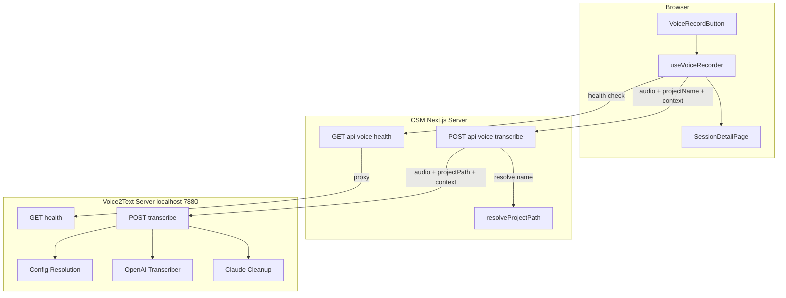
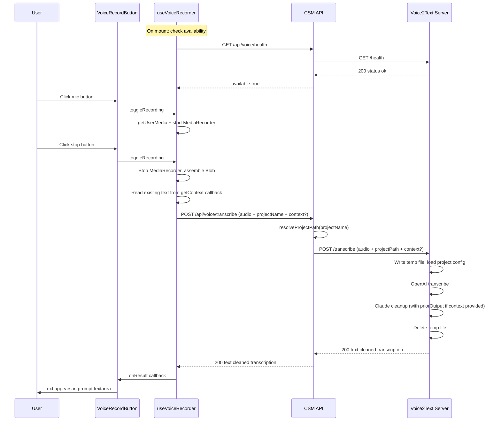

# Technical Design: Voice Transcription Integration

## Overview

**Purpose**: This feature delivers voice-to-text input to CSM developers, enabling dictation of prompts on the session detail page instead of (or alongside) typing.

**Users**: Developers using CSM to manage Claude Code sessions will use voice input for faster prompt entry, especially when describing complex tasks or when remote (e.g., via Tailscale from a mobile device).

**Impact**: Extends the Voice2Text CLI tool into an HTTP server, adds a proxy API layer in CSM, and introduces a voice record button in the session UI. No existing functionality is modified — the voice feature is additive and gracefully hidden when the Voice2Text server is unavailable. When existing text is present in the input field, it is automatically forwarded as context so the cleanup phase produces output that continues naturally from the prior content.

### Goals
- Enable browser-based voice dictation that flows into the existing prompt textarea
- Proxy transcription through CSM so Voice2Text can remain localhost-bound
- Support per-project voice configuration (context files, cleanup instructions)
- Provide clear visual feedback for recording, processing, and error states
- Automatically pass existing input text as context to improve transcription cleanup continuity

### Non-Goals
- Real-time streaming transcription (batch recording is sufficient for prompt dictation)
- Speaker diarization or multi-speaker support
- Voice commands (e.g., "send prompt", "create session") — output is text only
- Audio playback or recording history
- Authentication/authorization for the Voice2Text server (localhost-only)

## Architecture

### Existing Architecture Analysis

The integration touches two existing systems:

**Voice2Text CLI** (`voice-to-text` project): Hotkey-driven CLI that records audio, transcribes via OpenAI gpt-4o-transcribe, cleans up via Claude CLI, and outputs to clipboard or file. Config resolution merges 4 layers (global → local → specified → CLI). The CLI's core services (Transcriber, CleanupService) are stateless and reusable.

**CSM** (`remote-ai-manager` project): Next.js App Router application with REST API routes proxying to local services. The session detail page has an existing prompt input area (textarea + send button) with error display. Project paths are resolved via `resolveProjectPath()`.

Both systems are extended without breaking existing behavior.

### Architecture Pattern & Boundary Map



**Architecture Integration**:
- **Selected pattern**: API proxy — CSM forwards voice requests to localhost-bound V2T server, consistent with CSM's role as a control plane
- **Domain boundaries**: V2T owns transcription/cleanup; CSM owns project resolution, UI, and remote access
- **Existing patterns preserved**: `withTracing` for API routes, `resolveProjectPath` for project lookup, `promptError` for error display, flex layout for prompt input area
- **New components rationale**: V2T server (HTTP access to transcription), CSM proxy routes (remote access bridge), recording hook (browser audio capture), voice button (UI entry point)
- **Steering compliance**: No new npm dependencies, TypeScript strict mode, Zod validation at boundaries, colocated structure

### Technology Stack

| Layer | Choice / Version | Role in Feature | Notes |
|-------|------------------|-----------------|-------|
| Frontend | React 19, MediaRecorder API | Audio capture, voice button UI | Native browser APIs, no libraries |
| Backend (CSM) | Next.js App Router | API proxy routes | Follows existing route patterns |
| Backend (V2T) | Bun.serve() | HTTP server for transcription | Built-in to Bun runtime, zero deps |
| External API | OpenAI gpt-4o-transcribe | Speech-to-text transcription | Existing dependency in V2T |
| External CLI | Claude CLI | Transcription cleanup | Existing dependency in V2T |

## System Flows

### Voice Transcription Flow



**Key decisions**: The flow is synchronous request-response (no WebSocket streaming). The 60-second timeout at the CSM proxy layer protects against hung V2T processes.

## Requirements Traceability

| Requirement | Summary | Components | Interfaces | Flows |
|-------------|---------|------------|------------|-------|
| 1.1 | V2T serve subcommand | V2TServer, Main entry | ServerConfig | — |
| 1.2 | Health endpoint | V2TServer | GET /health → HealthResponse | Health check |
| 1.3 | Transcribe endpoint | V2TServer | POST /transcribe → TranscribeResponse | Transcription |
| 1.4 | Project-scoped config | V2TServer, ConfigLoader | projectPath form field | Transcription |
| 1.5 | Global config fallback | ConfigLoader | — | Transcription |
| 1.6 | Temp file cleanup | V2TServer | — | Transcription |
| 1.7 | API key validation | V2TServer | — | — |
| 1.8 | CORS headers | V2TServer | — | — |
| 1.9 | Unknown route 404 | V2TServer | — | — |
| 2.1 | Config projectDir param | ConfigLoader | projectDir param | — |
| 2.2 | Relative path resolution | ConfigLoader | — | — |
| 2.3 | Backward compat (no projectDir) | ConfigLoader | — | — |
| 3.1 | Extension-based MIME | Transcriber | — | — |
| 3.2 | Multi-format support | Transcriber | MIME map | — |
| 3.3 | Unrecognized ext default | Transcriber | — | — |
| 4.1 | CSM transcribe proxy | TranscribeRoute | POST /api/voice/transcribe | Transcription |
| 4.2-4.3 | Missing field validation | TranscribeRoute | 400 errors | — |
| 4.4 | Project not found | TranscribeRoute | 404 error | — |
| 4.5 | V2T unreachable | TranscribeRoute | 502 error | — |
| 4.6 | V2T error forwarding | TranscribeRoute | upstream status | — |
| 4.7 | Timeout handling | TranscribeRoute | 504 error | — |
| 4.8 | Configurable V2T URL | TranscribeRoute | VOICE_SERVER_URL env | — |
| 5.1 | CSM health proxy | HealthRoute | GET /api/voice/health | Health check |
| 5.2 | Health timeout | HealthRoute | 3s timeout | — |
| 6.1 | Mic access + recording | useVoiceRecorder | getUserMedia, MediaRecorder | Transcription |
| 6.2 | MIME negotiation | useVoiceRecorder | isTypeSupported | — |
| 6.3 | Send + callback | useVoiceRecorder | onResult callback | Transcription |
| 6.4 | Elapsed time | useVoiceRecorder | elapsedTime state | — |
| 6.5 | Max duration auto-stop | useVoiceRecorder | maxDuration option | — |
| 6.6 | Unmount cleanup | useVoiceRecorder | AbortController | — |
| 6.7 | Periodic health check | useVoiceRecorder | 30s interval | Health check |
| 6.8 | Unavailable reporting | useVoiceRecorder | isAvailable state | — |
| 7.1 | Hidden when unavailable | VoiceRecordButton | — | — |
| 7.2 | Idle mic icon | VoiceRecordButton | — | — |
| 7.3 | Recording pulse + timer | VoiceRecordButton | voice-recording CSS | — |
| 7.4 | Processing spinner | VoiceRecordButton | spinner CSS | — |
| 7.5 | Disabled when parent busy | VoiceRecordButton | disabled prop | — |
| 7.6 | Inline SVG icons | VoiceRecordButton | — | — |
| 8.1 | Button placement | SessionDetailPage | prompt-input-wrapper | — |
| 8.2 | Append to textarea | SessionDetailPage | handleVoiceResult | Transcription |
| 8.3 | Error display | SessionDetailPage | setPromptError | — |
| 8.4 | projectPath prop pass | page.tsx, SessionDetailPage | Props interface | — |
| 9.1-9.5 | Error messages | useVoiceRecorder, TranscribeRoute | onError callback | — |
| 9.6 | Cleanup fallback | V2TServer | — | Transcription |
| 10.1 | Include context in FormData | useVoiceRecorder | getContext option, context field | Context-aware transcription |
| 10.2 | Omit context when empty | useVoiceRecorder | — | — |
| 10.3 | Proxy context field | TranscribeRoute | context form field forwarding | Context-aware transcription |
| 10.4 | V2T uses context as priorOutput | V2TServer | context → priorOutput | Context-aware transcription |
| 10.5 | Standard cleanup without context | V2TServer, CleanupService | — | Transcription |
| 10.6 | Identical behavior in both UIs | SessionDetailPage, CreateSessionModal | getContext callback | Context-aware transcription |

## Components and Interfaces

| Component | Domain / Layer | Intent | Req Coverage | Key Dependencies | Contracts |
|-----------|---------------|--------|--------------|------------------|-----------|
| V2TServer | V2T / Server | HTTP server for transcription requests | 1.1-1.9, 10.4, 10.5 | Transcriber (P0), CleanupService (P0), ConfigLoader (P0) | API |
| ConfigLoader | V2T / Config | Load project-specific voice.json | 2.1-2.3 | Filesystem (P0) | Service |
| Transcriber | V2T / Service | MIME-aware OpenAI transcription | 3.1-3.3 | OpenAI API (P0) | Service |
| ContextUtil | V2T / Util | Shared context file reader | 1.3 | Filesystem (P0) | Service |
| TranscribeRoute | CSM / API | Proxy transcription to V2T | 4.1-4.8, 9.3-9.5, 10.3 | resolveProjectPath (P0), V2T Server (P0) | API |
| HealthRoute | CSM / API | Proxy health check to V2T | 5.1-5.2 | V2T Server (P1) | API |
| useVoiceRecorder | CSM / Hook | Browser audio recording + transcription | 6.1-6.8, 9.1-9.2, 10.1, 10.2 | MediaRecorder (P0), CSM API (P0) | State |
| VoiceRecordButton | CSM / UI | Voice input button with visual states | 7.1-7.6 | useVoiceRecorder (P0) | — |
| SessionDetailPage | CSM / UI | Integration point for voice button | 8.1-8.4, 10.6 | VoiceRecordButton (P1) | — |
| CreateSessionModal | CSM / UI | Focus mode session creation with voice | 10.6 | useVoiceRecorder (P1) | — |

### Voice2Text Server Layer

#### V2TServer

| Field | Detail |
|-------|--------|
| Intent | HTTP server exposing transcription and health endpoints via Bun.serve() |
| Requirements | 1.1, 1.2, 1.3, 1.4, 1.5, 1.6, 1.7, 1.8, 1.9, 9.6, 10.4, 10.5 |

**Responsibilities & Constraints**
- Accepts multipart form data with audio file, optional projectPath, and optional context
- Orchestrates: temp file write → config load → transcribe → cleanup (with priorOutput if context provided) → temp file delete
- Validates OPENAI_API_KEY on startup
- Adds CORS headers to all responses
- Temp file lifecycle managed in finally block (guaranteed cleanup)

**Dependencies**
- Outbound: OpenAI API — audio transcription (P0)
- Outbound: Claude CLI — transcription cleanup (P0)
- Inbound: ConfigLoader — project-scoped config (P0)
- Inbound: Transcriber — MIME-aware transcription (P0)
- Inbound: ContextUtil — context file content for transcription prompt (P0)

**Contracts**: API [x]

##### API Contract

| Method | Endpoint | Request | Response | Errors |
|--------|----------|---------|----------|--------|
| GET | /health | — | HealthResponse | — |
| POST | /transcribe | FormData: audio (File), projectPath? (string), context? (string) | TranscribeResponse | 400, 500 |

#### ConfigLoader (Extension)

| Field | Detail |
|-------|--------|
| Intent | Extend existing config resolution to accept arbitrary project directory |
| Requirements | 2.1, 2.2, 2.3 |

**Responsibilities & Constraints**
- `loadLocalConfig(baseDir?)`: When baseDir provided, look for voice.json in that directory
- `resolveConfig({ configPath?, cliOpts, projectDir? })`: When projectDir provided, use it for local config and path resolution
- Backward compatible: omitting projectDir preserves existing cwd behavior

**Contracts**: Service [x]

##### Service Interface
```typescript
// Extended signature (additions only)
function loadLocalConfig(baseDir?: string): Config | null;

interface ResolveConfigOptions {
  configPath?: string;
  cliOpts: Partial<Config>;
  projectDir?: string;  // NEW: overrides process.cwd() for local config + path resolution
}

function resolveConfig(options: ResolveConfigOptions): ConfigResolution;
```
- Preconditions: None (all params optional)
- Postconditions: Returns valid ConfigResolution; projectDir paths resolved relative to projectDir
- Invariants: Global config always loaded; CLI opts always highest priority

#### Transcriber (Extension)

| Field | Detail |
|-------|--------|
| Intent | Derive MIME type and filename from audio file extension for OpenAI request |
| Requirements | 3.1, 3.2, 3.3 |

**Contracts**: Service [x]

##### Service Interface
```typescript
// Existing interface unchanged
interface Transcriber {
  transcribe(audioFilePath: string, prompt?: string): Promise<string>;
}

// Internal MIME mapping (used within transcribe method)
type MimeMapping = Record<string, { mime: string; filename: string }>;
// Supported: .wav, .webm, .mp3, .ogg, .flac, .m4a
// Default (unrecognized): audio/wav, audio.wav
```
- Preconditions: audioFilePath must exist and be readable
- Postconditions: Returns transcribed text string; MIME type derived from file extension
- Invariants: Unrecognized extensions default to audio/wav

#### ContextUtil (New)

| Field | Detail |
|-------|--------|
| Intent | Shared utility for reading context files into transcription prompt |
| Requirements | 1.3 |

**Responsibilities & Constraints**
- Extracted from main.ts `readContextFilesContent()` function
- Used by both main.ts (CLI mode) and server.ts (HTTP mode)

**Contracts**: Service [x]

##### Service Interface
```typescript
// Extracted from main.ts — shared between CLI and server
function readContextFilesContent(files: ResolvedFileRef[]): string;
// Returns transcription prompt string with context block, or basic instructions if no files
```

### CSM API Layer

#### TranscribeRoute

| Field | Detail |
|-------|--------|
| Intent | Proxy voice transcription requests from browser to V2T server |
| Requirements | 4.1, 4.2, 4.3, 4.4, 4.5, 4.6, 4.7, 4.8, 9.3, 9.4, 9.5, 10.3 |

**Responsibilities & Constraints**
- Wraps with `withTracing` (follows existing API route pattern)
- Resolves projectName → projectPath via `resolveProjectPath`
- Forwards audio blob + projectPath + optional context as FormData to V2T server
- 60-second timeout via AbortSignal.timeout
- Maps V2T errors to appropriate HTTP status codes

**Dependencies**
- Outbound: V2T Server POST /transcribe (P0)
- Inbound: resolveProjectPath from `@/lib/project-resolver` (P0)
- External: VOICE_SERVER_URL env var (default: http://localhost:7880)

**Contracts**: API [x]

##### API Contract

| Method | Endpoint | Request | Response | Errors |
|--------|----------|---------|----------|--------|
| POST | /api/voice/transcribe | FormData: audio (File), projectName (string), context? (string) | `{ text: string }` | 400, 404, 502, 504 |

**Error mapping**:
- Missing audio/projectName → 400 `{ error: "Missing audio file" }` / `{ error: "Missing projectName" }`
- Project not found → 404 `{ error: "Project not found" }`
- V2T unreachable (fetch TypeError) → 502 `{ error: "Voice server is not available" }`
- V2T error response → forward upstream status + error message
- Timeout (AbortError) → 504 `{ error: "Transcription timed out" }`

#### HealthRoute

| Field | Detail |
|-------|--------|
| Intent | Proxy health check to V2T server for UI availability gating |
| Requirements | 5.1, 5.2 |

**Contracts**: API [x]

##### API Contract

| Method | Endpoint | Request | Response | Errors |
|--------|----------|---------|----------|--------|
| GET | /api/voice/health | — | `{ available: boolean }` | — (always 200) |

**Implementation Notes**
- 3-second timeout; any error returns `{ available: false }`
- No withTracing needed (lightweight poll)
- Reads VOICE_SERVER_URL from env (default: http://localhost:7880)

### CSM Client Layer

#### useVoiceRecorder

| Field | Detail |
|-------|--------|
| Intent | React hook managing audio recording lifecycle, transcription submission, and availability |
| Requirements | 6.1, 6.2, 6.3, 6.4, 6.5, 6.6, 6.7, 6.8, 9.1, 9.2, 10.1, 10.2 |

**Responsibilities & Constraints**
- State machine: `idle` → `recording` → `processing` → `idle`
- Manages MediaRecorder lifecycle (start/stop/cleanup)
- Handles microphone permission request
- Tracks elapsed recording time (1-second interval)
- Auto-stops at maxDuration (default 300s)
- Periodic health check (30s interval)
- Aborts in-flight requests on unmount via AbortController
- Calls optional `getContext()` callback when building FormData; includes non-empty result as `context` field

**Dependencies**
- External: MediaRecorder API (P0)
- External: navigator.mediaDevices.getUserMedia (P0)
- Outbound: CSM health API (P1)
- Outbound: CSM transcribe API (P0)

**Contracts**: State [x]

##### State Management

```typescript
interface UseVoiceRecorderOptions {
  projectName: string;
  maxDuration?: number;       // seconds, default 300
  getContext?: () => string;  // returns current input text for context-aware cleanup (10.1, 10.2)
  onResult: (text: string) => void;
  onError: (error: string) => void;
}

interface UseVoiceRecorderReturn {
  isRecording: boolean;       // true during recording state
  isProcessing: boolean;      // true during processing state
  elapsedTime: number;        // seconds elapsed while recording
  isAvailable: boolean;       // false if V2T down or no mic access
  toggleRecording: () => void; // start or stop recording
  stopRecording: () => void;  // stop recording without toggle
}
```

- State model: Three-state machine (`idle` | `recording` | `processing`)
- Persistence: None (ephemeral hook state)
- Concurrency: Single recording at a time; toggleRecording is no-op during processing
- Context passing: When `getContext` is provided and returns non-empty trimmed string, it is included as `context` field in the transcription FormData. Called at submission time (after recording stops), not at recording start, to capture the latest text content

**MIME negotiation order**:
1. `audio/webm;codecs=opus` (Chrome, Firefox, Edge)
2. `audio/webm` (broader fallback)
3. Browser default (Safari fallback)

#### VoiceRecordButton

| Field | Detail |
|-------|--------|
| Intent | Voice input button with three visual states: idle, recording, processing |
| Requirements | 7.1, 7.2, 7.3, 7.4, 7.5, 7.6 |

**Implementation Notes**
- Returns null when `!isAvailable` (requirement 7.1)
- Uses `useVoiceRecorder` hook internally
- CSS class `voice-btn` (48x48px, matches send-btn sizing)
- Recording state: adds `voice-recording` class (pulsing red animation), shows `.voice-timer` badge with mm:ss
- Processing state: reuses existing `.spinner` CSS
- Inline SVG: mic icon (idle), stop square (recording)
- Error routing: delegates to parent via `onError` prop → parent calls `setPromptError`

```typescript
interface VoiceRecordButtonProps {
  projectName: string;
  onResult: (text: string) => void;
  onError: (error: string) => void;
  disabled?: boolean;
}
```

#### SessionDetailPage (Extension)

| Field | Detail |
|-------|--------|
| Intent | Integration point: add voice button to prompt area, wire callbacks |
| Requirements | 8.1, 8.2, 8.3, 8.4, 10.6 |

**Implementation Notes**
- Props extended: add `projectPath: string` (passed from server component)
- `handleVoiceResult`: appends text to `promptText` (newline-separated if existing content)
- `handleVoiceError`: calls `setPromptError(error)`
- VoiceRecordButton placed in `.prompt-input-wrapper` between textarea and send-btn
- `disabled={sending}` prevents recording during prompt execution
- Passes `getContext` callback to `useVoiceRecorder` that returns current `promptText` value

#### CreateSessionModal (Extension)

| Field | Detail |
|-------|--------|
| Intent | Focus mode session creation dialog with voice input for objective |
| Requirements | 10.6 |

**Implementation Notes**
- Already uses `useVoiceRecorder` hook with `projectName` and callbacks
- Passes `getContext` callback to `useVoiceRecorder` that returns current `objective` value
- Context behavior identical to SessionDetailPage: existing text in the objective textarea flows to V2T cleanup as prior output

## Data Models

### Data Contracts & Integration

#### V2T Server Request/Response

```typescript
// Voice2Text server types (added to voice-to-text/src/types.ts)
interface ServerConfig {
  port: number;       // default: 7880
  host: string;       // default: "127.0.0.1"
}

interface TranscribeResponse {
  text: string;
}

interface TranscribeErrorResponse {
  error: string;
}

interface HealthResponse {
  status: "ok";
  version: string;
}
```

#### CSM API Request/Response

```typescript
// CSM voice health response
interface VoiceHealthResponse {
  available: boolean;
}

// CSM transcribe — uses same TranscribeResponse shape
// Request: FormData with audio (File) + projectName (string) + context? (string)
// Response: { text: string } | { error: string }
// When context is provided and non-empty, it is forwarded to V2T as context field
```

#### MIME Type Mapping

```typescript
// Internal to voice-to-text/src/services/transcriber.ts
const MIME_MAP: Record<string, { mime: string; filename: string }> = {
  ".wav":  { mime: "audio/wav",  filename: "audio.wav" },
  ".webm": { mime: "audio/webm", filename: "audio.webm" },
  ".mp3":  { mime: "audio/mpeg", filename: "audio.mp3" },
  ".ogg":  { mime: "audio/ogg",  filename: "audio.ogg" },
  ".flac": { mime: "audio/flac", filename: "audio.flac" },
  ".m4a":  { mime: "audio/mp4",  filename: "audio.m4a" },
};
// Default (unrecognized): { mime: "audio/wav", filename: "audio.wav" }
```

## Error Handling

### Error Strategy

Errors follow a layered approach: V2T server handles transcription/cleanup failures with fallback behavior; CSM API routes map upstream errors to appropriate HTTP status codes; the client hook delivers error messages to the UI via callback.

### Error Categories and Responses

**User Errors (4xx)**:
- Missing audio file → 400 at CSM route
- Missing projectName → 400 at CSM route
- Project not found → 404 at CSM route
- Microphone denied → client-side error message
- Recording too short → client-side error message

**System Errors (5xx)**:
- V2T server unreachable → 502 at CSM route → "Voice server is not available"
- Transcription timeout → 504 at CSM route → "Transcription timed out"
- OpenAI API failure → 500 from V2T → forwarded to client
- V2T internal error → 500 from V2T → forwarded to client

**Graceful Degradation**:
- Claude cleanup failure → V2T returns raw transcription (unformatted but usable)
- V2T server down → voice button hidden (health-gated), no broken UI
- Browser lacks MediaRecorder → hook reports unavailable, button hidden

### Monitoring

- V2T server: verbose logging flag for request lifecycle (audio size, transcription time, cleanup time)
- CSM API: `withTracing` on transcribe route logs request start/complete/error with trace ID
- Client: errors routed through existing `promptError` display

## Testing Strategy

### Unit Tests
- ConfigLoader: `resolveConfig` with `projectDir` produces correct paths; without `projectDir` behaves identically to current
- Transcriber: MIME mapping for each supported extension; unrecognized ext defaults to wav
- useVoiceRecorder: state transitions (idle→recording→processing→idle); unmount cleanup; error callbacks
- useVoiceRecorder: includes `context` field in FormData when `getContext` returns non-empty string (10.1)
- useVoiceRecorder: omits `context` field when `getContext` returns empty string or is not provided (10.2)
- VoiceRecordButton: renders null when unavailable; correct visual state for idle/recording/processing

### Integration Tests
- V2T: `GET /health` returns correct response
- V2T: `POST /transcribe` with audio file returns transcribed text
- V2T: `POST /transcribe` without audio returns 400
- V2T: `POST /transcribe` with context field uses file-mode cleanup (priorOutput) (10.4)
- V2T: `POST /transcribe` without context field uses standard cleanup (10.5)
- CSM: `POST /api/voice/transcribe` proxies correctly when V2T running
- CSM: `POST /api/voice/transcribe` forwards optional context field to V2T (10.3)
- CSM: `GET /api/voice/health` returns `{ available: true }` when V2T running
- CSM: `GET /api/voice/health` returns `{ available: false }` when V2T not running

### E2E Tests
- Voice button visible when V2T server running, hidden when not
- Full flow: click mic → record audio → click stop → transcribed text appears in textarea
- Error display: V2T error shows promptError banner

## CSS Design

Voice button styles follow existing patterns (send-btn sizing, design system tokens).

**New keyframes** (after existing `pulse-border` animation):
- `voice-recording-pulse`: Red glow pulse using `--red` token (rgba(255, 61, 90, 0.4))

**New classes**:
- `.voice-recording`: Applied during recording state, triggers pulse animation + red border/text
- `.voice-btn`: 48x48px button matching send-btn dimensions, uses `--border-default`, `--text-secondary`, `--radius-md`
- `.voice-btn:hover`: `--bg-hover`, `--text-primary`, `--border-strong`
- `.voice-btn:disabled`: opacity 0.4, not-allowed cursor
- `.voice-btn .voice-timer`: Absolute-positioned badge, `--red` background, `--font-mono`, compact sizing

All tokens reference existing CSS custom properties from the design system.
