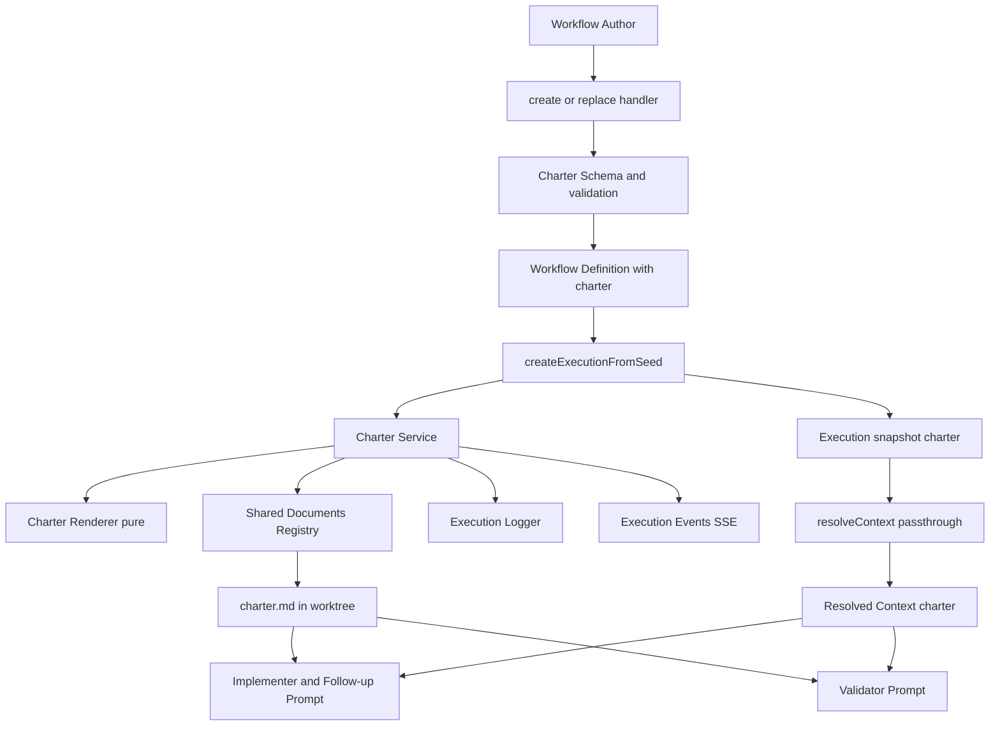
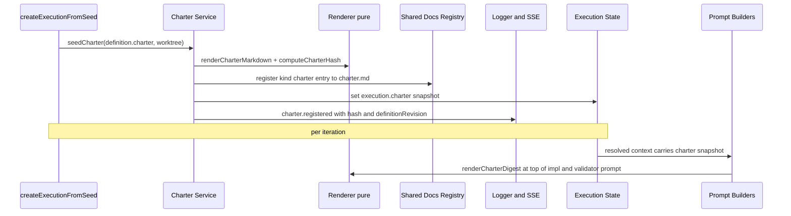
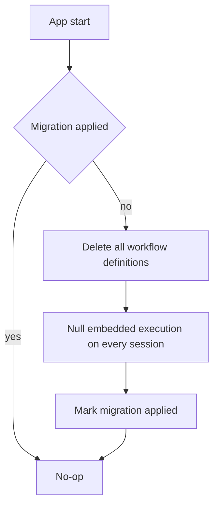

# Design Document

## Overview

**Purpose**: This feature delivers a first-class **Workflow Charter** to the Graph Workflow engine — a single, pre-execution brief that declares a source-of-truth precedence hierarchy and is presented to every implementer and validator so all agents resolve source conflicts identically.

**Users**: Workflow authors (the planner and the human author) declare the charter; implementer and validator agents consume it through their prompts; the operator audits which charter governed a run.

**Impact**: Extends the existing engine. A new **required** `charter` field rides the workflow definition (canonical) and is snapshotted onto each execution it governs. Both prompt builders gain a charter digest at the top, the validator's conflict-resolution guidance is amended to defer to higher-ranked sources, and charter lifecycle events are logged and broadcast. Because the charter is mandatory, a one-time migration removes all pre-charter workflow definitions and executions; the engine never handles a charter-less workflow thereafter.

### Goals
- One workflow-global, structured charter with a ranked source-of-truth list, declared before execution and required on every workflow definition and execution.
- The charter (a deterministic digest at the top of the prompt, full content on demand) reaches every implementer and validator, including follow-up turns.
- Validators stop failing implementations that correctly follow a higher-ranked source over a wrong acceptance criterion; the conflict is recorded instead — the floor/round fix.
- Charter activity is auditable (logged + broadcast); the governing charter is identifiable per run.

### Non-Goals
- `acknowledge_artifact` / read-receipts and any separate charter version field (a charter's version is the workflow-definition revision).
- Structured ESCALATE / appeal / adversarial-verification verdicts (`validator-trust`).
- Planning-time lint such as referenced-path existence and "cite, don't restate" (`spec-lint`).
- Typed deliverables / contract-freeze (`typed-contracts`); approval-gate digest surfacing (`gate-and-steering`); charter UI (`ui-legibility`).
- Per-context charter overrides/subsets; mid-run charter authoring by a context; ongoing support for charter-less records (they are removed once by the migration, not retrofitted for compatibility).

## Boundary Commitments

### This Spec Owns
- The charter data model: the structured `WorkflowCharter` envelope and the ordered `SourceOfTruth` list (rank, id, label, type, locator, description, appliesTo, accessPolicy), plus its validation rules.
- Attaching the charter to the workflow definition (canonical) and snapshotting it onto the governed execution; rendering it to a deterministic digest and to a mirrored Markdown file registered in the shared-documents registry.
- Charter presentation in implementer, follow-up, and validator prompts, and the prompt-level rules for applying the hierarchy.
- The validator behavior change for source-vs-AC conflicts (defer + record in the existing summary) and the implementer citation instruction.
- Charter lifecycle observability (log events + real-time broadcast).
- A one-time migration that deletes pre-charter workflow definitions and clears pre-charter graph-workflow executions.

### Out of Boundary
- Everything in Non-Goals. In particular, the validator's structured output (`summary` + `issues`) is **not** extended; conflicts are recorded in the existing `summary` string. No new MCP tool is added.

### Allowed Dependencies
- `src/lib/workflows/schemas.ts` (definition/execution/shared-doc/resolved-context/SSE schemas), the shared-documents + artifact registry (`shared-documents.ts`, `primitives/artifact-registry.ts`), prompt builders (`iteration-prompt.ts`, `validator-runner.ts`), `resolve-config.ts`, `execution-repository.ts`, `planner-tools.ts`, `execution-logger.ts`, `execution-events.ts`, and the round-trip durability harness + persistence fixture.
- `node:crypto` for the charter content hash. **No** new third-party dependency.
- **Constraint**: the charter must not be routed through the config cascade (`resolveWorkflowConfig`); it is semantic content, attached by passthrough.

### Revalidation Triggers
- Any change to the `WorkflowCharter` / `SourceOfTruth` schema shape (consumed downstream by `validator-trust`, `spec-lint`).
- Adding a persisted field to `GraphWorkflowExecution`, `GraphWorkflowSharedDocumentEntry`, or `workflowSemanticDefinitionSchema` (durability contracts must be extended).
- Changing the validator's conflict-resolution guidance contract (affects `validator-trust`'s ESCALATE work).
- Changing the digest placement or the charter SSE event shape (affects future `ui-legibility`).

## Architecture

### Existing Architecture Analysis
The graph-workflow engine resolves a `GraphWorkflowResolvedContext` per iteration and feeds it to pure prompt builders; agent-facing MCP tools are registered in `tool-server.ts`; per-context commits, lanes, and the land-gate already exist; execution state lives on the session and round-trips to SQLite via the sessions-repo; lifecycle events are recorded by `execution-logger` and broadcast through `execution-events.defaultBroadcast`. The package uses factory + default-deps DI (`createX(deps)` with `{...defaultDeps, ...deps}`), Zod-first schemas with `z.infer`, and `*.contract.test.ts` round-trip durability backstops. This feature composes those primitives; it introduces no new orchestration model and preserves "fresh context per execution context."

### Architecture Pattern & Boundary Map



**Architecture Integration**
- **Selected pattern**: pure-core + thin integration. A small `charter/` module holds pure logic (schema, renderer, hash); integration edits extend existing seams and call into it.
- **Dependency direction**: `charter-schemas` → `charter/render` (pure) → `charter/service` → seed/resolve/prompt/log/SSE integration. Lower layers never import higher ones; prompt builders stay pure and receive the charter via the resolved context.
- **Existing patterns preserved**: factory+deps DI, Zod-first + `z.infer`, shared-documents/artifact registry for the mirrored file, `lifecycle()` + `defaultBroadcast` for observability, sessions-repo durability contract.
- **New components rationale**: the charter schema, the deterministic renderer, and a charter service (the only new orchestration: validate → render → write file → register → snapshot → emit). Everything else is an edit to an existing file.
- **Steering compliance**: composable primitives over a parallel orchestrator; agent-offloading (deterministic render/validation in code, judgment in the prompt); no `any`; no `vi.mock` of internal modules.

### Technology Stack

| Layer | Choice / Version | Role in Feature | Notes |
|-------|------------------|-----------------|-------|
| Backend / Services | TypeScript (strict), Zod v4 | Charter schema, validation, service | `z.infer` types; `superRefine` for rank uniqueness |
| Backend / Services | `node:crypto` | Deterministic charter content hash | Identifies the governing charter in events/snapshot |
| Data / Storage | better-sqlite3 (existing) | Persist definition + execution charter | Optional fields; round-trip durability contracts |
| Messaging / Events | Existing SSE bus (`execution-events`) | Broadcast charter register/update | New event in the `GraphWorkflowSSEEvent` union |

No new third-party dependency is introduced.

## File Structure Plan

### Directory Structure
```
src/lib/workflow-graph/charter/
├── render.ts          # PURE: renderCharterDigest, renderCharterMarkdown, computeCharterHash
└── service.ts         # createWorkflowCharterService(deps): validate -> render -> write file -> register -> snapshot -> emit events

src/lib/workflows/
└── charter-schemas.ts # workflowCharterSchema, sourceOfTruthSchema, accessPolicy/type enums, z.infer types, rank-uniqueness superRefine
```

### Modified Files
- `src/lib/workflows/schemas.ts` — import charter schemas; add **required** `charter` to `workflowSemanticDefinitionSchema` and `graphWorkflowExecutionSchema`, `charter` to `graphWorkflowResolvedContextSchema`, defaulted `kind` to `graphWorkflowSharedDocumentEntrySchema`, and a charter SSE event to the `GraphWorkflowSSEEvent` union.
- `src/lib/workflow-graph/planner-tools.ts` — require `charter` on `createWorkflowSchema`/`replaceWorkflowSchema`; reject absent/invalid charter; pass charter through `inflateToSemanticDefinition`; emit `charter.updated` when a replace changes the charter.
- `src/lib/workflow-graph/execution-repository.ts` — in `createExecutionFromSeed`, invoke the charter service to snapshot `execution.charter`, write the mirrored file, register the `kind:"charter"` entry, and emit `charter.registered`.
- `src/lib/workflow-graph/resolve-config.ts` — `resolveContext` accepts the snapshot charter and attaches it to the resolved context (passthrough, not cascade).
- `src/lib/workflow-graph/iteration-prompt.ts` — add `charter` to `BuildIterationPromptInput` and `BuildFollowUpPromptInput`; prepend the digest + application rule + file pointer in `buildIterationPrompt`; add a compact charter reference line in `buildFollowUpPrompt`; exclude the `kind:"charter"` entry from the generic Shared Documents list; add the implementer citation instruction.
- `src/lib/workflow-graph/validator-runner.ts` — add `charter` to `BuildContextValidationPromptInput`; prepend the digest; amend the evaluation guidance with the precedence + record-conflict-in-summary clause.
- `src/lib/workflow-graph/execution-events.ts` — broadcast the charter SSE event(s).
- `src/lib/state-store/sessions-repo.contract.test.ts` — extend `makeFullSession` to populate `execution.charter` and a `kind:"charter"` shared-doc entry.
- Workflow-definition storage durability (`storage.ts` and its contract test, if present) — extend for the (now required) definition `charter` field; if no definition durability contract exists, add one.
- State-store migration registry (the existing versioned/one-time migration mechanism — confirm its path) — a tracked migration that deletes all workflow definitions and nulls `graphWorkflowExecution` on every persisted session.

> The `kind:"charter"` entry is the only new persisted field on `GraphWorkflowSharedDocumentEntry`; `execution.charter` and `definition.charter` are the new persisted structured fields. All three drive durability-contract edits above.

## System Flows

Charter seed-and-injection (the only non-trivial flow):



Key decisions: the charter is **snapshotted** onto the execution at seed (immutable for the run); the **digest** is recomputed deterministically at each prompt build from that snapshot; the **full charter** is the registered `charter.md`. A replace that changes the charter affects only future executions.

## Requirements Traceability

| Requirement | Summary | Components | Interfaces | Flows |
|-------------|---------|------------|------------|-------|
| 1.1, 1.2, 1.3 | Charter envelope + ranked source list | Charter Schema | `workflowCharterSchema`, `sourceOfTruthSchema` | — |
| 1.4 | Reject malformed charter | Charter Schema, Definition Acceptance | `superRefine`, create/replace validation | — |
| 1.5 | Workflow-global, no override | Resolved-Context Passthrough | `resolveContext(charter)` | seed/inject |
| 2.1, 2.2 | Charter required for new defs | Definition Acceptance | `createWorkflowSchema`/`replaceWorkflowSchema` | — |
| 2.3 | No mid-run charter change | Charter Service, tool-server (no charter mutation path) | seed-only registration | seed |
| 2.4 | New executions only | Charter Service (snapshot at seed) | `execution.charter` | seed |
| 3.1 | Charter required on definition + execution | Persistence & Schema | required `charter` | — |
| 3.2, 3.3, 3.4 | One-time migration removes pre-charter records | Legacy Purge Migration | delete defs, clear executions | migration |
| 4.1, 4.2, 4.5 | Charter in impl + validator prompts, same content | Prompt Injection, Resolved-Context Passthrough | `BuildIterationPromptInput`, `BuildContextValidationPromptInput` | inject |
| 4.3 | Digest at top + full on demand | Charter Renderer, Charter Service | `renderCharterDigest`, `charter.md` entry | inject |
| 4.4 | Charter persists across follow-up turns | Prompt Injection | `BuildFollowUpPromptInput` | inject |
| 5.1, 5.5 | Apply precedence within scope | Prompt Injection, Charter Renderer | digest application rule, `appliesTo` | inject |
| 5.2, 5.3 | Validator defers + records conflict | Prompt Injection (validator guidance) | existing `summary` field | inject |
| 5.4 | Implementer cites governing source | Prompt Injection (implementer instruction) | existing `complete_task` `summary` | inject |
| 6.1, 6.2, 6.4 | External sources read-only, never auto-accessed | Charter Service, Charter Schema | `accessPolicy`, worktree-confined writer | seed |
| 6.3 | Out-of-worktree access needs permission | Prompt Injection (instruction); no auto-access path | digest external-source note | inject |
| 7.1, 7.2 | Charter registered/updated events logged | Charter Service, Definition Acceptance | `lifecycle("charter.registered"/"charter.updated")` | seed/replace |
| 7.3 | Real-time broadcast | Observability | charter SSE event | seed/replace |
| 7.4 | Governing charter identifiable per run | Charter Service | `execution.charter` + hash | seed |

## Components and Interfaces

| Component | Domain/Layer | Intent | Req Coverage | Key Dependencies (P0/P1) | Contracts |
|-----------|--------------|--------|--------------|--------------------------|-----------|
| Charter Schema | Types | Charter envelope + source list + validation | 1.1–1.4, 6.1 | schemas.ts (P0) | State |
| Charter Renderer | Logic (pure) | Digest, full markdown, content hash | 4.3, 5.1, 5.5 | Charter Schema (P0) | Service |
| Charter Service | Service | Validate→render→write→register→snapshot→emit | 2.3, 2.4, 4.3, 6.x, 7.x | Renderer (P0), Shared Docs (P0), Logger/SSE (P1) | Service, Event |
| Definition Acceptance | Planner | Require/validate charter at create/replace | 1.4, 2.1, 2.2, 3.x, 7.2 | Charter Schema (P0), planner-tools (P0) | Service |
| Resolved-Context Passthrough | Config | Attach workflow-global charter to context | 1.5, 4.1, 4.2, 4.5 | resolve-config (P0) | State |
| Prompt Injection | Prompt | Digest at top, follow-up ref, guidance change, citation | 4.x, 5.x, 6.3 | Renderer (P0), prompt builders (P0) | Service |
| Persistence & Schema | Data | Required charter fields + durability | 3.1 | sessions-repo, storage (P0) | State |
| Legacy Purge Migration | Data | One-time delete of pre-charter records | 3.2, 3.3, 3.4 | state-store migrations (P0) | Batch |
| Observability | Events | Log + broadcast charter lifecycle | 7.1–7.4 | execution-logger, execution-events (P0) | Event |

### Types & Logic

#### Charter Schema
| Field | Detail |
|-------|--------|
| Intent | Define and validate the charter data model |
| Requirements | 1.1, 1.2, 1.3, 1.4, 6.1 |

**Responsibilities & Constraints**
- Source of truth for the `WorkflowCharter` and `SourceOfTruth` shapes; types derived via `z.infer`.
- `mission` and a non-empty `sourcesOfTruth` are required; other narrative sections are optional.
- `superRefine` enforces unique precedence ranks; missing required fields fail `parse`. These errors surface at definition-accept time (1.4).

**Contracts**: State ☑

##### State Management
```typescript
type SourceType = "code" | "config" | "document" | "spec" | "other";
type AccessPolicy = "worktree-relative" | "external-readonly";

interface SourceOfTruth {
  rank: number;            // positive int, unique within the charter; lower = higher authority
  id: string;              // stable identifier
  label: string;
  type: SourceType;
  locator: string;         // path/glob/URI; not auto-resolved
  description: string;
  appliesTo?: string;      // applicability scope; precedence evaluated within it (5.5)
  accessPolicy: AccessPolicy;
}

interface WorkflowCharter {
  mission: string;
  conventions?: string[];
  nonGoals?: string[];
  vocabulary?: string[];
  ownershipMap?: string;
  testStrategy?: string;
  knownAmbiguities?: string[];
  sourcesOfTruth: SourceOfTruth[];   // non-empty, ranks unique
}
```
- Invariants: ranks unique; `sourcesOfTruth` non-empty; `accessPolicy` constrains downstream file access.

#### Charter Renderer (pure)
| Field | Detail |
|-------|--------|
| Intent | Deterministic digest, full markdown, content hash |
| Requirements | 4.3, 5.1, 5.5, 7.4 |

**Contracts**: Service ☑
```typescript
interface CharterRenderer {
  renderCharterDigest(charter: WorkflowCharter): string;   // budgeted; mission + ranked sources + nonGoals + application rule
  renderCharterMarkdown(charter: WorkflowCharter): string; // full document written to charter.md
  computeCharterHash(charter: WorkflowCharter): string;    // sha256 over canonical JSON; identifies the governing charter
}
```
- Pure functions, no I/O — directly unit-testable. The digest renders the ranked hierarchy (with `appliesTo` scope and `accessPolicy`) and the fixed application rule ("higher-ranked source prevails; flag the AC rather than fail the implementer").

### Service Layer

#### Charter Service
| Field | Detail |
|-------|--------|
| Intent | Seed-time orchestration of the charter |
| Requirements | 2.3, 2.4, 4.3, 6.1, 6.2, 6.4, 7.1, 7.4 |

**Responsibilities & Constraints**
- At execution seed: validate (defensive), render markdown, write `charter.md` **inside the worktree only**, register a `kind:"charter"` shared-document entry, set the `execution.charter` snapshot, and emit `charter.registered`.
- Never reads/writes/validates a source whose `accessPolicy` is `external-readonly`; confines all file writes to `.cc/graph-workflow-docs/` (6.1, 6.2, 6.4).
- Provides no path to mutate the charter after seed (2.3); the snapshot makes the run immutable against later definition edits (2.4).

**Dependencies**
- Outbound: Charter Renderer — digest/markdown/hash (P0); Shared Documents Registry — register the file entry (P0); Execution Logger + Execution Events — observability (P1).

**Contracts**: Service ☑ / Event ☑
```typescript
interface WorkflowCharterService {
  seedCharter(input: {
    charter: WorkflowCharter;
    worktreePath: string;
    execution: GraphWorkflowExecution;
  }): Promise<{ nextExecution: GraphWorkflowExecution; charterHash: string }>;
}
```
- Preconditions: `charter` parses; `worktreePath` is the session worktree.
- Postconditions: `charter.md` exists in the worktree; a `kind:"charter"` entry is registered; `execution.charter` set; `charter.registered` logged + broadcast.

##### Event Contract
- Published: `charter.registered` (seed), `charter.updated` (replace that changes the charter) → execution log + a `graph-workflow-charter-registered`/`...-updated` SSE event carrying `{ executionId, definitionId, definitionRevision, charterHash }`.
- Delivery: best-effort broadcast via existing `defaultBroadcast`; the log entry is authoritative.

**Implementation Notes**
- Integration: invoked from `createExecutionFromSeed`; replaces the implicit empty `sharedDocuments` for charter-bearing workflows by adding the charter entry. Built via `createWorkflowCharterService(deps)` with injected writer/registry/logger/broadcast.
- Validation: rank-uniqueness already guaranteed at accept time; the service re-`parse`s defensively (internal/trusted data).
- Integrity: governance derives from the immutable `execution.charter` snapshot and the digest computed from it; the registered `charter.md` is a read-only convenience copy, so a stray edit to that file (e.g. via write tools) does not change the governing charter (2.3). No engine code path mutates `execution.charter` or `definition.charter` during a run.
- Risks: a non-charter workflow must skip the service entirely (guard on `definition.charter` presence) to preserve 3.1/3.2.

#### Definition Acceptance (planner-tools)
| Field | Detail |
|-------|--------|
| Intent | Require + validate the charter when a definition is created/replaced |
| Requirements | 1.4, 2.1, 2.2, 7.2 |

**Responsibilities & Constraints**
- `createWorkflowSchema`/`replaceWorkflowSchema` and the **persisted** `workflowSemanticDefinitionSchema` all require `charter`; a submission lacking one (2.2) or failing charter validation (1.4) is rejected, surfacing the offending entry. Presence is enforced uniformly at the schema level — there is no input-vs-persisted split.
- On replace whose charter content hash differs, emit `charter.updated` (7.2); the change governs only future executions (2.4).

**Contracts**: Service ☑
- Errors: `charter_missing`, `charter_invalid` (returned through the existing handler error path), surfaced to the caller before persistence.

### Config & Prompt Layer

#### Resolved-Context Passthrough (resolve-config)
| Field | Detail |
|-------|--------|
| Intent | Make the workflow-global charter available to prompt builders |
| Requirements | 1.5, 4.1, 4.2, 4.5 |

**Responsibilities & Constraints**
- `resolveContext` accepts the snapshot charter and sets `resolvedContext.charter`; the same charter is attached to **every** context (workflow-global; no per-context override, 1.5) and is identical for implementer and validator (4.5).
- Explicitly **not** merged through `resolveWorkflowConfig`'s cascade.

**Contracts**: State ☑

#### Prompt Injection (iteration-prompt, validator-runner)
| Field | Detail |
|-------|--------|
| Intent | Present the charter and apply its rules in prompts |
| Requirements | 4.1, 4.2, 4.3, 4.4, 4.5, 5.1, 5.2, 5.3, 5.4, 5.5, 6.3 |

**Responsibilities & Constraints**
- `buildIterationPrompt`: prepend `# Workflow Charter` (the rendered digest) + the application rule + a pointer to `charter.md` at the **top**, before the context header; exclude the `kind:"charter"` entry from the generic Shared Documents list; add the implementer instruction to cite the governing source in the `complete_task` summary on conflict (5.4) and that external sources are read-only/permission-gated (6.3).
- `buildFollowUpPrompt`: include a compact charter reference line (id + "see charter.md") on every continuation turn of a live session. A fresh agent session is re-seeded via `buildIterationPrompt`, so it receives the full digest again — satisfying 4.4 without a special "fresh session" flag.
- `buildContextValidationPrompt`: prepend the same digest; amend the evaluation guidance — "when an acceptance criterion conflicts with a higher-ranked source and the implementation follows the higher source, do not fail the context for that mismatch; record the conflict (criterion, prevailing source, resolution) in your `summary`" (5.2, 5.3). Precedence is evaluated within each source's `appliesTo` scope (5.5).

**Contracts**: Service ☑ (pure builders; charter supplied via input)
**Implementation Notes**
- Validation: builders remain pure and deterministic; the validator's structured output schema is **unchanged** — the conflict lives in the existing `summary`.
- Risks: prompt-size growth is bounded by the digest budget; full content stays in the file. Top placement is fixed regardless of whether SDK prompt-caching is engaged.

### Data & Observability

#### Persistence & Schema
| Field | Detail |
|-------|--------|
| Intent | Persist required charter fields and prove durability |
| Requirements | 3.1 |

**Contracts**: State ☑
- New persisted fields: `definition.charter` (**required**), `execution.charter` (**required** snapshot), and `sharedDocumentEntry.kind` (defaulted `"shared"`). A persisted record lacking a charter fails schema validation (3.1).
- The sessions-repo contract (`makeFullSession`) and the definition-storage durability contract always populate and round-trip a charter (plus the `kind` field); a dropped field fails the suite rather than escaping to live verification.

#### Legacy Purge Migration
| Field | Detail |
|-------|--------|
| Intent | One-time removal of pre-charter records |
| Requirements | 3.2, 3.3, 3.4 |

**Responsibilities & Constraints**
- Runs once at application start, before any reader that would otherwise quarantine charter-less rows; tracked by the existing migration mechanism so a repeat run is a no-op (3.3).
- Deletes all workflow definitions and nulls the embedded `graphWorkflowExecution` on every persisted session — executions live inside `SessionState`, so a table drop is insufficient (3.2, 3.4).

**Contracts**: Batch ☑
- Trigger: application start / migration runner. Idempotent. Irreversible — see Migration Strategy for the shared-database blast radius.

#### Observability
| Field | Detail |
|-------|--------|
| Intent | Log + broadcast charter lifecycle; identify the governing charter |
| Requirements | 7.1, 7.2, 7.3, 7.4 |

**Contracts**: Event ☑
- `execution-logger.lifecycle("charter.registered" | "charter.updated", { charterHash, definitionRevision, ... })`; the `GraphWorkflowSSEEvent` union gains a charter event broadcast via `defaultBroadcast`. The `execution.charter` snapshot + `charterHash` make the governing charter identifiable per run (7.4).

## Error Handling

### Error Strategy
Fail fast at definition-accept time; degrade gracefully at runtime so a charter problem never silently corrupts a run.

### Error Categories and Responses
- **User errors (definition input)**: missing charter → `charter_missing` rejection (2.2); malformed source entry / duplicate or missing rank → `charter_invalid` identifying the entry (1.4). Both block persistence. The charter is required at the schema level, so a charter-less record also fails validation on load; pre-charter records are removed once by the Legacy Purge Migration rather than tolerated (3.x).
- **System errors (seed/runtime)**: if rendering or registering the mirrored file fails, the seed surfaces a precise diagnostic and halts before the first iteration (no partial charter state); this is an infrastructure-class failure (it must not consume iterations or feed the circuit breaker, consistent with `failure-taxonomy`).
- **Business-logic (conflict)**: a source-vs-AC conflict is **not** an error — it is the designed path: the validator records it in `summary` and passes (5.2, 5.3).

### Monitoring
`charter.registered`/`charter.updated` log + SSE events; the governing `charterHash` recorded on the execution.

## Migration Strategy

The charter is required, so pre-charter workflow definitions and executions cannot satisfy the schema. A single tracked migration removes them.



- **Trigger & idempotency**: runs once at application start via the existing migration runner, before any reader that would otherwise quarantine charter-less rows; tracked so a repeat run is a no-op (3.3).
- **Embedded executions**: graph-workflow executions are stored inside `SessionState`, so the migration nulls the embedded `graphWorkflowExecution` on each session rather than dropping a table; otherwise a session carrying a legacy charter-less execution could be quarantined wholesale once the field is required (3.2, 3.4).
- **Shared-database blast radius (confirmed — global delete)**: `command-center.db` is a single database shared across all branches, worktrees, and sessions, so this delete removes workflow definitions and executions for **every** session and branch, not only this feature's worktree, and is irreversible (pre-charter run audit history is lost). The operator has confirmed this global reset is intended.
- **Non-destructive alternative (not chosen)**: the shared-database read boundary already quarantines rows it cannot parse, so making `charter` required would, on its own, make this branch ignore legacy charter-less rows without deleting them (branch-local, non-destructive). The explicit one-time delete is chosen per the operator's decision; if the only goal were "this branch must not choke on legacy rows," the quarantine alone would suffice.

## Testing Strategy

### Unit Tests (pure)
- `renderCharterDigest` is deterministic and budget-bounded; renders the ranked hierarchy with `appliesTo`/`accessPolicy` and the application rule (4.3, 5.1, 5.5).
- `computeCharterHash` is stable across equal charters and changes when high-authority content changes (7.4).
- Charter schema rejects duplicate/missing ranks and missing required fields; accepts a maximal valid charter (1.4, 1.2).

### Integration Tests
- `create_graph_workflow` rejects a definition with no charter (2.2) and one with an invalid charter (1.4); a charter-less definition or execution fails schema validation rather than loading (3.1).
- The Legacy Purge Migration deletes all pre-charter workflow definitions and clears pre-charter embedded executions, runs at most once, is idempotent, and leaves no charter-less record afterward (3.2, 3.3, 3.4).
- Seed propagation writes `charter.md` in the worktree, registers a `kind:"charter"` entry, sets `execution.charter`, and emits `charter.registered` (4.3, 6.4, 7.1); a replace that changes the charter emits `charter.updated` and leaves a running execution's snapshot unchanged (2.4, 7.2).
- Implementer prompt carries the digest at the top and omits the charter from the generic list; validator prompt carries the digest + amended guidance; follow-up prompt carries the charter reference; both roles receive identical charter content (4.1, 4.2, 4.4, 4.5).
- Round-trip durability: a fully populated `execution.charter` + `kind:"charter"` entry survive persist→reload via the sessions-repo contract; the definition charter survives the definition-storage contract (3.x).

### Behavioral Fixture (the floor/round reproduction)
- A workflow whose acceptance criterion contradicts a higher-ranked code source: the validator, seeing the implementation follow the higher-ranked source, does **not** fail the context and records the conflict in its `summary` (5.2, 5.3). This is the primary acceptance test for the feature's intent.

### Real-time
- A `charter.registered` SSE event is broadcast to connected clients on seed (7.3).
