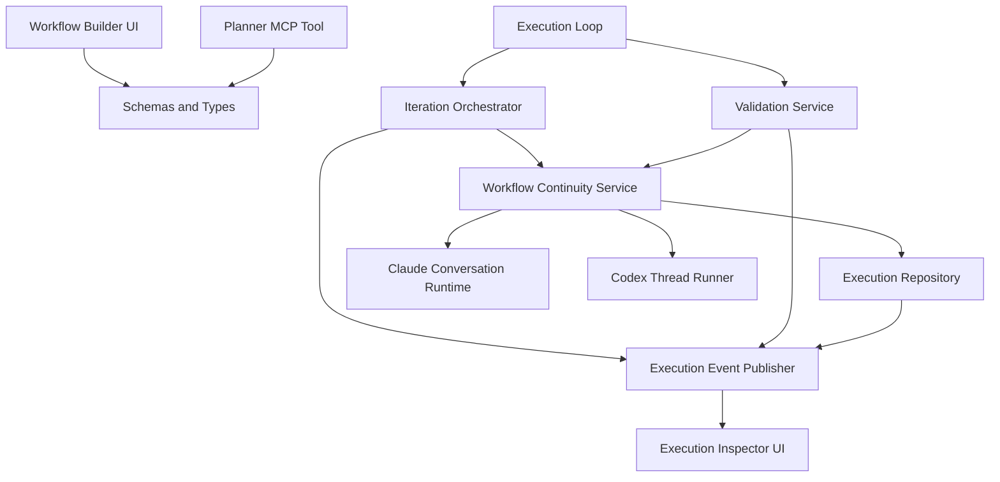
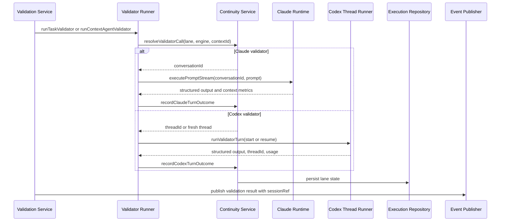
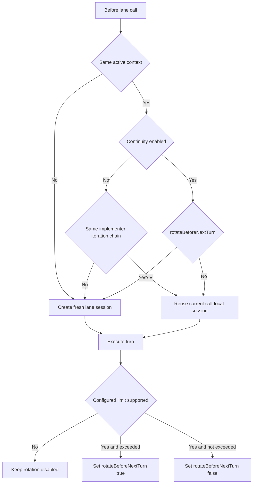

# Design Document

## Overview

Workflow continuity extends graph workflow execution so each execution context can maintain three separate conversational lanes: implementer, task-level validator, and execution-context-level validator. The feature preserves today's ability to start fresh sessions, but changes the default to continuity-on and introduces one explicit context-limit model per lane.

This feature is for operators who rely on graph workflows for unattended or semi-attended development. It changes the current runtime from "fresh conversation per implementer iteration and validator invocation" to "lane-specific continuity within one execution context," while preserving strict resets when execution advances into a new execution context.

The design builds on existing graph workflow persistence and the current Claude conversation stack. It adds explicit continuity configuration, persisted lane runtime state, a focused continuity service, validator history linkage, and a minimal CC-owned Codex review artifact per validator turn. It does not add a new execution engine or a new transcript subsystem.

### Goals
- Reuse implementer, task-validator, and execution-context-validator sessions independently within one execution context.
- Replace soft/hard limit behavior and hidden 85 percent heuristics with one explicit post-turn context-limit policy.
- Preserve continuity and reviewability across restart without weakening execution-context isolation.

### Non-Goals
- Building a new graph workflow runtime separate from the current execution loop.
- Introducing a CC-native Codex thread transcript viewer.
- Supporting hidden fallback heuristics when no context limit is configured.
- Automatic migration or compatibility for legacy soft/hard workflow definitions or executions.

## Architecture

### Existing Architecture Analysis

The current graph workflow runtime already has the right aggregate boundary for this feature. `graphWorkflowExecution` is session-scoped, survives restart, and already owns mutable runtime state such as task status, retry state, shared documents, and validation history. Implementer work is orchestrated by `iteration-orchestrator.ts`, while validator work is dispatched from `execution-route-handlers.ts` through `validator-runner.ts`.

Claude continuity primitives already exist outside the graph workflow domain. Conversations persist `claudeSessionId`, transcript paths, and context metrics, and `executePromptStream()` already resumes Claude sessions through the conversation machine. By contrast, Codex validators currently run as one-shot turns through `runCodexDefault()`, even though the installed SDK supports persisted threads and `resumeThread()`.

The design therefore preserves the current graph workflow runtime and extends it at the boundaries where implementer and validator turns are chosen, executed, and recorded.

This feature is a hard schema cutover. Legacy workflow definitions and active executions that still contain `contextSoftLimitTokens` or `contextHardLimitTokens` are not migrated and are not accepted. Instead, CC performs explicit legacy-schema rejection with operator-facing errors at workflow-definition load/save/start boundaries and at graph-workflow execution recovery boundaries.

### Architecture Pattern & Boundary Map



**Architecture Integration**
- **Selected pattern**: Hybrid extension of the current graph workflow runtime with one new continuity-focused service and one small Codex runner boundary.
- **Domain boundaries**:
  - Workflow definition config remains on `GraphWorkflowExecutionContextDefinition`.
  - Active lane state remains on `GraphWorkflowExecution`.
  - Claude execution stays in the existing conversation domain.
  - Codex continuity stays in a dedicated runner that owns thread start/resume details.
- **Existing patterns preserved**:
  - Schema-first state modeling in `src/lib/schemas.ts`
  - Session-scoped runtime persistence in `state.json`
  - DI-friendly orchestration modules and focused helper services
  - Existing transcript viewer and validation history surfaces
- **New components rationale**:
  - A continuity service is needed to keep lane policy and rotation out of orchestration files.
  - A Codex thread runner is needed because Codex continuity is thread-based, not conversation-based.
- **Steering compliance**:
  - No new storage system
  - No new background workflow engine
  - No new dependency required for the feature

### Technology Stack

| Layer | Choice / Version | Role in Feature | Notes |
|-------|------------------|-----------------|-------|
| Frontend | Next.js 16.1.6, React 19.2.4 | Workflow builder and execution inspector updates | No new UI framework |
| Backend / Services | TypeScript strict, existing graph workflow modules | Continuity resolution, lane execution, history linkage | Reuses current module boundaries |
| AI Runtime | `@anthropic-ai/claude-agent-sdk` 0.2.81 | Claude lane reuse via existing conversations | Uses persisted conversation/session state |
| AI Runtime | `@openai/codex-sdk` 0.118.0 | Codex validator continuity via persisted thread IDs | Uses `startThread()` and `resumeThread()` |
| Data / Storage | Zod v4 + `state.json` + transcript JSONL | Continuity config, lane runtime state, validation history | No new database tables |
| Messaging / Events | Existing graph workflow SSE events | Validator history linkage and UI refresh | Extend existing validation result payloads |

## System Flows

### Implementer Lane Resolution

```mermaid
sequenceDiagram
    participant Loop as Execution Loop
    participant Orch as Iteration Orchestrator
    participant Cont as Continuity Service
    participant Prompt as Claude Conversation Runtime
    participant Repo as Execution Repository

    Loop->>Orch: runIteration or follow-up turn
    Orch->>Cont: resolveImplementerCall(execution, contextId, iterationId)
    alt reuse existing lane
        Cont-->>Orch: conversationId reused, promptMode follow_up_or_seed
    else create or rotate
        Cont->>Repo: persist new implementer lane state
        Cont-->>Orch: fresh conversationId, promptMode iteration_seed
    end
    Orch->>Prompt: executePromptStream(conversationId, prompt)
    Prompt-->>Orch: turn result with context metrics
    Orch->>Cont: recordClaudeTurnOutcome(lane=implementer)
    Cont->>Repo: update metrics and rotateBeforeNextTurn
    Orch->>Repo: persist task progress and iteration state
```

Flow decisions:
- A fresh implementer conversation is always created when the execution context changes.
- When the continuity service rotates an implementer session mid-context, the orchestrator sends the full iteration seed prompt built from current execution state rather than a delta-only follow-up prompt.
- When no implementer context limit is configured, the continuity service performs no limit-based rotation logic.

### Validator Lane Resolution



Flow decisions:
- Task-validator and execution-context-validator lanes never share state, even when they use the same engine.
- If a configured validator context limit cannot be evaluated for the selected engine, the continuity service records that the limit is unsupported and leaves rotation disabled for that lane.
- Validator history events always carry a session reference describing the lane and engine that produced the outcome.

### Lane Rotation Decision Flow



## Requirements Traceability

| Requirement | Summary | Components | Interfaces | Flows |
|-------------|---------|------------|------------|-------|
| 1.1, 1.2, 1.3 | Per-lane continuity config exists | Continuity config schema, Workflow Builder UI, Planner tool | `GraphWorkflowLaneContinuityPolicy` | Lane Rotation Decision Flow |
| 1.4 | Continuity defaults to enabled | Continuity config schema | `GraphWorkflowLaneContinuityPolicy` defaults | Lane Rotation Decision Flow |
| 1.5 | One context limit per lane | Continuity config schema, Continuity service | `GraphWorkflowLaneContinuityPolicy` | Implementer, Validator |
| 1.6 | Context limit optional | Continuity config schema, Continuity service | `GraphWorkflowLaneContinuityPolicy` | Implementer, Validator |
| 2.1, 2.6 | Disabled implementer continuity does not cross iteration boundaries | Continuity service, Iteration orchestrator | `resolveImplementerCall()` | Implementer Lane Resolution |
| 2.2, 2.3 | Enabled implementer continuity reuses within a context until over limit | Continuity service, Lane state model | `recordClaudeTurnOutcome()` | Implementer Lane Resolution |
| 2.4 | Over-limit implementer lane rotates before the next call | Continuity service, Lane state model | `rotateBeforeNextTurn` state | Implementer Lane Resolution |
| 2.5 | No-limit disabled mode lets current iteration finish naturally | Continuity service, Iteration orchestrator | `resolveImplementerCall()` prompt mode rules | Lane Rotation Decision Flow |
| 3.1, 3.6 | Task-validator continuity is independent and engine-aware | Continuity service, Validator runner | `resolveValidatorCall()` | Validator Lane Resolution |
| 3.2 | Disabled task-validator continuity starts fresh per invocation | Continuity service | `resolveValidatorCall()` | Validator Lane Resolution |
| 3.3, 3.4 | Enabled task-validator continuity reuses until over limit | Continuity service, Lane state model | `recordClaudeTurnOutcome()`, `recordCodexTurnOutcome()` | Validator Lane Resolution |
| 3.5 | Over-limit task-validator lane rotates before the next invocation | Continuity service | `rotateBeforeNextTurn` state | Validator Lane Resolution |
| 4.1, 4.6 | Context-validator continuity is independent and engine-aware | Continuity service, Validator runner | `resolveValidatorCall()` | Validator Lane Resolution |
| 4.2 | Disabled context-validator continuity starts fresh per invocation | Continuity service | `resolveValidatorCall()` | Validator Lane Resolution |
| 4.3, 4.4 | Enabled context-validator continuity reuses until over limit | Continuity service, Lane state model | `recordClaudeTurnOutcome()`, `recordCodexTurnOutcome()` | Validator Lane Resolution |
| 4.5 | Over-limit context-validator lane rotates before the next invocation | Continuity service | `rotateBeforeNextTurn` state | Validator Lane Resolution |
| 5.1, 5.2 | Implementer and validator lanes remain isolated | Lane state model, Validation event `sessionRef` | `GraphWorkflowLaneState`, `GraphWorkflowExecutionSessionRef` | Implementer, Validator |
| 5.3, 5.4 | Context changes reset all lane state | Continuity service, Workflow manager | `clearForNewContext()` | Lane Rotation Decision Flow |
| 6.1 | Single limit model replaces soft/hard behavior | Continuity config schema, Continuity service | `GraphWorkflowLaneContinuityPolicy` | Lane Rotation Decision Flow |
| 6.2, 6.3 | No configured limit disables limit logic and removes heuristics | Continuity service, Iteration orchestrator | `record*TurnOutcome()` evaluation rules | Implementer, Validator |
| 6.4, 6.5 | Unsupported validator engines disable limit rotation instead of approximating | Codex thread runner, Continuity service | `GraphWorkflowLaneState.limitEvaluation` | Validator Lane Resolution |
| 7.1, 7.2 | Continuity survives restart through persisted state | Lane state model, Cutover guard, Execution repository | `GraphWorkflowLaneState` | Implementer, Validator |
| 7.3, 7.4 | Reused sessions remain reviewable without per-invocation transcripts | Task state, Validation history event, Execution inspector | `lastConversationId`, `GraphWorkflowExecutionSessionRef`, `GraphWorkflowValidationReviewArtifact` | Validator Lane Resolution |

## Components and Interfaces

| Component | Domain / Layer | Intent | Req Coverage | Key Dependencies | Contracts |
|-----------|----------------|--------|--------------|------------------|-----------|
| Continuity Config Schema | Domain / Persistence | Define continuity settings for implementer and validator lanes | 1.1, 1.2, 1.3, 1.4, 1.5, 1.6, 6.1, 6.2, 6.3 | `schemas.ts` (P0), Planner tool (P1), Builder UI (P1) | State |
| Legacy Schema Cutover Guard | Domain / Persistence | Reject legacy soft/hard workflow definitions and executions with clear operator-facing errors | 1.1, 1.2, 1.3, 1.4, 1.5, 1.6, 6.1, 7.1, 7.2 | Workflow storage (P0), Execution repository and state loading (P0) | Service, State |
| Lane Runtime State Model | Domain / Persistence | Persist active lane session state and post-turn rotation flags | 2.2, 2.3, 2.4, 2.5, 2.6, 3.3, 3.4, 3.5, 4.3, 4.4, 4.5, 5.1, 5.2, 5.3, 5.4, 7.1, 7.2, 7.3, 7.4 | Execution repository (P0), Event publisher (P1) | State, Event |
| Workflow Continuity Service | Runtime / Orchestration | Resolve reuse vs rotation and record lane outcomes | 2.1, 2.2, 2.3, 2.4, 2.5, 2.6, 3.1, 3.2, 3.3, 3.4, 3.5, 3.6, 4.1, 4.2, 4.3, 4.4, 4.5, 4.6, 5.1, 5.2, 5.3, 5.4, 6.1, 6.2, 6.3, 6.4, 6.5, 7.1, 7.2 | Execution repository (P0), Conversation service (P0), Codex runner (P1) | Service, State |
| Implementer Continuity Integration | Runtime / Orchestration | Apply continuity rules to implementer iteration and follow-up turns | 2.1, 2.2, 2.3, 2.4, 2.5, 2.6, 5.3, 5.4, 6.1, 6.2, 6.3 | Iteration orchestrator (P0), Continuity service (P0), Prompt runtime (P0) | Service, State |
| Validator Continuity Integration | Runtime / Orchestration | Apply continuity rules to task and context validators and persist review artifacts | 3.1, 3.2, 3.3, 3.4, 3.5, 3.6, 4.1, 4.2, 4.3, 4.4, 4.5, 4.6, 5.1, 5.2, 6.4, 6.5, 7.1, 7.2, 7.3, 7.4 | Validation service (P0), Validator runner (P0), Continuity service (P0) | Service, Event, State |
| Codex Thread Runner | Runtime / External Integration | Start or resume Codex threads and return thread metadata plus review payloads | 3.6, 4.6, 6.4, 6.5, 7.1, 7.2, 7.3, 7.4 | `@openai/codex-sdk` (P0), Config (P1) | Service |
| Workflow Builder Continuity UI | UI / Config | Edit continuity defaults and context limits in-place | 1.1, 1.2, 1.3, 1.4, 1.5, 1.6, 6.1, 6.2, 6.3 | `WorkflowInspectorPanel` (P0), Schema types (P0) | State |
| Validation History Linkage UI | UI / Observability | Show validator lane session references and Codex review artifacts in execution history | 5.1, 5.2, 7.3, 7.4 | Execution inspector (P0), Validation result event (P0) | Event, State |

### Domain / Persistence

#### Continuity Config Schema

| Field | Detail |
|-------|--------|
| Intent | Model continuity-on/off and optional context limits at the same places users already configure implementers and validators |
| Requirements | 1.1, 1.2, 1.3, 1.4, 1.5, 1.6, 6.1, 6.2, 6.3 |

**Responsibilities & Constraints**
- Replace `contextSoftLimitTokens` and `contextHardLimitTokens` with one reusable continuity policy object.
- Default `enabled` to `true` for implementer, task-validator, and execution-context-validator lanes.
- Keep `contextLimitTokens` optional so "no limit configured" is explicit and first-class.

**Dependencies**
- Inbound: Workflow builder UI — reads and mutates execution-context config (P0)
- Inbound: Planner MCP tool — generates workflow definitions (P1)
- Outbound: Continuity service — consumes normalized policy values (P0)

**Contracts**: Service [ ] / API [ ] / Event [ ] / Batch [ ] / State [x]

##### State Management
- **State model**:

```typescript
interface GraphWorkflowLaneContinuityPolicy {
  enabled: boolean;
  contextLimitTokens?: number;
}

interface GraphWorkflowIterationPolicy {
  maxIterations: number;
  continuity: GraphWorkflowLaneContinuityPolicy;
}

interface GraphWorkflowAgentValidatorConfig {
  enabled: boolean;
  instructions: string;
  continuity: GraphWorkflowLaneContinuityPolicy;
}
```

- **Persistence & consistency**:
  - Policies are part of the workflow definition and therefore copied into `workingDefinition` when execution starts.
  - No runtime mutation of policy values occurs during execution.
- **Concurrency strategy**:
  - Standard execution update locking through the existing `mutateSession()` write path.

**Implementation Notes**
- Integration: Builder UI and planner tool must stop emitting legacy soft/hard fields in the same change set that introduces `continuity`.
- Validation: `contextLimitTokens` must be a positive integer when provided.
- Risks: This is a breaking schema cutover, so save, load, start, and recovery boundaries must all use the same rejection rules.

#### Legacy Schema Cutover Guard

| Field | Detail |
|-------|--------|
| Intent | Enforce the no-backward-compatibility cutover by rejecting legacy workflow definitions and executions before they enter the new runtime |
| Requirements | 1.1, 1.2, 1.3, 1.4, 1.5, 1.6, 6.1, 7.1, 7.2 |

**Responsibilities & Constraints**
- Detect legacy graph workflow payloads that still contain `contextSoftLimitTokens` or `contextHardLimitTokens`.
- Reject legacy workflow definitions on load, save, and execution start with explicit operator-facing errors.
- Reject active legacy executions during graph-workflow recovery or resume; do not attempt migration, normalization, or read-union parsing.
- Apply the same rule to persisted `workingDefinition` payloads embedded in active executions.

**Dependencies**
- Inbound: Workflow storage service — reads persisted workflow definitions (P0)
- Inbound: Graph workflow execution repository and recovery path — reads active execution payloads (P0)
- Outbound: Builder and execution APIs — surface explicit rejection messages (P1)

**Contracts**: Service [x] / API [ ] / Event [ ] / Batch [ ] / State [x]

##### Service Interface
```typescript
interface GraphWorkflowSchemaCutoverGuard {
  assertDefinitionSupported(rawDefinition: unknown): WorkflowSemanticDefinition;
  assertExecutionSupported(rawExecution: unknown): GraphWorkflowExecution;
}
```

- Preconditions:
  - Input is the raw persisted workflow-definition or execution payload before graph-workflow-specific strict parsing.
- Postconditions:
  - Accepted payloads are guaranteed not to contain removed soft/hard continuity fields.
  - Rejected payloads produce explicit legacy-schema errors instead of generic parse failures.
- Invariants:
  - No automatic migration path exists.
  - No legacy workflow definition or legacy active execution enters the continuity runtime.

##### State Management
- **State model**:
  - The guard inspects raw persisted graph workflow payloads and passes only supported payloads into the strict graph workflow schemas.
- **Persistence & consistency**:
  - Rejection does not mutate persisted legacy payloads.
  - Operators must recreate legacy workflow definitions and clear legacy executions manually.
- **Concurrency strategy**:
  - The guard runs synchronously at graph-workflow read boundaries and does not introduce a new mutable store.

**Implementation Notes**
- Integration: The rejection must happen before graph-workflow-specific strict parsing so the user gets a targeted error instead of an opaque schema failure.
- Validation: Error messages should name the removed fields and instruct the operator to recreate the workflow definition or clear the stale execution.
- Risks: If any read path bypasses the guard, the rollout becomes inconsistent and unsafe.

#### Lane Runtime State Model

| Field | Detail |
|-------|--------|
| Intent | Persist the active session reference and post-turn rotation state for each lane within the current execution context |
| Requirements | 2.2, 2.3, 2.4, 2.6, 3.3, 3.4, 3.5, 4.3, 4.4, 4.5, 5.1, 5.2, 5.3, 5.4, 6.4, 6.5, 7.1, 7.2, 7.3, 7.4 |

**Responsibilities & Constraints**
- Keep one active runtime record per lane: implementer, task-validator, context-validator.
- Bind each lane record to exactly one `contextId`.
- Persist only what is needed to resume or rotate the lane on the next call.
- Record unsupported limit evaluation explicitly instead of inferring from missing metrics.

**Dependencies**
- Inbound: Continuity service — creates, updates, clears lane state (P0)
- Outbound: Execution repository — persists updated execution aggregate (P0)
- Outbound: Event publisher and inspector UI — consume session references for reviewability (P1)

**Contracts**: Service [ ] / API [ ] / Event [x] / Batch [ ] / State [x]

##### Event Contract
- Published events:
  - Enriched `graph-workflow-validation-result` carries `sessionRef`
- Subscribed events:
  - None
- Ordering / delivery guarantees:
  - Session references are written to execution state before the validation result event is appended to history.

##### State Management
- **State model**:

```typescript
type GraphWorkflowLaneKind =
  | "implementer"
  | "task_validator"
  | "context_validator";

type GraphWorkflowExecutionSessionRef =
  | {
      engine: "claude";
      lane: GraphWorkflowLaneKind;
      conversationId: string;
    }
  | {
      engine: "codex";
      lane: GraphWorkflowLaneKind;
      threadId: string;
    };

type GraphWorkflowLaneState =
  | {
      lane: GraphWorkflowLaneKind;
      contextId: string;
      engine: "claude";
      sessionRef: GraphWorkflowExecutionSessionRef;
      lastContextTokens: number | null;
      lastContextWindowMax: number | null;
      rotateBeforeNextTurn: boolean;
      limitEvaluation: "disabled" | "supported";
      lastUsedAt: string;
    }
  | {
      lane: GraphWorkflowLaneKind;
      contextId: string;
      engine: "codex";
      sessionRef: GraphWorkflowExecutionSessionRef;
      lastTurnUsage: {
        inputTokens: number;
        cachedInputTokens: number;
        outputTokens: number;
      } | null;
      rotateBeforeNextTurn: false;
      limitEvaluation: "disabled" | "unsupported";
      lastUsedAt: string;
    };
```

- **Persistence & consistency**:
  - Active lane state lives on `graphWorkflowExecution`.
  - When execution moves to a new context, all lane state from the prior context is removed.
- **Concurrency strategy**:
  - Lane state updates use the same atomic execution writes as task and validation state.

**Implementation Notes**
- Integration: Validation result history should store the `sessionRef` from the lane state used for that invocation.
- Validation: Lane state must never survive with a mismatched `contextId` once execution switches contexts.
- Risks: Over-modeling historical lane state would make the aggregate noisy; this design keeps only active lane state and uses history events for past linkage.

### Runtime / Orchestration

#### Workflow Continuity Service

| Field | Detail |
|-------|--------|
| Intent | Centralize lane reuse, fresh-session creation, rotation flags, and context-boundary resets |
| Requirements | 2.1, 2.2, 2.3, 2.4, 2.5, 2.6, 3.1, 3.2, 3.3, 3.4, 3.5, 3.6, 4.1, 4.2, 4.3, 4.4, 4.5, 4.6, 5.1, 5.2, 5.3, 5.4, 6.1, 6.2, 6.3, 6.4, 6.5, 7.1, 7.2, 7.3, 7.4 |

**Responsibilities & Constraints**
- Resolve whether a lane call should reuse or create a session reference.
- Apply continuity-disabled rules at iteration and invocation boundaries.
- Record post-turn limit evaluation and set `rotateBeforeNextTurn` only after a completed turn.
- Clear lane state when execution switches contexts.
- Never approximate unsupported context metrics.

**Dependencies**
- Inbound: Iteration orchestrator — implementer lane resolution (P0)
- Inbound: Validator runner — validator lane resolution (P0)
- Outbound: Execution repository — persist lane state updates (P0)
- Outbound: Conversation service — create Claude conversations when needed (P0)
- Outbound: Codex thread runner — start or resume Codex threads when needed (P1)

**Contracts**: Service [x] / API [ ] / Event [ ] / Batch [ ] / State [x]

##### Service Interface
```typescript
interface GraphWorkflowContinuityService {
  resolveImplementerCall(
    input: ResolveImplementerCallInput,
  ): Promise<ResolvedImplementerCall>;
  resolveValidatorCall(
    input: ResolveValidatorCallInput,
  ): Promise<ResolvedValidatorCall>;
  recordClaudeTurnOutcome(
    input: RecordClaudeLaneTurnInput,
  ): GraphWorkflowExecution;
  recordCodexTurnOutcome(
    input: RecordCodexLaneTurnInput,
  ): GraphWorkflowExecution;
  clearForNewContext(
    execution: GraphWorkflowExecution,
    nextContextId: string,
  ): GraphWorkflowExecution;
}
```

- Preconditions:
  - `execution.activeContextId` or the supplied `contextId` must refer to a defined execution context.
  - `lane` must be one of the three supported lane kinds.
- Postconditions:
  - Returned lane resolutions always match the requested context and lane.
  - Post-turn recording never sets `rotateBeforeNextTurn` before a completed turn.
  - `clearForNewContext()` removes all active lane state from the previous context.
- Invariants:
  - At most one active lane state exists per lane.
  - Lane state never spans two execution contexts.
  - Limit evaluation is explicit: supported, disabled, or unsupported.

##### State Management
- **State model**:
  - The service reads policy from `workingDefinition` and writes lane state on `graphWorkflowExecution`.
- **Persistence & consistency**:
  - Resolution and recording both operate on the latest execution snapshot and persist via the execution repository.
- **Concurrency strategy**:
  - The existing execution loop remains single-context at a time; the service assumes one active execution flow per session.

**Implementation Notes**
- Integration: The service should be a small graph-workflow-specific module, not a generic session manager.
- Validation: Resolution should fall back to a fresh session if a referenced conversation or Codex thread cannot be resumed.
- Risks: Reuse logic becomes hard to reason about if prompt-mode rules stay inside callers; prompt-mode selection should therefore be part of the resolved implementer call.

#### Implementer Continuity Integration

| Field | Detail |
|-------|--------|
| Intent | Apply continuity decisions to iteration start and follow-up turns without changing the overall execution loop model |
| Requirements | 2.1, 2.2, 2.3, 2.4, 2.5, 2.6, 5.3, 5.4, 6.1, 6.2, 6.3 |

**Responsibilities & Constraints**
- Replace unconditional `createConversation()` calls at iteration start with continuity-aware resolution.
- Continue reusing the current implementer conversation within a running iteration chain unless the continuity service returns a fresh-session resolution.
- Use full iteration seed prompts when a fresh implementer conversation is created mid-context.
- Remove `isContextExhausted()` and delegate post-turn rotation entirely to the continuity service.

**Dependencies**
- Inbound: Execution loop — invokes `runIteration()` and follow-up logic (P0)
- Outbound: Continuity service — lane resolution and post-turn recording (P0)
- Outbound: Prompt runtime — executes Claude turns (P0)

**Contracts**: Service [x] / API [ ] / Event [ ] / Batch [ ] / State [x]

##### Service Interface
```typescript
interface ResolvedImplementerCall {
  execution: GraphWorkflowExecution;
  conversationId: string;
  sessionAction: "reuse" | "create";
  promptMode: "iteration_seed" | "follow_up";
}
```

- Preconditions:
  - The target context still has incomplete tasks.
- Postconditions:
  - `promptMode` is `iteration_seed` whenever the returned session is fresh.
  - Task completion continues to write `lastConversationId` using the conversation used for that specific task completion.
- Invariants:
  - Disabled continuity never reuses a conversation across iteration boundaries.

**Implementation Notes**
- Integration: The follow-up loop should rebuild the prompt from current execution state when `promptMode` is `iteration_seed`.
- Validation: The same post-turn recording path should handle both initial and follow-up implementer calls.
- Risks: If prompt-mode handling is wrong, implementer rotation could create context gaps even when the lane state is correct.

#### Validator Continuity Integration

| Field | Detail |
|-------|--------|
| Intent | Apply continuity rules to task and execution-context validators while preserving structured validator results and review artifacts |
| Requirements | 3.1, 3.2, 3.3, 3.4, 3.5, 3.6, 4.1, 4.2, 4.3, 4.4, 4.5, 4.6, 5.1, 5.2, 6.4, 6.5, 7.1, 7.2, 7.3, 7.4 |

**Responsibilities & Constraints**
- Resolve validator lane reuse independently for task and execution-context validators.
- Return validator result metadata alongside the parsed validator decision.
- Propagate session references and review artifacts into validation history events.
- Keep script validators outside the continuity model.

**Dependencies**
- Inbound: Validation service — task and context validation entry points (P0)
- Outbound: Continuity service — lane resolution and recording (P0)
- Outbound: Event publisher — history enrichment (P1)

**Contracts**: Service [x] / API [ ] / Event [x] / Batch [ ] / State [x]

##### Service Interface
```typescript
interface ValidatorExecutionMetadata {
  sessionRef: GraphWorkflowExecutionSessionRef | null;
  reviewArtifact: GraphWorkflowValidationReviewArtifact | null;
  limitEvaluation: "disabled" | "supported" | "unsupported";
  rotateBeforeNextTurn: boolean;
}

interface ValidatorRunResult {
  result: WorkflowAgentValidatorResult;
  metadata: ValidatorExecutionMetadata;
}
```

- Preconditions:
  - The relevant validator is enabled and its instructions are valid.
- Postconditions:
  - `sessionRef` identifies the lane session that produced the validator outcome.
  - `reviewArtifact` preserves a CC-owned reviewable record for the validator turn.
  - Task and execution-context validator metadata never reuse the same lane record.
- Invariants:
  - Script validation never reads or mutates continuity state.

##### Event Contract
- Published events:
  - `graph-workflow-validation-result` gains `sessionRef` and `reviewArtifact`
- Subscribed events:
  - None
- Ordering / delivery guarantees:
  - Validation outcome, session reference, review artifact, issues, and reopen directives are persisted together in one execution update.

**Implementation Notes**
- Integration: `validator-runner.ts` should return metadata instead of only the parsed result, and `execution-validation.ts` should preserve that metadata through to the event publisher.
- Validation: If a stored validator session reference cannot be resumed, the runner should start fresh and record the new reference instead of failing preemptively.
- Risks: Mixing parsing and continuity metadata too early could make validator code hard to test; keep the parsing path and metadata path distinct in the return type.

#### Codex Thread Runner

| Field | Detail |
|-------|--------|
| Intent | Encapsulate Codex start-or-resume behavior and return thread metadata plus CC-owned review payloads |
| Requirements | 3.6, 4.6, 6.4, 6.5, 7.1, 7.2, 7.3, 7.4 |

**Responsibilities & Constraints**
- Start a fresh Codex thread when no stored `threadId` exists.
- Resume an existing thread when `threadId` is available.
- Return structured output, `threadId`, and `usage` from the turn.
- Return the raw final response needed to persist a CC-owned review artifact for the turn.
- Never infer context-window occupancy from turn usage.

**Dependencies**
- Inbound: Validator continuity integration — invokes the runner for Codex lanes (P0)
- External: `@openai/codex-sdk` — thread lifecycle and turn execution (P0)
- Outbound: Config reader and child env builder — runtime options (P1)

**Contracts**: Service [x] / API [ ] / Event [ ] / Batch [ ] / State [ ]

##### Service Interface
```typescript
interface RunCodexValidatorTurnInput {
  prompt: string;
  workingDirectory: string;
  model?: string;
  reasoningEffort?: CodexReasoningEffort;
  outputSchema: Record<string, unknown>;
  timeoutMs: number;
  threadId?: string;
}

interface RunCodexValidatorTurnResult {
  threadId: string;
  finalResponse: string;
  usage: {
    inputTokens: number;
    cachedInputTokens: number;
    outputTokens: number;
  } | null;
}
```

- Preconditions:
  - The working directory exists and points at the session worktree.
- Postconditions:
  - `threadId` is populated after the turn completes.
  - Returned `usage` reflects the SDK turn result without derived heuristics.
  - Returned `finalResponse` is available for persistence in execution history even if the SDK thread store later disappears.
- Invariants:
  - The runner is stateless between calls except for the supplied `threadId`.

**Implementation Notes**
- Integration: This runner should sit next to current Codex integration code so model, env, and timeout behavior remain aligned.
- Validation: On resume failure, the caller may choose to fall back to a fresh thread and overwrite lane state.
- Risks: If the first-turn `threadId` or `finalResponse` is not captured consistently, continuity or reviewability will degrade silently for Codex lanes.

### UI / Observability

#### Workflow Builder Continuity UI

| Field | Detail |
|-------|--------|
| Intent | Expose continuity-on/off and optional context limits where implementers and validators are already configured |
| Requirements | 1.1, 1.2, 1.3, 1.4, 1.5, 1.6, 6.1, 6.2, 6.3 |

**Responsibilities & Constraints**
- Replace Soft Context Limit and Hard Context Limit fields in the iteration section with continuity controls.
- Add continuity controls to task-validator and execution-context validator sections only for agent validators.
- Keep defaults visible and explicit: continuity on, limit empty.

**Dependencies**
- Inbound: Workflow builder page state (P0)
- Outbound: Updated schema types and planner payloads (P0)

**Contracts**: Service [ ] / API [ ] / Event [ ] / Batch [ ] / State [x]

##### State Management
- **State model**:
  - Builder form state mirrors the new continuity policy object directly.
- **Persistence & consistency**:
  - Saved workflow definitions always serialize continuity config, even when limits are omitted.
- **Concurrency strategy**:
  - Existing optimistic builder edit patterns remain unchanged.

**Implementation Notes**
- Integration: Continuity controls should stay within the relevant section instead of being added as a new top-level panel.
- Validation: Empty limit fields serialize to `undefined`, not `0`.
- Risks: The UI can become noisy if every validator section duplicates explanatory copy; labels should stay compact.

#### Validation History Linkage UI

| Field | Detail |
|-------|--------|
| Intent | Make reused validator sessions inspectable from the execution inspector without requiring per-invocation transcripts |
| Requirements | 5.1, 5.2, 7.3, 7.4 |

**Responsibilities & Constraints**
- Render lane and engine metadata on validation history cards.
- Provide transcript links for Claude validator sessions via `conversationId`.
- Render Codex review artifacts directly in the validation history card, including thread ID, final response, and usage snapshot.

**Dependencies**
- Inbound: Validation history events (P0)
- Outbound: Existing transcript viewer for Claude references (P1)

**Contracts**: Service [ ] / API [ ] / Event [x] / Batch [ ] / State [x]

##### Event Contract
- Published events:
  - Existing validation result events with added `sessionRef` and `reviewArtifact`
- Subscribed events:
  - Execution inspector reads execution history from query state
- Ordering / delivery guarantees:
  - Cards render persisted execution history only; no live-only lane state is required to review past validator runs.

**Implementation Notes**
- Integration: Claude validator links can reuse the existing transcript viewer pattern already used for implementer task logs.
- Validation: Cards must handle null session references safely for legacy executions or script-only validation entries.
- Risks: A full Codex viewer is out of scope, so Codex review artifacts must stay compact enough for execution history without turning `state.json` into a transcript store.

## Data Models

### Domain Model

- **Execution Context Definition** remains the owner of implementer and validator continuity policy.
- **Legacy Schema Cutover Guard** becomes the owner of legacy graph workflow rejection at load and recovery boundaries.
- **Graph Workflow Execution** becomes the owner of active lane runtime state for the currently executing context.
- **Validation History Event** becomes the owner of validator session linkage and per-turn review artifacts for past runs.
- **ConversationState** remains the owner of Claude session metadata; the continuity model references it by `conversationId` instead of duplicating full conversation state.

### Logical Data Model

| Entity / Value Object | Purpose | Key Fields | Integrity Rules |
|-----------------------|---------|------------|-----------------|
| `GraphWorkflowLaneContinuityPolicy` | User-configured lane behavior | `enabled`, `contextLimitTokens?` | Limit omitted means no limit logic |
| `GraphWorkflowLaneState` | Active lane runtime state | `lane`, `contextId`, `engine`, `sessionRef`, `rotateBeforeNextTurn`, usage snapshot | One record per lane, always tied to the active context |
| `GraphWorkflowExecutionSessionRef` | Reviewable link to the reused session | `engine`, `lane`, `conversationId?`, `threadId?` | Must match the lane that produced the outcome |
| `GraphWorkflowValidationReviewArtifact` | CC-owned per-turn review payload | `engine`, `conversationId?`, `threadId?`, `finalResponse?`, `usage?` | Must contain enough data to inspect the validator turn inside CC |
| `GraphWorkflowValidationResultEvent` | Persisted validator history | Existing result fields + `sessionRef` + `reviewArtifact` | Event linkage must reflect the validator invocation that produced it |

**Consistency & Integrity**
- Lane state is cleared when execution moves to a new context.
- Claude lane state references existing `ConversationState` objects by ID.
- Codex lane state references persisted SDK threads by thread ID only after the first turn completes.
- Validation history is append-only; lane state is mutable active runtime state.
- Codex reviewability depends on the persisted `reviewArtifact`, not on future access to the SDK thread store.

### Physical Data Model

- **`state.json`**
  - `graphWorkflowExecution.workingDefinition.executionContexts[*]` stores continuity config.
  - `graphWorkflowExecution` stores active lane state and validation history session references plus review artifacts.
- **Transcript JSONL**
  - Claude implementer and validator continuity continues using the existing transcript files referenced by `ConversationState.transcriptPath`.
- **External SDK persistence**
  - Codex thread history remains in `~/.codex/sessions` for resume behavior only.
  - CC-owned reviewability comes from persisted validation history artifacts, not from re-reading the SDK thread store.

### Data Contracts & Integration

**API Data Transfer**
- Existing workflow definition APIs continue to accept and return `WorkflowDefinitionRecord`, now with continuity config nested inside the execution-context definition.
- Existing execution APIs continue to return `GraphWorkflowExecution`, now enriched with active lane state and validation session references.
- Workflow-definition and execution APIs reject legacy soft/hard workflow payloads with explicit continuity-cutover errors; they do not migrate or normalize those payloads.

**Event Schemas**
- `GraphWorkflowValidationResultEvent` adds:

```typescript
type GraphWorkflowValidationReviewArtifact =
  | {
      engine: "claude";
      conversationId: string;
    }
  | {
      engine: "codex";
      threadId: string;
      finalResponse: string;
      usage: {
        inputTokens: number;
        cachedInputTokens: number;
        outputTokens: number;
      } | null;
    };

interface GraphWorkflowValidationResultEvent {
  sessionRef?: GraphWorkflowExecutionSessionRef | null;
  reviewArtifact?: GraphWorkflowValidationReviewArtifact | null;
}
```

- No new SSE event type is required for this feature.

## Error Handling

### Error Strategy

The feature follows fail-fast validation for configuration and a hard-cutover rejection model for legacy workflow payloads. Invalid continuity config is rejected at the schema boundary. Legacy workflow definitions and active executions are rejected explicitly and are never migrated. Invalid stored session references are treated as stale runtime state: the continuity service logs the problem, clears the stale reference, and starts a fresh lane session when possible.

### Error Categories and Responses

**User Errors**
- Invalid `contextLimitTokens` value → reject via schema validation with field-level UI feedback.
- Missing validator instructions while validator enabled → existing validator schema enforcement remains in place.
- Workflow definition still uses removed `contextSoftLimitTokens` or `contextHardLimitTokens` fields → reject with a continuity-cutover error instructing the operator to recreate the workflow definition.

**System Errors**
- Active graph workflow execution still contains removed soft/hard continuity fields in `workingDefinition` → reject resume/recovery with a continuity-cutover error instructing the operator to clear the stale execution and restart from a recreated definition.
- Claude conversation referenced by lane state no longer exists → log `continuity.resume_missing_conversation`, create a fresh conversation, overwrite lane state.
- Codex thread resume fails because the thread is unavailable on disk → log `continuity.resume_missing_thread`, start a fresh thread, overwrite lane state.
- Execution update fails while recording lane outcome → propagate through existing execution error handling; workflow halts through the current recovery-error path.

**Business Logic Errors**
- Lane state references a different context than the active one → continuity service treats it as stale and resets it before resolving the next call.
- Configured limit exists but engine does not expose required metrics → record `limitEvaluation: "unsupported"` and leave `rotateBeforeNextTurn` false.

### Monitoring

- Add structured debug log events:
  - `continuity.resolve`
  - `continuity.reuse`
  - `continuity.create`
  - `continuity.rotate_scheduled`
  - `continuity.context_reset`
  - `continuity.legacy_schema_rejected`
  - `continuity.resume_missing_conversation`
  - `continuity.resume_missing_thread`
- No new notification type is required.
- Existing validation history and task transcript linkage remain the primary UI observability surfaces.

## Testing Strategy

### Unit Tests
- Continuity policy schema defaults and validation.
- Legacy schema cutover guard rejects workflow definitions and active executions containing removed soft/hard fields.
- Continuity service resolution rules for:
  - continuity enabled
  - continuity disabled
  - context limit configured and exceeded
  - context limit omitted
  - context switch reset
- Codex thread runner metadata extraction for first-run and resume paths.
- Validation event session-reference and review-artifact shaping.

### Integration Tests
- Workflow-definition load/save/start boundaries reject legacy soft/hard payloads with explicit cutover errors.
- Implementer continuity across multiple iterations in one execution context.
- Implementer mid-context rotation after a completed turn exceeds the configured limit.
- Task-validator continuity for Claude across multiple task validations.
- Execution-context validator continuity for Codex across repeated validations using one thread ID.
- Restart recovery using persisted execution lane state plus persisted Claude conversation or Codex thread ID.
- Codex validator history persists a CC-owned review artifact that remains available after process restart.

### E2E / UI Tests
- Workflow inspector renders continuity controls and saves the new schema shape.
- Execution inspector shows validator session linkage, Claude transcript links, and Codex review artifacts.
- Task transcript viewer continues to work when multiple tasks share one reused implementer conversation.

### Regression Tests
- No-limit mode never applies hidden 85 percent heuristics.
- Script validators remain one-shot and continuity-free.
- Disabled implementer continuity never reuses sessions across iteration boundaries.
- Task-validator and execution-context-validator lanes never share state.
- Legacy workflow payloads are rejected consistently at builder, load, start, and recovery boundaries.
