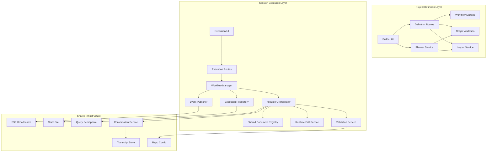
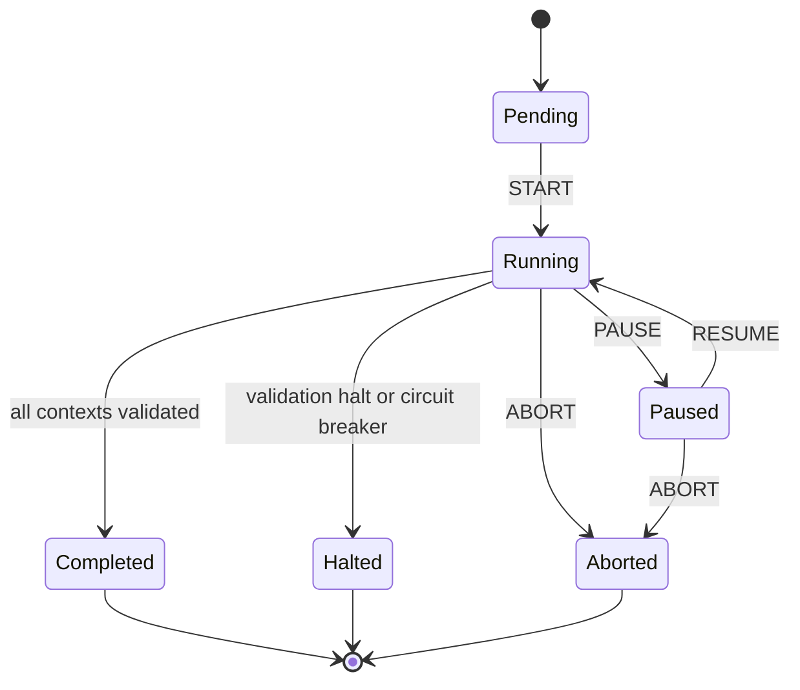
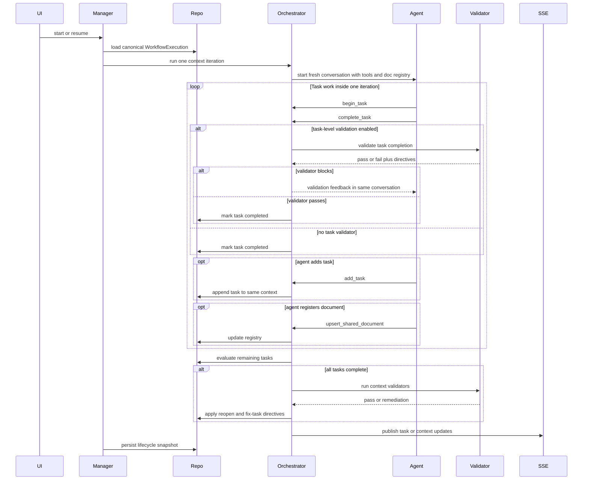
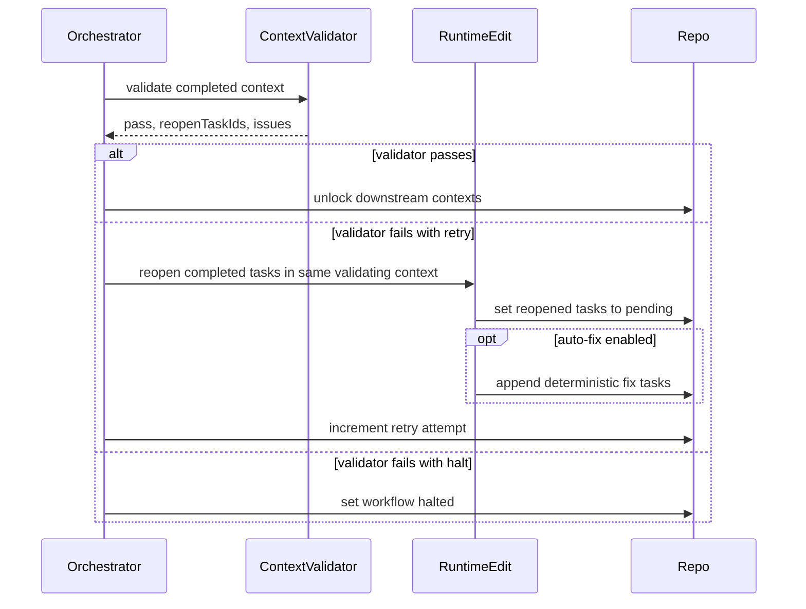
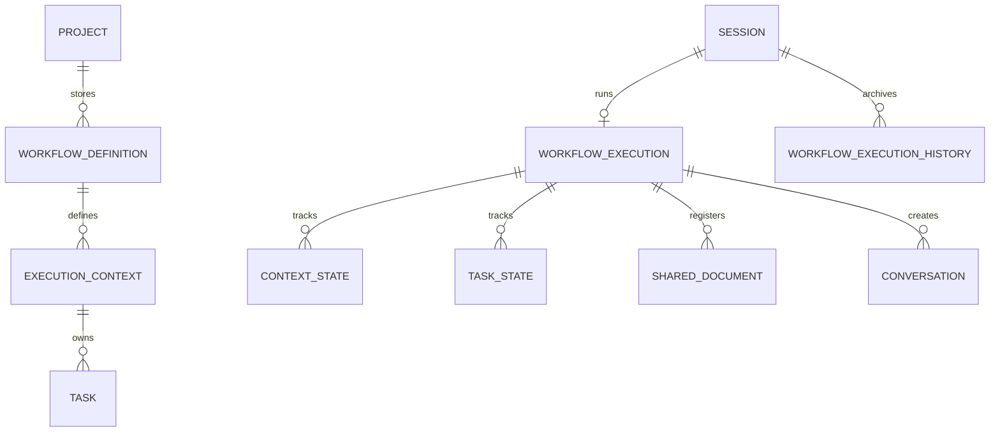

# Design Document - Workflow Graph Builder

## Overview

The Workflow Graph Builder introduces a reusable project-level workflow-definition system and a session-level execution engine that orchestrates work as a dependency graph of execution contexts. Each execution context owns an ordered task list, a shared agent configuration, validation policies, circuit-breaker policy, and an iterative execution loop. The graph expresses dependency order and future parallel eligibility, while MVP execution remains sequential within a single session worktree. Each workflow run starts from an immutable saved definition but immediately creates a mutable runtime working definition owned by the execution aggregate so runtime edits, validator remediation, and archived history all describe the actual run rather than the seed snapshot alone.

This design intentionally does not reuse the old task-node DAG model. The updated requirements simplify the graph shape, but they also introduce stronger runtime contracts: validators can reopen completed tasks and cause deterministic fix-task creation, users can edit unfinished work during execution, and agents can exchange durable context through explicitly registered files in the session worktree. The design therefore focuses on clear state ownership, explicit tool contracts, and deterministic orchestration boundaries.

**Purpose**: This feature delivers a reusable workflow-definition system for Alex and other CC users who need structured autonomous execution beyond Ralph Loop's single linear plan.
**Users**: Workflow authors use the builder to define execution contexts, task lists, and dependencies; session users run those workflows and inspect task, validation, and document state in real time.
**Impact**: This adds a new project-level definition domain, new session-level execution state, and new graph-workflow UI/API surfaces without replacing the existing Ralph routes, stores, or event contracts in this phase.

### Goals
- Model workflows as execution-context DAGs with ordered task lists and explicit validation policies
- Reuse existing XState, transcript, SSE, and state-persistence patterns wherever those patterns already fit
- Keep `WorkflowExecution` as the single source of truth for runtime state while still using persisted XState snapshots for lifecycle recovery
- Persist a mutable runtime working definition inside `WorkflowExecution` so runtime edits do not drift away from the archived run state
- Support deterministic validator remediation, runtime task editing, and shared-document registry propagation across fresh conversations
- Preserve future parallel execution eligibility in the definition model while keeping MVP runtime sequential

### Non-Goals
- Running more than one execution context at a time in MVP
- Nested execution contexts
- Runtime edge editing by agents or users
- Replacing Ralph Loop routes, stores, or SSE payloads in this phase
- Automatic merge/commit semantics during validation execution

## Architecture

### Existing Architecture Analysis

- CC already uses XState v5 actors for long-running workflows and conversation lifecycles, with `.provide()`-based production wiring, external runtime registries for non-serializable state, and debounced snapshot persistence.
- Session state is persisted in `state.json`, while transcripts are stored separately as JSONL files. This separation already matches the new need to persist execution aggregates without duplicating streaming content.
- Ralph Loop proves the viability of per-iteration conversations and custom MCP tool servers. The new feature should reuse that runtime style instead of introducing a second autonomous execution mechanism.
- The current repo config validation helper (`runPreMergeValidation`) is merge-oriented and auto-commits script changes. Graph-workflow validation needs a lower-level execution-path that captures output and exit code without merge-side effects.
- The current UI already uses Zustand + React Query + SSE event handling. The new graph workflow can adopt those patterns, but it needs richer per-task and per-document patching than the current Ralph workflow summary store.

### Architecture Pattern & Boundary Map



**Architecture Integration**:
- Selected pattern: parallel subsystem with a project-definition domain and a session-execution domain layered on top of existing workflow/conversation infrastructure
- Domain boundaries:
  - Definition domain owns reusable execution contexts, tasks, dependency edges, and layout
  - Execution domain owns the mutable working snapshot, lifecycle control, iteration orchestration, runtime edits, validation outcomes, and shared-document registry
  - Tool/validation domain owns task tools, document registration, task-level validation, and execution-context-level validation
- Existing patterns preserved:
  - `src/lib/schemas.ts` remains the canonical schema home
  - `src/lib/workflows/<name>/` remains the long-running workflow pattern
  - `state.json` remains the canonical mutable session-state store
  - transcript JSONL remains the durable content log
  - SSE + client-side patching remains the real-time UI pattern
- New components rationale:
  - Runtime Edit Service is needed because user edits and validator remediation must both mutate the same execution snapshot safely
  - Shared Document Registry is needed because file existence alone is not enough; agents also need description and “when to read” guidance
  - Iteration Orchestrator is separated from the XState machine because the machine should not own detailed task or validation mutation logic
- Steering compliance:
  - Strong typing through Zod schemas and explicit TypeScript interfaces
  - XState lifecycle management with minimal machine context
  - No backward-compatibility layer over Ralph contracts; coexistence is achieved through parallel namespaces

### Technology Stack & Alignment

| Layer | Choice / Version | Role in Feature | Notes |
|-------|------------------|-----------------|-------|
| Frontend | React 19, Next.js 16, `@xyflow/react` 12.x | Execution-context graph builder and execution canvas | New dependency; no nested-node features required |
| Client State | Zustand 5 with Immer, TanStack Query 5 | Builder draft state, execution patch state, query cache | Follows existing store/query split |
| Backend / Services | XState 5.28, `@anthropic-ai/claude-agent-sdk` 0.2.81 | Workflow lifecycle, iteration orchestration, tool servers, validator agents | Reuses existing autonomous workflow patterns |
| Data / Storage | Zod 4.3, config-dir workflow files, `state.json`, transcript JSONL | Canonical schemas, definition persistence, session execution state, conversation logs | Single source of truth is session `WorkflowExecution` |
| Messaging / Events | Existing SSE broadcaster plus per-execution live stream | Real-time workflow/context/task/document updates and live iteration output | Graph workflow uses distinct `graph-workflow-*` event names |
| Runtime / Validation | Existing query semaphore, repo config, worktree model | Sequential autonomous execution with future parallel-ready scheduling | Single session worktree remains MVP execution boundary |

## System Flows

### Workflow Lifecycle



Flow-level decisions:
- Pause aborts the active iteration actor immediately and marks the active task as `interrupted`
- Resume always reruns the interrupted task from the start within a fresh iteration conversation
- Partial file changes remain in the worktree; only runtime status is interrupted

### Execution-Context Iteration



Flow-level decisions:
- One actor invocation runs exactly one iteration, not the entire workflow
- Task ownership is explicit through tools, which makes pause/interrupted semantics observable
- Validator outputs do not mutate state directly; the orchestrator applies them through deterministic runtime edit paths

### Validation Remediation and Retry



Flow-level decisions:
- Reopened tasks must already be `completed`
- Auto-created fix tasks are appended to the end of the same execution context that failed validation
- Repeated issues are deduplicated by validator issue fingerprint while an equivalent open fix task already exists

## Requirements Traceability

| Requirement | Summary | Components | Interfaces | Flows |
|-------------|---------|------------|------------|-------|
| 1.1, 1.2, 1.3, 1.4, 1.5 | Schema-first workflow model with separate semantic, layout, and execution layers | Definition Schema Family, Workflow Storage | Zod schemas, storage service | Definition save flow |
| 2.1, 2.2, 2.3, 2.4, 2.5, 2.6 | Execution contexts with agent, validation, iteration, and breaker policies | Definition Schema Family, Builder UI, Validation Service | Context schema, validator policy interfaces | Builder edit and execution flows |
| 3.1, 3.2, 3.3, 3.4, 3.5 | Ordered task lists inside execution contexts | Definition Schema Family, Runtime Edit Service, Orchestrator | Task schema, runtime edit service | Iteration flow |
| 4.1, 4.2, 4.3, 4.4, 4.5, 4.6 | Execution-context DAG and future parallel eligibility | Graph Validation Service, Layout Service, Scheduler | Edge schema, eligibility service | Scheduling flow |
| 5.1, 5.2, 5.3, 5.4, 5.5, 5.6, 5.7, 5.8, 5.9 | Task-level validation and remediation | Validation Service, Tool Server, Runtime Edit Service | Task validator contract, remediation contract | Iteration flow |
| 6.1, 6.2, 6.3, 6.4, 6.5, 6.6, 6.7, 6.8, 6.9 | Execution-context-level validation with agent and script validators | Validation Service, Repo Validation Executor | Context validator contract, script result contract | Validation remediation flow |
| 7.1, 7.2, 7.3, 7.4, 7.5, 7.6, 7.7, 7.8 | Retry policy and deterministic fix-task generation | Validation Service, Runtime Edit Service, Workflow Manager | Retry policy schema, runtime edit contract | Validation remediation flow |
| 8.1, 8.2, 8.3, 8.4 | Circuit breaker handling | Workflow Manager, Execution Repository | Breaker state schema, SSE events | Lifecycle flow |
| 9.1, 9.2, 9.3, 9.4, 9.5, 9.6, 9.7 | Agent and user runtime editing rules | Runtime Edit Service, Tool Server, Execution Routes | User edit API, agent task-add tool | Iteration and runtime edit flows |
| 10.1, 10.2, 10.3, 10.4, 10.5, 10.6, 10.7, 10.8 | Semantic validation for definitions and runtime edits | Graph Validation Service | Validation result contract | Definition save flow |
| 11.1, 11.2, 11.3, 11.4, 11.5, 11.6 | Visual graph editor with context inspector | Builder UI, Editor Store, Layout Service | Builder state contract | Builder interaction flow |
| 12.1, 12.2, 12.3, 12.4, 12.5, 12.6 | Project-level workflow-definition persistence | Workflow Storage, Definition Routes | REST API, storage service | Definition save flow |
| 13.1, 13.2, 13.3, 13.4, 13.5, 13.6 | Agent-generated workflow planning | Planner Service, Graph Validation Service, Layout Service | Planner contract | Definition generation flow |
| 14.1, 14.2, 14.3, 14.4, 14.5, 14.6 | Start, pause, resume, abort, and restart recovery | Workflow Manager, Execution Repository | Workflow manager interface, lifecycle API | Lifecycle flow |
| 15.1, 15.2, 15.3, 15.4, 15.5, 15.6, 15.7 | Dependency-based scheduling and fresh per-iteration conversations | Iteration Orchestrator, Tool Server, Document Registry | Iteration contract, tool server contract | Iteration flow |
| 16.1, 16.2, 16.3, 16.4, 16.5, 16.6 | Real-time observability and history | Event Publisher, Execution Repository, Execution UI | SSE schema, history schema | Lifecycle and remediation flows |
| 17.1, 17.2, 17.3, 17.4, 17.5 | Shared-document directory and registry propagation | Shared Document Registry, Tool Server, Orchestrator | Registry schema, tool contract | Iteration flow |

## Components & Interface Contracts

| Component | Domain / Layer | Intent | Req Coverage | Key Dependencies (P0/P1) | Contracts |
|-----------|----------------|--------|--------------|--------------------------|-----------|
| Definition Schema Family | Data Model | Define workflow, validation, runtime, and document schemas | 1.1-1.5, 2.1-2.6, 3.1-3.5, 5.1-5.9, 6.1-6.9, 17.1-17.5 | Zod Schemas (P0) | Service, State |
| Workflow Storage | Data | Persist reusable workflow definitions and layout | 12.1-12.6 | Graph Validation (P0), Config Path (P0) | Service, State |
| Graph Validation Service | Domain | Enforce graph, retry, and runtime-edit integrity | 4.1-4.6, 10.1-10.8 | Definition Schemas (P0) | Service |
| Definition Routes | API | Expose project-level CRUD and planner endpoints | 12.1-12.6, 13.1-13.6 | Workflow Storage (P0), Planner Service (P1) | API |
| Planner Service | Domain | Generate workflow drafts from agent structured output | 13.1-13.6 | Agent SDK (P0), Layout Service (P0) | Service, Batch |
| Builder UI and Editor Store | Client | Edit execution contexts, tasks, layout, and policies | 11.1-11.6 | React Flow (P0), Definition Routes (P0) | State |
| Execution Repository | Data | Persist active workflow execution and history in session state | 14.1-14.6, 16.1-16.6, 17.5 | State helpers (P0) | Service, State |
| Workflow Manager | Runtime | Own lifecycle, recovery, pause/resume, and scheduling control | 14.1-14.6, 15.1-15.4 | Execution Repository (P0), Orchestrator (P0) | Service, Event, State |
| Iteration Orchestrator | Runtime | Run one execution-context iteration and apply deterministic state updates | 15.1-15.7 | Tool Server (P0), Validation Service (P0), Runtime Edit Service (P0) | Service |
| Tool Server | Runtime | Expose structured task and document tools inside each iteration | 5.1-5.9, 9.1-9.3, 15.5, 17.2-17.4 | Agent SDK MCP (P0) | Service, Batch |
| Validation Service | Runtime | Run task/context validators and normalize remediation output | 5.1-5.9, 6.1-6.9, 7.1-7.8 | Repo Validation Executor (P0), Agent SDK (P0) | Service, Batch |
| Runtime Edit Service | Runtime | Apply user edits, agent task adds, and validator remediation safely | 7.4-7.7, 9.1-9.7, 10.6-10.8 | Graph Validation (P0), Execution Repository (P0) | Service |
| Shared Document Registry | Runtime | Track registered cross-agent files in the session worktree | 17.1-17.5 | Execution Repository (P0) | Service, State |
| Event Publisher and Stream Registry | Messaging | Broadcast workflow, context, task, validation, and document events | 16.1-16.6, 17.4 | SSE Broadcaster (P0), transcript/stream infra (P0) | Event, Batch |

### Definition Domain

#### Definition Schema Family

| Field | Detail |
|-------|--------|
| Intent | Define the canonical workflow definition, execution aggregate, validator response, and shared-document schemas |
| Requirements | 1.1, 1.2, 1.3, 1.4, 1.5, 2.1, 2.2, 2.3, 2.4, 2.5, 2.6, 3.1, 3.2, 3.3, 3.4, 3.5, 5.1, 5.4, 5.5, 5.6, 5.7, 5.8, 5.9, 6.1, 6.2, 6.6, 6.7, 6.8, 6.9, 17.1, 17.2, 17.3, 17.4, 17.5 |

**Responsibilities & Constraints**
- Keep reusable workflow definition separate from mutable session execution state
- Seed each run from a saved definition, then persist runtime semantic changes inside the execution's working definition
- Model execution contexts, tasks, and edges with explicit stable IDs
- Keep tasks as flat records with `contextId` and `order` rather than nested graph nodes
- Model validators as properties on execution contexts, not standalone graph nodes
- Represent validator remediation as structured output, not direct mutations
- Represent shared documents as registry entries plus worktree-relative paths

**Dependencies**
- Inbound: Workflow Storage — persistence (P0)
- Inbound: Graph Validation Service — semantic validation (P0)
- Outbound: `src/lib/schemas.ts` and `src/types/index.ts` export surface (P0)

**Contracts**: Service [x] / API [ ] / Event [ ] / Batch [ ] / State [x]

##### Service Interface
```typescript
interface WorkflowAgentConfig {
  model: string;
  reasoningEffort: "low" | "medium" | "high";
}

interface WorkflowExecutionContextDefinition {
  id: string;
  title: string;
  description?: string;
  agent: WorkflowAgentConfig;
  mutability: { allowAgentTaskAdd: boolean };
  circuitBreaker: { consecutiveFailureThreshold: number };
  iterationPolicy: {
    maxIterations: number;
    contextSoftLimitTokens?: number;
    contextHardLimitTokens?: number;
  };
  taskValidation?: {
    enabled: boolean;
    autoCreateFixTasks: boolean;
    agent: WorkflowAgentConfig;
    instructions: string;
  };
  contextValidation?: {
    agentValidator?: {
      enabled: boolean;
      autoCreateFixTasks: boolean;
      agent: WorkflowAgentConfig;
      instructions: string;
    };
    scriptValidator?: { enabled: boolean };
    onFail: {
      mode: "halt" | "retry";
      retryScope: "same_context";
      maxAttempts: number;
    };
  };
}

interface WorkflowTaskDefinition {
  id: string;
  contextId: string;
  order: number;
  title: string;
  instructions: string;
  metadata?: Record<string, string>;
  source: "user" | "agent" | "validator";
}

interface WorkflowExecutionContextEdge {
  id: string;
  sourceContextId: string;
  targetContextId: string;
}

interface WorkflowValidatorIssue {
  title: string;
  description: string;
}

interface WorkflowAgentValidatorResult {
  pass: boolean;
  summary: string;
  reopenTaskIds: string[];
  issues: WorkflowValidatorIssue[];
}

interface WorkflowSharedDocumentEntry {
  id: string;
  relativePath: string;
  description: string;
  readWhen: string;
  createdAt: string;
  updatedAt: string;
  lastUpdatedByConversationId: string | null;
}
```
- Preconditions:
  - all schemas parse untrusted input with `safeParse`
- Postconditions:
  - all public types are derived from Zod via `z.infer`
- Invariants:
  - task IDs and execution-context IDs are globally unique within a workflow definition
  - validator remediation never references tasks outside the validator's execution context

##### State Management
- Semantic layer:
  - `WorkflowDefinitionRecord`
  - `WorkflowExecutionContextDefinition[]`
  - `WorkflowTaskDefinition[]`
  - `WorkflowExecutionContextEdge[]`
- Layout layer:
  - `WorkflowVisualLayout`
  - execution-context node positions
  - viewport
- Execution layer:
  - `WorkflowExecution`
  - `workingDefinition`
  - per-context state
  - per-task state
  - retry counters
  - shared-document registry
  - archived history

**Implementation Notes**
- Integration: keep schema definitions in `src/lib/schemas.ts` and reserve helper logic for `src/lib/workflow-graph/`
- Validation: treat `reopenTaskIds` plus unresolved issues as a failing validator outcome even if a model returns `pass: true`
- Risks: duplicated semantic meaning across execution and definition layers would reintroduce drift, so the active run must mutate only `WorkflowExecution.workingDefinition` rather than reconstructing runtime semantics from scattered patches

#### Workflow Storage

| Field | Detail |
|-------|--------|
| Intent | Persist project-level workflow definitions and layout as independent files |
| Requirements | 12.1, 12.2, 12.3, 12.4, 12.5, 12.6 |

**Responsibilities & Constraints**
- Persist reusable workflow definitions outside session state
- Keep semantic definition and layout together in one workflow file
- Use atomic write-to-temp + rename semantics
- Never persist runtime execution state in definition files

**Dependencies**
- Inbound: Definition Routes — CRUD entrypoint (P0)
- Outbound: Graph Validation Service — save-time validation (P0)
- Outbound: config-directory path resolution (P0)

**Contracts**: Service [x] / API [ ] / Event [ ] / Batch [ ] / State [x]

##### Service Interface
```typescript
interface WorkflowStorageService {
  list(projectPath: string): Promise<WorkflowDefinitionSummary[]>;
  get(projectPath: string, workflowId: string): Promise<WorkflowDefinitionFile | null>;
  create(projectPath: string, draft: WorkflowDefinitionDraft): Promise<WorkflowDefinitionFile>;
  update(projectPath: string, workflowId: string, draft: WorkflowDefinitionDraft): Promise<WorkflowDefinitionFile>;
  delete(projectPath: string, workflowId: string): Promise<boolean>;
}
```
- Preconditions:
  - definition must pass graph validation before write
- Postconditions:
  - returned file reflects persisted revision
- Invariants:
  - one file per workflow definition

**Implementation Notes**
- Integration: keep the file layout consistent with current config-dir conventions instead of storing definitions in `state.json`
- Validation: reject save if task ordering inside a context is duplicated or sparse beyond normalization rules
- Risks: none beyond normal file-based CRUD growth

#### Graph Validation Service

| Field | Detail |
|-------|--------|
| Intent | Validate graph integrity, validator scope, and runtime edit legality |
| Requirements | 4.1, 4.2, 4.3, 4.4, 4.5, 4.6, 10.1, 10.2, 10.3, 10.4, 10.5, 10.6, 10.7, 10.8 |

**Responsibilities & Constraints**
- Validate acyclicity of execution-context edges
- Validate task membership and ordering within execution contexts
- Validate retry policy scope is limited to the same execution context that failed validation
- Validate validator remediation scope to same-context completed tasks only
- Validate user runtime edits against current execution states

**Dependencies**
- Inbound: Workflow Storage, Runtime Edit Service, Planner Service (P0)
- Outbound: none; pure-function module (P0)

**Contracts**: Service [x] / API [ ] / Event [ ] / Batch [ ] / State [ ]

##### Service Interface
```typescript
interface WorkflowValidationService {
  validateDefinition(definition: WorkflowSemanticDefinition): WorkflowValidationResult;
  validateRuntimeEdit(
    definition: WorkflowSemanticDefinition,
    execution: WorkflowExecution,
    edit: WorkflowRuntimeEditRequest,
  ): WorkflowValidationResult;
  validateValidatorRemediation(
    contextId: string,
    execution: WorkflowExecution,
    remediation: WorkflowAgentValidatorResult,
  ): WorkflowValidationResult;
}
```
- Preconditions:
  - semantic definitions already pass schema parsing
- Postconditions:
  - invalid edits or remediation directives are rejected with explicit IDs
- Invariants:
  - runtime acceptance is all-or-nothing

**Implementation Notes**
- Integration: keep this service pure so it can be reused by routes, orchestrator, and tests
- Validation: runtime move/edit rules must explicitly reject moves into running or completed destination contexts
- Risks: validator remediation scope leaks are the highest-value correctness check in this service

#### Definition Routes and Planner Service

| Field | Detail |
|-------|--------|
| Intent | Expose project-scoped CRUD and planner generation for workflow definitions |
| Requirements | 12.1, 12.2, 12.3, 12.4, 12.5, 12.6, 13.1, 13.2, 13.3, 13.4, 13.5, 13.6 |

**Responsibilities & Constraints**
- Keep workflow-definition routes project-scoped and independent of session execution
- Return structured validation errors
- Generate planner drafts with explicit IDs and no required layout coordinates
- Preserve parallel-ready dependency information even though runtime stays sequential

**Dependencies**
- Inbound: Builder UI (P0)
- Outbound: Workflow Storage (P0)
- Outbound: Planner Service (P1)
- Outbound: Layout Service (P1)

**Contracts**: Service [x] / API [x] / Event [ ] / Batch [x] / State [ ]

##### API Contract
| Method | Endpoint | Request | Response | Errors |
|--------|----------|---------|----------|--------|
| GET | `/api/projects/[name]/workflows` | none | `WorkflowDefinitionSummary[]` | 404 |
| POST | `/api/projects/[name]/workflows` | `WorkflowDefinitionCreateRequest` | `WorkflowDefinitionFile` | 400, 404 |
| GET | `/api/projects/[name]/workflows/[workflowId]` | none | `WorkflowDefinitionFile` | 404 |
| PUT | `/api/projects/[name]/workflows/[workflowId]` | `WorkflowDefinitionUpdateRequest` | `WorkflowDefinitionFile` | 400, 404 |
| DELETE | `/api/projects/[name]/workflows/[workflowId]` | none | `{ ok: true }` | 404 |
| POST | `/api/projects/[name]/workflows/generate` | `WorkflowPlanRequest` | `WorkflowGeneratedDraft` | 400, 404, 422 |

##### Service Interface
```typescript
interface WorkflowPlannerService {
  generateDraft(input: WorkflowPlanRequest): Promise<WorkflowGeneratedDraft>;
}
```
- Preconditions:
  - planner input includes project context and user objective
- Postconditions:
  - planner result includes explicit IDs and validation errors when applicable
- Invariants:
  - generated draft is never canonical until storage save succeeds

**Implementation Notes**
- Integration: mirror the current `submit_plan` tool pattern from Ralph planning
- Validation: planner output should use flat task records keyed by `contextId` rather than nested arrays
- Risks: planner may over-model sequential tasks as separate execution contexts; prompt guidance should push execution contexts to represent true dependency boundaries only

### Client Layer

#### Builder UI and Editor Store

| Field | Detail |
|-------|--------|
| Intent | Provide a controlled builder for execution-context nodes, dependency edges, and task-list editing |
| Requirements | 11.1, 11.2, 11.3, 11.4, 11.5, 11.6 |

**Responsibilities & Constraints**
- Render execution contexts as graph nodes and dependency edges on the canvas
- Keep task lists, validator settings, and context policies in inspector state rather than graph nodes
- Persist layout separately from semantic definition
- Use a dedicated local draft store with explicit dirty tracking

**Dependencies**
- Inbound: Project builder pages (P0)
- Outbound: Definition Routes (P0)
- External: `@xyflow/react` (P0)

**Contracts**: Service [ ] / API [ ] / Event [ ] / Batch [ ] / State [x]

##### State Management
- State model:
  - `draftDefinition`
  - `draftLayout`
  - `selectedContextId`
  - `selectedTaskId`
  - `dirty`
  - `validationErrors`
- Persistence & consistency:
  - semantic saves go through React Query mutations only
  - local draft state persists only within the current browser tab
- Concurrency strategy:
  - controlled React Flow state drives context nodes and edges
  - task list editing stays inside inspector state for the selected context

**Implementation Notes**
- Integration: builder UI should use Storybook-backed shared components for graph canvas, context inspector, task-list editor, and validation policy panels
- Validation: edge creation must run client-side DAG checks but still defer authoritative validation to the server
- Risks: full-canvas re-renders should be avoided by keeping graph node data small and task lists out of node payloads

#### Layout Service

| Field | Detail |
|-------|--------|
| Intent | Produce deterministic execution-context node layouts for generated and saved workflows |
| Requirements | 11.1, 11.6, 13.5, 13.6 |

**Responsibilities & Constraints**
- Place execution-context nodes by topological depth
- Preserve manual positions unless layout is missing or reflow is requested
- Avoid modeling task layout on the graph canvas

**Dependencies**
- Inbound: Definition Routes, Planner Service, Builder UI (P0)
- Outbound: none; pure-function module (P0)

**Contracts**: Service [x] / API [ ] / Event [ ] / Batch [ ] / State [ ]

##### Service Interface
```typescript
interface WorkflowLayoutService {
  generate(
    definition: WorkflowSemanticDefinition,
    existingLayout?: WorkflowVisualLayout | null,
  ): WorkflowVisualLayout;
}
```
- Preconditions:
  - definition already validated as acyclic
- Postconditions:
  - every execution context has a canvas position
- Invariants:
  - task ordering does not affect canvas topology directly

**Implementation Notes**
- Integration: controlled React Flow layout only needs context positions and edge routing
- Validation: generated layout should stay stable for unchanged graphs to keep diffs readable
- Risks: none significant now that nested containers are out of scope

### Session Execution Layer

#### Execution Repository

| Field | Detail |
|-------|--------|
| Intent | Persist the canonical runtime execution aggregate and archived history in session state |
| Requirements | 14.1, 14.2, 14.6, 16.1, 16.2, 16.3, 16.4, 16.5, 16.6, 17.5 |

**Responsibilities & Constraints**
- Own the single source of truth for active execution state, including the mutable working definition for the run
- Store at most one active graph-workflow execution per session in MVP
- Archive terminal runs into session history
- Store the shared-document registry inside the canonical execution aggregate
- Persist a machine snapshot used only for lifecycle restoration

**Dependencies**
- Inbound: Workflow Manager, Runtime Edit Service, Shared Document Registry (P0)
- Outbound: `src/lib/state.ts` session mutation helpers (P0)

**Contracts**: Service [x] / API [ ] / Event [ ] / Batch [ ] / State [x]

##### Service Interface
```typescript
interface WorkflowExecutionRepository {
  getActive(projectPath: string, sessionName: string): Promise<WorkflowExecution | null>;
  create(projectPath: string, sessionName: string, seed: WorkflowExecutionSeed): Promise<WorkflowExecution>;
  update(projectPath: string, sessionName: string, execution: WorkflowExecution): Promise<void>;
  archiveActive(projectPath: string, sessionName: string): Promise<void>;
}
```
- Preconditions:
  - seed definition exists and passed validation
- Postconditions:
  - repository writes persist the canonical execution aggregate atomically
- Invariants:
  - machine snapshot is metadata, not a second canonical runtime state model

**Implementation Notes**
- Integration: extend `SessionState` with `graphWorkflowExecution` and `graphWorkflowExecutionHistory`
- Validation: repository should reject updates against a missing active execution
- Risks: history growth should be controlled by storing summaries rather than full transcript content

#### Workflow Manager

| Field | Detail |
|-------|--------|
| Intent | Own workflow lifecycle state, pause/resume, recovery, and scheduling decisions |
| Requirements | 14.1, 14.2, 14.3, 14.4, 14.5, 14.6, 15.1, 15.2, 15.3, 15.4 |

**Responsibilities & Constraints**
- Own workflow lifecycle transitions and machine snapshot persistence
- Select the next eligible execution context after each iteration completes
- Pause by aborting the active iteration actor and marking the active task as interrupted
- Resume by dispatching a fresh iteration for the interrupted task
- Normalize any in-flight iteration after restart by marking its active task interrupted and clearing transient handles before rehydration
- Rehydrate only resumable lifecycle state from persisted snapshots and canonical execution state

**Dependencies**
- Inbound: Execution Routes (P0)
- Outbound: Execution Repository (P0)
- Outbound: Iteration Orchestrator (P0)
- Outbound: Event Publisher (P0)

**Contracts**: Service [x] / API [ ] / Event [x] / Batch [ ] / State [x]

##### Service Interface
```typescript
interface GraphWorkflowManager {
  start(input: GraphWorkflowStartInput): void;
  send(projectPath: string, sessionName: string, event: GraphWorkflowEvent): boolean;
  resume(projectPath: string, sessionName: string): void;
  rehydrateAll(): Promise<number>;
  hasActive(projectPath: string, sessionName: string): boolean;
}
```

##### State Management
```typescript
interface GraphWorkflowMachineContext {
  _schemaVersion: number;
  projectPath: string;
  projectName: string;
  sessionName: string;
  executionId: string;
  activeContextId: string | null;
  activeTaskId: string | null;
  recoveryMode: "none" | "rehydrated" | "interrupted_task" | "restart_normalized";
}
```
- Persistence & consistency:
  - persisted snapshot stores lifecycle state and active identifiers only
  - canonical execution data remains in `WorkflowExecution`
- Concurrency strategy:
  - one active machine actor per session

**Implementation Notes**
- Integration: follow the current `src/lib/workflows/<name>/` XState organization and `instrumentation.node.ts` rehydration hook
- Validation: machine events should never carry full execution aggregates; repository reads are authoritative
- Restart rule: if startup finds a graph workflow in `running` with an in-flight iteration, the manager must persist a normalization step that marks the active task `interrupted`, clears transient iteration handles, and transitions the lifecycle to a resumable non-running state before actor rehydration
- Risks: event and repository ordering must remain consistent so pause or restart normalization cannot race past an iteration completion write

#### Iteration Orchestrator

| Field | Detail |
|-------|--------|
| Intent | Run exactly one execution-context iteration and apply deterministic runtime changes |
| Requirements | 5.1, 5.2, 5.3, 5.8, 5.9, 7.4, 7.5, 7.6, 7.7, 9.2, 15.3, 15.4, 15.5, 15.6, 15.7, 17.4 |

**Responsibilities & Constraints**
- Create a fresh conversation for each iteration
- Provide context agent tools for task state changes, scoped task addition, and shared-document registry updates
- Track the active task explicitly for pause/interrupted semantics
- Run execution-context-level validation when the context's tasks are complete
- Apply validator remediation and retry bookkeeping through the Runtime Edit Service

**Dependencies**
- Inbound: Workflow Manager (P0)
- Outbound: Conversations Service (P0)
- Outbound: Tool Server (P0)
- Outbound: Validation Service (P0)
- Outbound: Runtime Edit Service (P0)
- Outbound: Shared Document Registry (P0)

**Contracts**: Service [x] / API [ ] / Event [ ] / Batch [x] / State [ ]

##### Service Interface
```typescript
interface ContextIterationOrchestrator {
  runIteration(input: ContextIterationInput): Promise<ContextIterationResult>;
}
```
- Preconditions:
  - active execution exists and selected context is eligible to run
- Postconditions:
  - returns updated lifecycle signals plus any interrupted-task reference
- Invariants:
  - one iteration owns at most one active task at a time
  - all task and document changes happen through structured tools

**Implementation Notes**
- Integration: orchestrator should reuse existing autonomous query patterns with `persistSession: false`
- Validation: task completion and document registration must fail closed if the tool payload is invalid
- Risks: if an agent never calls `begin_task`, pause cannot identify meaningful interrupted work; tool guidance must make active-task declaration mandatory

#### Tool Server

| Field | Detail |
|-------|--------|
| Intent | Expose structured task and document operations inside each iteration conversation |
| Requirements | 5.1, 5.2, 5.3, 9.1, 9.2, 9.3, 15.5, 17.2, 17.3 |

**Responsibilities & Constraints**
- Provide explicit task-state tools rather than relying on assistant prose
- Enforce that agents can add tasks only in their own active execution context and only when mutability allows
- Provide explicit document registration/upsert tools
- Optionally provide iteration status reporting for observability and circuit-breaker heuristics

**Dependencies**
- Inbound: Iteration Orchestrator (P0)
- External: Claude Agent SDK MCP tool APIs (P0)

**Contracts**: Service [x] / API [ ] / Event [ ] / Batch [x] / State [ ]

##### Batch / Job Contract
- Trigger:
  - iteration conversation starts
- Input / validation:
  - active execution context
  - active execution snapshot
  - current shared-document registry
- Output / destination:
  - runtime edit requests
  - task completion requests
  - shared-document upsert requests
- Idempotency & recovery:
  - tool inputs are validated and applied transactionally to the canonical execution aggregate

##### Service Interface
```typescript
interface GraphWorkflowToolServerFactory {
  create(context: GraphWorkflowToolContext): McpSdkServerConfigWithInstance;
}
```

**Implementation Notes**
- Tool surface:
  - `begin_task(taskId)`
  - `complete_task(taskId, summary)`
  - `add_task(title, instructions, metadata?)`
  - `upsert_shared_document(relativePath, description, readWhen)`
  - `report_iteration_status(status, summary)`
- Validation: `complete_task` is the only path that can mark a task complete
- Risks: overloading one tool with too many responsibilities would make prompt instructions harder to follow, so task and document concerns stay separate

#### Validation Service

| Field | Detail |
|-------|--------|
| Intent | Run task-level and execution-context-level validators and normalize script/agent outputs |
| Requirements | 5.1, 5.2, 5.3, 5.7, 5.8, 5.9, 6.1, 6.2, 6.3, 6.4, 6.5, 6.6, 6.7, 6.8, 6.9, 7.1, 7.4, 7.5, 7.6 |

**Responsibilities & Constraints**
- Run task-level agent validators during `complete_task`
- Run execution-context-level agent and script validators after all tasks are complete
- Normalize agent validator responses into remediation directives
- Enforce that remediation only references completed tasks in the same execution context
- Return issue lists without mutating execution state directly

**Dependencies**
- Inbound: Iteration Orchestrator (P0)
- Outbound: repo validation command executor (P0)
- Outbound: Agent SDK autonomous query runner (P0)
- Outbound: Graph Validation Service (P0)

**Contracts**: Service [x] / API [ ] / Event [ ] / Batch [x] / State [ ]

##### Service Interface
```typescript
interface GraphWorkflowValidationService {
  validateTaskCompletion(input: TaskValidationInput): Promise<TaskValidationOutcome>;
  validateContextCompletion(input: ContextValidationInput): Promise<ContextValidationOutcome>;
}
```
- Preconditions:
  - validator policies exist and are enabled
- Postconditions:
  - outcomes contain normalized directives plus raw validator evidence
- Invariants:
  - `reopenTaskIds` may reference only completed tasks in the validator's execution context
  - a result that reopens tasks or introduces issues for auto-fix is treated as a failing validation outcome

**Implementation Notes**
- Integration: extract a lower-level `executeRepoValidationCommand()` from repo-config logic so script validators do not auto-commit changes
- Validation: fix-task creation should derive deterministic task titles/descriptions from validator issues and deduplicate unresolved duplicates by issue fingerprint
- Risks: poor validator prompts can produce under-specified issue descriptions; the validator contract must require issue descriptions detailed enough to create actionable fix tasks

#### Runtime Edit Service

| Field | Detail |
|-------|--------|
| Intent | Apply safe runtime edits from users, agents, and validators to the canonical execution aggregate |
| Requirements | 7.4, 7.5, 7.6, 7.7, 9.1, 9.2, 9.3, 9.4, 9.5, 9.6, 9.7, 10.6, 10.8, 16.6 |

**Responsibilities & Constraints**
- Apply agent task-add requests
- Apply user add/edit/remove/reorder/move requests
- Apply validator remediation by reopening completed tasks and appending fix tasks
- Reject runtime edits that target completed contexts or moving tasks into running/completed destination contexts
- Maintain task ordering when tasks are appended or moved
- Mutate the execution's working definition and runtime status maps atomically

**Dependencies**
- Inbound: Iteration Orchestrator, Execution Routes, Validation Service (P0)
- Outbound: Graph Validation Service (P0)
- Outbound: Execution Repository (P0)

**Contracts**: Service [x] / API [x] / Event [ ] / Batch [ ] / State [ ]

##### API Contract
| Method | Endpoint | Request | Response | Errors |
|--------|----------|---------|----------|--------|
| POST | `/api/projects/[name]/sessions/[session]/graph-workflow/runtime-edits` | `WorkflowRuntimeEditRequest` | `WorkflowExecution` | 400, 404, 409, 422 |

##### Service Interface
```typescript
interface RuntimeEditService {
  applyUserEdits(execution: WorkflowExecution, request: WorkflowRuntimeEditRequest): WorkflowExecution;
  applyValidatorRemediation(
    execution: WorkflowExecution,
    contextId: string,
    result: WorkflowAgentValidatorResult,
    options: { autoCreateFixTasks: boolean },
  ): WorkflowExecution;
  applyAgentTaskAdd(
    execution: WorkflowExecution,
    contextId: string,
    task: AgentAddedTask,
  ): WorkflowExecution;
}
```
- Preconditions:
  - target execution is active
- Postconditions:
  - accepted edits mutate the canonical execution aggregate atomically
- Invariants:
  - validator-created fix tasks are appended to the end of the same context that failed validation
  - agents cannot edit/remove/reorder/move tasks

**Implementation Notes**
- Integration: use one service for all runtime edits so ordering and dedup rules stay centralized
- Validation: moving a task out of an active context is allowed only if the task is not `running`, `interrupted`, or `completed`
- Risks: task reordering and moves can change future iteration prompts; the orchestrator must always reload the canonical execution aggregate before starting the next iteration

#### Shared Document Registry

| Field | Detail |
|-------|--------|
| Intent | Track explicit shared-document metadata for cross-iteration and cross-context communication |
| Requirements | 17.1, 17.2, 17.3, 17.4, 17.5, 15.7 |

**Responsibilities & Constraints**
- Reserve a known directory inside the session worktree
- Track explicit registry metadata for document discovery
- Allow upsert by agents during execution
- Provide current registry entries to every new iteration conversation
- Keep registry scoped to the current session execution only

**Dependencies**
- Inbound: Tool Server, Iteration Orchestrator (P0)
- Outbound: Execution Repository (P0)

**Contracts**: Service [x] / API [ ] / Event [ ] / Batch [ ] / State [x]

##### Service Interface
```typescript
interface SharedDocumentRegistryService {
  getDirectory(worktreePath: string): string;
  upsert(
    execution: WorkflowExecution,
    entry: SharedDocumentUpsertInput,
  ): WorkflowExecution;
  list(execution: WorkflowExecution): WorkflowSharedDocumentEntry[];
}
```
- Preconditions:
  - registered path resolves inside the known shared-document directory
- Postconditions:
  - upsert updates the canonical registry entry and timestamps
- Invariants:
  - registry entries use worktree-relative paths, not absolute paths

**Implementation Notes**
- Known directory: `.cc/graph-workflow-docs/` inside the session worktree
- Validation: reject registrations outside the directory boundary
- Risks: documents may grow stale; registry metadata should include `updatedAt` and `lastUpdatedByConversationId`

#### Event Publisher and Stream Registry

| Field | Detail |
|-------|--------|
| Intent | Publish graph-workflow SSE events and live iteration output |
| Requirements | 16.1, 16.2, 16.3, 16.4, 16.5, 16.6, 17.4 |

**Responsibilities & Constraints**
- Broadcast workflow, execution-context, task, validation, retry, circuit-breaker, and shared-document events
- Stream live iteration content without duplicating transcript persistence
- Keep event payloads distinct from Ralph event contracts

**Dependencies**
- Inbound: Workflow Manager, Iteration Orchestrator, Runtime Edit Service (P0)
- Outbound: `src/lib/sse-broadcaster.ts` (P0)
- Outbound: repository-local execution stream registry (P0)

**Contracts**: Service [ ] / API [ ] / Event [x] / Batch [x] / State [ ]

##### Event Contract
- Published events:
  - `graph-workflow-status`
  - `graph-workflow-context-status`
  - `graph-workflow-task-status`
  - `graph-workflow-validation-result`
  - `graph-workflow-retry`
  - `graph-workflow-circuit-breaker`
  - `graph-workflow-shared-documents-updated`
- Subscribed events:
  - browser EventSource listeners on `/api/events`
  - per-execution live stream endpoint `/api/projects/[name]/sessions/[session]/graph-workflow/stream`
- Ordering / delivery guarantees:
  - per-session order is authoritative within one process
  - reconnect recovery continues through query invalidation and current execution refetch

**Implementation Notes**
- Integration: add a dedicated `graph-workflow.store.ts` for context/task/document patching rather than extending the Ralph summary store
- Validation: all event schemas live in `src/lib/schemas.ts` and are Zod-validated in the client
- Risks: task-level event burst volume can overwhelm the UI if every event causes a full execution refetch; the store must patch by ID

## Data Models

### Domain Model

- **WorkflowDefinitionRecord** is the project-level aggregate for reusable execution-context graphs.
- **WorkflowExecution** is the session-level aggregate and the single source of truth for active runtime state.
- **WorkflowExecutionContextState** tracks progress and validation for one execution context in one run.
- **WorkflowTaskState** tracks ordered task execution, interruptions, reopen events, and completion metadata.
- **WorkflowSharedDocumentEntry** is the registry-backed view of a file inside the session worktree shared-doc directory.



**Business rules**:
- Tasks belong to exactly one execution context
- Dependency edges connect execution contexts only
- Validators are execution-context properties
- Reopened tasks must already be completed and in the same execution context as the validator
- Fix tasks are appended to the same execution context that failed validation and cannot be inserted elsewhere by validators

### Logical Data Model

**WorkflowDefinitionRecord**
- `id`
- `name`
- `description`
- `schemaVersion`
- `revision`
- `definition: WorkflowSemanticDefinition`
- `layout: WorkflowVisualLayout`
- `createdAt`
- `updatedAt`

**WorkflowSemanticDefinition**
- `schemaVersion`
- `executionContexts: WorkflowExecutionContextDefinition[]`
- `tasks: WorkflowTaskDefinition[]`
- `edges: WorkflowExecutionContextEdge[]`

**WorkflowExecution**
- `id`
- `seedDefinitionId`
- `seedDefinitionRevision`
- `workingDefinition: WorkflowSemanticDefinition`
- `status`
- `activeContextId`
- `activeTaskId`
- `contextStates: Record<string, WorkflowExecutionContextState>`
- `taskStates: Record<string, WorkflowTaskState>`
- `retryState: Record<string, WorkflowRetryState>`
- `sharedDocuments: WorkflowSharedDocumentEntry[]`
- `machineSnapshot`
- `history: WorkflowExecutionEvent[]`
- `startedAt`
- `completedAt`
- `haltReason`

**Consistency & Integrity**
- `workingDefinition` is the canonical semantic model for the active run
- `taskStates` must contain entries for every task in the working definition
- `contextStates` must exist for every execution context in the working definition
- task order is unique within each execution context
- shared-document paths must stay inside `.cc/graph-workflow-docs/`
- validator-created fix tasks use deterministic issue fingerprints for deduplication

### Physical Data Model

**Workflow definition files**
`<config-dir>/workflows/<project-key>/<workflowId>.json`

```json
{
  "definition": {
    "id": "workflow-id",
    "name": "workflow name",
    "schemaVersion": 1,
    "revision": 1,
    "definition": {
      "schemaVersion": 1,
      "executionContexts": [],
      "tasks": [],
      "edges": []
    },
    "layout": {
      "workflowId": "workflow-id",
      "contextPositions": {},
      "viewport": { "x": 0, "y": 0, "zoom": 1 }
    },
    "createdAt": "ISO 8601",
    "updatedAt": "ISO 8601"
  }
}
```

**Execution state in `state.json`**

```json
{
  "sessions": {
    "session-name": {
      "graphWorkflowExecution": {},
      "graphWorkflowExecutionHistory": []
    }
  }
}
```

**Shared documents in worktree**

```text
<worktree>/.cc/graph-workflow-docs/
```

- registry stores relative paths, not document contents
- transcripts remain externalized under the existing transcript directory

### Data Contracts & Integration

**API Data Transfer**

| Contract | Fields |
|----------|--------|
| `WorkflowDefinitionCreateRequest` | `name`, `description`, `definition`, `layout` |
| `WorkflowPlanRequest` | `objective`, `references[]`, `seedDefinitionId?` |
| `WorkflowExecutionStartRequest` | `definitionId` |
| `WorkflowRuntimeEditRequest` | `operations[]` |
| `WorkflowAgentValidatorResult` | `pass`, `summary`, `reopenTaskIds[]`, `issues[]` |

**Event Schemas**

| Event | Fields |
|-------|--------|
| `graph-workflow-status` | `projectName`, `sessionName`, `executionId`, `workflowStatus`, `activeContextId`, `activeTaskId`, `haltReason` |
| `graph-workflow-context-status` | `projectName`, `sessionName`, `executionId`, `contextId`, `status`, `remainingTaskCount`, `iterationCount` |
| `graph-workflow-task-status` | `projectName`, `sessionName`, `executionId`, `taskId`, `contextId`, `status`, `source`, `order` |
| `graph-workflow-validation-result` | `projectName`, `sessionName`, `executionId`, `contextId`, `validatorType`, `pass`, `summary`, `issues[]`, `reopenTaskIds[]` |
| `graph-workflow-retry` | `projectName`, `sessionName`, `executionId`, `contextId`, `attempt`, `maxAttempts` |
| `graph-workflow-circuit-breaker` | `projectName`, `sessionName`, `executionId`, `contextId`, `threshold`, `failureCount` |
| `graph-workflow-shared-documents-updated` | `projectName`, `sessionName`, `executionId`, `documents[]` |

**Cross-Service Data Management**
- No external queue or database is introduced
- Definition/domain consistency stays inside the definition file boundary
- Runtime consistency stays inside the session-state mutex and execution repository

## Error Handling

### Error Strategy
- Validate definitions before persistence and runtime edits before acceptance
- Treat validator remediation as data that must be parsed and validated before state changes occur
- Prefer structured runtime error envelopes over thrown strings
- Keep script validation failures distinct from agent validation failures
- Preserve partial worktree changes on pause and abort; do not attempt rollback

### Error Categories and Responses
- **User Errors (4xx)**:
  - invalid workflow definition -> structured validation errors by context/task/edge
  - invalid runtime edit -> 422 with rejected operations and reasons
  - move into running or completed context -> 409 conflict
  - document registration outside allowed directory -> 422
- **System Errors (5xx)**:
  - SDK query failure -> active task marked `failed` or `interrupted` based on lifecycle state
  - script validator execution failure -> normalized script error outcome with stdout/stderr
  - snapshot restore mismatch -> active execution marked halted with recovery error
- **Business Logic Errors (422)**:
  - validator tries to reopen non-completed task -> rejected remediation
  - validator fix-task creation duplicates an open issue fingerprint -> remediation normalized without duplicate task creation
  - agent tries to add a task without mutability permission -> rejected tool result

### Monitoring
- Dedicated log modules:
  - definition routes
  - planner generation
  - workflow manager
  - iteration orchestrator
  - validation service
  - runtime edits
  - shared-document registry
- Trace task and validator conversations by conversation ID
- Include reopened-task counts and fix-task creation counts in structured logs

## Testing Strategy

### Unit Tests
- Graph validation: context DAG, task ordering, runtime move legality, validator remediation scope
- Runtime edit service: user edits, agent task add, validator reopen/fix-task creation, duplicate issue suppression
- Validation service: task/context validator normalization, script + agent combination, pass/fail coercion rules
- Shared document registry: directory enforcement, explicit upsert behavior, registry projection for prompts
- Layout service: deterministic context positions and stable reflow behavior

### Integration Tests
- Definition routes: CRUD, planner import, invalid graph save, generated draft validation errors
- Execution routes: start, pause, resume, abort, runtime edits, history fetch
- Workflow manager: interrupted-task recovery, startup rehydration, lifecycle transitions
- Iteration orchestrator: fresh conversation per iteration, task tool lifecycle, task-level validation feedback in same conversation
- Validation flow: reopen completed tasks, append fix tasks, retry and max-attempt behavior
- Shared documents: register, update, project into later iteration startup context

### E2E / UI Tests
- Builder canvas: create execution contexts, connect dependencies, edit task lists, save/load layout
- Session execution page: run workflow, see task/context updates, pause/resume interrupted task, inspect validator issues and fix tasks
- Runtime editing UI: add/edit/remove/reorder/move unfinished tasks with destination-context enforcement
- Shared documents UI: view registry updates and descriptions during execution

### Performance / Load
- Large workflow definitions with at least 50 execution contexts and 300 tasks
- Task/status SSE burst handling without whole-execution refetch on every patch
- Frequent iteration transitions with snapshot persistence enabled

### Security Considerations
- Agents can write shared documents only through explicit registration scoped to the known worktree directory
- Agents cannot mutate task ordering, delete tasks, move tasks, or edit other execution-context definitions at runtime
- Validator remediation is data-only and applied by Command Center after validation, never by arbitrary agent state mutation
- Script validators run in the session worktree using the existing repo-config environment contract, but without merge-time auto-commit behavior
