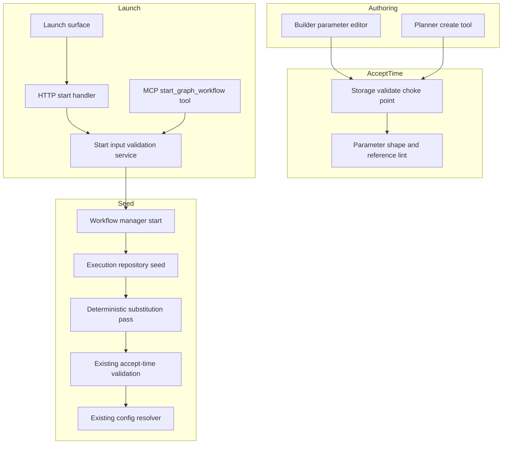
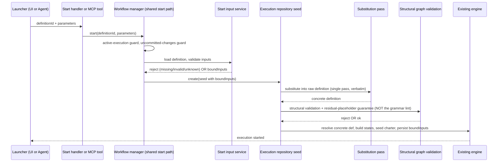
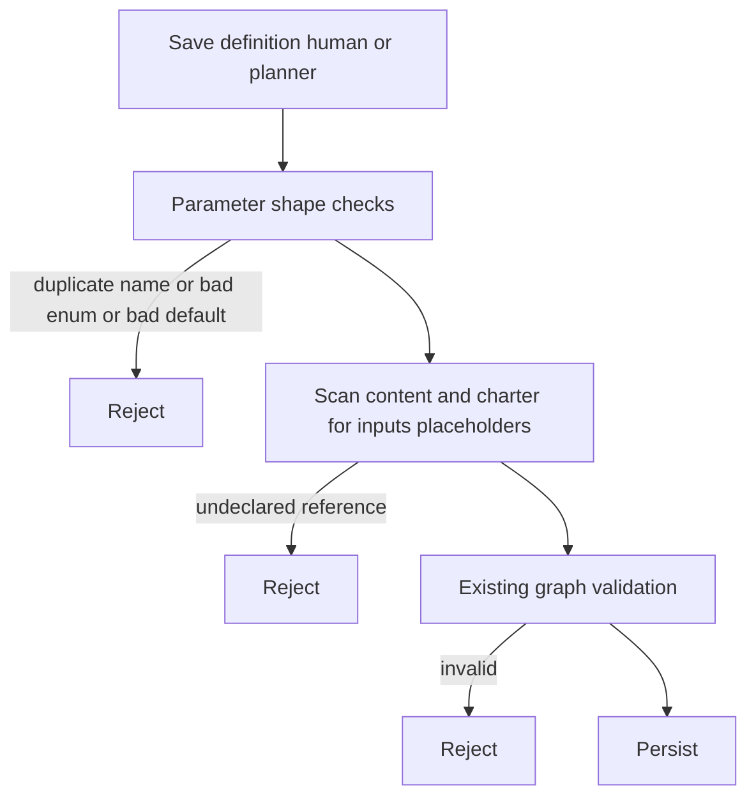

# Design Document: workflow-parameterization

## Overview

**Purpose**: This feature lets a single graph workflow definition be launched repeatedly with run-specific values, instead of being hand-edited or recreated per feature. A definition may declare typed launch inputs; at start the engine validates supplied values, deterministically substitutes `{{inputs.x}}` placeholders into content and charter governance text, re-validates the concrete result through the same structural graph validation a hand-authored workflow passes (the placeholder-grammar lint is authoring-time only and is not re-applied to substituted data), and runs the existing engine unchanged. Substitution runs immediately before the existing config resolver, so the resolved working definition the execution already persists is the concrete, post-substitution graph.

**Users**: Workflow authors (human in the builder; authoring agents via the planner) declare parameters. People launch via a generated launch surface; orchestrating agents launch via a new MCP `start_graph_workflow` tool. Operators/reviewers audit which definition + inputs produced a run.

**Impact**: Adds an additive substitution step between the raw seed definition and the existing seed-time resolver (`createExecutionFromSeed` in `src/lib/workflow-graph/execution-repository.ts`). It introduces no new runtime, no template/instance entity, and no migration: a static definition is simply a zero-input template. Substitution is pure engine code — agents never fill templates. The only new persisted state is one parameter-declaration block on the definition and one bound-input snapshot on the execution.

### Goals
- Declare typed launch parameters (string, multiline text, enum) on a definition as an optional, declarative block.
- Validate supplied inputs and fail closed before any agent tokens are spent; lint undeclared `{{...}}` references at definition-accept time.
- Deterministically substitute across the closed scanned-field surface (content fields + every agent-rendered charter text field) once at seed, before resolution.
- Re-validate the substituted definition through the existing structural graph validation (not the authoring-time placeholder-grammar lint, which must not be re-applied to launcher-supplied data); then seed and run the existing scheduler/validators/approval-gate/charter/audit unchanged.
- Audit `definitionId` + revision and the raw bound input snapshot, alongside the already-persisted resolved working definition + charter snapshot.
- Expose a generated launch surface, a builder parameter editor, an MCP `start_graph_workflow` tool, and planner parameter declaration.

### Non-Goals
- Typed config bindings (per-run approval-gate toggles, model/validator selection).
- Secrets as inputs.
- Cross-project/global template tier and start-time pre-flight prerequisite checks (owned by `global-workflow-templates`).
- Parameterizing context/task IDs or graph topology; mid-run parameter fill; presets/saved parameter sets; promote/fork.
- Conditional edges / expansion nodes / `propose_graph_patch`; a deterministic "command node" step type.
- `boolean`/`number` parameter types (v1 is text substitution; string/text/enum suffice).
- An optional run-inputs blob / per-execution shared run-inputs document and any generic "Run Inputs" echo section.
- A separately persisted materialized-definition snapshot or a hash over it — superseded by the already-persisted resolved working definition + charter snapshot (see Existing Architecture Analysis).

## Boundary Commitments

### This Spec Owns
- The parameter-declaration block on `workflowSemanticDefinitionSchema` (`src/lib/workflows/schemas.ts`) and its accept-time shape validation (duplicate-name, enum-options, default-conformance).
- The accept-time placeholder-grammar + reference lint over the closed scanned-field set (content fields + every agent-rendered charter text field), including the referenced-optional-must-be-required-or-defaulted rule.
- The pure deterministic substitution pass that turns a raw `WorkflowSemanticDefinition` + bound inputs into a concrete `WorkflowSemanticDefinition`.
- The shared start path (`workflowManager.start`) that runs the ordered pre-seed guard chain — active-execution guard, then uncommitted-changes (dirty-worktree) guard — and is invoked by both the HTTP handler and the MCP start tool, so both surfaces enforce identical guards before any seed (R9.7).
- The start-time input-validation pipeline (derive launch-input schema, `safeParse` against a `.strict()` object, apply defaults, reject unknown) shared by HTTP and MCP, invoked inside the shared start path after the guards and before the seed.
- The one new execution audit field (the raw bound input snapshot) and its durability coverage; surfacing the input snapshot to humans.
- The MCP `start_graph_workflow` tool, the HTTP start-request extension, and the planner parameter-declaration extension.
- Launch-surface and builder parameter-editor behavior/data contracts (not visual design).

### Out of Boundary
- The config cascade/resolver, scheduler, validator runners, approval gate, charter authority/hash, lane/merge machinery — reused unchanged; this spec must not alter their behavior.
- Cross-project/global storage, library browse, and pre-flight prerequisite checking (`global-workflow-templates`).
- Concrete visual/layout/component design of the launch surface and parameter editor (owned downstream by Claude Design; this spec specifies capabilities, data, states, and acceptance behavior only).
- Any runtime graph dynamism or re-substitution after seed.

### Allowed Dependencies
- `src/lib/workflows/schemas.ts` and `src/lib/workflows/charter-schemas.ts` (extend the definition schema; `charter-schemas.ts` enumerates the charter text fields that `src/lib/workflow-graph/charter/render.ts` renders into prompts/docs and that therefore form the charter portion of the scanned-field set).
- `src/lib/workflow-graph/storage.ts` accept-time validation choke point (`validateWorkflowDefinition` via `assertValidDefinition`).
- `src/lib/workflow-graph/execution-repository.ts` seed seam (`GraphWorkflowExecutionSeed`, `createExecutionFromSeed`) and `resolve-config.ts` resolver (called unchanged, on the substituted definition).
- `src/lib/workflow-graph/execution-route-handlers.ts` (HTTP start), `src/lib/mcp-gateway/session-server.ts` + `src/lib/workflow-graph/planner-tools.ts` (MCP registration/authoring), `src/lib/workflow-graph/workflow-manager.ts` (`start`).
- `@/lib/logging` (`createLogger`), Zod v4, `src/lib/shared/testing/round-trip-durability.ts` and the persistence fixture (definition coverage in `src/lib/workflow-graph/storage.contract.test.ts`; execution-field coverage in `src/lib/state-store/sessions-repo.contract.test.ts`, which round-trips `graphWorkflowExecution`).
- Dependency direction (enforced): **Schemas → Substitution/Lint (pure) → Start service → Repository seed → Route handlers / MCP tools / Planner → UI.** Each layer imports only leftward.

### Revalidation Triggers
- Any change to the parameter-declaration schema shape (consumed by `global-workflow-templates`).
- Any change to the substitution field set.
- Any change to `GraphWorkflowExecutionSeed`'s input contract or the start-request payload shape.
- Any change to which fields are substituted vs. treated as config.

## Architecture

### Existing Architecture Analysis
- **Definition/execution split already exists**: `workflowDefinitionRecordSchema.definition` is a `WorkflowSemanticDefinition`; an execution snapshots `seedDefinitionId`, `seedDefinitionRevision`, `workingDefinition` (resolved), and `charter`. Parameterization adds inputs at the seam, not a new entity.
- **The concrete post-substitution graph is already captured by existing snapshots**: `createExecutionFromSeed` builds `workingDefinition = resolveWorkflowDefinition(global, seed.definition)` and snapshots `charter: seed.definition.charter`. Because substitution runs on `seed.definition` *before* this, the persisted `workingDefinition` (the resolved concrete graph) and the `charter` snapshot are already post-substitution and placeholder-free — they record exactly what the run executes. The resolver is lossy on the top-level `parameters`/`charter`/`workflowConfig` blocks (dropped from `resolvedWorkflowSemanticDefinitionSchema`), but those are not needed to reconstruct *what ran*: the per-context resolved values and the charter snapshot already hold it. Therefore this spec does **not** add a separate materialized-definition snapshot or a hash over it; the only new execution field is the raw bound input snapshot (`boundInputs`), which records *which inputs* produced the run. (Saved definitions are mutable with no revision history, so the raw template at run time is not recoverable — but the resolved + charter snapshots already preserve the concrete result, which is the audit-relevant artifact.)
- **Single accept-time validation choke point**: `assertValidDefinition` → `validateWorkflowDefinition` in `storage.ts`, called by both human and planner save paths. The placeholder-grammar lint + parameter-shape checks attach here (authoring time). The **seed-time** re-validation of a substituted definition reuses only the *structural* portion of this path (graph/spec-lint + non-empty required-content checks) plus the single-pass substitution guarantee — it does **not** re-apply the placeholder-grammar lint, because substituted values are launcher data that may legitimately contain `{{` (R5.1, R5.5).
- **Single seed seam**: `createExecutionFromSeed` resolves `seed.definition` and snapshots `seed.definition.charter`. Substitution runs on `seed.definition` immediately before resolution, so resolver, `validateResolvedWorkflow`, state build, lane plan, and charter seeding are reused untouched.
- **Start guards are currently inline in the HTTP `START` handler** (active-execution guard, then uncommitted-changes guard via `readSessionWorktreeDirtyPaths`), and there is no MCP start tool yet. This spec creates the MCP start tool and, to give both surfaces identical guards, consolidates the active-execution + uncommitted-changes guards into the shared start path (`workflowManager.start`) both the HTTP handler and the MCP tool call (R9.1, R9.7). Relocating the guards is a behavior-neutral refactor — they still run before any seed — and gives the downstream `global-workflow-templates` spec a single chain to insert its prerequisite gate into.
- **Patterns preserved**: Zod-first schemas with `z.infer`; deps-injected services (factory + setter patterns); structured logging via `createLogger`; schema-driven round-trip durability contracts.

### Architecture Pattern & Boundary Map



**Architecture Integration**:
- Selected pattern: additive seed-time substitution (one pure pass + new schema block + one audit field). Rationale in `research.md`.
- Domain/feature boundaries: pure substitution/lint code is dependency-free and unit-testable; the start service owns input validation; the repository seed owns wiring substitution into the existing flow.
- Existing patterns preserved: config cascade, charter seeding, approval gate, audit fields, durability contracts.
- New components rationale: each new module exists because a stated requirement needs a single-responsibility home (declared below).
- Steering compliance: composable primitives (extends `actions`/`resolve-config`/`execution-repository`, no fork); general primitive (no special-casing); Zod-first; comprehensive logging.

### Technology Stack

| Layer | Choice / Version | Role in Feature | Notes |
|-------|------------------|-----------------|-------|
| Frontend | React 19 + Next.js 16 | Launch surface + builder parameter editor (behavior/data only; visual design downstream) | Consumes parameter schema + start-time errors |
| Backend / Services | TypeScript (strict), Zod v4 | Parameter schema, lint, substitution, start-input validation, MCP/HTTP/planner wiring | `z.infer` types; `safeParse` external, `parse` internal |
| Data / Storage | better-sqlite3 (execution via session repo), JSON file store (definition via `storage.ts`) | Persist parameter declarations + bound-input snapshot | Round-trip durability contracts extended |

## File Structure Plan

### Directory Structure
```
src/lib/workflows/
├── schemas.ts                         # MODIFY: add parameterDeclarationSchema (discriminated by type),
│                                      #   add `parameters` to workflowSemanticDefinitionSchema,
│                                      #   add `boundInputs` to graphWorkflowExecutionSchema
└── charter-schemas.ts                 # No shape change; mission, conventions, nonGoals, vocabulary,
                                       #   ownershipMap, testStrategy, knownAmbiguities, and each source's
                                       #   label/locator/description/appliesTo are substitution targets (string fields already)

src/lib/workflow-graph/
├── parameter-substitution.ts          # NEW: pure substitution pass + CONTENT_FIELD traversal + post-substitution assertion
├── parameter-validation.ts            # NEW: pure lintParameterReferences() + parameter-shape checks + buildLaunchInputSchema()
├── start-input-service.ts             # NEW: validate/normalize launch payload (defaults, unknown) -> boundInputs
├── start-graph-workflow-tool.ts       # NEW: registerStartGraphWorkflowTool() (MCP), routes to shared start service
├── validation.ts                      # MODIFY: invoke lint + parameter-shape checks from the accept-time path
├── storage.ts                         # MODIFY: assertValidDefinition runs the extended accept-time validation
├── execution-repository.ts            # MODIFY: GraphWorkflowExecutionSeed gains `inputs`;
│                                      #   createExecutionFromSeed runs substitution + re-validation; persist boundInputs
├── execution-route-handlers.ts        # MODIFY: startExecutionSchema -> { definitionId, parameters? }; thin handler that
│                                      #   delegates to the shared start path; active-execution + uncommitted-changes guards
│                                      #   MOVE OUT of the handler into workflow-manager.start
├── workflow-manager.ts                # MODIFY: `start` becomes the shared start path both HTTP and MCP call — runs the
│                                      #   active-execution + uncommitted-changes guards (dirty-path reader injected) and the
│                                      #   start-input validation, then threads inputs to repository.create seed
└── planner-tools.ts                   # MODIFY: create/replace schema gains `parameters`; inflateToSemanticDefinition carries them

src/lib/mcp-gateway/
└── session-server.ts                  # MODIFY: register start_graph_workflow tool alongside planner tools

src/lib/workflow-graph/storage.contract.test.ts   # MODIFY: maximal definition fixture declares every parameter type
src/lib/state-store/sessions-repo.contract.test.ts # MODIFY: execution fixture carries boundInputs (the new execution field)

src/features/workflow-builder/          # MODIFY: parameter-declaration editor (capabilities/data per R8; visual design downstream)
src/features/<workflow-launch>/         # MODIFY/NEW: launch surface generated from parameter schema (capabilities/data per R7)
```

### Modified Files
- `src/lib/workflows/schemas.ts` — add parameter declaration union + `parameters` block + execution audit field (`boundInputs`).
- `src/lib/workflow-graph/validation.ts` — call parameter lint/shape checks from accept-time validation; used for both authoring and substituted re-validation.
- `src/lib/workflow-graph/execution-repository.ts` — wire substitution + re-validation into `createExecutionFromSeed`; persist `boundInputs`.
- `src/lib/workflow-graph/execution-route-handlers.ts` — extend start request; thin handler delegating to the shared start path; the active-execution + uncommitted-changes guards relocate to `workflow-manager.start`.
- `src/lib/workflow-graph/workflow-manager.ts` — `start` becomes the shared start path: runs the active-execution + uncommitted-changes guards + start-input validation, then threads inputs through to the seed; both HTTP and MCP call it.
- `src/lib/workflow-graph/planner-tools.ts` — planner parameter declaration; reuse accept-time lint.
- `src/lib/mcp-gateway/session-server.ts` — register the MCP start tool.
- `src/lib/workflow-graph/storage.contract.test.ts` — extend the maximal definition fixture with declared parameters.
- `src/lib/state-store/sessions-repo.contract.test.ts` — extend the maximal execution fixture with a non-empty `boundInputs` snapshot (this contract round-trips `graphWorkflowExecution`).

> Dependency direction: pure modules (`parameter-substitution`, `parameter-validation`) import only schemas; `start-input-service` imports validation; route handlers / MCP / planner import the service + manager; UI imports schema-derived types only.

## System Flows

### Launch → substitute → run (sequence)



Key decisions: the guards and input validation run inside the shared start path (`workflowManager.start`) that both HTTP and MCP call, before any execution is seeded (fail-closed, no tokens spent, identical across surfaces — R9.7); substitution and structural re-validation run inside the seed so the existing resolver/charter/state-build path is reused unchanged; the authoring-time placeholder-grammar lint is not re-applied to substituted data (R5.1, R5.5).

### Accept-time validation (process)



The structural portion of this path (graph validation + non-empty required-content checks) re-validates a substituted concrete definition at seed (R5), so substitution cannot bypass the engine's structural guarantees. The placeholder-grammar lint (the `{{...}}` scan) is authoring-time only and is not re-applied to substituted data (R5.1, R5.5).

## Requirements Traceability

| Requirement | Summary | Components | Interfaces | Flows |
|-------------|---------|------------|------------|-------|
| 1.1–1.7 | Typed parameter declaration block (string/text/enum) | Definition Schema, Parameter Validation | `parameterDeclarationSchema`, accept-time shape checks | Accept-time validation |
| 2.1–2.8 | Placeholder-grammar + reference lint (incl. referenced-optional-must-be-required-or-defaulted, full charter surface, no-escape) at accept time | Parameter Validation, Storage Validation | `lintParameterReferences` | Accept-time validation |
| 3.1–3.7 | Start-time input validation (strict `.strict()` payload rejects unknown keys; secrets policy-prohibited / out of scope, no redaction) | Start Input Service | `buildLaunchInputSchema`, `validateLaunchInputs` | Launch sequence |
| 4.1–4.7 | Deterministic seed-time substitution before resolution | Substitution Pass, Execution Repository Seed | `substituteContent` | Launch sequence |
| 5.1–5.5 | Re-validation of substituted definition (structural only; grammar lint not re-applied to data) | Graph Validation (structural), Repository Seed | structural `validateWorkflowDefinition` (minus the placeholder-grammar lint) + single-pass substitution guarantee | Launch + accept-time |
| 6.1–6.5 | Execution audit of bound inputs | Execution Schema, Repository Seed | `boundInputs` | Launch sequence |
| 7.1–7.7 | Human launch surface capabilities | Launch UI | parameter schema + start errors | Launch sequence |
| 8.1–8.5 | Builder parameter editor | Builder UI, Storage Validation | parameter declarations + lint errors | Accept-time validation |
| 9.1–9.7 | MCP start tool (shared start path + guards) + planner declaration | MCP Start Tool, HTTP Start Handler, Workflow Manager (shared start path), Planner Tools, Start Input Service | `start_graph_workflow`, shared guard chain, planner `parameters` | Launch + accept-time |
| 10.1–10.4 | General primitive + backward compat | All; Definition Schema defaults | zero-input defaulting | All |

## Components and Interfaces

| Component | Domain/Layer | Intent | Req Coverage | Key Dependencies (P0/P1) | Contracts |
|-----------|--------------|--------|--------------|--------------------------|-----------|
| Definition Schema | Schemas | Declare parameters + bound-input audit field | 1, 6, 10 | charter-schemas (P0) | State |
| Parameter Validation | Pure logic | Lint + shape checks + launch-schema derivation | 1, 2, 3, 5, 8, 9 | Definition Schema (P0) | Service |
| Substitution | Pure logic | Concrete definition | 4, 5 | Definition Schema (P0), Parameter Validation (P1) | Service |
| Start Input Service | Service | Validate/normalize launch payload | 3, 9 | Parameter Validation (P0) | Service |
| Execution Repository Seed | Persistence | Wire substitution + re-validation + persist bound-input snapshot | 4, 5, 6, 10 | Substitution (P0), Resolver (P0) | State, Batch |
| HTTP Start Handler | API | Parse payload; delegate to the shared start path (guards + input validation live there) | 3, 7, 9 | Workflow Manager / shared start path (P0) | API |
| MCP Start Tool | API | Agent launch via the shared start path (same guards + validation as HTTP) | 9 | Workflow Manager / shared start path (P0) | API |
| Workflow Manager (shared start path) | Orchestration | Run the ordered pre-seed guard chain (active-execution → uncommitted-changes) + start-input validation, then seed | 3, 9 | Start Input Service (P0), Execution Repository Seed (P0) | API |
| Planner Tools | API | Author parameters | 1, 2, 9 | Storage Validation (P0) | API |
| Launch UI | UI | Generated launch surface | 7 | Definition Schema types (P1) | — |
| Builder UI | UI | Parameter editor | 8 | Definition Schema types (P1), Storage Validation errors (P1) | — |

### Schemas

#### Definition Schema (parameter declaration + audit field)

| Field | Detail |
|-------|--------|
| Intent | Add an optional ordered parameter-declaration block to the semantic definition and one bound-input snapshot to the execution. |
| Requirements | 1.1, 1.2, 1.3, 1.6, 6.1, 6.2, 6.5, 10.2 |

**Responsibilities & Constraints**
- `parameterDeclarationSchema` is a `type`-discriminated union (`string`, `text`, `enum`). Common fields: `name` (kebab/identifier, non-empty), `label` (non-empty), `required` (boolean, default false). Per-type: `enum` carries non-empty `options: string[]`; all types carry an optional `default` typed to the variant; string/text may carry optional min/max-length validation bounds.
- `workflowSemanticDefinitionSchema.parameters` is `z.array(parameterDeclarationSchema).default([])` so static definitions parse as zero-input (R1.4, R10.2) with no migration.
- `graphWorkflowExecutionSchema` gains one audit field: `boundInputs: z.record(z.string(), z.string()).default({})`. All supported parameter types (string/text/enum) bind to string values, so the value type is `string`; `.default({})` is a safe additive default that legacy execution rows satisfy on read-back (no nullable/snapshot gymnastics required, R10.2).
- Types derived via `z.infer`; no hand-written duplicates.

**Contracts**: State [x]

##### State Management
- State model: parameter declarations live on the persisted definition; the bound-input snapshot lives on the persisted execution.
- Persistence & consistency: definition via JSON store (`storage.ts`); execution via session repo (SQLite). Definition declarations covered by `storage.contract.test.ts`; `boundInputs` covered by `sessions-repo.contract.test.ts` (round-trips `graphWorkflowExecution`).
- Concurrency strategy: unchanged from existing definition/execution persistence.

#### Parameter Validation (pure)

| Field | Detail |
|-------|--------|
| Intent | Accept-time lint + shape checks, and per-launch schema derivation. |
| Requirements | 1.5, 1.7, 2.1, 2.2, 2.3, 2.4, 2.5, 2.6, 2.7, 2.8, 3.1, 3.3, 3.4, 3.5, 5.1, 8.2, 8.3, 9.3 |

**Contracts**: Service [x]

##### Service Interface
```typescript
interface ParameterValidation {
  // Accept-time: structural checks on declarations (duplicate name, enum options
  // non-empty, declared default conforms to type+options). Returns graph-style
  // validation errors so it composes with validateWorkflowDefinition.
  validateParameterDeclarations(
    parameters: ParameterDeclaration[],
  ): WorkflowGraphValidationError[];

  // Accept-time: scan the closed scanned-field set (content fields + every
  // agent-rendered charter text field) for {{...}} occurrences and enforce the
  // placeholder grammar. Reports: any {{...}} that is not the exact token
  // {{inputs.<name>}} (unknown namespace, internal whitespace, malformed braces,
  // bare `{{`); any reference to an undeclared parameter; and any reference to a
  // declared parameter that is neither required nor defaulted (no effective value
  // at substitution).
  lintParameterReferences(
    definition: WorkflowSemanticDefinition,
  ): WorkflowGraphValidationError[];

  // Start-time: derive a .strict() Zod object schema keyed by parameter name,
  // with per-field schema chosen by declared type and required/default/enum
  // applied. .strict() rejects unknown KEYS only; it does not constrain the
  // CONTENT of accepted values (no secret type, no redaction — secrets are
  // policy-prohibited / out of scope).
  buildLaunchInputSchema(
    parameters: ParameterDeclaration[],
  ): z.ZodType<Record<string, string>>;
}
```

**Placeholder grammar (R2.2)**: the only recognized token is the literal `{{inputs.<name>}}` where `<name>` is a declared parameter identifier and NO whitespace appears anywhere between the opening and closing braces (i.e. `{{`, `inputs.`, `<name>`, `}}` with no spaces). The scanner detects every `{{` in a scanned field; any `{{` that does not begin an exact valid token (including bare/literal `{{` — there is no escape mechanism in v1) is a lint error identifying the field and the offending token (R2.3, R2.8). A valid-token reference to an undeclared name is a lint error (R2.3); a valid-token reference to a declared-but-neither-required-nor-defaulted parameter is a lint error (R2.7). Declared-but-unreferenced parameters (including optional ones with no default) remain accepted (R2.6).

- Preconditions: `parameters` already parse against `parameterDeclarationSchema`.
- Postconditions: errors carry a field/parameter (or offending-token) locator (R2.3, R2.7, R8.3); `buildLaunchInputSchema` rejects unknown keys via `.strict()` (R3.5) and enforces enum/required (R3.1–R3.3); it applies no secret-content constraint or redaction (R3.7).
- Invariants (binding): a single exported constant — `SUBSTITUTION_FIELD_SET` — is the sole definition of the scanned-field surface (content fields + the full agent-rendered charter surface) and is consumed by BOTH `lintParameterReferences` and `substituteContent`; neither module may enumerate fields independently. A drift-guard unit test asserts the charter portion of this constant equals exactly the fields `src/lib/workflow-graph/charter/render.ts` renders into prompts/materialized docs, so a charter text field added to the render surface without being added here fails the suite (R2.1, R4.1). This is the load-bearing anti-drift mechanism: if the lint scan and the substitution pass ever diverge, either a `{{...}}` token escapes to an agent as literal text or a rendered field is substituted without being linted.

**Implementation Notes**
- Integration: `validateParameterDeclarations` + `lintParameterReferences` are invoked from the accept-time `validateWorkflowDefinition` path only (definition authoring, both human and planner); `buildLaunchInputSchema` is invoked from the start service at launch. **Binding invariant (R5.1, R5.5)**: `lintParameterReferences` (the placeholder-grammar lint) MUST remain a function distinct from the structural `validateWorkflowDefinition` and MUST be invoked only on the authoring path — it must never be folded into the structural validator. `validateWorkflowDefinition` is purely structural today (graph/spec-lint + non-empty required-content checks); this spec attaches the grammar lint *alongside* it on the authoring path, NOT inside it. The seed-time re-validation of a substituted definition therefore calls only the structural validator + the single-pass substitution guarantee, never `lintParameterReferences`, because substituted launcher data may legitimately contain a literal `{{...}}`. A regression test launches a definition whose bound value contains `{{` (for example `${{ matrix.os }}` or a brief describing `{{inputs.y}}`) and asserts it seeds successfully.
- Validation: `safeParse` for external launch payloads; structural errors are graph-validation-shaped.
- Risks: the single shared `SUBSTITUTION_FIELD_SET` constant (above) is the only place the substitutable field surface is defined — any newly substitutable content/charter field must be added there, never independently in either consumer.

#### Substitution (pure)

| Field | Detail |
|-------|--------|
| Intent | Produce one concrete definition from a raw definition and bound inputs. |
| Requirements | 4.1, 4.2, 4.3, 4.4, 4.5, 4.6, 4.7, 5.3 |

**Contracts**: Service [x]

##### Service Interface
```typescript
interface ParameterSubstitution {
  // Pure deterministic substitution over the closed scanned-field set (content
  // fields + every agent-rendered charter text field: mission, conventions,
  // nonGoals, vocabulary, ownershipMap, testStrategy, knownAmbiguities, and each
  // source's label/locator/description/appliesTo). Single simultaneous pass:
  // replaces every {{inputs.<name>}} token located in the TEMPLATE with the bound
  // value; bound values are inserted verbatim and are never re-scanned or
  // re-substituted, so a literal {{...}} inside a bound value (even a literal
  // {{inputs.<name>}}) is left intact and is not an unresolved placeholder (R4.7).
  // Never touches ids, task.order, edges, or config/command fields.
  substituteContent(
    definition: WorkflowSemanticDefinition,
    boundInputs: Record<string, string>,
  ): WorkflowSemanticDefinition;
}
```
- Preconditions: `boundInputs` already validated by the start service; every referenced name is declared (guaranteed by accept-time lint).
- Postconditions: deterministic (same inputs → same concrete def, R4.5); every template placeholder replaced in a single pass, values inserted verbatim and never re-scanned (R4.7); IDs/order/edges and command fields unchanged (R4.3, R4.4).
- Invariants: substitution runs exactly once per seed, before resolution; runtime/agent-added content is never re-substituted (R4.6, enforced by running only at seed); the substituted field surface is read from the shared `SUBSTITUTION_FIELD_SET` constant (Parameter Validation, above) — never enumerated locally.

**Implementation Notes**
- Integration: called inside `createExecutionFromSeed` before `resolveWorkflowDefinition`, so the persisted resolved working definition is already concrete (R4.7).
- Validation: all supported types bind to strings, so substitution is plain string replacement — no locale/number/boolean rendering concerns.
- Risks: substituting a field the lint never guarded (or vice-versa) is the primary correctness/security hazard; both modules MUST traverse the single shared `SUBSTITUTION_FIELD_SET` constant so they cannot drift.

#### Start Input Service

| Field | Detail |
|-------|--------|
| Intent | Validate and normalize a launch payload into bound inputs; one path for HTTP + MCP. |
| Requirements | 3.1, 3.2, 3.3, 3.4, 3.5, 3.6, 3.7, 9.2, 9.4 |

**Contracts**: Service [x]

##### Service Interface
```typescript
interface StartInputService {
  // Validate supplied values against the definition's parameters using a .strict()
  // derived schema (rejecting any unknown KEY), apply defaults. Returns bound
  // inputs or a discriminated rejection the caller maps to a 4xx / tool error.
  // No redaction or secret-handling is applied; values are treated as
  // non-sensitive. Secrets are policy-prohibited / out of scope — the service does
  // not inspect or reject values for secret content (R3.7).
  validateLaunchInputs(input: {
    parameters: ParameterDeclaration[];
    supplied: Record<string, unknown> | undefined;
  }): Result<
    { boundInputs: Record<string, string> },
    LaunchInputError
  >;
}

type LaunchInputError =
  | { kind: "missing_required"; name: string }
  | { kind: "invalid_value"; name: string; message: string }
  | { kind: "unknown_parameter"; name: string };
```
- Preconditions: definition loaded; `parameters` parsed.
- Postconditions: on success, every required parameter has a value (supplied or default, R3.4); the `.strict()` payload schema rejects any unknown key — any field that is not a declared parameter (R3.5); accepted values are returned unredacted, with no secret-content inspection (R3.7); zero-input definition with empty payload returns empty bound inputs (R3.6, R10).
- Invariants: no execution is seeded and no agent turn starts on rejection (R3.2, R3.3).

**Implementation Notes**
- Integration: invoked inside the shared start path (`workflowManager.start`) after the active-execution + uncommitted-changes guards and before the seed, so HTTP and MCP share one guard+validation chain (R9.7).
- Validation: uses the `.strict()` `buildLaunchInputSchema` then layers required-presence + default-application checks for precise `LaunchInputError` codes.
- Risks: keep error codes stable — the UI maps them to field-level messages (R7.4/R7.5).

#### Execution Repository Seed (modified)

| Field | Detail |
|-------|--------|
| Intent | Run substitution + re-validation, persist the bound-input snapshot — inside the existing seed. |
| Requirements | 5.1, 5.2, 5.4, 6.1, 6.2, 6.5, 10.4 |

**Contracts**: State [x], Batch [x]

##### Batch / Job Contract
- Trigger: `create(projectPath, sessionName, seed)` where `GraphWorkflowExecutionSeed` now carries `inputs: Record<string, string>`.
- Input / validation: `createExecutionFromSeed` calls `substituteContent(seed.definition, seed.inputs)` (single-pass, verbatim), then re-validates the concrete definition through the **structural** graph validation (`validateWorkflowDefinition` minus the placeholder-grammar lint) plus the single-pass substitution guarantee — NOT the grammar lint, which would reject a launcher value legitimately containing `{{` (R5.1, R5.5); failure throws `GraphWorkflowValidationError` and seeds nothing (R5.2). It then resolves the **concrete** definition via the existing `resolveWorkflowDefinition` and snapshots `charter` from the concrete definition — so `workingDefinition` and the `charter` snapshot are already post-substitution.
- Output / destination: execution persists `boundInputs = seed.inputs` plus existing `seedDefinitionId/Revision/workingDefinition/charter`. No separate materialized snapshot or hash is written — the resolved working definition + charter snapshot are the concrete record (R6.1).
- Idempotency & recovery: substitution is deterministic; re-seed of the same inputs yields the same concrete definition. `boundInputs` persists across save/load (R6.2) and is covered by the `sessions-repo` durability contract.

**Implementation Notes**
- Integration: minimal, surgical change to `createExecutionFromSeed`; downstream resolver/state-build/charter-seed unchanged.
- Validation: zero-input runs still flow through (empty `boundInputs`) for uniform audit shape (R6.5).
- Risks: ensure substitution precedes resolution so the resolved working definition contains no placeholders.

#### MCP Start Tool / HTTP Start / Planner (API)

| Field | Detail |
|-------|--------|
| Intent | Expose parameterized launch (agent + human) and parameter authoring (planner). |
| Requirements | 7.7, 9.1, 9.2, 9.4, 9.5, 9.6, 1.x/2.x via planner |

##### API Contract
| Method | Endpoint / Tool | Request | Response | Errors |
|--------|-----------------|---------|----------|--------|
| POST | workflow start route | `{ definitionId, parameters? }` | started execution | 400 invalid/missing input, 404 unknown definition, 409 active/uncommitted |
| MCP | `start_graph_workflow` | `{ definitionId, parameters? }` | start outcome / structured error | missing/invalid/unknown-key input, not-found, active-execution / uncommitted-changes (same guards as HTTP, via the shared start path) |
| MCP | `create_graph_workflow` / `replace_graph_workflow` | existing + `parameters?` | definition record | accept-time lint / shape rejection |

- The HTTP handler and the MCP start tool are both thin: they parse the payload and call the **shared start path** (`workflowManager.start`), which runs the ordered pre-seed guard chain (active-execution guard → uncommitted-changes guard) → start-input validation → seed (substitute + structural re-validation). So both surfaces enforce identical guards *and* identical input validation/substitution (R9.1, R9.2, R9.7); an agent launch cannot start a run in a state a human launch would reject. No mid-run fill capability is exposed (R9.5). Unknown definition → not-found, nothing seeded (R9.6). Planner `parameters` are subject to the same accept-time lint (R9.3).

**Implementation Notes**
- Integration: register `start_graph_workflow` in `session-server.ts` next to planner tools; extend `startExecutionSchema` and `planner-tools` schemas. Consolidate the active-execution + uncommitted-changes guards (today inline in the HTTP `START` handler) into the shared start path (`workflowManager.start`), threading the dirty-path reader as an injected dep, so both surfaces inherit them.
- Validation: `safeParse` all external payloads; map `LaunchInputError` and the guard rejections to 4xx / 409 / structured tool error.
- Risks: the guards move to the shared start path but their ordering and preconditions are unchanged (active-execution before uncommitted-changes, both before any seed); keep them ahead of input validation so the downstream `global-workflow-templates` prerequisite gate has a single insertion point.

### UI Components (capabilities/data only — visual design downstream)

#### Launch UI

| Field | Detail |
|-------|--------|
| Intent | Render a launch surface generated from the parameter schema; collect + validate values; submit. |
| Requirements | 7.1, 7.2, 7.3, 7.4, 7.5, 7.6, 7.7 |

**Implementation Note**: Consumes the definition's `parameters` (schema-derived types) to render one affordance per parameter keyed by type; constrains enum inputs to declared options; pre-populates defaults; surfaces missing-required and per-field validation states and blocks launch until resolved; on submit sends `{ definitionId, parameters }` and reflects the start outcome including engine rejection reasons. No concrete layout/component/styling decisions are made here — those are produced by Claude Design and supplied to implementers as a downstream input. The required states/data/validation conditions above are the binding contract.

#### Builder UI (parameter editor)

| Field | Detail |
|-------|--------|
| Intent | Add/edit/remove parameter declarations during authoring; surface declaration + lint errors pre-save. |
| Requirements | 8.1, 8.2, 8.3, 8.4, 8.5 |

**Implementation Note**: Lets the author manage each declaration's name/type/label/required/default and (for enum) options; surfaces duplicate-name before save and the accept-time lint error (offending field + undeclared name) on save; persists declarations with the definition on success. Visual design is downstream; the editable data, error states, and save behavior above are the binding contract.

## Data Models

### Logical Data Model
- **ParameterDeclaration** (value object on the definition): discriminated by `type` (`string`|`text`|`enum`); `name` is the natural key within `parameters` (unique — enforced by R1.5 check). Ordered array preserves authoring/display order.
- **BoundInputs** (on the execution): `record<name, string>` — the validated, default-applied snapshot (R6.1). All supported types bind to string values.
- **Concrete definition** (transient at seed): the substituted `WorkflowSemanticDefinition`; not persisted as a standalone snapshot — it flows into the resolved `workingDefinition` + `charter` snapshot the execution already persists.

### Consistency & Integrity
- Definition save is atomic (existing `writeJsonAtomically`); accept-time validation gates every write.
- Execution seed is transactional via the session mutate; `boundInputs` is written in the same seed mutation as the working definition (no partial audit state).

## Error Handling

### Error Strategy
Fail-closed at the earliest deterministic gate (steering: deterministic checks before agent turns).

### Error Categories and Responses
- **Accept-time (definition save)**: duplicate-name, bad enum options, non-conforming default, any grammar-violating `{{...}}` token (unknown namespace, internal whitespace, malformed/bare braces), reference to an undeclared parameter, or reference to a declared-but-neither-required-nor-defaulted parameter → reject save with a graph-validation-shaped error carrying the field/parameter (or offending-token) locator (R1.5, R1.7, R2.3, R2.7, R2.8, R8.2, R8.3). Same path validates the substituted definition (R5.2).
- **Start-time (launch)**: `missing_required` / `invalid_value` / `unknown_parameter` → 400 (HTTP) or structured tool error (MCP); nothing seeded, no tokens spent (R3.2, R3.3, R9.6). A field that is not a declared parameter (an unknown key) is rejected by the `.strict()` payload schema as `unknown_parameter` (R3.5). No value is rejected for secret content — secrets are policy-prohibited / out of scope, not enforced (R3.7). Unknown definition → 404 / not-found. The active-execution and uncommitted-changes guards (409) run in the shared start path ahead of input validation, so they apply identically to HTTP and MCP (R9.7).
- **Seed-time**: substituted definition fails the **structural** re-validation → `GraphWorkflowValidationError`, no execution seeded (R5.2). Empty/whitespace required content after substitution is caught by the reused structural content checks (R5.3). A literal `{{...}}` inside a substituted value does NOT fail re-validation — the placeholder-grammar lint is authoring-time only and is not re-applied to data (R5.5).

### Monitoring
Structured logging via `createLogger` at: accept-time lint outcome, start-input validation outcome (with rejection code, not the values), substitution (definition id, revision, parameter count — not the bound values), and seed. Bound input values are kept out of logs to limit prompt-noise and accidental spread; this is not a secret-safety guarantee (values are persisted and surfaced unredacted for audit, R6.3) but it keeps logs values-free consistent with R6.4.

## Testing Strategy

### Unit Tests
- `validateParameterDeclarations`: duplicate-name rejected with locator; enum with empty options rejected; declared default not in enum options rejected; non-conforming default rejected (R1.3, R1.5, R1.7).
- `lintParameterReferences`: undeclared `{{inputs.x}}` in task instructions / context acceptance criteria / each agent-rendered charter field (mission, conventions, nonGoals, vocabulary, ownershipMap, testStrategy, knownAmbiguities, source label/locator/description/appliesTo) rejected with a locator; grammar violations rejected — unknown namespace `{{execution.id}}`, internal whitespace `{{ inputs.x }}`, malformed braces, bare/literal `{{` (no escape); valid reference to a declared-but-neither-required-nor-defaulted parameter rejected (R2.7); all-declared-and-required/defaulted accepted; declared-but-unused (incl. optional no-default) accepted (R2.1–R2.8).
- `buildLaunchInputSchema` + start service: missing required (no default) → `missing_required`; default applied when omitted; enum value outside options → `invalid_value`; unknown key → `unknown_parameter` via `.strict()` (also the structural secret guarantee — no secret type exists, R3.7); zero-input empty payload → empty bound inputs (R3.1–R3.7).
- `substituteContent`: substitutes across all content + every agent-rendered charter text field; leaves IDs/order/edges and command/config fields untouched; deterministic output for identical inputs; single simultaneous pass — a bound value that itself contains a literal `{{...}}` (including a literal `{{inputs.<name>}}`) is inserted verbatim and is not re-substituted or flagged as residual (R4.1–R4.7, R5.5).
- Field-set drift guard: a unit test asserts the charter portion of the shared `SUBSTITUTION_FIELD_SET` constant equals exactly the charter text fields `src/lib/workflow-graph/charter/render.ts` renders into prompts/materialized docs — so adding a rendered charter field without registering it as substitutable fails the suite (R2.1, R4.1). The lint and substitution both read this one constant.
- Lint separation guard: a test confirms the seed-time re-validation path does NOT re-apply the placeholder-grammar lint — a definition launched with a bound value containing a literal `{{` re-validates and seeds successfully (proving `lintParameterReferences` is not folded into the structural validator, R5.1, R5.5).

### Integration Tests
- Seed path (`createExecutionFromSeed`): parameterized seed → substituted definition re-validated through the **structural** path, resolved working definition + charter snapshot have no template placeholders, `boundInputs` persisted; failing substituted definition seeds nothing (R5.1, R5.2, R5.4, R6.1); a launch whose input value contains a literal `{{...}}` (e.g. `${{ x }}` or a brief describing `{{inputs.y}}`) re-validates and seeds successfully — the grammar lint is not re-applied to data (R5.5).
- Accept-time parity: a planner-authored definition with an undeclared reference is rejected exactly like a human-authored one (R2.4, R9.3).
- Start parity: HTTP and MCP `start_graph_workflow` route through the shared start path and apply identical guards (active-execution + uncommitted-changes, R9.7), input validation, and substitution; mid-run fill is absent; zero-input via MCP behaves like human zero-input (R9.1, R9.2, R9.4, R9.5). An MCP launch against an active execution or a dirty worktree is rejected exactly like an HTTP launch.

### Durability (round-trip contracts)
- Extend the definition storage contract maximal fixture (`storage.contract.test.ts`) to declare every parameter type; assert declarations survive save/load (R1.6).
- Extend the execution durability fixture in `sessions-repo.contract.test.ts` (which round-trips `graphWorkflowExecution`) with a non-empty `boundInputs` snapshot; assert it survives save/load. Also confirm the additive default: an execution record with `boundInputs` absent parses with `boundInputs = {}` (R6.2, R10.2).

### E2E / Live
- Launch a parameterized workflow (e.g. the Kiro example: feature name + brief + additional context) end-to-end via the launch surface, confirm the substituted concrete definition runs through the existing scheduler/validators/approval gate unchanged and the bound-input snapshot is human-visible without appearing in any agent prompt (R7.7, R6.3, R10.4). Kiro is used only as an example fixture; no code path is Kiro-specific (R10.1).

## Security Considerations
- **No secrets as inputs (policy, out of scope)**: v1 has no secret parameter type and applies no redaction or secret-handling. Secrets in input values are policy-prohibited and out of scope; authors and launchers MUST NOT place secrets in input values (R3.7). The `.strict()` payload schema rejects unknown *keys* — it does not, and is not claimed to, prevent a declared `string`/`text` parameter value from *containing* a secret, and the service neither inspects nor rejects values for secret content. Bound input values are treated as **non-sensitive**: they are persisted and surfaced unredacted for audit/UI (R6.3), so a secret placed in an input would be retained and shown in the clear. They are not injected into agent prompts (R6.4) and are not logged.
- **Substitution confinement**: substitution touches only the closed scanned-field set — content fields plus the agent-rendered charter text fields (mission, conventions, nonGoals, vocabulary, ownershipMap, testStrategy, knownAmbiguities, and each source's label/locator/description/appliesTo, per `charter/render.ts`). It cannot reach command/config fields (R4.3) or IDs/topology (R4.4), so a malicious input cannot alter what command the engine executes or the graph shape. Charter `locator` is a substitution target but is render-only text (`charter/service.ts` never reads or writes a source locator), so a substituted locator is inert. The accept-time grammar lint also guarantees no stray `{{...}}` token reaches an agent as literal text (R2.3, R2.8).
- **Accept-time lint + seed-time structural re-validation** ensures a substituted graph cannot bypass the *structural* guarantees a hand-authored graph must satisfy (R5). The placeholder-grammar lint runs at authoring time only; substituted launcher data is not re-scanned for the grammar (R5.1, R5.5), and a literal `{{...}}` in a value is inert prompt text — it cannot reach a command/config field or alter topology (substitution confinement, above).
