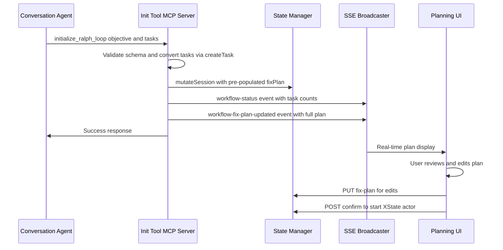

# Design: Ralph Loop Plan-First Initialization

## Overview

**Purpose**: This feature changes the Ralph Loop initialization flow so that the conversation agent submits both an objective and a structured task plan in a single tool call, eliminating the separate background SDK query for plan generation.

**Users**: Conversation agents (Claude Code instances) calling the `initialize_ralph_loop` MCP tool, and end users who review and confirm plans in the UI.

**Impact**: Modifies the `initialize_ralph_loop` MCP tool schema and handler in `init-tool.ts`. Removes the automatic `dispatchPlanGeneration()` call on initialization while preserving it as an opt-in UI action.

### Goals
- Eliminate the information bottleneck where plan generation loses conversation context
- Remove redundant SDK query cost during workflow initialization
- Provide the conversation agent with explicit guidance for task breakdown
- Maintain backward compatibility for API-created workflows and UI-triggered plan regeneration

### Non-Goals
- Changing the XState machine states or event model
- Modifying the iteration execution flow (orchestrator, MCP tools, circuit breaker)
- Removing the plan generator module entirely (retained for UI-triggered regeneration)
- Changing the `POST /workflow` API endpoint behavior

## Architecture

### Existing Architecture Analysis

The init flow currently has two phases:

1. **Init tool** (`init-tool.ts`): Creates workflow with `fixPlan: []` and `generatingPlan: true`, then fires `dispatchPlanGeneration()` asynchronously
2. **Plan generator** (`plan-generator.ts`): Runs a separate SDK `query()` to break the objective into tasks, persists them, and broadcasts SSE events

The plan generator gathers context by reading the last 6 conversation messages (truncated to 500 chars each) from the most recent transcript file — a lossy approximation of the full conversation.

After this change, the init tool handles both concerns in a single step: the conversation agent provides tasks directly, and no background plan generation is needed.

### Architecture Pattern & Boundary Map



**Architecture Integration**:
- Selected pattern: Direct extension of existing init tool — no new modules or boundaries
- Existing patterns preserved: `mutateSession()` for state, `broadcast()` for SSE, `createTask()` for task construction
- New components: None — only the init tool's schema and handler change
- Steering compliance: Schema-first (Zod validation), single responsibility (init tool initializes), no new dependencies

### Technology Stack

| Layer | Choice / Version | Role in Feature | Notes |
|-------|------------------|-----------------|-------|
| Backend / Services | `@anthropic-ai/claude-agent-sdk` | MCP tool definition via `tool()` + `createSdkMcpServer()` | No version change |
| Data / Storage | Zod v4 | Input validation for expanded schema | Existing dependency |
| Messaging / Events | SSE Broadcaster | `workflow-status` and `workflow-fix-plan-updated` events | Existing schemas |

## System Flows

### Init Tool Flow (Before vs After)

```mermaid
graph TB
    subgraph Before
        A1[Agent calls init with objective] --> B1[Create workflow fixPlan empty]
        B1 --> C1[Set generatingPlan true]
        C1 --> D1[Fire dispatchPlanGeneration]
        D1 --> E1[Separate SDK query runs]
        E1 --> F1[Tasks generated and persisted]
        F1 --> G1[generatingPlan set to false]
        G1 --> H1[SSE fix-plan-updated]
    end

    subgraph After
        A2[Agent calls init with objective and tasks] --> B2[Validate tasks array]
        B2 --> C2[Convert via createTask]
        C2 --> D2[Create workflow with pre-populated fixPlan]
        D2 --> E2[generatingPlan is false]
        E2 --> F2[SSE workflow-status with counts]
        F2 --> G2[SSE fix-plan-updated with plan]
    end
```



The "After" flow eliminates the asynchronous plan generation step entirely. The workflow is immediately ready for user review.

## Requirements Traceability

| Requirement | Summary | Components | Interfaces | Flows |
|-------------|---------|------------|------------|-------|
| 1.1 | Init tool accepts objective + tasks | InitToolServer | `initialize_ralph_loop` schema | Init flow |
| 1.2 | Workflow created with pre-populated fixPlan | InitToolServer | `mutateSession()` | Init flow |
| 1.3 | generatingPlan set to false | InitToolServer | — | Init flow |
| 1.4, 1.5 | Validate at least one task | InitToolServer | Zod validation | Init flow |
| 2.1, 2.2, 2.3 | No background plan generation on init | InitToolServer | — | Init flow |
| 3.1, 3.2, 3.3 | Plan regeneration preserved | GeneratePlanRoute | `dispatchPlanGeneration()` | Regeneration flow |
| 4.1, 4.2, 4.3 | Tool description and schema guidance | InitToolServer | Tool description strings | — |
| 5.1, 5.2 | SSE events on creation | InitToolServer | `broadcast()` | Init flow |
| 6.1, 6.2, 6.3 | API backward compatibility | WorkflowRouteHandlers | — | API flow |
| 7.1, 7.2, 7.3 | Task data integrity via createTask() | InitToolServer | `createTask()` | Init flow |

## Components and Interfaces

| Component | Domain/Layer | Intent | Req Coverage | Key Dependencies | Contracts |
|-----------|--------------|--------|--------------|-----------------|-----------|
| InitToolServer | Ralph Loop / MCP | Accept objective + tasks, create workflow | 1, 2, 4, 5, 7 | `createTask()` (P0), `mutateSession()` (P0), `broadcast()` (P1) | Service |
| GeneratePlanRoute | Ralph Loop / API | Preserved UI-triggered plan regeneration | 3 | `dispatchPlanGeneration()` (P0) | API |

### Ralph Loop / MCP Layer

#### InitToolServer

| Field | Detail |
|-------|--------|
| Intent | Accept objective and structured tasks from conversation agent, create workflow with pre-populated plan |
| Requirements | 1.1, 1.2, 1.3, 1.4, 1.5, 2.1, 2.2, 2.3, 4.1, 4.2, 4.3, 5.1, 5.2, 7.1, 7.2, 7.3 |

**Responsibilities & Constraints**
- Validate incoming `objective` and `tasks` array via Zod schema
- Convert raw task input to `FixPlanTask` objects via `createTask()`
- Create workflow in `planning` status with pre-populated `fixPlan`
- Broadcast SSE events with accurate task counts
- Never call `dispatchPlanGeneration()` when tasks are provided

**Dependencies**
- Inbound: Conversation agent via MCP tool call (P0)
- Outbound: `mutateSession()` — persist workflow state (P0)
- Outbound: `broadcast()` — SSE event delivery (P1)
- Outbound: `createTask()` — task construction (P0)

**Contracts**: Service [x]

##### Service Interface

```typescript
// Zod schema for the tool input
const initToolSchema = {
  objective: z.string().min(1).describe(
    "A concise summary of the overall development goal"
  ),
  tasks: z.array(
    z.object({
      description: z.string().min(1).describe(
        "Clear, actionable task description. Each task should be achievable in a single iteration (roughly 10-30 minutes of work)."
      ),
      group: z.number().int().min(1).describe(
        "Execution group (1-based). Group 1 = foundation tasks with no dependencies. Group 2 = tasks depending on group 1. Higher groups depend on all lower groups. Tasks within the same group must be independent of each other."
      ),
    })
  ).min(1).describe(
    "Structured task plan. Break the objective into discrete, actionable tasks grouped by dependency order."
  ),
};
```

- Preconditions: Session exists, no workflow already present
- Postconditions: Workflow created in `planning` status with `fixPlan` populated, `generatingPlan: false`, SSE events broadcast
- Error cases:
  - Session not found → `isError: true`, text: "Session not found"
  - Workflow already exists → `isError: true`, text: "A Ralph Loop workflow already exists"
  - Empty tasks array → Zod validation rejects (`.min(1)`)
  - Invalid task group/description → Zod validation rejects

**Implementation Notes**
- Remove the `dispatchPlanGeneration()` import and call from `init-tool.ts`
- Remove the `generatingPlan: true` assignment — set to `false` directly
- Use `createTask()` from `fix-plan-manager.ts` to convert each `{description, group}` tuple
- Compute `taskProgress` from the generated `FixPlanTask[]` for the `workflow-status` SSE event
- Add a second `broadcast()` call for `workflow-fix-plan-updated` with `source: "tool"`
- Update the tool description to guide the agent on task breakdown (see Tool Description below)

### Ralph Loop / API Layer

#### GeneratePlanRoute

| Field | Detail |
|-------|--------|
| Intent | Preserved endpoint for UI-triggered plan regeneration |
| Requirements | 3.1, 3.2, 3.3 |

**Responsibilities & Constraints**
- No changes required — existing `POST /workflow/generate-plan` route continues to work
- Sets `generatingPlan: true` and calls `dispatchPlanGeneration()`
- Plan generator replaces `fixPlan` and broadcasts SSE event

**Implementation Notes**
- No code changes needed. The route already operates independently of the init tool flow.

## Data Models

### Domain Model

No new entities. The existing `FixPlanTask` and `RalphLoopWorkflow` schemas remain unchanged:

```typescript
// FixPlanTask — unchanged
{
  id: string;              // UUID generated by createTask()
  description: string;     // From agent input
  group: number;           // From agent input (positive integer)
  status: "pending";       // Always "pending" at creation
  createdAt: string;       // ISO timestamp at creation
  completedAt: null;       // null at creation
  skipReason: null;        // null at creation
  addedByIteration: null;  // null (not added during iteration)
}
```

The `RalphLoopWorkflow.generatingPlan` field remains in the schema but is set to `false` at init time when tasks are pre-submitted. It is still set to `true` when the user triggers regeneration via the API.

## Error Handling

### Error Strategy

The init tool uses MCP tool response format with `isError: true` for failures. Zod validation handles schema errors automatically before the handler runs.

### Error Categories and Responses

| Error | Cause | Response |
|-------|-------|----------|
| Session not found | Race condition or invalid context | `isError: true`, "Session not found" |
| Workflow already exists | Duplicate initialization attempt | `isError: true`, "A Ralph Loop workflow already exists" |
| Invalid tasks (Zod) | Empty array, invalid group, empty description | Zod validation error (automatic) |
| State mutation failure | Disk I/O or lock contention | `isError: true`, "Failed to create workflow: {error}" |

## Testing Strategy

### Unit Tests

1. **Init tool with tasks**: Call handler with valid `{objective, tasks}` — verify workflow created with correct `fixPlan`, `generatingPlan: false`, no `dispatchPlanGeneration()` call
2. **Init tool validation**: Call handler with empty tasks array — verify Zod rejects with min(1) error
3. **Task construction**: Verify each submitted task is converted via `createTask()` with proper UUID, status, timestamps
4. **SSE broadcast**: Verify both `workflow-status` (with accurate taskProgress) and `workflow-fix-plan-updated` (with full plan, source: "tool") events are broadcast
5. **Duplicate workflow guard**: Call handler when workflow already exists — verify error response

### Integration Tests

1. **Full init flow**: Send prompt to session with init tool available → agent calls tool with tasks → verify workflow state in `state.json`
2. **Regeneration after init**: Create workflow via init tool → trigger `POST /workflow/generate-plan` → verify plan is replaced
3. **Confirm after init**: Create workflow via init tool → `POST /workflow/confirm` → verify XState actor starts with pre-populated fixPlan

## Tool Description

The updated tool description guides the conversation agent on how to break work into tasks:

```
Initialize a Ralph Loop autonomous workflow for this session. Call this when the user wants to start an iterative, autonomous coding workflow. Provide a clear objective summarizing the development goal.

Analyze the user's request and break it into discrete, actionable tasks:
- Each task should be specific and achievable in a single iteration (roughly 10-30 minutes of work)
- Assign tasks to execution groups based on dependencies:
  - Group 1: Foundation tasks with no dependencies (core setup, schemas, initial implementations)
  - Group 2: Tasks that depend on group 1 completion
  - Group 3+: Tasks that depend on previous groups
- Tasks within the same group must be independent of each other
- Do not include meta-tasks like "review" or "test everything" — each task should include its own testing
```
