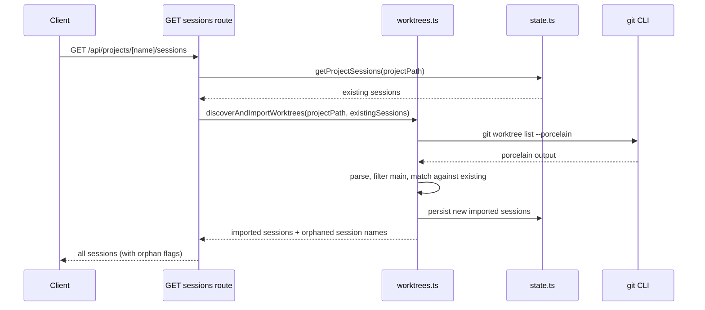
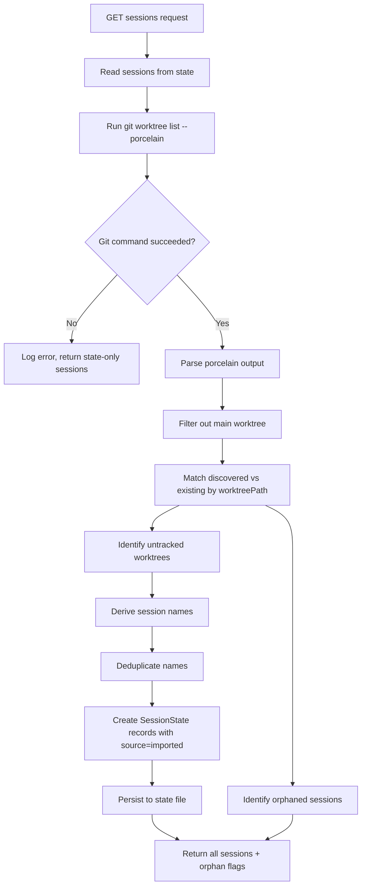
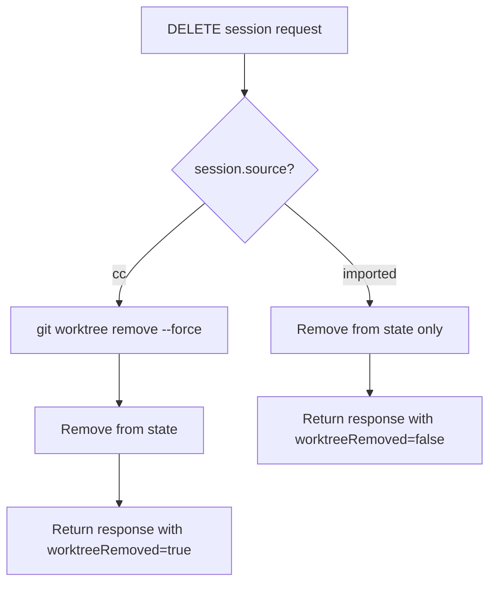

# Design Document: Worktree Import

## Overview

**Purpose**: This feature delivers automatic discovery and import of existing git worktrees as CC sessions, enabling developers to manage all worktrees — regardless of origin — through the CC dashboard.

**Users**: Developers using CC who also create worktrees manually, via other tools, or through other CC instances. They will see all worktrees appear as sessions without manual registration.

**Impact**: Changes the session listing flow to reconcile state against disk on every request, and modifies the session schema to track provenance (`source` field).

### Goals
- Discover all git worktrees for a project via `git worktree list --porcelain`
- Automatically import untracked worktrees as CC sessions with derived names
- Distinguish imported vs. CC-created sessions for appropriate deletion behavior
- Support arbitrary branch names and worktree paths (not just `csm/*` and `.worktrees/`)

### Non-Goals
- UI changes to visually distinguish imported sessions (can be added later using the `source` field)
- Ignore-list for permanently hiding specific worktrees from import
- Importing worktrees from other repositories (only the current project's worktrees)
- Modifying how CC-created sessions work (creation flow unchanged)

## Architecture

### Existing Architecture Analysis

The session management system consists of:
- **`sessions.ts`**: `createSession()` and `deleteSession()` — creates worktrees with rigid `csm/*` branch naming and `.worktrees/` path convention
- **`state.ts`**: CRUD operations on `ManagerState` JSON file — purely state-driven, no disk validation
- **`sessions/route.ts`**: GET handler returns sessions from state only; POST creates new sessions
- **`conversations.ts`**: Contains `discoverAndImportConversations()` — the proven auto-import pattern this feature follows

Key constraint: session listing is purely state-driven with no disk reconciliation. External worktrees are invisible.

### Architecture Pattern & Boundary Map



**Architecture Integration**:
- Selected pattern: On-demand reconciliation in the GET handler (see `research.md` for alternatives)
- Domain boundaries: New `worktrees.ts` module owns git worktree discovery; `sessions.ts` retains session lifecycle ownership
- Existing patterns preserved: Follows `discoverAndImportConversations()` discover-deduplicate-persist pattern
- New components: `worktrees.ts` (worktree discovery and parsing)
- Steering compliance: Filesystem-backed state, git subprocess calls, Zod schema-first design

### Technology Stack

| Layer | Choice / Version | Role in Feature | Notes |
|-------|------------------|-----------------|-------|
| Backend | Node.js + `execFile` | Executes `git worktree list --porcelain` | Existing pattern from `sessions.ts` |
| Data | JSON state file | Stores imported `SessionState` records | Existing atomic write pattern |
| Validation | Zod v4 | Schema for parsed worktree data and updated `SessionState` | New `source` field with default |

## System Flows

### Reconciliation Flow



### Deletion Flow



## Requirements Traceability

| Requirement | Summary | Components | Interfaces | Flows |
|-------------|---------|------------|------------|-------|
| 1.1 | Query git worktree list --porcelain | worktrees.ts | listWorktrees() | Reconciliation |
| 1.2 | Parse porcelain output | worktrees.ts | parseWorktreeList() | Reconciliation |
| 1.3 | Exclude main working tree | worktrees.ts | discoverAndImportWorktrees() | Reconciliation |
| 1.4 | Graceful fallback on git failure | worktrees.ts, sessions route | discoverAndImportWorktrees() | Reconciliation |
| 2.1 | Compare discovered vs state | worktrees.ts | discoverAndImportWorktrees() | Reconciliation |
| 2.2 | Identify importable worktrees | worktrees.ts | discoverAndImportWorktrees() | Reconciliation |
| 2.3 | Flag orphaned sessions | worktrees.ts | discoverAndImportWorktrees() | Reconciliation |
| 2.4 | No auto-delete of orphaned records | worktrees.ts | discoverAndImportWorktrees() | Reconciliation |
| 3.1 | Auto-create SessionState for untracked | worktrees.ts | discoverAndImportWorktrees() | Reconciliation |
| 3.2 | Derive name from branch | worktrees.ts | deriveSessionName() | Reconciliation |
| 3.3 | Derive name from dir for detached HEAD | worktrees.ts | deriveSessionName() | Reconciliation |
| 3.4 | Numeric suffix for name conflicts | worktrees.ts | ensureUniqueName() | Reconciliation |
| 3.5 | Set timestamps to import time | worktrees.ts | discoverAndImportWorktrees() | Reconciliation |
| 3.6 | Set source to imported | worktrees.ts, schemas.ts | sessionStateSchema | Reconciliation |
| 4.1 | source field on SessionState | schemas.ts | sessionStateSchema | - |
| 4.2 | source=cc for created sessions | sessions.ts | createSession() | - |
| 4.3 | source=imported for imported sessions | worktrees.ts | discoverAndImportWorktrees() | Reconciliation |
| 4.4 | Backward-compatible default | schemas.ts | sessionStateSchema | - |
| 5.1 | Unlink-only delete for imported | sessions.ts | deleteSession() | Deletion |
| 5.2 | Disk removal for CC-created | sessions.ts | deleteSession() | Deletion |
| 5.3 | Response indicates removal type | sessions route | DELETE handler | Deletion |
| 6.1 | Accept any branch name | worktrees.ts | discoverAndImportWorktrees() | Reconciliation |
| 6.2 | Accept any worktree path | worktrees.ts | discoverAndImportWorktrees() | Reconciliation |
| 6.3 | Store actual branch name | worktrees.ts | discoverAndImportWorktrees() | Reconciliation |
| 6.4 | Store actual worktree path | worktrees.ts | discoverAndImportWorktrees() | Reconciliation |

## Components and Interfaces

| Component | Domain/Layer | Intent | Req Coverage | Key Dependencies | Contracts |
|-----------|-------------|--------|--------------|------------------|-----------|
| worktrees.ts | Lib/Domain | Discover worktrees and import as sessions | 1.1-1.4, 2.1-2.4, 3.1-3.6, 6.1-6.4 | git CLI (P0), state.ts (P0) | Service |
| schemas.ts | Lib/Schema | Add source field to sessionStateSchema | 4.1, 4.4 | Zod (P0) | State |
| sessions.ts | Lib/Domain | Branch delete behavior on source | 4.2, 5.1, 5.2 | state.ts (P0) | Service |
| sessions route | API | Trigger reconciliation on GET, report removal type on DELETE | 1.4, 2.3, 5.3 | worktrees.ts (P0) | API |

### Lib/Schema Layer

#### sessionStateSchema (modification)

| Field | Detail |
|-------|--------|
| Intent | Add `source` field to track session provenance |
| Requirements | 4.1, 4.4 |

**Contracts**: State [x]

##### State Management

```typescript
// Addition to existing sessionStateSchema in schemas.ts
export const sessionStateSchema = z.object({
  sessionName: z.string(),
  worktreePath: z.string(),
  branchName: z.string(),
  createdAt: z.string(),
  lastActivityAt: z.string(),
  archived: z.boolean(),
  finished: z.boolean().default(false),
  conversations: z.array(conversationStateSchema).default([]),
  source: "cc"), // NEW
});
```

- Backward compatibility: `.default("cc")` ensures existing state files parse correctly
- No migration needed: Zod applies the default on parse

### Lib/Domain Layer

#### worktrees.ts (new module)

| Field | Detail |
|-------|--------|
| Intent | Discover git worktrees, reconcile against state, import untracked as sessions |
| Requirements | 1.1-1.4, 2.1-2.4, 3.1-3.6, 6.1-6.4 |

**Responsibilities & Constraints**
- Owns git worktree discovery via `git worktree list --porcelain`
- Owns porcelain output parsing into structured data
- Owns session name derivation from branch name or directory name
- Does NOT own session lifecycle (create/delete) — that remains in `sessions.ts`

**Dependencies**
- Outbound: `state.ts` — read and write state (P0)
- External: `git` CLI — worktree listing (P0)

**Contracts**: Service [x]

##### Service Interface

```typescript
/** Parsed worktree entry from git porcelain output */
interface DiscoveredWorktree {
  path: string;           // Absolute path to the worktree
  head: string;           // HEAD commit SHA
  branch: string | null;  // Branch name (null if detached HEAD)
  isMainWorktree: boolean; // True if this is the main working tree
}

/** Result of worktree reconciliation */
interface ReconciliationResult {
  /** Sessions imported during this reconciliation */
  imported: SessionState[];
  /** Names of sessions in state whose worktree no longer exists on disk */
  orphanedSessionNames: string[];
}

/** Parse `git worktree list --porcelain` output into structured entries */
function parseWorktreeList(porcelainOutput: string): DiscoveredWorktree[];

/**
 * Derive a session display name from a worktree.
 * Strips `refs/heads/` and `csm/` prefixes from branch name.
 * Falls back to directory basename for detached HEAD.
 */
function deriveSessionName(worktree: DiscoveredWorktree): string;

/**
 * Ensure a session name is unique within a project's existing sessions.
 * Appends numeric suffix (e.g., `name-2`, `name-3`) if needed.
 */
function ensureUniqueName(
  baseName: string,
  existingNames: Set<string>,
): string;

/**
 * Discover worktrees on disk, reconcile against state, and import untracked ones.
 * - Runs `git worktree list --porcelain` in projectPath
 * - Filters out the main working tree
 * - Matches discovered worktrees against existing sessions by worktreePath
 * - Creates SessionState records for untracked worktrees (source: "imported")
 * - Identifies orphaned sessions (in state but worktree missing, not finished)
 * - Persists new sessions atomically
 * Returns imported sessions and orphaned session names.
 * On git failure, logs the error and returns empty result.
 */
function discoverAndImportWorktrees(
  projectPath: string,
  existingSessions: SessionState[],
): Promise<ReconciliationResult>;
```

- Preconditions: `projectPath` is a valid git repository
- Postconditions: All untracked worktrees have corresponding `SessionState` records in state; no existing records are modified or deleted
- Invariants: No duplicate sessions for the same `worktreePath`

**Implementation Notes**
- Integration: Called from the sessions route GET handler before returning sessions
- Validation: `parseWorktreeList` is a pure function; validate with unit tests against sample porcelain output
- Risks: `git worktree list` may take longer on repos with many worktrees (mitigated by the command's low overhead)

#### sessions.ts (modification)

| Field | Detail |
|-------|--------|
| Intent | Set source on creation; branch deletion behavior based on source |
| Requirements | 4.2, 5.1, 5.2 |

**Contracts**: Service [x]

##### Service Interface Changes

```typescript
// createSession: set source: "cc" on the new SessionState
// No signature change — internal behavior change only

// deleteSession: branch on session.source
function deleteSession(
  projectPath: string,
  sessionName: string,
): Promise<{ worktreeRemoved: boolean }>;  // Return type changes
```

- `deleteSession` currently returns `Promise<void>`. It will return `Promise<{ worktreeRemoved: boolean }>` to inform the API layer.
- When `source === "imported"`: skip `git worktree remove`, remove from state only, return `{ worktreeRemoved: false }`
- When `source: "cc"`: existing behavior (remove worktree + state), return `{ worktreeRemoved: true }`

### API Layer

#### GET /api/projects/[name]/sessions (modification)

| Field | Detail |
|-------|--------|
| Intent | Trigger worktree reconciliation before returning sessions |
| Requirements | 1.4, 2.3 |

**Contracts**: API [x]

##### API Contract

| Method | Endpoint | Request | Response | Errors |
|--------|----------|---------|----------|--------|
| GET | /api/projects/[name]/sessions | - | `{ sessions: SessionState[], orphanedSessionNames: string[] }` | 404 |

**Change**: Response shape adds `orphanedSessionNames` alongside sessions. The sessions array includes both existing and newly imported sessions.

**Note**: This changes the response shape from a plain `SessionState[]` to a wrapper object. The client must be updated accordingly.

#### DELETE /api/projects/[name]/sessions (modification)

| Field | Detail |
|-------|--------|
| Intent | Report whether worktree was removed from disk |
| Requirements | 5.3 |

##### API Contract

| Method | Endpoint | Request | Response | Errors |
|--------|----------|---------|----------|--------|
| DELETE | /api/projects/[name]/sessions?sessionName=xxx | - | `{ success: true, worktreeRemoved: boolean }` | 400, 404 |

**Change**: Response adds `worktreeRemoved` field.

## Data Models

### Domain Model

The `SessionState` entity gains one new field:

```typescript
source: "cc"
```

- `"cc"`: Session was created by CC (existing behavior)
- `"imported"`: Session was auto-imported from a discovered worktree

No new entities are introduced. `DiscoveredWorktree` is a transient data structure used only during reconciliation (not persisted).

### Logical Data Model

**State file structure** (unchanged except for new field):
```
ManagerState
  └── projects: Record<projectPath, ProjectState>
        └── sessions: Record<sessionName, SessionState>
              ├── sessionName: string
              ├── worktreePath: string      // now accepts any absolute path
              ├── branchName: string         // now accepts any branch name
              ├── source: "cc" | "imported" // NEW
              ├── createdAt: string
              ├── lastActivityAt: string
              ├── archived: boolean
              ├── finished: boolean
              └── conversations: ConversationState[]
```

**Matching key**: `worktreePath` is the unique identifier used for deduplication during reconciliation. Two sessions within the same project cannot share a `worktreePath`.

## Error Handling

### Error Strategy

| Category | Trigger | Response | Recovery |
|----------|---------|----------|----------|
| Git failure | `git worktree list` fails or times out | Log error, return state-only sessions | Automatic — next request retries |
| Parse error | Malformed porcelain output | Log warning, skip malformed entries | Automatic — valid entries still imported |
| Name collision | Derived name matches existing session | Append numeric suffix | Automatic |
| State write failure | Atomic write fails | Error propagated to API response | Manual — retry request |

### Monitoring
- Log at `info` level: number of worktrees discovered, imported, orphaned per reconciliation
- Log at `error` level: git command failures
- Log at `warn` level: parse failures for individual worktree entries

## Testing Strategy

### Unit Tests (`worktrees.test.ts`)
1. **parseWorktreeList**: Parse valid porcelain output with multiple worktrees, detached HEAD, locked/prunable entries
2. **parseWorktreeList edge cases**: Empty output, single main worktree only, malformed lines
3. **deriveSessionName**: Branch with `csm/` prefix, `refs/heads/` prefix, `feature/` prefix, detached HEAD
4. **ensureUniqueName**: No conflict, single conflict (appends `-2`), multiple conflicts (increments)
5. **discoverAndImportWorktrees**: Mocked git output — verifies new sessions created, existing sessions untouched, orphans detected

### Integration Tests
1. **GET sessions with reconciliation**: Verify imported sessions appear in response alongside existing sessions
2. **DELETE imported session**: Verify worktree NOT removed from disk, session removed from state
3. **DELETE CC session**: Verify worktree removed from disk (existing behavior preserved)
4. **Git failure graceful degradation**: Verify state-only sessions returned when git fails
5. **Backward compatibility**: Verify sessions without `source` field parse as `source: "cc"`
