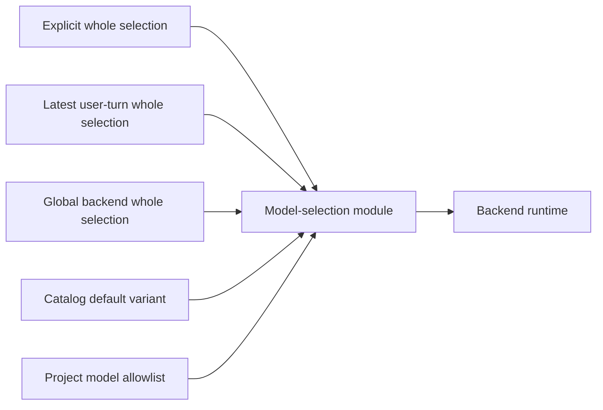

# Generalized Model Parameter Support

**Status:** Implemented

**Date:** 2026-08-25

**Decision owner:** Alex

**Scope:** Backend-neutral model selection, full Cursor model-parameter support, and the required breaking configuration cutover

## Decision Summary

Command Center will replace the current `model + reasoningEffort + codexFastMode` tuple with one atomic, backend-neutral `modelSelection` value:

```ts
interface BackendModelSelection {
  modelId: string;
  parameters: Readonly<Record<string, string>>;
}
```

The selection is atomic at every configuration, API, persistence, workflow, and runtime boundary. A layer either supplies a complete selection or supplies nothing. Command Center never resolves the model from one layer and individual parameters from other layers.

Backend model catalogs describe parameter definitions, complete valid variants, defaults, aliases, and presentation metadata. Neutral code validates and carries selections without knowing what `effort`, `reasoning`, `thinking`, `context`, or `fast` mean. Each backend adapter owns translation from the neutral selection to its provider SDK.

Cursor's catalog will be generated from the authenticated `Cursor.models.list()` API by an explicit build/release command and checked into the repository. Normal builds consume and validate that artifact without making an authenticated network call. This keeps builds reproducible while avoiding a manually maintained Cursor model matrix.

This is a breaking cutover. A forward-only migration rewrites existing configuration and resumable state. Live schemas do not accept the old model fields after the migration, and there is no indefinite dual-read configuration path.

## Goals

- Expose every user-selectable Cursor model parameter, including effort/reasoning, thinking, context size, and fast mode.
- Preserve Cursor's exact parameter value vocabulary, including values such as `none`, `xhigh`, and `extra-high`, without forcing it through Command Center's current `EffortLevel` enum.
- Represent constrained parameter combinations exactly. Invalid combinations must be impossible to submit and must fail closed if received over an API or loaded from disk.
- Keep neutral callers unaware of provider-specific parameter names and SDK option shapes.
- Resolve defaults and follow-up-turn settings atomically, with no per-parameter inheritance.
- Persist the exact canonical selection used for each turn so continuation, audit, replay, and UI display agree.
- Make the Cursor catalog refreshable without editing application code.
- Require migration to the atomic configuration form and remove the superseded live interfaces.

## Non-Goals

- Adding a Cursor task facet or making Cursor eligible for workflow roles that its descriptor does not support.
- Letting users send arbitrary parameter names or values that are absent from the effective catalog.
- Runtime model discovery on every request or conversation turn.
- Per-project parameter restrictions. `CommandCenter.json` continues to restrict Cursor model IDs through `supportedModels` only.
- Estimating context-window token usage or changing compaction policy based on the selected context size.
- Preserving invalid legacy combinations by clamping, dropping, or silently substituting values.
- Normalizing every provider onto one universal effort enum.

## Current Architecture Assessment

### Software-design-philosophy score: 6.25/10

Five of the eight Quick Diagnostic rows pass. Module purposes, design review practices, interface documentation, newcomer orientation, and strategic design investment are present. Three rows fail:

| Failed diagnostic | Current evidence | Exact change required for 10/10 |
|---|---|---|
| Are interfaces simpler than implementations? | Neutral inputs expose `modelId`, `reasoningEffort`, and `codexFastMode`; adding Cursor context, thinking, and fast would add more special fields across prompt, conversation, workflow, transcript, and worker contracts. | Replace the tuple with one `BackendModelSelection` and make catalog-driven controls consume the same generic parameter definitions. |
| Can an implementation change without affecting callers? | Backend capability knowledge lives in catalog helpers, config schemas, UI branches, conversation policy, transcript schemas, continuity bindings, and provider adapters. | Put model definitions, variant validation, defaulting, transitions, and equality behind one model-selection module; put SDK translation inside each backend adapter. |
| Does each module hide an important design decision? | No single module owns what constitutes a valid complete selection or how an atomic selection moves through the resolution cascade. | Make `agent-backends/model-selection.ts` the owner of canonicalization, exact-variant validation, whole-selection resolution, transition validation, and stable identity. |

The proposed design passes all eight rows for a target score of 10/10: the neutral interface is one value; provider changes stop at catalog and adapter boundaries; the new module hides the difficult selection rules; its interface comments state invariants; and a seam guard prevents the special fields from spreading back into neutral code.

## Why the Selection Must Be Atomic

The parameters are not independent. The live Cursor catalog already contains constraints such as:

- GPT-5.6-family fast mode is valid at the 272k context but not at the 1m context.
- Claude Opus 5 `xhigh` and `max` effort require thinking to be enabled.
- Some variants include a fixed, non-user-selectable `cyber=false` parameter.

Resolving individual fields independently can create a combination that no provider variant supports. It also makes a follow-up turn ambiguous: a new model combined with the previous model's context or thinking value is not a meaningful user choice.

The resolution unit is therefore the complete selection:

1. Explicit selection on the request.
2. Latest complete selection recorded on a user turn.
3. Complete backend selection from global configuration.
4. The selected model's declared default variant.

The first present candidate wins as a whole. There is no merge between candidates. Changing the model chooses that model's default variant; it does not attempt to carry parameter values across models.

## Domain Model

The canonical schemas live in `src/lib/agent-backends/schemas.ts`. Their TypeScript types are inferred from Zod.

```ts
const backendModelSelectionSchema = z
  .object({
    modelId: z.string().trim().min(1),
    parameters: z.record(z.string().trim().min(1), z.string()),
  })
  .strict();

const backendModelParameterDefinitionSchema = z.object({
  id: z.string().min(1),
  label: z.string().min(1),
  values: z.array(
    z.object({
      value: z.string(),
      label: z.string().min(1),
    }),
  ).min(1),
  prominence: z.enum(["primary", "advanced", "hidden"]),
});

const backendModelVariantSchema = z.object({
  selection: backendModelSelectionSchema,
  label: z.string().min(1),
  description: z.string().optional(),
  isDefault: z.boolean(),
});

const backendModelDefinitionSchema = z.object({
  id: z.string().min(1),
  label: z.string().min(1),
  description: z.string().optional(),
  aliases: z.array(z.string().min(1)),
  parameters: z.array(backendModelParameterDefinitionSchema),
  variants: z.array(backendModelVariantSchema).min(1),
});

const backendModelCatalogSchema = z.object({
  backend: agentBackendSchema,
  defaultModelId: z.string().min(1),
  models: z.array(backendModelDefinitionSchema),
  provenance: z.object({
    source: z.string().min(1),
    generatedAt: z.string().datetime().optional(),
    sdkVersion: z.string().optional(),
  }),
});
```

### Invariants

- `parameters` uses the exact IDs and string values accepted by the backend adapter. Boolean-like values remain the strings `"true"` and `"false"` when that is what the provider accepts.
- Every variant contains a complete provider payload, including fixed hidden parameters.
- Every variant's `selection.modelId` equals its containing model ID.
- A model has exactly one default variant.
- The catalog's `defaultModelId` names exactly one model.
- Model IDs and accepted aliases are unique within a backend. An alias cannot shadow another canonical ID. When Cursor publishes one alias for multiple canonical models, generation omits that ambiguous alias and reports every owner; canonical IDs remain available.
- Parameter IDs are unique within a model, and value IDs are unique within a parameter.
- Every value in a variant is declared by its parameter definition. Parameters that occur only as fixed provider values receive a generated `hidden` definition.
- A parameter with one possible value is hidden. Cursor effort/reasoning is `primary`; other multi-value Cursor parameters are `advanced`.
- A canonical selection matches exactly one complete variant. Unknown keys, missing keys, unsupported values, and unsupported combinations are errors.
- Parameter record order is semantically irrelevant. Stable identity sorts entries by key before hashing or comparing.

The catalog generator rejects a parameterized model that has definitions but no variants. It may synthesize the sole empty variant only for a model with no parameters. Command Center must not infer a Cartesian product because that would invent combinations Cursor did not advertise.

## Deep Module Boundary

`src/lib/agent-backends/model-selection.ts` is the one model-selection policy module:

> Resolve, validate, transition, and identify complete backend model selections against an effective catalog; callers do not interpret parameter IDs or provider constraints.

Its small public surface is:

```ts
function resolveModelSelection(input: {
  catalog: BackendModelCatalog;
  candidates: readonly (BackendModelSelection | null | undefined)[];
}): BackendModelSelection;

function validateModelSelection(
  catalog: BackendModelCatalog,
  selection: BackendModelSelection,
): ModelSelectionValidationResult;

function defaultSelectionForModel(
  catalog: BackendModelCatalog,
  modelId: string,
): BackendModelSelection;

function availableParameterValues(input: {
  model: BackendModelDefinition;
  draft: BackendModelSelection;
  parameterId: string;
}): readonly string[];

function modelSelectionKey(selection: BackendModelSelection): string;
```

These functions hide alias canonicalization, exact-variant matching, default selection, constrained-value calculation, stable equality, and diagnostic construction. Callers receive typed errors with `unknown_model`, `model_not_allowed`, `unknown_parameter`, `missing_parameter`, `unsupported_value`, or `unsupported_combination`; they do not reconstruct validation rules.

The module does not know Cursor SDK types. Provider translation stays below the backend adapter boundary.

## Backend Descriptor Contract

Each registered descriptor gains a model-catalog facet:

```ts
interface BackendModelCatalogFacet {
  getCatalog(input: {
    projectPath?: string;
    configuredSelection?: BackendModelSelection;
  }): Promise<BackendModelCatalog>;
}
```

- Claude and Codex return static catalogs owned by their adapters.
- The Codex provider may synthesize one entry for the globally configured custom Codex model, preserving today's custom-model support. That entry uses the adapter's frozen generic reasoning/fast definitions and enumerates their complete combinations; the provider remains authoritative if the custom model supports a narrower set.
- Cursor loads the generated Cursor artifact, then applies the project's `supportedModels` allowlist.
- The existing project-model-options route becomes the effective-catalog route rather than mapping bare IDs onto a process-global static list.
- The descriptor catalog endpoint may continue to return summary metadata, but any surface that renders a selection control must use the project-effective catalog.
- An allowlisted model absent from the generated Cursor catalog is reported as a configuration diagnostic. It is not synthesized without parameter metadata.

The conversation and task runtime interfaces accept `modelSelection`; they do not accept model, effort, or fast fields separately. A backend with no applicable facet continues to fail at the descriptor capability gate.

## Cursor Catalog Generation

### Source

`@cursor/sdk@1.0.28` exposes:

```ts
Cursor.models.list(): Promise<ModelListItem[]>
```

Each item can include `id`, `displayName`, `description`, `aliases`, `parameters`, and complete `variants`, including an `isDefault` marker. The returned list is authenticated and may differ by account or team policy.

### Generation workflow

Add an explicit command:

```text
CURSOR_API_KEY=... bun run cursor-models:refresh
```

The command:

1. Calls `Cursor.models.list()` with the installed, pinned SDK.
2. Validates the SDK response as untrusted input.
3. Converts SDK arrays to the canonical catalog without renaming parameter IDs or values.
4. Synthesizes hidden definitions for fixed parameters present only in variants.
5. Assigns generic presentation prominence: effort/reasoning primary, other multi-value parameters advanced, fixed parameters hidden.
6. Verifies all catalog invariants. Aliases with one canonical owner are preserved; aliases with multiple owners or a canonical-ID collision are omitted and reported deterministically because accepting them could not canonicalize safely.
7. Writes `src/lib/agent-backends/cursor/generated-model-catalog.json` atomically with SDK version, generation timestamp, and source provenance.
8. Emits a concise diff summary by model and parameter; it never prints credentials.

`bun run build` runs `cursor-models:check`, which validates the checked-in artifact and verifies that its recorded SDK version matches the installed Cursor SDK. It does not call Cursor or require a credential.

An authenticated network call in every normal build is rejected because it makes builds non-reproducible, binds build success to one account's entitlements, and requires a production credential in build infrastructure. A release job or deployment-specific build may run the explicit refresh command before the normal build.

### Staleness and account specificity

- Catalog provenance is returned to the UI so an unavailable selection can say which snapshot was used.
- Provider rejection remains authoritative. The Cursor adapter returns the SDK's unavailable-model error; it never substitutes another model.
- A deployment whose Cursor account differs from the catalog-generation account should refresh the artifact as part of its release process.
- A later runtime-backed catalog provider can replace the generated provider without changing neutral callers. That is the intended proof that the catalog facet is deep enough.

## Configuration Cutover

### Canonical global configuration

All backend profiles use the same atomic field:

```json
{
  "agentBackends": {
    "claude": {
      "modelSelection": {
        "modelId": "opus",
        "parameters": { "effort": "high" }
      },
      "timeoutMs": 3600000
    },
    "codex": {
      "modelSelection": {
        "modelId": "gpt-5.4",
        "parameters": {
          "reasoning": "high",
          "fast": "false"
        }
      },
      "timeoutMs": null
    },
    "cursor": {
      "modelSelection": {
        "modelId": "composer-2.5",
        "parameters": { "fast": "true" }
      },
      "timeoutMs": null
    }
  }
}
```

The examples show representative parameter IDs; the backend catalogs are authoritative. Timeout, stall-timeout, pricing, and credentials remain outside `modelSelection` because they are backend profile/runtime concerns rather than a model variant.

`CommandCenter.json` keeps:

```json
{
  "agentBackends": {
    "cursor": {
      "supportedModels": ["composer-2.5", "claude-opus-5"]
    }
  }
}
```

The project allowlist does not gain parameter overrides or defaults.

### Other live configuration holders

Every live holder that currently carries a model tuple moves in the same cutover:

| Holder | Canonical replacement |
|---|---|
| Conversation prompt request and queued message | `modelSelection?: BackendModelSelection` |
| Conversation active turn and persisted machine snapshot | `modelSelection: BackendModelSelection \| null` |
| User transcript metadata | exact `modelSelection` used for that turn |
| Conversation runtime create/turn inputs | `modelSelection` |
| Task-run input | `modelSelection` |
| Collaboration agent settings and feature snapshot | `{ backend, modelSelection }` |
| Workflow agent assignment snapshots | `{ backend, modelSelection }` |
| Chat-spawn overrides | optional whole `modelSelection` |
| Conversation naming config | `modelSelection` beside `backend` |
| Compaction config | separate atomic `conversationModelSelection` and `messageModelSelection` beside `backend` |
| Cursor parent/worker IPC | structured `modelSelection` |
| Cursor continuity binding | canonical selection key, not only the model ID |

This cutover is intentionally broader than adding four Cursor fields. Leaving workflow, task, or collaboration surfaces on the tuple would preserve the same information leak and force every future parameter through another adapter layer.

### Required migration

A forward-only Umzug migration, `NNNN-generalized-model-selection`, performs the cutover before the new schemas are used.

The migration follows the repository's breaking-migration rules:

1. Freeze the pre-cutover schemas and model/parameter mapping tables inside the migration. It must not import the live catalog or live defaults.
2. Preflight `config.json`, scoped workflow definitions, resumable workflow rows, conversation snapshots, collaboration snapshots, and transcript files before publishing the compatibility barrier.
3. Refuse unreadable JSON, mixed old-and-new fields, unknown non-custom models, ambiguous aliases, and legacy parameter values that cannot map to exactly one valid variant. The error names the file or durable record and the manual correction required.
4. Publish the bumped `KNOWN_SCHEMA_VERSION` compatibility barrier before the first breaking write so an older build cannot reopen and write the old shape. A failed post-barrier migration remains fatal and replayable by the new build.
5. Atomically rewrite `config.json` and file-backed holders. Rewrite database holders transactionally with idempotent predicates.
6. Record the Umzug ledger row only after every required live holder is migrated.

Mapping rules are exact:

- Legacy `model` becomes `modelSelection.modelId`, canonicalized through the frozen alias table.
- Legacy `reasoningEffort` maps through the frozen backend/model table to its reasoning-effort parameter ID.
- Legacy `fastMode` maps to the frozen catalog's fast parameter as `"true"` or `"false"`.
- All other parameters come from that model's frozen default variant.
- A legacy custom Codex model maps through the frozen generic Codex parameter definitions. Unknown Claude or Cursor models are refused.
- If the resulting complete selection is not exactly one frozen variant, migration fails. It never clamps effort, drops a field, or selects a nearby variant.

Fresh installations write only the atomic form. After cutover, raw config schemas give targeted `z.never()` errors for `model`, `reasoningEffort`, and `fastMode`, pointing to `modelSelection`; they do not parse those fields into live state.

Historical, terminal archives may retain their original bytes because they are evidence, not resumable configuration. Any archival renderer that reads them uses one explicitly read-only codec and cannot produce a runtime request. Approval of this design includes approval for that narrow archival compatibility exception; it does not apply to `config.json`, active transcripts used for last-turn resolution, resumable snapshots, or workflow definitions.

### Migration rollout

- Stop all older Command Center processes sharing the config directory before starting the cutover build.
- Run `bun run model-selection-migration:preflight -- --config-dir <path>` to report affected holder counts and any unconvertible paths without writing.
- Back up `config.json`, the SQLite database, and affected transcript/workflow files.
- Start the cutover build; migration failure is fatal and leaves the ledger unstamped so correction and restart replay safely.
- Verify the config round trip and resume at least one migrated conversation before allowing normal use.
- Do not run old and new builds concurrently against the same config directory.

## Runtime Resolution and Persistence

### Turn resolution



Resolution canonicalizes aliases, checks the effective project catalog, and returns a complete validated selection. There is no effort clamping or parameter fallback. A persisted selection that is no longer available blocks the turn with a diagnostic; it does not drift to a newer default.

### Persistence and equality

- The canonical selection is written on the user transcript entry before provider execution, alongside the existing backend identity.
- The active-turn snapshot carries the same value so restart replay cannot consult changed global defaults.
- Latest-turn inheritance reads one selection object. It never reconstructs a tuple by scanning independent fields.
- Runtime reuse compares `modelSelectionKey(selection)`. Any parameter change is observable as a configuration change.
- Backend adapters decide whether a changed selection can reuse provider continuity or must start/rebind a runtime. Neutral code does not encode provider continuation rules.
- Logs and transcript metadata record canonical model and parameter IDs, never aliases.

## Cursor Runtime Adapter

The Cursor worker protocol changes from a string model to the structured neutral selection and bumps its protocol version. Parent and worker fail fast on a version mismatch.

`src/lib/agent-backends/cursor/worker/sdk-port.ts` owns the only translation:

```ts
function toCursorModelSelection(
  selection: BackendModelSelection,
): ModelSelection {
  return {
    id: selection.modelId,
    params: Object.entries(selection.parameters)
      .sort(([left], [right]) => left.localeCompare(right))
      .map(([id, value]) => ({ id, value })),
  };
}
```

The translated selection is applied consistently at every Cursor SDK seam that accepts or overrides a model: agent creation, resume, and follow-up send. Hidden fixed parameters are included because they are part of the canonical variant.

Cursor continuity binding uses the canonical selection key. A model ID match with different thinking, context, effort, or fast values is not treated as the same binding by accident.

The adapter validates once more at the worker trust boundary. The parent process is trusted application code, but protocol-version skew or a corrupt persisted payload must not reach the SDK as an unchecked structure.

## User Interface

### Control placement

- The model picker remains in the prompt toolbar.
- The catalog's `primary` parameter is rendered beside it. For Cursor this is the model's effort or reasoning control when present.
- `advanced` parameters are rendered in a Model Options popover on desktop and sheet on mobile. This contains thinking, context size, fast mode, and any future multi-value parameter advertised by the catalog.
- `hidden` and single-value parameters are never rendered but remain in the applied selection.
- A two-value `true`/`false` parameter renders as a switch; other parameters render as a select or compact segmented control based on value count.
- Models with no selectable parameters do not show an options affordance.

The UI does not contain checks such as `backend === "cursor"`, `parameter.id === "context"`, or `backendSupportsFastMode`. It follows catalog definitions and prominence.

### Constraint behavior

Changing a model immediately applies its default variant. Parameter editing operates on a draft complete selection:

- The model-selection module reports which values participate in at least one valid variant given the other draft values.
- The UI may temporarily show an invalid draft inside the options panel so a user can change two interdependent controls in either order.
- Apply is disabled until the draft matches exactly one valid variant, and the conflicting controls are identified.
- Closing without applying discards the draft.
- The primary toolbar control only applies a value when the rest of the current selection remains valid. Otherwise it sends the user to Model Options to make the complete change explicitly.
- Prompt submission always uses the last applied valid selection, never an invalid draft.

No control silently changes another control. In particular, choosing 1m context does not silently disable fast mode, and choosing `xhigh` effort does not silently enable thinking.

### Unavailable and stale states

- A globally configured model excluded by the current project's allowlist is shown as unavailable and blocks submission until the user explicitly chooses a complete allowed selection; the filtered catalog remains available for that recovery.
- A selection absent from a refreshed catalog remains visible with its raw canonical IDs and a stale-catalog diagnostic.
- Catalog loading failure disables model submission for Cursor rather than falling back to Composer.
- Alias input is accepted at validation boundaries but displayed and persisted under the canonical ID.

## API Shape

The project-effective catalog response contains definitions and the effective default selection:

```json
{
  "backend": "cursor",
  "defaultSelection": {
    "modelId": "composer-2.5",
    "parameters": { "fast": "true" }
  },
  "models": [],
  "provenance": {
    "source": "Cursor.models.list",
    "generatedAt": "2026-08-25T00:00:00.000Z",
    "sdkVersion": "1.0.28"
  },
  "diagnostics": []
}
```

Prompt and workflow request schemas accept an optional whole `modelSelection`. There are no top-level `effort`, `reasoningEffort`, `thinking`, `context`, or `fast` request fields.

Validation errors return stable codes plus model/parameter identifiers and user-facing messages. They never echo credentials or arbitrary config values unrelated to the selection.

## Observability

Implementation uses `createLogger` and the existing structured event conventions. The model-selection domain owns these events:

| Event | Level | Fields |
|---|---|---|
| `model_catalog.loaded` | debug | backend, modelCount, source, sdkVersion |
| `model_catalog.rejected` | warn | backend, stable validation code, source |
| `model_selection.resolved` | debug | backend, modelId, parameterIds, sourceLayer |
| `model_selection.rejected` | warn | backend, modelId, stable error code, parameterId when applicable |
| `model_selection.migration_completed` | info | configCount, snapshotCount, transcriptCount, workflowCount |
| `model_selection.migration_refused` | error | holder kind, holder identity, stable reason code |

Do not log full raw catalog responses, API keys, environment blocks, or whole config documents.

## Mechanical Guardrails

- Add an architecture seam check that rejects neutral public fields named `reasoningEffort`, `codexFastMode`, or `fastMode` outside backend adapters, the frozen migration, and approved archival codecs.
- Add a catalog contract test that every registered backend returns a valid catalog with one default selection.
- Add a worker protocol contract test so the Cursor parent and worker cannot compile against different selection shapes.
- Derive TypeScript types from the Zod schemas; do not maintain parallel hand-written wire types.
- Keep provider parameter vocabularies in adapter catalogs. Neutral code may display IDs and labels but may not branch on them.

## Implementation Slices and TDD Order

The implementation remains one unreleased cutover, but it can be developed in compile-safe slices. Each behavioral slice starts with a scoped failing test.

1. **Canonical schemas and deep module**
   - Exact variant validation, aliases, stable keys, atomic candidate resolution, model defaulting, and constrained-value calculation.
   - Tests prove no per-parameter merge and no silent clamping.

2. **Catalog providers and Cursor generator**
   - Fixture the SDK response; prove aliases, hidden fixed parameters, defaults, and constrained variants survive generation.
   - Prove malformed/ambiguous provider responses fail generation.
   - Extend backend descriptor conformance for the catalog facet.

3. **Breaking migration**
   - Start with a failing migration test over a realistic old `config.json`, SQLite fixture, workflow definition, active snapshot, and transcript.
   - Test idempotent replay, mixed-shape refusal, unknown-model refusal, atomic file writes, compatibility barrier, and fresh-install no-op.

4. **Neutral runtime and persistence cutover**
   - Replace tuple fields in prompt, conversation, task, collaboration, workflow, transcript, and snapshot schemas.
   - Prove latest-turn selection wins atomically and restart replay uses the persisted selection rather than current global defaults.

5. **Cursor worker and SDK translation**
   - Bump IPC protocol version.
   - Prove the exact sorted parameter array reaches create, resume, and send.
   - Prove any parameter change affects continuity binding and runtime reuse.

6. **Catalog-driven UI**
   - Storybook stories cover no parameters, effort only, all four controls, hidden fixed parameters, constrained variants, unavailable models, and stale selections.
   - Component tests use the real query/store layers with fetch fixtures.
   - Keyboard and mobile behavior receive the normal accessibility pass.

7. **Live verification**
   - Refresh a catalog with the deployment's Cursor account.
   - Run one effort-enabled model and verify the requested effort in worker evidence.
   - Run one constrained context/fast or thinking/effort pair and verify both an accepted valid variant and a refused invalid variant.
   - Resume the conversation and verify the same canonical selection is reused.

The design document itself is documentation-only, so there is no behavior to pin with a failing test in this change.

## Risks and Mitigations

| Risk | Mitigation |
|---|---|
| Generated catalog is stale | Explicit refresh command, provenance in API/UI, provider errors remain authoritative, no fallback substitution. |
| Catalog reflects a different Cursor account | Deployment-specific release refresh; document that model availability is account-scoped. |
| Migration spans several persistence surfaces | Preflight all holders before the barrier, atomic file replacement, transactional DB updates, idempotent predicates, fatal failure, backup requirement. |
| Generic parameter map becomes an untyped escape hatch | Catalog is the type system at runtime: exact keys, exact values, and exact complete variants only. |
| UI cannot explain constraints | Draft validation identifies conflicting parameters; no silent coupled changes. |
| Cursor adds a new parameter | Refreshing the Cursor catalog makes it appear in advanced controls without neutral schema or runtime changes. |
| Provider changes SDK shape | Only the Cursor catalog generator and SDK translation function change. |
| Old code reintroduces special fields | Architecture seam guard and descriptor conformance tests fail CI. |

## Rejected Alternatives

### Add `cursorThinking`, `cursorContext`, and `cursorFastMode`

Rejected because every new provider option would amplify across config, APIs, workflows, transcripts, UI, and worker IPC. It would deepen the existing information leak instead of containing it.

### Keep model and parameters as independently inheritable fields

Rejected because independent resolution can synthesize invalid variants and makes model changes inherit unrelated values from the previous model.

### Normalize all providers to the current `EffortLevel` enum

Rejected because Cursor's current vocabularies already include incompatible values and spellings. The adapter catalog should preserve provider truth; presentation labels can normalize what users see without rewriting payload values.

### Accept any parameter record and let the provider validate it

Rejected because the UI could not model constraints, configuration errors would appear only after starting work, and invalid state would be persisted as if it were valid.

### Call `Cursor.models.list()` during every standard build

Rejected because builds would depend on network health, credentials, and one account's entitlements. The explicit refresh plus deterministic check separates discovery from compilation.

### Runtime-only discovery

Deferred, not required. It gives the most account-accurate catalog but adds credential, latency, caching, and outage behavior to every deployment. The catalog facet deliberately permits this implementation later without a caller migration.

### Retain the legacy config fields as a compatibility layer

Rejected by decision. The required forward-only migration produces one live representation and prevents an indefinite dual system.

### Silently choose the nearest valid variant

Rejected because changing thinking, context, effort, or fast mode is a user decision with cost and behavior consequences. Invalid combinations must be explained, not repaired invisibly.

## Definition of Done

- The generated Cursor catalog includes every model and variant returned by the refresh account, every unambiguous alias, and hidden fixed parameters; ambiguous aliases are reported with their canonical owners and are not accepted as input.
- All registered backends expose a valid model catalog and atomic default selection.
- No neutral runtime, config, prompt, workflow, collaboration, transcript, or IPC contract exposes the old special fields.
- The required migration converts all live holders exactly, is idempotent, and refuses ambiguous data before publishing the barrier.
- Every submitted selection matches exactly one effective model variant and project allowlist.
- UI controls are catalog-driven and expose Cursor effort/reasoning, thinking, context, and fast mode where supported.
- The exact selection reaches the Cursor SDK on create, resume, and send and survives restart/follow-up inheritance.
- Invalid or unavailable selections fail with actionable diagnostics and never fall back to another model or variant.
- The architecture seam guard prevents reintroduction of provider-specific selection fields into neutral code.
