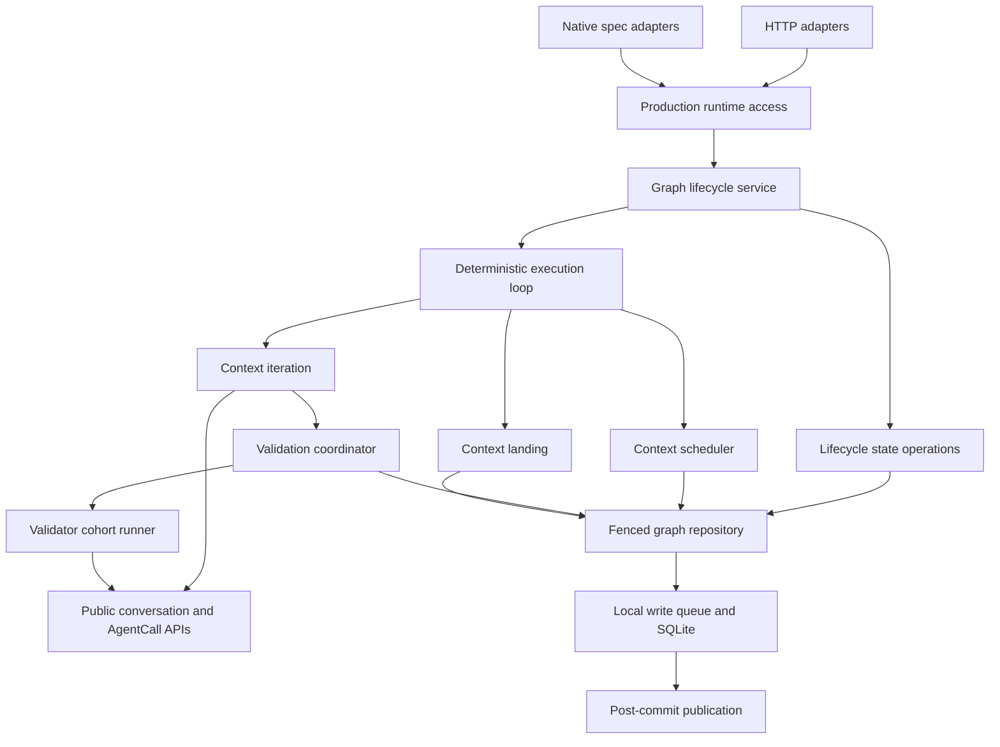

**Graph workflow improvements: technical design**

Prepared September 7, 2026. Baseline: `1ede6ed7`. Status: design for implementation; no implementation or delivery approval is implied. Companion: [implementation plan](../../memory-bank/graph-workflow-improvements-implementation-plan.md).

The graph engine will expose complete graph operations over its existing deterministic loop, conversation services, and SQLite repository. Lifecycle ordering, context-exit certification, scheduling reservations, and landing settlement each receive a named owner. Consumers supply intent and receive explicit outcomes. They should not reconstruct these protocols from HTTP handlers, collaborator wiring, or combinations of aggregate fields.

This implements the remaining recommendations from the [architecture reassessment](graph-workflow-architecture-review-update.md) and the [original review](../../memory-bank/collaboration/ff259a41-03a5-4ec8-acc2-27f340fac16a/round-1/agent_one/final_answer/answer.md). The [conversation design](conversation-machine-technical-design.md), [conversation plan](conversation-machine-implementation-plan.md), and [progress record](conversation-machine-implementation-progress.md) describe implemented dependencies. Their historical validation results are not validation evidence for this delivery.

**D0. Baseline and scope**

Commit `1ede6ed7` implements the settlement-failure handoff. `ConversationTurnSettlementError` retains the typed outcome and attempt identity; the graph adapter preserves it; the runner reports settlement accurately; direct and progress-wrapped errors project to an IO halt. Corresponding adapter, runner, error, and composed boundary tests exist. Preserve this implementation. It is not an outstanding task in this design.

Conversation hosting already owns admission, one attempt's cancellation and resources, delivery receipts, required persistence, and bounded reconciliation. Graph implementers use `executeConversationTurn`; hosted validators use the public task surface. Fresh merge tasks continue to use AgentCall without a conversation actor or resume identity. A settled conversation turn is evidence for a graph decision; it is not certification or permission to land.

The remaining source concentrations are `execution-route-handlers.ts`, `workflow-manager.ts`, `iteration-orchestrator.ts`, and `execution-loop.ts`. Their size is navigation evidence. Extraction boundaries below follow ownership, not line counts.

The provisional review diagnostic remains about **4/10 for graph orchestration**: responsibility, interface simplicity, change locality, and discoverable integration boundaries remain mixed or failing. Existing projections, reducers, invariant comments, and review discipline are strengths. This is a qualitative carry-forward assessment, not a new measured score or an assessment of the refactored conversation subsystem. D1–D10 specify the changes needed for the failing areas; final acceptance uses observable change-locality criteria instead of a numerical target. Time spent on design cannot be inferred from source.

Keep TypeScript, Zod, ordinary async factories, the deterministic graph loop, and the existing local SQLite write queue. Use the repository's installed versions and lockfile; no dependency upgrades, new packages, workflow DSL, statechart conversion, event bus, distributed lease system, generic plugin registry, or generic configurable stage pipeline is part of this delivery. Existing approved native features—dynamic graphs, authored lanes/ownership, cohorts, advisories, structured output, and profile snapshots—retain their semantics. The native inventory contains those feature specs; no competing architecture spec was created for these requested documents.

**D1. Module ownership and construction**

New filenames below are intended implementation targets, not existing source links.

| Owner | Responsibility and public boundary |
| --- | --- |
| `workflow-graph/production.ts` | Bind actual infrastructure once and lazily expose the assembled graph runtime. No lifecycle policy or import-time execution. |
| `workflow-graph/engine-composition.ts` | `createGraphWorkflowEngine(ports)` assembles existing owners with required dependencies. Export a focused `createGraphWorkflowContextServices(ports)` composition function for validation/context-only consumers. |
| `workflow-graph/lifecycle-service.ts` | `createGraphWorkflowLifecycleService(deps)` owns launch, normalize/resume, definition approval/rejection, abort, abandon, kickoff, failure reporting, and release ordering. |
| `workflow-graph/execution-route-handlers.ts` | Resolve HTTP addresses, parse requests, verify transport principals, invoke lifecycle operations, and map outcomes to existing responses. |
| `workflow-graph/workflow-manager.ts` | Graph lifecycle state operations and recovery normalization. It no longer constructs collaborators, schedules resources, or serves as an accidental repository implementation. |
| `workflow-graph/execution-repository.ts` | Fenced synchronous mutation and typed operation results, with publication after persistence. |
| `workflow-graph/execution-transitions.ts` and `start-guards.ts` | Complete non-running execution transitions and launch-guard errors respectively. Neither imports the manager or HTTP. |
| `workflow-graph/iteration-orchestrator.ts` | One graph context iteration: implementer work and integration of context-exit certification with approval/final context state. Its result is D5's explicit decision. |
| `workflow-graph/context-validation-coordinator.ts` | Complete context-exit certification, round lifetime, output capture/promotion, advisory response, and associated accounting. |
| Existing `execution-validation.ts`, renamed `validator-cohort-runner.ts` during D6 | Run/resume one reviewer cohort against a frozen round. Keep current verdict and specialist dispatch types. |
| `workflow-graph/context-scheduler.ts` | One complete reserve/provision/finalize-or-compensate scheduling protocol. |
| `workflow-graph/context-landing.ts` | Context landing mode dispatch and common durable settlement; existing committers and join runner perform mode-specific work. |
| `workflow-graph/document-edit-mechanics.ts` | Pure task ordering and edge mechanics shared beneath saved/live/template policies. |
| `workflow-graph/context-activity.ts` and `live-outline-schemas.ts` | Shared activity classification and the canonical outline wire contract. |

The diagram shows operation dependencies. `engine-composition.ts` constructs these owners; it is not another runtime layer on every call. The production accessor exposes lifecycle operations and the specific internal services existing adapters need, rather than copying every manager method into a new facade.

Required dependency groups correspond to actual owners: repository/storage, conversation and task execution, Git/worktrees, graph policy/integration, and clock/identity/publication. Do not expose a single flat replacement for every current optional factory member. Each factory accepts only the group methods it uses, with method syntax. Defaults live in `production.ts`; pure deterministic defaults remain inside their owner. Test builders supply deliberate fixture implementations. No missing function may silently disable validation, cancellation, materialization, persistence, or cleanup.

Production and `compat/engine-harness.ts` use the same engine assembly. `testing/cohort-engine-harness.ts` uses the focused context-services constructor; it must not fabricate loop or Git collaborators to exercise certification. That helper owns actual repeated construction, not an alternative implementation of policy. The graph composition module imports only public conversation/task operations; it must not import conversation production, actor host, attempt, machine, or runtime registries.

**D2. Transport-independent lifecycle operations**

Move the in-process operations currently exported from `execution-route-handlers.ts` into the service and its production access module. Migrate `specs/service-factory.ts`, `specs/workflow-cleanup-port.ts`, and the native SDD fixture. Keep App Router shells as thin HTTP exports. Preserve synchronous `transactionAttachment` inside the launch reservation transaction; it is the native spec binding's atomicity boundary.

The service exposes the following semantic operations using existing domain inputs, not `Request`, `Response`, HTTP status, or an SDK actor handle:

| Operation | Contract |
| --- | --- |
| `launch` | Accept saved, inline, and spec-prepared sources through the current launch gauntlet. Return accepted execution with disposition `running` or `awaiting_definition_approval`, plus existing warnings. |
| `pause`, `resume`, `reset` | Apply current transition and normalization rules to an execution-pinned command. Resume owns normalization and state admission together, then initiates the loop outside the request principal scope. |
| `approveDefinition`, `rejectDefinition` | Own interrupted-claim settlement, contract checking, claim/admission/finalization ordering, notification, kickoff or archive. |
| `abort` | Operator semantics: settle interrupted approval, abort, best-effort aborted notification, and auto-release. |
| `abortDeliveryExecution` | Delivery-owner cleanup semantics: expected-id check, abort, await aborted notification. Preserve its existing absence of operator approval settlement/auto-release. |
| `abandon` | Commit the audit and History relocation atomically; only the winning operation performs lane cleanup afterward. |
| `locateExecution`, `findPendingDefinitionApproval` | Read active/history or pending approval through the same domain boundary used by integrations. |

The two abort operations name genuinely different lifecycle guarantees. Their difference is explicit and tested; this delivery does not silently unify them with a collection of caller-controlled booleans. The existing spec running-only launch bridge may retain its current mapping of an accepted parked launch to `WorkflowDefinitionApprovalRequiredError`; the core service still records and reports that parked launch as accepted.

The following order is contractual:

- Launch reports running before detached kickoff. Accepted parked launches report awaiting approval and do not start the loop. A 202 acknowledges accepted work; it does not await execution completion.
- Preserve each operation's existing authorization contract. Pause/resume/abort/reset/abandon retain their execution-principal pins, with resume normalization inside its pin. Launch uses launch admission before an execution exists. Definition approval/rejection retain human-only transport guards plus execution/claim identity checks; trusted spec entry points retain caller-established authority. Do not invent an HTTP principal requirement for an in-process caller. Detached work uses the captured loop-generation fence, not an expired request scope.
- Approval settles an aged claim on the named execution, checks the execution contract, claims, calls admission, then finalizes against the captured claim. Only a known write-free admission refusal releases the claim. Errors or refusal after admission retain it for forward settlement.
- Kickoff failure re-reads Current and only halts the expected still-running execution. A successor is never halted by stale work. Auto-release re-reads lease state and follows the existing cleanup/archive protocol.
- Reject-definition retains its current lane cleanup before guarded archive. Abandon retains its different audit/archive-before-winner-cleanup contract.

Define ordinary lifecycle outcomes with literal codes and typed payloads in `lifecycle-outcomes.ts` as part of this extraction. Use an accepted/refused result envelope; retain existing schemas/types for the payloads. Refusal families are missing execution/definition/context, invalid transition, definition revision mismatch, launch guard, execution-contract refusal, approval claim/finalization refusal, and abandonment/rejection refusal. Launch-guard variants retain lease blocker, dirty paths, and finalizing-merge facts. Contract refusals retain their domain code, issues, and instruction. Claim refusals retain expected/current execution and claim facts. Do not replace these with `details: unknown` or a universal code string.

`lifecycle-http.ts` maps these outcomes to the existing status/body contracts. Use exhaustive discriminator handling and reuse existing JSON response helpers. Introduce typed missing-resource and transition errors at their actual producers where message matching currently supplies the distinction. Unexpected infrastructure errors and authority/transaction exceptions remain exceptions. Altering display text must not alter an HTTP status or recovery branch. No repository, scheduler, or validation code imports the HTTP mapper.

**D3. Required wiring and extension absence**

The loop's `getSessionWorktreeDirtyPaths` is optional at the baseline, omitted from production assembly, and converted to an empty list on absence or reader error. The manager's launch reader being wired does not cover a later scheduling batch.

Make the loop reader required and wire the existing worktree-dirty-path reader at production construction. Read it before admitting a new batch. Dirty results use the existing dirty-worktree halt policy; read failure produces an IO halt before scheduling/provisioning or implementer dispatch. An unreadable worktree is not clean. Preserve the distinction between inspecting dirt and automatically modifying it: this check does not stage, clean, stash, or commit files. This is an intentional behavior fix with its own production-construction regression.

Keep the existing late-bound `globalThis` extension ports for Next.js module identity. Mandatory policy must be registered before the first semantic operation that depends on it. Validate required wiring at startup completion and at public production access; do not capture registry state during module evaluation. Missing mandatory execution contract produces a typed configuration refusal before dependent writes, rather than accepting all checks. Explicitly constructed test runtimes pass their contract directly.

Required contract functions, including prompt projection when exposed by the contract, have concrete implementations. Explicit non-participation returns accepted/empty/null as appropriate; it is not represented by an accidentally unregistered contract. Production continues to register the specs policy through `registerProductionSpecWorkflowComposition`. Optional lifecycle participation—an observer that does not claim an inline execution, for example—retains its existing no-op/admit semantics. Normalize optional callbacks to named non-participating implementations at assembly. `markRunning`/`markDelivered` still require their configured integration. This is not a claim that a production import-order incident was reproduced.

**D4. Graph mutation contract and dependency direction**

Move `transitionToNonRunningState` with its task interruption, active-context normalization, epoch retirement, and lifecycle snapshot helpers to `execution-transitions.ts`. Move `WorkflowStartGuardError`, `leaseHeldStartGuardError`, and their dependent guard payloads to `start-guards.ts`. Moving only one helper leaves the current repository-to-manager runtime cycle in place. Keep the client-shared lifecycle classifier free of server imports. Consumers needing `getActive`/mutation receive an explicit repository contract, not the manager as a structural stand-in.

Replace `MutationRefusedError` plus `mutateActiveOrRefuse` and outer-closure result plumbing with an explicit synchronous reducer decision. `execution-mutation.ts` owns the transient generic operation types. `mutateActive<Value, Refusal>(address, reducer)` receives a private draft and returns an outcome containing the authoritative execution and either the operation value or refusal. Existing address arguments may remain positional; there is no public HTTP contract change.

| Reducer decision | Payload | Persistent effect |
| --- | --- | --- |
| `changed` | Next execution, operation value, optional pure event/push descriptors | Commit execution and events; advance execution-state revision once; derive structural revision from committed structural content. |
| `events_only` | Operation value and nonempty event/push delivery; no replacement execution | Commit delivery and advance execution-state revision once. Preserve graph content and structural revision. |
| `unchanged` | Operation value; no execution or delivery payload | Return current execution without a row write, events, delivery, or revision change. |
| `refused` | Typed refusal; no execution or delivery payload | Return refusal and current execution without a row write, events, delivery, or revision change. |

The reducer can still work on a clone, but a non-commit outcome discards that draft. It cannot silently carry events. An empty `events_only` decision is an invalid internal decision; ordinary no-effect paths use `unchanged`. Do not infer no-ops through whole-aggregate deep equality on every mutation. Migrate each caller's intentional branch, leaving explicitly requested commits as commits.

Extend `state-store/setters.ts` so non-commit outcomes leave the write queue without calling `setActive`, appending events, recording boundary-result deliveries, or publishing. Carry the typed operation result through that seam; do not reintroduce an outer mutable variable to capture it. Both loop and principal fences still run inside the queue before every reducer, including unchanged/refused paths. Stale authority remains an exception, never a harmless no-op.

`executionStateRevision` remains a commit fence, including event-only commits. `structuralRevision` remains derived at the durable write boundary as well as the graph seam so direct legitimate storage callers cannot lose definition writes. Centralize the shared derivation function and reuse it; keep enforcement at persistence. Do not alter supported stored shapes or add a schema version.

`finalizePreparedEdits` currently installs prepared whole state when `baseStateRevision` still matches, otherwise checks a delta against current structure, lifecycle, lock, lane, and field witnesses. The new contract must prove that skipping truly write-free attempts cannot hide an intervening commit. Event-only commits must still invalidate whole-state splice. Delta finalization must retain unrelated intervening writes. A prepared edit is not permission to bypass either authority fence.

Publication remains after successful SQLite commit, with rows and boundary-result delivery recording in the same transaction. No reducer performs logging, Git, network, conversation cancellation, or other I/O. Existing event/result delivery is sufficient; no durable event-log redesign is introduced.

**D5. Explicit context decisions**

Replace `GraphWorkflowIterationResult.shouldContinueInContext` with `decision`, retaining its execution and conversation identity envelope. Define `ContextDecision` in `context-outcome.ts`. This is a transient decision contract, not another stored machine.

| Decision | Payload/reason | Loop action |
| --- | --- | --- |
| `continue` | `tasks_remaining`, `output_capture_retry`, or `recertification_required` | Admit the next context iteration under existing limits and execution-wide halt checks. |
| `await_approval` | Existing durable approval state is authoritative | Return control to approval handling. |
| `await_user_input` | Existing user-input gate records | Park until the owning answers arrive. |
| `deliver_validator_answers` | Owning lane keys | Consume/deliver answers through the existing per-lane gate; keep the round open. |
| `await_collaboration` | Collaboration workflow ID | Yield to the existing collaboration owner. |
| `yield` | `rescheduled` or `superseded` | Return to scheduling or leave the retired ownership path. |
| `halted` | Existing typed halt reason | Follow pending-halt/drain policy; do not charge again. |
| `execution_stopped` | No extra stored state | Stop this context loop. |
| `ready_to_land` | Certification/output/approval requirements have been satisfied | Enter context landing. |

Every existing return site chooses its decision at the owner that knows why it returned. In particular, candidate drift, pending validator answers, or a context reset to ready must never become `ready_to_land` simply because an old boolean was false.

The loop switches exhaustively on these decisions. It retains one execution-wide recheck for sibling-driven pending halt and current authority: a context conclusion cannot authorize another turn after the execution stopped, while already successful siblings may still land during drain. Preserve the existing post-iteration max-iteration check and its position relative to early stopped/halted exits, approval, user-input continuation, and landing. A `ready_to_land` decision does not bypass that check. Keep query-capacity accounting, the shared transport/stall recovery budget and separate SDK-error budget, including their current reset rules. Existing typed execution exceptions, progress wrapping, and `StaleLoopFenceError` remain valid; preserve the completed settlement fix. Do not translate a stale loop exception into a halt on a successor.

**D6. Complete validation coordination and accounting**

`ContextValidationCoordinator.evaluateExit(input)` owns the full current context-exit protocol. Input contains project/session/context IDs, bookkeeping conversation ID, optional real lane conversation ID, execution target, resume user inputs, and abort signal. Output contains the latest execution and either `certified` or the applicable continue/wait/deliver/yield/halt/stopped decision from D5. `certified` means exit checks are satisfied; the iteration owner still applies human approval and final context status.

Move the actual protocol from `processContextExit` and its related orchestrator helpers, not just forwarding methods: output capture; candidate/roster freeze; script validation; reviewer dispatch/resumption and specialist persistence; candidate recheck; advisory delivery/response; recertification when the response changes the candidate; and promotion of reviewed output. Keep their fixed order in plain private functions.

The existing `createGraphWorkflowValidationService` becomes `createValidatorCohortRunner` in `validator-cohort-runner.ts`. Retain `ValidationRoundToken`, `ValidationRoundDispatch`, `GraphWorkflowContextValidationInput`, and current outcomes `pass`, `fail`, `plan_defect`, `infra_exhausted`, `asked_user`, and `candidate_mismatch`. Coordinator-to-runner `verifyCandidate`/`onSpecialistProgress` wiring is private to certification. Neither its round journal nor `onHalt` callbacks escape to the iteration caller.

Introduce pure `context-accounting.ts` decisions used by validation, ordinary iteration finalization, and manager resume/reset. Each terminal domain action commits its counter changes together with the state/events that justify them. The public context outcome never carries `failureAlreadyCounted`. Internal temporary termination exceptions may remain for stack unwinding, but they carry the already settled domain conclusion rather than asking a later finalizer to guess whether to charge it.

| Cause | Accounting policy |
| --- | --- |
| Script or semantic reviewer rejection | Reopen/add the appropriate remediation work and increment the failure streak once. |
| Context structured-output rejection | Apply its existing failure and iteration charges, including validation-only entry. |
| Meaningful successful certification | Reset the streak at the existing success boundary; when structured output is required, defer reset until reviewed output is published. |
| Questions, approval waits, collaboration waits, plan defects | No semantic failure charge. Preserve the open round where currently required. |
| Candidate mismatch or stale-result rejection | Increment the separate bounded mismatch counter; do not charge as rejected work. |
| Reviewer roster drift | Reset the candidate-mismatch counter according to existing policy; do not charge as rejected work. |
| Infrastructure, admission, or conversation settlement failure | Preserve evidence and halt/wait/recover under the appropriate owner; no semantic work-rejection charge. |
| Manual resume/reset | Apply the existing explicit reset rules through the same accounting owner. Keep transport and semantic budgets distinct. |

There is one identified behavior correction: initial candidate unavailability currently throws `IterationHaltedError` with the default uncounted flag, and the finalizer can charge a semantic failure while the execution remains running with a pending halt. Separate its no-semantic-charge correction from the structural coordinator extraction. Reproduce it through production-style pending-halt/drain behavior; the existing round-test harness immediately marks the execution halted and can skip the faulty finalizer branch. Preserve existing policy for other halt categories by enumerating their current charge sites before migration; do not recategorize unrelated user/engine halts under a generic infrastructure rule.

Keep rounds open across questions, infrastructure exhaustion, and plan-defect halt. Resume retries unresolved specialists and retains settled verdicts. Per-lane answers go to their owning conversation once. A superseded round cannot publish, reopen tasks, reset counters, or conclude its successor. Candidate identity includes required output schema/value. Validation-only paths use bookkeeping identity and do not invent an implementer host. Preserve the current pending-question precedence over transient turn errors.

**D7. Scheduler ownership**

Move `scheduleEligibleContexts`, `resolveSessionTargets`, scheduling-specific helpers, and provisioning-mutex ownership from the manager into `context-scheduler.ts`. Keep existing `ScheduleEligibleContextsInput` and result variants `none`, `solo`, and `parallel`. The scheduler receives a narrow fenced repository, target/session lookup, `ParallelWorktrees`, clock and IDs. The loop calls it directly rather than through a manager pass-through.

Keep the entire protocol together:

1. Canonicalize filesystem ownership outside the write queue.
2. Under fenced reservation, re-read pending halt and current claims; choose in definition order; honor active-runner exclusions, lane ownership, and supplied remaining capacity; stamp context and lane claims with the batch.
3. Serialize provision-through-finalize per project/session across loop generations, using the current shared mutex scope. An instance-local replacement is insufficient.
4. Recheck the generation before provisioning; perform Git/worktree work outside the database queue; recanonicalize after checkout, when aliases can first become visible.
5. Fenced finalization checks pending halt, both reservation owners, and canonical admission. Commit lane assignment, landing intent, active membership, and reservation release together.
6. On failure, dispose created resources best effort, release only this batch's claims/pass slots, and preserve the original error. Never delete a path or lane adopted by a replacement batch.

Routing, lane visibility/readiness, ownership admission, and query capacity retain their existing owners. The loop's query reservation/settlement/cancellation ledger is not absorbed into the scheduler. Preserve runtime `sessionLaneEnabled` behavior; correct its contradictory default comment instead of changing the default during extraction.

**D8. Landing outcomes and durable settlement**

`context-landing.ts` takes the selected context landing request and uses the existing lane/solo committers, join runner, evidence prober, and lock services. Mode-specific functions stay distinct. Define `LandingOutcome` before moving settlement, with variants that retain these facts:

| Outcome | Required evidence |
| --- | --- |
| Committed | Context/intent identity, commit SHA/time, lane commit snapshot and lane identity when applicable. |
| Adopted | Verified baseline-to-head movement, SHA/time and corresponding snapshot; do not fabricate a landing-token trailer. |
| No changes | Completed context and verified unmoved/clean result for that mode. |
| Read-only completion | Reserved read-only ownership; no commit of user/sibling dirt. |
| Joined | Existing durable join record/result and destination identity. |
| Failed | Existing mode-specific typed halt reason, including conflicts, delivery-gate or resolver failure evidence where applicable. |

Use discriminated payloads; reuse existing commit snapshot, halt, join, and ownership schemas/types. The result does not erase join replay or resolution evidence to fit a universal `{ok, sha}` interface.

One pure settlement function applies merge status/error, commit snapshot, landing intent and related graph events in a fenced mutation. Reuse `settleLandingIntent`, route reconciliation, lane snapshots, and authoritative join transitions. Join runner keeps ownership of its own durable join record; common context settlement consumes its committed evidence rather than writing the join outcome a second time. Use D4 `unchanged` for an already settled identical context, without duplicating snapshots/events.

Lock ordering remains merge mutex then session Git lock where currently required. Git stays outside the write queue. Durable landing intent is established before work; successful settlement records evidence and graph state together. After a commit-before-state crash, existing token/baseline probing repairs the context without replaying the agent or blindly making a second commit. A failure blocks dependents; no-change/read-only success may satisfy them under existing routing rules.

Final execution publication/merge remains its existing operation. No universal strategy interface is introduced in this delivery: the common interface is the settlement outcome, while commit, adoption, join, and publication keep their proven differences.

**D9. Shared editing mechanics and configuration**

Extract `document-edit-mechanics.ts` over `WorkflowSemanticDefinition` and explicit task/edge inputs. Own ordered task-ID selection, permutation validation, removal/insertion/move/resequence, edge target selection, and edge replacement/removal. Reuse `edge-identity.ts`, `locked-regions.ts`, and the already shared charter edit. Mechanical functions are synchronous, I/O-free, and operate on caller-owned drafts. They return existing structured issues; wrappers attach operation indices and transport-specific locators.

Saved and live editors retain ordered atomic batches and final definition validation. The saved tier keeps record metadata/layout/revision policy; live editing keeps frozen-past/locked-task checks, contract/authority, runtime-map synchronization, and the single `applyLiveExecutionEdits` core with staged preparation/finalization. Template-specific operations retain template policy while composing saved document mechanics. Shared mechanics must not let a live edit inherit a saved-tier permission to move or remove locked work.

Give `resolve-config.ts` an explicit pure `resolveContextDefaults` operation accepting actual global/workflow overrides, using the same cascade, provenance, and assignment-resolution functions. `buildDefaultLiveEditDeps` uses it instead of manufacturing `__live_edit_global_defaults__` and a fake placement. Real live-added contexts still receive assignment snapshots and validation prerequisites at the existing preparation boundary.

After moving runtime queries out of `validation.ts`, rename the remaining module `definition-validation.ts`. Put entry/terminal graph queries in `execution-index.ts`; make runtime eligibility use existing routing/readiness owners. Do not replace runtime eligibility with a DAG-only helper or duplicate lane visibility. Update direct importers; no forwarding compatibility barrel is added.

**D10. Read contracts and cleanup**

`context-activity.ts` exports a pure classification of current context activity: ordinary work, validation, advisory response, and merging. Preserve merge-status precedence and advisory-awaiting-response precedence over task-complete validation. Consume it in `derive-graph.ts`, `derive-wait-state.ts`, and relevant outline projection. Keep UI labels, layout, and waiting-detail presentation in the UI adapters. Route and lane visibility remain supplied by the already shared projections; the UI does not need to consume a new comprehensive server view.

`live-outline-schemas.ts` becomes the Zod source for the actual outline response and selector variants. `live-outline.ts` derives its DTO types from those schemas; CLI rendering imports them rather than maintaining `workflow-live-outline.ts`'s private mirror. Reuse the existing model-selection, selector, output-schema, provenance, route and lane schemas. Preserve current wire fields and explicitly supported decoding defaults during this ownership move; add no new compatibility path. Historical permissive branches require evidence of safe retirement, not deletion because their comment looks old. Preserve CLI fallback/disclosure and required assignment-provenance semantics.

Remove obsolete production tool-server plumbing only after migrating the compat harness's meaningful completion behavior to the production task-completion service, with the same lane/conversation authority checks. Remove the empty builder, its dependency, and corresponding close/forwarding code together. Real conversation tooling and portable MCP support are not obsolete merely because this particular builder is empty.

Enforce semantic import directions through the existing ESLint architecture rule family and allowlist infrastructure: graph core cannot import route modules; repository cannot import manager; command adapters cannot implement competing live structural mutation paths; shipping modules cannot import test harnesses. Keep browser-safe fixture builders reusable by tests and stories; stories may not import server engine harnesses. Seed any temporary allowlist with exact current offending edges, require removals in their owning change, and do not establish file/function size ceilings.

Inventory remaining legacy tolerances in the workflows adoption matrix with owner, supported meaning, evidence and deletion condition. Preserve required persisted decoding. Do not move directories or delete supported legacy behavior merely to finish the inventory. Preserve true invariant comments; update comments made false by a move and avoid change-history commentary in implementation code.

**D11. Delivery safety and acceptance**

New public wire/persisted shapes remain schema-first; infer their types. Internal operation unions compose those types and need no extra stored representation. No SQL migration, execution schema version change, new resume format, or additional state authority is required.

Reuse structured logging through `createLogger` and current trace scope. Preserve useful event names during moves. Add bounded diagnostics only at operation decisions—lifecycle refusal/kickoff, dirty inspection failure, mutation decision, scheduler compensation, validation conclusion, landing settlement—with execution/context/round/batch identity and typed reason. Never log or publish inside a reducer. Do not log full outcomes, prompt text, provider secrets, or duplicate an existing owner's event. Requested, admitted, committed, and completed operations must remain distinguishable.

Structural changes must retain current response bodies, execution status transitions, claim protocols, event ordering and cleanup ownership. Behavior changes are isolated: dirty-reader failure handling and missing-policy refusal; actual write-free mutations; initial unavailable-candidate accounting; and removal of the runner's obsolete seam after harness migration. Test failures must be classified before widening scope.

Acceptance is concrete: a spec integration launches/resumes/cleans up without importing HTTP; changing refusal prose cannot change response status; a new wait decision requires a context contract case rather than field inspection in the loop; another reviewer assignment uses the existing cohort protocol; a true no-op is write-free while event-only commits fence staged edits; concurrent scheduling never double-adopts a lane; landing settlement has one context-state owner; task ordering and activity rules change in one place; outline fields have one schema owner. The [implementation plan](../../memory-bank/graph-workflow-improvements-implementation-plan.md) binds these guarantees to ordered changes and tests.
