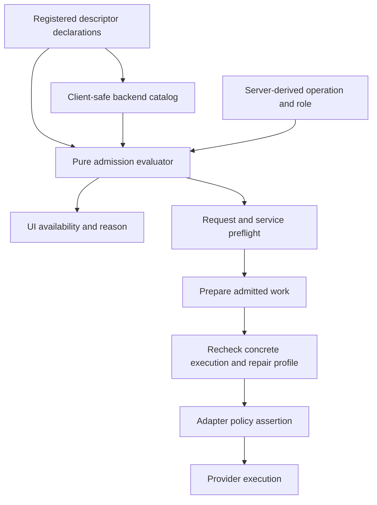

# Capability admission design — command-center#111

Date: 2026-09-05. Status: **implementation authorized by Alex**. Basis: the live ticket and [source research](research.md), pinned to revision `06159859ac88c34706cc19943c9c5cfb3020606a` with Cursor SDK `1.0.28`.

## Outcome and boundaries

Unsupported Cursor operations are refused before provider work starts, and the UI explains the same decision as the server. A future restricted task runner opens only its declared task profiles and explicitly admitted execution classes. Supported conversation and deterministic git/ticket operations remain usable.

This design covers command availability, task/default admission, optional Quick Ticket enrichment, unsupported derived forks, and Cursor runtime refusal of filesystem policies. It reuses descriptors, the backend catalog, AgentCall, existing command services, warnings and fork cleanup.

It does not add a Cursor task runner (#115), context-preserving forks or queueing (#112), MCP fixes (#114), auxiliary backend enablement (#116), privileged instructions/confinement (#117), workflow schema widening (#118), or collaboration generalization (#119). No new backend fallback, settings migration, compatibility reader, workflow engine, or provider transport is introduced.

## Acceptance contract

| ID | Independently observable outcome |
| --- | --- |
| A1 | An unsupported whole operation returns a stable refusal before provider startup/send, billable work, or success-shaped domain artifacts. UI and API use the same code and reason. |
| A2 | Adding a task facet alone does not admit a governed role or an undeclared execution profile. Changing backend identity without changing declarations does not change the evaluator's answer. |
| A3 | Concrete instruction and write-policy requirements are checked against the actual conversation/task facet on initial execution, resume and repair. An unavailable guarantee cannot be discarded to run the request. |
| A4 | `/ticket` and `/collab` report their actual unavailability; `/align`, `/spec`, and clean git operations retain their supported behavior within existing scope rules. |
| A5 | Unsupported commit/merge message generation directly uses the existing default-message path and discloses it. Unavailable validation repair/conflict assistance never starts an agent and never converts failed validation/conflicts into successful delivery. |
| A6 | Quick Ticket still persists valid tickets and attachments when enrichment is unavailable, returns an explicit warning, and does not schedule the unavailable agent step. |
| A7 | Naming/compaction selectors and server write/dispatch boundaries agree on eligibility. Cursor remains a valid ordinary-conversation default; invalid persisted auxiliary choices remain visible and never cause silent provider substitution. |
| A8 | A Cursor session-derived fork produces no target row/transcript and no adapter fork call. Index-zero user start-over remains available. Unexpected adapter `unsupported` results do not finalize a successful fork. |
| A9 | Cursor runtime creation with any defined `fsWritePolicy` fails before transport creation for both fresh and resumed inputs. Undefined policy retains ordinary execution. |
| A10 | Existing Claude/Codex supported behavior, native/synthetic fork fidelity labels, supported Cursor conversations, and ordinary ticket CRUD remain available. |

Normal request logs and explicit rejection notices are permitted. “Before side effects” means before accepting unsupported work or creating its success artifacts; it does not prohibit recording the refusal. For a conditional git stage, earlier supported git/validation work may already have run. The unavailable agent stage must still be refused before its own startup.

## 1. One admission contract

Add a client-safe `src/lib/agent-backends/execution-admission.ts` owning Zod schemas, pure evaluation, stable refusal data and message formatting. Keep provider-specific translation in adapters and product operation composition in the owning domain.

### Execution classes and profiles

Use three explicit execution classes:

| Class | Trusted owner and meaning |
| --- | --- |
| `ordinary-conversation` | Ordinary session/project chat, including profile specialization and authoring Alignment/spec drafts. |
| `nongoverned-task` | Auxiliary work whose server-owned contract does not claim validator authority, charter governance or ownership confinement. It can be read or write capable. |
| `governed-execution` | Workflow assignments, validators, and any task/conversation whose trusted orchestration applies a governing charter or ownership envelope. |

Keep task launch profiles orthogonal: `standard` and `isolated-one-shot`. A formatter, validator and repair can all use isolated launches; that does not make them equivalent roles.

Introduce a required execution class in internal conversation-create/task/AgentCall intent. Task launch profile is made explicit in the admission request even where a caller currently resolves omitted input to `standard`. Update internal call sites atomically; do not add an “unspecified means auxiliary” default. External request schemas do not accept these authority fields. API handlers and orchestration derive them from the operation and durable role/context. This is request-time execution context, derived again on restart/resume; it needs no persisted role migration or second source of durable authority.

Use existing concrete operation names for diagnostics. Do not add a second backend allowlist for each planner/validator/advisory role. The operation-to-class mapping belongs to its trusted consumer and must be exhaustive where the domain already has a role enum.

### Descriptor declarations

Each present facet declares its supported execution classes and instruction delivery (`privileged` or `user-message`). Task facets also declare supported execution profiles. Retain the existing per-facet `fsWriteRestriction` field; project it into the catalog rather than introducing a competing confinement declaration.

| Facet | Admitted classes in #111 | Instruction delivery | Task profiles |
| --- | --- | --- | --- |
| Claude conversation | ordinary-conversation, governed-execution | privileged | — |
| Codex conversation | ordinary-conversation, governed-execution | user-message | — |
| Cursor conversation | ordinary-conversation | user-message | — |
| Claude task | nongoverned-task, governed-execution | privileged | standard, isolated-one-shot |
| Codex task | nongoverned-task, governed-execution | privileged | standard, isolated-one-shot |
| Cursor task | No facet | — | — |

Role eligibility is explicit product admission, not proof of an instruction mechanism. Codex conversation eligibility preserves its existing contract and must not be reported as privileged. Governed task declarations require both privileged delivery and enforced filesystem support. An explicit privileged request against any user-message facet fails, regardless of its admitted class.

Cursor has no governed role grant. #117 must establish both instruction and confinement evidence before changing that grant. The evaluator has no Cursor-specific exception; descriptor policy changes themselves require review and conformance evidence. #111 does not “upgrade” Codex conversation instructions as part of this work.

Registration checks required fields, unique classes/profiles, valid facet/class combinations and governed-task guarantee consistency. Absent facets project `null` execution metadata. Missing metadata never becomes an unrestricted default. Keep client-safe literals and server descriptors consistent through catalog/registration conformance tests.

### Requirements and result

The pure evaluator takes the selected catalog/descriptor projection and a discriminated requirement: a conversation request or a task request with its execution profile. Both carry the trusted execution class and whether this operation requires privileged instruction delivery or an exact write envelope. The caller supplies the concrete policy separately to execution; policy presence always upgrades the requirement to exact enforcement, including an empty allowlist. Trusted composers classify ownership-confined requests as governed; contradictory nongoverned intent plus an ownership envelope is an invalid internal request, not a way around role admission.

Evaluation order is deterministic: required facet, execution class, task profile, explicit instruction requirement, filesystem requirement. Return one primary refusal, with backend, operation, code and user-facing reason. Initial codes:

| Code | Meaning |
| --- | --- |
| `backend-facet-unsupported` | Preserve the current missing-facet code. |
| `backend-role-unsupported` | This facet has not been admitted to the execution class. |
| `backend-task-profile-unsupported` | The requested launch profile is absent. |
| `backend-instructions-unsupported` | Privileged delivery was required but is unavailable. |
| `backend-fs-policy-unsupported` | The exact write envelope cannot be enforced. |
| `backend-fork-unsupported` | The requested context-derived fork is unsupported. |

Fork admission uses the existing `capabilities.fork` declaration plus the source-message kind; it composes the same refusal schema without pretending a fork is task execution. Collaboration continues to apply its existing schema/policy after the shared execution checks.

An unknown backend or absent live catalog entry is unavailable. A live response never falls back to a more permissive build-time seed. While the client is loading the catalog, show a pending/unavailable selection state. The server always reevaluates against its registered descriptor; UI availability is not an authorization token.

## 2. Enforce before launch and at dispatch



Use the existing facet helper only for surfaces that truly ask about facet existence. Operation/role consumers use complete admission. Do not make `getTaskRunner()` alone an authorization check.

Add a small server-side task execution boundary, `agent-backends/task-execution.ts`, which checks the descriptor and fully composed request before calling a runner. Migrate direct task consumers and AgentCall's task dispatch to it. It accepts an injected runner/descriptor port for tests, but verifies backend agreement and requirements regardless of whether the runner came from registry lookup or a resolver. Provider adapters remain implementations of the existing runner contract.

Guard known intent before any job is accepted or runtime is constructed. Repeat against the composed request immediately before dispatch to catch stale catalog/config state and dropped or widened policy fields. Extend the existing consumer-locality/architecture checks so raw production task-runner execution cannot appear in another neutral consumer unnoticed.

For conversations, check class and creation policy in the shared service and before production factory resolution; keep the adapter's creation assertion as the final enforcement boundary. Direct constructor/factory tests must not require the consumer to have checked first.

AgentCall admission precedes its runtime-resolver/MCP hooks. Carry execution class, privileged requirement and filesystem policy through repair requests. An isolated schema repair is re-admitted with `isolated-one-shot`; it cannot downgrade a governed call to auxiliary. For output requests whose default repair budget is nonzero, preflight the possible repair profile before the initial task, so an undeclared repair profile cannot become a surprise after billing. An explicitly zero repair budget needs only the primary profile. Conversation corrective turns retain their conversation class and policy.

Refusals normalize to the existing `capability_unavailable` failure, `retryable: false`, with the specific admission code carried as structured data. Retain valid continuation state; do not trigger stale-ref recovery, retry, formatting repair or backend substitution for admission errors. Existing 400 missing-facet responses stay 400. Add corresponding 400 admission responses to task/config request boundaries and a typed 422 for unsupported derived-fork creation. Prompt routes map preflight errors before opening their stream; an already-open internal stream emits its existing terminal failure envelope with the same code and reason.

### Consumer classification and placement

| Consumer | Classification and gate |
| --- | --- |
| Ordinary chat, `/align`, `/spec`, ordinary profile specialization | ordinary-conversation; preserve scope/session gates. |
| `/ticket`, Quick Ticket enrichment, naming, compaction, generic `cctl agent` | nongoverned-task for the actual auxiliary operation; server stamps its profile. `/ticket`, compaction and generic agent runs use standard primary execution; naming/enrichment use isolated-one-shot. Schema-based AgentCall operations also preflight their configured isolated repair. Generic agent input cannot supply a governed class or CC scope. |
| Workflow implementer turns | governed-execution on conversation facet; preserve existing ownership/read-only policy construction and dispatch it intact. |
| Workflow validators, planner, output capture, advisory response and plan repair | governed-execution on task facet, retaining each caller's existing profile and policy. |
| Collaboration lanes and resolution | Existing product eligibility remains; governed work uses the corresponding conversation/task facet. Do not widen allowed backend schemas or pairs. |
| Commit message generation | nongoverned-task for ordinary message drafting; upgrade when trusted orchestration explicitly applies a governing contract. Preserve the existing deterministic message fallback. |
| Validation fix and conflict analysis/resolution | governed-execution in their current automation entrypoints, which supply governing repair/resolution instructions. Cover both actor-backed and fresh-run dispatch. A future task facet alone must not enable these stages. |
| Structured-output retry | Inherit original class and requirements; evaluate actual repair profile. |

Neither `autonomous`, a nonempty instructions string, arbitrary prompt text, profile `readOnly`, nor `recommendedFor` grants or removes authority. Persisted workflow/session context and domain role determine it. Validation/conflict entrypoints are classified by their known automation contract, not by scanning their instruction string. Ordinary interactive conversations retain their current instruction fidelity, including profile and Alignment material; this does not authorize using that conversation as a validator or governed automation lane.

## 3. Command availability and partial operations

Extend the existing built-in definitions with typed requirements/optional stages, exhaustive for their seven names. Compose a domain-owned availability result: `available`, `unavailable` with refusal, or `degraded` with a bounded list of unavailable assistance stages. The execution evaluator remains a binary decision for each stage; it does not own git or ticket product policy.

Apply availability after catalog composition by reserved command name so discovered commands cannot shadow a built-in to bypass admission. Preserve the current scope filtering. Keep unavailable backend-specific items visible with their reason and prevent activation; degraded items remain selectable and replace descriptions that promise unavailable agent assistance.

At the prompt entrypoint, resolve the selected backend, apply command admission, then perform backend adoption/conversation creation and command transcript dispatch (`prompt/sdk-driver.ts:679–733`). Recheck in the command service for non-prompt callers. `/collab` has its own prefix/dispatch path and must use the same existing collaboration predicate there.

For git commands, preflight known agent stages, show the limitations, and run the supported deterministic path:

- `/commit` and `/merge`: unavailable message generation selects the existing default message directly. Preserve existing fallback behavior for actual generation failures as well; do not call a missing runner deliberately to discover it by exception.
- Validation commands still run. If automatic agent repair is needed but unavailable, terminate through the existing validation-failure outcome. Never bypass validation or mark a failed candidate delivered.
- Conflict resolution is independently admitted before its task. Preserve current git conflict/rollback and manual recovery semantics; do not invent a new auto-resolve path or silently select another backend.
- A clean `/rebase` remains available. Its description must not unconditionally promise automatic conflict resolution.

## 4. Quick Ticket and task-backed settings

Quick Ticket preflights enrichment in `create-attachment-planner`, only under the conditions that currently schedule it. Use a small injected preparation dependency to resolve backend, atomic model selection and admission. The plan captures an admitted enrichment input for `afterCommit` rather than having scheduling resolve a potentially different global default again.

If unsupported, add `enrichment_unavailable` to the existing `quickTicketCreateWarningSchema`, persist the valid ticket/attachments, and omit enrichment scheduling. The existing dialog warning surface displays: “Ticket created. Automatic enrichment is unavailable with Cursor.” Keep the underlying refusal code/reason available in the structured warning. Auto-start behavior and conversation-snapshot refresh remain governed by their existing independent paths.

Recheck the captured input at execution. If eligibility has changed, skip provider dispatch and log the structured refusal; do not change providers or undo the already-created ticket. This ticket does not add an enrichment-backend preference, persistent enrichment-state machine, or background retry loop.

Naming and compaction pickers use operation/profile admission from the live catalog. Validate changed global naming/compaction settings before writing them. The repository schema supports a compaction override, but no naming override or repository-config write endpoint exists; validate manually edited compaction overrides during effective configuration resolution before creating a pending artifact. Reject an attempted unsupported backend/model selection, or enabling naming with an unsupported stored selection, before saving that operation's change. Allow disabling naming and unrelated config edits to recover from a manually invalid stored value. A settings read remains possible and shows the invalid value with a diagnostic; no migration or substitution occurs.

Runtime naming/compaction resolution performs the same check before task startup, including compaction overrides in manually edited `CommandCenter.json`. A bad auxiliary setting does not disable ordinary conversations or prevent loading the rest of configuration. The global `defaultAgentBackend` still accepts Cursor for conversations; its Quick Ticket limitation is disclosed rather than converted into a global ban.

## 5. Fork admission and adapter filesystem refusal

For a fork, validate source/message and existing required refs first. Before generating a target id, resolving a target profile, copying transcript data or persisting a provisional row, determine whether the operation needs inherited context:

- User message index zero: preserve current edit-and-start-over behavior; no fork capability is required.
- Every context-derived fork: require `native` or `synthetic` support. Cursor receives `backend-fork-unsupported` with “Cursor cannot fork this conversation with its history.”

The pane and peek surfaces share this decision through MessageRow/MessageActions. For derived forks, evaluate the backend of the source ref that the service actually resolves: `conversation.backendRef ?? conversation.forkedFrom?.sourceBackendRef`. Never parse the opaque ref or infer backend from message/model metadata. Pass a precomputed decision from the owning conversation record to the action component so the client and server resolve the same effective fork backend. Start-over uses the conversation backend. Keep existing native/synthetic fidelity disclosure. If an adapter advertised support but returns `unsupported`, use the existing cleanup path and fail creation; never finalize the provisional copy as success. No historical fork records are rewritten.

At the Cursor boundary, add a pure assertion for any defined `fsWritePolicy` and call it before factory transport construction and at direct runtime construction. Fresh and resumed inputs use the same assertion. Empty allow/deny arrays are still a defined restriction request. Undefined means ordinary unrestricted execution. The error names the unsupported guarantee and never enables generic sandboxing, drops the policy, or turns it into a prompt instruction.

## 6. UI and observability

Reuse the design system's primitives, existing command rows, model selectors, message actions and Quick Ticket warning surface. No new page, token or global stylesheet is needed. Disabled reasons must be available to keyboard and touch users and associated with the control; color/hover-only explanations are insufficient.

Representative review states:

```text
/ticket   Unavailable — Cursor does not support task execution.
/commit   Commit changes using a default message.
          Agent message generation and automatic fixes are unavailable.
Fork      Unavailable — Cursor cannot fork this conversation with its history.
Quick Ticket: Ticket created. Automatic enrichment is unavailable with Cursor.
```

Use backend labels from the catalog; these examples do not authorize backend-name branches. Add Storybook states to the affected existing stories during implementation for available, unavailable and degraded states, plus the index-zero start-over case. Verify both pane and peek, keyboard activation prevention, live catalog loading, and warning rendering using the session URL from `cctl dev ensure`.

Pure evaluators do not log. Boundary callers use `createLogger` with stable events:

- `backend.execution_admission_rejected`: operation, backend, facet, executionClass, executionProfile when applicable, code, requirement, and existing scoped trace identity.
- `command.assistance_unavailable`: command and stage, refusal code, selected default-message outcome if applicable.
- `tickets.enrichment_unavailable`: ticket identity, backend, code and whether refused during preparation or execution.
- `conversation.fork_unavailable`: source identity, backend, code; no target success id.
- `cursor.fs_policy_rejected`: backend, code, fresh/resume mode and policy-presence/count metadata.

Do not log prompts, credentials or full allow/deny paths to explain admission. Successful dispatch continues using current lifecycle logs. API, CLI and UI format the same refusal data rather than reconstructing prose independently.

## 7. Change inventory

| Responsibility | Primary files/modules |
| --- | --- |
| Contract and projection | `src/lib/agent-backends/{execution-admission,descriptor,catalog,registry-core,facet-gating,task,conversation}.ts`; descriptor literals for Claude/Codex/Cursor |
| Task enforcement | `src/lib/agent-backends/task-execution.ts`; `src/lib/workflows/primitives/{agent-call-vocabulary,agent-call-facade,agent-call-task}.ts`; direct task call sites |
| Role composition | `src/lib/workflow-graph/{implementer-runner,validator-runner,planner,advisory-response-runner,context-output-capture-runner,workflow-collaborator-caller,validation}.ts`; `plan-repair/agent-runner.ts` under the same domain; conversation creation and `src/lib/workflows/conversation/` task-intent/pre-turn transport; collaboration caller |
| Commands | `src/lib/commands/{built-in-commands,backend-command-catalog,schemas}.ts`; `src/lib/prompt/sdk-driver.ts`; `src/lib/conversation-commands/service.ts`; `src/components/session/prompt/PromptEditorSlashCommandPopup.tsx` and its command-row presentation |
| Optional ticket work | `src/lib/tickets/{create-attachment-planner,service-factory,enrichment,schemas}.ts`; `src/components/quick-ticket/QuickTicketDialog.tsx` warning rendering |
| Settings | `src/lib/config/{route-handlers,loader}.ts`; project override validation; `src/features/config/sections/{NamingSection,CompactionSection}.tsx`; workflow role selectors |
| Fork | `src/lib/conversations/{service,fork-route-handlers}.ts`; `src/components/conversation/MessageRow.tsx`; `src/components/MessageActions.tsx`; pane/peek prop plumbing |
| Cursor policy | `src/lib/agent-backends/cursor/{production-wiring,conversation-runtime}.ts` and adapter-local policy assertion |
| Conditional git assistance | `src/lib/workflows/validation-fix.ts`; `src/lib/sessions/conflict-resolution.ts`; existing job outcomes |

The inventory defines ownership boundaries, not permission to rewrite entire modules. Extend existing dependency-injection seams, use method syntax in dependency interfaces, derive types from Zod schemas, and preserve truthful code comments. For workflow implementers, aggregate both their conversation-turn requirements and their configured task-based advisory/output-capture requirements during definition/selection validation. Keep existing closed workflow/collaboration schemas; report role/product unavailability truthfully if a backend passes the facet check but remains excluded.

## 8. Test and delivery strategy

Each bug fix starts with a failing behavior reproduction, run against the current implementation and confirmed to fail on the missing behavior. Update tests that assert the defective behavior rather than preserving both contracts. Internal modules use real production functions with injected external ports; no `vi.mock()` for internal project modules.

| Test group | Required evidence | Acceptance |
| --- | --- | --- |
| Pure admission and descriptor conformance | Missing facet; explicit classes/profiles; identity-independent decisions; user-message vs privileged; defined empty fs policy; missing/malformed metadata rejected; catalog parity | A1–A3 |
| Limited runner regression | A test descriptor with only nongoverned task support can run its declared profile but cannot create a governed runtime or invoke a validator/planner/repair; denial persists when only facet presence changes | A2–A3 |
| Task and AgentCall boundaries | Direct helper and resolver paths refuse before runner/runtime/MCP start; declared profile passed through; repair retains governance and policy; unavailable repair profile rejected before first task; no retry/fallback/continuity clearing | A1–A3 |
| Command matrix | Seven built-ins × backend × project/session/workflow scope; reserved-name shadowing; typed `/ticket` and `/collab` refusal before prompt state changes; clean git stages and explicit default message preserved | A1, A4–A5 |
| Quick Ticket | Real planner/service returns persisted ticket and attachments plus warning; no enrichment schedule/dispatch; auto-start exclusion preserved; captured backend stable across config changes | A6 |
| Config/UI | Direct unsupported save rejected; effective repo override checked; invalid stored value readable; disabling/unrelated edits recover; naming/compaction runtime refuses; live missing catalog fails closed; conversation default Cursor allowed | A7 |
| Fork durability | Refused derived fork leaves rows/files unchanged; index-zero start-over succeeds; advertised support plus runtime refusal cleans provisional state; native/synthetic happy paths retain fidelity | A8, A10 |
| Cursor construction | Fresh and resumed factory plus direct constructor reject any defined policy before transport activity; ordinary undefined-policy scripted turns remain green | A9–A10 |
| Conditional git jobs | Deterministic validation still executes; unavailable repair does not publish a failed candidate; conflict refusal preserves existing recoverable/terminal git state; clean operations succeed | A5, A10 |

Reuse `facet-gating.test.ts`, `backend-command-catalog.test.ts`, `prompt/sdk-driver.test.ts`, `conversation-commands/service.test.ts`, ticket planner/enrichment tests, config route/UI tests, `conversations/service.test.ts`, `fork-profile-ordering.durability.test.ts`, `agent-backends/consumer-locality.test.ts`, and the Cursor scripted runtime harness. Client tests use the fetch fixture, real hooks, real schemas and real stores. Negative dispatch assertions supplement real decision/state assertions; wiring-only mocks are not enough.

During the TDD loop, use one explicit file per registered run:

```sh
cctl validate run test --queue-if-busy -- src/lib/agent-backends/execution-admission.test.ts
```

After each integrated slice, run the relevant focused files and registered typecheck/lint/seams. Run changed-scope validation at the final checkpoint. Add a conformance/consumer-locality assertion for new unclassified role dispatches and raw runner bypasses.

For live acceptance, run `cctl dev ensure` and use only this worktree's returned server. Exercise actual authenticated application routes for unsupported task/command/config/fork requests, observe worker/process startup and provider-send boundaries, and read durable rows/transcript files after refusal. Verify Quick Ticket persistence plus warning and git validation/conflict outcomes in disposable fixtures. Exercise supported Cursor conversation/start-over and existing Claude/Codex paths with real provider calls as appropriate to implementation acceptance. Scripted provider ports alone cannot certify privileged instructions or confinement; those guarantees are not being implemented here.

Suggested implementation order:

1. Admission schemas, descriptor/catalog declarations, pure failing decision tests and runtime registration checks.
2. Shared task boundary, trusted class composition, pre-resolution gates and repair propagation; cover all direct task paths and preserve Claude/Codex behavior.
3. Derived-fork refusal and Cursor creation-policy refusal with durable/scripted reproductions.
4. Command stages, Quick Ticket warning/preflight, task settings and matching UI/Storybook states.
5. Scoped checks, architecture coverage and live negative/positive acceptance; record evidence against A1–A10.

## Review decisions and completion boundary

The accepted decisions are: preserve index-zero start-over; create Quick Tickets with a warning when optional enrichment is unavailable; retain clean git paths and existing default messages; make execution class/profile admission explicit; and preserve Codex conversation eligibility while declaring its actual user-message instruction fidelity.

These decisions make #111 independent of vendor capability delivery. Alex authorized implementation with “Implement the design.” This work implements #111; it does not claim full Cursor parity or add the vendor capabilities assigned to later children. See [implementation validation](validation.md) for delivery evidence and limits.
