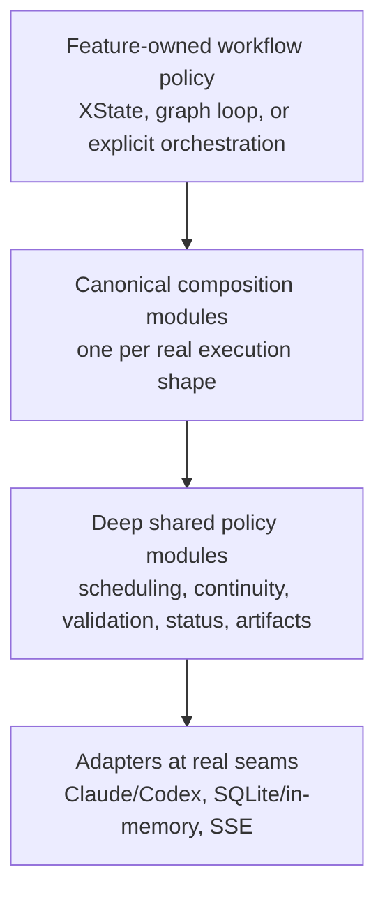
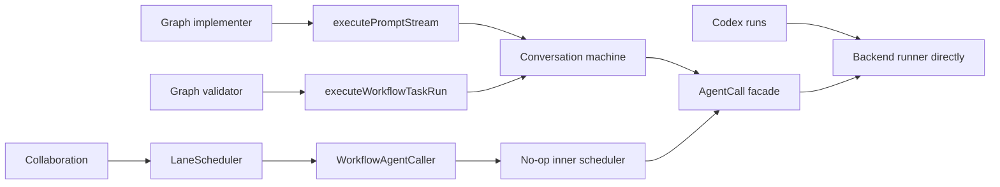

# Composable Modules Architecture Audit

**Date:** 2026-07-11

**Commit:** `349a3f46`

**Scope:** `src/`, relevant steering, `CONTEXT.md`, the composable-workflow-primitives specification, and architecture-facing tests

**Overall design score:** **6.0/10**

## Executive assessment

Command Center has the right strategic goal and several strong examples of it, but the implementation does not yet have one coherent composition model.

The strongest modules hide real knowledge: graph eligibility and planning, message-queue transitions, workflow-envelope storage, artifact path safety, route resolution, validated fetches, UI primitives, and transcript projection. They have small or focused interfaces, real production consumers, and tests at the same seam used by callers.

The weakest modules are “composition-shaped” without being deep:

- shared primitives that have no production consumer outside their own tests;
- wrappers that translate one tagged result into another without owning the underlying lifecycle;
- page hooks that move 30–70 fields between prop bags;
- giant dependency interfaces that expose every implementation decision to callers and tests;
- compatibility adapters that copy state into a new abstraction and then reconstruct the old state;
- parallel implementations that are both presented as canonical.

The most important correction is therefore not “extract more primitives.” It is:

> Create fewer, deeper modules around proven shared knowledge; make one module own each decision; and do not call a seam reusable until multiple production consumers actually use it.

I would reserve **primitive** for the lowest-level modules and use **composable module** as the scale-independent umbrella. A composite workflow, stateful store, page slice, or protocol module can be a good reusable module without being a primitive.

## Scorecard

| Goal | Score | Assessment |
|---|---:|---|
| Composability | 6.0 | Strong low-level assets exist, but many higher-level modules compose through wide prop/dependency bags. |
| Testability | 6.0 | Test volume and schema discipline are excellent; many tests are coupled to wiring and internal mocks. |
| Flexibility | 6.5 | Backend, store, and UI adapter seams support real variation; optional-method bags and duplicated policy reduce safe extensibility. |
| One canonical way | 4.5 | Workflow execution, scheduling, status publication, route resolution, persistence, prompt transport, and scoped cascades have competing paths. |
| Information hiding and locality | 5.5 | Deep modules coexist with several major knowledge hubs and temporal decompositions. |
| Design documentation / AI navigability | 5.5 | Comments and specs are extensive, but target, migration, experimental, and production-supported states are not kept distinct. |

## Evaluation lens and method

The audit used the following tests from *A Philosophy of Software Design*:

1. **Depth:** how much useful behavior does the module hide relative to what callers must learn?
2. **Deletion test:** if the module disappeared, would complexity reappear across several callers, or simply vanish?
3. **Information hiding:** does one module own a design decision, or is the same knowledge reflected in several places?
4. **Locality:** can a behavior change, bug fix, and its verification stay together?
5. **Change amplification:** how many modules must change for one conceptual change?
6. **Real seams:** are there at least two meaningful production adapters or consumers, or only a hypothetical extension point?
7. **Interface-as-test-surface:** do tests exercise the same interface production callers use?
8. **Somewhat general-purpose design:** is the interface the simplest one covering current needs, without a framework for hypothetical needs?

Static evidence included production import/call-site scans, module-size and test inventories, internal-mock scans, cross-feature import scans, and `bun run knip`. The codebase contains 625 non-test TypeScript modules under `src/lib` and 571 colocated tests there. `src/lib/workflows` plus `src/lib/workflow-graph` contain 174 production modules and roughly 60,000 production lines, so workflow design materially affects the whole architecture.

No `docs/adr/` records were present. Existing decisions in steering and approved specifications were treated as constraints, while contradictions between those documents and production code were treated as findings.

This was a static architecture review, not runtime performance testing. `bun run knip` currently exits non-zero and reports 20 unused files, 87 unused exports, and 84 unused exported types; some are configured entry-point false positives, so those totals are hygiene signals rather than proof about any individual module.

## The key distinction: one way per concern, not one engine for everything

The request for “a single way of solving a problem” is correct at the level of ownership:

- one owner for agent execution policy per execution shape;
- one owner for lane scheduling;
- one owner for conversation construction;
- one owner for transcript grouping;
- one publication path for lifecycle status;
- one scoped-cascade substrate;
- one query/prompt transport module;
- one route-resolution contract.

It would be a mistake to interpret it as one universal orchestrator. Stateful conversation turns, one-shot tasks, XState lifecycle machines, and a dependency-aware graph scheduler are genuinely different shapes. The architecture document already recognizes two distinct backend ports (`ConversationBackendRuntime` and `AgentTaskRunner`) at `docs/composable-workflow-primitives.md:63-72`, and workflow steering explicitly distinguishes XState machines from the graph execution loop at `.kiro/steering/workflows.md:1-3`.

The target should look conceptually like this:

Today, several concerns instead loop through competing or nested paths:

## Strengths to preserve

### 1. Deterministic graph modules have good depth

`lane-readiness`, `lane-plan`, `lane-join`, and `ExecutionIndex` concentrate graph rules into pure modules with focused tests (`src/lib/workflow-graph/lane-readiness.ts:151-259`, `src/lib/workflow-graph/lane-plan.ts:9-72`, `src/lib/workflow-graph/lane-join.ts:53-107`, `src/lib/workflow-graph/execution-index.ts:12-68`). Deleting them would respread scheduling knowledge through the graph loop. Their size is secondary to their locality.

### 2. Graph approval and user-input modules are genuinely deep

The graph approval and user-input modules own atomic decisions, parking, resumption, withdrawal, and lifecycle transitions (`src/lib/workflow-graph/approval-gate.ts:23-109`, `src/lib/workflow-graph/approval-gate.ts:164-384`, `src/lib/workflow-graph/user-input-gate.ts:113-193`, `src/lib/workflow-graph/user-input-gate.ts:303-595`). This is what a reusable gate looks like when it owns behavior rather than only a result tag.

### 3. Several persistence seams are real

`WorkflowEnvelopeStore` has meaningful in-memory and session-state adapters and explicitly owns atomic update semantics (`src/lib/workflows/primitives/workflow-envelope-store.ts:29-48`, `src/lib/workflows/primitives/workflow-envelope-store.ts:50-110`, `src/lib/workflows/primitives/workflow-envelope-store.ts:117-225`). State-store repository contract tests exercise production repositories against in-memory SQLite, for example `src/lib/state-store/sessions-repo.contract.test.ts:12-40`.

### 4. Artifact and route-resolution modules hide useful complexity

`ArtifactRegistry` centralizes kind-to-path policy, traversal protection, registration, and required/optional failure behavior (`src/lib/workflows/primitives/artifact-registry.ts:37-78`, `src/lib/workflows/primitives/artifact-registry.ts:220-277`, `src/lib/workflows/primitives/artifact-registry.ts:300-470`). The shared route-resolution module gives route handlers one typed success/failure contract and hides repeated 400/404 construction (`src/lib/shared/route-resolution.ts:1-14`, `src/lib/shared/route-resolution.ts:19-68`).

### 5. Message queue and dev-server interfaces are good server-side models

The message queue keeps transition knowledge pure and injects side effects through method-style dependencies (`src/lib/conversations/message-queue-service.ts:74-125`, `src/lib/conversations/message-queue-service.ts:434-490`). Dev-server exposes a small production interface over substantial implementation behavior (`src/lib/dev-server/service.ts:87-92`, `src/lib/dev-server/service.ts:114-165`, `src/lib/dev-server/service.ts:286-305`).

### 6. Shared UI primitives and transcript composition are working

The Radix-backed UI layer centralizes behavior and appearance, with shared recipes across related primitives. `ConversationTranscript` is a particularly strong composite module: one scope-dispatched interface owns querying, projection, row construction, loading, and scrolling (`src/components/conversation/ConversationTranscript.tsx:43-56`, `src/components/conversation/ConversationTranscript.tsx:78-145`) and serves the main conversation panel, panes, workflow viewer, and project cockpit. Its extension-row seam composes spawn cards without forking transcript behavior (`src/components/conversation/conversation-rows.ts:7-27`, `src/components/conversation/conversation-rows.ts:56-99`).

## XState-specific assessment

XState is a good fit for Command Center's explicit, durable lifecycles; it is not the architectural problem. Conversation, commit, and merge benefit from visible states and guarded transitions, and `.provide()` gives the conversation manager a defined actor/action composition point (`src/lib/workflows/conversation/manager.ts:732-764`). The dependency-aware graph loop is a different execution shape and should not be converted to XState for superficial uniformity.

The reusable XState layer is not yet production-proven. Generic setup, retry, and optimistic machines are test/catalog-only, root persistence is a no-op, and the conversation machine embeds debug policy. Commit and merge also independently implement a similar validate → repair → inspect changes → commit fix → revalidate sequence (`src/lib/workflows/commit/machine.ts:131-267`, `src/lib/workflows/merge/machine.ts:407-529`). That is a credible unification candidate because it has two production consumers, but the first step should be comparing their invariants and extracting shared policy/actors—not inventing a generic statechart. If the transition policies cannot remain obvious, keep the machine topology separate.

## Prioritized findings

### F1 — “Supported primitives” include unused and hypothetical modules

**Priority:** P0

**Recommendation strength:** Strong

The composable-workflow-primitives spec is marked implementation-complete (`.kiro/specs/composable-workflow-primitives/spec.json:2-21`), but several advertised modules have no production consumer:

- `runChangeSetGate` is defined only in `src/lib/workflows/primitives/change-set-gate.ts:37-64`;
- `runConvergenceGate` is defined only in `src/lib/workflows/primitives/convergence-gate.ts:41-84`;
- `scriptValidationGateFromOutcome` is defined only in `src/lib/workflows/primitives/script-validation-gate.ts:42-70`;
- `runContextLimitGate` has no production caller, although its narrower decision function is used (`src/lib/workflows/primitives/context-limit-gate.ts:83-125`);
- ask-user gate helpers have no production caller (`src/lib/workflows/primitives/ask-user-gate.ts:24-49`);
- `createWorkflowSetup` has no production caller (`src/lib/workflows/setup.ts:34-71`);
- `createRetryMachine` is used only by tests and the workflow catalog (`src/lib/workflows/retry-machine.ts:70-198`);
- `optimisticMachine` is used by tests and catalog introspection (`src/lib/workflows/optimistic/machine.ts:30-173`, `src/features/workflows-catalog/machine-specs.ts:849-856`), while production runs a separate explicit orchestrator (`src/lib/shared/optimistic.ts:45-143`, `src/lib/sessions/service.ts:590-598`).

Some root “shared workflow” files are even less real. Steering tells new workflows to use `runtime-state.ts`, `persistence.ts`, and `actions.ts` (`.kiro/steering/workflows.md:5-20`, `.kiro/steering/engineering-principles.md:57-63`), but the root runtime registry and setup have no production consumers, and root persistence is an explicit no-op left after an older workflow was removed (`src/lib/workflows/persistence.ts:13-41`).

The deletion test is decisive: deleting several of these modules would change only isolated tests or catalog visualization, not production behavior. They increase cognitive load and make the architecture look more complete than it is.

**Direction:** classify each shared module as `supported`, `experimental`, or `migration-only`. A supported shared module should normally have at least two production consumers, a clear information-hiding responsibility, tests through the production seam, and an identified owner. Inline or delete shallow hypothetical modules; migrate real callers before declaring replacements complete.

### F2 — Agent execution is normalized at the wrong depth

**Priority:** P0

**Recommendation strength:** Strong

The design promises one semantic AgentCall entry point that hides backend execution details, MCP application, continuity, errors, artifacts, and status (`docs/composable-workflow-primitives.md:143-168`). The implementation requires callers to construct backend runtime/runner resolutions and pass most execution policy back into the facade (`src/lib/workflows/primitives/agent-call-facade.ts:48-93`). Its implementation primarily dispatches by request kind and maps options (`src/lib/workflows/primitives/agent-call-facade.ts:112-236`), then applies structured-output validation (`src/lib/workflows/primitives/agent-call-facade.ts:239-284`).

Production policy remains in several callers:

- conversation actor construction and retry behavior (`src/lib/workflows/conversation/actor-implementations.ts:1029-1135`);
- task-run production wiring (`src/lib/workflows/conversation/actor-implementations.ts:2574-2625`);
- collaboration backend composition (`src/lib/workflows/collaboration/agent-caller-production.ts:151-262`);
- conversation-mediated task runs (`src/lib/workflows/conversation/execute-workflow-task-run.ts:1-18`);
- graph prompt streaming (`src/lib/workflow-graph/implementer-runner.ts:23-33`, `src/lib/workflow-graph/implementer-runner.ts:153-162`);
- direct task-runner use for Codex jobs (`src/lib/codex-runs/service.ts:372-404`).

Deleting the facade would leave most hard behavior in place and move only dispatch/result mapping. That is a shallow facade.

**Direction:** retain the two genuinely different backend ports, but establish one canonical composition module for conversation-lifecycle execution and one for task execution. Those modules should own backend resolution, portable policy, error normalization, and observability. Feature modules should supply semantic intent rather than reconstruct transport policy.

### F3 — Scheduling and continuity ownership is split across temporal stages

**Priority:** P0

**Recommendation strength:** Strong

Write capability and its default are repeated in the request vocabulary, facade, workflow caller, and scheduler (`src/lib/workflows/primitives/agent-call-vocabulary.ts:54-63`, `src/lib/workflows/primitives/agent-call-facade.ts:95-109`, `src/lib/workflows/primitives/workflow-agent-caller.ts:46`, `src/lib/workflows/primitives/workflow-agent-caller.ts:82-94`, `src/lib/workflows/primitives/workflow-agent-caller.ts:147-158`, `src/lib/workflows/primitives/lane-scheduler.ts:20`, `src/lib/workflows/primitives/lane-scheduler.ts:45-46`). Collaboration schedules a call outside `WorkflowAgentCaller`, while `WorkflowAgentCaller` also schedules internally. Production must inject a no-op inner scheduler to avoid reacquiring the same key and deadlocking (`src/lib/workflows/collaboration/agent-caller-production.ts:15-20`, `src/lib/workflows/collaboration/agent-caller-production.ts:63-67`, `src/lib/workflows/collaboration/agent-caller-production.ts:296-305`; outer scheduling at `src/lib/workflows/collaboration/helpers.ts:202-237`).

Graph lane adoption has a similar split. `WorkflowContinuityService` still owns graph reuse, creation, stale recovery, rotation, and validator continuity (`src/lib/workflow-graph/workflow-continuity-service.ts:28-75`, `src/lib/workflow-graph/workflow-continuity-service.ts:347-655`). It copies graph state into a fresh in-memory `LaneService` and reconstructs graph state afterward (`src/lib/workflow-graph/workflow-continuity-service.ts:288-345`, `src/lib/workflows/primitives/graph-workflow-lane-adapter.ts:1-24`, `src/lib/workflows/primitives/graph-workflow-lane-adapter.ts:72-107`).

These are compatibility projections, not transferred ownership. Two modules must understand the same scheduling or continuity decision.

**Direction:** assign scheduling once at the outermost module that can prove worktree safety. For graph continuity, either finish transferring ownership to the lane module or mark the projection as migration scaffolding with a deletion condition. Do not maintain two durable representations indefinitely.

### F4 — Generic gates erase type information without owning lifecycle behavior

**Priority:** P1

**Recommendation strength:** Strong

`GateResult` standardizes `pass`, `fail`, and `pause`, but stores gate-specific semantics in `Record<string, unknown>` details (`src/lib/workflows/primitives/gate-vocabulary.ts:31-98`). Several gate modules merely translate an already-made domain decision into that generic envelope:

- change-set detection explicitly remains the caller’s responsibility (`src/lib/workflows/primitives/change-set-gate.ts:15-18`);
- script validation maps one tagged union to another (`src/lib/workflows/primitives/script-validation-gate.ts:25-70`);
- ask-user maps an AgentCall pause into a gate pause (`src/lib/workflows/primitives/ask-user-gate.ts:24-49`);
- the generic convergence policy is “all voters accept,” while production collaboration is asymmetric, round-aware, and threshold-based (`src/lib/workflows/collaboration/policy.ts:1-26`, `src/lib/workflows/collaboration/policy.ts:104-148`).

The graph approval and user-input modules are deeper because they own atomic lifecycle transitions. The generic gate wrappers do not.

**Direction:** do not force every decision through one generic gate interface. Keep pure, feature-owned policies where semantics differ. Extract a shared gate module only when multiple production workflows share the lifecycle, and preserve kind-specific types rather than moving the real contract into `unknown` details.

### F5 — The conversation machine and actor implementation are knowledge hubs

**Priority:** P1

**Recommendation strength:** Strong

The conversation machine owns normal turns, task runs, external turns, ask-user handling, queue draining, persistence, and a full debug workflow. Debug-specific guards and transitions occupy substantial parts of the machine (`src/lib/workflows/conversation/machine.ts:143-195`, `src/lib/workflows/conversation/machine.ts:683-1003`, `src/lib/workflows/conversation/machine.ts:1078-1366`), even though the architecture document describes debug as a workflow attached to a conversation (`docs/composable-workflow-primitives.md:394-422`).

`ActorImplementationDeps` exposes locks, transcript I/O, backend lifecycle, state mutation, alignment, artifacts, MCP composition, capability application, AgentCall, task runners, and queue delivery (`src/lib/workflows/conversation/actor-implementations.ts:214-466`). Production construction imports more than twenty modules (`src/lib/workflows/conversation/actor-implementations.ts:480-525`). `.provide()` is used correctly, but dependency injection does not by itself create locality.

**Direction:** keep the conversation lifecycle as a stable external seam, but organize its implementation by knowledge: turn execution, transcript persistence, capability preparation, queue delivery, and debug orchestration. Extract debug as an attached workflow module with a narrow conversation-execution interface. Avoid splitting by chronological phases when those phases share the same knowledge.

### F6 — The session workspace decomposes by prop-passing stage, not knowledge

**Priority:** P1

**Recommendation strength:** Strong

The session page is an especially clear example of shallow decomposition:

- `UseSessionPageViewPropsArgs` exposes roughly 70 fields and then remaps them into other prop bags (`src/features/session/hooks/use-session-page-view-props.tsx:27-119`, `src/features/session/hooks/use-session-page-view-props.tsx:121-260`);
- `UsePromptComposerPropsArgs` exposes roughly 45 fields and mostly passes them through (`src/features/session/hooks/use-prompt-composer-props.ts:28-86`, `src/features/session/hooks/use-prompt-composer-props.ts:88-240`);
- the store bundle returns about 30 fields (`src/features/session/hooks/use-session-page-store-bundle.ts:42-136`);
- query bundling calls five hooks and returns them (`src/features/session/hooks/use-session-page-queries.ts:12-47`);
- `ConversationWorkspace` assembles the same values again before passing them through (`src/features/session/ConversationWorkspace.tsx:342-426`).

These modules have one production composition chain. Their tests largely verify members are present, and the view-props test is a TODO (`src/features/session/hooks/use-session-page-view-props.test.tsx:1-8`, `src/features/session/hooks/use-session-page-store-bundle.test.ts:6-28`, `src/features/session/hooks/use-session-page-queries.test.ts:15-28`).

The deletion test suggests that several interfaces would disappear if inlined. The extraction reduced file size but not system complexity.

**Direction:** reorganize the workspace around knowledge-owning slices—conversation turn, composer state, workflow/approval context, layout, and dev-server state—whose modules fetch or derive what they own and expose small behavioral interfaces. Retain pure functions and hooks that hide actual rules; remove page-specific pass-through modules.

### F7 — Canonical domain representations have multiple owners

**Priority:** P1

**Recommendation strength:** Strong

Conversation construction is repeated in session provisioning, ordinary creation, forking, initialization finalization, and project-conversation creation (`src/lib/sessions/service.ts:301-337`, `src/lib/conversations/service.ts:135-180`, `src/lib/conversations/service.ts:564-601`, `src/lib/conversations/service.ts:620-674`, `src/lib/project-conversations/service.ts:100-145`). A new default or invariant can require coordinated edits across all of them.

Logical transcript grouping is independently implemented for reading, rendering, and fork cutoffs (`src/lib/prompt/transcript.ts:344-395`, `src/lib/prompt/transcript.ts:717-800`, `src/lib/conversations/transcript-render.ts:119-191`). Parity tests reduce regression risk, but they also prove that one rule has several owners.

Persistence repeats representation knowledge as well. State-store has a canonical deterministic serializer (`src/lib/state-store/serialization.ts:1-29`), while equivalent serialization appears in `src/lib/state-store/conversation-row-codec.ts:25-51`, `src/lib/state-store/projects-repo.ts:67-83`, `src/lib/state-store/state-aggregate.ts:41-57`, and `src/lib/state-store/reference-documents-repo.ts:52-67`. `SessionsRepo.findListItemsByProject` exposes storage-shaped snake_case rows, leaving an accessor to parse and map them (`src/lib/state-store/sessions-repo.ts:19-40`, `src/lib/state-store/accessors.ts:103-199`).

**Direction:** establish one canonical conversation builder with scope-specific policy, one transcript-to-logical-units module consumed by read/render/fork behavior, and one serialization/row-projection module per stored representation. Repositories should return domain projections instead of exporting raw storage knowledge upward.

### F8 — Cross-cutting seams exist, but adoption is incomplete

**Priority:** P1

**Recommendation strength:** Strong

#### Status publication

Steering says `StatusBus` is the canonical publication surface and feature modules must not import the broadcaster directly (`.kiro/steering/data-fetching-and-sse.md:86-93`, `.kiro/steering/data-fetching-and-sse.md:290-300`). Production still imports the broadcaster from session alignment, conversation routes, prompt transcripts, context artifacts, chat spawning, project prompts, MCP, and other modules. Meanwhile `subscribeSessionStatus` has no production subscriber (`src/lib/workflows/primitives/default-session-status-bus.ts:120-130`), so the common in-process envelope currently serves tests rather than a production consumer.

#### Route resolution and API errors

The shared route-resolution seam exists, but local `resolveProjectOr404` implementations remain in dev-server, workflow-definition, and template-library handlers (`src/lib/dev-server/route-handlers.ts:147-172`, `src/lib/workflows/definition-route-handlers.ts:57-69`, `src/lib/workflow-graph/template-library-route-handlers.ts:75-87`). Other route modules define their own `jsonError` helpers or construct `NextResponse.json({ error })` directly.

#### Git execution

`GitClient` explicitly exists to centralize command execution and environment handling (`src/lib/git/client.ts:1-8`, `src/lib/git/client.ts:18-44`), while diff code still invokes raw `node:child_process` commands (`src/lib/git/diff.ts:1-32`, `src/lib/git/diff.ts:53-69`, `src/lib/git/diff.ts:111-138`). Git route resolution is repeated across a 721-line handler module and uses a one-off mutable dependency override (`src/lib/git/route-handlers.ts:27-50`, `src/lib/git/route-handlers.ts:465-496`).

#### Client data and prompt transport

Steering prescribes per-domain query, mutation, and key modules (`.kiro/steering/structure.md:34-37`), but client data behavior also lives in shared hooks and feature-local hooks. Session prompt, project prompt, peek reply, and document feedback use separate transports; session and project prompt paths duplicate hand-written SSE parsing (`src/hooks/use-send-prompt.ts:175-251`, `src/lib/project-conversations-client/mutations.ts:439-470`), while `src/lib/api/sse.ts` is empty.

**Direction:** finish one migration at a time and remove the superseded route. A shared seam should be the only normal publication or execution path; exceptional direct access should be explicit and documented at the adapter.

### F9 — Global UI state and SSE handling concentrate unrelated knowledge

**Priority:** P1

**Recommendation strength:** Strong

`NotificationListener` is a 1,295-line temporal monolith. One effect owns transport and instrumentation plus 43 domain listeners (`src/components/NotificationListener.tsx:97-195`, `src/components/NotificationListener.tsx:321-1269`). Some domains already own pure SSE reactions (`src/lib/mcp/sse-invalidation.ts:25-80`, `src/lib/context-artifacts/sse-cache.ts:70-150`, `src/lib/agent-capabilities/sse-invalidation.ts:21-118`), while conversation and graph reactions remain inline.

`session-detail.store` similarly mixes shell layout, voice, prompt streaming, queue state, delete UI, sidebar filters, questions, specs, documents, and navigation (`src/stores/session-detail.store.ts:110-220`). It exposes more than 70 selectors/actions (`src/stores/session-detail.store.ts:806-977`) and has 31 production importers.

Both modules are central composition points, but their interfaces expose nearly all implementation knowledge. Any unrelated addition expands a global seam.

**Direction:** keep one EventSource transport and one top-level assembly point, but move event reactions into domain-owned modules. Preserve the genuinely shared keyed in-flight conversation state, while giving unrelated UI state separate lifecycles and interfaces. The project cockpit’s documented server-truth/client-view split and pure reconciliation module are a good model (`src/features/project-detail/cockpit/use-cockpit-view-state.ts:7-16`, `src/features/project-detail/cockpit/reconcile-open-tabs.ts:1-50`).

### F10 — Test interfaces often exercise wiring between fakes

**Priority:** P1

**Recommendation strength:** Strong

The project’s own rule says internal `vi.mock()` is a sign of the wrong dependency seam (`.kiro/steering/engineering-principles.md:23-45`). A repository-wide scan, including multiline calls, found **119 non-infrastructure internal/local `vi.mock` calls across 31 test files**. UI/client tests account for 105 of them. `ConversationWorkspace.test.tsx` alone mocks 28 internal modules (`src/features/session/ConversationWorkspace.test.tsx:18-413`); `ProjectDetailView.test.tsx` has 13 (`src/features/project-detail/ProjectDetailView.test.tsx:18-130`), and `ConfigPage.test.tsx` has seven (`src/features/config/ConfigPage.test.tsx:38-113`). Job-queue tests mock internal repositories (`src/lib/jobs/queue.test.ts:41-49`).

This correlates with wide composition interfaces: tests must reproduce internal wiring, so harmless refactors break them even when behavior is unchanged.

There are good counterexamples. `reconcileOpenTabs` and transcript row composition are pure behavior modules with focused tests (`src/features/project-detail/cockpit/reconcile-open-tabs.ts:1-50`, `src/components/conversation/conversation-rows.ts:56-125`).

**Direction:** make the module interface the test surface. Test pure policy directly, test adapters against real in-memory infrastructure where practical, use factory dependencies at real seams, and reserve integration tests for composition roots. Do not extract a new class or hook solely to make it mockable.

### F11 — Module ownership is obscured by schema hubs and cross-feature imports

**Priority:** P2

**Recommendation strength:** Strong

`src/lib/workflows/schemas.ts` is 2,396 lines, exports 209 symbols, and is directly imported by more than 120 non-test modules across the repository. It combines graph configuration, collaboration configuration, workflow definitions, execution state, events, live edits, planner contracts, and collaboration artifact schemas (`src/lib/workflows/schemas.ts:19-263`, `src/lib/workflows/schemas.ts:267-1568`, `src/lib/workflows/schemas.ts:1572-1920`, `src/lib/workflows/schemas.ts:1963-2396`). Named imports reduce caller cost, but maintainers still face one change and merge-conflict hub with several knowledge domains.

The UI has a parallel ownership problem. Steering forbids feature-to-feature imports and requires promotion to shared ownership (`.kiro/steering/structure.md:10-13`), but a static scan found eight clear cross-feature import statements across five production modules even after excluding `_root` relationships. Including `_root` links raises the count to 13 statements across ten modules and reveals bidirectional `_root`/project-detail ownership. Examples include project-detail importing session sidebar/diff/composer modules (`src/features/project-detail/ProjectDetailView.tsx:28`, `src/features/project-detail/cockpit/MainDiffSurface.tsx:3`, `src/features/project-detail/composer/UnifiedComposer.tsx:4-7`) and session-workflow importing session hooks (`src/features/session-workflow/components/GraphWorkflowPanel.tsx:23`).

`CONTEXT.md` documents only route resolution, SSE broadcasting, and two conversation scope terms (`CONTEXT.md:7-39`), so the broader domain ownership model remains implicit.

**Direction:** partition schemas by the knowledge they validate—definition/configuration, runtime execution, events, live edits, and collaboration protocol—without changing wire shapes. Promote proven cross-feature UI modules into shared ownership. Expand `CONTEXT.md` as those decisions become stable so domain vocabulary, folder ownership, and seams agree.

### F12 — MCP and agent capabilities independently implement the same cascade substrate

**Priority:** P2

**Recommendation strength:** Strong

MCP and agent capabilities have eight identically named modules, plus several analogous roles, including global store, scope store, defaults, query keys, resolver, route bindings, schemas, and SSE invalidation. This is a proven repeated mechanism, not a hypothetical generalization opportunity.

Their global stores have already diverged. MCP implements patch as an unguarded read/apply/write sequence (`src/lib/mcp/global-store.ts:101-133`, `src/lib/mcp/global-store.ts:148-159`). Agent capabilities independently added a serialized write tail and precondition support (`src/lib/agent-capabilities/global-store.ts:54-106`, `src/lib/agent-capabilities/global-store.ts:157-218`), with concurrency tests proving why it is required (`src/lib/agent-capabilities/global-store.test.ts:352-413`).

**Direction:** extract the generic scoped override, cascade, persistence, and concurrency mechanics into one deep module. Keep MCP server semantics and provider-capability translation in their own domain modules. The shared interface should cover current needs only and should not become a universal configuration framework.

### F13 — Collaboration duplicates a protocol to enforce one policy difference

**Priority:** P2

**Recommendation strength:** Worth exploring

User-triggered and graph-triggered collaboration implement the same Initial Drafts → Cross Review → Proposed Changes → Counter Proposal → Resolution → Final Answer protocol. The graph-oriented module explicitly calls this “controlled duplication” and forbids importing the user envelope so it cannot accidentally pause for human approval (`src/lib/workflows/collaboration/workflow-envelope.ts:1-19`). The same sequence appears in the user envelope and graph-oriented envelope (`src/lib/workflows/collaboration/envelope.ts:395-486`, `src/lib/workflows/collaboration/workflow-envelope.ts:295-443`).

The no-pause invariant is load-bearing, so simply sharing the current envelope would be a bad refactor. But copying the full protocol makes every protocol change a parity change.

**Direction:** explore a pause-neutral negotiation core that owns phase sequence, policy, and artifact protocol. Keep user-pause and graph-no-pause behavior in separate outer adapters. Reject this candidate if the shared core cannot make the no-pause invariant structural and obvious.

### F14 — Persistence and backend assembly mix deep cores with global side effects

**Priority:** P2

**Recommendation strength:** Worth exploring

`createStateStore` is a real composition module over injected repositories and a shared write queue (`src/lib/state-store/store.ts:121-156`), but it returns a 50-plus-method interface and `state-store/index.ts` republishes most methods from a process singleton (`src/lib/state-store/index.ts:7-18`, `src/lib/state-store/index.ts:18-90`). Jobs and notifications use another persistence style, obtaining the global DB inside operations (`src/lib/jobs/repo.ts:195-227`, `src/lib/notifications/repo.ts:256-330`); notification persistence also broadcasts and pushes within the same operation (`src/lib/notifications/repo.ts:301-330`).

The agent-backend registry is a real two-adapter seam, but assembly is hidden in import side effects (`src/lib/agent-backends/registry-core.ts:8-48`, `src/lib/agent-backends/registry.ts:1-6`). The common task request exposes provider-specific options that Claude ignores with warnings while Codex consumes them (`src/lib/agent-backends/task.ts:8-30`, `src/lib/agent-backends/claude/task-runner.ts:94-110`, `src/lib/agent-backends/codex/task-runner.ts:195-217`).

**Direction:** make persistence and backend assembly explicit at composition roots. Keep portable interfaces small and reject unsupported policy rather than silently ignoring it. Do not enlarge state-store into a universal locator; let domain repositories own domain persistence while sharing database, queue, and serialization mechanics.

## Smaller, high-confidence cleanup candidates

These do not need an architecture program, but they are useful deletion-test exercises:

- `ArtifactWriteRequest.required` duplicates the already-distinct `write` and `writeOptional` methods (`src/lib/workflows/primitives/artifact-registry.ts:97-126`, `src/lib/workflows/primitives/artifact-registry.ts:176-188`).
- `useRenameProjectConversation` has no production caller and duplicates the scope-aware generic rename path (`src/lib/project-conversations-client/mutations.ts:240-290`, `src/lib/conversations/mutations.ts:606-674`).
- `useProjectOpenCountQuery` has no production caller, while its separate key is still invalidated (`src/lib/project-conversations-client/queries.ts:62-74`, `src/lib/project-conversations-client/query-keys.ts:10-22`).
- `conversations.store` contains delete state/actions used only by its test (`src/stores/conversations.store.ts:8-44`).
- UI config still implements a manual switch despite the shared Radix switch (`src/features/config/components/ConfigToggle.tsx:13-43`, `src/components/ui/Switch.tsx:66-96`).
- Workflow builder and execution inspectors repeat higher-level configuration chrome above the already-shared field editors (`src/components/workflow-config/FieldEditors.tsx:26-35`, `src/features/workflows-builder/components/WorkflowInspectorPanel.tsx:234-293`, `src/features/session-workflow/components/ExecutionInspectorPanel.tsx:134-229`).

## Recommended sequence

### Phase 0 — Make architectural status truthful

1. Change steering vocabulary from “primitives” as the umbrella to “composable modules,” with primitives as the lowest level.
2. Add an adoption matrix for each shared workflow concept: canonical module, production consumers, supported status, competing path, owner, and deletion condition.
3. Mark test/catalog-only XState modules and unused gates experimental, or remove them.
4. Add the deletion test and “two production consumers make a real shared seam” to architecture review criteria.
5. Replace the approximate 600-line split rule (`.kiro/steering/structure.md:63`) with a depth/locality test. Large cohesive modules may be deep; small pass-through modules may be harmful.

### Phase 1 — Deepen the highest-change modules

1. Establish canonical conversation-lifecycle and task-execution composition modules.
2. Give one module ownership of scheduling/write capability and finish or retire the graph lane projection.
3. Create one conversation builder and one transcript logical-unit module.
4. Reorganize conversation actors and the session workspace by knowledge, removing wide pass-through interfaces.
5. Split `NotificationListener` reactions and `session-detail.store` state by domain knowledge while retaining one transport and one assembly point.

### Phase 2 — Finish “one path” migrations

1. Route status publication through the canonical status module.
2. Finish route-resolution/error-response adoption and GitClient adoption.
3. Consolidate scoped cascade mechanics for MCP and agent capabilities.
4. Consolidate client prompt streaming and per-domain query ownership.
5. Promote cross-feature UI modules to shared ownership.
6. Decide whether workflow lifecycle writers use `WorkflowEnvelopeRepository` or the lower-level store; do not support both as peer interfaces.

### Phase 3 — Align tests with interfaces

1. Drive non-infrastructure internal `vi.mock` usage to zero.
2. Prefer pure policy tests, repository contract tests, and tests through production factories.
3. Add architecture checks for forbidden direct broadcaster access, cross-feature imports, and supported modules without production consumers.
4. Use `knip` as a reviewed cleanup queue after configuring real entry points.

## Measurable completion criteria

The architecture will be materially closer to 10/10 when:

- every supported shared module hides a named design decision and has multiple production consumers or adapters;
- no no-op or test-only module is presented as the canonical production path;
- each execution shape has one composition module and scheduling is acquired exactly once;
- graph continuity has one durable owner;
- route handlers use one resolution/error contract;
- lifecycle status has one publication interface;
- MCP and agent capabilities share one concurrency-safe cascade substrate;
- session/project conversation construction and transcript grouping each have one owner;
- feature-to-feature imports are eliminated or converted to explicitly shared ownership;
- non-infrastructure internal module mocks are eliminated;
- `CONTEXT.md` names the stable domain modules and real seams;
- comments describe current contracts and invariants rather than migration history or task numbers.

## What not to do

- Do not drift into a universal workflow engine or DSL as a byproduct of generalizing shared machinery. A deliberate workflow DSL may become justified as workflows grow more sophisticated; if so, decide it on its own merits, and build it as declarative configuration over the deterministic graph engine rather than a generalized statechart.
- Do not merge `ConversationBackendRuntime` and `AgentTaskRunner`; they represent different execution shapes.
- Do not replace the graph scheduler with XState merely for uniformity.
- Do not split modules mechanically because they exceed a line threshold.
- Do not create a seam for a single adapter “in case” another appears.
- Do not hide meaningful Claude/Codex differences behind fake parity.
- Do not generalize domain-specific collaboration, graph, or UI policy until two real consumers share the same rule.

## Path from 6/10 to 10/10

The gap is not a lack of abstraction. It is insufficient depth and incomplete ownership transfer. Reaching 10/10 requires:

1. deleting or demoting hypothetical abstractions;
2. deepening the real high-traffic composition modules;
3. completing migrations so old and new paths do not coexist indefinitely;
4. making domain knowledge and production support status obvious in code and documentation;
5. testing behavior through the same interfaces used in production.

That work should be incremental. The safest first slice is not a rewrite: make architectural status truthful, choose one high-change concept with duplicated ownership, write parity tests at its real interface, transfer ownership, migrate every production caller, and delete the superseded path before extracting the next concept.
