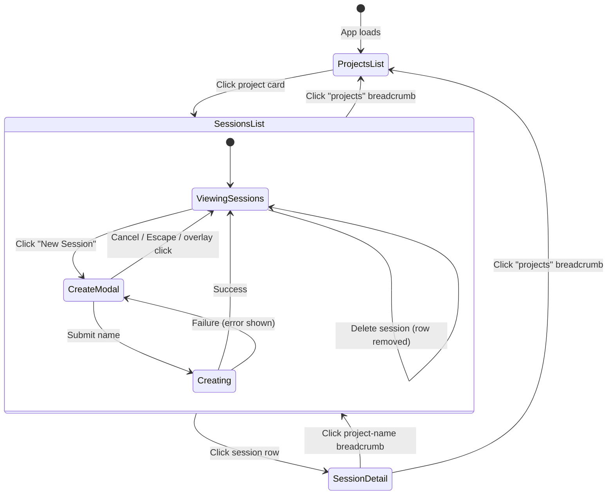
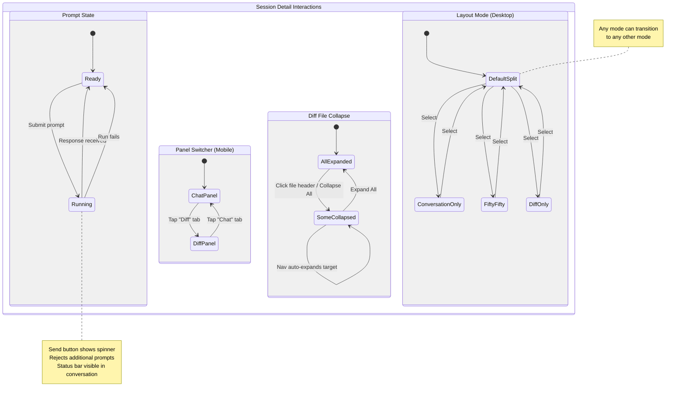

# Command Center — UI Requirements

## App Summary

- Web-based UI for a single developer to remotely monitor and control Claude Code coding sessions across multiple git repositories
- Three views: project list, session list per project, and session detail (conversation + diff)
- Responsive interface accessed over a Tailscale tailnet from desktop browsers, tablets, and phones
- Single-user, dark-themed interface optimized for information density on large screens and usability on small screens

## Design Principles

### Vertical Space Is Sacred

- Session detail view maximizes content area for conversation and diffs
- Controls live in the topbar or inline panel headers — never in standalone toolbars or secondary nav bars
- Information density increases as the user drills deeper: projects (spacious cards) → sessions (table rows) → detail (full-bleed panels)

### One Source of Truth Per Datum

- If the breadcrumb shows the session name, no heading repeats it
- If status is visible in the topbar, it does not also appear in the panel
- Semantic color is the only decorative flourish: cyan = active/primary, green = ready/additions, amber = warning/user content, red = danger/deletions

### Monospace Data Identity

- All data-display text uses the monospace font: paths, branch names, timestamps, counters, button labels, table cells, breadcrumb segments, metadata values
- The body/proportional font is used only for conversation message prose
- The display font is used only for page titles, the logo, and modal titles

### Responsive, Not Stripped Down

- Mobile is a first-class experience, not a degraded desktop view
- Every feature is accessible on every screen size; nothing is hidden or removed on mobile
- Desktop uses density and side-by-side panels; mobile uses vertical stacking and panel switching
- Touch targets meet minimum 44px on mobile; desktop retains compact sizing for pointer use

## Requirements

### FR1: App Shell and Topbar

- Sticky topbar pinned to the top of every view
- **Left side**: app logo ("CC" in display font, cyan with glow) + vertical divider + breadcrumb
- **Right side**: context-aware controls that swap based on the current view
- Frosted-glass topbar background (semi-transparent dark with backdrop blur)
- Topbar height is fixed; content area fills the remaining viewport
- On mobile: topbar condenses — logo abbreviates if needed, breadcrumb truncates (see FR2), and session controls move to a bottom action bar (see FR3)

### FR2: Breadcrumb Navigation

- Breadcrumb in the topbar is the sole navigation mechanism
- Format by depth:
  - Projects: `projects`
  - Sessions: `projects / {project-name}`
  - Detail: `projects / {project-name} / {session-name}`
- Each segment is a clickable link that navigates to that level
- Separator characters are dim/tertiary color
- Session name segment (deepest level) is visually emphasized (brighter, bolder)
- No other navigation bars, tab strips, or view switchers exist
- On mobile: breadcrumb truncates intermediate segments when space is constrained — shows a back-arrow icon + current segment name (e.g., `← implement-ui`), tapping the arrow navigates one level up

### FR3: Context-Aware Topbar Controls

- On non-detail views, topbar right side shows:
  - Hooks status indicator (pulsing green dot + "hooks active" label)
  - Running session count indicator (amber dot + "N session running" label)
- On session detail view, topbar right side shows:
  - Session running status (pulsing cyan dot + "running" label, or idle)
  - Vertical separator
  - Layout switcher (see FR9)
  - Vertical separator
  - Refresh icon button (with tooltip)
  - Delete icon button (with tooltip, danger-colored on hover)
- On mobile (non-detail views): status indicators show dots only (labels hidden) to save horizontal space
- On mobile (session detail): session controls (layout switcher, refresh, delete) move to a **bottom action bar** pinned above the prompt input; topbar right side shows only the running status dot

### FR4: Projects List View

- Grid of project cards, responsive columns (auto-fill, minimum card width ~340px)
- Each card contains:
  - Project name (mono font, prominent)
  - Activity badge pill: "N active" (cyan background tint) or "idle" (neutral)
  - Repository path (mono, dim, truncated with ellipsis)
  - Stats row below a divider: session count, prompt count, time since last activity
- Card hover (pointer devices): border brightens, background elevates, subtle upward lift, cyan gradient line fades in across top edge
- Tapping/clicking a card navigates to that project's sessions list
- Page header: "Ground Control" title (display font) with base directory path as subtitle
- On mobile: cards stack in a single column at full width; page title scales down; base directory path truncates with ellipsis

### FR5: Sessions List View

- **Desktop**: full-width table with columns: Session, Branch, Status, Last Activity, Prompts, (delete action)
  - Table header row: tiny uppercase mono labels in dim color
  - Each body row is clickable (navigates to session detail), with hover background highlight
  - Column content:
    - Session name: mono, bold
    - Branch: mono chip with subtle background and border (e.g., `csm/implement-ui`)
    - Status: colored dot + uppercase label — Running (cyan, pulsing), Ready (green, glowing), Idle (dim, no glow)
    - Last Activity: relative timestamp (mono)
    - Prompts: count (mono)
    - Delete: danger-styled small button (stops click propagation)
- **Mobile**: table transforms into a stacked card list
  - Each card shows: session name, status dot + label, branch name, and last activity
  - Tapping a card navigates to session detail
  - Delete action available via swipe-to-reveal or a contextual action within the card
- Page header: project name as title (display font), repo path as subtitle
- "New Session" primary button above the list; on mobile this button spans full width

### FR6: Create Session Modal

- Full-screen overlay with blur effect, centered modal card
- Modal contains:
  - Title: "New Session"
  - Form field: session name input (mono font, placeholder "e.g. implement-auth")
  - Hint below input: "Branch will be created as csm/<session-name>"
  - Actions row: Cancel button (default style) + Create Session button (primary style)
- Modal closes on: overlay click, Escape key, or Cancel button
- Entry animation: overlay fades in, modal card slides up
- On duplicate name: error feedback on the input
- On creation failure: error feedback shown in the modal
- On mobile: modal becomes a full-width bottom sheet that slides up from the bottom edge; input auto-focuses and the sheet adjusts for the virtual keyboard; action buttons are full-width stacked

### FR7: Session Detail View

- Fills the entire viewport height below the topbar (reduced padding vs other views)
- **Desktop**: two-row grid layout:
  - **Row 1**: session info strip (auto height)
  - **Row 2**: content area (fills remaining space)
- **Mobile**: single-column layout
  - Info strip is hidden by default (expandable via a tap on a summary chip showing branch name + status)
  - Content area shows one panel at a time (conversation or diff), controlled by a panel tab switcher (see FR9)
  - Prompt input area is pinned to the bottom of the viewport (above safe area insets), visible regardless of which panel is active

#### FR7.1: Session Info Strip

- **Desktop**: ultra-compact horizontal bar (~28px)
  - Displays label-value pairs separated by thin vertical lines:
    - Branch name
    - Created date/time
    - Prompt count
    - Worktree path (dimmer opacity)
  - Labels: tiny uppercase mono text, dim color
  - Values: mono text, secondary color
  - Wraps items on narrow tablet viewports
- **Mobile**: collapsed by default into a single-line summary chip (branch name + status dot); tapping the chip expands to show all metadata fields stacked vertically

#### FR7.2: Content Area

- Two-panel grid: conversation panel (left/main) + diff panel (right/secondary)
- Panel arrangement controlled by layout mode (see FR9)

### FR8: Conversation Panel

- Flex column with three zones: panel header, scrollable body, prompt input area

#### FR8.1: Panel Header

- Left: "Conversation" label (uppercase mono)
- Right: message navigation controls
  - Up arrow button, message counter (e.g., "1 / 4"), down arrow button
  - Arrows scroll the conversation to the previous/next message
  - Counter auto-updates as user scrolls manually (tracks nearest visible message)

#### FR8.2: Conversation Body

- Scrollable area showing all messages in chronological order
- Each message has:
  - Role label: "You" (amber) or "Claude" (cyan), tiny uppercase mono
  - Content body: proportional/body font for prose
  - Assistant messages have a left border accent with left padding
- Inline code: mono font, cyan color, subtle raised background
- Code blocks: mono font, dark inset background, rounded border, horizontal scroll
- When a prompt is running: a spinner + status text bar appears above the conversation ("Claude is working... <task description>")

#### FR8.3: Prompt Input Area

- Pinned to the bottom of the conversation panel (not scrollable)
- Textarea (mono font) + square send button side by side
- Textarea: auto-height with min/max constraints, placeholder "Send a prompt to Claude..."
- Send button states:
  - Ready: solid cyan background, dark icon/text
  - Busy: outlined with animated pulsing border, cyan spinner inside, tooltip "Session is busy"
- When busy, prompt submission is blocked
- On mobile: prompt input is pinned to the bottom of the viewport (not inside the conversation panel), respects safe area insets, and adjusts position when the virtual keyboard is open; send button meets minimum 44px touch target

### FR9: Layout Modes

#### Desktop (>768px)

- Four modes for the content area panel arrangement:
  - **Conversation only**: conversation panel full width, diff panel hidden
  - **Default split**: conversation panel takes majority, diff panel takes a fixed-width right column
  - **50/50 split**: both panels share equal width
  - **Diff only**: diff panel full width, conversation panel hidden
- Layout switcher appears in the topbar (session detail view only)
- Switcher is a grouped button bar with four icon buttons
- Each button contains an SVG icon visually depicting that layout's panel arrangement
- Active mode button is highlighted (cyan background, dark icon)
- Tooltips on hover: "Conversation only", "Default split", "50 / 50 split", "Diff only"
- Layout selection persists per session
- At tablet widths (768–900px), split modes use stacked vertical layout instead of side-by-side

#### Mobile (≤768px)

- Side-by-side layouts are not available; only one panel is visible at a time
- A **panel tab switcher** replaces the layout switcher — two tabs: "Chat" and "Diff"
- Tab switcher appears in the bottom action bar (see FR3) or as a segmented control above the content area
- Tapping a tab instantly swaps the visible panel
- The conversation panel is shown by default
- Panel selection persists within the session

### FR10: Diff Panel

- Flex column with three zones: panel header, diff toolbar, scrollable diff content

#### FR10.1: Panel Header

- Left: "Diff vs main" label (uppercase mono)
- Right: total additions (green) and deletions (red) count + file count

#### FR10.2: Diff Toolbar

- Compact horizontal strip below the panel header
- Three control groups separated by thin vertical lines:
  1. **Collapse/Expand**: two icon buttons — collapse all files, expand all files (with title tooltips)
  2. **File navigation**: prev/next buttons flanking a "Files" label — scrolls to the previous/next file header
  3. **Change navigation**: prev/next buttons flanking a "Changes" label — scrolls to the previous/next hunk marker (`@@`)
- Navigation buttons auto-expand collapsed file sections when the target is within a collapsed section
- On mobile: toolbar buttons enlarge to meet 44px minimum touch targets; labels ("Files", "Changes") are hidden, leaving only icon buttons; toolbar scrolls horizontally if needed

#### FR10.3: Diff Content

- Scrollable area containing file sections
- Each **file section** consists of:
  - **File header** (sticky to top of scroll container):
    - Collapse chevron (rotates when collapsed)
    - File path (truncated with ellipsis if long)
    - Per-file stats: additions count (green), deletions count (red)
    - New-file indicator where applicable
    - Clickable — toggles collapse of that file's diff lines
    - Hover: background highlights
  - **Diff lines** (collapsible):
    - Hunk headers (`@@`): cyan-tinted background, mono font
    - Addition lines: green text, green left border, subtle green background tint
    - Deletion lines: red text, red left border, subtle red background tint
    - Context lines: dim text, no border highlight
- Collapsed files hide all diff lines, showing only the file header

### FR11: Session Deletion

- Delete action available from:
  - Sessions list: per-row danger button (desktop) or swipe/contextual action (mobile)
  - Session detail: icon button in topbar (desktop) or bottom action bar (mobile)
- Both entry points trigger the same deletion behavior
- Deletion requires a confirmation step (dialog or bottom sheet)
- After deletion: user returns to / remains on the sessions list

### FR12: Hooks Status Banner

- When hooks are not installed, a warning banner appears below the topbar on list views
- Banner: amber-tinted background with amber border, icon, explanatory text, and action button/link
- When hooks are active, the topbar shows a green pulsing dot + "hooks active" indicator instead

### FR13: Empty States

- When a project has no sessions: centered empty state with icon, title ("No sessions yet"), and descriptive text
- When no projects are discovered: centered empty state with guidance

### FR14: Staggered Page Transitions

- When navigating between views, direct children of the content area animate in sequentially
- Each child fades in and slides up slightly, with incrementally increasing delay
- Animations are brief (~350ms per item, ~50ms stagger between items)
- Re-triggered on each view change

### NFR1: Platform

- Desktop browsers (Chrome, Firefox, Safari, Edge), tablet browsers, and mobile browsers (iOS Safari, Android Chrome)
- Tailnet-only access; no public URL
- Single concurrent user
- Minimum supported viewport: 320px wide (iPhone SE)

### NFR2: Visual Theme

- Dark theme throughout; deep blue-black background tones, never pure black
- Subtle atmospheric effects (noise grain overlay, scan-line texture) for visual character
- Frosted glass topbar with semi-transparent background and backdrop blur
- Semantic accent colors with glow effects (not flat): cyan glows for active states, green glows for ready/success, amber glows for warnings, red glows for danger
- Styled scrollbars (thin, dark, subtle)

### NFR3: Typography Contract

- Three font families with strict usage boundaries:
  - Display font: page titles, app logo, modal titles only
  - Monospace font: all controls, labels, navigation, metadata, data values, buttons, inputs, code, diffs, tables, badges
  - Body font: conversation message prose content only
- Violating font assignments breaks the visual identity

### NFR4: Interaction Feedback

- **Pointer devices**: all interactive elements have visible hover states (background change, border brightening, or color shift); icon-only buttons show tooltip labels on hover
- **Touch devices**: interactive elements show a brief active/pressed state on tap (background flash or scale); no hover effects; no tooltips (labels must be discoverable without hover)
- Focus states use a cyan glow ring on form inputs (both pointer and touch)
- Status dots pulse with animation to indicate live/running states
- Transitions are brief (150ms for interactions, 250ms for layout changes)

### NFR5: Touch and Accessibility

- All tappable elements meet a minimum 44x44px touch target on mobile
- Adequate spacing between touch targets to prevent mis-taps (minimum 8px gap)
- Prompt textarea and modal inputs must not be obscured by the virtual keyboard
- Scroll containers support momentum/inertial scrolling on touch devices
- Diff content supports horizontal swipe/scroll for long lines
- No reliance on hover as the only way to access information or controls

### NFR6: Responsive Breakpoints

- **Desktop** (>900px): full experience — side-by-side panels, table layouts, compact topbar controls, hover interactions
- **Tablet** (768–900px): split layouts stack vertically, project card grid collapses to 1–2 columns, session info strip wraps, topbar controls reduce spacing
- **Mobile** (≤768px): single-panel mode with tab switcher, sessions as card list, breadcrumb collapses to back-arrow + current name, session controls move to bottom action bar, modal becomes bottom sheet, prompt input pinned to viewport bottom with safe area respect, page titles scale down, touch targets enlarge to 44px minimum
